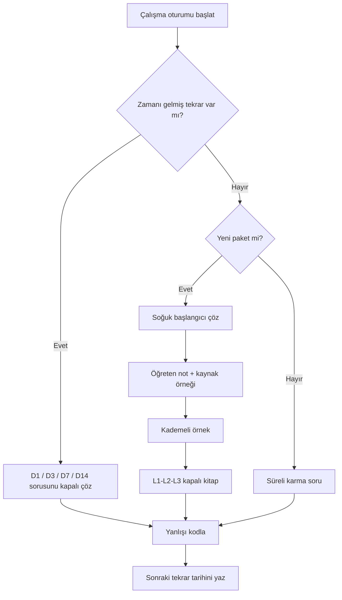

# Bütünleme Kumanda Merkezi

> [!danger] Ana kural
> Okumak çalışma değildir. Her oturumun ölçüsü, **not kapalıyken doğru yöntem seçmek ve hesabı tamamlamaktır**.

## Şimdi ne yapmalıyım?

1. [[00 Pano/Çalışma Takibi|Çalışma Takibi]] sayfasında zamanı gelen tekrarı seç.
2. Yöntemi bilmiyorsan [[00 Pano/Yöntem Seçici|Yöntem Seçici]] üzerinden yalnız soru sinyallerine bak.
3. İlgili [[09 Öğrenme Paketleri/Öğrenme Paketleri|öğrenme paketini]] çöz.
4. Sonucu [[08 Hesaplamalar/Sınav Doğrulama Raporu|NumPy doğrulama raporu]] ile kontrol et.
5. Yanlışı `YÖN`, `MOD`, `VER`, `İŞL`, `BİR`, `YUV` veya `YOR` koduyla kaydet.

## Kapsam stratejisi

Range açıklanmadığı için hazırlık iki katmanlıdır:

| Katman | Amaç | İçerik |
|---|---|---|
| Hesap çekirdeği | Puan getiren çok adımlı işlemler | HF02-HF12 arasındaki 26 paket |
| Kavramsal çatı | Yöntem seçimi ve yorum | HF01, [[02 Kavramlar/Tesis Planlama Kavram Ağı|Kavram Ağı]], karşılaştırma tabloları |

> [!tip] Öncelik
> İlk tur: HF03-HF04 → HF07-HF10 → HF11-HF12 → HF02 → HF05-HF06. Range açıklandığında kapsam dışı paketleri dondur, silme.

## Hesap kümeleri

### 1. Kapasite, fire ve kaynak

- [[09 Öğrenme Paketleri/HF02A - Kapasite ve Tek Ürün Başa Baş|Kapasite ve tek ürün başa baş]]
- [[09 Öğrenme Paketleri/HF02B - Çok Ürün Başa Baş ve Yap Satın Al|Çok ürün başa baş ve yap-satın al]]
- [[09 Öğrenme Paketleri/HF02C - Dinamik Kapasite Büyümesi|Dinamik kapasite büyümesi]]
- [[09 Öğrenme Paketleri/HF03 - Rassal Iskarta Payı|Rassal ıskarta]]
- [[09 Öğrenme Paketleri/HF04A - Fire ve Donanım Gereksinimi|Fire ve donanım]]
- [[09 Öğrenme Paketleri/HF04B - Operatör Makine Atama|Operatör-makine atama]]

### 2. Akış, hücre ve alan

- [[09 Öğrenme Paketleri/HF05A - DCA ve ROC Hücre Oluşturma|DCA ve ROC]]
- [[09 Öğrenme Paketleri/HF05B - Küme Maliyet Analizi ve Hollier|Küme maliyeti ve Hollier]]
- [[09 Öğrenme Paketleri/HF06A - MAG Akış Şiddeti ve From-To Matrisi|MAG ve from-to]]
- [[09 Öğrenme Paketleri/HF06B - Faaliyet İlişki Diyagramı ve Alan Hesabı|REL ve alan]]

### 3. Yerleşim tasarımı

- [[09 Öğrenme Paketleri/HF07A - Süreç Yerleşimi Taşıma Maliyeti|Taşıma maliyeti]]
- [[09 Öğrenme Paketleri/HF07B - Komşuluk ve Uzaklık Esaslı Puanlama|Komşuluk ve uzaklık puanı]]
- [[09 Öğrenme Paketleri/HF07C - İlişki Diyagramı Kurma|İlişki diyagramı]]
- [[09 Öğrenme Paketleri/HF08A - İkili Yer Değişim Yöntemi|İkili yer değişimi]]
- [[09 Öğrenme Paketleri/HF08B - Grafik Tabanlı Yerleşim|Grafik tabanlı yerleşim]]
- [[09 Öğrenme Paketleri/HF08C - CRAFT Yöntemi|CRAFT]]
- [[09 Öğrenme Paketleri/HF09A - MCRAFT|MCRAFT]] · [[09 Öğrenme Paketleri/HF09B - BLOCPLAN|BLOCPLAN]] · [[09 Öğrenme Paketleri/HF09C - LOGIC ve Kesim Ağacı|LOGIC]]
- [[09 Öğrenme Paketleri/HF10A - CORELAP|CORELAP]] · [[09 Öğrenme Paketleri/HF10B - ALDEP|ALDEP]] · [[09 Öğrenme Paketleri/HF10C - MULTIPLE|MULTIPLE]]

### 4. Tesis konumu

- [[09 Öğrenme Paketleri/HF11A - Minisum ve Ağırlıklı Medyan|Minisum]]
- [[09 Öğrenme Paketleri/HF11B - Minimax ve Optimum Çözüm Kümesi|Minimax]]
- [[09 Öğrenme Paketleri/HF12A - Konum Atama ve Tesis Sayısı|Konum-atama]]
- [[09 Öğrenme Paketleri/HF12B - Kesikli Tesis Konumu ve Açma Atama|Kesikli açma-atama]]

## Hata kodları

| Kod | Hata | Düzeltme sorusu |
|:---:|---|---|
| `YÖN` | Yanlış yöntem | Soru hangi çıktıyı ve amaç yönünü istiyor? |
| `MOD` | Eksik/yanlış model | Değişkenler, amaç ve kısıtlar tam mı? |
| `VER` | Veriyi yanlış aktarma | Matris yönü, birim ve indisler doğru mu? |
| `İŞL` | Aritmetik/cebir | Ara toplamla bağımsız kontrol yaptım mı? |
| `BİR` | Birim | Sonuç adet, TL, MAG, metre veya alan mı? |
| `YUV` | Yuvarlama | Tam sayı kararını doğru yönde yuvarladım mı? |
| `YOR` | Karar cümlesi | Sayının operasyonel anlamını yazdım mı? |

## Sınav provası protokolü

1. 5 dakika: soruları `kapasite / akış / yerleşim / konum` diye sınıflandır.
2. Her soru için verilen, istenen, yöntem ve birimi dört satırda yaz.
3. Matris sorularında satır ve sütun anlamlarını kenara not et.
4. Tam sayı kararlarında kesirli sonucu ve uygulanabilir yuvarlanmış sonucu birlikte göster.
5. Son 10 dakika: yön, birim, indis, toplam ve karar cümlesi kontrolü yap.

## Merkez bağlantıları

- [[00 Pano/Bütünleme Çalışma Kitabı|Bütünleme Çalışma Kitabı]]
- [[00 Pano/Yöntem Seçici|Yöntem Seçici]]
- [[02 Kavramlar/Tesis Planlama Kavram Ağı|Tesis Planlama Kavram Ağı]]
- [[03 Formüller/Formül Föyü|Formül ve Kontrol Föyü]]
- [[07 Ekler/Diyagramlar/Görsel Atlas|Görsel Atlas]]
- [[08 Hesaplamalar/Sınav Doğrulama Raporu|Sınav Doğrulama Raporu]]
- [[04 Sorular/Karma Soru Havuzu|Karma Soru Havuzu]]
- [[10 Denemeler/Deneme 01 - Hesap Odaklı|Deneme 01]]
- [[00 Pano/Kaynak Doğrulama ve Düzeltmeler|Kaynak Doğrulama ve Düzeltmeler]]
- [[00 Pano/Kanıta Dayalı Öğrenme Sistemi|Kanıta Dayalı Öğrenme Sistemi]]
