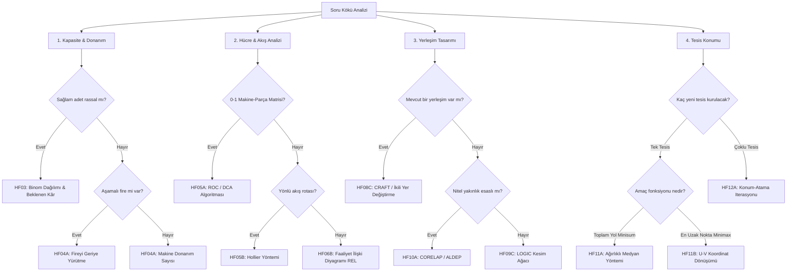

# Bütünleme Çalışma Kılavuzu: Tesis Planlama 2. Beyin

> [!important] Bilimsel Çalışma Kuralı
> Tesis Planlama gibi hesap yoğun bir derste **okumak çalışma değildir**. Zihinsel kasların gelişmesi için **not kapalıyken (Active Recall)** formülleri geri getirmeli, **aralıklı tekrarlarla (Spaced Repetition)** unutma eğrisini kırmalı ve hesapları **NumPy doğrulama motoruyla** test etmelisiniz.

---

## 1. Yöntem Karar Ağacı (Decision Tree)

Sınavda karşılaştığınız soruda hangi yöntemi seçeceğinizi belirlemek için aşağıdaki akış diyagramını kullanın:



---

## 2. Bilimsel Formül Atlası (LaTeX)

### 2.1 Kapasite, Başa Baş ve Aşamalı Fire

#### Çok Ürünlü Başa Baş Noktası (Weighted Contribution Margin)
Çok ürünlü üretim sistemlerinde ağırlıklı katkı payı oranı ($WCM$) ve başa baş satış hacmi ($BEP_{TL}$) şöyle hesaplanır:
$$WCM = \sum_{i=1}^{n} \left[ \left( \frac{Price_i - VarCost_i}{Price_i} \right) \times \left( \frac{SalesVolume_i \times Price_i}{\sum_{j} SalesVolume_j \times Price_j} \right) \right]$$

$$BEP_{TL} = \frac{FixedCost}{WCM}$$

#### Düşük Hacimde Rassal Iskarta Payı (Binom Dağılımı)
$Q$ adet siparişten sağlam çıkan ürün sayısı $X \sim \operatorname{Bin}(Q, p)$ olsun. Tam $d$ adet sağlam ürün gereksinimi varsa, siparişin kabul edilme olasılığı:
$$P(X \ge d) = \sum_{x=d}^{Q} \binom{Q}{x} p^x (1-p)^{Q-x}$$

Beklenen Kâr fonksiyonu:
$$E[\Pi(Q)] = Revenue_{total} \times P(X \ge d) - UnitCost \times Q$$

#### Aşamalı Fire ve Donanım Hesabı
Sıralı operasyonlarda ($1, 2, \dots, N$) her aşamanın fire oranı $s_i$ ise, nihai $O_N$ sağlam ürün elde etmek için sisteme verilmesi gereken ham malzeme $I_1$ geriye yürütülerek hesaplanır:
$$I_N = \frac{O_N}{1 - s_N} \implies I_{i-1} = \frac{\lceil I_i \rceil}{1 - s_{i-1}} \qquad (\text{Tamsayı Operasyon Şartı})$$

Gerekli makine sayısı ($F$):
$$F = \left\lceil \frac{StandardTime \times InputQuantity}{AvailableTime \times Performance \times Reliability} \right\rceil$$

---

### 2.2 Hücre Oluşturma ve Akış Analizi

#### DCA / ROC (Rank Order Clustering) Algoritması
Makine-parça matrisinde ($a_{ij} \in \{0, 1\}$) satır ve sütunlar için ikili ağırlık skorları hesaplanır:
$$\text{Satır Skoru}_i = \sum_{j=1}^{C} a_{ij} 2^{C - j} \qquad \text{Sütun Skoru}_j = \sum_{i=1}^{R} a_{ij} 2^{R - i}$$

#### Hollier Yöntemi (Sıralama Oranı)
From-To akış matrisinden her bölümün toplam giriş ($I_j$) ve çıkış ($O_i$) akışları toplanır:
$$O_i = \sum_{j=1}^{n} f_{ij}, \qquad I_j = \sum_{i=1}^{n} f_{ij}$$

Rasyonel sıralama oranı ($Ratio_i$) büyükten küçüğe dizilerek yerleşim sırası oluşturulur:
$$Ratio_i = \frac{O_i}{I_i}$$

---

### 2.3 Yerleşim Tasarımı ve Algoritmaları

#### Süreç Yerleşim Taşıma Maliyeti
Sistemdeki toplam malzeme taşıma maliyeti ($Z$):
$$Z = \sum_{i=1}^{n} \sum_{j=1}^{n} f_{ij} \times d_{p(i), p(j)} \times c_{ij}$$
Burada $f_{ij}$ akışı, $d_{p(i), p(j)}$ tesisler arası mesafeyi, $c_{ij}$ ise birim taşıma maliyetini ifade eder.

#### CRAFT İkili Değişim Mantığı
İki komşu veya eşit alanlı bölümün yerleri takas edildiğinde, yeni ağırlık merkezleri ($x'_i, y'_i$) üzerinden yeni mesafe matrisi ($d'$) ve taşıma maliyeti ($Z'$) hesaplanır. Eğer $\Delta Z = Z' - Z < 0$ ise takas kalıcı hale getirilir.

---

### 2.4 Tesis Konumu Modelleri

#### Minisum (Dikdoğrusal Ağırlıklı Medyan)
Toplam ağırlıklı mesafeyi minimize eden tek yeni tesis $X=(x, y)$ konumu:
$$\min f(x,y) = \sum_{i=1}^{m} w_i \left( |x - a_i| + |y - b_i| \right)$$
$x$ ve $y$ eksenleri birbirinden bağımsız olarak çözülür. Kümülatif ağırlıkların toplam ağırlığın yarısına ($\sum w_i / 2$) ulaştığı aralık optimumdur.

#### Minimax (U-V Dönüşümü)
Maksimum dikdoğrusal mesafeyi minimize etmek için $u$ ve $v$ koordinat dönüşümü uygulanır:
$$u_i = a_i + b_i, \qquad v_i = a_i - b_i \qquad \forall i$$
$$R^* = \frac{1}{2} \max \left( u_{\max} - u_{\min}, \; v_{\max} - v_{\min} \right)$$
Optimum dönüştürülmüş koordinat aralıkları:
$$U^* = [u_{\max} - R^*, \; u_{\min} + R^*]$$
$$V^* = [v_{\max} - R^*, \; v_{\min} + R^*]$$
Ters dönüşüm formülüyle gerçek $(x,y)$ düzlemine geri dönülür:
$$x = \frac{u + v}{2}, \qquad y = \frac{u - v}{2}$$

---

## 3. NumPy ile Sayısal Doğrulama Laboratuvarı (Python)

Bu kod bloklarını çalıştırarak kâğıt üzerindeki çözümlerinizi anında doğrulayabilirsiniz.

### 3.1 Minimax Çözüm Kümesi ve Grafik Çizimi

```python
import numpy as np
import matplotlib.pyplot as plt

# Mevcut tesis koordinatları
points = np.array([(0, 0), (4, 6), (8, 2), (10, 4), (4, 8), (2, 4), (6, 4), (8, 8)])

# U-V Dönüşümü
u = points[:, 0] + points[:, 1]
v = points[:, 0] - points[:, 1]

delta_u = u.max() - u.min()
delta_v = v.max() - v.min()

R_star = max(delta_u, delta_v) / 2
print(f"Optimum Yarıçap (R*): {R_star}")

u_range = (u.max() - R_star, u.min() + R_star)
v_range = (v.max() - R_star, v.min() + R_star)
print(f"U* Aralığı: {u_range}, V* Aralığı: {v_range}")

# Optimum uç noktalar (ters dönüşüm)
corners = []
for ut in u_range:
    for vt in v_range:
        x = (ut + vt) / 2
        y = (ut - vt) / 2
        if (x, y) not in corners:
            corners.append((x, y))

print(f"Optimum Konum Köşeleri: {corners}")

# Matplotlib Görselleştirme
fig, ax = plt.subplots(figsize=(6, 6))
ax.scatter(points[:,0], points[:,1], color='blue', label='Mevcut Noktalar', zorder=3)
for idx, p in enumerate(points):
    ax.annotate(f"P{idx+1}({p[0]},{p[1]})", (p[0], p[1]), xytext=(5,2), textcoords='offset points', fontsize=9)

# Çözüm aralığını çizdirme
c_arr = np.array(corners)
ax.plot(c_arr[:,0], c_arr[:,1], color='red', linewidth=3, label='Optimum Çözüm Doğrusu', zorder=2)
ax.scatter(c_arr[:,0], c_arr[:,1], color='red', marker='X', s=100, zorder=4)

ax.set_title("Dikdoğrusal Minimax Çözüm Kümesi")
ax.set_xlabel("X Koordinatı")
ax.set_ylabel("Y Koordinatı")
ax.grid(True, alpha=0.3)
ax.legend()
plt.show()
```

### 3.2 DCA / ROC Matris İteratörü

```python
def run_roc(matrix):
    data = np.array(matrix, dtype=int)
    R, C = data.shape
    row_idx = np.arange(R)
    col_idx = np.arange(C)
    
    for step in range(1, 20):
        # Satır sıralama
        r_weights = 2 ** np.arange(C - 1, -1, -1)
        r_scores = data @ r_weights
        sorted_rows = np.argsort(-r_scores, kind='stable')
        data = data[sorted_rows, :]
        row_idx = row_idx[sorted_rows]
        
        # Sütun sıralama
        c_weights = 2 ** np.arange(R - 1, -1, -1)
        c_scores = c_weights @ data
        sorted_cols = np.argsort(-c_scores, kind='stable')
        data = data[:, sorted_cols]
        col_idx = col_idx[sorted_cols]
        
        print(f"Adım {step}: Satırlar={row_idx+1}, Sütunlar={col_idx+1}")
    return data, row_idx + 1, col_idx + 1

# Örnek Matris
init_mat = [[1, 0, 1], 
            [0, 1, 1], 
            [1, 0, 0]]
final_matrix, rows, cols = run_roc(init_mat)
```

---

## 4. Hata Teşhis ve Kodlama Kılavuzu

Hata yapmak öğrenme sürecinin doğal bir parçasıdır. Önemli olan hatayı kategorize edip bir daha tekrarlamamaktır.

| Hata Kodu | Hata Türü | Tanım / Örnek Hata | Düzeltici Soru & Kontrol |
|:---:|---|---|---|
| **`YÖN`** | Yanlış Yöntem | Minisum sorusunda gidip minimax (u-v dönüşümü) uygulamak. | Soruda "toplam maliyet" mi yoksa "maksimum/en uzak mesafe" mi isteniyor? |
| **`MOD`** | Yanlış Model | Binom olasılığında parçalı kâr fonksiyonunu eksik veya yanlış tanımlamak. | Sipariş altındaki teslimatların kabul şartları ve hurda gelirleri modele tam yansıdı mı? |
| **`VER`** | Veri Aktarımı | From-To matrisini doldururken yönleri (satır $\to$ sütun) ters yazmak. | Satırın "Çıkış/Kaynak", sütunun "Giriş/Hedef" olduğunu kontrol ettim mi? |
| **`İŞL`** | Aritmetik / Cebir | CRAFT el hesabında matris çarpımını toplarken toplama hatası yapmak. | Ara toplamları parça parça kağıda yazıp tersinden tekrar topladım mı? |
| **`BİR`** | Birim Hatası | Sonucu makine sayısı yerine parça/saat cinsinden bırakmak. | İstenen nihai birim nedir? (Adet, TL, makine, alan, metre) |
| **`YUV`** | Yuvarlama Hatası | Donanım hesabında $4.2$ çıkan makine ihtiyacını aşağı yuvarlayıp $4$ yazmak. | Kapasiteyi tam karşılamak için tamsayı yuvarlama yönü yukarı olmalı mı? |
| **`YOR`** | Karar Yorumu | Başa baş noktasını bulup "üretilmeli" kararını eksik açıklamak. | Çıkan sayının operasyonel veya finansal karşılığını karar cümlesiyle belirttim mi? |

---

## 5. Çalışma Şablonu (Kopyala ve Yeni Paket Oluştur)

Yeni bir konuyu çalışırken aşağıdaki yapıyı kopyalayıp ilgili paketin Markdown dosyasına yapıştırın:

```markdown
# HF[HaftaNo] - [Konu Başlığı]

## 🎯 Hedefler
- [ ] Yöntemin ne zaman kullanılacağını ayırt edebiliyorum.
- [ ] Matematiksel formülü/algoritmayı not kapalıyken kurabiliyorum.
- [ ] NumPy kodu yardımıyla sonuçlarımı doğrulayabiliyorum.

## ❄️ 0 - Soğuk Başlangıç
> [!question] Soru
> (Buraya konuya dair henüz çalışmadan önce çözeceğiniz küçük bir test sorusu yazın)

> [!answer]- Çözüm
> (Buraya doğru cevabı saklı bir şekilde yerleştirin)

## 📖 1 - Öğreten Not
- **Kullanım Koşulu:** ...
- **Kritik Varsayımlar:** ...
- **Matematiksel Model:**
  $$[Formül buraya]$$

## 📝 2 - Çözümlü Slayt Örneği
> [!example] Örnek (Slayt No: ...)
> **Verilenler:** ...
> **Çözüm Adımları:**
> 1. ...
> 2. ...
> **Karar Cümlesi:** ...

## 💻 3 - Python Doğrulama Kodu
```python
# Buraya ilgili konunun NumPy / Pandas doğrulama kodunu ekleyin.
```

## 🎯 4 - Çıkış Bileti (Exit Ticket)
*(Notu kapat ve kağıda yaz)*
1. Bu yöntemin en büyük tuzağı nedir?
2. Algoritmanın durma koşulu nedir?
```
