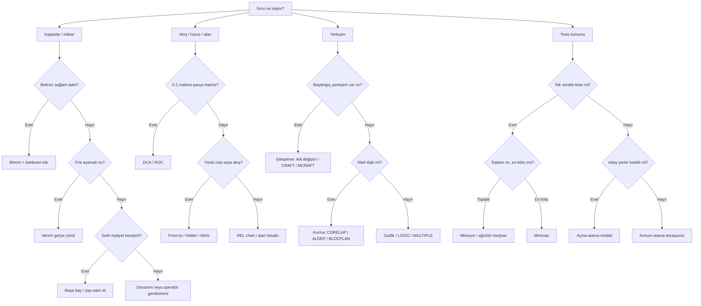

# Yöntem Seçici

> [!summary]
> Önce **çıktıyı**, sonra **veri türünü**, en son **amaç yönünü** tanı. Formül ezberinden önce yöntem seçimi gelir.

## Karar ağacı

## Soru sinyali → yöntem

| Soru sinyali | Yöntem | Amaç / sonuç | Paket |
|---|---|---|---|
| Gerçek kapasite / en iyi düzey | Kapasite kullanımı | Oranı bul | [[09 Öğrenme Paketleri/HF02A - Kapasite ve Tek Ürün Başa Baş|HF02A]] |
| Sabit, değişken, fiyat | Başa baş | Kârın sıfır olduğu miktar | [[09 Öğrenme Paketleri/HF02A - Kapasite ve Tek Ürün Başa Baş|HF02A]] |
| Ürün karması, satış oranı | Çok ürün başa baş | Ağırlıklı katkı marjı | [[09 Öğrenme Paketleri/HF02B - Çok Ürün Başa Baş ve Yap Satın Al|HF02B]] |
| Yatırım + iki birim maliyet | Yap-satın al | Eşit maliyet eşiği | [[09 Öğrenme Paketleri/HF02B - Çok Ürün Başa Baş ve Yap Satın Al|HF02B]] |
| Sağlam parça sayısı rassal | Binom + beklenen kâr | En yüksek beklenen kâr | [[09 Öğrenme Paketleri/HF03 - Rassal Iskarta Payı|HF03]] |
| Aşamalı fire yüzdeleri | Geriye fire hesabı | Gerekli ilk giriş | [[09 Öğrenme Paketleri/HF04A - Fire ve Donanım Gereksinimi|HF04A]] |
| Süre, talep, verim, güvenilirlik | Donanım gereksinimi | Makine sayısı, yukarı yuvarla | [[09 Öğrenme Paketleri/HF04A - Fire ve Donanım Gereksinimi|HF04A]] |
| İnsan ve makine etkin süreleri | Operatör-makine atama | En düşük çevrim/maliyet | [[09 Öğrenme Paketleri/HF04B - Operatör Makine Atama|HF04B]] |
| 0-1 makine-parça matrisi | DCA / ROC | Blok köşegen hücreler | [[09 Öğrenme Paketleri/HF05A - DCA ve ROC Hücre Oluşturma|HF05A]] |
| Hücre içi yönlü akış | Hollier | Makine sırası | [[09 Öğrenme Paketleri/HF05B - Küme Maliyet Analizi ve Hollier|HF05B]] |
| Malzeme hacmi ve özellikleri | MAG | Eşdeğer akış şiddeti | [[09 Öğrenme Paketleri/HF06A - MAG Akış Şiddeti ve From-To Matrisi|HF06A]] |
| Ürün rotaları | From-to | Yönlü akış matrisi | [[09 Öğrenme Paketleri/HF06A - MAG Akış Şiddeti ve From-To Matrisi|HF06A]] |
| A-E-I-O-U-X | REL / SLP | Yakınlık düzeni | [[09 Öğrenme Paketleri/HF06B - Faaliyet İlişki Diyagramı ve Alan Hesabı|HF06B]] |
| Akış × maliyet × uzaklık | Süreç yerleşim maliyeti | En küçük $\sum fcd$ | [[09 Öğrenme Paketleri/HF07A - Süreç Yerleşimi Taşıma Maliyeti|HF07A]] |
| Ortak sınır ve ilişki puanı | Komşuluk puanı | En büyük yakınlık puanı | [[09 Öğrenme Paketleri/HF07B - Komşuluk ve Uzaklık Esaslı Puanlama|HF07B]] |
| Mevcut yerleşimde takas | İkili değişim / CRAFT | Daha düşük taşıma maliyeti | [[09 Öğrenme Paketleri/HF08A - İkili Yer Değişim Yöntemi|HF08A]], [[09 Öğrenme Paketleri/HF08C - CRAFT Yöntemi|HF08C]] |
| Nitel ilişkiden kurma | CORELAP / ALDEP | Başlangıç yerleşimi | [[09 Öğrenme Paketleri/HF10A - CORELAP|HF10A]], [[09 Öğrenme Paketleri/HF10B - ALDEP|HF10B]] |
| Tek tesis, toplam dikdoğrusal uzaklık | Minisum | Ağırlıklı medyan | [[09 Öğrenme Paketleri/HF11A - Minisum ve Ağırlıklı Medyan|HF11A]] |
| Tek tesis, en büyük uzaklık | Minimax | En kötü uzaklığı küçült | [[09 Öğrenme Paketleri/HF11B - Minimax ve Optimum Çözüm Kümesi|HF11B]] |
| Birden çok sürekli tesis | Konum-atama | Atama ve medyanı tekrarla | [[09 Öğrenme Paketleri/HF12A - Konum Atama ve Tesis Sayısı|HF12A]] |
| Sabit açma + hizmet maliyeti | Kesikli tesis konumu | Açılacak adaylar ve atamalar | [[09 Öğrenme Paketleri/HF12B - Kesikli Tesis Konumu ve Açma Atama|HF12B]] |

## Karıştırılan yöntemler

| Çift | Ayıran soru |
|---|---|
| Minisum / minimax | Toplam maliyet mi, en kötü müşterinin uzaklığı mı? |
| CORELAP / CRAFT | Yerleşim sıfırdan mı kuruluyor, mevcut düzen mi iyileştiriliyor? |
| DCA-ROC / Hollier | Hücre üyeliği mi, hücre içi sıra mı aranıyor? |
| From-to / REL | Sayısal yönlü akış mı, nitel yakınlık gerekçesi mi? |
| BLOCPLAN / LOGIC | İlişki puanı mı, giyotin kesim ve uzaklık mı baskın? |
| Açma-atama / konum-atama | Aday yerler sabit ve ikili mi, koordinatlar serbest mi? |

## Amaç yönü kontrolü

- **Küçült:** maliyet, uzaklık, maksimum uzaklık, geri akış, açma + hizmet maliyeti.
- **Büyüt:** kâr, ilişki/komşuluk puanı, etkinlik oranı.
- **Eşitle:** başa baş ve yap-satın al eşiği.
- **Karşıla:** aday çözümler aynı sayım ve aynı birimle değerlendirilmelidir.

## Bağlantılar

- [[00 Pano/Bütünleme Kumanda Merkezi|Bütünleme Kumanda Merkezi]]
- [[02 Kavramlar/Tesis Planlama Kavram Ağı|Kavram Ağı]]
- [[03 Formüller/Formül Föyü|Formül Föyü]]
- [[07 Ekler/Diyagramlar/Görsel Atlas|Görsel Atlas]]

