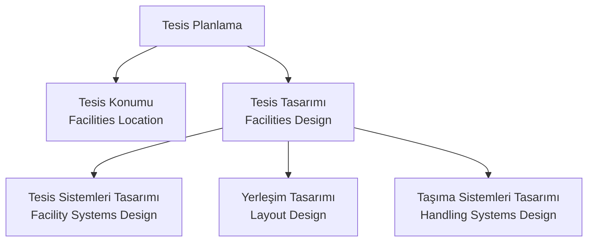
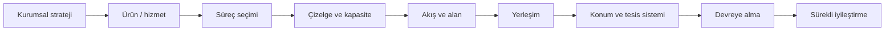
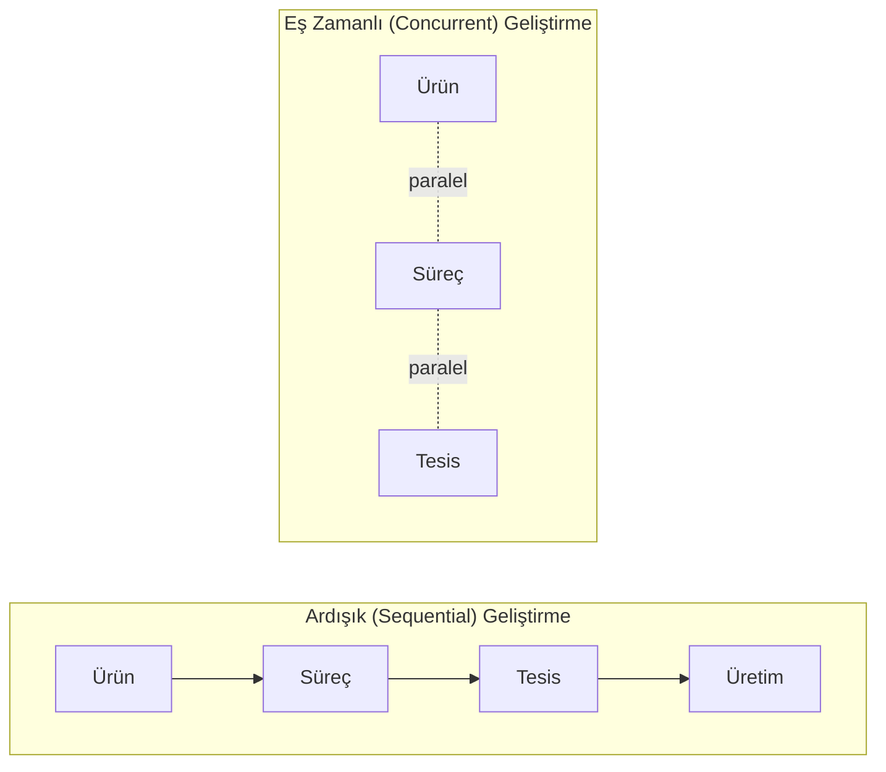

# HF01 - Giriş ve Ürün, Süreç, Çizelgeleme Tasarımı I

> [!summary] Ana fikir
> Tesis planlama; **konum, kapasite, yerleşim, taşıma sistemi ve destek altyapısını** kurumun stratejisiyle birlikte ele alan bütünleşik bir karar sürecidir. Tesis yalnız bina ve ekipmandan değil; onu kuran, çalıştıran ve bakımını yapan insanlardan, bilgiden, deneyimden ve ilişkilerden oluşur. Bu hafta ayrıca, "ne / nasıl / ne zaman / ne kadar / ne kadar süre üretilecek?" sorularını cevaplayan **ürün – süreç – çizelge tasarımı** üçlüsüne giriş yaparız.

![[07 Ekler/Diyagramlar/tesis-planlama-sureci.svg]]

## 1. Kavramsal Açıklama

### Tesis (facility) nedir, neden bu kadar geniş tanımlanır?

Slaytlardaki temel tanım: **Tesis, belli bir iş için kurulmuş, belirli bir amaca yönelik organize olmuş kurumsal bir yapıdır** (fabrika, atölye, depo, okul, hastane, hava üssü, rafineri…). Ancak ders, bu tanımı bilinçli olarak fiziki donanımın ötesine taşır:

> Tesis sadece bir alan ve buradaki fiziki donanımdan ibaret değildir. Tesisi tasarlayan, kuran, ayarlayan, çalıştıran, kullanan, bakımını yapan **insanlar**; tesisin çalıştırılmasına yön veren **bilgi, deneyim ve talimat** gibi elle tutulamayan unsurlar da bütünün parçalarıdır.

**Neden önemli?** Çünkü tesis planlama bir "çizim işi" değil, bir **sistem tasarımı**dır. Sadece makineleri yerleştirseniz bile, o makineleri besleyen bilgi akışını, vardiya düzenini ve bakım rutinini düşünmediğinizde tesis çalışmaz. Bu yüzden tesis planlama, Endüstri Mühendisliği'nin **ana (kor) alanlarından** biridir.

> [!info] Gerçek hayat ölçeği
> Slaytlara göre ABD'de 1955'ten bu yana her yıl milli gelirin yaklaşık **%8'i** yeni tesis kurmaya harcanır. Operasyonel harcamaların **%20–%50'sini** malzeme taşıma maliyetleri oluşturur ve iyi bir tesis planlaması bu maliyeti **en az %10–%30 azaltabilir**. Yani tesis planlama, doğrudan ulusal ekonomiyle ilişkili, yüksek kaldıraçlı bir mühendislik kararıdır.

### Tesis planlama nasıl çalışır? — Beş alt karar

Bir üretim işletmesi için tesis planlama, "üretimin en iyi nasıl gerçekleştirileceğini" belirlemektir. Slayt 26'ya göre bu karar beş bileşene ayrılır:

| Bileşen | İngilizce | Ne karar verir? | Örnek |
|---|---|---|---|
| Tesis konumu | Facilities location | Nerede kurulacak? | Pazara/hammaddeye yakınlık, iklim, işgücü, vergi |
| Tesis sistemleri | Facility systems design | Hangi altyapılar nereye? | Yapı, atmosferik, elektrik, iletişim, güvenlik, atık sistemleri |
| Yerleşim tasarımı | Layout design | Bölümler/makineler içeride nasıl dizilecek? | Blok yerleşim + detay yerleşim |
| Taşıma tasarımı | Handling systems design | Malzeme/insan/bilgi nasıl akacak? | Mal kabul, depolama, nakliye, paketleme |

### Stratejik – taktik – operasyonel düzeyler

| Karar düzeyi | Temel soru | Tipik çıktı |
|---|---|---|
| Stratejik | Nerede, ne büyüklükte ve kaç tesis? | Konum ve kapasite planı |
| Taktik | Bölümler nasıl ilişkilendirilmeli? | Blok yerleşim, akış sistemi |
| Operasyonel | İş istasyonları nasıl düzenlenmeli? | Detaylı yerleşim ve çalışma yöntemi |

### Tesis Planlama Süreci — 6 Adım

Tesis planlamasının standart mühendislik tasarım sürecini takip eden altı adımı:

1. **Tesisin amacını ve hedeflerini tanımla** — ne üretilecek, kim için, ne büyüklükte?
2. **Birincil ve destek faaliyetleri belirle** — ürün/süreç/çizelge tasarımı girdileri
3. **Faaliyet ilişkilerini sapta** — akış (from-to) ve yakınlık (REL) verileri
4. **Alan gereksinimini hesapla** — makine, operatör, destek, koridor payları
5. **Alternatif tesis planları üret ve değerlendir** — blok yerleşim alternatifleri
6. **En iyi planı seç, uygula ve sürekli gözden geçir** — devreye alma + iyileştirme

> [!tip] Akılda kalıcı — "TABAĞ"
> **T**anımla → **A**ktivite belirle → **B**ağları sapta → **A**lan hesapla → **G**eliştir/Değerlendir → **G**özden geçir
> Veya: *"Tesisi açmadan önce TABAğı doldurursun"* — 6 adımın sırası bir kez not edilince unutulmaz.
>
> HF01'den HF12'ye kadar her hafta bu sürecin bir adımını işler: HF03–HF04 = adım 2, HF05–HF06 = adım 3–4, HF07–HF10 = adım 5, HF11–HF12 = konum (adım 1'in küresel versiyonu).

### Girdi – dönüştürme – çıktı modeli (sistem yaklaşımı)

Slaytlar tesisi bir **dönüştürme sistemi** olarak ele alır: girdiler bir süreçten geçer, değer eklenir (value-added), çıktıya dönüşür. Geri besleme (feedback) ile sistem kendini düzeltir.

| Tesis | Girdiler | Süreç | Çıktı |
|---|---|---|---|
| Konserve fabrikası | Taze sebze, metal plaka, su, enerji, işçilik | Temizleme, kesme, pişirme, paketleme, etiketleme | Sebze konservesi |
| Hastane | Doktor, hemşire, ekipman, laboratuvar, ilaç | Muayene, cerrahi, izleme, terapi | Sağlıklı hasta |
| Hava üssü | Pilot, destek personeli, uçak, ekipman, tesisler | Komuta-kontrol, uçuş, bakım, destek | Etkin hava savunması |

> [!important] Sürekli faaliyet
> Tesis planı **tek seferlik çizim değildir**. Talep, teknoloji, ürün, güvenlik veya mevzuat değiştiğinde plan yeniden değerlendirilir. Slayt 50'ye göre yenileme gerekçeleri: ekonomik düşünceler, çalışan sağlık ve güvenliği, enerjinin korunması, toplum ve yetersizlik düşünceleri, yangın koruma ve çalınma riski.

### Tesislerin ana özellikleri (esneklik ailesi)

| Özellik | Anlamı |
|---|---|
| **Esneklik** (flexibility) | Hiçbir değişiklik yapmadan farklı gereksinimleri karşılayabilme |
| **Modülerlik** (modularity) | Üretim hızındaki geniş dalgalanmaları karşılayan modüler sistemler |
| **Güncellenebilirlik** (upgradeability) | Yeni teknoloji ve teçhizatın kolayca entegre edilebilmesi |
| **Uyarlanabilirlik** (adaptability) | Takvim, çevrim ve tepe değer dalgalanmalarına uyum |
| **Seçici işletilebilirlik** (selective operability) | Beklenmedik durumlarda bölüm bölüm plan geliştirebilme |

## 2. Ürün, Süreç ve Çizelge Tasarımı (Chapter 2'ye giriş)

Alternatif tesis planı geliştirmeden önce altı soru cevaplanmalıdır:

1. **Ne** üretilecek?
2. Ürünler **nasıl** üretilecek?
3. Ürünler **ne zaman** üretilecek?
4. Her üründen **ne kadar** üretilecek?
5. Ürünler **ne kadar süre** için üretilecek?
6. Ürünler **nerede** üretilecek? *(Bu soru global kaynak etkisiyle firma sınırları dışında da aranır.)*

İlk beş sorunun cevabı üç tasarım kararından gelir:

| Tasarım | Cevapladığı soru | Sorumlu | Tipik çıktı |
|---|---|---|---|
| **Ürün tasarımı** | Ne üretilecek? | Pazarlama, imalat, finans → son karar üst yönetim | Patlatılmış montaj çizimleri, parça resimleri, teknik resimler |
| **Süreç tasarımı** | Nasıl üretilecek? | Süreç mühendisleri | Operasyon, ekipman ve yöntem seçimi |
| **Çizelge tasarımı** | Ne zaman / ne kadar? | Üretim planlayıcıları | Üretim miktarları, ekipman çizelgesi |

> [!tip] Tesis planlayıcının rolü
> Tesis planlayıcı bu üç tasarımı **yapmaz**; ürün, süreç ve çizelge tasarımcılarından zaman içinde bilgi toplar ve dört grubu yakın koordinasyon içinde tutar. Tesis planlayıcının asıl girdileri ürün tasarımı tamamlandıktan sonra gelir: patlatılmış montaj çizimleri, patlatılmış parça resimleri, alt bileşen parça çizimleri, teknik resimler, prototipler ve fotoğraflar.

### Ürün tasarımı iki aşamada düşünülür

1. **Ürünün belirlenmesi:** Müşteri ihtiyacı, işlev, hedef maliyet ve performans. Tesisin misyonundaki belirsizlik yüksekse ve alan çok genelse, ürünlerin sık değişmesi muhtemeldir.
2. **Ayrıntılı tasarım:** Parçalar, toleranslar, malzemeler, montaj ve teknik resimler. Burada **Kalite Fonksiyon Yayılımı (QFD / Kalite Evi)** ile müşteri istekleri parça ve süreç gereksinimlerine dönüştürülür; **kıyaslama (benchmarking)** ile rakip yaklaşımları belirlenir.

### Tasarım değişikliğinin maliyeti — neden eş zamanlılık?

> [!warning] En kritik sayı
> İmalat maliyetlerinin **%70–%80'i tasarım fazında** sabitlenir veya ortaya çıkar. Geç yapılan tasarım değişiklikleri süreç maliyetlerini ciddi biçimde artırır. Bu nedenle ürün, süreç ve tesis tasarımı olabildiğince **eş zamanlı (concurrent / eş zamanlı mühendislik)** yürütülmelidir.

Ardışık yöntemde her aşama bitince diğeri başlar; geç fark edilen bir hata baştan başlatır. Eş zamanlı yöntemde aşamalar örtüşür, ilgili tüm birimler erken iletişim kurar, **değişken minimize edilir** ve geç değişiklik maliyeti düşer.

## 3. Tam Çözümlü Örnekler

### Örnek 1 — Üretim/hizmet karar aşamalarını bir tesise uygulamak (Havalimanı)

Slayt 92-96'daki uygulama, beş karar aşamasının somut bir tesise nasıl döküldüğünü gösterir.

> [!example] Soru
> İstanbul Havalimanı kararını, beş üretim/hizmet karar aşamasıyla (politika → ürün → süreç → tesis → çizelge) eşleştirin.

**Adım adım çözüm:**

| # | Aşama | Soru | Havalimanı karşılığı |
|---|---|---|---|
| 1 | Politika belirleme | "Ne için?" | Ulusal ulaşım altyapısını güçlendirmek, küresel hava taşımacılığı merkezi olmak |
| 2 | Ürün tasarımı | "Ne sunuluyor?" | Hava taşımacılığı hizmeti (yolcu, kargo, MRO bakım, VIP). Tasarım kriteri: kapasite, hizmet kalitesi, güvenlik |
| 3 | Süreç tasarımı | "Nasıl?" | Check-in, bagaj, güvenlik, boarding, apron operasyonları + otomasyon |
| 4 | Tesis tasarımı | "Nerede?" | Pist hâkim rüzgâr yönüne dik; yakıt ve bakım tesisleri piste yakın |
| 5 | Çizelgeleme | "Ne zaman?" | Uçuş saatleri, bakım slotları, vardiya planları; yoğun saat apron planlaması |

**Sonuç:** Bu beş aşama birlikte ele alındığında güvenli, sürdürülebilir ve yüksek kapasiteli bir sistem ortaya çıkar. Bir aşamanın diğerinden bağımsız tasarlanması (örneğin pisti rüzgârı düşünmeden konumlandırmak) tüm sistemi bozar.

### Örnek 2 — Tarihsel süreç ve yöntem evrimi (kavramsal)

> [!example] Soru
> Tesis planlama yöntemlerinin tarihsel gelişimini, "el ile sezgisel" yaklaşımdan "matematiksel/algoritmik" yaklaşıma geçişi vurgulayarak özetleyin.

**Adım adım çözüm (slayt 10-12):**

1. **Antik dönem (sezgi + gözlem):** MÖ 4000 Mısırlılar piramit yerini astrolojik hesapla buldu; Romalılar kamu ve yerleşim planları geliştirdi.
2. **Sanayi Devrimi (1700-1900):** Üretimin ölçeklenmesi düzenli yerleşim ihtiyacı doğurdu. 1913'te Henry Ford ilk **hareketli montaj hattını** kurdu.
3. **Matematikselleşme (1954-1995):** Tesis konumu, **Kuadratik Atama Problemi (QAP)** olarak modellendi; optimum ve sezgisel (heuristik) algoritmalar geliştirildi. 1959 Muther'in **Sistematik İşyeri Planlaması (SLP)**; 1963 **CRAFT** yazılımı (Armour & Buffa).
4. **Esneklik çağı (1980'ler):** Esnek üretim sistemleri, otomasyon.
5. **Modern (1990 →):** Dinamik düzen, robust düzen, **tekrar konfigüre edilebilir** yerleşimler.

**Sonuç:** Yöntem ekseni, "tek bir uzmanın sezgisi"nden "ölçülebilir amaç fonksiyonunu optimize eden algoritmalar"a kaymıştır. Bu, dersin ilerleyen haftalarındaki [[03 Formüller/Formül Föyü|nicel yöntemlerin]] (QAP, CRAFT, minisum, minimax) zeminini oluşturur.

## 4. Pratik Sorular

> [!question] S1 — Tanımları ayırma
> "Tesis konumu", "tesis tasarımı" ve "tesis sistemleri tasarımı" arasındaki farkı bir cümleyle ayırın ve her birine bir örnek verin.

> [!answer]- Çözüm
> - **Tesis konumu:** Tesisin *nerede* (hangi coğrafyada) kurulacağı — örn. pazara/hammaddeye yakınlık, iklim, vergi.
> - **Tesis tasarımı:** Seçilen yerde tesisin *bütün gerekliliklerinin bir araya getirilmesi* — yerleşim + sistemler + taşıma. Örn. fabrika binası ve hatların tasarımı.
> - **Tesis sistemleri tasarımı:** Tesis tasarımının bir *alt bileşeni*; yapı, elektrik, atmosferik, iletişim, güvenlik ve atık sistemlerinin hangi sistem, nereye ve nasıl entegre edileceğine karar verir. Örn. hangarın havalandırma ve yangın söndürme sisteminin yerleşimi.

> [!question] S2 — Malzeme taşıma vs. yerleşim sırası
> "Önce malzeme taşıma sistemini mi, yoksa tesis yerleşimini mi tasarlamalıyız?" Slayttaki cevabı gerekçesiyle yazın.

> [!answer]- Çözüm
> **Her ikisi birden — eş zamanlı (BOTH!).** Yerleşim, malzemenin nereden nereye akacağını belirler; taşıma sistemi ise bu akışın maliyetini ve hızını belirler. Biri diğerini doğrudan kısıtladığı için ardışık tasarım suboptimal sonuç verir. İkisi birlikte tasarlanırsa toplam taşıma + alan maliyeti minimize edilir.

> [!question] S3 — Eş zamanlı mühendislik gerekçesi
> İmalat maliyetinin yaklaşık %70'i tasarım fazında belirleniyorsa, bu durum "ardışık" yerine "eş zamanlı" geliştirmeyi neden zorunlu kılar?

> [!answer]- Çözüm
> Maliyetin büyük kısmı tasarımda *kilitlendiği* için, üretim aşamasına gelince düzeltme yapmanın hem maliyeti yüksek hem de etkisi sınırlıdır (kötü tasarım sabitlenmiştir). Eş zamanlı mühendislikte süreç ve tesis mühendisleri ürün daha tasarım masasındayken devreye girer; üretilebilirlik, montaj kolaylığı ve taşıma maliyeti henüz *ucuzken* iyileştirilir. Böylece geç ve pahalı tasarım değişiklikleri önlenir.

> [!question] S4 — Çoklu tesis stratejisi seçimi
> Bir savunma sanayi grubu, hem standart elektronik kartlar (yüksek hacim) hem de özel füze gövdeleri (düşük hacim, özel) üretmek istiyor. Hangi çoklu tesis stratejisi/stratejileri uygundur?

> [!answer]- Çözüm
> Slayt 71'deki seçenekler: ürün–tesis, pazar–tesis, ürün–pazar–tesis, proses–tesis, genel amaçlı tesis. Burada iki farklı ürün ailesi ve farklı hacim profili olduğu için **ürün–tesis stratejisi** mantıklıdır: standart kartlar için bir (ürün odaklı, seri üretim) tesis, özel gövdeler için ayrı bir (proses odaklı, esnek) tesis. Tek bir genel amaçlı tesis hem seri hem özel üretimi aynı çatı altında zorlar ve verimi düşürür. Bu seçim, [[HF03 - Ürün, Süreç ve Çizelgeleme Tasarımı II|HF03'teki]] hacim-çeşitlilik (Pareto) analizinin doğal bir sonucudur.

## 5. Karşılaştırma ve Karar Noktaları

### Üretim vs. hizmet odaklı tesis tasarımı

| Boyut | Üretim tesisi (fabrika) | Hizmet tesisi (hastane, okul) |
|---|---|---|
| Girdi/çıktı | Makine, malzeme, sermaye → ürün | İnsan → insan (sağlıklı hasta, mezun) |
| Baskın maliyet | Malzeme taşıma, ekipman | Personel, erişilebilirlik, bekleme |
| Yerleşim önceliği | Akış verimi, üretim hattı | Müşteri/hasta deneyimi, mesafe |

### TPY tasarımına etki eden dört ana etmen

> [!info] Slayt 38
> Bir tesis tasarlanırken dört etmen birlikte gözetilir: **(1) Müşteriler, (2) İç verim, (3) Çalışma ortamı ve çevresi, (4) Tedarik zincirine entegrasyon.** Bunların yanında 8 çevresel değişken (teknolojik, ekonomik, sosyolojik, kültürel, yasal, demografik, ekolojik) tasarımı dıştan etkiler.

## 6. Sık Yapılan Hatalar

> [!warning] Dikkat edilecekler
> - **Tesisi yalnız bina/makine sanmak.** İnsan, bilgi, deneyim ve ilişkiler de tesisin parçasıdır; bunları planlamadan tesis çalışmaz.
> - **Tesis planını tek seferlik proje sanmak.** Sürekli iyileştirilen bir döngüdür; talep/teknoloji/mevzuat değişince yeniden değerlendirilir.
> - **Yerleşim ve taşımayı ayrı zamanlarda tasarlamak.** İkisi eş zamanlı tasarlanmalıdır.
> - **Tasarım değişikliğini üretim fazına ertelemek.** Maliyetin %70-80'i tasarımda kilitlenir; geç değişiklik en pahalı düzeltmedir.
> - **"Çok para harcanıyorsa iyi planlanmıştır" varsayımı.** Fazla harcama, uygun planlama yapıldığını göstermez (slayt 44).

## 7. Sınav Kontrolü

- [ ] Tesis, tesis konumu, tesis tasarımı ve tesis sistemlerini ayırabiliyor muyum?
- [ ] Beş tesis planlama bileşenini (konum, sistem, yerleşim, taşıma + tasarım çatısı) sayabiliyor muyum?
- [ ] Ürün → süreç → çizelge tasarımının cevapladığı soruları eşleştirebiliyor muyum?
- [ ] Tasarım değişikliği maliyeti grafiğini ve eş zamanlı mühendislik gerekçesini açıklayabiliyor muyum?
- [ ] Girdi-dönüştürme-çıktı modelini fabrika/hastane/üs için kurabiliyor muyum?

## Bağlantılı paketler ve kaynaklar

- [[HF02 - Tesis Kapasite Planlama]] — "Ne kadar üretilecek?" sorusunun nicel cevabı (kapasite, başa baş).
- [[HF03 - Ürün, Süreç ve Çizelgeleme Tasarımı II]] — süreç tasarımının dokümanları, Pareto/hacim-çeşitlilik ve ıskarta payı.
- [[03 Formüller/Formül Föyü|Formül Föyü]] — dersin tüm nicel yöntemleri.
- [[HF1-P1-Giriş ve Ürün, Süreç ve Çizelgeleme Tasarımı I-2025.pptx|Ders sunumu]]
- [[05 Kaynaklar/MarkItDown/HF01 - Ham|MarkItDown ham metni]]
- [[Facilities-Planning-4E-TOMPKINS.pdf|Tompkins - Facilities Planning]]

Önceki: [[Ana Sayfa]] · Sonraki: [[HF02 - Tesis Kapasite Planlama]]
