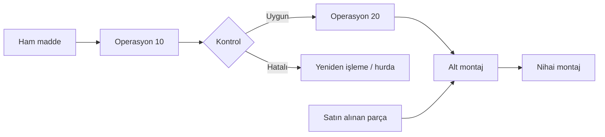
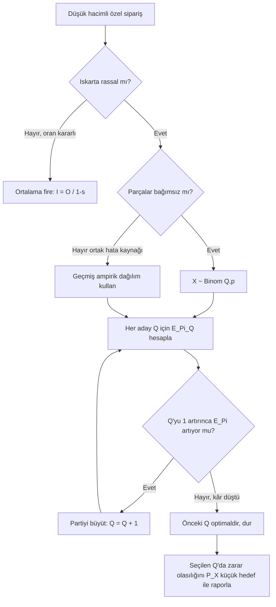

# HF03 - Ürün, Süreç ve Çizelgeleme Tasarımı II

> [!summary] Ana fikir
> Süreç tasarımı ürünün **hangi işlemlerle, hangi sırada ve hangi kaynaklarla** üretileceğini tanımlar; çizelge tasarımı bu yapıyı talep miktarına dönüştürür ve düşük hacimli üretimde ıskartanın **rassal** olduğu durumlarda kaç adet üretileceği binom dağılımı ile **beklenen kâr** maksimize edilerek bulunur.

## Süreç tasarımının üç kararı

1. **Süreci belirle:** Yap/satın al kararı, gerekli parçalar ve malzemeler.
2. **Süreci seç:** Alternatif yöntem, makine, teknoloji ve rota.
3. **Süreci sırala:** Montaj şeması, operasyon süreç şeması ve öncelik diyagramı.

| Doküman | Cevapladığı soru |
|---|---|
| Parça listesi | Ürün hangi parçalardan oluşur? |
| Malzeme listesi (BOM) | Ne kadar ve hangi malzeme gerekir? |
| Rota kartı | Parça hangi operasyonlardan geçer? |
| Montaj şeması | Bileşenler nasıl birleşir? |
| Operasyon süreç şeması | İşlem ve kontrollerin sırası nedir? |
| Öncelik diyagramı | Hangi görev hangisinden önce bitmelidir? |

## Pazarlama bilgisinden çizelgeye

Pazarlamadan beklenen veriler ürün karması, dönemsel talep, teslim zamanı, büyüme ve belirsizliktir. Pareto yaklaşımıyla az sayıdaki yüksek hacimli ürün, toplam üretimin büyük bölümünü oluşturabilir:

- yüksek hacim / düşük çeşitlilik → ürün odaklı akış (seri üretim / kütlesel üretim alanı),
- düşük hacim / yüksek çeşitlilik → süreç odaklı akış (atölye tipi üretim alanı),
- orta hacim / orta çeşitlilik → hücresel yaklaşım.

> [!tip] Pareto kuralı
> Üretim hacminin yaklaşık %80'i, ürün karmasının %20'si tarafından temsil edilir. Tesis planlanırken bu %20'lik baskın grup için standart hatlar, kalan %80 için esnek atölyeler kurulur. Hiçbir ürün akışta baskın değilse genel atölye tipi tesis önerilir.

### Süreç şeması sembolleri (ASME standardı)

Operasyon süreç şeması ve akış süreç şemaları standart ASME sembollerini kullanır:

| Sembol | İsim | Ne anlama gelir? |
|:---:|---|---|
| ○ | **Operasyon** | Malzeme veya ürün üzerinde fiziksel/kimyasal değişim; değer eklenir |
| □ | **Kontrol/Muayene** | Kalite veya miktar denetimi; değer eklenmez |
| ⇨ | **Taşıma** | Malzemenin bir yerden başka bir yere hareketi |
| D | **Gecikme** | Plansız, geçici bekleme |
| ▽ | **Depolama** | Planlı, izinli bekleme (stok, ambar) |

> [!tip] Akılda kalıcı — "Bir fabrikada günün akışı"
> Sabah: ○ **ü**retirsin → □ **k**ontrol edersin → ⇨ **t**aşırsın → D **b**eklersin → ▽ **d**epoya kaldırırsın.
> İlk harfler: **ÜKTBD** — *"Üç Kez Taşı Bekle Depola"* diye ezberle.
>
> **Sınavda:** "Bu adımı hangi sembolle gösterirsiniz?" → Değer katan eylem = **○**, kalite denetimi = **□**, hareket = **⇨**, plansız bekleme = **D**, planlı stok = **▽**.

### Süreç seçimi — başa baş bağlantısı (HF02 köprüsü)

Farklı süreçlerin (manuel, yarı-otomatik, otomatik) farklı sabit ve değişken maliyetleri vardır. Süreç seçimi bir başa baş kararıdır:

$$x^* = \frac{F_A - F_B}{V_B - V_A}$$

- $x < x^*$: düşük hacim → **düşük sabit maliyetli** süreç kazanır (genelde manuel)
- $x > x^*$: yüksek hacim → **düşük değişken maliyetli** süreç kazanır (genelde otomatik)

Bu mantık HF02'deki yap/satın al kararının birebir aynısıdır; yalnız "yap mı, satın al mı?" yerine "süreç A mı, B mi?" sorusu sorulur. Payda $V_B - V_A > 0$ olmalı (yoksa büyük hacimde A her zaman kazanır ve eşik yok).

---

# Iskarta Payı Problemleri (Reject Allowance)

## Deterministik vs rassal ıskarta

Her bir bileşenden ne kadar üretileceği belirlenirken iki temel yaklaşım vardır:

| | Deterministik (ortalama) fire | Rassal ıskarta |
|---|---|---|
| Ne zaman? | **Yüksek hacimli** üretim | **Düşük hacimli** üretim, küçük partiler |
| Varsayım | Fire oranı sabit ve ortalamaya yakınsar | Her birim bağımsızca iyi/ıskarta çıkar |
| Çıktı | Tek bir hedef giriş miktarı | Olası sonuçların olasılık dağılımı |
| Araç | $I=\dfrac{O}{1-s}$ formülü | Binom olasılığı + beklenen kâr |

Tek aşamada iyi ürün hedefi $O$ ve ıskarta oranı $s$ ise gerekli giriş miktarı:

$$I=\frac{O}{1-s}$$

Ardışık $n$ aşama için hesap son operasyondan geriye doğru yapılır:

$$I_1=\frac{O_n}{\prod_{k=1}^{n}(1-s_k)}$$

> [!warning] Ortalama oran tuzağı
> Ortalama ıskarta oranını kullanmak yüksek üretim hacmi için doğrudur. **Düşük hacimde yanlış olur.** Örneğin tam 4 sağlam parça gerekirken $4/0{,}90 = 4{,}44$ hesabıyla "5 üret" demek, yalnız beklenen değere bakar; 5 üretildiğinde 3 sağlam çıkma riskini ve siparişin tümden reddedilme olasılığını göz ardı eder. Düşük hacimde her olası sonucun **ayrı ekonomik bedeli** vardır.

## Neden binom dağılımı? (sezgi)

Küçük bir partide üretilen her bir parçayı düşünün. Bu parça için iki şeyi kabul ederiz:

1. **İki sonuç:** Parça ya **iyi** (sağlam) ya da **ıskarta**. Üçüncü bir durum yok.
2. **Bağımsızlık:** Bir parçanın iyi çıkması, başka bir parçanın iyi çıkma şansını değiştirmez.
3. **Sabit olasılık:** Her parçanın iyi çıkma olasılığı aynı $p$ değeridir.

Bu üç koşul sağlandığında, $Q$ parça üretip kaç tanesinin iyi çıkacağı tam olarak **binom dağılımına** uyar. Yani "$Q$ bağımsız deneme, her birinde $p$ başarı olasılığı, kaç başarı?" sorusunun cevabı binomdur — bu yüzden bozuk para atışı, hatalı ürün sayımı ve sağlam döküm sayısı aynı matematiği paylaşır.

> [!warning] İki kritik karıştırma
> - **$n$ ve $p$ karıştırma:** $n$ (burada $Q$) üretilen toplam adettir; $p$ ise **bir** parçanın iyi çıkma olasılığıdır (0 ile 1 arası). $p$'yi adet, $Q$'yu olasılık gibi kullanmayın. Üst (kuvvet) işaretlerine dikkat: iyi çıkanlar $p^x$, ıskartalar $(1-p)^{Q-x}$.
> - **Bağımsızlık varsayımı:** Binom yalnız parçalar bağımsız olduğunda geçerlidir. Tek bir ortak hata kaynağı (bozuk kalıp, kötü hammadde partisi, ayarsız makine) tüm parçaları aynı anda bozarsa bağımsızlık çöker ve binom yanıltır. Bu durumda soruda verilen **geçmiş (ampirik) dağılım** kullanılır.

## Semboller

| Sembol | Anlam |
|---|---|
| $Q$ | Üretilmesine karar verilen toplam miktar (binomdaki $n$) |
| $X$ | Sağlam (iyi) çıkan ürün sayısı; rassal değişken |
| $x$ | $X$'in belirli bir gerçekleşen değeri ($0,1,\ldots,Q$) |
| $p$ | Bir ürünün iyi çıkma olasılığı |
| $1-p$ | Bir ürünün ıskarta çıkma olasılığı |
| $R(Q,x)$ | $Q$ üretilip $x$ sağlam çıktığında gelir |
| $C(Q,x)$ | $Q$ üretilip $x$ sağlam çıktığında maliyet |
| $\Pi(Q,x)$ | Durum kârı, $R(Q,x)-C(Q,x)$ |
| $E[\Pi(Q)]$ | $Q$ üretim kararının beklenen kârı |

## Temel formüller

**Binom olasılığı** — $Q$ üretilip tam $x$ tanesinin iyi çıkma olasılığı:

$$P(X=x)=\binom{Q}{x}\,p^{x}\,(1-p)^{Q-x}, \qquad \binom{Q}{x}=\frac{Q!}{x!\,(Q-x)!}$$

**Beklenen iyi çıktı ve beklenen ıskarta** ($X\sim\operatorname{Bin}(Q,p)$):

$$E[X]=Q\,p \qquad\text{(beklenen sağlam adet)}$$

$$E[\text{ıskarta}]=Q\,(1-p) \qquad \operatorname{Var}[X]=Q\,p\,(1-p)$$

**Beklenen kâr** — önce her olası $x$ için sözleşmeye uygun kâr yazılır, sonra olasılıklarla ağırlıklandırılır:

$$E[\Pi(Q)]=\sum_{x=0}^{Q} P(X=x)\,\Pi(Q,x)=\sum_{x=0}^{Q}\binom{Q}{x}p^{x}(1-p)^{Q-x}\big[R(Q,x)-C(Q,x)\big]$$

En yüksek $E[\Pi(Q)]$'yi veren aday $Q$ seçilir. Gelir/maliyet fonksiyonları genellikle iç bükeydir (konkav): $Q$ büyüdükçe önce kâr artar, bir noktadan sonra ek maliyet ek geliri aşar ve kâr düşmeye başlar.

> [!warning] Evrensel kâr formülü yoktur
> $E[\Pi(Q)]$'nin iskeleti hep aynıdır ama $R(Q,x)$ ve $C(Q,x)$ **her soruda farklıdır.** Müşterinin kaç ürün aldığı, eksik partinin kabul edilip edilmediği, fazla ürünün/ıskartanın geri kazanım değeri sözleşmeden okunmalı ve **parçalı (cases) biçimde** yazılmalıdır.

## Çözüm sırası

1. Karar değişkeni $Q$ ile rassal sağlam ürün sayısı $X$'i tanımla.
2. Olasılık modelini kur: bağımsızlık varsa $X\sim\operatorname{Bin}(Q,p)$; değilse soruda verilen geçmiş dağılım.
3. Her $x$ için gelir ve maliyet kurallarını parçalı yaz (kabul eşiği, fazla ürün, geri kazanım).
4. $\Pi(Q,x)=R(Q,x)-C(Q,x)$ tablosunu oluştur.
5. Her hücreyi olasılığıyla çarpıp topla → $E[\Pi(Q)]$.
6. Aday $Q$ değerlerini karşılaştır, en yüksek beklenen kârlıyı seç.
7. İsteniyorsa zarar oluşturan $x$ durumlarının olasılıklarını topla.

## Küçük parti kararı: tek başına mı, partiyi büyütmek mi?

Sezgi: Hedef miktarı tam tutturmak için **tek başına** (yalnız hedef kadar) üretmek, bir parça bile ıskarta çıkarsa siparişi düşürebilir. Partiyi büyütmek başarı olasılığını yükseltir ama her ek parça maliyet ekler. Optimum, kârın artmaktan düşmeye döndüğü noktadadır.

---

## Tam çözümlü Örnek-1 (binom dağılımı)

> [!example] Kaynak HF03 slayt 39-48
> Tam **4 sağlam** döküm parçası gereklidir (ne az ne çok). Her sağlam parça **30.000 TL**'ye satılır; ancak sipariş yalnız 4 sağlam parçanın tamamı çıkarsa kabul edilir (eksik parti reddedilir). Her dökümün maliyeti **15.000 TL**, sağlam çıkma olasılığı $p=0{,}90$. $Q=4,5,6,7,8$ adaylarını karşılaştırın ve seçilen kararın zarar olasılığını bulun.

**Adım 1 — Olasılık modeli.** Parçalar bağımsız, iki sonuçlu, sabit $p$ → binom:

$$X\sim\operatorname{Bin}(Q,\,0{,}90)$$

**Adım 2 — Gelir, maliyet, kâr.** 4 sağlam parça çıkarsa gelir $4\times30.000=120.000$ TL. Eksik parti kabul edilmediğinden:

$$R(Q,x)=\begin{cases}120.000, & x\ge 4\\ 0, & x<4\end{cases}\qquad C(Q,x)=15.000\,Q$$

$$\Rightarrow\quad E[\Pi(Q)]=120.000\,P(X\ge 4)-15.000\,Q$$

**Adım 3 — Bir adayı elle hesapla ($Q=5$).**

$$P(X\ge 4)=P(X=4)+P(X=5)=\binom{5}{4}(0{,}9)^4(0{,}1)^1+\binom{5}{5}(0{,}9)^5(0{,}1)^0$$

$$=5\cdot0{,}6561\cdot0{,}1+0{,}59049=0{,}32805+0{,}59049=0{,}91854$$

$$E[\Pi(5)]=120.000\cdot0{,}91854-15.000\cdot5=110.224{,}80-75.000=35.224{,}80\text{ TL}$$

**Adım 4 — Tüm adayları karşılaştır.**

| $Q$ | $P(X\ge 4)$ | Beklenen gelir (TL) | Maliyet (TL) | Beklenen kâr (TL) |
|---:|---:|---:|---:|---:|
| 4 | 0,656100 | 78.732,00 | 60.000 | 18.732,00 |
| 5 | 0,918540 | 110.224,80 | 75.000 | **35.224,80** |
| 6 | 0,984150 | 118.098,00 | 90.000 | 28.098,00 |
| 7 | 0,997272 | 119.672,64 | 105.000 | 14.672,64 |
| 8 | 0,999568 | 119.948,20 | 120.000 | −51,80 |

En yüksek beklenen kâr **$Q=5$** için elde edilir. Iç bükey davranış net: $Q$ büyüdükçe başarı olasılığı artmasına rağmen kâr önce yükselip sonra düşer (her ek döküm 15.000 TL ekler, ama ek başarı olasılığı giderek küçülür).

**Adım 5 — Zarar olasılığı ($Q=5$).** Sipariş kabulünde ($X\ge 4$) kâr $120.000-75.000=45.000$ TL; $X<4$ iken gelir 0, kâr negatif. Bu nedenle zarar = $P(X<4)$:

$$P(\Pi<0)=\sum_{x=0}^{3}\binom{5}{x}(0{,}9)^x(0{,}1)^{5-x}=0{,}00001+0{,}00045+0{,}0081+0{,}0729=0{,}08146$$

**Sonuç:** 5 döküm üret. Beklenen kâr ≈ **35.224,80 TL**, zarar olasılığı ≈ **%8,15**.

---

## Tam çözümlü Örnek-3 (geçmiş ampirik dağılım)

> [!example] Kaynak HF03 slayt 55-65
> Bir döküm atölyesi **20 özel** sipariş aldı. Döküm maliyeti birim **700 TL**; iyi çıkan her döküme **500 TL**'lik bitirme işlemi yapılır. Müşteri tam 20 kabul edilebilir döküm için birim **2.000 TL**, fazladan en çok 2 dökümü ise birim **1.500 TL** öder (20'den az veya 22'den fazla satın alınmaz). Satılmayan/ıskarta dökümler eritilip birim **300 TL** geri kazanım sağlar. Geçmiş kayıtlardan $Q$ üretildiğinde iyi çıkan adet olasılıkları bilinmektedir. Beklenen kârı maksimize eden $Q$ nedir?

**Adım 1 — Model.** Burada bağımsızlık yerine **geçmiş (ampirik) dağılım** verilmiştir (ortak hata kaynakları nedeniyle binom yerine kayıtlar kullanılır). Bu, karar ağacındaki "değil → ampirik dağılım" dalıdır.

**Adım 2 — Birim kârlar (sözleşmeden).** Her döküm 700 TL maliyetle başlar.
- İlk **20** satılan iyi döküm: gelir 2.000, ek bitirme 500 → birim katkı $2.000-700-500=800$ TL → 20 birim için $24.000$ TL.
- **21.** satılan iyi döküm: $1.500-700-500=300$ TL → ek $24.700$ TL kümülatif (slayttaki gösterimle 24.700).
- **22.** satılan iyi döküm: yine 1.500 fiyatlı.
- Satılamayan (20+ üstü veya ıskarta) dökümler: $300-700=-400$ TL (her üretilen döküm için sabit −400 TL maliyet yükü olarak slaytta toplanır).

Slaytta beklenen kâr şu kalıpla yazılır (her üretilen döküm için −400 TL taban, artı satılabilir iyi dökümlerin olasılık ağırlıklı katkısı):

$$E[\Pi(Q)]=-400\,Q+\sum_{x}\big[\text{satılabilir iyi döküm katkısı}\big]\,P(x)$$

**Adım 3 — Adayları hesapla (slayt değerleriyle).**

$$E[\Pi(20)]=-400(20)+24.000(0{,}1)=-5.600\text{ TL}$$
$$E[\Pi(21)]=-400(21)+24.000(0{,}1)+24.700(0{,}1)=-3.530\text{ TL}$$
$$E[\Pi(27)]=-400(27)+24.000(0{,}1)+24.700(0{,}1)+25.400(0{,}5)=6.770\text{ TL}$$
$$E[\Pi(28)]=-400(28)+24.000(0{,}1)+24.700(0{,}1)+25.400(0{,}6)=8.910\text{ TL}$$
$$E[\Pi(29)]=-400(29)+24.000(0{,}1)+24.700(0{,}1)+25.400(0{,}7)=11.050\text{ TL}$$
$$E[\Pi(30)]=-400(30)+24.000(0{,}1)+24.700(0{,}1)+25.400(0{,}75)=9.640\text{ TL}$$

**Sonuç:** En yüksek beklenen kâr **$Q=29$** için 11.050 TL'dir. 29 döküm yapılırsa beklenen senaryoda 22'si müşteriye satılır, 7'si eritilir. $Q=30$'da kâr düşmeye başladığı için 29 optimaldir (iç bükey davranışın doğrulaması).

> [!note] İki örneğin farkı
> Örnek-1'de parçalar bağımsızdı → **binom formülü** ile olasılıklar hesaplandı. Örnek-3'te olasılıklar **geçmiş kayıtlardan** geldi. Her ikisinde de yöntem aynı: her aday $Q$ için $E[\Pi(Q)]$ hesapla, kâr düşmeye başlayınca dur.

---

## Beklenen iyi çıktı / ıskarta — hızlı uygulama

$Q=10$ ve $p=0{,}95$ olan bir partide:

$$E[X]=Qp=10\cdot0{,}95=9{,}5 \text{ iyi parça}, \qquad E[\text{ıskarta}]=Q(1-p)=10\cdot0{,}05=0{,}5$$

$$\operatorname{Var}[X]=Qp(1-p)=10\cdot0{,}95\cdot0{,}05=0{,}475$$

Yalnız 2 iyi ürün çıkma olasılığı (ham slayttaki soru):

$$P(X=2)=\binom{10}{2}(0{,}95)^2(0{,}05)^8\approx 1{,}1\times10^{-8}$$

— yani neredeyse imkânsız; ortalama 9,5 iken 2 iyi çıkması uç bir olaydır. Bu, neden tek ortalamaya değil tüm dağılıma bakmamız gerektiğini gösterir.

## Rassal ıskartada makine sayısı tahmini

Çizelge tasarımında bir operasyon için gereken **makine sayısı**, ıskarta nedeniyle gerçekte işlenmesi gereken miktar üzerinden hesaplanır. Iskarta rassal ve düşük hacimliyse, gerekli giriş miktarı yukarıdaki kararla ($Q^{*}$) belirlenir; sonra makine sayısı:

$$\text{Makine sayısı}=\left\lceil \frac{Q^{*}\times t}{H\times E}\right\rceil$$

burada $t$ birim işlem süresi, $H$ dönemdeki kullanılabilir makine saati, $E$ verim/kullanım oranıdır. Düşük hacimde $Q^{*}$ ortalama fireden değil **beklenen kâr optimizasyonundan** gelir; bu nedenle makine sayısı tahmini de ortalama orana değil seçilen optimal parti boyuna dayanır. Tavan fonksiyonu ($\lceil\cdot\rceil$) kullanılır çünkü makine kesirli alınamaz.

---

## Pratik sorular

> [!question] Soru 1 — Binom olasılığı (L1)
> $Q=6$ üretilir ve $p=0{,}85$ ise tam **5** sağlam ürün çıkma olasılığını hesaplayın. Ayrıca beklenen iyi çıktı $E[X]$'i bulun.

> [!answer]- Çözüm
> $$P(X=5)=\binom{6}{5}(0{,}85)^5(0{,}15)^1=6\cdot0{,}4437\cdot0{,}15=0{,}399334\approx \%39{,}93$$
> $$E[X]=Qp=6\cdot0{,}85=5{,}1\text{ iyi parça}, \qquad E[\text{ıskarta}]=6\cdot0{,}15=0{,}9$$

> [!question] Soru 2 — Optimal parti boyu + zarar olasılığı (L2)
> Tam **5** sağlam ürün teslim edilirse toplam **125.000 TL** alınan, eksik partinin kabul edilmediği bir siparişte birim üretim maliyeti **14.000 TL** ve sağlamlık olasılığı $p=0{,}85$. $Q=5,6,7,8$ arasından beklenen kârı en yüksek olanı ve o kararın zarar olasılığını bulun.

> [!answer]- Çözüm
> Gelir eşik tipi: $R=125.000$ eğer $x\ge5$, aksi halde 0. Maliyet $14.000\,Q$.
> $$E[\Pi(Q)]=125.000\,P(X\ge 5)-14.000\,Q$$
>
> | Q | P(X ≥ 5) | Beklenen kâr (TL) |
> |---:|---:|---:|
> | 5 | 0,443705 | −14.536,84 |
> | 6 | 0,776484 | 13.060,54 |
> | 7 | 0,926235 | **17.779,35** |
> | 8 | 0,978648 | 10.330,94 |
>
> Optimum **$Q=7$**. Başarılı teslimatta kâr $125.000-7\cdot14.000=27.000$ TL pozitif olduğundan zarar yalnız $X<5$ iken:
> $$P(\Pi<0)=1-P(X\ge5)=1-0{,}926235=0{,}073765\approx \%7{,}38$$

> [!question] Soru 3 — Yöntem seçimi (L3)
> Aşağıdaki iki durumda hangi yöntemi kullanırsınız? Gerekçesini yazın.
> 1. Yalnız 4 özel döküm gerekli; her biri bağımsızca iyi/ıskarta çıkar, eksik parti reddedilir.
> 2. Bir yılda 100.000 standart parça üretilecek, ortalama fire oranı %3.

> [!answer]- Çözüm
> 1. **Düşük hacim + bağımsızlık + eşik gelir** → binom olasılıklarıyla beklenen kâr enümerasyonu. Her $Q$ için $E[\Pi(Q)]$ hesaplanıp maksimize edilir.
> 2. **Yüksek hacim** → ortalama verim yaklaşımı: gerekli giriş $\approx 100.000/(1-0{,}03)\approx 103.093$ parça. Burada tek tek olasılık dağılımı gereksizdir; ortalama oran güvenilirdir.

---

## Hata kartı

| Yanlış adım | Neden yanlış? | Doğrusu |
|---|---|---|
| $Q=O/(1-s)$ ile düşük hacimde karar vermek | Olası sonuçların ekonomik dağılımını görmez | Düşük hacim + rassallık + eşik gelir varsa binom + beklenen kâr |
| $n$ (= $Q$) ile $p$'yi karıştırmak | $Q$ adet, $p$ olasılıktır; kuvvetler $p^x$ ve $(1-p)^{Q-x}$ | Sembolleri net ayır, üstleri kontrol et |
| Her sağlam ürün için geliri doğrusal yazmak | Eksik parti reddediliyorsa gelir 0 olabilir | Sözleşmeyi parçalı (cases) yaz |
| Yalnız en olası $x$'i kullanmak | Beklenen kâr **tüm** $x=0,\ldots,Q$ durumlarını içerir | Olasılıkların toplamı 1 mi diye kontrol et |
| Bağımsızlık yokken binom kullanmak | Ortak hata kaynağı varsa binom yanıltır | Soruda geçmiş dağılım verilmişse onu kullan |
| Zarar olasılığını körlemesine $P(X<\text{hedef})$ saymak | Geri kazanım/fazla satış zararı önleyebilir | Önce $\Pi(Q,x)<0$ yapan $x$'leri belirle, sonra topla |

## Kaynaklar

- [[HF3-P3-Ürün, Süreç ve Çizelgeleme Tasarımı II-2025.pptx|Ders sunumu]]
- [[05 Kaynaklar/MarkItDown/HF03 - Ham|MarkItDown ham metni]]
- [[09 Öğrenme Paketleri/HF03 - Rassal Iskarta Payı|Öğrenme paketi: Rassal Iskarta Payı]] — alıştırma seti, tekrar kaydı ve çıkış bileti
- [[03 Formüller/Formül Föyü#Fire ve süreç miktarı|Formül föyü]]

Önceki: [[HF02 - Tesis Kapasite Planlama]] · Sonraki: [[HF04 - Ürün, Süreç ve Çizelgeleme Tasarımı III]]
