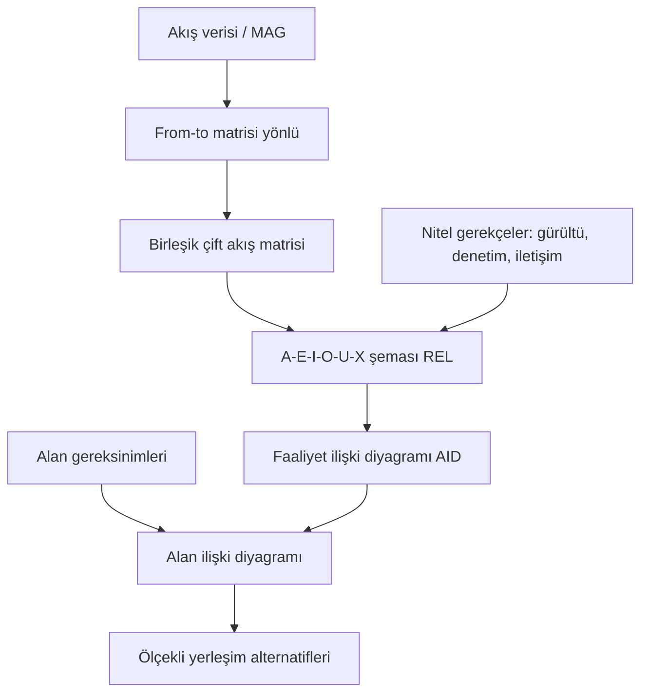

# HF06 - Akış, Alan ve Etkinlik İlişkileri II

> [!summary] Ana fikir
> Etkin yerleşim için yalnız malzeme miktarı değil; insan, bilgi, güvenlik ve destek ilişkileri de ölçülür. Farklı malzemeleri ortak ölçüye çevirmek için **MAG (Malzeme Akış Grafı) akış şiddeti** kullanılır; ürün rotalarından **from-to (geliş-gidiş) matrisi** kurularak nicel akış, **A-E-I-O-U-X faaliyet ilişki şeması (REL)** ile nitel yakınlık temsil edilir. Bu ikisi **faaliyet ilişki diyagramına (AID)** ve **bölüm alan hesabına** dönüştürülerek ölçekli yerleşim alternatifleri üretilir.

![[07 Ekler/Diyagramlar/faaliyet-iliski-diyagrami.svg]]

## 1. Akış seviyeleri

Akış planlama hiyerarşisi dört kademededir; her üst kademe alt kademenin etkinliğine bağlıdır:

- **Tesisler arası:** tedarikçi, fabrika, depo ve müşteri ağı (tedarik zinciri / lojistik).
- **Bölümler arası:** üretim alanları arasındaki yük hareketi.
- **Bölüm içi:** iş istasyonları arasındaki rota.
- **İş istasyonu içi:** operatörün el, göz ve ekipman hareketleri (hareket etüdü, ergonomi).

Etkin bir akış; **doğrudan, kesintisiz, geri dönüşsüz, çaprazlaşması az ve güvenli** olmalıdır. Akış mal kabulle başlar, sevkiyatla biter; süreç içi stok (WIP) ve geri dönüşler en aza indirilir.

---

## 2. MAG akış şiddeti hesabı

Malzemeler benzer özellikteyse (aynı boyut, ağırlık, zarar riski, biçim) akış doğrudan **taşıma/gezi sayısı** ile ölçülebilir. Ancak parçalar birbirinden farklıysa ortak bir taşınabilirlik ölçüsü gerekir; bunun için **MAG** geliştirilmiştir.

### 2.1 Temel formül

Bir parçanın taşınabilirliğini etkileyen beş etmen vardır:

- **A:** Parçanın boyutu (hacmi) → temel MAG ölçüsü
- **B:** Parçanın yoğunluğu
- **C:** Parçanın biçimi
- **D:** Parçaya veya çevresine zarar verme riski
- **E:** Parçanın durumu (kayganlık, elle taşıma güçlüğü vb.)

$$
M = A\left[1 + \frac{1}{4}\,(B + C + D + E)\right]
$$

> [!tip] Köşeli parantez önce
> $B, C, D, E$ düzeltmeleri **doğrudan A'ya eklenmez**; önce $\frac14(B+C+D+E)$ hesaplanıp 1 ile toplanır, sonuç A ile çarpılır. Düzeltmeler negatif de olabilir (örn. zarar riski düşükse $D<0$).

### 2.2 A değerinin interpolasyonla bulunması

A, parçanın hacmine karşılık gelen tablo değeridir. Tablo ara değer içermiyorsa **doğrusal interpolasyon** uygulanır:

$$
A = A_1 + \frac{V - V_1}{V_2 - V_1}\,(A_2 - A_1)
$$

| Hacim (cm³) | Hacim (in³) | MAG Ölçüsü (A) |
|---:|---:|---:|
| 0,75 | 0,05 | 0,005 |
| 1,5 | 0,1 | 0,05 |
| 15 | 1 | 0,25 |
| 150 | 10 | 1 |
| 1.500 | 100 | 3,5 |
| 15.000 | 1.000 | 10 |
| 150.000 | 10.000 | 25 |
| 1.500.000 | 100.000 | 50 |

B, C, D, E değerleri ise ders sunumundaki yoğunluk/biçim/risk/durum tablosundan, parçanın sözel tanımına bakılarak seçilir.

### 2.3 Dönemsel akış şiddeti

Parça başına MAG bulunduktan sonra dönemsel (yıllık/günlük) akış şiddeti:

$$
F = M \times Q \times h
$$

$Q$ = dönemdeki üretim miktarı, $h$ = aynı bölümler arası geçişin parça başına tekrar sayısı (genelde 1).

---

## 3. From-to (geliş-gidiş) matrisi

### 3.1 Tanım

From-to matrisi, satır ve sütunlarında **aynı sırada** listelenen iş istasyonu / bölüm adlarını içeren **kare** bir matristir. Satır = nereden (from), sütun = nereye (to).

- Matris **simetrik değildir**: $i \to j$ akışı ile $j \to i$ akışı farklıdır.
- Hücrelere ortak bir ölçütle akış işlenir (MAG/gün, palet/gün, taşıma birimi/gün vb.).

### 3.2 Matris kurma prosedürü — adım adım

1. **Bölümleri listele.** Tüm bölüm/iş istasyonu adlarını (kod/numara) hem satıra hem sütuna **aynı sırada** yaz. Köşegen (i=i) kullanılmaz, "—" ile kapatılır.
2. **Ortak ölçü tesis et.** Malzemeler eşdeğerse ölçü = taşıma sayısı. Farklıysa her ürün için **eşdeğer katsayı** (ör. büyük parça = küçüğün 2 katı) veya MAG ile ortak birime çevir.
3. **Rotaları ardışık yönlü çiftlere ayır.** Her ürünün rotasını oklarla yeniden yaz; yalnız **ardışık** geçişler hücre üretir. Örn. A-C-B → A→C ve C→B (A→B yoktur!).
4. **Ürün eşdeğer miktarını her geçişe ekle.** Bir ürünün her ardışık çiftine, o ürünün eşdeğer üretim miktarını ($Q_p \cdot e_p$) ekle:
   $$ f_{ij} = \sum_p Q_p\, e_p\, n_{ijp} $$
   ($n_{ijp}$ = p ürününün rotasında $i\to j$ geçişinin tekrar sayısı.)
5. **Yönlü matris tamamlanır.** Tüm ürünler işlendiğinde her hücre kümülatif yön bilgisini taşır.
6. **(Gerekirse) toplam akış matrisi.** Yön önemsizse her bölüm çifti için iki yönü birleştir:
   $$ F_{ij} = f_{ij} + f_{ji} \quad (i<j) $$
   Bu **birleşik çift akış**, yakınlık şiddetini gösterir ve REL şemasına temel olur.

### 3.3 Yerleşim taşıma ölçütü

From-to matrisi, yerleşim alternatiflerini karşılaştırmak için kullanılır:

$$
M_{taşıma} = \sum_i \sum_j f_{ij}\, c_{ij}\, d_{ij}
$$

$c_{ij}$ = birim yük-birim mesafe maliyeti, $d_{ij}$ = bölümler arası uzaklık. Amaç bu toplamı minimize eden yerleşimdir.

> [!warning] ij ve ji akışını çift sayma hatası
> En sık yapılan iki hata:
> 1. **Ardışık olmayan çiftleri eklemek.** A-C-B-D-E rotası **yalnız** A→C, C→B, B→D, D→E üretir. A→B veya A→D **yoktur**; rotada bu harfler ardışık değildir.
> 2. **Toplam akışı bulurken çift sayma.** Birleşik çift akışta her bölüm çifti **bir kez** yazılır: $F_{BD} = f_{BD} + f_{DB}$. Hem $(B,D)$ hem $(D,B)$ hücresini ayrı ayrı toplam matrisine işlersen akış iki kat şişer. Toplam matriste yalnız üst (veya alt) üçgeni doldur.
> Kontrol: yönlü matristeki tüm hücrelerin toplamı = birleşik çift akış matrisindeki hücrelerin toplamı olmalı.

---

## 4. Faaliyet ilişki şeması (REL chart)

Akış ilişki şeması tek başına yetmez; faaliyet ilişki şeması **hangi bölümün hangi bölüme yakın olması gerektiğini** ve bunun **gerekçesini/önem derecesini** gösterir. Muther (1973) Yakınlık İlişki Değerleri kullanılır.

### 4.1 A-E-I-O-U-X değer tablosu

| Kod | Anlam | Sayısal Değer | Renk Kodu | Çizgi Kodu | Tipik Bulunma % |
|:---:|---|:---:|---|---|:---:|
| **A** | Kesinlikle gerekli (mutlaka yakın) | **4** | Kırmızı | 4 çizgi | ~5 % |
| **E** | Özellikle (çok) önemli | **3** | Turuncu-Sarı | 3 çizgi | ~10 % |
| **I** | Önemli | **2** | Yeşil | 2 çizgi | ~15 % |
| **O** | Olağan / sıradan yakınlık | **1** | Mavi | 1 çizgi | ~20 % |
| **U** | Önemsiz | **0** | Renksiz | — (çizgi yok) | ~50 % |
| **X** | Arzu edilmez (yakınlık istenmez) | **−1** | Kahverengi | zikzak | düşük |
| **XX** | Kesinlikle istenmez | **−2, −3, −4** | Siyah | çift zikzak | çok düşük |

İlişki kodunun yanına bir de **gerekçe kodu** yazılır. Örnek gerekçe kodları: `01` ortak ekipman kullanımı, `02` malzeme hareketi, `03` personel hareketi, `04` denetim, `05` ortak gereç kullanımı, `06` gürültü ve kirlilik, `07` iletişim sıklığı.

### 4.2 Akıştan ilişki sınıfına geçiş

Birleşik çift akış değerleri sınıf sınırlarıyla A-E-I-O-U-X kodlarına çevrilir. HF06 kaynak örneğindeki sınıflandırma (bu sınırlar probleme göre değişir):

| Akış aralığı (MAG/gün) | İlişki | Sayısal değer | Çizgi |
|---:|:---:|:---:|---|
| 0 – 11 | U (önemsiz) | 0 | tek çizgi |
| 12 – 22 | O (normal) | 1 | çift çizgi |
| 23 – 34 | I (önemli) | 2 | üç çizgi |
| 35 – 46 | E (özellikle önemli) | 3 | dört çizgi |
| 47 – 57 | A (kesinlikle gerekli) | 4 | taralı çizgi |

> [!warning] Sınıf sınırı ve sıfır akış tuzakları
> - Kaynak slaytındaki "11-22" yazımı 11'i iki sınıfa sokar; **ayrık** sınır olarak **12-22** alınmalıdır.
> - **Sıfır akışlı çift otomatik X değildir.** Yalnız akış ölçütü kullanılıyorsa sıfır akış **U** (önemsiz) demektir. X (arzu edilmez) ancak gürültü, kirlilik, güvenlik gibi **olumsuz bir gerekçe** varsa verilir. Slayt 85'te akışsız çiftlerin X gösterilmesi bir kaynak tutarsızlığıdır; sınavda hocanın verdiği sınıf tablosu uygulanmalı ve bu varsayım açıkça yazılmalıdır.

---

## 5. Faaliyet ilişki diyagramı (AID) çizimi

AID, REL şemasındaki yakınlık değerlerini **mekânsal yerleşime** çevirir. Büyük oranda tasarımcının kararına bağlıdır; yakınlık dereceleri tatmin edildiğinde durulur.

### 5.1 Çizim adımları (sistematik prosedür)

1. **Bölüm sayısı ve adları belirlenir.** Eylem türleri için uygun sembol kullanılır; sembol içine bölüm kodu yazılır.
2. **Önce A ilişkileri çizilir.** A bağlı bölümler en kısa/en yakın yerleştirilir (4 hatlı bağlar eşit ve kısa uzaklıkta).
3. **E ilişkileri eklenir** (3 hatlı), diyagram yeniden düzenlenir.
4. **X / XX çiftleri** mümkün olduğunca **uzak** tutulur (zikzak hat).
5. **I, sonra O ilişkileri** sırayla eklenir (2 ve 1 hatlı), her turda yeniden düzenlenir.
6. **Geriye kalan bölümler** (U) eklenir.
7. **Doğruluk kontrolü:** tüm bölümler yerleşti mi, önemli (A, E, X) ilişkilere uyuldu mu? **Bağlantı çizgileri birbirini kesmemelidir.**

### 5.2 Genel akış diyagramı



### 5.3 AID metinsel gösterim örneği

A=B (A,4) ve B=C (E,3), A=C (X,−1) ise diyagram hedefleri:

```
   [A] ════════ [B]        ════  A  (kesinlikle gerekli, en yakın)
    ⋮            ║          ║     E  (özellikle önemli, yakın)
   (X)          ║          ⋮     X  (arzu edilmez, uzak)
    ⋮           ║
   [C] ─────────╝   ← B-C yakın, ama A-C uzak tutulur
```

Çakışma olursa **A ve X zorunluluklarına öncelik** verilir, çelişki kısıt olarak açıklanır.

---

## 6. Bölüm alan hesabı

Bir bölümün alanı yalnız makine taban alanı değildir; donanım, malzeme, personel ve destek alanlarını kapsar.

### 6.1 İşletme donanım alanı (alan katsayısı yöntemi)

Makine türü $j$ için: taban alanı $A_{tb,j}$, alan katsayısı $K_{A,j}$, adet $M_j$:

$$
A_{id} = \sum_j M_j \, K_{A,j}\, A_{tb,j}
$$

> [!tip] Birim kontrolü
> Katsayı **yalnız makine sayısıyla** değil, **adet × taban alanı × katsayı** ile çarpılır. Taban alanını atlamak en sık alan hatasıdır.

### 6.2 Destek alanları

Ders görselindeki yaklaşık destek katsayıları (hepsi $A_{id}$ tabanlıdır):

$$
A_{ad}=0{,}20\,A_{id}\ \text{(ara depo)},\quad
A_{kk}=0{,}13\,A_{id}\ \text{(kalite kontrol)},
$$
$$
A_{sa}=0{,}18\,A_{id}\ \text{(serbest alan)},\quad
A_{uy}=0{,}25\,A_{id}\ \text{(ulaşım yolları)}
$$

Dört kalem de uygulanırsa toplam:

$$
A_{top} = A_{id}\,(1 + 0{,}20 + 0{,}13 + 0{,}18 + 0{,}25) = 1{,}76\,A_{id}
$$

### 6.3 Genel bölüm/tesis alanı

Personel, bakım, tesis hizmetleri ve özel depolar ayrıca eklenir:

$$
A_{bölüm} = A_{makine} + A_{operatör} + A_{WIP} + A_{koridor} + A_{bakım} + A_{güvenlik}
$$

Personel alanı genelde **işçi sayısı × kişi başı alan**, makine alanı **makine sayısı × makine başı alan**, üzerine destek alanları eklenerek bulunur. Toplam tesis alanı tüm bölümlerin toplamıdır.

> [!warning] Yüzdeleri art arda uygulama
> Destek oranları **kümülatif olarak değil**, her biri **doğrudan $A_{id}$ ile** çarpılır. Önce $A_{ad}$, sonra onun üzerine $A_{kk}$ gibi zincirleme yüzde uygulamak yanlıştır. Ayrıca aynı alanı (ör. koridor) iki kez sayma.

---

## 7. Tam çözümlü örnekler

### Örnek 1 — MAG akış şiddeti (slayt 55-56)

> [!example] Veri
> Silindir kalıp merkezleme mili: taban çapı $d=6$ cm, yükseklik $h=17$ cm, $\pi=3$. Ağır ve yoğun (B=2), uzun-yuvarlatılmış-düzensiz (C=1), kolay zarar görmez (D=−1), yağlı ve elle taşıması zor (E=1). Yılda 50.000 adet.

**1) Hacim** (yarıçap $r = d/2 = 3$ cm):
$$ V = \pi r^2 h = 3 \cdot 3^2 \cdot 17 = 459\ \text{cm}^3 $$

**2) A interpolasyonu** (459, 150 ve 1.500 arasında; 150→1, 1.500→3,5):
$$ A = 1 + \frac{459 - 150}{1500 - 150}\,(3{,}5 - 1) = 1 + \frac{309}{1350}\cdot 2{,}5 = 1{,}5722 $$

**3) Parça başına MAG:**
$$ M = 1{,}5722\left[1 + \frac{2+1-1+1}{4}\right] = 1{,}5722 \cdot 1{,}75 = 2{,}7514\ \text{MAG} $$

**4) Yıllık akış şiddeti:**
$$ F = M \cdot Q = 2{,}7514 \cdot 50.000 = 137.569\ \text{MAG/yıl} $$

> [!note] Kaynaktaki yuvarlama farkı
> Slayt A'yı 1,57 alıp sonucu 2,74 ve yıllık 137.000 verir. Tam interpolasyonla 2,7514 ve 137.569 bulunur. Sınavda hocanın tablo/yuvarlama yaklaşımı belirtilerek işlem gösterilmelidir.

### Örnek 2 — From-to matrisi ve REL (slayt 59, 83-85)

> [!example] Veri
> P1: 30 adet, rota **A-C-B-D-E**; P2: 12 adet, rota **A-B-D-E**; P3: 7 adet ama **2 kat eşdeğer** (eşdeğer = 14), rota **A-C-D-B-E**.

**1) Rotaları ardışık çiftlere ayır:**

| Ürün | Eşdeğer miktar | Ardışık geçişler |
|---|---:|---|
| P1 | 30 | A→C, C→B, B→D, D→E |
| P2 | 12 | A→B, B→D, D→E |
| P3 | 7×2 = 14 | A→C, C→D, D→B, B→E |

**2) Yönlü from-to matrisi:**

| Yön | Katkı | Akış |
|---|---|---:|
| A→B | P2 | 12 |
| A→C | P1 + P3 | 44 |
| B→D | P1 + P2 | 42 |
| B→E | P3 | 14 |
| C→B | P1 | 30 |
| C→D | P3 | 14 |
| D→B | P3 | 14 |
| D→E | P1 + P2 | 42 |

**3) Birleşik çift akış** (her çift bir kez, $f_{ij}+f_{ji}$):

| Çift | Hesap | Toplam |
|---|---|---:|
| **B-D** | 42 + 14 | **56** → A |
| **A-C** | 44 + 0 | **44** → E |
| **D-E** | 42 + 0 | **42** → E |
| **B-C** | 30 + 0 | **30** → I |
| **C-D** | 14 + 0 | **14** → O |
| **A-B** | 12 + 0 | **12** → O |

**4) REL şeması** (12-22 O, 23-34 I, 35-46 E, 47-57 A):
B-D = A; A-C ve D-E = E; B-C = I; C-D ve A-B = O. Akışsız çiftler (ör. A-D, A-E, C-E) yalnız akış ölçütü kullanılıyorsa U'dur (otomatik X değil!).

### Örnek 3 — Alan katsayısı hesabı (slayt 95-97)

> [!example] Veri
> 20 adet tezgâh × 10 m² (katsayı 3,11); 15 adet × 13 m² (katsayı 3,00); 5 adet × 7 m² (katsayı 3,42).

**1) İşletme donanım alanı:**
$$ A_{id} = 20(10)(3{,}11) + 15(13)(3{,}00) + 5(7)(3{,}42) $$
$$ A_{id} = 622 + 585 + 119{,}7 = 1.326{,}7\ \text{m}^2 $$

**2) Dört destek oranı uygulanırsa (öğretim genişletmesi):**
$$ A_{top} = 1{,}76 \cdot 1.326{,}7 = 2.335{,}0\ \text{m}^2 $$

> [!note] Kaynak slayt 97 yalnız ana fonksiyon alanını ($A_{id}$) sorar; ikinci sonuç destek alanları da istendiğinde geçerlidir.

---

## 8. Pratik sorular

### Soru 1 — MAG hesabı
> [!question]
> Bir parça için $A=4$, B=1, C=0, D=−1, E=2. Parça başına MAG değeri nedir?
>> [!success]- Çözüm
>> $M = 4\left[1 + \frac{1+0-1+2}{4}\right] = 4\left[1 + \frac{2}{4}\right] = 4 \cdot 1{,}5 = \mathbf{6\ \text{MAG}}$

### Soru 2 — A interpolasyonu
> [!question]
> 250 cm³'lük bir parça için tablodaki 150→1 ve 1.500→3,5 değerlerinden A'yı doğrusal interpolasyonla bulunuz.
>> [!success]- Çözüm
>> $A = 1 + \dfrac{250-150}{1500-150}(3{,}5-1) = 1 + \dfrac{100}{1350}\cdot 2{,}5 = 1 + 0{,}1852 = \mathbf{1{,}1852}$

### Soru 3 — From-to çift sayma kontrolü
> [!question]
> X: 10 adet, rota A-B-C; Y: 6 adet, eşdeğer katsayı 3, rota C-B-A.
> (a) Y'nin eşdeğer miktarı? (b) $f_{AB}$, $f_{BA}$, $f_{BC}$, $f_{CB}$? (c) Toplam (birleşik) A-B çifti akışı?
>> [!success]- Çözüm
>> (a) Y eşdeğer = $6 \times 3 = 18$.
>> (b) X rotası A→B, B→C verir; Y rotası C→B, B→A verir. Dolayısıyla $f_{AB}=10$, $f_{BA}=18$, $f_{BC}=10$, $f_{CB}=18$.
>> (c) Birleşik A-B çifti = $f_{AB}+f_{BA} = 10+18 = \mathbf{28}$. **Dikkat:** bu 28'i toplam matriste yalnız (A,B) hücresine yaz; ayrıca (B,A)'ya da yazarsan çift sayarsın.

### Soru 4 — Akıştan ilişkiye
> [!question]
> Kaynak sınıflarında (12-22 O, 23-34 I, 35-46 E, 47-57 A) birleşik akış değeri 33 olan bir çiftin ilişki kodu ve sayısal değeri nedir?
>> [!success]- Çözüm
>> 33 ∈ [23, 34] → ilişki kodu **I (önemli)**, sayısal değer **2**, çizgi: üç çizgi.

### Soru 5 — Alan hesabı
> [!question]
> $A_{id} = 500\ \text{m}^2$. Ara depo (0,20), kalite kontrol (0,13), serbest alan (0,18), ulaşım yolları (0,25) oranlarıyla (a) dört destek alanını, (b) genel toplamı bulunuz.
>> [!success]- Çözüm
>> (a) $A_{ad}=0{,}20\cdot500=100$; $A_{kk}=0{,}13\cdot500=65$; $A_{sa}=0{,}18\cdot500=90$; $A_{uy}=0{,}25\cdot500=125\ \text{m}^2$.
>> (b) Destek toplamı $=100+65+90+125=380$. Genel toplam $A_{top}=500+380=\mathbf{880\ \text{m}^2}$ (eşdeğeri $1{,}76\cdot500=880$).

---

## 9. Sık yapılan hatalar (özet)

| Yanlış adım | Neden yanlış? | Kontrol |
|---|---|---|
| Çapı yarıçap almak | Hacim 4 kat büyür | $r = d/2$ |
| B+C+D+E'yi doğrudan A'ya eklemek | Düzeltme önce 1 ile toplanıp A ile çarpılır | Köşeli parantezi önce hesapla |
| Rotada ardışık olmayan çifti eklemek | Yalnız ardışık geçiş hücre üretir | Rotayı oklarla yaz |
| ij ve ji'yi toplam matriste ayrı yazmak | Akış iki kat şişer | Birleşik matriste her çifti bir kez yaz |
| Sıfır akışı X yapmak | X için olumsuz gerekçe gerekir | Akış dışı gerekçe yoksa U yaz |
| Katsayıyı yalnız makine sayısıyla çarpmak | Taban alanı eksik kalır | $M \cdot K_A \cdot A_{tb}$ |
| Destek yüzdelerini zincirleme uygulamak | Oranlar $A_{id}$ tabanlıdır | Her kalemi doğrudan $A_{id}$ ile çarp |

---

## Kaynaklar

### Öğrenme paketleri
- [[09 Öğrenme Paketleri/HF06A - MAG Akış Şiddeti ve From-To Matrisi|HF06A — MAG Akış Şiddeti ve From-To Matrisi]]
- [[09 Öğrenme Paketleri/HF06B - Faaliyet İlişki Diyagramı ve Alan Hesabı|HF06B — Faaliyet İlişki Diyagramı ve Alan Hesabı]]

### Diğer kaynaklar
- [[HF6-P6-Akış, Alan ve Etkinlik İlişkileri II 2025.pptx|Ders sunumu]]
- [[05 Kaynaklar/MarkItDown/HF06 - Ham|MarkItDown ham metni]]
- [[03 Formüller/Formül Föyü#Akış ve yerleşim maliyeti|Formül föyü]]
- [[08 Hesaplamalar/Hesap Sonuçları#Grafikler|From-to grafiği]]

Önceki: [[HF05 - Akış, Alan ve Etkinlik İlişkileri I]] · Sonraki: [[HF07 - Yerleşim Tasarımı I]]
