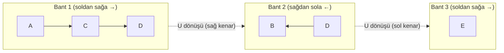
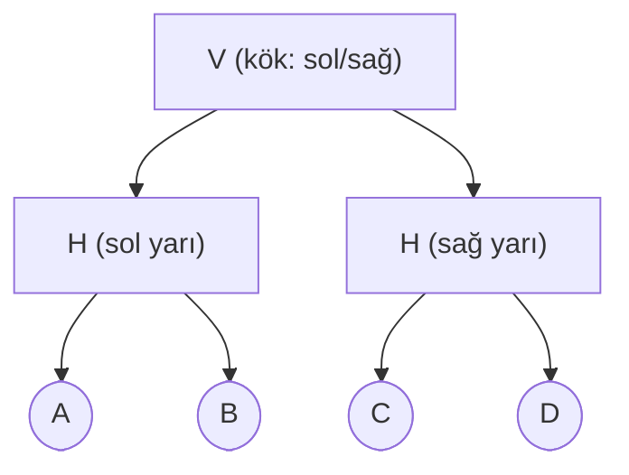
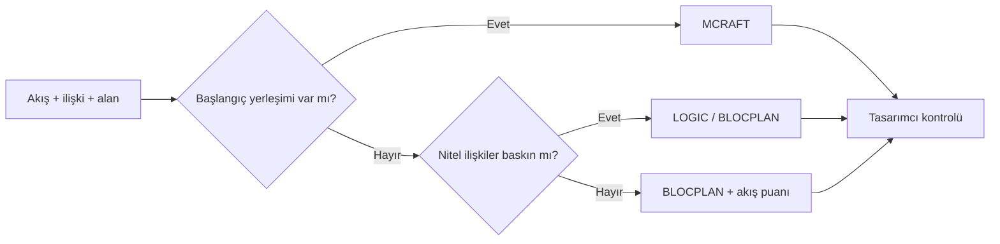

# HF09 - Yerleşim Tasarımı III

> [!summary] Ana fikir
> MCRAFT, BLOCPLAN ve LOGIC, blok yerleşimini farklı veri ve geometri varsayımlarıyla üretip iyileştirir. **MCRAFT** bir bölüm vektörünü eş genişlikli bantlarda yılan biçimli süpürmeyle yerleştirir ve ikili değişimlerle akış-mesafe maliyetini düşürür. **BLOCPLAN** yönlü akışı simetrik toplam akışa, sonra A-E-I-O-U-X ilişki sınıflarına çevirir; yerleşimi komşuluk ($Z_A$, $ER$) ve ilişki-uzaklık ($RD$) puanlarıyla değerlendirir. **LOGIC** dikdörtgen alanı giyotin (tam) kesimlerle bölen bir kesim ağacı kurar ve yaprak değişimleriyle iyileştirir. Algoritma seçimi; bölüm şekilleri, nitel/nicel ilişki verisi ve başlangıç yerleşiminin varlığına bağlıdır.

## Yöntem karşılaştırması (özet)

| Yöntem | Tür | Başlıca veri | Ayırt edici özellik |
|---|---|---|---|
| MCRAFT | İyileştirme | Akış, maliyet, mevcut yerleşim | Süpürme paterni ve bölüm değişimleri |
| BLOCPLAN | Kurma + iyileştirme | REL chart, akış, alan | Dikdörtgen blok bantları; REL-DIST |
| LOGIC | Kurma + iyileştirme | İlişki ve alan | Giyotin kesim + kesim ağacı |

> Detaylı karşılaştırma için aşağıdaki [Üç algoritmanın karşılaştırma tablosu](#üç-algoritmanın-karşılaştırma-tablosu)'na bakınız.

## Kurucu ve geliştirme algoritmaları

| Oluşturma (Construction) | Geliştirme (Improvement) |
|---|---|
| Grafik tabanlı: ALDEP, CORELAP, PLANET | İkili yer değiştirme: CRAFT, MCRAFT, MULTIPLE |
| Blok Plan (BLOCPLAN), Mantık (LOGIC), Tam Sayılı Karışım Programlama (MIP) | |

- **Kurucu algoritmalar:** Boş alana bölümleri iteratif ekleyerek bir blok yerleşimi oluşturur.
- **Geliştirme algoritmaları:** Var olan bir başlangıç yerleşimini sürekli iyileştirir.
- **Melez:** BLOCPLAN ve LOGIC hem kurar hem geliştirir.

Girdi verisine göre ayrım:

| Veri türü | Amaç | Girdi | Algoritmalar |
|---|---|---|---|
| Nitel | Komşuluk esaslı | İlişki şeması | CORELAP, ALDEP |
| Nicel | Uzaklık esaslı | Geliş-gidiş şeması | CRAFT, MCRAFT, MULTIPLE |
| İkisi birden (melez) | Komşuluk + uzaklık | Her ikisi | BLOCPLAN |

---

## MCRAFT (Micro CRAFT)

MCRAFT, CRAFT mantığını mikro bilgisayar ortamına ve farklı bölüm şekillerine uyarlar. **Bitişik olmayan ve eş alanlı olmayan** ikili değişimlere izin verir: bir çift değiştirildiğinde aradaki diğer bölümler otomatik olarak kaydırılır. Alanı yatay bir **süpürme paterni** boyunca doldurur, aday değişimleri değerlendirir ve akış-mesafe maliyeti azaldıkça çözümü günceller.

### Süpürme paterni (yılan yolu) mantığı

- Yerleşim, bölümlerin bir **sırasına (vektörüne)** göre verilir.
- Her iterasyonda hücreler **sol üst köşeden** başlanarak şekillendirilir.
- Sıralamadaki ilk bölüm sol üst köşeye yerleştirilir; sağındaki boşluk varsa ikinci bölüm oraya yerleşir.
- Bant dolunca **bir alt banda geçilir ve yön ters çevrilir** (yılan gibi kıvrımlı akış yolu).

Yukarıdaki diyagram `A-C-D-B-E` vektörünün 3 bantlı bir binaya nasıl serpildiğini gösterir: 1. bant soldan sağa, 2. bant sağdan sola, 3. bant yeniden soldan sağa doldurulur. Bölüm büyükse bant geçişinde bölünebilir (örnekte D, 1. banttan 2. banda taşar).

### MCRAFT algoritması (adımlar)

1. **Gereksinimleri belirle:** Tesis boyutları (dikdörtgen, En × Boy) ve bant sayısı $b$.
2. **Bant genişliğini hesapla:** $w = H / b$. (Tüm bantlar **eş genişlikte** varsayılır.)
3. **Başlangıç vektörünü oku/oluştur:** Mevcut yerleşimi süpürme yönünde okuyarak bölüm vektörünü çıkar. Bu vektör yılan yolu boyunca yerleştirilir.
4. **Aday ikiliyi seç (CRAFT benzeri):** Fark, bitişiklik veya eş alan **sınırlamasının olmaması**dır — herhangi iki bölüm seçilebilir.
5. **İyileştirici değişimi uygula:** Geliştirici bir ikili değişim bulunursa iki bölüm vektörde takas edilir, kalan bölümler kaydırma prosedürüyle yeniden süpürülür.
6. **Tekrarla:** Daha fazla iyileşme sağlanamayıncaya dek 4. ve 5. adımlar yinelenir.

### Bant genişliği, bölüm uzunluğu ve maliyet formülleri

Bant genişliği:
$$w = \frac{H}{b}$$

Tek bant içindeki bir bölümün yaklaşık uzunluğu:
$$\ell_i = \frac{A_i}{w}$$

Toplam akış-uzaklık maliyeti (kabul kriteri $\Delta C < 0$):
$$C = \sum_{i<j} F_{ij}\,c_{ij}\,d_{ij}, \qquad \Delta C = C_{\text{yeni}} - C_{\text{eski}}$$

Burada $F_{ij}$ akış şiddeti, $c_{ij}$ birim taşıma maliyeti, $d_{ij}$ bölüm ağırlık merkezleri arası uzaklıktır. **Yalnız $\Delta C < 0$ ise** değişim iyileştirmedir.

### Sayısal örnek (slayt 12-15)

> [!example] Bina 20 × 9 m, 3 bant; vektör `A-C-D-B-E`
> | Bölüm | Alan (m²) | Tek banttaki uzunluk ℓi = Ai/w |
> |---|---:|---:|
> | A | 30 | 10 m |
> | B | 45 | 15 m |
> | C | 51 | 17 m |
> | D | 39 | 13 m |
> | E | 15 | 5 m |
>
> **Alan kontrolü:** $30+45+51+39+15 = 180\,m^2 = 20 \times 9$. Bina alanına tam eşit; eksik/fazla yok.
> **Bant genişliği:** $w = 9/3 = 3\,m$.
> C'nin 17 m uzunluğu 20 m'lik bandı neredeyse doldurur; bu yüzden gerçek blok sınırları süpürme ve bant geçişiyle belirlenir. CRAFT örneğiyle aynı veriler 4 iterasyonda **CRAFT'tan daha düzgün** (daha dikdörtgensel) bir yerleşim verir.

### MCRAFT yorumlar

**Güçlü yanları**
- Bitişik/eş alan kısıtı olmadan ikili değişim yapılabilir.
- CRAFT'a göre daha düzgün (çoğunlukla dikdörtgensel) şekiller.
- Bir iterasyondaki ikili değişim adayı sayısı $\binom{n}{2}$ ile polinomsal artar (CRAFT ile aynı); çok katlı planlamaya olanak tanır.

**Zayıflıkları**
- Tesis şekliyle (dikdörtgen) sınırlı; tüm bantlar eş genişlik varsayılır.
- Başlangıç yerleşimi tam doğrulukla kapsanamayabilir.
- Sabit bölümleri ve engelleri ayırt edemez (onları da kaydırabilir).

> [!tip] Süpürme tuzağı
> "A ile B yer değiştirsin" demek geometrik blokların aynen taşınması **değildir**. Vektör değişir, tüm yerleşim süpürme boyunca **baştan** yeniden üretilir.

🔗 Hesap pratiği: [[HF09A - MCRAFT]]

---

## BLOCPLAN

BLOCPLAN, **kurma ve geliştirme** esaslı melez bir algoritmadır. Hem komşuluk hem uzaklık esaslı amaç kullanır. Bölümler 2-3 bant içinde, **hepsi dikdörtgen** olacak şekilde, sürekli gösterimle yerleştirilir. Girdi olarak geliş-gidiş şeması ve/veya ilişki şeması alır.

BLOCPLAN iki temel dönüşüm yapar:
1. **From-to chart → Relationship chart** (Flow-between/toplam akış üzerinden).
2. **Relationship chart → Sayısal ilişki şeması** (yakınlık oranlarına göre).

### Adım 1 — Toplam (flow-between) akış matrisi

M etkinlikli bir geliş-gidiş matrisi $M(M-1)$ **asimetrik** ilişki taşır. Toplam akış matrisi $M(M-1)/2$ **simetrik** ilişki üretir:
$$F_{ij} = f_{ij} + f_{ji} \qquad (i<j)$$

### Adım 2 — Beş ilişki sınıfı (akış → A/E/I/O/U)

En büyük toplam akış 5'e bölünüp eş aralıklar kurulur; her aralık bir yakınlık düzeyine karşılık gelir.

> [!example] Aralıkların belirlenmesi (slayt 26)
> En yüksek değer **90**, $90/5 = 18$:
> | Aralık | İlişki |
> |---|---|
> | 73 – 90 | A |
> | 55 – 72 | E |
> | 37 – 54 | I |
> | 19 – 36 | O |
> | 00 – 18 | U |

### Adım 3 — REL chart → sayısal ilişki matrisi dönüşümü

Alfabetik yakınlık düzeyleri ağırlık vektörüyle sayısallaştırılır. Kaynak örnek ağırlıkları:
$$A=10,\quad E=5,\quad I=2,\quad O=1,\quad U=0,\quad X=-10$$

> [!example] REL chart → Sayısal (slayt 22)
> | REL | D1 | D2 | D3 | D4 | D5 | D6 | | Sayısal | D1 | D2 | D3 | D4 | D5 | D6 |
> |---|---|---|---|---|---|---|---|---|---|---|---|---|---|---|
> | D1 | - | A | I | | I | | | D1 | - | 10 | 2 | | 2 | |
> | D2 | | - | | E | E | O | | D2 | | - | | 5 | 5 | 1 |
> | D3 | | | - | | A | **X** | | D3 | | | - | | 10 | **-10** |
> | D5 | | | | | - | O | | D5 | | | | | - | 1 |
>
> D3-D6 ilişkisi **X** olduğundan sayısal değer **-10**'a düşer.

> [!warning] X ilişkisi negatif ağırlık alır
> A/E/I/O/U pozitif (veya sıfır) yakınlık ağırlıklarına dönüşürken, **X (istenmeyen yakınlık)** açıkça **negatif** bir değer (örnekte $-10$) alır. Bu yüzden X içeren çiftler komşu yapıldığında puanı **düşürür** — sayısal matriste işaret kuralını mutlaka belirtin, aksi halde $Z_A$ ve $RD$ yanlış yorumlanır. X genellikle akıştan değil, ayrı verilen "istenmeyen ilişki" bilgisinden gelir.

### Adım 4 — İki ayrı puan: komşuluk ($Z_A$, $ER$) ve uzaklık ($RD$)

**Komşuluk esaslı puan (Z_A):** Yalnız ortak sınırı olan (komşu) çiftleri ödüllendirir.
$$Z_A = \sum_{i<j} w_{ij}\,a_{ij}, \qquad a_{ij} \in \{0,1\}$$
Burada $a_{ij}=1$ bölümler komşuysa, aksi halde 0'dır. $Z_A$ **büyük** olsun istenir.

**Etkinlik oranı (Efficiency Rating, ER):** Komşuluk puanını ulaşılabilir en büyük pozitif toplama normalize eder.
$$ER = \frac{Z_A}{\sum_{i<j} \max(w_{ij},\,0)}$$
$ER \in [0,1]$ aralığındadır (X'in negatifliği paydaya sokulmaz); **büyük** iyidir.

> [!important] ER paydası nasıl hesaplanır?
> Payda = **tüm pozitif ilişki çiftlerinin ağırlık toplamı.** Adım adım:
> 1. REL matrisindeki tüm çiftleri ($i < j$) listele
> 2. Negatif ağırlıklı çiftleri (X ilişkisi) dışarıda bırak
> 3. Kalanların ağırlıklarını topla → bu toplam paydadır
>
> **Örnek:** Örnek 1'deki payda 24 şöyle gelir: tüm A/E/I/O kodlu çiftlerin ağırlık toplamı = 24. X çiftleri bu toplamın **dışında** bırakılır.
>
> > [!tip] Akılda kalıcı — "Negatifi at, kalanı topla"
> > ER paydası için: önce X'leri çıkar, sonra topla. Tüm çiftler pozitifse payda direkt $\sum_{i<j} w_{ij}$'dir.

> [!tip] Akılda kalıcı — BLOCPLAN'ın üç puanı: **"ZER"**
> - **Z**\_A = yakınlık puanı (komşu çiftlerin ağırlık toplamı → **büyüt**)
> - **E**R = etkinlik oranı ($Z_A$ / tüm pozitif ilişki toplamı → **büyüt**)
> - **R**D = ilişki-uzaklık puanı (ağırlık × uzaklık → **küçült**)
>
> *"ZER"* — Z ve E'yi büyüt, R'yi küçült. Her alternatif için bu üç sayıyı yan yana yaz.

**İlişki-Uzaklık Puanı (REL-DIST, RD):** Akış yerine sayısal yakınlık oranlarını gerçek mesafeyle çarpar.
$$RD = \sum_{i<j} w_{ij}\,d_{ij}$$
$d_{ij}$ genellikle bölüm ağırlık merkezleri arasındaki doğrusal (rektilineer) uzaklıktır. Pozitif yakınlık ağırlıklarıyla **küçük $RD$** tercih edilir.

> [!warning] $ER$ büyük, $RD$ küçük olsun
> İki ölçüt **aynı yönde yorumlanamaz**. Aynı iki yerleşim komşulukta ($Z_A$) eşit, uzaklıkta ($RD$) farklı olabilir. "Puan yüksek iyidir" cümlesi her ikisi için geçerli değildir.

### BLOCPLAN prosedürü (adımlar)

1. Bölüm alanlarını ve bina oranını tanımla.
2. From-to ve/veya A-E-I-O-U-X ilişkilerini sayısallaştır ($F_{ij}=f_{ij}+f_{ji}$, sonra A/E/I/O/U aralıkları, sonra ağırlık vektörü).
3. Bantlar içinde dikdörtgen blok sıraları (çok alternatif) üret.
4. Her alternatif için $Z_A$, $ER$ ve $RD$ hesapla.
5. En iyi alternatifleri ( $ER$ büyük / $RD$ küçük) tasarımcı değerlendirmesine sun.

### Sayısal örnek 1 — Komşuluk eşit, maliyet farklı (slayt 27-29)

> [!example]
> Bir yerleşimin başlangıç ve nihai hâli için **komşuluk puanı eşittir**:
> $$Z_A = 15 \;\Rightarrow\; ER = \frac{15}{24} \approx 0{,}63 \quad (\text{her iki yerleşimde de})$$
> Ancak **uzaklık esaslı maliyet** farklıdır:
> $$C_{\text{başlangıç}} = 61.062{,}70, \qquad C_{\text{nihai}} = 58.133{,}34$$
> Fark: $61.062{,}70 - 58.133{,}34 = \mathbf{2.929{,}36}$ daha iyi. Yani komşuluk ölçütü aynı görünse de, uzaklık ölçütü nihai çözümün üstün olduğunu gösterir.

### Sayısal örnek 2 — REL-DIST hesabı (slayt 31-34)

> [!example] Ağırlıklar A=10, E=5, I=2, O=1, U=0, X=-10
> Sayısal ilişki ve uzaklık matrislerinden ağırlık × uzaklık çarpımları (üst üçgen):
> | Çift | İlişki | wij | dij | wij·dij |
> |---|---|---:|---:|---:|
> | D1-D2 | A | 10 | 3 | 30 |
> | D1-D4 | E | 5 | 5 | 25 |
> | D2-D4 | I | 2 | 8 | 16 |
> | D2-D5 | I | 2 | 6 | 12 |
> | D3-D5 | I | 2 | 3 | 6 |
> | D4-D5 | A | 10 | 4 | 40 |
> | (kalan U çiftleri) | U | 0 | — | 0 |
>
> $$RD = 30 + 25 + 16 + 12 + 6 + 40 = \mathbf{129}$$

🔗 Hesap pratiği: [[HF09B - BLOCPLAN]]

---

## LOGIC (Layout Optimization with Guillotine Induced Cuts)

LOGIC adı **"Giyotin baskılı kesimlerle yerleşim optimizasyonu"** kelimelerinin baş harflerinden gelir. Binayı yatay ve dikey **tam kesimlerle** giderek daha küçük dilimlere ayırır. Kaynak onu açıkça **uzaklık esaslı amaç**, **tekrarlı gösterim** ve **hem kurma hem geliştirme** algoritması olarak tanımlar.

### Giyotin kesim ve kesim ağacı (binary tree)

Bir **giyotin kesim**, mevcut dikdörtgen alt bölgeyi bir kenardan karşı kenara **tamamen** böler. Kesim ağacı bir ikili ağaçtır:
- **İç düğümler** kesim yönünü taşır: `V` (dikey kesim), `H` (yatay kesim).
- **Yapraklar** bölümlerdir.

Örneğin `V( H(A,B), H(C,D) )` ağacı: önce bütünü dikey kesimle sol/sağ böler; sonra her yarıyı yatay kesimle üst/alt böler.

### Kesim konumu (alan oranından)

Alt bölge alanı $A_S$, bir çocuğun toplam alanı $A_L$ ise:

Dikey kesimde (genişlik $W_S$ üzerinde):
$$x_L = W_S \cdot \frac{A_L}{A_S}$$
Yatay kesimde (yükseklik $H_S$ üzerinde):
$$y_L = H_S \cdot \frac{A_L}{A_S}$$

> [!note] Mantıksal komşuluk
> Kesim ağacındaki **kardeş yapraklar** ve aynı alt ağaçtaki bölümler birbirine fiziksel olarak en yakın komşu olur. Bir bölüm çiftini "en yakın komşu" yapmak istiyorsanız onları ağaçta aynı alt düğümün altına yerleştirmek gerekir. Ağaç derinliğinde birbirinden uzak yapraklar yerleşimde de uzak düşer.

### LOGIC geliştirme algoritması (adımlar)

1. Ağaçtaki iki yaprağı (bölümü) değiştir.
2. Ağaç yapısını/budamayı **koru**; değişikliği ağaca birleştir.
3. Değişimden etkilenen **en küçük ortak alt ağacı** alan oranlarıyla yeniden kes (etkilenmeyen taraf aynen kalır).
4. Yeni ağaç üzerinde kesim prosedürüne devam et ve maliyeti karşılaştır:
$$C = \sum_{i<j} f_{ij}\,c_{ij}\,d_{ij}$$

### Sayısal örnek — Tam denetlenebilir kesim (öğretim örneği)

> [!example] Bina 12 × 10 = 120 m²; A=20, B=30, C=28, D=42; ağaç `V( H(A,B), H(C,D) )`
> **Sol/sağ dikey kesim:** Sol çocuk alanı $A_L = 20+30 = 50$, genişliği $x_L = 12 \cdot 50/120 = 5\,m$. Sağ genişlik $12-5 = 7\,m$.
>
> **Sol alt ağaç (genişlik 5 m, yatay kesim):** A yüksekliği $20/5 = 4\,m$, B yüksekliği $30/5 = 6\,m$.
> **Sağ alt ağaç (genişlik 7 m, yatay kesim):** C yüksekliği $28/7 = 4\,m$, D yüksekliği $42/7 = 6\,m$.
>
> Bloklar: **A** $5\times4$, **B** $5\times6$, **C** $7\times4$, **D** $7\times6$. Alanlar tam korunur ($4\times5+6\times5+4\times7+6\times7 = 20+30+28+42 = 120$).

### Slayt örneği — Yaprak değişiminin yerel etkisi (slayt 40-46)

> [!example]
> Kaynak örnekte D ve G (sonra eş ölçülü olmayan D ve E) yaprakları değiştirilir. Sol alt ağaçtaki **A, B, C, E, H değişmiyorsa**, kesim prosedürü yalnız sağ taraftaki **D, F, G** için yeniden uygulanır. Bu, eş alan koşulunun aranmadığını ama değişen alanlar yüzünden etkilenen alt ağacın koordinatlarının yeniden hesaplandığını gösterir.

### LOGIC yorumlar

- Sabit bölümler ve önceden belirlenmiş şekiller LOGIC için **etkin değildir** (tam kesimler bunları koruyamayabilir).
- Bina dikdörtgenseçse LOGIC yalnız **dikdörtgensel bölümler** üretir; dikdörtgensel olmayan binalara da uygulanabilir.
- **LOGIC, BLOCPLAN'ı kapsar:** Tüm BLOCPLAN yerleşimleri aynı zamanda LOGIC yerleşimidir, yani **BLOCPLAN çözüm uzayı LOGIC çözüm uzayının bir alt kümesidir.**

🔗 Hesap pratiği: [[HF09C - LOGIC ve Kesim Ağacı]]

---

## Üç algoritmanın karşılaştırma tablosu

| Boyut | MCRAFT | BLOCPLAN | LOGIC |
|---|---|---|---|
| **Girdi** | Akış (from-to), maliyet, başlangıç yerleşimi, tesis boyutu + bant sayısı | From-to ve/veya REL chart, bölüm alanları, bina oranı | Bölüm alanları + ilişki/akış; bina dikdörtgeni |
| **Çıktı** | İyileştirilmiş bant yerleşimi (vektör) | Dikdörtgen blok bantları + $Z_A$, $ER$, $RD$ skorlu alternatifler | Giyotin yerleşim + kesim ağacı |
| **Amaç fonksiyonu** | Akış-uzaklık maliyeti $\sum F_{ij}c_{ij}d_{ij}$ (min) | Komşuluk ($Z_A$, $ER$ max) **ve** REL-DIST ($RD$ min) | Uzaklık esaslı maliyet $\sum f_{ij}c_{ij}d_{ij}$ (min) |
| **Gösterim** | Eş genişlikli bantlar, yılan yolu | Sürekli, 2-3 bant, hep dikdörtgen | Tekrarlı (kesim ağacı), giyotin |
| **Tür** | İyileştirme | Melez (kurma + geliştirme) | Melez (kurma + geliştirme) |
| **Güçlü yanı** | Bitişiklik/eş alan kısıtı yok; düzgün şekiller; çok alternatif | Geliş-gidiş şeması yoksa bile nitel ilişkiyle çalışır; çok alternatif üretip en iyiyi seçer | Eş alan gerektirmeyen yaprak değişimi; BLOCPLAN'ı kapsar |
| **Zayıflığı** | Dikdörtgen tesisle ve eş bant genişliğiyle sınırlı; sabit bölüm/engel ayıramaz | Yalnız dikdörtgen bloklar; bant sayısı sınırlı | Sabit bölüm/önceden belirli şekil zayıf; yalnız giyotin yerleşimler |

---

## Yöntem seçim akışı

---

## Pratik sorular (gizli çözümlü)

> [!question] Soru 1 — MCRAFT bant ve süpürme
> Bir tesis 24 × 12 m, 4 bantlıdır. `1-2-3-4-5` vektöründe 2. ve 5. bölümler değiştiriliyor.
> (a) Bant genişliğini bul. (b) $36\,m^2$ bölümün tek banttaki eşdeğer uzunluğunu bul. (c) Yeni vektörü yaz. (d) Bu yeni vektör değişimin iyi olduğunu tek başına kanıtlar mı?
>> [!success]- Çözüm
>> (a) $w = 12/4 = 3\,m$. (b) $\ell = 36/3 = 12\,m$. (c) `1-5-3-4-2`. (d) **Hayır.** Yeni yerleşim baştan süpürülüp $C=\sum F_{ij}c_{ij}d_{ij}$ yeniden hesaplanmalı; yalnız $\Delta C < 0$ ise iyileşme vardır.

> [!question] Soru 2 — BLOCPLAN toplam akış, ER ve RD
> $f_{AB}=14, f_{BA}=6$; $f_{AC}=3, f_{CA}=5$; $f_{BC}=9, f_{CB}=11$.
> (a) Toplam akışları bul. (b) A-B=A(10), A-C=U(0), B-C=E(5); uzaklıklar $d_{AB}=2, d_{AC}=6, d_{BC}=3$ ise $RD$ kaçtır? (c) Komşu olumlu ilişki toplamı 18, tüm olumlu ilişki toplamı 30 ise etkinlik oranı nedir?
>> [!success]- Çözüm
>> (a) $F_{AB}=14+6=20$, $F_{AC}=3+5=8$, $F_{BC}=9+11=20$. (b) $RD = 10(2) + 0(6) + 5(3) = 20+0+15 = \mathbf{35}$. (c) $ER = 18/30 = \mathbf{0{,}60}$.

> [!question] Soru 3 — BLOCPLAN'da X ilişkisinin etkisi
> Bir çift D3-D6 arasında **X** ilişkisi vardır ve ağırlık vektörü A=10, E=5, I=2, O=1, U=0, X=-10'dur. Bu çift komşu yapılırsa ($a_{ij}=1$) komşuluk puanı $Z_A$'ya katkısı nedir? Bu çifti komşu yapmak mı yoksa ayırmak mı yerleşimi iyileştirir?
>> [!success]- Çözüm
>> X'in ağırlığı $w = -10$. Komşu yapılırsa $Z_A$'ya katkı $-10 \times 1 = \mathbf{-10}$ olur (puanı düşürür). Bu çifti **ayırmak** ($a_{ij}=0$, katkı 0) yerleşimi iyileştirir; çünkü X istenmeyen yakınlığı temsil eder ve negatif ağırlığı bu yüzden alır.

> [!question] Soru 4 — LOGIC kesim konumu ve yaprak değişimi
> 12 × 10 = 120 m² binada A=20, B=30, C=28, D=42, ağaç `V( H(A,B), H(C,D) )`. Şimdi A ile D değiştiriliyor ve ağaç `V( H(D,B), H(C,A) )` oluyor.
> (a) Yeni sol toplam alanı ve genişliğini bul. (b) Yeni sağ toplam alanı ve genişliğini bul. (c) Hangi alt ağaç(lar) yeniden kesilir?
>> [!success]- Çözüm
>> (a) Sol $= 42+30 = 72$; genişlik $= 12 \cdot 72/120 = \mathbf{7{,}2\,m}$. (b) Sağ $= 28+20 = 48$; genişlik $= 12-7{,}2 = \mathbf{4{,}8\,m}$. (c) Alanlar değiştiği için **her iki alt ağacın da** kesim koordinatları yeniden hesaplanır.

> [!question] Soru 5 — Üç yöntem arasında seçim
> Elinizde geliş-gidiş şeması **yok**, yalnız nitel REL chart ve bölüm alanları var; ayrıca mevcut bir başlangıç yerleşimi de bulunmuyor. Hangi yöntem(ler) uygundur ve neden?
>> [!success]- Çözüm
>> **BLOCPLAN veya LOGIC.** İkisi de melez (kurma + geliştirme) olduğu için başlangıç yerleşimine ihtiyaç duymaz. BLOCPLAN nitel REL chart'ı sayısal ilişkiye çevirip $RD$ ile çalışabilir; LOGIC alan oranlarıyla giyotin yerleşim kurar. **MCRAFT uygun değildir** çünkü iyileştirme algoritmasıdır ve bir başlangıç yerleşimi ister.

---

> [!important] Gerçek kısıtlar
> Algoritmanın puanı ($Z_A$, $ER$, $RD$, $C$); yangın kaçışı, kolonlar, kapılar, bakım erişimi ve genişleme gibi gerçek kısıtların yerine geçmez. Skorlar tasarımcı kontrolünden geçmelidir.

## Kaynaklar

- [[HF9-P9-Yerlesim Tasarımı III-2025.pptx|Ders sunumu]]
- [[05 Kaynaklar/MarkItDown/HF09 - Ham|MarkItDown ham metni]]

**Öğrenme paketleri (hesap pratiği):**
- [[HF09A - MCRAFT]] — süpürme paterni, bant genişliği, ikili değişim ve maliyet
- [[HF09B - BLOCPLAN]] — toplam akış, A/E/I/O/U/X dönüşümü, $Z_A$ / $ER$ / $RD$
- [[HF09C - LOGIC ve Kesim Ağacı]] — giyotin kesim, kesim ağacı, yaprak değişimi

Önceki: [[HF08 - Yerleşim Tasarımı II]] · Sonraki: [[HF10 - Yerleşim Tasarımı IV]]
