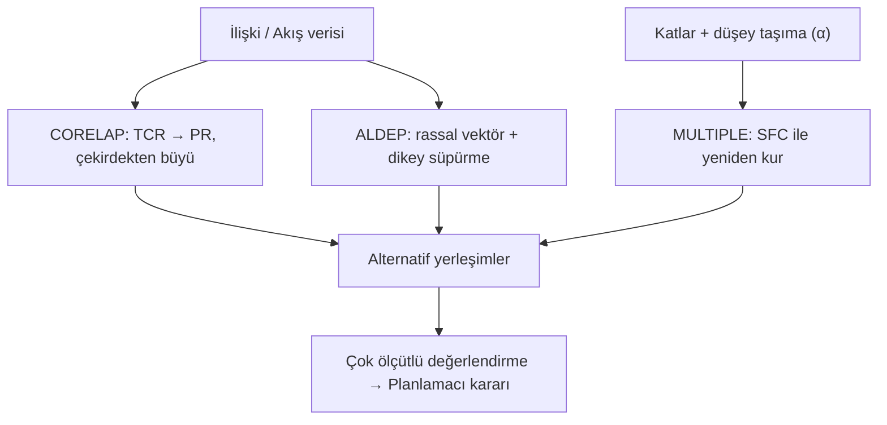

# HF10 - Yerleşim Tasarımı IV

> [!summary] Ana fikir
> Bu hafta üç oluşturma/değerlendirme algoritmasını öğreniyoruz: **CORELAP** ilişki puanlarından çekirdekten dışa doğru en iyi yerleşimi kurar, **ALDEP** rassallıkla çok sayıda alternatif üretir, **MULTIPLE** ise alan doldurma eğrileriyle çok katlı tesislerde komşu olmayan bölümler arasında bile değişim yaparak uzaklık esaslı maliyeti düşürür.

---

## 1. Kavramsal Açıklama — Neden bu algoritmalar?

Bir önceki haftaya kadar (CRAFT/MCRAFT) elimizde **mevcut bir yerleşim** vardı ve onu iyileştiriyorduk. Bu hafta soru tersine dönüyor: **Hiç yerleşim yokken sıfırdan bir taslak nasıl üretilir?** İşte bu noktada **oluşturma (construction) algoritmaları** devreye girer.

İki temel felsefe vardır:

| Yaklaşım | Mantık | Girdi türü |
|---|---|---|
| **Komşuluk esaslı** (CORELAP, ALDEP) | "Hangi bölümler yan yana olmalı?" → ilişki (REL) tablosu | Nitel yakınlık (A, E, I, O, U, X) |
| **Uzaklık esaslı** (MULTIPLE, CRAFT) | "Bölümler arası akış × uzaklık ne kadar?" → akış matrisi | Nicel akış/maliyet |

Gerçek hayatta bu üç algoritmanın izi her yerde görülür:
- **CORELAP** → bir ofis katında yöneticilerin, ortak sekreterlik ve toplantı odasının kümelenmesi (güçlü ilişkiler merkezde toplanır).
- **ALDEP** → bir fabrikanın ön tasarım aşamasında planlamacıya "işte 20 farklı taslak, beğendiğini seç" demek için.
- **MULTIPLE** → çok katlı bir hastane veya AVM'de asansör/merdiven maliyetinin yatay taşımaya eklenmesi.

> [!info] Sınıflandırma haritası (slayt 3)
> ```mermaid
> flowchart TD
>   Alg[Yerleşim Algoritmaları] --> Olu[Oluşturma - Construction]
>   Alg --> Gel[Geliştirme - Improvement]
>   Olu --> G1[Grafik Tabanlı: ALDEP · CORELAP · PLANET]
>   Olu --> G2[Blok Plan: BLOCPLAN · LOGIC · Karışık Tamsayı Prog.]
>   Gel --> I1[İkili Yer Değiştirme: CRAFT · MCRAFT]
>   Gel --> I2[MULTIPLE — hem kurma hem geliştirme]
> ```

---

## 2. CORELAP (Computerized Relationship Layout Planning)

Lee ve Moore tarafından **1967**'de geliştirilmiş, **komşuluk esaslı bir oluşturma algoritmasıdır**. İlişki (REL) diyagramından faydalanır, tesisin sınırını ihmal eder ve bölümleri **birer birer** çekirdekten dışa doğru yerleştirir. En fazla 70 bölüm, 40×40 ızgara sınırı vardır.

### 2.1. Toplam Yakınlık Derecesi (TCR)

CORELAP'ın bölüm **seçim** ölçüsü Toplam Yakınlık Derecesidir (Total Closeness Rating):

$$TCR_i=\sum_{\substack{j=1\\ j\ne i}}^{n} v(r_{ij})$$

| Sembol | Anlamı |
|---|---|
| $TCR_i$ | $i$ bölümünün toplam yakınlık derecesi |
| $v(r_{ij})$ | $i$–$j$ bölümleri arasındaki ilişki kodunun sayısal değeri |
| $r_{ij}$ | İlişki kodu (A, E, I, O, U, X) |
| $n$ | Toplam bölüm sayısı |

**Sayısallaştırma kuralı tesise göre değişir** (slayt 8). Sınavda hangi ölçek verildiyse onu kullan:

| Kod | Öncelik | Ölçek-1 | Ölçek-2 | Ölçek-3 | Ölçek-4 |
|---|---|---|---|---|---|
| **A** | Kesinlikle gerekli | 4 | 6 | 32 | **125** |
| **E** | Çok önemli | 3 | 5 | 16 | **25** |
| **I** | Önemli | 2 | 4 | 8 | **5** |
| **O** | Az önemli | 1 | 3 | 4 | **1** |
| **U** | Önemsiz | 0 | 2 | 2 | **0** |
| **X** | İstenmeyen | −1 | 1 | −32 | **−125** |

### 2.2. Yerleştirme Puanı (PR — Placing Rating)

Bir bölümün **nereye** konacağına PR karar verir. PR, yerleşecek bölüm ile **komşu olacağı tüm bölümlerle** olan ağırlıklı yakınlıkların toplamıdır:

$$PR_k(\text{konum})=\sum_{j\in N(\text{konum})} c_{kj}\cdot v(r_{kj})$$

| Sembol | Anlamı |
|---|---|
| $PR_k$ | $k$ bölümünün ilgili konumdaki yerleştirme puanı |
| $N(\text{konum})$ | O konumun komşu olduğu yerleşmiş bölümler kümesi |
| $c_{kj}$ | Komşuluk katsayısı: **tam komşu = 1**, **yarım komşu = 0,5** |
| $v(r_{kj})$ | $k$–$j$ ilişkisinin sayısal değeri |

> [!note] Tam ve yarım komşuluk (slayt 11)
> Merkez bölümün etrafındaki 8 konum saat yönünün tersine numaralanır:
> - **Tam komşuluk (Adjacent):** 1, 3, 5, 7 konumları → kenardan temas → **katsayı 1**
> - **Yarım komşuluk (Touching):** 2, 4, 6, 8 konumları → köşeden tek nokta teması → **katsayı 0,5**
>
> ```
>   8 | 1 | 2
>  ---+---+---
>   7 | 0 | 3
>  ---+---+---
>   6 | 5 | 4
> ```
> Yerleştirme **batı kenarından (7. konum) başlar, saat yönünün tersine** ilerler.

> [!warning] Numaralama tuzağı — temas tipine bak
> CORELAP konum numaraları kaynaktan kaynağa değişebilir. Sınavda **numarayı değil temas tipini** esas al:
> - **Tam komşu (katsayı = 1):** kenar paylaşıyor → kuzey / doğu / güney / batı komşusu
> - **Yarım komşu (katsayı = 0,5):** yalnızca köşe temas → köşegen komşusu
>
> Yerleştirdiğin bölümün kaç tam, kaç yarım komşusu olduğunu saymak için ızgaraya çiz ve **"kenara mı değiyor, köşeye mi?"** diye sor.

> [!tip] Akılda kalıcı — CORELAP "Taş atma" oyunu
> CORELAP adımlarını bir taş atma oyunu gibi düşün:
> 1. En ağır taşı (en yüksek **TCR**) **merkeze** at → ilk bölüm
> 2. Ona en yakın olmak isteyen (**en yüksek PR**) **yanına** gel → ikinci bölüm
> 3. **X ilişkisi** olan en sona ertele
> 4. **Beraberlik:** önce sınır uzunluğu büyük olan; o da eşitse TCR büyük olan
> 5. Boş konum kalmayana kadar devam
>
> *TCR = "herkes seni ne kadar istiyor?" | PR = "bu konumda yerleşmiş komşuların seni ne kadar istiyor?"*

### 2.3. CORELAP Algoritması — Adım Adım

1. **Sayısallaştır:** REL tablosundaki A/E/I/O/U/X kodlarını sayısal değerlere çevir.
2. **TCR hesapla:** Her bölümün satırındaki tüm değerleri topla.
3. **İlk bölümü seç:** En büyük TCR'li bölüm çekirdek olarak ortaya yerleştirilir. Beraberlikte içinde en çok **A** ilişkisi olan seçilir.
4. **X kontrolü:** İlk bölümle **X** ilişkisi olan varsa, o bölüm yerleşimin **en sonuna** itilir ve şimdilik göz ardı edilir. Beraberlikte **en küçük TCR** seçilir.
5. **Sonraki bölümü seç:** Yerleşmiş bölümlerle **A** (yoksa E, yoksa I, …) ilişkisi olan bölümler arasından en büyük TCR'li seçilir.
6. **Yerleştir:** Seçilen bölüm için tüm aday konumların PR puanı hesaplanır; **en yüksek PR**'li konuma atanır.
7. **Beraberlik bozma:** İki konumun PR'si eşitse **sınır uzunluğu** (ortak birim kare sayısı) büyük olan seçilir.
8. **Tekrarla:** Tüm bölümler yerleşene kadar 5–7 sürdürülür → **Yerleştirme Sırası (Placement Sequence)** oluşur.
9. **Değerlendir:** Toplam yerleşim skoru = Σ (ilişki değeri × en kısa dolaylı yol uzunluğu).

### 2.4. Tam Çözümlü Örnek — Slayt 12 (Bölüm yerleştirme / PR)

Yerleşmiş bölümler 1 ve 7. Bölüm 2 yerleştirilecek. İlişkiler: **2–1 = A (64)**, **2–7 = E (16)**.

| Senaryo | Açıklama | PR |
|---|---|---|
| (b) | Bölüm 2 sadece 1'e komşu | $1\cdot 64 = \mathbf{64}$ |
| (c) | Bölüm 2 sadece 7'ye komşu | $1\cdot 16 = \mathbf{16}$ |
| (d) | Bölüm 2 hem 1'e hem 7'ye komşu | $64+16 = \mathbf{80}$ |

**Karar:** En yüksek PR (d) seçilir. Ayrıca (d) seçeneğinin sınır uzunluğu 3 (en büyük), yani beraberlikte de kazanırdı.

> [!tip] Çözüm mantığı
> Her aday konum için "bu bölüm hangi yerleşmiş bölümlere değer?" sorusunu sor, değdiklerinin ilişki değerlerini (tam=×1, yarım=×0,5) topla. Maksimumu seç.

### 2.5. Tam Çözümlü Örnek — Slayt 79-86 (Çözümlü Örnek Soru-1, tam akış)

10 bölümlük REL tablosu; ölçek **A=10.000, E=1.000, I=100, O=10, U=0, X=−10.000**.

**Adım 1 — TCR tablosu (slayt 80):**

| Bölüm | A | E | I | O | U | X | TCR |
|---|---|---|---|---|---|---|---|
| 1 | 0 | 1 | 0 | 2 | 6 | 0 | 1.020 |
| 2 | 0 | 0 | 6 | 3 | 0 | 0 | 630 |
| 3 | 0 | 1 | 1 | 0 | 7 | 0 | 1.100 |
| 4 | 0 | 0 | 1 | 3 | 5 | 0 | 130 |
| 5 | 1 | 0 | 1 | 0 | 7 | 0 | 10.100 |
| 6 | 0 | 1 | 2 | 1 | 5 | 0 | 1.210 |
| 7 | 0 | 2 | 1 | 0 | 6 | 0 | 2.100 |
| 8 | 1 | 0 | 0 | 1 | 7 | 0 | 10.010 |
| 9 | 0 | 2 | 2 | 0 | 5 | 0 | 2.200 |
| **10** | **2** | **1** | **2** | **0** | **4** | **0** | **21.200** |

> Örnek hesap: $TCR_{10}=2(10.000)+1(1.000)+2(100)+0+0 = 21.200$.

**Adım 2 — Seçim sırası:**
1. En büyük TCR → **10** ilk yerleşir.
2. 10 ile A ilişkili olanlar: 5 (TCR 10.100) ve 8 (TCR 10.010). Büyük olan → **5**.
3. Yerleşmişlerle A ilişkili → **8**.
4. Süreç devam eder → nihai sıra: **10 – 5 – 8 – 9 – 7 – 6 – 2 – 3 – 1 – 4**.

**Adım 3 — Yerleştirme (PR) örnekleri:**

*Bölüm 5'in yerleştirilmesi (slayt 85):* 10 ile A (10.000). Tam komşu konumlar (1,3,5,7) 10.000; yarım komşu (2,4,6,8) 5.000. İlk en yüksek değer **1. konumda** → 5, **1. konuma** atanır.

*Bölüm 8'in yerleştirilmesi (slayt 86):* 8–10 = A (10.000), 8–5 = U (0).

| Konum | Hesap | PR |
|---|---|---|
| 1 | 8–5=U tam | 0 |
| 2 | — | 0 |
| 3 | 5 ile tam (U=0) + 10 ile yarım (10.000·0,5) | **5.000** |
| 4 | 5 ile yarım (0·0,5) + 10 ile tam (10.000) | **10.000** |

→ En yüksek **4. konum** seçilir; 8 oraya atanır.

### 2.6. Tam/Yarım Komşuluk Vurgusu — Örnek-3 (slayt 29-42)

Ölçek **A=125, E=25, I=5, O=1, U=0, X=−125**, bölümler eşit boyutlu, **"tek nokta teması = ağırlığın yarısı"** kuralı geçerli. Nihai sıra **7-5-9-3-1-4-2-6-8** bulunur. Buradaki kritik nüans, X ilişkili bölümün (Bölüm 8) en sona itilmesi ve köşe temaslarının 0,5 ile çarpılmasıdır.

---

## 3. ALDEP (Automated Layout Design Program)

CORELAP'a amaç ve girdi olarak benzer (komşuluk esaslı), ama **iki temel farkı** vardır:
1. **Rassallık (Randomness):** İlk bölüm ve ilişkisiz bölümler rastgele seçilir.
2. **Çok katlı kabiliyet** ve **çok sayıda alternatif** üretme.

> [!important] CORELAP vs ALDEP'in özü
> CORELAP **en iyi tek yerleşimi** bulmaya çalışır; ALDEP **birçok yerleşim** üretip kararı planlamacıya bırakır. Rassallık nedeniyle ALDEP her çalıştırmada farklı sonuç verir → en fazla 20 yerleşim üretilir.

### 3.1. ALDEP Algoritması — Adım Adım

**A) Bölüm Seçimi:**
1. İlk bölüm **rassal** seçilir.
2. O bölümle **eşik ilişki düzeyi** (kullanıcı belirler, örn. "E ve üstü") veya daha güçlü ilişkisi olan bölüm seçilir.
3. Böyle bölüm yoksa **rassal** seçilir.
4. Tüm bölümler seçilene kadar tekrarlanır → **Yerleşim Vektörü** oluşur.

**B) Bölüm Yerleştirme (Dikey Süpürme):**
5. Sol üst köşeden başlanır, **dikey süpürme paterni** ile aşağı–yukarı kıvrılarak doldurulur.
6. **Süpürme genişliği** (sweep width) kullanıcı tarafından belirlenir (1, 2, 3 kare).
7. Her bölüm için gereken birim kare sayısı dolana kadar süpürme devam eder.

**C) Değerlendirme:**
8. **Toplam Komşuluk Puanı** = yan yana gelen bölüm çiftlerinin ilişki değerleri toplamı.
9. Minimum gereksinim sağlanıyorsa yerleşim kaydedilir; prosedür tekrarlanır.

### 3.2. Tam Çözümlü Örnek — Slayt 48-54

Tesis **10×18**, süpürme genişliği **2**, minimum eşik **"E"**. Ölçek **A=64, E=16, I=4, O=1, U=0, X=−1.024**.

**Çözüm A — Bölüm seçimi (slayt 49):**

| Adım | Seçilen | Sebep |
|---|---|---|
| 1 | 4 | Rassal |
| 2 | 2 | 4 ile **E** |
| 3 | 1 | 2 ile **E** |
| 4 | 6 | Rassal |
| 5 | 5 | 6 ile **A** |
| 6 | 7 | Rassal |
| 7 | 3 | Son kalan |

→ **Vektör: 4-2-1-6-5-7-3**, Toplam Komşuluk Puanı = **120**.

**Çözüm B — Alternatif (slayt 52-53):**

| Komşu çift | İlişki | Değer |
|---|---|---|
| 2-1 | E | 16 |
| 1-4 | I | 4 |
| 4-5 | I | 4 |
| 5-6 | A | 64 |
| 6-7 | E | 16 |
| 7-3 | U | 0 |
| **Toplam** | | **104** |

→ **Vektör: 2-1-4-5-6-7-3**, puan = **104**.

**Karar:** İki alternatiften puanı yüksek olan (120 > 104) **A çözümü** daha iyidir; ancak nihai karar planlamacıya bağlıdır.

> [!tip] ALDEP'te neden çok alternatif?
> Rassallık yüzünden tek bir çalıştırma yanıltıcı olabilir. Birden fazla vektör üret, **komşuluk puanlarını karşılaştır**, en yükseği seç.

---

## 4. MULTIPLE (Multi-floor Plant Layout Evaluation)

**Çok katlı tesis yerleşim değerlendirmesi.** Hem kurma hem geliştirme algoritmasıdır, **uzaklık esaslıdır**. CRAFT'a benzer (dikdörtgen bölümler, kesikli gösterim) ama **komşu olmayan bölümler arasında da ikili değişim** yapabilir. Her iterasyonda yerleşimi yeniden kurmak için **Alan Doldurma Eğrisi (SFC — Space Filling Curve)** kullanır.

### 4.1. Çok katlı uzaklık formülü

Tek katlı modellerde yalnız yatay uzaklık vardır. MULTIPLE'da düşey taşıma maliyeti eklenir:

$$d_{ij}=d^{\text{yatay}}_{ij}+\alpha\,\lvert z_i-z_j\rvert$$

| Sembol | Anlamı |
|---|---|
| $d_{ij}$ | $i$–$j$ bölümleri arası toplam (eşdeğer) uzaklık |
| $d^{\text{yatay}}_{ij}$ | Yatay (kat içi) dikdoğrusal uzaklık |
| $z_i$ | $i$ bölümünün kat numarası |
| $\alpha$ | Düşey taşımanın yatay eşdeğer maliyet katsayısı |

$\alpha$, bir kat değişiminin kaç birim yatay taşımaya denk geldiğini gösterir. Asansör, konveyör, merdiven kapasitesi ve güvenlik kısıtları ayrıca modellenir.

### 4.2. Alan Doldurma Eğrisi (SFC) — Kurallar

1. Yerleşimdeki **tüm birim kareler** bir zincirle bağlanır.
2. Her kare **kesinlikle bir kez** ziyaret edilir.
3. Bir sonraki kare daima **komşu** olmalıdır (yalnız yatay/dikey hareket, çapraz yok).
4. Bölümler, **yerleşim vektörü** sırasına göre SFC boyunca doldurulur; her bölüm için gereken kare sayısına ulaşılınca sonrakine geçilir.

> [!note] Uygun eğriler (Conforming curves)
> Düzensiz bina, çok engel (duvar), sabit bölümler veya zorunlu başlangıç yerleşimi varsa **elle üretilen "uygun eğriler"** kullanılır. Sabit bölümler ve engeller ziyaret edilmez.

### 4.3. MULTIPLE Algoritması — Adım Adım

1. Boş binayı dolduracak bir **SFC veya uygun eğri** seç.
2. Bir **başlangıç yerleşim vektörü** belirle (herhangi bir sıra olabilir).
3. Bölümleri vektör sırasına göre SFC üzerinde yerleştir.
4. Yerleşim maliyetini (akış × uzaklık, çok katlıda $\alpha$'lı) hesapla.
5. **İkili değişim** uygula (komşu olmaları gerekmez), yeni vektörle yerleşimi yeniden kur.
6. Maliyet azaldıysa kabul et; iterasyonu sürdür.
7. Bölüm sınırlarını düzgünleştirmek için gerekirse **"masaj" (smoothing)** yap.

### 4.4. Tam Çözümlü Örnek — Slayt 58-69

Vektör **1-2-3-4-5-6**, alanlar (m²): 1→16, 2→8, 3→4, 4→16, 5→8, 6→12. Bölümler SFC boyunca sırayla yerleştirilir. Sonra **1 ve 5 değiştirilir** → yeni vektör **5-2-3-4-1-6**. SFC sabit kaldığı için yalnız bölüm etiketleri sıraya göre yeniden dağıtılır; alan ihtiyaçları korunur.

> [!example] Alternatif SFC ile maliyet (slayt 75)
> Aynı bölümler farklı vektörlerle:
> - D-B-H-C-F-E → z = **54.200** (en iyi)
> - D-E-F-H-B-C → z = 54.540
> - D-E-F-B-C-H → z = 54.900
>
> Görüldüğü gibi farklı SFC'ler benzer ama eşit olmayan maliyetler verir; MULTIPLE her iterasyonda büyük bir çözüm kümesi taradığı için CRAFT'tan **çok büyük olasılıkla daha düşük** maliyet bulur.

---

## 5. Üç Algoritmanın Karşılaştırması

| Özellik | **CORELAP** | **ALDEP** | **MULTIPLE** |
|---|---|---|---|
| Tip | Oluşturma | Oluşturma | Oluşturma + Geliştirme |
| Esas | Komşuluk | Komşuluk | Uzaklık |
| Girdi | REL tablosu | REL tablosu | Akış matrisi |
| Seçim ölçüsü | TCR | Rassal + eşik | Yerleşim vektörü |
| Yerleştirme | PR (çekirdekten dışa) | Dikey süpürme | SFC üzerinde |
| Çok kat | Hayır | Evet (sınırlı) | **Evet (asıl gücü)** |
| Alternatif | Tek "en iyi" | **Çok sayıda** | Çok sayıda (SFC ile) |
| Değişim kısıtı | — | — | **Komşu olmayanlar da** |



---

## 6. Algoritma Seçim Kılavuzu

- Nitel yakınlık + **tek kat**, en iyi tek çözüm isteniyorsa → **CORELAP**.
- **Çok sayıda alternatif** ve hızlı taslak isteniyorsa → **ALDEP**.
- **Çok katlı yapı**, düşey taşıma maliyeti, komşu olmayan değişim → **MULTIPLE**.
- Düzgün (dikdörtgen) bloklar isteniyorsa → **BLOCPLAN / LOGIC**.
- Elde **mevcut yerleşim** varsa iyileştirme için → **CRAFT / MCRAFT** (HF09).

> [!warning] Sık yapılan hatalar
> - **Komşuluk katsayısını unutmak:** Yarım (köşe) komşuluk **0,5** ile çarpılır; bunu 1 almak PR'yi şişirir.
> - **X ilişkisini atlamak:** CORELAP'ta X'li bölüm **en sona** itilir, göz ardı edilmez — sona yerleştirilmek üzere işaretlenir.
> - **Yanlış ölçek:** A/E/I/O/U/X değerleri soruya göre değişir (4 farklı ölçek var). Soruda verilen ölçeği kullan, ezbere 125/25/5… yazma.
> - **TCR'de kendini sayma:** $TCR_i$ hesaplanırken $j\ne i$; bölümün kendisiyle ilişkisi yoktur.
> - **ALDEP rassallığını görmezden gelmek:** Tek çalıştırma yeterli değildir; alternatifler üretilip komşuluk puanları karşılaştırılmalı.
> - **MULTIPLE'da çapraz hareket:** SFC yalnız yatay/dikey ilerler; çapraz atlama yapılamaz.
> - **Optimallik yanılgısı:** Hiçbiri optimal değildir — hepsi **sezgiseldir**. İnsan planlamacı son karar verici olarak kalır.

---

## 7. Pratik Sorular

> [!question] Soru 1 — TCR hesabı
> Bir bölümün diğer 5 bölümle ilişkileri sırasıyla A, E, U, O, X. Ölçek **A=125, E=25, I=5, O=1, U=0, X=−125** ise bu bölümün TCR'si kaçtır?

> [!answer]- Cevap
> $TCR = 125 + 25 + 0 + 1 + (-125) = \mathbf{26}$.
> X ilişkisinin negatif değerini eklemeyi unutma; bu, bölümü TCR sıralamasında geriye iter.

> [!question] Soru 2 — Yerleştirme Puanı (PR)
> Bölüm K yerleştirilecek. Aday konumda iki yerleşmiş bölüme değiyor: A'ya **tam komşu** (A=125), B'ye **yarım komşu** (B ile E=25). Bu konumun PR'si nedir?

> [!answer]- Cevap
> $PR = 1\cdot 125 + 0,5\cdot 25 = 125 + 12,5 = \mathbf{137,5}$.
> Tam komşuluk katsayısı 1, yarım komşuluk 0,5'tir.

> [!question] Soru 3 — ALDEP komşuluk puanı
> ALDEP vektörü 3-1-2-4 üretildi. Yan yana gelen çiftler 3-1=I, 1-2=A, 2-4=O. Ölçek **A=64, E=16, I=4, O=1** ise Toplam Komşuluk Puanı kaçtır?

> [!answer]- Cevap
> $4 + 64 + 1 = \mathbf{69}$.
> Yalnız komşu (yan yana) çiftler sayılır; vektörde uzak olan 3-4 gibi çiftler hesaba katılmaz.

> [!question] Soru 4 — MULTIPLE düşey uzaklık
> İki bölüm aynı x-y konumunda ama farklı katta: $z_i=1$, $z_j=4$. Yatay uzaklık 6 birim, $\alpha=10$ ise eşdeğer uzaklık nedir?

> [!answer]- Cevap
> $d_{ij} = 6 + 10\cdot|1-4| = 6 + 30 = \mathbf{36}$ birim.
> 3 kat fark, $\alpha=10$ ile 30 birim yatay eşdeğeri taşıma maliyeti getirir.

> [!question] Soru 5 — Algoritma seçimi
> 6 katlı bir hastanede asansör maliyeti yüksek; bölümler arası malzeme akışı biliniyor ve komşu olmayan birimleri de takas etmek istiyoruz. Hangi algoritma?

> [!answer]- Cevap
> **MULTIPLE.** Çok katlı yapı + uzaklık esaslı akış + komşu olmayan değişim üçlüsü tam MULTIPLE'ın güçlü olduğu alandır. CORELAP/ALDEP komşuluk esaslı ve (MULTIPLE kadar) çok katlı düşey maliyet modellemez.

---

## 8. Kaynaklar ve Öğrenme Paketleri

- [[HF10-P10-Yerlesim Tasarımı IV-2025.pptx|Ders sunumu]]
- [[05 Kaynaklar/MarkItDown/HF10 - Ham|MarkItDown ham metni]]
- Öğrenme paketleri:
  - [[HF10A - CORELAP]] — TCR, PR, tam/yarım komşuluk derinlemesine
  - [[HF10B - ALDEP]] — sıra doldurma, ilişki eşiği, alternatif üretme
  - [[HF10C - MULTIPLE]] — çok katlı yapı, SFC, $\alpha$ katsayısı

Önceki: [[HF09 - Yerleşim Tasarımı III]] · Sonraki: [[HF11 - Tesis Konumu I]]
