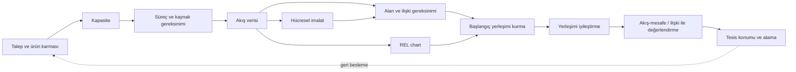
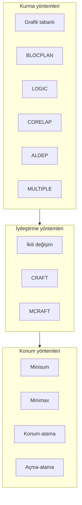

# Tesis Planlama Kavram Ağı

## Büyük resim

Bu ders tek tek algoritmalar toplamı değildir. Zincir şudur:

$$
\text{talep}\rightarrow\text{kapasite}\rightarrow\text{kaynak}\rightarrow
\text{akış}\rightarrow\text{alan/ilişki}\rightarrow\text{yerleşim}\rightarrow\text{konum}
$$

## Köprü kavramlar

| Kavram | Nereden gelir? | Nereye gider? | Kritik bağlantı |
|---|---|---|---|
| Talep | Pazar/üretim planı | Kapasite, makine, akış | Aynı talep farklı süreçlerde farklı akış üretir |
| Verim ve fire | Süreç performansı | Giriş miktarı, donanım | Net talep brüt iş yüküne çevrilir |
| From-to | Rotalar ve eşdeğer yük | Hollier, CRAFT, maliyet | Yön bilgisi korunur |
| REL kodu | Akış + akış dışı gerekçe | SLP, CORELAP, ALDEP | Sıfır akış otomatik X değildir |
| Alan | Makine + servis + dolaşım | Blok yerleşim | Bölüm şekli algoritmanın sonucunu sınırlar |
| Uzaklık | Yerleşim geometrisi | $\sum fcd$, minisum, minimax | Aynı koordinat farklı metrikte farklı sonuç verir |
| Atama | Müşteri-bölüm/tesis eşleşmesi | Maliyet ve konum | Konum atamayı, atama konumu değiştirir |

## Yöntem aileleri

### Kurma mı, iyileştirme mi?

- **Kurma:** elinde yalnız ilişki/akış ve alan vardır; ilk yerleşimi üretirsin.
- **İyileştirme:** elinde mevcut bir yerleşim vardır; takaslarla amaç değerini geliştirirsin.
- Bir kurma yönteminin çıktısı, CRAFT gibi bir iyileştirme yönteminin başlangıcı olabilir.

### Nicel mi, nitel mi?

- **Nicel:** from-to, MAG, mesafe, taşıma maliyeti, açma-hizmet maliyeti.
- **Nitel:** A-E-I-O-U-X ve gerekçe kodları.
- BLOCPLAN ve SLP iki tür bilgiyi birlikte kullanabilir; ölçekleri karıştırmadan dönüştür.

## Değişmeyen sınav ilkeleri

1. Yönlü matriste $f_{ij}$ ile $f_{ji}$ aynı hücre değildir.
2. Tam sayı kaynak gereksinimi çoğunlukla yukarı yuvarlanır.
3. Amaç değerini karşılaştırmadan önce bütün adaylarda aynı uzaklık ve sayım kuralını kullan.
4. Ağırlıklı medyanda toplamın tam yarısı optimum aralık oluşturabilir.
5. Sezgisel yerleşim algoritmaları küresel optimum garantisi vermez.
6. Bir modelde değişken, amaç fonksiyonu ve kısıtlar birlikte yazılmalıdır.

## Çalışma bağlantıları

- [[00 Pano/Yöntem Seçici|Yöntem Seçici]]
- [[03 Formüller/Formül Föyü|Formül ve Kontrol Föyü]]
- [[09 Öğrenme Paketleri/Öğrenme Paketleri|27 Öğrenme Paketi]]
- [[07 Ekler/Diyagramlar/Görsel Atlas|Görsel Atlas]]
- [[08 Hesaplamalar/Sınav Doğrulama Raporu|Hesap Doğrulama]]
