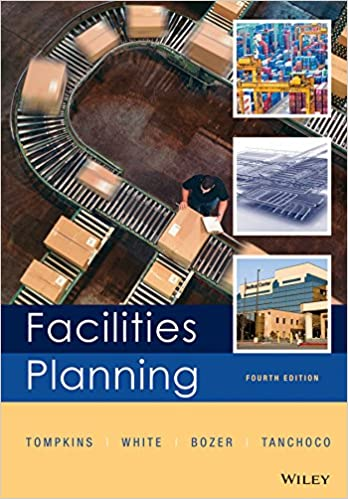
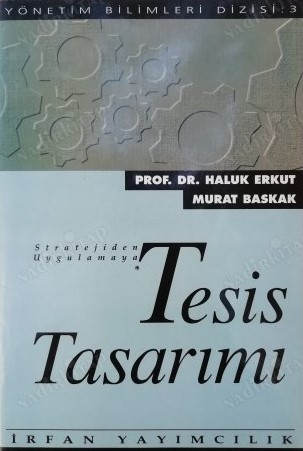
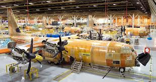
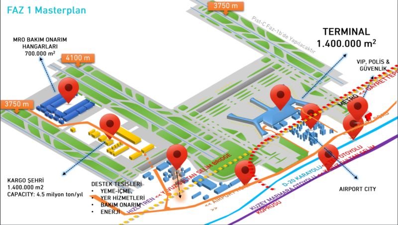
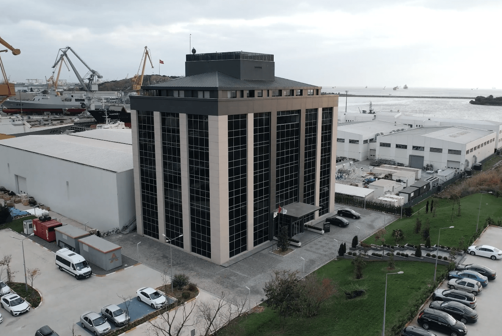
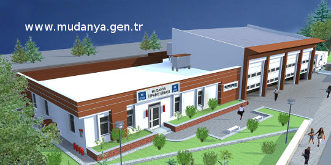
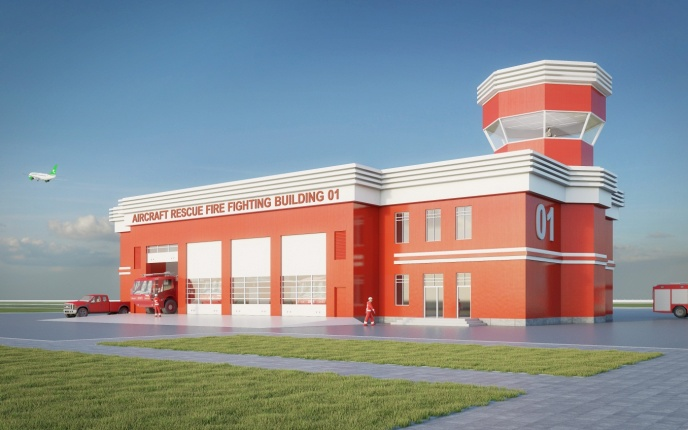
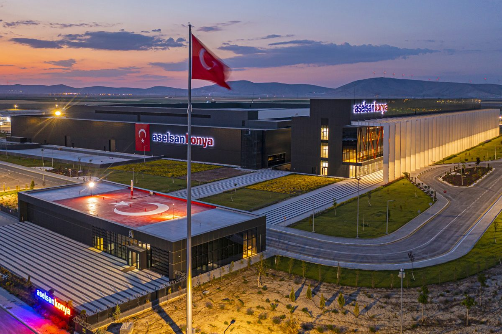
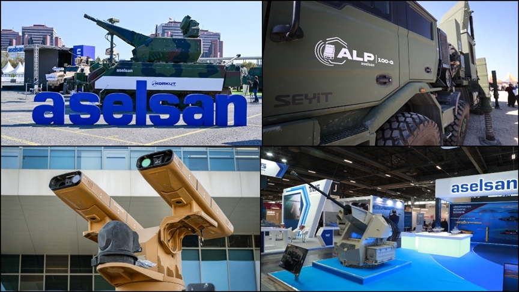

<!-- Slide number: 1 -->
# END303 Tesis Planlama ve YerleşimindeTemel Kavramlar
Dr.Öğr.Üyesi Gökçe KILIÇKAYA ÇAKMAK

END303 TESİS PLANLAMA VE YERLEŞİM
1

<!-- Slide number: 2 -->
# END303 Tesis Planlama ve Yerleşim

| Dersin Adı | END303 Tesis Planlama ve Yerleşim |  |  |
| --- | --- | --- | --- |
| Öğretim Görevlisi | Dr.Öğr.Üyesi Gökçe KILIÇKAYA ÇAKMAK |  |  |
| E-posta | gokcekilickaya.c@msu.edu.tr |  |  |
| İletişim | 4519 | Oda | A207 |
| Ders Saati | 3-0-0 |  |  |
| Dersin Önkoşulu | END 203- Yöneylem Araştırması I END 204 - Mühendislik Ekonomisi |  |  |
| Referans Kaynaklar | Erkut H., Baksak M., Stratejiden Uygulamaya Tesis Tasarımı, İrfan Yayımcılık, 2001. Tompkins J.A., J.A. White, Y.A.Bozer, E.H.Frazelle, Facilities Planning, John Wiley&Sons 4. Ed.2010. Francis, R.L., L.F.McGinnis, Jr.and J.A White: Facility Layout and Location: An Analytical Approach, Printice Hall, 2nd Ed. 1992. Bayram Ali Su, Demir Aslan, Tesis Planlama, Dokuz Eylül Üniversitesi Yayınları, 1997. |  |  |

END303 TESİS PLANLAMA VE YERLEŞİM
2

<!-- Slide number: 3 -->
# Başarı Değerlendirme
| Başarı Değerlendirme |  |  |  |
| --- | --- | --- | --- |
| Faaliyet | Adedi | Katkısı | Değerlendirmeye Katkısı |
| Ara Sınav (Vize) | 1 | % 24 | % 40 |
| Kısa Sınav (Quizzes) | 1 | % 16 |  |
| Final Sınavı | 1 | % 100 | % 60 |
END303 TESİS PLANLAMA VE YERLEŞİM
3

<!-- Slide number: 4 -->
# Dersin Konu ve Kapsamı
Tesis Planlamada ve Yerleşiminde Temel Kavramlar,
Tesis Kapasite Planlaması,
Ürün, Süreç ve Çizelgeleme Tasarımı II-III
Akış, Alan ve Etkinlik İlişkileri I-II
Malzeme Taşıma ve Depolama Sistemleri.
Yerleşim Tasarımı I-IV
Tesis Konumu I-II
Özel Yerleşim Modelleri
Ağ Konum Problemi teknikleri öğrenilecektir.

END303 TESİS PLANLAMA VE YERLEŞİM
4

<!-- Slide number: 5 -->
# Ürün, Süreç ve Çizelgeleme Tasarımı I
END303 TESİS PLANLAMA VE YERLEŞİM
5

<!-- Slide number: 6 -->
# Ders Planı
Giriş (Chapter 1)
Tesis Planlamanın Tanımı
Tesis Planlamasının Amaçları
Sürekli Tesis Planlama
Tesis Planlamanın Önemi
Ürün, Süreç ve Çizelgele Tasarımı I (Chapter 2)

END303 TESİS PLANLAMA VE YERLEŞİM
6

<!-- Slide number: 7 -->
# Tesis (Facility) Nedir?
Tesis : Belli bir iş için kurulmuş yapı
Tesis etmek (To facilitate): Kurmak, Kolaylaştırmak, temelleştirmek

Tesis; Kurumsal bir yapıdır. Belirli bir amaca yönelik olarak organize olmuş, belli bir organizasyona sahip yapıdır.
Fabrika, Atölye, Depo, Okul, Hastane, Hava Üssü, vb.
Tesis; Daha geniş manada belli bir işin daha kolay yapılması için düzenlenmiş olan araçlar.

END303 TESİS PLANLAMA VE YERLEŞİM
7

<!-- Slide number: 8 -->
# Tesis (Facility) Nedir?
 Tesis sadece bir alan ve buradaki fiziki donanımdan ibaret değildir.
 Tesisi tasarlayan, kuran, ayarlayan, çalıştıran, kullanan, bakımını yapan ve gerekirse değiştiren insanlar; tesisin çalıştırılmasına yön veren bilgi, deneyim, talimat gibi elle tutulamayan, gözle görülemeyen unsurlar da bütünün parçalarıdır.
 Tesis, bir üretim veya hizmetin bazı süreçlerinin veya tamamının yapıldığı yer ve varsa buradaki üretimde kullanılan araçları da kapsayan genel bir kavramdır.

END303 TESİS PLANLAMA VE YERLEŞİM
8

<!-- Slide number: 9 -->
# Tesis (Facility) Nedir?
Tesis Planlama; kapasite, konum, yerleşim, süreç ve destek altyapılarını içeren bütünleşik bir karardır.

Tesis türleri:
Fabrikalar → Ürün üretimi (örneğin mühimmat, uçak parçaları, elektronik sistemler)
Enerji Santralleri → Elektrik üretimi (nükleer, termik, güneş, rüzgar)
Petrol Rafinerileri → Yakıt üretimi ve dağıtımı (uçak yakıtı – jet A1)

END303 TESİS PLANLAMA VE YERLEŞİM
9

<!-- Slide number: 10 -->
# Tesis Tasarım ve Planlamanın Tarihi Süreci
MÖ 4000 Mısırlılar piramitlerin yerini astrolojik hesaplara gore bulmada uzmanlaştılar.
MÖ 100 - MS 100 Romalılar Arena, tapınak, anfi ve diger binalarin planlamasında ilerlediler. Kamu ve Yerleşim planları geliştirdiler.
1700-1900 Sanayi Devrimi
1910 ilk endüstri kitabı “Factory Organization and Administration” basıldı (Hugo Deimer).
1913 Henry Ford tarafindan ilk hareketli Montaj Hattı kuruldu.

<!-- Slide number: 11 -->
# Tesis Tasarım ve Planlamanın Tarihi Süreci
1954: Ilk Mikro ve Makro seviyede tesis mekanının tespiti probleminde “Quadratik Atama Problemi” yöntemi kullanıldı.
1955-1995: “Quadratik Atama Problemi” icin optimum ve heuristik algoritmalar geliştirildi.
1959: Sistematik isyeri planlamasi Muther Tarafindan gelistirildi.
1963: CRAFT( Computerized Relative Allocation of Facilities Techniques) Armour ve Buffa.
1980 lerin basinda: Esnek üretim Sistemleri kavramı tanıtıldı. üretim hücrelerinde, orta seviye çeşitlilik, hacim düsünülerek fabrika genelinde esneklik hedeflendi.

END303 TESİS PLANLAMA VE YERLEŞİM
11

<!-- Slide number: 12 -->
# Devam: Tesis Tasarım ve Planlamanin Tarihi Süreci
1980 lerin sonlarında bu esneklik otomatize edilmeye başladı.
1985’ten sonra tesis tasarımı problemi icin modern yazılımlar geliştirilmeye başladı.
1990’dan günümüze: Yeni Tesis Tasarımı kavramları, Dinamik düzen, robust düzen, Tekrar Konfigüre Edilebilen Duzenler.

### Notes:

<!-- Slide number: 13 -->
# Tesis Örnekleri
Fabrikalar,
Enerji Santralleri,
Petrol Rafineleri

END303 TESİS PLANLAMA VE YERLEŞİM
13

<!-- Slide number: 14 -->
# Tesis Örnekleri
Okullar,
Hastaneler,
İtfaiyeler

END303 TESİS PLANLAMA VE YERLEŞİM
14

<!-- Slide number: 15 -->
# Tesis Örnekleri
Askeri Üs Bölgeleri

END303 TESİS PLANLAMA VE YERLEŞİM
15

<!-- Slide number: 16 -->
# Tesis Örnekleri
Hava Araçları

END303 TESİS PLANLAMA VE YERLEŞİM
16

<!-- Slide number: 17 -->
# Tesis Örnekleri
Hava Savunma Sistemleri

END303 TESİS PLANLAMA VE YERLEŞİM
17

<!-- Slide number: 18 -->
# Tesis Örnekleri
 Atölyeler

END303 TESİS PLANLAMA VE YERLEŞİM
18

<!-- Slide number: 19 -->
# Tesis Örnekleri

Tezgâh ve Teçhizatlar

END303 TESİS PLANLAMA VE YERLEŞİM
19

<!-- Slide number: 20 -->
# Tesis Örnekleri
El Aletleri

END303 TESİS PLANLAMA VE YERLEŞİM
20

<!-- Slide number: 21 -->
# Tesis Örnekleri
Tesisat (Ağ ve Şebekeler)

END303 TESİS PLANLAMA VE YERLEŞİM
21

<!-- Slide number: 22 -->
# Tesis Örnekleri
 Taşıma –yükleme araçları
 Hizmet kesiminde vezne, ameliyathane vb. Tıbbi Bölümler
 Herhangi bir iş için ayrılmış alanlar, bölüm ve departmanlar

END303 TESİS PLANLAMA VE YERLEŞİM
22

<!-- Slide number: 23 -->
# Tesis Örnekleri
Askerî Fabrikalar
ASFAT (Askeri Fabrika ve Tersane İşletme Anonim Şirketi) veya 1. Hava İkmal Bakım Merkezi: Uçak bakım-onarım, parça üretimi

END303 TESİS PLANLAMA VE YERLEŞİM
23

<!-- Slide number: 24 -->
# Tesis Örnekleri
Aselsan, Roketsan, TUSAŞ gibi savunma sanayi tesisleri

END303 TESİS PLANLAMA VE YERLEŞİM
24

<!-- Slide number: 25 -->
# Tesis Örnekleri

Türk Havacılık ve Uzay Sanayii AŞ’nin Kahramankazan (Ankara) yerleşkesi
END303 TESİS PLANLAMA VE YERLEŞİM
25

<!-- Slide number: 26 -->
# Tesis Planlama nedir?
Bir üretim işletmesi için tesis planlaması, üretim tesisinin üretimi en iyi nasıl gerçekleştireceğini tayin etmektir.
Tesis planlama konusunun uygulanması, basit kontrol listelerinden karmaşık matematiksel modellere kadar geniş bir alanı kapsamaktadır.
Tesis Planlama, bir etkinliğin somut varlıklarını o etkinliğin amaçlarını en iyi nasıl destekleneceğinin belirlenmesidir.
Tesis Planlama :
Tesislerin Konumlandırılması (Facilities location)
Tesis Tasarımı (Facilities design)
Tesis Sistemlerinin Tasarımı (Facility systems design)
Yerleşim Düzenin Tasarımı (Layout design)
Taşıma Sistemlerinin Tasarımı (Handling systems design)

END303 TESİS PLANLAMA VE YERLEŞİM
26

<!-- Slide number: 27 -->
# Tesis Planlamanın Genel Yapısı
END303 TESİS PLANLAMA VE YERLEŞİM
27

<!-- Slide number: 28 -->
# Tesislerin Konumlandırılması (Facilities location)
 Tesislerin Konumlandırılması;
 Faktörler:
 Yakınlık (Closeness): Pazara, Hammaddelere, Tedarikçilere, diğer tesislere ve rakiplere yakınlık.
 Coğrafik Alan (Geographical area): Bölgeleme, Ulaştırma, İş gücü, Demografik yapı, İklim Koşulları, Çevresel etkenler.
 Sabit ve Değişken Maliyetler

END303 TESİS PLANLAMA VE YERLEŞİM
28

<!-- Slide number: 29 -->
# Tesis Yeri Seçim Probleminin Sınıflandırılması

END303 TESİS PLANLAMA VE YERLEŞİM
29

### Notes:

<!-- Slide number: 30 -->
# Tesis Tasarımı (Facilities design)
Tesis Sistemlerinin Tasarımı (Facility systems design)
Yerleşim Tasarımı (Layout design)
Taşıma Sistemlerinin Tasarımı (Handling system design)

END303 TESİS PLANLAMA VE YERLEŞİM
30

<!-- Slide number: 31 -->
# Tesis Tasarımı nedir?
Tesis tasarımı, tesis yerleşim yeri ve tesis tasarımının belirlenmesi için gerekliliklerin bir araya getirilmesi çabasıdır.
Endüstriyel ürün üreten veya hizmet veren işletme veya organizasyonların, ilk düşünce aşamasından başlayarak, ilk üretim veya ilk hizmet verilen ana kadar geçen süre içinde tüm yönleriyle oluşturulması sürecidir.

END303 TESİS PLANLAMA VE YERLEŞİM
31

<!-- Slide number: 32 -->
# Tesis Sistemlerinin Tasarımı (Facility systems design)
Yapı Sistemleri, Çalışma Alanı Sistemi, Atmosferik sistemler, Elektrik ve Işıklandırma Sistemleri, İletişim Sistemleri, Hayat idame ve güvenlik Sistemleri, Sağlık ve atık temizleme sistemleri ve diğerleri.
Hangi sistemler gerekli,
Bu sistemler nereye gerekli
Tüm tesis içine bu sistemlerin entegrasyonu

END303 TESİS PLANLAMA VE YERLEŞİM
32

<!-- Slide number: 33 -->
# Yerleşim Düzenin Tasarımı
Üretim alanları, üretimle ilgili ve diğer destek alanlarının yerleşim yerlerinin düzenlenmesiyle ilgilidir.
Tesis binası içindeki tüm makineleri, ekipmanları ve mobilyaları kapsar.
Belirlenecekler :
Blok Yerleşim Düzeni (Block layout): Planlanan departmanların yada bölümlerin büyüklüğü ve yerleşimiyle ilgilidir.
Detay Yerleşim Düzeni (Detailed layout): Tüm ekipmanların ve depolama alanlarının kesin yerleşim yerlerinin belirlenmesiyle ilgilidir.

END303 TESİS PLANLAMA VE YERLEŞİM
33

<!-- Slide number: 34 -->
# Taşıma Sistemlerinin Tasarımı (Handling systems design)
Tesisler arasındaki gerekli etkileşimi sağlayacak mekanizmalardır.
Üretimi desteklemek amacıyla gerekli taşıma sistemleri olup; malzemelerin, personelin, bilginin ve ekipmanların taşınmasıyla ilgilidir.
 Mal kabul, Depolama, Geri Dönüşüm ve Geri Alma (retrieval), nakliye/ulaştırma, paketleme ve gönderme, posta sistemi ve personel taşıma sistemlerinden oluşur.

END303 TESİS PLANLAMA VE YERLEŞİM
34

<!-- Slide number: 35 -->
# Taşıma Sistemlerinin Tasarımı (Handling systems design)
Malzeme Taşıma Sistemi veya Tesis Planlama hangisi önce gelmelidir?

Tesis Yerleşim düzenlemesi ve Malzeme Taşıma Sistemi eş zamanlı tasarlanmalıdır.

HER İKİSİ BİRDEN!!    BOTH!
END303 TESİS PLANLAMA VE YERLEŞİM
35

<!-- Slide number: 36 -->
# Tesis Planlamasının Amaçları
Müşteri Memnuniyetinin Arttırılması: İşlemleri basitleştirerek, müşteriye verilen vaatlere uygun davranarak ve müşteri ihtiyaçlarını karşılayarak müşteri memnuniyetinin iyileştirilmesi.
Maksimum hız: Müşteri ihtiyaçlarına en büyük hızda cevap verme.
Maliyetlerin azaltılması ve Tesis kârlılığının artırılması.
Tedarik Zinciri Entegrasyonu: İşbirliği ve iletişim sayesinde TZ entegrasyonun sağlanması.
Organizasyonel vizyonun Desteklenmesi.
Kaynak Kullanımlarının Etkinliği.
Uygulama ve bakım kolaylığı.
Çalışanlarının güvenliğinin sağlanması: Çalışan güvenliği ve iş tatminin sağlanması.

END303 TESİS PLANLAMA VE YERLEŞİM
36

<!-- Slide number: 37 -->
# Tesis Planlamasının Amaçları
Envanter dönüş hızının, çalışan katılımının, sürekli iyileşmenin en büyüklenmesi, gereksiz envanterin en küçüklenmesi sonucunda varlıkların dönüş hızının artırılması.
Geliştirilmiş malzeme taşıma sistemleri, malzeme kontrolu ve titizlik yoluyla organizasyonun vizyonunu destekleme.
İnsan, ekipman, alan ve enerjinin etkin kullanımı.
Yatırımların Geri dönüş oranın maksimizasyonu: Tüm sermaye yatırımlarını kapsayacak şekilde yatırım geri dönüşünün en büyüklenmesi.
Varlıkların geri dönüş oranın Maksimizasyonu.
Bakım kolaylığının sağlanması ve özendirilmesi.

END303 TESİS PLANLAMA VE YERLEŞİM
37

<!-- Slide number: 38 -->
# Tesis Planlamasının Amaçları
Bir tesis tasarımı yapılırken 4 ana etmen göz önünde bulundurulmalıdır.
Müşteriler,
İç Verim,
Çalışma Ortamı ve Çevresi,
Tedarik Zincirine Entegrasyon.

END303 TESİS PLANLAMA VE YERLEŞİM
38

<!-- Slide number: 39 -->
# Tesis Planlamasının Amaçları
Teknoloji

Tesis İçindeki İlişkilerin Optimizasyonu
Çevre
Devlet

Tedarikçiler ve Satıcılar (Bayiler)

Müşteri

Tesis Dış Faktörler ile İlişkilerin Optimizasyonu
END303 TESİS PLANLAMA VE YERLEŞİM
39

<!-- Slide number: 40 -->
# Tesis ve Çevre
Tasarımı yapılacak tesis herhangi bir çevre içinde yer alacak olup, iç ve dış çevrenin tasarımlanacak tesise etkileşim içinde bulunucaktır. Bu nedenle, iç ve dış çevrenin tesis tasarımına etki eden faktörlerinin/değişkenlerin nitel veya nicel olarak belirlenmesi ve göz önünde bulundurulması gerekir.

Tesis tasarımına etki eden 8 ana değişken
Teknolojik Çevre,
Ekonomik Çevre,
Sosyolojik Çevre,
Kültürel Çevre,
Yasal Çevre,
Demografik Çevre,
Ekolojik Çevre
değişkenleri tesis tasarımına etki eden değişkenlerdir.

END303 TESİS PLANLAMA VE YERLEŞİM
40

<!-- Slide number: 41 -->
# Tesislerin Ana Özellikleri
Esneklik-Flexibility
Esnek tesisler, hiçbir değişiklik yapmadan gereksinimlerin karşılanabilmesi durumudur.
Modüler- Modularity
Modüler tesisler, üretim hızındaki geniş dalgalanmaların üstesinden gelebilecek sistemlerin bünyesinde bulundurulması durumudur.
Güncellenebilir - Upgradeability
Güncellenebilir Tesisler, teknoloji ve gelişmiş teçhizat sistemlerinin kolaylıkla bütünleştirilmesi durumudur.
Uyarlanabilme - Adaptability
Takvim - Calendar
Çevrimler- Cycles
 Tepe değerler-Peaks bakımından uyarlanabilmesi durumudur.
 Özel bir şeye olan işlemler - Selective operability
Tesisin her bir bölümünde yapılan işlemlerin nasıl yürüdüğünün anlaşılması durumu
Beklenmedik olay durumlar karşısında plan geliştirilmesine izin verilmesi durumudur.

END303 TESİS PLANLAMA VE YERLEŞİM
41

<!-- Slide number: 42 -->
# Tesis Planlamanın Önemi
Tesis Planlama Endüstri Mühendisliği alanında kor (ana) alanlardan birisidir.
Tesis Planlamanın ekonomiyle de ilişkilendirilebilir mi?
Her sene yeni tesislere harcanan yatırım büyüklüğü
		Örnek: ABD’de 1955 ten bu yana her sene milli hasılatin %8’i yeni tesis kurmaya harcanıyor
Etkili bir tesis planlaması imalat maliyetlerini (malzeme aktarımı, enerji vs) ciddi ölçüde azaltabilir & gereksiz aktiviteleri ve israfı onleyerek verimliliği artırabilir.

END303 TESİS PLANLAMA VE YERLEŞİM
42

<!-- Slide number: 43 -->
# Tesis Planlamanın Önemi
Her yıl yeni tesislere yapılan yatırımların büyüklüğü bu alanın önemini ortaya koymaktadır.
Tesislerin planlama çalışmaları yeterince uygun yapılmamaktadır.
Mevcut tesislere, kolayca değişiklik yapılamamaktadır.
Operasyonel harcamaların %20-%50’sini malzeme taşıma maliyetleri oluşturmaktadır.
Tesis Planlama ile malzeme taşıma maliyetleri en az %10-30 azaltılabilmektedir.
Eğer etkin bir tesis planlama uygulanabilirse, ABD’de yıllık üretim verimliliği 3 kez arttırılması sağlanabilir.
Tüm bunlar Tesis planlama süreçlerinin geliştirilmesiyle önemli fırsatlar sunmaktadır.

END303 TESİS PLANLAMA VE YERLEŞİM
43

<!-- Slide number: 44 -->
# Tesis Planlamanın Önemi
Fazla miktarda para harcanıyor olması, uygun bir planlama yapıldığını göstermez!
TPY'nin taşıma ve bakım maliyetleri üzerindeki etkisi?
Malzeme taşıma maliyetlerinin toplam işlem maliyetleri içindeki payı %20 - %50 arasıdır.
TPY'nin çalışanların morali üzerindeki etkisi ve bu morali işlemlere etkisi?
Organizasyonun sermayesinin büyük bir bölümü ile ne gibi yatırımlar yaptığı, bu yatırımların likidite durumu?
TPY'nin tesis yönetimi üzerindeki etkisi?
TPY'nin gelecekteki ihtiyaçları ve değişim gereksinimlerini karşılayabilme yeteneği üzerindeki etkisi?

END303 TESİS PLANLAMA VE YERLEŞİM
44

<!-- Slide number: 45 -->
# Askerî Havacılıkta Tesis Planlamasının Önemi
1. Stratejik ve Operasyonel Önemi
Uçuş görevlerine hızlı hazırlık ve kısa tepki süresi sağlar.
Komuta-kontrol merkezleriyle koordinasyonu kolaylaştırır.
Görev sürekliliği için operasyonel esneklik sunar.
2. Güvenlik ve Savunma Önlemleri
Kritik tesislerin (hangar, mühimmat deposu) korunmasını sağlar.
Düşman tespiti ve saldırı risklerine karşı güvenli yerleşim oluşturur.
Alternatif ve yedek tesislerle görev sürekliliği garanti edilir.

END303 TESİS PLANLAMA VE YERLEŞİM
45

<!-- Slide number: 46 -->
# Askerî Havacılıkta Tesis Planlamasının Önemi
3. Lojistik ve Bakım Verimliliği
Uçak bakım-onarım süreçlerini hızlandırır.
Yedek parça, yakıt ve mühimmat lojistiğini kolaylaştırır.
Uçuşa hazırlık oranını yükseltir.
4. Kaynak Kullanımı ve Maliyet Etkinliği
Arazinin verimli kullanımıyla alan optimizasyonu sağlar.
Enerji verimli tasarımlar uzun vadede maliyetleri düşürür.
Sürdürülebilir altyapı yatırımlarını teşvik eder.

END303 TESİS PLANLAMA VE YERLEŞİM
46

<!-- Slide number: 47 -->
# Askerî Havacılıkta Tesis Planlamasının Önemi
5. İnsan Kaynağı ve Yaşam Alanları
Eğitim, konaklama ve görev alanları arasındaki mesafeyi optimize eder.
Personel moral ve motivasyonunu artırır.
Verimli ve güvenli çalışma ortamı sunar.
6. Çevresel ve Yasal Uyum
Gürültü ve emisyon etkilerini azaltacak planlama yapılır.
Çevresel sürdürülebilirlik hedefleriyle uyum sağlar.
Ulusal güvenlik ve hava sahası düzenlemelerine uygunluk gözetilir.

END303 TESİS PLANLAMA VE YERLEŞİM
47

<!-- Slide number: 48 -->
# Askerî Havacılıkta Tesis Planlamasının Önemi
7. Teknolojik ve Dijital Dönüşüm
Akıllı üs sistemleri (IoT, sensörler) ile verimlilik artırılır.
Simülasyon ve optimizasyon araçları (AHP, Fuzzy, TOPSIS) kullanılır.
Dijitalleşme, veri temelli karar destek sağlar.
8. Kriz ve Afet Yönetimi
Afetlere dayanıklı altyapı tasarımı yapılır.
Acil durumlarda alternatif pist ve ikmal noktaları planlanır.
Tahliye ve kriz yönetimi için stratejik yollar belirlenir.

END303 TESİS PLANLAMA VE YERLEŞİM
48

<!-- Slide number: 49 -->
# Tesis Planlamasının Amaçları
Musteri Memnuniyetini Arttırma: daha kolay is yapabilir ve musterinin ihtiyaçlarını rahatça karşılar hale gelme.
Musteriye cevaptaki hızı maksimize etme.
Maliyeti azaltıp karlılığı artırmak.
Insan, alet, yer ve enerjiyi verimli bir biçimde kullanmak.
Tesisin rutin bakım ve onarımlarını kolaylastırmak.
Çalışanlar için güvenli ve tatmin edici iş ortamı sağlamak…

END303 TESİS PLANLAMA VE YERLEŞİM
49

<!-- Slide number: 50 -->
# Sürekli Bir Faaliyet olarak Tesis Planlama
 Tesislerin sürekli iyileştirilmesi, yenilenmesi ve sürekli iyileştirilmesi gerekmektedir.
 Tesisler neden yenilenmesi (yeniden planlanması) gereklidir?
 Ekonomik düşüncelerle
 Çalışanların sağlık ve güvenliği
 Enerjinin Korunması
 Toplum Düşünceleri
 Yetersizlik Düşünceleri
 Yangın Koruma
 Çalınma

END303 TESİS PLANLAMA VE YERLEŞİM
50

<!-- Slide number: 51 -->
# Havaalanı Yerleşim Planı
Bu şemada havaalanı ana bileşenleri (pist, taksi yolları, apron, terminal, kule ve hangarlar) görülmektedir. Pist yönü rüzgar koşullarına göre belirlenir. Taksi yolları apronlara erişimi sağlar. Kontrol kulesi pist ve apronun net görüş açısında konumlandırılır.

END303 TESİS PLANLAMA VE YERLEŞİM
51

<!-- Slide number: 52 -->
# Apron - Hangar Yerleşimi
Apron alanı uçak parkı, yolcu/ekip biniş alanı, yakıt ikmali ve bakım ön hazırlığı için kullanılır. Hangarlar ise büyük bakım-onarım ve koruma işlevini üstlenir. İki alanın yakınlığı operasyonel verimlilik sağlar.

END303 TESİS PLANLAMA VE YERLEŞİM
52

<!-- Slide number: 53 -->
# Hava Üssü Planı
Hava üssü içindeki farklı fonksiyonel bölgeler (uçuş operasyon alanı, bakım-onarım, idari merkezler, lojistik depolar, konut alanları, eğitim sahaları) gösterilmektedir. Planlama; erişim, güvenlik ve görev etkinliği temelinde yapılır.

END303 TESİS PLANLAMA VE YERLEŞİM
53

<!-- Slide number: 54 -->
# Askerî Üs Yerleşimi
Askerî üslerde yerleşim; görev tipine göre fonksiyonel zonlara ayrılır. Komuta merkezi, operasyon alanı, lojistik depo, personel yaşam alanı ve güvenlik bölgeleri ayrı zonlarda yer alır. Ulaşım yolları stratejik öneme sahip birimler arasında kısa ve güvenli bağlantılar sağlar.

END303 TESİS PLANLAMA VE YERLEŞİM
54

<!-- Slide number: 55 -->
Sürekli İyileşen TPY döngüsü
# TPY Süreci
 Hedefin yerine getirilmesinde öncelikli veya ilişkili faaliyetleri belirle/güncelle
 Bütün faaliyetleri gerçekleştirmek için gereken alan ihtiyacını tespit et.
 Yeni operasyonu veya tesisi varolan ile birleştirmek fizibil mi?
 Tesis yeri belirle
 Alternatif planlar geliştir ve değerlendir
 Tesis planını seç
 Planı uygula
 Sürdür ve sürekli geliştir.

1
2
3
8
4
Hayır
Evet
5
6
7
END303 TESİS PLANLAMA VE YERLEŞİM
55

<!-- Slide number: 56 -->
# Tesis Planlamanın Aşamaları
Bir tesisi tasarlayabilmek için öncelikle bir yatırım düşüncesinin doğması gereklidir.
Tesis Tasarım Süreci Aşamaları
Olanak İncelemeleri,
Ön Yapılabilirlik İncelemeleri,
Destek İncelemeleri,
Vizyon/Misyon  Belirleme,
Örgütsel Amaçların Belirlenmesi,
Çevre Analizi,
İç Analizler,
GZFT Analizi (SWOT Analizi),
Strateji Belirleme,
Pazar Planlaması,
Kapasite ve Üretim Planlaması,
Malzeme Planlaması,
Teknoloji ve Donanım Planlaması,
Organizasyon Planlaması,
İnsan Kaynakları Planlaması,
Mali Planlama,
Proje Planlaması.

Olası Sonuçlar
END303 TESİS PLANLAMA VE YERLEŞİM
56

<!-- Slide number: 57 -->
# Tesis Planlamanın Aşamaları
Tesis yerinin belirlenmesinden önce ürün ve hizmetler için;
Talep Tahminleri ve
Stratejik Kapasite Planlama belirlenmelidir.

END303 TESİS PLANLAMA VE YERLEŞİM
57

<!-- Slide number: 58 -->
# Tedarik Zinciri Yönetimi ve TPY İlişkisi
TZ'nin Bir Parçası Olarak TPY
Tesis Yeri(Facility Location)
Tedarik Zinciri 4.Seviye ve Üstü
Tesis Tasarımı(Facility Design)
Tesis Planlama(Facility Planning)
Sağlık
Tedarikçileri
Sistemi
?
İlaç
Tedarikçileri
Sistemi
Üs K.lıkları
END303 TESİS PLANLAMA VE YERLEŞİM
58

<!-- Slide number: 59 -->
# Tanımlar
Genel Yerleşim Sorunu, Yerleştirilecek eleman, üretim birimi, fabrika, depo vb Taşımalar = Hareketlerdir.
Yerleştirilecek elemana girenlere = Girdiler
Yerleştirilecek elemandan çıkanlara = Çıktılar

Bir fabrika için tanımlanan Girdiler:
Makinalar, Ekipmanlar, İş gücü, Sermaye, Malzeme...
 Bir fabrika için tanımlanan Çıktılar:
Ürünlerdir.
 Okul, Hastene vs. İçin girdi ve çıktılar ise;
İnsanlardır.

END303 TESİS PLANLAMA VE YERLEŞİM
59

<!-- Slide number: 60 -->
# Üretim ve Operasyon Yönetimi
Operasyonlar
Operasyonel fonksiyonlar direkt olarak mal üretimi ve hizmet sağlama ile ilgili fonksiyonlardır.

| OPERASYON TİPİ | ÖRNEKLER |
| --- | --- |
| Mal Üretimi | Çiftçilik, madencilik, konstrüksiyon, imalat, güç üretimi... |
| Depolama/Taşıma | Ambarlama, yük taşıma, posta, taşınma, taksi, otobüs, oteller, hava yolları... |
| Değiştirme (Exchange) | Perakendecilik, toptancılık, bankacılık, kiralama (renting or leasing), kütüphanecilik... |
| Eğlence | Filmler, radyo ve TV, oyunlar, konserler, kayıtlar... |
| İletişim | Gazeteler, radyo ve Tv haberleri, telefon, uydular... |
END303 TESİS PLANLAMA VE YERLEŞİM
60

<!-- Slide number: 61 -->
# Üretim ve Operasyon Yönetiminde Sistem Yaklaşımı
Operasyon fonksiyonu birçok iş organizasyonu için çekirdek fonksiyondur. Değer ekleme (value-added) kabiliyetine sahiptir.

Geribesleme
Geri besleme
Geri besleme
END303 TESİS PLANLAMA VE YERLEŞİM
61

<!-- Slide number: 62 -->
# Stratejik TPY
TPY stratejik bir süreçtir. Kurumsal stratejinin de önemli bir bileşenidir.
END303 TESİS PLANLAMA VE YERLEŞİM
62

<!-- Slide number: 63 -->
# TP Genel Yapısı Üretim/ İmalat (Fabrika) Örneği

END303 TESİS PLANLAMA VE YERLEŞİM
63

<!-- Slide number: 64 -->
# TP Genel Yapısı Üretim/ İmalat (Fabrika) Örneği
Girdi, dönüştürme ve çıktı örneği (Yiyecek İşleme)

| Girdiler | Süreç | Çıktı |
| --- | --- | --- |
| Taze sebzeler Metal plakalar Su Enerji İşçilik Bina Ekipman | Temizleme Kutu yapımı Kesme Pişirme Paketleme Etiketleme | Sebze konservesi |
END303 TESİS PLANLAMA VE YERLEŞİM
64

<!-- Slide number: 65 -->
# TP Genel Yapısı Hastane Örneği

END303 TESİS PLANLAMA VE YERLEŞİM
65

<!-- Slide number: 66 -->
# TP Genel Yapısı Hastane Örneği
Girdi, dönüştürme ve çıktı örneği (Hastane)

| Girdiler | Süreç | Çıktı |
| --- | --- | --- |
| Doktorlar, hemşireler Hastane Medikal tedarikçiler Ekipman Laboratuvarlar | Muayene Cerrahi İzleme (monitoring) İlaçla tedavi Terapi | Sağlıklı hastalar |
END303 TESİS PLANLAMA VE YERLEŞİM
66

<!-- Slide number: 67 -->
# TP Genel Yapısı Askeri Üs Örneği

END303 TESİS PLANLAMA VE YERLEŞİM
67

<!-- Slide number: 68 -->
# TP Genel Yapısı Askeri Üs Örneği
Girdi, dönüştürme ve çıktı örnekleri (Hava Üssü)

| Girdiler | Süreç | Çıktı |
| --- | --- | --- |
| Pilotlar Destek personeli Uçaklar Ekipmanlar Tesisler | Komuta kontrol Uçuş Uçuş kontrol Bakım Destek | Etkin hava savunması |
END303 TESİS PLANLAMA VE YERLEŞİM
68

<!-- Slide number: 69 -->
# TPY'nin Sınıflandırılması
Yeni tesis özelliklerine göre sınıflama

Yeni Tesis
Tekli
Çoklu
Nokta
Alan
Tesis Tasarımı
Diğer
Parametre
Karar Değişkeni
Bağımsız
Bağımlı
END303 TESİS PLANLAMA VE YERLEŞİM
69

<!-- Slide number: 70 -->
# TPY'nin Sınıflandırılması
Yeni/Mevcut Tesis Yeri
Kalitatif
Kantitatif
Yere Bağımlı
Yerden Bağımsız
Statik
Dinamik
Deterministik
Stokastik
Parametre
Karar Değişkeni

Mevcut tesis yeri seçimine göre sınıflama
Yeni tesis yeri seçimine göre sınıflama
END303 TESİS PLANLAMA VE YERLEŞİM
70

<!-- Slide number: 71 -->
# Çoklu Tesisler için Stratejiler
Ürün – Tesis Stratejisi,
Pazar – Tesis Stratejisi,
Ürün – Pazar - Tesis Stratejisi,
Proses - Tesis Stratejisi,
Genel Amaçlı Tesis Stratejisi,

Her bir strajiye ilişkin tesis örnekleri veriniz?

END303 TESİS PLANLAMA VE YERLEŞİM
71

<!-- Slide number: 72 -->
# Tesis birimleri arasındaki hiyerarşik İlişki
Bir tesis kendinden daha büyük bir tesisin “alt tesisi” olabilir ya da kendisi de daha küçük tesislerin bir araya gelmesiyle ortaya çıkabilir.

END303 TESİS PLANLAMA VE YERLEŞİM
72

<!-- Slide number: 73 -->
# TPY Süreci
TPY sürecinin tam olarak anlaşılması için tesis ömür çevrimi bağlamında incelemek gerekir.
TPY, sürekli iyileştirilen TPY ile bağlantılı olup, bu süreç, tesis ömrünün sonuna kadar devam eder.
Geleneksel mühendislik tasarım süreci TPY 'ye adapte edildiğinde aşağıdaki adımlar elde edilebilir:

Üretim
Hizmet
END303 TESİS PLANLAMA VE YERLEŞİM
73

<!-- Slide number: 74 -->
# TPY Üzerinde Etkili 10 Etken
Depo veya dağıtım merkezilerinin sayısı, konumu ve boyutları
Tek/Çok binalı ve/veya tek/çok konumlu kurumların merkezi veya dağıtık hammadde, yarı mamul ve nihai ürün depolarının olması
Mevcut tesislere karşı modern fabrika tesisleri ve dağıtım merkezlerinin olması
Pazar ve teknoloji belirsizlikleri sebebiyle gereken esneklik
Depolama ve imalat arasındaki arayüz
Dış alıma karşı imal etme kararını da içerecek şekilde dikey entegrasyon seviyesi
Dağıtık işleme seviyesinin yanında malzeme ve ekipman kontrolu gibi kontrol sistemleri
Binalar ve siteler arasında giden-gelen malzeme hareketleri
Firmanın sahip olduğu imalat teknolojisi ve malzeme hareketleri, koruma, depolama ve kontrol teknolojileri yanısıra müşteri ve tedarikçilerin kullandığı teknolojilerdeki değişimler
Tesislerin hedeflerini oluşturma maliyetleri

END303 TESİS PLANLAMA VE YERLEŞİM
74

<!-- Slide number: 75 -->
# Ürün, Süreç ve Çizelgele Tasarımı I (Chapter 2)
Ürün Tasarımı
 Süreç Tasarımı
 Çizelge Tasarımı

END303 TESİS PLANLAMA VE YERLEŞİM
75

<!-- Slide number: 76 -->
# Tesis Planlama
Üretim ve Montaj için Tesis Planlama Süreci
 İmal edilecek ürünlerin tanımlanması,
 Gerekli imalat ve/veya montaj süreçleri ile ilişkili faaliyetlerin belirlenmesi,
 Faaliyetler arasındaki ilişkilerin belirlenmesi,
 Faaliyetler için alan gereksinimlerinin belirlenmesi,
 Alternatif tesis planlarının oluşturulması,
 Alternatif tesis planlarının değerlendirilmesi,
 Uygun olan tesis planının seçilmesi,
 Tesis planının uygulanması,
 Tesis planının adapte edilmesi ve sürdürülmesi,
 İmalatı yapılan ürünlerin güncellenmesi ve tesis amacının yeniden tanımlanması,
END303 TESİS PLANLAMA VE YERLEŞİM
76

<!-- Slide number: 77 -->
# Ürün, Süreç ve Çizelgele Tasarımı I (Chapter 2)
Alternatif tesis planları geliştirmeye başlamadan önce, aşağıdaki şu soruları cevaplandırmamız gereklidir;
Ne üretilecek?
Ürünler nasıl üretilecek?
Ürünler ne zaman üretilecek?
Her bir üründen ne kadar üretilecek?
Ürünler ne kadarlık bir süre için üretilecek?
Ürünler nerede üretilecek?

Son sorunun cevabı ise Global kaynak etkisi ile firma sınırları dışında aranmak durumundadır.
İlk beş sorunun cevabı aşağıdakilerden elde edilebilir:
• Ürün Tasarımı
• Süreç Tasarımı
• Çizelge Tasarımı

END303 TESİS PLANLAMA VE YERLEŞİM
77

<!-- Slide number: 78 -->
# Ürün, Süreç ve Çizelgele Tasarımı I (Chapter 2)
Üretim/Hizmet Kararları 5 gruba ayrılmaktadır.

END303 TESİS PLANLAMA VE YERLEŞİM
78

<!-- Slide number: 79 -->
# Ürün, Süreç ve Çizelge Tasarımı I (Chapter 2)
Ürün Tasarımı Product design:
Ürün Tasarımının belirlenmesi
Ürün Özelikleri (Boyutlar, Malzeme, Paketleme vb.)
Süreç Tasarımı - Process design:
Süreç Tasarımcılarının belirlenmesi
Ürün nasıl üretilecek
Çizelge Tasarımı -Schedule design:
Üretim Planlayıcılarının belirlenmesi
Üretim Miktarları
Ekipmanların çizelgelenmesi
Bu işte Tesis planlayıcılarının rolü ne?
END303 TESİS PLANLAMA VE YERLEŞİM
79

<!-- Slide number: 80 -->
# Ürün, Süreç ve Çizelge Tasarımı I
 Tesis Planlamasının; ürün, süreç, çizelge tasarımı arasındaki ilişki
 Tesis Planlayıcıları, ürün, süreç ve çizelge tasarımcılarından zaman içinde gerekli bilgileri toplar.
 Bu durum yandaki şekilde görüldüğü gibi 4 grubun yakın bir koordinasyonunu gerektirir.

END303 TESİS PLANLAMA VE YERLEŞİM
80

<!-- Slide number: 81 -->
# Ürün Tasarımı
Üretilecek ürünün belirlenmesi
Ürünün ayrıntılı tasarımı
Ürün Tasarımı – Ürün Belirleme
Şu aşağıdakilerden sağlanabilir
Pazarlama -Marketing
İmalat-Manufacturing
Finanas-Finance
Vb.
Çoğunlukla son nihai kararı üst yönetim verir.

END303 TESİS PLANLAMA VE YERLEŞİM
81

<!-- Slide number: 82 -->
# Ürün Tasarımı – Ürünün Belirlenmesi
Tesisin misyonuyla ilgili belirsizlik
Tesisteki kişiler sıklıkla değişebilir veya asla değişmeyebilir.
Esneklik derecesi yüksek ve oldukça genel bir alanda ise değişikliklerin sıklıkla yapılması muhtemeldir.
Tesis tasarımı bu ürünlerin üretimi optimize edebilirse ürünlere olan güven derecesinin de yüksek olacağı beklenir.

END303 TESİS PLANLAMA VE YERLEŞİM
82

<!-- Slide number: 83 -->
# Ürün Tasarımı – Ayrıntılı Tasarım
Ürünün ayrıntılı tasarımı estetik, fonksiyonel özellikler, malzeme ve imalat düşünceleri  etki etmektedir.
Ürün, müşteri beklentilerini karşılamak zorunda.
Kalite Fonksiyonlarının Dağılımı – Kalite Evi - Quality Function Deployment-Müşteri arzu ve isteklerinin ürün tasarımına ve takiben parça karakteristiklerine, süreç planlarına ve üretim gereksinimlerine dönüştürülmesi sürecidir.
Kıyaslama - Benchmarking –Rekabet yaklaşımlarının belirlenmesinde kullanılır.

END303 TESİS PLANLAMA VE YERLEŞİM
83

<!-- Slide number: 84 -->
# Ürün Tasarımı – Ayrıntılı Tasarım
Sonuç olarak, ayrıntılı tasarımlar oluşturulur. (CAD tasarımları, prototipler, montaj tasarımları, 2 boyutlu çizimler ve boyut ölçülerinin belirlenmesi)
Eş Zamanlı Mühendislik Concurrent Engineering ürün geliştirme süresince ilgili tüm birimler arasındaki iletişim ve uygulama alt yapısını sağlamanın sistematik bir yoludur.
Tasarım sonlandırılmadan önce tasarım parametrelerinde değişkenliğin miminize edilmesi amaçlanır.
İmalat maliyetlerinin % 70’i tasarım fazında meydana çıkmaktadır.
Gecikmiş Tasarım değişiklikleri süreç maliyetlerini önemli derece arttırmaktadır.

END303 TESİS PLANLAMA VE YERLEŞİM
84

<!-- Slide number: 85 -->
# Tasarım Değişikliklerinin Maliyeti
Tasarım aşaması, bir ürünün teslim edilmesiyle ilişkili maliyetlerin çoğunu belirler. Örnek olarak, bir ürünün maliyetinin % 70-80’ini tasarım aşamasında sabitlenir veya ortaya çıkar.

| Ürün Ömür Devri Aşamaları Product Life-Cycle Includes |
| --- |
| Tasarım Aşaması - Design Phase |
| İmalat Aşaması - Manufacturing Phase |
| Ürün Kullanım Aşaması - Product usage phase |
| Tasfiye Aşaması - Disposal phase |
END303 TESİS PLANLAMA VE YERLEŞİM
85

<!-- Slide number: 86 -->
# Ardışık  ve Eş Zamanlı Geliştirme Yöntemlerinin Karşılaştırılması
Ardışık  ve Eş Zamanlı Geliştirme Yöntemlerinin Karşılaştırılması

Ardışık Geliştirme Yöntemi
Sequential development method
Eş Zamanlı Geliştirme Yöntemi
Concurrent development method
END303 TESİS PLANLAMA VE YERLEŞİM
86

<!-- Slide number: 87 -->
# Ürün Tasarımı-Dokümantasyonu
Tesis Planlama Önemli Girdiler
Öncelikle ürün tasarımı tamamlandıktan sonra, çoğunlukla aşağıdaki dokümanlar tesislerin planlama süreçlerine girdi olması sağlanmalıdır.
Patlatılmış Ürün Montaj Çizimleri (spesifikasyonlar ve boyutlar hariç)
Patlatılmış Parça Resimleri
Ayrıntılı Alt Bileşen Parça Çizimleri
Teknik resimler
 Ürün prototipleri
 Fotoğraflar

END303 TESİS PLANLAMA VE YERLEŞİM
87

<!-- Slide number: 88 -->
# Patlatılmış Ürün Montaj Çizimleri

Patlatılmış Ürün Montaj Çizimi
END303 TESİS PLANLAMA VE YERLEŞİM
88

<!-- Slide number: 89 -->
# Patlatılmış Parça Resimleri

Patlatılmış Ürün Montaj Resmi
END303 TESİS PLANLAMA VE YERLEŞİM
89

<!-- Slide number: 90 -->
# Ürün Teknik Resmi

Ayrıntılı Alt Bileşen Parça Çizimi (Piston Örneği)
END303 TESİS PLANLAMA VE YERLEŞİM
90

### Notes:

<!-- Slide number: 91 -->
# Ürün Teknik Resmi

Ayrıntılı Alt Bileşen Parça Çizimi (Conta Örneği)
END303 TESİS PLANLAMA VE YERLEŞİM
91

<!-- Slide number: 92 -->
# Uygulama
Havalimanı Örneği ile Üretim/Hizmet Karar Aşamaları
1️⃣ Politika Belirleme – “Ne için?”
Amaç: Ulusal ulaşım altyapısını güçlendirmek, bölgesel kalkınmayı desteklemek.
Odak: Kamu yararı, güvenlik, ekonomik büyüme ve uluslararası bağlantı.
Örnek: Yeni havalimanı kararı, İstanbul’un küresel hava taşımacılığı merkezi olması hedefiyle alınmıştır.

END303 TESİS PLANLAMA VE YERLEŞİM
92

<!-- Slide number: 93 -->
# Uygulama
2️⃣ Ürün Tasarımı – “Ne üretiliyor/sunuluyor?”
Ürün/Hizmet: Hava taşımacılığı hizmeti (yolcu, kargo, bakım, yer hizmetleri).
Alt sistemler: Terminal hizmeti, bakım-onarım hizmeti (MRO), kargo terminali, VIP hizmeti.
Tasarım Kriteri: Kapasite (yolcu sayısı), hizmet kalitesi, güvenlik standartları.
3️⃣ Süreç Tasarımı – “Nasıl üretilecek?”
Operasyonel Süreçler: Check-in, bagaj, güvenlik kontrolü, boarding, apron operasyonları.
Teknoloji: Otomatik bagaj sistemleri, dijital biniş kartları, veri tabanlı trafik yönetimi.
Amaç: Verimlilik, zaman tasarrufu, yolcu memnuniyeti ve güvenlik.

END303 TESİS PLANLAMA VE YERLEŞİM
93

<!-- Slide number: 94 -->
# Uygulama
4️⃣ Tesis Tasarımı – “Nerede yapılacak?”
Yer Seçimi: Coğrafi uygunluk, rüzgar yönü, gürültü sınırı, ulaşım ağına yakınlık.
Planlama: Pist yerleşimi, terminal konumu, bakım hangarları, kule ve kargo bölgeleri.
Amaç: Maksimum operasyonel verimlilik ve minimum çevresel etki.
Örnek: Havalimanı pisti hâkim rüzgâr yönüne dik yerleştirilir, yakıt ve bakım tesisleri piste yakın konumlandırılır.

END303 TESİS PLANLAMA VE YERLEŞİM
94

<!-- Slide number: 95 -->
# Uygulama
5️⃣ Çizelgeleme Tasarımı – “Ne zaman?”
Operasyonel Planlama: Uçuş saatleri, bakım aralıkları, vardiya planları.
Amaç: Trafik yoğunluğunu yönetmek, gecikmeleri minimize etmek.
Örnek: Yoğun saatlerde apron kullanım planlaması ve bakım slot çizelgesi.

END303 TESİS PLANLAMA VE YERLEŞİM
95

<!-- Slide number: 96 -->
# Uygulama
Havalimanı tesis planlaması; stratejik hedefler, mühendislik tasarımı, operasyonel süreç yönetimi ve zaman optimizasyonunun bütünleşik bir örneğidir. Bu aşamalar birlikte ele alındığında, güvenli, sürdürülebilir ve yüksek kapasiteye sahip bir havalimanı sistemi oluşturulur.

END303 TESİS PLANLAMA VE YERLEŞİM
96