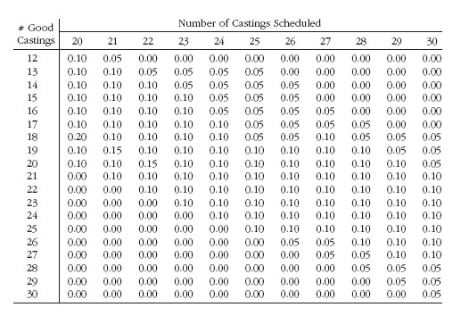
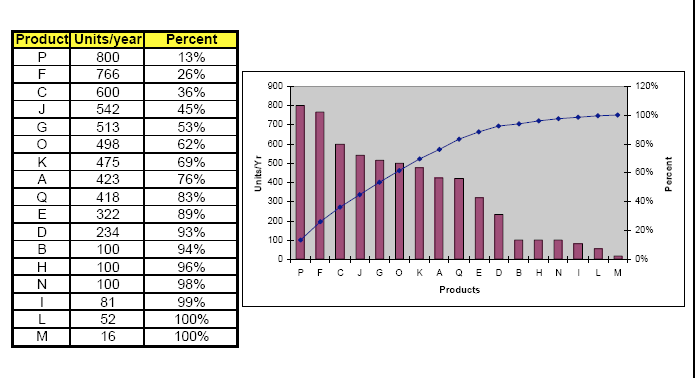
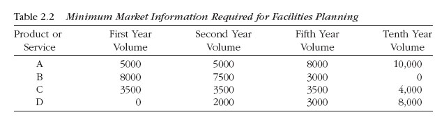
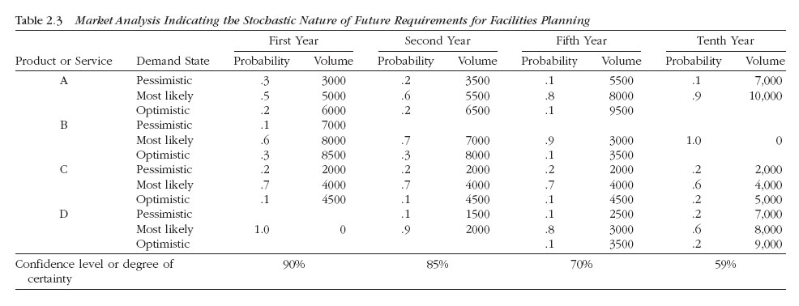
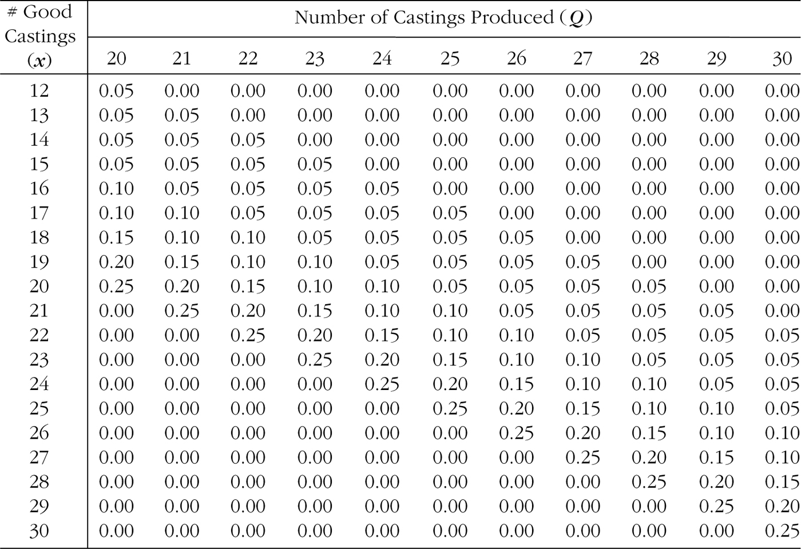
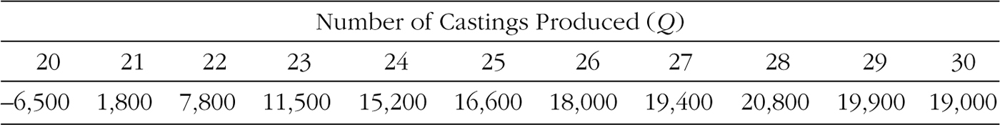

<!-- Slide number: 1 -->
# Ürün, Süreç ve Çizelge Tasarımı II
Dr.Öğr.Üyesi Gökçe KILIÇKAYA ÇAKMAK
END303 TESİS PLANLAMA VE YERLEŞİM
1

<!-- Slide number: 2 -->
# Proses / Süreç Tasarımı
Tesis Planlama

END303 TESİS PLANLAMA VE YERLEŞİM
2

<!-- Slide number: 3 -->
# Ürün, Süreç ve Çizelge Tasarımı II
|  | Adımlar | Dokümantasyon |
| --- | --- | --- |
| Ürün Tasarımı | •Ürün Belirleme •Ayrıntılı Tasarım | •Patlatılmış Montaj Çizimleri •Patlatılmış Montaj Resimleri •Alt bileşen parça Çizimleri |
| Süreç Tasarımı | • Süreç Tanımlama • Süreç Seçimi • Süreç Sıralama | •Parçalar Listesi •Malzemeler Listesi •Rota Kartları •Montaj Şemaları •Operasyon Süreç Şemaları •Öncelik Diyagramı |
| Çizelge Tasarımı | •Ürün Miktarı •Ekipman Gereksinimleri •Operatör Gereksinimleri |  |
END303 TESİS PLANLAMA VE YERLEŞİM
3

<!-- Slide number: 4 -->
# Süreç Tasarımı
Süreci tasarlayacak ya da planlayacak kişi, ürünün nasıl üretileceğinin belirlenmesinden sorumludur.
Ürünün nasıl üretileceğinin belirlenmesi
Süreci kim yapacak? (Ürünlerin hangi parçaları yapılacak?)
Parçalar nasıl üretilecek?
Hangi ekipmanlar kullanılacak? (Parçaların hangileri organizasyon içinde yapılacak?)
Operasyonlar için gerekli işlemlerin ne kadar zaman alacağı?
Üretim yöntemleri, fiziksel yerleşim düzenine etki eden en temel faktörlerdir.

END303 TESİS PLANLAMA VE YERLEŞİM
4

<!-- Slide number: 5 -->
# Süreç Tasarımı
Süreç tasarımıyla ilgili olarak, aşağıdaki konuların göz önünde bulundurulmasına gereksinim duyarız;
1.Süreç Belirleme- Process identification
Yap veya Satın Alma Analizi
Parçaların Tanımlanması
2.Süreç Seçimi- Process selection
Ürün nasıl yapılacak (Operasyonlar, Ekipmanlar, Hammadde vb.)
3.Süreç Sıralama - Process sequencing
Komponentler veya alt bileşen parçalar nasıl bir araya getirilecek?

END303 TESİS PLANLAMA VE YERLEŞİM
5

<!-- Slide number: 6 -->
# Süreç Tasarımı –1. Süreç Belirleme
Yap veya Satın Alma Kararları
Tesisin amacı dikey entegrasyon seviyesi belirler.
Yap veya Satın Alma kararları nasıl yapılıyor?
Parçalar satın alınabiliyor mu?
Taşerona gidilebiliyor mu?
Tedarikçiler
Müteahhitler
Parçayı yapabiliyor muyuz?
Bizim için yapmak, satın almaktan daha ucuz mu?
Parça yapabiliyorsak, yeterli sermaye var mı?
Yönetici kararları; finansman, Endüstri Mühendislileri, pazarlama, süreç mühendisleri, satın alma ve insan kaynakları gibi fonksiyonel alanların girdilerine gereksinim duyulur.

END303 TESİS PLANLAMA VE YERLEŞİM
6

<!-- Slide number: 7 -->
# Yap veya Satın Alma Karar Süreci

YAP /
SATIN ALMA
KARAR SÜRECİ

(Make-or-buy analysis)
END303 TESİS PLANLAMA VE YERLEŞİM
7

<!-- Slide number: 8 -->
# Süreç Tasarımı –1. Süreç Belirleme
Yapılacak ve satın alınacak parça ya da malzemelerin listesi tesis planlamacına bir girdi teşkil etmektedir.
Parça Listesi –bir ürünün alt bileşenleri veya parçaları:
Parça numaraları
Parça ismi
Her bir ürünün parçalarının sayısı
 Çizim referansları
Malzeme listeleri –Yapısal parça listeleri:
Ürün ağaçları
Ürün montaj seviyelerini referans alan hiyerarşiyi gösterir.

END303 TESİS PLANLAMA VE YERLEŞİM
8

<!-- Slide number: 9 -->
# Parça Listesi Örnek Yapısı

Hava Akış Regülatörü Parça Listesi Örneği
END303 TESİS PLANLAMA VE YERLEŞİM
9

<!-- Slide number: 10 -->
# Malzeme Listesi Örnek Yapısı

Hava Akış Regülatörü Malzeme Listesi Örneği
END303 TESİS PLANLAMA VE YERLEŞİM
10

<!-- Slide number: 11 -->
# Ürün Ağacı Örnek Yapısı

Hava Akış Regülatörü Ürün Ağacı Örneği
END303 TESİS PLANLAMA VE YERLEŞİM
11

<!-- Slide number: 12 -->
# Süreç Tasarımı –2. Süreç Seçimi
Ürünler nasıl yapılacak;
6-Adımlı süreç:
	Adım 1. Temel Operasyonların belirlenmesi
	Adım 2. Her bir operasyon için alternatif süreçlerin tanımlanması
	Adım 3. Alternatif süreçlerin analizi
	Adım 4. Süreçlerin standardizasyonu
	Adım 5. Alternatif süreçlerin değerlendirilmesi
	Adım 6. Sürecin seçilmesi

END303 TESİS PLANLAMA VE YERLEŞİM
12

<!-- Slide number: 13 -->
# Süreç Tanımlama
Süreçler
Donanım
Tesiste imal edilecek mamuller için
gereken hammaddeler
Rota kartı (iş emri)

END303 TESİS PLANLAMA VE YERLEŞİM
13

<!-- Slide number: 14 -->
# Süreç Tasarımı –2. Süreç Seçimi
Rota Kartları (Route sheet): Süreç seçimlerinin çıktısı, süreçlerin, ekipmanların ve hammaddeleri tanımlanmasıdır.

| Veri | Üretim Örneği |
| --- | --- |
| Bileşenlerin ismi ve numarası | Pompa –3254 |
| Operasyon Tanımı ve Numarası | Şekil, Delme ve kesme–0104 |
| Ekipman Gereksinimleri | Otomatik vida makinesi ve özgü aparatlar |
| Birim zamanlar (Her bir bileşenler) | Kurulum zamanı 5 Saat. İşlem Süresi 0,0057 Saat |
| Ham malzeme Gereksinimleri | 1 in. Çapındax12 feet alüminyum çubuk her 80 bileşende |

END303 TESİS PLANLAMA VE YERLEŞİM
14

<!-- Slide number: 15 -->
# Rota Kartı Örnek Yapısı

Hava Akış Regülatörü Rota Kartı Örneği
END303 TESİS PLANLAMA VE YERLEŞİM
15

<!-- Slide number: 16 -->
# Süreç Tasarımı –3. Gerekli Süreçleri Sıralama
Ürünün montajlanma yöntemi ve sırasını gösterir.
Montaj Şeması (Assembly chart) –bileşenlerin nasıl birleştirileceğini gösterir.
İşlem Süreç Şeması (Operation process chart) –tesis içindeki akışın ana hatlarını verir
İş Akış Şeması - Rota kartlarının ve montaj şemasının birleşiminden
Öncelik diyagramı –öncelik ilişkilerinin kurulmasını sağlar.

END303 TESİS PLANLAMA VE YERLEŞİM
16

<!-- Slide number: 17 -->
# Montaj Şeması Oluşturulması

Ürün Ağaçlarından

END303 TESİS PLANLAMA VE YERLEŞİM
17

<!-- Slide number: 18 -->
# Montaj Şeması Detayı

Bu parça rota kartı listesinde tanımlanmıştı.
Operasyonlar…

Montaj İşlemleri

Muayene

END303 TESİS PLANLAMA VE YERLEŞİM
18

<!-- Slide number: 19 -->
# İş / Operasyon Süreç Şeması

Montaj Şemalarından
END303 TESİS PLANLAMA VE YERLEŞİM
19

<!-- Slide number: 20 -->
# İş / Operasyon Süreç Şeması

Rota Kartı, üretim teknikleri ve yöntemleri hakkında bilgiler sağlar.
Montaj Şeması, Bileşenlerin nasıl bir araya getirileceğini gösterir.
Operasyon Süreç Şeması, Rota kartları ile montaj şemasının birleşimidir.
İmal Edilen Bileşenler

Satın Alınan Bileşenler
A
SA
END303 TESİS PLANLAMA VE YERLEŞİM
20

<!-- Slide number: 21 -->
# Öncelik Diyagramı

İş Süreç Şemasından
END303 TESİS PLANLAMA VE YERLEŞİM
21

<!-- Slide number: 22 -->
# 3.Süreç Sıralama, Öncelik Diyagramı
Operasyon Süreç Şemalarında, #3254 no.2’lu parçaya dikkat edilecek olursa iki makine operasyonu arasında herhangi bir bağımlılığın olup olmadığı açık değildir:
-0204 ve 0304 No’lu operasyonlar aynı zamanda yapılabilir.
-Bununla beraber, 0204 and 0304 nolu operasyonlardan önce 0104 nolu operasyon tamamlanmış olmalıdır.
Operasyon süreç şemasında bu bilgileri gözlemleyemiyoruz.

END303 TESİS PLANLAMA VE YERLEŞİM
22

<!-- Slide number: 23 -->
# Çizelge Tasarımı
Schedule design
Tesis Planlama

END303 TESİS PLANLAMA VE YERLEŞİM
23

<!-- Slide number: 24 -->
# Çizelge Tasarımı
Çizelgele Tasarımı, aşağıda belirtilen soruların cevaplarını sağlar:
Ne kadar üretilecek?
Üretim Miktarı- Parti Büyüklüğü Kararları
Ne zaman üretilecek?
Üretim zamanı- Üretim Çizelgesi
Üretimin Ne kadar süreceği?
Pazar tahmini
Çizelge Tasarım Kararları; makine seçimi, makinelerin sayısı, vardiya sayısı, çalışanların sayısı, alan gereksinimleri, depolama donanımı, malzeme taşıma donanımı, personel gereksinimleri, stok politikası, birim yük tasarımı, bina boyutları vb etki etmektedir.

END303 TESİS PLANLAMA VE YERLEŞİM
24

<!-- Slide number: 25 -->
# Çizelge Tasarımı
Ana Parçalar ve operasyonlar için tesisleri tasarlayacağız;
Tesislerimizi tasarlamaya başlamak için gereksinim duyduğumuz şeylerin neler olduğunu bilmemiz gerekir
Pazar tarafından talep edilen ürünlerin miktarı
Üretilecek ürünlerin miktarı
İhtiyaç duyulan makine sayıları
Gereksinim duyulan çalışanların sayısı
Operasyonların Sırası
Bölümler arasındaki ilişkiler

END303 TESİS PLANLAMA VE YERLEŞİM
25

<!-- Slide number: 26 -->
# Çizelge Tasarımı-Pazarlama Bilgileri
Amaç- Pazar Tahmini
Pazarlamadaki Veriler:
Üretim Hacimleri- Production volumes
Trendler-Eğilimler- Trends
Gelecek Tahminler- Future demands
Pazarlama tarafından sağlanan Minimum:

END303 TESİS PLANLAMA VE YERLEŞİM
26

<!-- Slide number: 27 -->
# Pazarlamadan Sağlanan İdeal Bilgiler
Bir tesisi planlamak için, üretim hacmini, eğilimleri, üretilecek ürünler için gelecekteki talep kestirimlerini içeren bilgilere ihtiyaç vardır.

END303 TESİS PLANLAMA VE YERLEŞİM
27

<!-- Slide number: 28 -->
# Pazarlama Bilgisi

END303 TESİS PLANLAMA VE YERLEŞİM
28

<!-- Slide number: 29 -->
# Pareto Analizi
İtalyan ekonomist Pareto’nun gözlemi:
 Dünyadaki servetin (Üretim hacminin) %85’i, insanların %15’i tarafından kullanılmaktadır.
 Çalışma hayatında karşılaşılan sorunların nedenleri genellikle Pareto kuralına uygundur. Bu kurala göre, sonuçların % 80’i, bir sorunun nedenlerinin %20 sine bağlı olarak ortaya çıkmaktadır.
 Pareto analizi, bir problemde en fazla önem taşıyan hususun ne olduğunu tespit etmek için kullanılır. (birkaç ürün toplam üretimin büyük kısmını oluşturuyorsa)
Tesis planı, en yüksek üretim miktarına sahip parçaların % 15’i için seri üretim alanı ve ürün karmasının kalan % 85’i için atölye tipi üretim alanından oluşmalıdır.
 Başlangıçta bunun bilinmesi, tesis planı geliştirme aşamasını önemli derecede basitleştirebilir.

END303 TESİS PLANLAMA VE YERLEŞİM
29

<!-- Slide number: 30 -->
# Pareto Analizi
Hacim-çeşit bilgisi, kullanılacak yerleşim tipinin belirlenmesinde çok önemlidir.
 Yerleşim tipi, malzeme aktarma seçenekleri, stok politikaları, birim yükler, binanın şekli, alma/ bırakma noktalarının konumunu etkiler.
 Pareto kuralının geçerli olmadığı durumlar için de (hiçbir ürün, üretim akışında baskın değil) genel bir atölye tipi üretim tesisi önerilebilir.
END303 TESİS PLANLAMA VE YERLEŞİM
30

<!-- Slide number: 31 -->
# Hacim-Çeşitlilik Grafiği-Pareto Kanunu
Üretim hacminin % 80’i, Ürün karışımlarının % 20’si tarafından temsil edilir.
Bu nedenle Tesisler tasarımlanırken, üretilen malzemelerin en çok işlem gören % 20’lik kısmı düşünülmelidir.

Tesis planlanırken, üretimin %80’ini oluşturan %20’lik ürün grubu dikkate alınmalı; bu kısım için standart hatlar, kalan kısım için esnek atölyeler kurulmalıdır.
More general items produced everyday:
Mass production area
Items that are produced maybe by special orders etc.:
Job shop area

29.751
END303 TESİS PLANLAMA VE YERLEŞİM
31

<!-- Slide number: 32 -->
# Hacim-Çeşitlilik Şeması-Pareto Kanunu uygulanamaz.

6.040
Bu tabloda kümülatif yüzdeler yavaş ilerliyor, yani eşit dağılmış üretim var. “Görüldüğü gibi üretim yoğunluğu belirli ürünlerde toplanmadığı için Pareto ilkesiyle sınıflama yapmak mümkün değildir.”
Eğer hiçbir ürün üretim akışını üstünlük sağlayamıyor ise, Genel atölye tipi tesis önerilir.
END303 TESİS PLANLAMA VE YERLEŞİM
32

<!-- Slide number: 33 -->
# Çizelge Tasarımı – Süreç Gereksinimleri
Süreç Gereksinimleri Özellikleri 3 faza sahiptir:
Süreç tasarımı: Ürünü üretmek için gerekli donanımların belirlenmesi
Çizelge tasarımı: Üretim çizelgesini karşılamak için her donanım tipinden gereken adet
Her bir bileşenden üretilecek miktarının belirlenmesi
Her bir operasyon tarafından gereksinim duyulan her bir donanımın belirlenmesi
Tüm Donanım Gereksinimleri

END303 TESİS PLANLAMA VE YERLEŞİM
33

<!-- Slide number: 34 -->
# Iskarta Payı Problemleri
(Reject Allowance Problem)
Tesis Planlama

END303 TESİS PLANLAMA VE YERLEŞİM
34

<!-- Slide number: 35 -->
# Süreç Gereksinimleri-Miktar Belirleme
Iskarta Payı Problemleri (Reject Allowance Problem)
Üretilecek ürünlerin sayısının çok az olduğu ve ıskartaların Rassal oluştuğu durumları hesaba katmak için ilave birimlerin sayısının belirlenmesi
Düşük Hacimli Üretim İçin (For low volume production)
Hurda Maliyeti çok yüksektir.
Fire Miktarı Tahminleri (Scrap Estimates)
Her bir bileşenden üretilecek miktarının belirlenmesi
Yüksek Hacimli Üretim İçin (For high volume production)
Fire Miktarının  tahmin edilmesi

END303 TESİS PLANLAMA VE YERLEŞİM
35

<!-- Slide number: 36 -->
# Iskarta Payı Problemi
Ortalama ıskarta oranlarını kullanmak, yüksek üretim hacmine sahip ürünler için doğrudur.
Düşük üretim hacimlerinde ortalama oranlar kullanmak yanlış olabilir.
ÖRNEK: Bir dökümhanede siparişe göre ürün imal edilmektedir. Parti büyüklüğü düşük olup, istenen döküm ürün için iki şans vardır: ya döküm istenildiği gibi olup kabul edilecektir, ya da istenildiği gibi olmadığından reddedilecek ve parçalanıp ıskartaya gidecektir.

END303 TESİS PLANLAMA VE YERLEŞİM
36

<!-- Slide number: 37 -->
# Iskarta Payı Problemi
Q: üretim miktarı
x: istenilen özelliklere sahip olarak imal edilen mamul sayısını (sağlam ürün) gösteren rassal değişken
p(x): x adet sağlam mamul üretme olasılığı
C(Q,x): x adet sağlam mamule sahip, Q adet mamul imal etmenin maliyeti
R(Q,x): x adet sağlam mamule sahip, Q adet mamul imalatından elde edilecek gelir
P(Q,x): x adet sağlam mamule sahip, Q adet mamul imalatından elde edilecek kar (Kâr=gelir-maliyet)
E[P(Q)]: Q adet üretimden Beklenen kâr
Gerçek Q miktarını nasıl karar verebiliriz?
Amaç x adet sağlam mamul sayısını kesin olarak belirlemektir. Ne çok, Ne de az!

END303 TESİS PLANLAMA VE YERLEŞİM
37

<!-- Slide number: 38 -->
# Iskarta Payı Problemi
Beklenen kârı maksimize etmek için, Q, Q’nun çeşitli değerleri ile  sayılama tekniği kullanılarak belirlenebilir.
Çoğunlukla maliyet ve gelir fonksiyonları konkav- iç bükey bir fonksiyondur. (Başlangıçta hızlı artış gösterip, Sonra artış hızının giderek azaldığı anlamına gelir.)
X ve Q, kesikli değişkenlerdir. Bu nedenle p(X)’de kesikli olasılık fonksiyonudur.
B, kusurlu parçaların sayısı ise, Kusurlu olan parçaların her birinin sayısının olasılığı da birbirinden farklı olacaktır: P(b=1), P(b=2) gibi.

END303 TESİS PLANLAMA VE YERLEŞİM
38

<!-- Slide number: 39 -->
# Örnek-1 (Iskarta Payı Problemi)
4 döküm parçaya ihtiyaç duyulmaktadır, (Ne az ne de çok)
Fiyatı = 30.000 ₺
Maliyeti = 15.000 ₺
Dökümün iyi olma olasılığı % 90’dır.
Kaç adet döküm parça üretilmelidir?
Kayıp Paranın olasılığı nedir?

END303 TESİS PLANLAMA VE YERLEŞİM
39

<!-- Slide number: 40 -->
# Örnek-1 (Iskarta Payı Problemi)
Gelir
Maliyet
Kâr
Beklenen Kâr
END303 TESİS PLANLAMA VE YERLEŞİM
40

<!-- Slide number: 41 -->
# Olasılıklar
Her bir Q için, her bir x değeri ile ilişkilendirilmiş olasılıklar farklıdır.
Geçmiş deneyimler sonucu olasılık değerlerine ulaşılabilir.
Olasılık Yoğunluk Fonksiyonun değerlerinin hesaplanmasına ihtiyaç duyarız:

Örnek: Üretim hattından iyi bir ürün çıkma olasılığı p=%95 olan bir üretim sürecinde, parti büyüklüğü 10 adet olan üretim hattından yalnızca 2 iyi ürünün üretilme olasılığı nedir?

n
-
X
X
n
P(x)
=
P
(1- P)
)
x !

(
-
 !
n
x
END303 TESİS PLANLAMA VE YERLEŞİM
41

<!-- Slide number: 42 -->

# Örnek-1 (Iskarta Payı Problemi)
Olasılık Yoğunluk Fonksiyonu : Probability mass function: (p=90%) değeri için; verilen istatistik tablolardan veya aşağıdaki formüller kullanılarak hesaplanır. Belirli sayıda üretim yapıldığında, kaç tanesinin hatasız olma olasılığı nedir?

Tablodaki her sütun farklı üretim miktarlarını (N), her satır ise
hatasız ürün sayısını (x) temsil ediyor.
END303 TESİS PLANLAMA VE YERLEŞİM
42

<!-- Slide number: 43 -->
# Örnek-1 (Iskarta Payı Problemi)
x ve Q değerlerinin kombinasyonları için elde edilecek Net Gelirler hesaplanır ise;

Hesaplanan Net Gelir Tablosu
END303 TESİS PLANLAMA VE YERLEŞİM
43

<!-- Slide number: 44 -->

# Örnek-1 (Iskarta Payı Problemi)
Q = 4, 5, 6, 7 ve 8 değerleri için Beklenen Kârların hesaplanması; Net gelirler ile Olasılık yoğunluk fonksiyonlarının çarpılmasıyla bulunur.

4
5
7
8
6

END303 TESİS PLANLAMA VE YERLEŞİM
44

<!-- Slide number: 45 -->
# Örnek-1 (Iskarta Payı Problemi)

### Chart: Optimal Üretim Büyüklüğü

| Category | Seri 1 |
|---|---|
| 4 | 18732.0 |
| 5 | 35225.0 |
| 6 | 28098.0 |
| 7 | 14673.0 |
| 8 | -51.673 |

Sonuç: Beklenen kârı maksimum kılan optimal parti büyüklüğü Q=5 Adetlik partiler halinde üretim yapılması önerilir.

END303 TESİS PLANLAMA VE YERLEŞİM
45

<!-- Slide number: 46 -->
# Örnek-1 (Iskarta Payı Problemi)
Eğer Q= 5 ise Kaybedilen (Kayıp) Paranın olasılığı nedir?
Kaybedilen (Kayıp) Paranın olasılığı üzerine yapılan işlemler, Q= 5 olduğunda negatif değere sahip olunan net kârın olasılığıdır.

END303 TESİS PLANLAMA VE YERLEŞİM
46

<!-- Slide number: 47 -->
# Örnek-1 (Iskarta Payı Problemi)
x ve Q değerlerinin kombinasyonları için Net Gelir Hesaplanır ise;
4’den az sağlam döküm parçası üretildiğinde Negatif Net Akış oluşmaktadır.

END303 TESİS PLANLAMA VE YERLEŞİM
47

<!-- Slide number: 48 -->
# Örnek-1 (Iskarta Payı Problemi)
4’den az iyi döküm parça üretmenin olasılığı:
= 0.00001+ 0.00045 + 0.0081 + 0.0729 = 0.0816

END303 TESİS PLANLAMA VE YERLEŞİM
48

<!-- Slide number: 49 -->
# Örnek-2 (Iskarta Payı Problemi)
20 döküm parçasına ihtiyaç duyulmaktadır. (Ne çok , Ne az)
 Maliyet C = 1.100 ₺ /Adet
 Fiyat     P = 2.500 ₺
 Yeniden kazanma Değeri (Recycling Value) = 200 ₺
Beklenen kârı maksimize edecek Q değeri nedir?

END303 TESİS PLANLAMA VE YERLEŞİM
49

<!-- Slide number: 50 -->
# Örnek-2 (Iskarta Payı Problemi)
Gelir
Maliyet
Kâr
Beklenen Kâr
END303 TESİS PLANLAMA VE YERLEŞİM
50

<!-- Slide number: 51 -->
# Örnek-2 (Iskarta Payı Problemi)
Önce Seçilen bir Q için Beklenen kâr hesaplanır.
Yeni bir Q değeri için birinci aşamadaki prosedür tekrarlanır
Kâr azalmaya başladığında çözüm bulunmuş olur.
Her bir Q için, Her bir x değeriyle ilişkilendirilmiş olasılıklar farklıdır.

END303 TESİS PLANLAMA VE YERLEŞİM
51

<!-- Slide number: 52 -->

# Örnek-2 (Iskarta Payı Problemi)

Q adet üretimden çıkan iyi mamul elde edilme sayısı için Geçmiş Olasılık dağılımları
END303 TESİS PLANLAMA VE YERLEŞİM
52

<!-- Slide number: 53 -->
# Örnek-2 (Iskarta Payı Problemi)
x ve Q’nun kombinasyonundan elde edilen Net Gelirlerin hesaplanması P(Q,x):

END303 TESİS PLANLAMA VE YERLEŞİM
53

<!-- Slide number: 54 -->
# Örnek-2 (Iskarta Payı Problemi)

### Chart: Optimal Üretim Büyüklüğü

| Category | Seri 1 |
|---|---|
| 20 | -6500.0 |
| 21 | 1800.0 |
| 2 | 7800.0 |
| 23 | 11500.0 |
| 24 | 15200.0 |
| 25 | 16600.0 |
| 26 | 18000.0 |
| 27 | 19400.0 |
| 28 | 20800.0 |
| 29 | 19900.0 |
| 30 | 19000.0 |END303 TESİS PLANLAMA VE YERLEŞİM
54

<!-- Slide number: 55 -->
# Örnek-3 (Iskarta Payı Problemi)
Bir döküm atölyesi, 20 özel döküm siparişi almıştır. Döküm sürecinin maliyeti birim başına 700 ₺’dir. Eğer döküm iyi çıkarsa, son şekline getirmek için üzerinde bir işlem daha yapılmakta ve bunun maliyeti de birim başına 500 ₺ olmaktadır. Satılmayan döküm ürünler, tekrar ergitilip kullanılmakta bu ise birim başına 300 ₺ kadar bir geri dönüşüm değeri sağlamaktadır.
Müşteri 20 adet kabul edilebilir döküm için birim başına 2.000 ₺ vermeye razıdır. Ayrıca, fazladan 1 ya da 2 dökümü de birim başına 1.500 ₺ ödeyerek alabileceğini bildirmiştir. Fakat 20’den az veya 22’den fazla ürün satın alınmayacaktır. Geçmiş dönemlerde tutulan kayıtlarda, farklı döküm miktarlarına göre elde edilen iyi ürünlerin sayıları yer almaktadır. Beklenen kârı maksimize etmek için firmanın kaç adet döküm yapması gerekir?

END303 TESİS PLANLAMA VE YERLEŞİM
55

<!-- Slide number: 56 -->
# Örnek-3 (Iskarta Payı Problemi)
Geçmiş Dönemin Kayıtları

END303 TESİS PLANLAMA VE YERLEŞİM
56

<!-- Slide number: 57 -->
# Örnek-3 (Iskarta Payı Problemi)
Müşteri 20 adet kabul edilebilir döküm için birim başına 2.000 ₺ vermeye razıdır. Ayrıca, fazladan 1 ya da 2 dökümü de birim başına 1.500 ₺  ödeyerek alabileceğini bildirmiştir. Fakat 20’den az veya 22’den fazla döküm satın alınmayacaktır. Satılmayan döküm ürünler, tekrar ergitilip kullanılmakta bu ise birim başına 300 ₺ kadar bir geri dönüşüm değeri sağlamaktadır.

END303 TESİS PLANLAMA VE YERLEŞİM
57

<!-- Slide number: 58 -->
# Örnek-3 (Iskarta Payı Problemi)
END303 TESİS PLANLAMA VE YERLEŞİM
58

<!-- Slide number: 59 -->
# Örnek-3 (Iskarta Payı Problemi)
Döküm sürecinin maliyeti birim başına 700 ₺’dir. Eğer döküm iyi çıkarsa, son şekline getirmek için üzerinde bir işlem daha yapılmakta ve bunun maliyeti de birim başına 500 ₺  olmaktadır.

END303 TESİS PLANLAMA VE YERLEŞİM
59

<!-- Slide number: 60 -->
# Örnek-3 (Iskarta Payı Problemi)
END303 TESİS PLANLAMA VE YERLEŞİM
60

<!-- Slide number: 61 -->
# Örnek-3 (Iskarta Payı Problemi)
END303 TESİS PLANLAMA VE YERLEŞİM
61

<!-- Slide number: 62 -->
# Örnek-3 (Iskarta Payı Problemi)
END303 TESİS PLANLAMA VE YERLEŞİM
62

<!-- Slide number: 63 -->
# Örnek-3 (Iskarta Payı Problemi)
Örn. Q=20, x=20 için p(20)=0.10 olarak arkadaki tablodan bulunur.
E[P(20)] = −400 (20)+ 24.000 (0,1) = -5.600 $
E[P(21)] = −400 (21)+ 24.000 (0,1)+24.700 (0,1) = -3.530 ₺
..
E[P(27)] = −400 (27)+ 24.000 (0,1)+24.700 (0,1) +25.400 (0,5) = 6.770 ₺
E[P(28)] = −400 (28)+ 24.000 (0,1)+24.700 (0,1) +25.400 (0,6) = 8.910 ₺
E[P(29)] = −400 (29)+ 24.000 (0,1)+24.700 (0,1) +25.400 (0,7) = 11.050 ₺
E[P(30)] = −400 (30)+ 24.000 (0,1)+24.700 (0,1) +25.400 (0,75)= 9.640 ₺
END303 TESİS PLANLAMA VE YERLEŞİM
63

<!-- Slide number: 64 -->
# Örnek-3 (Iskarta Payı Problemi)

END303 TESİS PLANLAMA VE YERLEŞİM
64

<!-- Slide number: 65 -->
# Örnek-3 (Iskarta Payı Problemi)
Sonuç Olarak;
Farklı Q adet döküm miktarlarına göre beklenen kârlara baktığımızda, en yüksek beklenen kârın Q=29 için elde edildiği görülmektedir.
 29 adet döküm yapılırsa bunun 22 tanesinin müşteriye satılması, 7 adedinin parçalanıp ergitilmesi ve bu durumda en yüksek kârın (11.050 ₺ ) elde edilmesi beklenmektedir.

END303 TESİS PLANLAMA VE YERLEŞİM
65

<!-- Slide number: 66 -->
# Örnek-4 (Iskarta Payı Problemi)
Bir döküm atölyesinin 20 adetlik bir iş aldığını düşünelim. Firma sahibi adet başına 4.000 ₺’lik bir fiyat vermiş olsun. Tek bir üretimde bu ürünlerin üretileceğini düşünelim. Eğer 18 adetten az sorunsuz döküm parçası üretilirse müşteri bu partiyi kabul etmeyecektir.
Eğer 18, 19 veya 20 adet sorunsuz parça olursa müşteri sorunsuz olan bu ürünleri satın alacaktır. Eğer 20 adetten fazla sorunsuz ürün üretilirse müşterinin sadece 20 adet satın alacağı bilinmektedir. Sorunlu veya sorunsuz olsun 20 adetten fazla üretilen döküm parçaları yeniden kullanılmak üzere atölyede kalacaktır. Bu fazlaların her biri iyi veya kötü olduğuna bakılmaksızın yeniden kullanıma sunulmakta ve 500 ₺ olan malzeme maliyetine eşdeğer bir değere sahip olmaktadır. Malzeme maliyetine ilave olarak bir adetin üretilmesi 2.250 ₺ tutmaktadır. Beklenen kârı en büyükleyecek optimal üretim miktarını belirleyiniz.

END303 TESİS PLANLAMA VE YERLEŞİM
66

<!-- Slide number: 67 -->
# Örnek-4 (Iskarta Payı Problemi)
END303 TESİS PLANLAMA VE YERLEŞİM
67

<!-- Slide number: 68 -->
# Örnek-4 (Iskarta Payı Problemi)

END303 TESİS PLANLAMA VE YERLEŞİM
68

<!-- Slide number: 69 -->
# Örnek-4 (Iskarta Payı Problemi)

END303 TESİS PLANLAMA VE YERLEŞİM
69