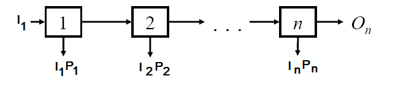
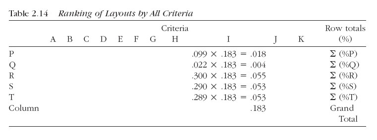
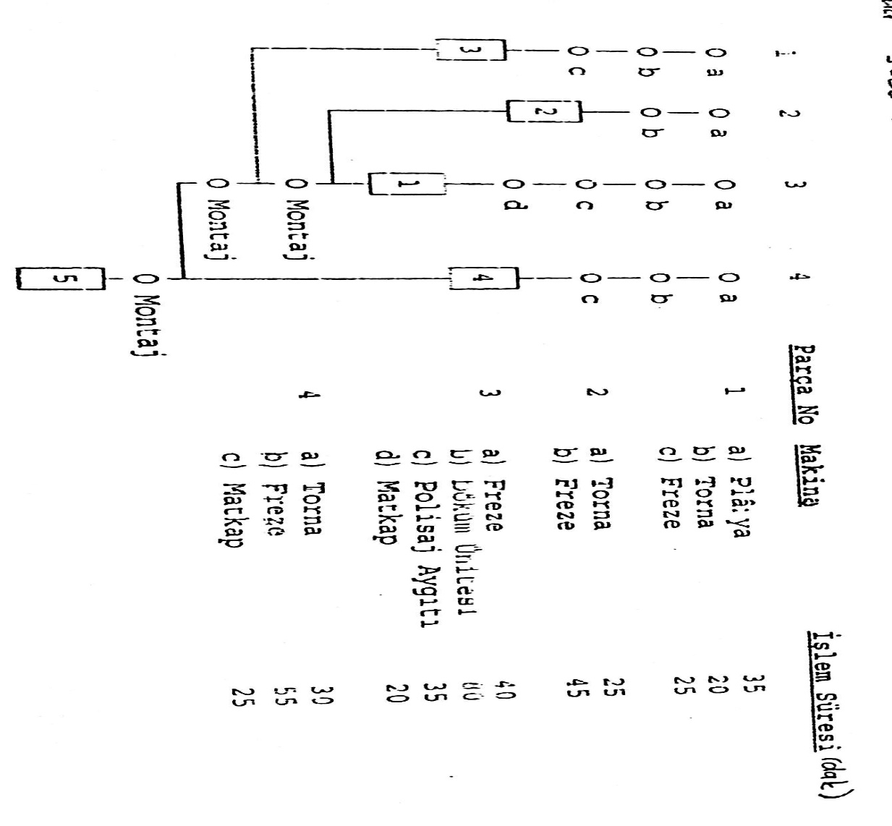
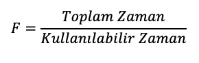
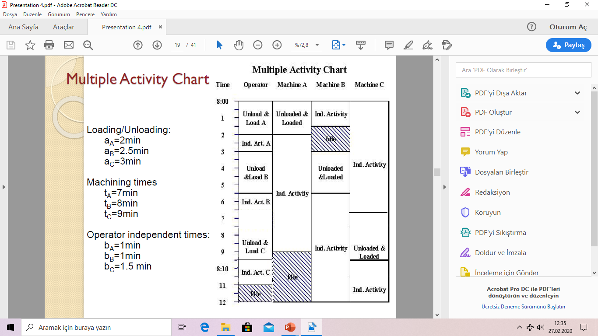

<!-- Slide number: 1 -->
# Ürün, Süreç ve Çizelge Tasarımı III
Dr.Öğr.Üyesi Gökçe KILIÇKAYA ÇAKMAK
END303 TESİS PLANLAMA VE YERLEŞİM
1

<!-- Slide number: 2 -->
# Ürün, Süreç ve Çizelgeleme Tasarımı III
Bölüm 2
 Çizelge Tasarımı
 Üretimde Fire Miktarı Tahminlerinin Hesaplanması
 Teçhizat/Makine Donanım Gereksinimleri
 Operatör Gereksinimleri
 Tesislerin Tasarımı

END303 TESİS PLANLAMA VE YERLEŞİM
2

<!-- Slide number: 3 -->
# Ürün, Süreç ve Çizelgeleme Tasarımı II
|  | Adımlar | Dokümantasyon |
| --- | --- | --- |
| Ürün Tasarımı | • Ürün Belirleme • Ayrıntılı Tasarım | • Patlatılmış Montaj Çizimleri • Patlatılmış Montaj Resimleri • Alt bileşen parça Çizimleri |
| Süreç Tasarımı | • Süreç Tanımlama • Süreç Seçimi • Süreç Sıralama | • Parçalar Listesi • Malzemeler Listesi • Rota Kartları • Montaj Şemaları • Operasyon Süreç Şemaları • Öncelik Diyagramı |
| Çizelge Tasarımı | • Ürün Miktarı • Ekipman Gereksinimleri • Operatör Gereksinimleri |  |
END303 TESİS PLANLAMA VE YERLEŞİM
3

<!-- Slide number: 4 -->
# Çizelge Tasarımı
|  | Adımlar | Dokümantasyon |
| --- | --- | --- |
| Çizelge Tasarımı | Ürün Miktarları | Yüksek Hacimli Üretim (Fire Tahminleri) Düşük Hacimli Üretim (Iskarta Oranı) |
|  | Donanım Gereksinimleri | Ekipman sayıları |
|  | Operatör Gereksinimleri | Makinelere Operatör Atama |
END303 TESİS PLANLAMA VE YERLEŞİM
4

<!-- Slide number: 5 -->
# Fire Miktarı Tahmini Scrap Estımates
END303 TESİS PLANLAMA VE YERLEŞİM
5

<!-- Slide number: 6 -->
# Süreç Gereksinimleri-Miktar Belirleme
Fire Miktarı Tahminleri (Scrap Estimates)
Her bir bileşenden üretilecek miktarının belirlenmesi
Yüksek Hacimli Üretim İçin
Fire Miktarının tahmin edilmesi
Iskarta Payı Problemleri (Reject Allowance Problem)
Üretilecek ürünlerin sayısının çok az olduğu ve ıskartaların Rassal oluştuğu durumları hesaba katmak için ilave birimlerin sayısının belirlenmesi
Düşük Hacimli Üretim İçin
Hurda Maliyeti çok yüksektir.

END303 TESİS PLANLAMA VE YERLEŞİM
6

<!-- Slide number: 7 -->
# Fire Miktarı Tahmini (Yüksek Hacimli Üretim)
 Fire (Iskarta), geometrik ya da kalite faktörlerine bağlı olarak imalat sürecinde ortaya çıkan malzeme israfıdır.
 Gerçek üretim miktarını belirlemek için göz önüne alınmak zorundadır.
 Geçmiş verilere ya da benzer Operasyondan elde edilen tahminlere dayanır.
 Süreç ne kadar otomatikse,
 Parça toleransları ne kadar bolsa,
 Sertifikalı tedarikçilerin sayısı ne kadar fazlaysa,
 Kaynak ne kadar kaliteli ise ve hata önleme teknikleri uygulanıyorsa,
 Malzeme kalitesi ne kadar yüksekse genel ıskarta oranı o kadar az olur.

END303 TESİS PLANLAMA VE YERLEŞİM
7

<!-- Slide number: 8 -->
# Fire Miktarı Tahmini (Yüksek Hacimli Üretim)
Çıktı
(Output)
O
Girdi
(Input)
I
Makinede İşlenmesi
END303 TESİS PLANLAMA VE YERLEŞİM
8

<!-- Slide number: 9 -->
# Fire Miktarı Tahmini (Yüksek Hacimli Üretim)

k	: süreç no
Psk 	: k. süreçteki ıskarta oranı
Sk	: k. süreçten beklenen Fire (Iskarta) ürün miktarı
Ok	: k. süreçten beklenen ürün (çıktı) miktarı (iyi ürün)
 Ik	: k. sürecin girdi miktarı
n	: toplam süreç sayısı
On	: n. süreçten beklenen çıktı miktarı

k’ıncı Operasyon
Ok = Ok - Psk Ik  (Çıktı)
Ik  (Girdi)
Sk = Psk Ik  (Fire)
END303 TESİS PLANLAMA VE YERLEŞİM
9

<!-- Slide number: 10 -->
# Fire Miktarı Tahmini (Yüksek Hacimli Üretim)
Bitmiş ürünlerin istenen miktarlarda üretilebilmesi amacıyla, sürecin başından itibaren fireler dikkate almak zorundayız.

Gereksinim duyulan toplam Girdi Miktarı aşağıda belirtilen formülasyonun kullanımıyla genelleştirilebilir.

Girdi Miktarı
(I)
Çıktı Miktarı
(O)
Operasyon 1
Operasyon 2
Operasyon 3
Operasyon 4
Fire
(S3)
Fire
(S4)
Fire
(S1)
Fire
(S2)
END303 TESİS PLANLAMA VE YERLEŞİM
10

<!-- Slide number: 11 -->
# Fire Miktarı Tahmini (Yüksek Hacimli Üretim)

END303 TESİS PLANLAMA VE YERLEŞİM
11

<!-- Slide number: 12 -->
# Örnek-1 (Fire Miktarı Tahmini)
END303 TESİS PLANLAMA VE YERLEŞİM
12

<!-- Slide number: 13 -->
# Örnek-1 (Fire Miktarı Tahmini)
Her bir operasyon için çizelgelenen Üretim Miktarı nedir?

İyi ürün hedefi: 97.000
Fire oranı %3
Fire oranı %1
Planlanması gereken üretim miktarı 100,000
Fire (kusur) oranları dikkate alınarak “iyi (kusursuz) ürün ihtiyacını karşılayacak şekilde” geriye doğru hesaplanmış planlanan üretim miktarlarıdır.
Fire oranı %4
END303 TESİS PLANLAMA VE YERLEŞİM
13

<!-- Slide number: 14 -->
# Örnek-2 (Fire Miktarı Tahmini)

Elde edilen 2190; 5 aşamalı bir üretim sürecinde, en sonunda 2000 adet sağlam ürün elde edebilmek için ilk aşamada üretilmesi gereken minimum üretim miktarıdır.
Finalde istenen iyi ürün sayısı = 2000
END303 TESİS PLANLAMA VE YERLEŞİM
14

<!-- Slide number: 15 -->
# Örnek-3 (Fire Miktarı Tahmini)

Son üründe istenen miktar = 100.000 adet
Bu nedenle hesaplama, sondan başa doğru yapılır.
END303 TESİS PLANLAMA VE YERLEŞİM
15

<!-- Slide number: 16 -->
# Donanım Oranlarının Belirlenmesi
Dr.Öğr.Üyesi Gökçe KILIÇKAYA ÇAKMAK
END303 TESİS PLANLAMA VE YERLEŞİM
16

<!-- Slide number: 17 -->
# Donanım Oranının Hesaplanması
 Bir operasyon için gereksinim duyulan donanımların sayısının hesaplanması
 Çoğu zaman tesisler makinelerin donanım oranlarının bilinmesine ihtiyaç duyar. Örneğin.: 3.5 makine gibi.
 Q adet ürünün üretilebilmesi için gereksinim duyduğumuz makine sayılarını nasıl belirleyebiliriz?

END303 TESİS PLANLAMA VE YERLEŞİM
17

<!-- Slide number: 18 -->
# Donanım Oranının Hesaplanması
F : Vardiya başına gereken makina sayısı
S : 1 birim ürünü imal etmek için gereken standart zaman (dak)
Q : Vardiya başına üretilecek birim sayısı
E : Gerçek performans (standart zamanın bir yüzdesi olarak)
H : Makina başına mevcut kullanım süresi (dak)
R : Makinanın güvenilirliği (yüzde)

END303 TESİS PLANLAMA VE YERLEŞİM
18

<!-- Slide number: 19 -->
# Örnek-4 (Donanım Gereksinimleri)
Bir parçanın freze tezgahında işlenme süresi 2.8 dakikadır. 8 saatlik bir vardiya boyunca 200 adet parça imal edilecektir. Üretim için, 480 dakikanın %80’ninde freze tezgahı çalışacaktır. Tezgah çalıştığı sürece, parçalar standart hızın %95’ine eşit bir hızda üretilmektedir. Kaç adet freze tezgahı gerektiğini bulunuz?
S = 2.8 dak/parça
Q = 200 parça/vardiya
H = 480 dak/vardiya
E = 0.95
R = 0.80

END303 TESİS PLANLAMA VE YERLEŞİM
19

<!-- Slide number: 20 -->
# Örnek-5 (Toplam Donanım Gereksinimleri)
Donanım tiplerini belirlemek için Donanım Oranları birleştirilir. Problem:
Kaç adet makineye ihtiyacımız var?

Equipment Fraction: O operasyonu karşılamak için gereken makine kapasitesi miktarını gösterir.
Cevap: 4, 5 veya 6. Diğer faktörlerin de dikkate alınması gerekir: Hazırlık Zamanları, Donanım maliyetleri, vb.

END303 TESİS PLANLAMA VE YERLEŞİM
20

<!-- Slide number: 21 -->
# Örnek-5 (Toplam Donanım Gereksinimleri)
Donanım tiplerini belirlemek için Donanım Oranları birleştirilir. Problem:
Kaç adet makineye ihtiyacımız var?

Cevap: 4, 5 veya 6. Diğer faktörlerin de dikkate alınması gerekir: Hazırlık Zamanları, Donanım maliyetleri, vb.
Asgari ihtiyaç = 6 makine. Ancak bazı durumlarda makine paylaşımı veya vardiya düzeni yapılabilir → toplam sayı düşebilir (örneğin 4 veya 5 makine ile planlanabilir)
Ayrıca bazı operasyonlar aynı makinelerde yapılabiliyorsa tekrar yatırım gerekmeyebilir

END303 TESİS PLANLAMA VE YERLEŞİM
21

<!-- Slide number: 22 -->
# Makina Sayılarının Hesaplanması
Alan gereksiniminin hesaplanabilmesi için tesiste yer alacak makina ve donanımın belirlenmesi gerekir.

Bu formül sürece göre yerleşim için geçerlidir. Ürüne göre yerleşimde, her ürün için ayrı ayrı bulunan makina sayıları bir üst sayıya yuvarlatılarak toplanır.

END303 TESİS PLANLAMA VE YERLEŞİM
22

<!-- Slide number: 23 -->
# Örnek-6 (Donanım Gereksinimleri)
Sürece göre düzenlenmiş bir işletmede A, B ve C ürünleri üretilmektedir.  Aylık üretim miktarları ise sırasıyla; A:1.000 Adet/Ay, B: 2.000 Adet/Ay, C:1.000 Adet/Ay’dır. Makina Kullanım Verimi % 70, İşçilik Verimi % 80 dolaylarında olabilecektir. Bir iş günü 8 çalışma saati, bir ay 22 iş günü kabul edilecektir. Ürünlerin süreç şemaları aşağıda verilmiştir. Bu bilgilere göre; işletmeye kaç adet torna ve freze tezgâhı gerekmektedir?

10
Tornalama
15
Frezeleme
8
Kontrol

Ürün Ambarı
Ürün A
Frezeleme
15
8
Kontrol
15
Tornalama

Ürün Ambarı
Ürün B

Tornalama
10
15
Frezeleme
Tornalama
15

Ürün Ambarı
Ürün C
Ürünlerin süreç şemaları
END303 TESİS PLANLAMA VE YERLEŞİM
23

<!-- Slide number: 24 -->
# Örnek-6 (Donanım Gereksinimleri)
Gerekli makina sayısı tamsayı çıkmazsa, bulunan değer bir üst tamsayı değere yükseltilir. Bunun nedeni, ondalıklı değerin de belirli bir üretim gereksinimi göstermesidir.
Karar Seçenekleri
 Fazladan bir makina kullanılması,
 Fazla mesai yapılması
 Başka bir işletmeye, fazla gereksinimin fason olarak yaptırılması.

END303 TESİS PLANLAMA VE YERLEŞİM
24

<!-- Slide number: 25 -->
# Örnek-7 (Donanım Gereksinimleri)

Bir A ürünü, üç tip parça monte edilerek, yılda 2.500 adet üretilecektir. Bu A ürününe ait işlem süreç şemaları ile, her parçanın gerektirdiği makinalar ve işlem süreleri aşağıdaki gibidir. Muayenelere ilişkin kusurlu parça oranları, temel süreç şemasındaki 1-2-3-4 sırasına göre %3-% 2- % 4-% 5’tir. A ürünün üretimi için ürüne ve sürece göre yerleşim düzenlerini oluşturunuz? Tezgâhlar için gerekli sayıları hesaplayınız? (Yıllık çalışma saati 2.400 Saat olarak alınacaktır.)

END303 TESİS PLANLAMA VE YERLEŞİM
25

<!-- Slide number: 26 -->

# Örnek-7 (Donanım Gereksinimleri)
Ürüne Göre Yerleşim Düzeni - (Seri Üretim)

Makine ve iş istasyonlarının, belirli bir ürünün üretim sırasına göre dizildiği yerleşim tipidir. (Otomobil, beyaz eşya)
END303 TESİS PLANLAMA VE YERLEŞİM
26

<!-- Slide number: 27 -->

# Örnek-7 (Donanım Gereksinimleri)
Sürece Göre Yerleşim Düzeni - (Atölye Tipi Üretim)

Benzer görev yapan makinelerin aynı bölümde toplandığı, ürünün üretim sırasına göre değil işlevine göre düzenlenmiş yerleşim türüdür. (Hastane,üniversite)
END303 TESİS PLANLAMA VE YERLEŞİM
27

<!-- Slide number: 28 -->
# Örnek-7 (Donanım Gereksinimleri)

Üretim Sistemine Giren Hammadde/Parça Miktarlarının Hesaplanması
1. Parça: (0,96)(0,95)X1=2.500 ise X1 =2.741Adet/Yıl (3 ve 4 No.lu Muayane Sonucu)
2. Parça: (0,98)(0,95)X2=2.500 ise X2 =2.685Adet/Yıl (2 ve 4 No.lu Muayane Sonucu)
3. Parça: (0,97)(0,95)X3=2.500 ise X3 =2.713Adet/Yıl  (1ve 4 No.lu Muayane Sonucu)

END303 TESİS PLANLAMA VE YERLEŞİM
28

<!-- Slide number: 29 -->
# Örnek-7 (Donanım Gereksinimleri)

END303 TESİS PLANLAMA VE YERLEŞİM
29

<!-- Slide number: 30 -->
# Örnek-7 (Donanım Gereksinimleri)

END303 TESİS PLANLAMA VE YERLEŞİM
30

<!-- Slide number: 31 -->
# Örnek-7 (Donanım Gereksinimleri)

END303 TESİS PLANLAMA VE YERLEŞİM
31

<!-- Slide number: 32 -->
# Örnek-7 (Donanım Gereksinimleri)
Kıyaslama Tablosu
| Makina Adı | Ürüne Göre Yerleşim | Sürece Göre Yerleşim |
| --- | --- | --- |
| Döküm | 8 | 7 |
| Taşlama | 7 | 7 |
| Matkap | 3 | 3 |
| Planya | 2 | 2 |
| Torna | 3 | 2 |
| Polisaj | 3 | 2 |
| Toplam | 26 | 23 |
END303 TESİS PLANLAMA VE YERLEŞİM
32

<!-- Slide number: 33 -->
# Operatöre MakinaTahsis Etme Problemi
(Asign/Allocation Problems)
END303 TESİS PLANLAMA VE YERLEŞİM
33

<!-- Slide number: 34 -->
# Makineye Operatör Atama
 Ürün, süreç ve çizelge tasarımında verilen kararlar bütünü, ürün imalatında çalışacak iş gören sayısının belirlenmesinde çok önemli rol oynar.
 Yararlanılabilecek araç : İnsan-makina (ya da çoklu faaliyet ) şemaları. (human-machine chart, multiple activity chart)
 Bu şemalar özellikle, bir ya da daha fazla işçi tarafından benzer olmayan makinaların kullanılması durumunda, çoklu faaliyet ilişkilerini analiz etmede kullanılabilir.
 Geçişli ve durağan durum koşullarında operatör ve makina faaliyetlerinin incelenmesi amacıyla da kullanılabilir.

END303 TESİS PLANLAMA VE YERLEŞİM
34

<!-- Slide number: 35 -->
# Operatör Gereksinimleri
 Eğer (Q) Sipariş miktarı biliniyor ise;
 Makinelerin gereksinim duyulan miktarı bulunabilir.
 Gereksinim duyulan operatör sayısını nasıl bulabiliriz?
 Çalışma hayatının doğası gereği, gereksinim duyulan operatör sayısının belirlenmesi farklılık gösterebilmektedir.
 Bazı makineler tek (yalnız) çalıştırılabilir : CNC makineleri
 Bazı görevler bir operatörün çalışma zamanının % 100’ünde (tamamen) operatör katılımını gerektirir. Bir forklift kullanımı gibi..

END303 TESİS PLANLAMA VE YERLEŞİM
35

<!-- Slide number: 36 -->
# Operatör Gereksinimleri
 Kavramsal açıdan bakıldığında, Makine donanım gereksinimlerinin belirlenmesine benzerdir.
N : Vardiya başına gereken operatör sayısı
T : 1 operasyon için gereken standart zaman (dak)
P : Günlük operasyonlar için gereken miktar
H : Günlük mevcut kullanım süresi (dak)
C: Personel zamanının kullanılabilirliği- Gerçek performans (standart zamanın bir yüzdesi olarak)
 Kesin iş gücü gereksinimleri analiz edebilmek için,  bir operatör tarafından aynı anda işletilecek makine sayısının bilinmesine gereksinim duyulur.
 Makine Atama Problemi-(Machine Assignment Problem)

END303 TESİS PLANLAMA VE YERLEŞİM
36

<!-- Slide number: 37 -->
# Örnek-8 (Makine Atama)

Operatörün parçayı makineye yüklemesi: 1 dk.
 Operatörün parçayı makineden sökmesi:1 dk.
 Makinenin otomatik işlem süresi : 6 dk.
 Operatörün işlenmiş parçayı muayene etmesi ve paketlemesi: 0.5 dk.

1 Opt-1 Mak
İnsan-makina (ya da çoklu faaliyet) şemaları.
(human-machine chart, multiple activity chart)
END303 TESİS PLANLAMA VE YERLEŞİM
37

<!-- Slide number: 38 -->
# Örnek-8 (Makine Atama)
Çevrim Süresi = 8 dakika
Operatör aylak süre=5.5 dakika
Makine aylak süre=0 dak.
Üretim oranı = 1/8 = 0.125 [parça/dak.]

1 Opt-1 Mak
İnsan-makina (ya da çoklu faaliyet) şemaları.
(human-machine chart, multiple activity chart)
END303 TESİS PLANLAMA VE YERLEŞİM
38

<!-- Slide number: 39 -->
# Makine Atama Problemi
 Operatör ve makinelerden oluşan, yarı-otomatik bir üretim ortamı
 Benzer koşullar altında, bir operatöre atanacak optimum makine sayısının belirlenmesi için kullanılabilir.
VARSAYIMLAR:
 Makinalar aynı işi yapmakta olup, birbirinin aynı özelliklere sahiptir.
 Operatörün makinayı yükleme ve boşaltma süresi sabittir.
 Makinaların otomatik işleme süreleri sabittir.
 Operatörün bir makinadan diğerine ulaşma süresi, parçaları hazırlama, kontrol etme ve paketleme süresi birbirinden bağımsız ve sabittir.

END303 TESİS PLANLAMA VE YERLEŞİM
39

<!-- Slide number: 40 -->
# Makine Atama Problemi
 Operatörlerin makinelere atama kararları çalışan sayılarına etki edebilir.

1 Opt-3 Mak
END303 TESİS PLANLAMA VE YERLEŞİM
40

<!-- Slide number: 41 -->
# Makine Atama Problemi
 Ürün, süreç ve çizelge tasarımında verilen kararlar tümü, ürün imalatında çalışacak iş gören sayısının belirlenmesinde çok önemli rol oynar.
 Yararlanılabilecek bir araç : İnsan-makine Şeması veya Çoklu Etkinlik Şeması. (human-machine chart, multiple activity chart)
 Bu şemalar özellikle, bir ya da daha fazla işçi tarafından benzer olmayan makinaların kullanılması durumunda, çoklu faaliyet ilişkilerini analiz etmede kullanılabilir.
 Geçişli ve durağan durum koşullarında operatör ve makina faaliyetlerinin incelenmesi amacıyla da kullanılabilir.

END303 TESİS PLANLAMA VE YERLEŞİM
41

<!-- Slide number: 42 -->
# Makine Atama Problemi
İnsan-Makine Şeması veya Çoklu Etkinlik Şeması (Human-Machine chart / Multiple Activity chart)
a …Eşzamanlı Etkinlikler (Hem makine hem de operatör birlikte çalışır: Yükleme, Makine Boşaltma)
b …Bağımsız Operatör Etkinlikleri (Yürüme, Muayene, Paketleme)
t … Bağımsız Makine etkinlikleri (Otomatik İşleme)
Makine Atama Problemi
L..…Loading- Yükleme
T…..Walking- Yürüme
UL…Unloading- Boşaltma
I&P…Inspection&Packing-Muayene ve Paketleme

END303 TESİS PLANLAMA VE YERLEŞİM
42

<!-- Slide number: 43 -->
# Makine Atama Problemi

a … Eşzamanlı Etkinlikler
b … Bağımsız Operatör Etkinlikleri
t… Bağımsız Makine Etkinlikleri

(a+b)…Makine başına Operatör Zamanı : Operator time per machine: her bir makine için tahsis edilen operatör zamanı

(a+t) …Makine Çevrim Zamanı (Tekrarlama Zamanı) Machine cycle time (repeating time): Bir çevrim tamamlanıncaya kadar geçen süre.

L..…Loading- Yükleme
T…..Walking- Yürüme
UL…Unloading- Boşaltma
I&P…Inspection & Packing- Muayene ve Paketleme

END303 TESİS PLANLAMA VE YERLEŞİM
43

<!-- Slide number: 44 -->
# Örnek-9 (Makine Atama)
END303 TESİS PLANLAMA VE YERLEŞİM
44

<!-- Slide number: 45 -->
# Örnek-9 (Makine Atama)
END303 TESİS PLANLAMA VE YERLEŞİM
45

<!-- Slide number: 46 -->
# Örnek-9 (Makine Atama)

END303 TESİS PLANLAMA VE YERLEŞİM
46

<!-- Slide number: 47 -->
# Makine Atama Problemi
END303 TESİS PLANLAMA VE YERLEŞİM
47

<!-- Slide number: 48 -->
# Makine Atama Problemi
END303 TESİS PLANLAMA VE YERLEŞİM
48

<!-- Slide number: 49 -->
# Makine Atama Problemi
END303 TESİS PLANLAMA VE YERLEŞİM
49

<!-- Slide number: 50 -->
# Örnek-10 (Makine Atama)
END303 TESİS PLANLAMA VE YERLEŞİM
50

<!-- Slide number: 51 -->
# Örnek-10 (Makine Atama)
a=2 dak. (makine yükleme+boşaltma süresi)
t= 6 dak. (makinenin otomatik çalışma süresi)
b=1 dak. (operatörün yürüme+muayene ve paketleme süresi)
a=1+1=2 dak., t=6 dak, b=0.5+0.5=1 dak

n’=(2+6)/(2+1)=8/3= 2.67 makine (ideal sayı)
Kesirli sayıda makine bir operatöre atanamayacağından, n’ tam sayılı değere yuvarlanarak m=3 olarak bulunur.

END303 TESİS PLANLAMA VE YERLEŞİM
51

<!-- Slide number: 52 -->
# Makine Atama Problemi
Örnek:
n’=2.67, m=3
(a+t)=8 dak. ve m(a+b)= 3(2+1)=9 dak. ise tekrarlı çevrim süresi 9 dak. olarak alınır. çevrim süresini, daha büyük olan belirler.
Eğer m < n’ ise operator boşta kalacaktır (idle)

Eğer m > n’ ise makineler boşta kalacaktır (idle)
END303 TESİS PLANLAMA VE YERLEŞİM
52

<!-- Slide number: 53 -->
# Makine Atama Problemi
Eğer m < n’ ise operator boşta kalacaktır (idle)
Eğer m > n’ ise makineler boşta kalacaktır (idle)
END303 TESİS PLANLAMA VE YERLEŞİM
53

<!-- Slide number: 54 -->
# Örnek-11 (Makine Atama)
END303 TESİS PLANLAMA VE YERLEŞİM
54

<!-- Slide number: 55 -->
# Örnek-11 (Makine Atama)
Operatör başlangıçta makine 1’in önünde
Makineler arası mesafe : 0.5 dak.
Operatörün makineyi yüklemesi: 1 dak.
Operatörün makineyi boşaltması:1 dak.
Makinenin otomatik işlem süresi : 6 dak.
Operatörün işlenmiş parçayı muayene etmesi ve paketlemesi: 0.5 dak.

END303 TESİS PLANLAMA VE YERLEŞİM
55

<!-- Slide number: 56 -->
# Örnek-11 (Makine Atama)
 Operatör aylak süre=0 dakika
 Makine aylak süre=1 dak.
Üretim oranı=3/9 =0.33 [parça/dak.]

END303 TESİS PLANLAMA VE YERLEŞİM
56

<!-- Slide number: 57 -->
# Makine Atama Problemi
END303 TESİS PLANLAMA VE YERLEŞİM
57

<!-- Slide number: 58 -->
# Makine Atama Problemi
END303 TESİS PLANLAMA VE YERLEŞİM
58

<!-- Slide number: 59 -->
# Makine Atama Problemi
END303 TESİS PLANLAMA VE YERLEŞİM
59

<!-- Slide number: 60 -->
# Makine Atama Problemi
END303 TESİS PLANLAMA VE YERLEŞİM
60

<!-- Slide number: 61 -->
# Örnek-12 (Makine Atama)
END303 TESİS PLANLAMA VE YERLEŞİM
61

<!-- Slide number: 62 -->
# TESİs TASARIMINDA KULLANILANYÖNETİM VE PLANLAMA ARAÇLARI
Dr.Öğr.Üyesi Gökçe KILIÇKAYA ÇAKMAK
END303 TESİS PLANLAMA VE YERLEŞİM
62

<!-- Slide number: 63 -->
# Tesis Tasarımı
 Bu noktadan itibaren;
 Ne üreteceğimizi biliyoruz (Ürün Tasarımı-Product design)
 Nasıl üreteceğimizi biliyoruz (Süreç Tasarımı-Process design)
 Kaç adet üreteceğimizi biliyoruz (Çizelge Tasarımı-Schedule design)
 Mevcut bilgiler ışığında artık tesisleri tasarlamaya başlayabiliriz.

END303 TESİS PLANLAMA VE YERLEŞİM
63

<!-- Slide number: 64 -->
# Tesis Tasarımı
Tesis tasarımında sistem planlama ve geliştirmede kullanılan 7 yönetim ve planlama aracı kullanılmaktadır.
1. Yakınlık Diyagramı (Affinity Diagram)
 Sözel (fikirler ve konular) verilerin toplanmasında kullanılır ve gruplandırma ve sınıflandırma için veriler organize edilir.
2. İlişki Diyagramı (Interrelationship Diagram)
 Tesis ile ilgili konuların birbiriyle ve diğerleri üzerine etki eden faktörlerin tanımlanmasına çalışılır.
3. Ağaç Diyagramı (Tree Diagram)
 Hedefe ulaşılmasına gereksinim duyulan konuların detaylandırılmasına çalışılır.
 Bu gereksinimler arasındaki ilişkileri belirler.

END303 TESİS PLANLAMA VE YERLEŞİM
64

<!-- Slide number: 65 -->
# Tesis Tasarımı
4. Matris Diyagramı (Matrix Diagram)
 Bölüm özellikleri, fonskiyonları ve görevlerini esas alan bilgileri karşılaştırmak ve ilişkiyi ortaya belirlemek için organize edilmesini sağlar.
5.Olası Durum (Contingency Diagram)
 Projenin tanımlanmasın aşamasında oluşabilecek olası durumları ve olayları haritalandırır.
6. Etkinlik Ağ Diyagramı (Activity Network Diagram)
 Tesis tasarım çabaları için bir iş çizelgesi geliştirilmesinde kullanılır
 Tasarım sürecinin bir bütün olarak görselleştirilmesini olanak saplar.
7. Önceliklendirme Matrisi (Prioritization Matrix)
 Karşılaştırma kriterleri için bir araçtır.
 En önemli kriterlerin belirlenmesine olanak sağlar.

END303 TESİS PLANLAMA VE YERLEŞİM
65

<!-- Slide number: 66 -->
# 1. Yakınlık Diyagramı (Affinity diagram)

END303 TESİS PLANLAMA VE YERLEŞİM
66

<!-- Slide number: 67 -->
# 2. İlişki Diyagramı (Interrelationship diagram)

END303 TESİS PLANLAMA VE YERLEŞİM
67

<!-- Slide number: 68 -->
# 3. Ağaç Diyagramı (Tree diagram)

END303 TESİS PLANLAMA VE YERLEŞİM
68

<!-- Slide number: 69 -->
# 4.Matris Diyagramı (Matrix diagram)

END303 TESİS PLANLAMA VE YERLEŞİM
69

<!-- Slide number: 70 -->
# 5.Olası Durum (Contingency diagram)

END303 TESİS PLANLAMA VE YERLEŞİM
70

<!-- Slide number: 71 -->
# 5.Olası Durum (Contingency diagram)

END303 TESİS PLANLAMA VE YERLEŞİM
71

<!-- Slide number: 72 -->
# 6. Etkinlik Ağ Diyagramı (Activity Network Diagram)

END303 TESİS PLANLAMA VE YERLEŞİM
72

<!-- Slide number: 73 -->
# 7.Önceliklendirme Matrisi (Prioritization matrix)
| Tesis Tasarım Alternatiflerini değerlendirmek için kullanılan Kriterler |  |
| --- | --- |
| A. Toplam Seyahat edilen Mesafe | B. İmalat Alanı |
| C. Yerleşim estetikliği | D. Gelecek işlerin kolayca eklenebilmesi |
| E. Mevcut Ekipmanların Kullanımı | F. Yeni donanımlar için Yatırım Gereksinimi |
| G. Alan Gereksinimi | H. İnsan Gereksinimleri |
| I. WIP Süreç içi Stokların Etkisi | J. İnsan faktör riski |
| K. Alternatiflerin tahmini maliyeti |  |
| Karşılaştırma Kriterlerinde kullanılan Ağrılıklar |  |
| --- | --- |
| 1 = Eşit derecede önemli |  |
| 5 = Önemli | 1/5 = Önem derecesi az |
| 10 = Çok önemli | 1/10 = Hiçbir Önemi Yok |
END303 TESİS PLANLAMA VE YERLEŞİM
73

<!-- Slide number: 74 -->
# 7.Önceliklendirme Matrisi (Prioritization matrix)

END303 TESİS PLANLAMA VE YERLEŞİM
74

<!-- Slide number: 75 -->
# 7.Önceliklendirme Matrisi (Prioritization matrix)

Layout alternatives
 Her bir süreç içi stok seviyelerini esas alan farklı yerleşim alternatiflerini karşılaştırmıştık.
 Tüm seçilen kriterler için karşılaştırma yapmaya ihtiyaç duyarız.
 Sonuç olarak en iyi alternatifi belirlemek için aşağıdaki format kullanılır.

END303 TESİS PLANLAMA VE YERLEŞİM
75

<!-- Slide number: 76 -->
# 7.Önceliklendirme Matrisi (Prioritization matrix)

Layout alternatives
Yerleşimlerin sıralanması en iyi alternatifin belirlenmesine yardımcı olacaktır.
 En iyi alternatif/seçenek en iyi amaca hizmet eder.
 En iyi konsept firmalara ve insanlara göre değişkenlik gösterebilir.

END303 TESİS PLANLAMA VE YERLEŞİM
76

<!-- Slide number: 77 -->
# Gelecek Ders
Akış, Alan ve Etkinlik İlişkileri I

END303 TESİS PLANLAMA VE YERLEŞİM
77

<!-- Slide number: 78 -->
# ÇÖZÜMLÜ ÖRNEK SORULAR ve ÇALIŞMA SORULARI
Dr.Öğr.Üyesi Hv.Müh.Alb. Ömer ATLI
END303 TESİS PLANLAMA VE YERLEŞİM
78

<!-- Slide number: 79 -->
# Çözümlü Örnek Soru-1 (Donanım Gereksinimleri)
4
1
5
2
2
3
1
6
7
3
END303 TESİS PLANLAMA VE YERLEŞİM
79

<!-- Slide number: 80 -->
# Çözümlü Örnek Soru-1 (Donanım Gereksinimleri)
4
1
5
2
2
3
1
6
7
3
END303 TESİS PLANLAMA VE YERLEŞİM
80

<!-- Slide number: 81 -->
# Çözümlü Örnek Soru-2 (Donanım Gereksinimleri)
9
5
1
2
10
6
3
11
7
4
8
12
1
END303 TESİS PLANLAMA VE YERLEŞİM
81

<!-- Slide number: 82 -->
# Çözümlü Örnek Soru-2 (Donanım Gereksinimleri)
 Ürün tipinde üretim yaparken çok miktarda üretim uzun bir zaman devam eder. Ancak proses tipinde böyle olmaz. Proses tipinde parti üretimi bir kez yapılıp tamamlanır.
 Örneğin ürün tipinde rahatlıkla  yıllık üretim miktarına 20.000 adet ürün ilave edilerek tahmin hatalarına karşı bir önlem alınabilirken, proses tipinde üretimde müşteri siparişi zaten bellidir.
 Diyelim ki 56 adet planladık ama 40 iyi ürün çıktı, eksik olan miktarı tamamlamak için yeniden bir hazırlık sürecine ihtiyacımız olacak ve daha sonrasında yapılacak diğer müşteri ihtiyaçlarının gecikmesine sebep olunacaktır. Tam tersi durumda 50 adet planlı üretim partisinde 55 adet ürün çıkarsa fazla olan 5 adet ürün ne olacaktır? Bunlar hep sorundur.

9
5
1
2
10
6
3
11
7
4
8
12
1
END303 TESİS PLANLAMA VE YERLEŞİM
82

<!-- Slide number: 83 -->
# Çözümlü Örnek Soru-3 (Makina Atama)
END303 TESİS PLANLAMA VE YERLEŞİM
83

<!-- Slide number: 84 -->
# Çözümlü Örnek Soru-3 (Makina Atama)
END303 TESİS PLANLAMA VE YERLEŞİM
84

<!-- Slide number: 85 -->
# Çözümlü Örnek Soru-3 (Makina Atama)
Eğer m=2 ise, Bir birimin maliyeti nedir?
m<n’ (2<2.5) olduğundan,

Bir birimin maliyeti $20.66 olacaktır.

END303 TESİS PLANLAMA VE YERLEŞİM
85

<!-- Slide number: 86 -->
# Çözümlü Örnek Soru-3 (Makina Atama)
END303 TESİS PLANLAMA VE YERLEŞİM
86

<!-- Slide number: 87 -->
# Çalışma Sorusu-1
 Dört tip parça monte edilerek oluşan bir ürün, muayeneler sonrasında yılda 3.000 adet üretilecektir. Muayenelere ilişkin kusurlu parça oranları (1-2-3-4-5)Sırasına göre (%2, %2,5-% 3-%2,5-%3,5)’tur. Kusurlu parçalar ıskartaya çıkarılmaktadır. Sürece göre yerleşim düzeni durumunda gerekli tüm makina sayılarını hesaplayınız. (Çalışma sığası 2.400 Saat/Yıl alınacaktır.)
 Ayrıca tezgâh maliyetleri; Planya için 50.000 Pb, Torna için 30.000 Pb, Freze için 20.000 Pb, Döküm Ünitesi için 10.000 Pb. Polisaj aygıtı için 15.000 Pb ve matkap için 25.000 Pb’dir. Birim ürün maliyeti de 250 Pb olduğuna göre, bu ürünün istenen üretim için ve sürece göre yerleşim düzeninde başabaş satış fiyatı ne olmalıdır?

END303 TESİS PLANLAMA VE YERLEŞİM
87