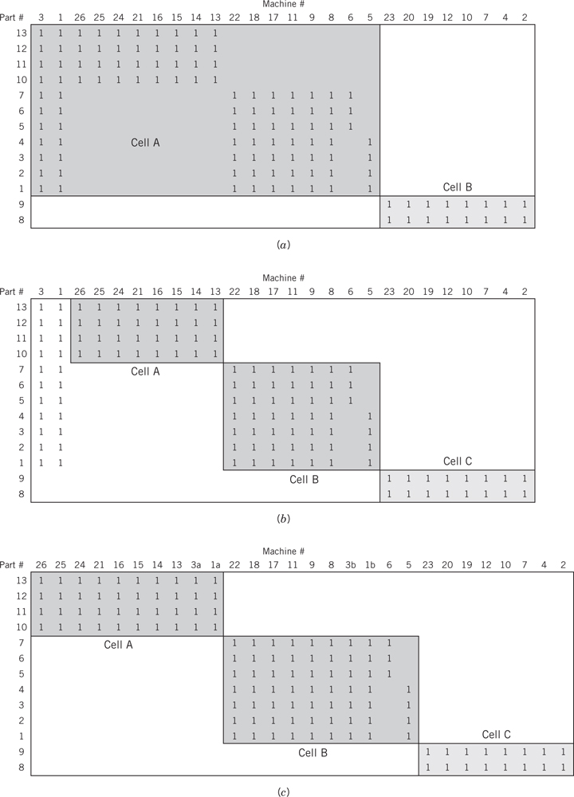
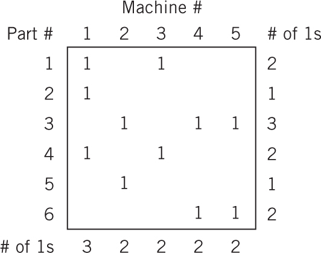
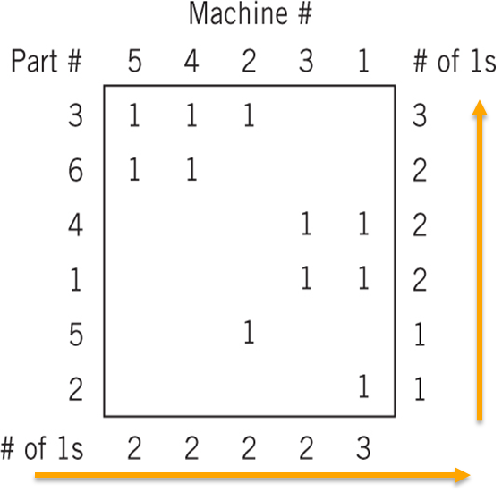
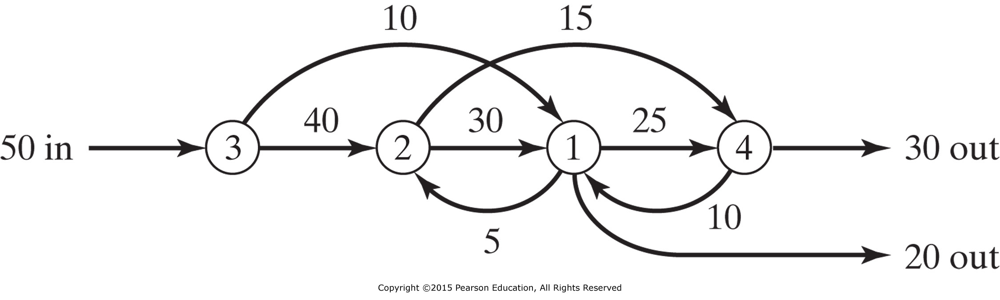

<!-- Slide number: 1 -->
# Akış, Alan ve Etkinlik İlişkileri I
Flow, space and activity relationships I.
Dr.Öğr.Üyesi Gökçe KILIÇKAYA ÇAKMAK
END303 TESİS PLANLAMA VE YERLEŞİM
1

<!-- Slide number: 2 -->
# Akış, Alan ve Etkinlik İlişkileri I
Bölüm 3
Bölüm/Şube Planlama - Departmental Planning
İmalat Hücreleri - Manufacturing cells
Hücre Yapısı için Kümeleme Algoritmaları - Clustering algorithms for cell formation

END303 TESİS PLANLAMA VE YERLEŞİM
2

<!-- Slide number: 3 -->
# Akış, Alan ve Etkinlik İlişkileri I
Akış İlişkileri Flow relationships
Akış; belli büyüklükteki partilerin üretimi ve aktarılmasına, birim yük büyüklüklerine, malzeme aktarma sistemlerine, yerleşim düzenlemesine, binanın şekline bağlıdır.
İmalat Tesisinden giden dış Akış, tesise gelen Akış ve Tesis içindeki akış olmak üzere 3 tiptir.
Malzemelerin, İnsanların, Donanımların, Bilginin ve Paranın vb. Akışı
Alan Gereksinimleri- Space
Alan; parti büyüklüğünün, stoklama sistemlerinin, imalat donanımının tipi ve boyutu, yerleşim düzenlemesi, binanın şekli, ofis tasarımı, yemekhane ve lavabo tasarımının bir fonksiyonudur.
Tesisteki Alan gereksinimlerinin miktarı
İş istasyonlarının özellikleri, Bölüm özellikleri ve diğer alan gereksinimleri
Etkinlik İlişkileri - Activity relationships
Akışın ölçülmesi, makineler ve bölümler arasında faaliyet ilişkilerinin hesaplanmasını içerir.
Etkinlik ilişkileri, tesis tasarımında anahtar girdidir.
Organizasyonel ilişkiler, çevresel ilişkiler, süreç ilişkileri ve kontrol ilişkileri akış ilişkileri tarafından belirlenir.

END303 TESİS PLANLAMA VE YERLEŞİM
3

<!-- Slide number: 4 -->
# Bölüm Planlama (Departmental Planning)
Üretim Planlama bölümleri, tesislerin yerleşim süreçleri boyunca Gruplandırılmış iş istasyonlarını bir araya getirilmesidir.
Benzer fonksiyonları yerine getiren iş istasyonlarının toplanması :
Benzer ürünler ve bileşen parçalar
Benzer süreçler
Ürün Hacim çeşitliliğini esas alan yerleşim düzenlemelerinin sınıflandırılması
Ürün Yerleşimi (Akış Tipi Üretim Atölyesi) Product layout (flow shop)
Sabit ürün yerleşimi- Fixed product layout
Grup Yerleşimi- Group layout
Süreç Yerleşimi (İş Atölyesi) - Process layout (job shop)

END303 TESİS PLANLAMA VE YERLEŞİM
4

<!-- Slide number: 5 -->
# Bölüm Planlaması

Üretim hacmi ürün çeşidine göre
Planlama Bölümlerinin Sınıflandırılması
END303 TESİS PLANLAMA VE YERLEŞİM
5

<!-- Slide number: 6 -->
# Yerleşim Düzenlemelerinin Sınıflandırılması

Ürün Yerleşimi (Akış Tipi Üretim Atölyesi) Product layout (Flow shop)

Sabit ürün yerleşimi- Fixed product layout
END303 TESİS PLANLAMA VE YERLEŞİM
6

<!-- Slide number: 7 -->
# Yerleşim Düzenlemelerinin Sınıflandırılması

Grup Yerleşimi- Group layout

Süreç Yerleşimi (İş Atölyesi) - Process layout (Job shop)
END303 TESİS PLANLAMA VE YERLEŞİM
7

<!-- Slide number: 8 -->
# Bölüm Planlaması

Üretim Planlama bölümünde iş istasyonlarının birleştirilmesi için rehber klavuz süreci
END303 TESİS PLANLAMA VE YERLEŞİM
8

<!-- Slide number: 9 -->
# Bölüm Planlaması
| Ürün | Yerleşim | İş istasyonlarının |
| --- | --- | --- |
| • Standardize edilmiş • Sabit Büyük Miktarda Talep | • Ürün Yerleşimi (Akış Atölyesi) • Product layout (flow shop) | • Ürün üretmek için gereksinim duyulan tüm iş istasyonlarının birleştirilmesi |
| • Fiziksel olarak Büyük • Hareket ettirmek Zor • Düşük Tek tük Talep | • Sabit Ürün Yerleşimi Fixed product layout | • Ürün aşamaları için gereksinim duyulan alana, Ürün üretmek için gereksinim duyulan tüm iş istasyonlarının getirilmesi |
| • benzer parça ailelerinin gruplandırılma yetkinliği Capable of being grouped into families of similar parts | • Grup Yerleşimi (Ürün Ailesi Yerleşimi) • Group layout (product family layout) | •Ürün aileleri üretmek için gereksinim duyulan tüm iş istasyonlarının birleştirilmesi |
| • Yukarıdakilerden hiç biri ise None of the above | • Süreç Yerleşimi (İş Atölyesi) • Process layout (job shop) | • bölümler içinde tanımlanan iş istasyonlarına getirilmesi • benzer bölümleri toparlamak |
END303 TESİS PLANLAMA VE YERLEŞİM
9

<!-- Slide number: 10 -->
# Üretim Hacmi ve Ürün Çeşitliliğine göre Yerleşim Tipleri
Üretim Hacmi

Ürün Yerleşimi
Grup Yerleşimi
Süreç Yerleşimi

Üretim Çeşitliliği
END303 TESİS PLANLAMA VE YERLEŞİM
10

<!-- Slide number: 11 -->
# Grup Teknolojisi – Hücresel İmalat
(Group Technology –Cellular Manufacturing)
Grup teknoloji (ürün ailesi) bölümleri, benzer imalat operasyonları ve tasarım özelliklerini esas alan ürün ailelerini, orta hacimli-çeşitli parçaları toplar, bir araya getirir.

Benzer Tasarım Özellikleri,
Farklı İmalat Gereksinimleri
Farklı Tasarım Özellikleri,
Benzer İmalat Gereksinimleri

END303 TESİS PLANLAMA VE YERLEŞİM
11

<!-- Slide number: 12 -->
# Grup Teknolojisi – Hücresel İmalat
Grup teknoloji (ürün ailesi) bölümleri, benzer imalat operasyonları ve tasarım özelliklerini esas alan ürün ailelerini, orta hacimli-çeşitli parçaları toplar, bir araya getirir.
Group technology (product family) departments aggregate medium volume-variety parts into families based on similar manufacturing operations and design attributes.

END303 TESİS PLANLAMA VE YERLEŞİM
12

<!-- Slide number: 13 -->
# Grup Teknolojisi – Hücresel İmalat
İmalat Hücreleri mparçaların ürün aileleri olarak üretmek için makineleri, çalışanları, malzemeleri, avadanlıkları ve malzeme taşıma ve depolama donanımlarını gruplandırır.
İmalat hücresi operasyonları minimum dış desteğe ihtiyaç duyar.
Sıkılıkla JIT, TQM ve TEI yöntemleri kullanılarak tasarımlanır, kontrol edilir ve işletilirler.
Hücresel İmalatın Yararları:
Azaltma-Reduction: Envanterleri, Alanı, Bürokrasi, Donanımı, Taşımayı, vb.
Basitleştirme-Simplification: İletişimi, Taşımayı, Çizelgelemeyi/Planlamayı, vb.
İyileştirme-Improvement: Verimliliği, esnekliği, kaliteyi, Müşteri Memnuniyetini, vb.

END303 TESİS PLANLAMA VE YERLEŞİM
13

<!-- Slide number: 14 -->
# Hücresel İmalat (Cellular Manufacturing)
Hücresel Tasarım Kararlarının Değerlendirilmesi

| Sistem Yapısı - System structure |  |
| --- | --- |
| Donanım ve Avadanlık Yatırımı | Düşük |
| Donanımın Yeniden Yerleştirme Maliyeti | Düşük |
| Hücre içi ve hücreler arası malzemem taşıma maliyeti | Düşük |
| İmalat için gereksinim duyulan alan ihtiyacı | Düşük |
| Bir hücrede tamamlanan parçaların devamlılığını sağlamak | Yüksek |
| Esneklik | Yüksek |
| Sistem Operasyonları System operation |  |
| --- | --- |
| Donanım Kullanımı | Yüksek |
| Süreç İçi Stoklar (WIP) | Düşük |
| Her bir iş istasyonundaki Kuyruk Uzunluğu | Düşük |
| İş çıkış Süresi | Kısa |
| İş gecikmeleri | Az |
END303 TESİS PLANLAMA VE YERLEŞİM
14

<!-- Slide number: 15 -->
# Hücresel İmalat (Cellular Manufacturing)
GT’den Öncesi- Before GT
GT’den Sonrası- After GT

END303 TESİS PLANLAMA VE YERLEŞİM
15

<!-- Slide number: 16 -->
# Hücresel İmalat (Cellular Manufacturing)
GT’den Sonrası- After GT
GT’den Öncesi- Before GT

END303 TESİS PLANLAMA VE YERLEŞİM
16

<!-- Slide number: 17 -->
# İmalat Hücresi Oluşturma-
Manufacturing cell forming
Yer seçimi, hücre tasarımı, hücre operasyonu ve hücre kontrol konularındaki gereksinimlerin başarıyla tanımlanmalıdır.
İmalat hücresi oluşturma:
Sınıflandırma-Classification
Üretim Akış Analizi-Production flow analysis
Kümeleme Yöntemleri-Clustering methodologies
Sezgisel Prosedürler-Heuristic procedures
Matematiksel Modeller-Mathematical models
Hücre oluşturma nadiren bir tesis planlamacısının sorumluluğundadır.

END303 TESİS PLANLAMA VE YERLEŞİM
17

<!-- Slide number: 18 -->
# Kümeleme Yöntemi (Clustering methodologies)
Grup parçaları bir araya getirilir böylece bunlar bir ürün ailesi olarak işlem görebilirler.
Makine-Parça Matrisi ile parçalar ve makineler ilişkilendirilirler.

Makine-Parça Matrisi
Son Makine-Parça Matrisi
Başlangıç Makine-Parça Matrisi
END303 TESİS PLANLAMA VE YERLEŞİM
18

<!-- Slide number: 19 -->
# Doğrudan Kümeleme Algoritması- Direct clustering algorithm (DCA)
Adım 1. Makine Parça Matrisi oluşturulur.
Adım 2. Her bir sütun ve satırdaki 1’ler toplanır. - Sum the 1s in each column & row
Adım 3. Satırlar Azalan sırada sıralanır.- Order the rows in descending order
Adım 4. Sütunlar Artan sırada sıralanır. - Order the columns in ascending order
Adım 5. Sütunları sırala Sort the columns (ilk satırdaki 1’i sola kaydırılır, daha sonra sırasıyla ikinci satır şeklinde devam edilir.- 1 in the first row moves left, then in the second row, etc.)
Adım 6. Satırları Sırala- Sort the rows (sütundaki 1’ler yukarı kaydırılır, daha sonrada ikinci sütunla devam edilir.- 1in the first column moves upward, then in the second column, etc.)
Adım 7. Hücreler oluşturulur/biçimlendirilir. Form sells

END303 TESİS PLANLAMA VE YERLEŞİM
19

<!-- Slide number: 20 -->
# Doğrudan Kümeleme Algoritması- Direct clustering algorithm (DCA)
Doğrudan Kümeleme Algoritması ile Bir İmalat Hücresi Oluşturma

Adım 2: Makine-parça matrisinde her sütundaki ve satırdaki “1” ler toplanır.
Adım 1. Makine-parça matrisine
dayanır. Parça makinede işleniyorsa “1”,
işlenmiyorsa boş bırakılır.
END303 TESİS PLANLAMA VE YERLEŞİM
20

<!-- Slide number: 21 -->
# Doğrudan Kümeleme Algoritması- Direct clustering algorithm (DCA)
Doğrudan Kümeleme Algoritması ile Bir İmalat Hücresi Oluşturma

Adım 3 ve 4. Satırlar yukarıdan aşağıya azalan şekilde, sütunlar ise soldan sağa artan şekilde sıralanır.
Adım 5: Sütunların kümelenmesi.
Matrisin ilk satırından başlayarak, ilk satırda “1” e sahip olan tüm sütunlar sola doğru kaydırılır.
END303 TESİS PLANLAMA VE YERLEŞİM
21

<!-- Slide number: 22 -->
# Doğrudan Kümeleme Algoritması- Direct clustering algorithm (DCA)
Doğrudan Kümeleme Algoritması ile Bir İmalat Hücresi Oluşturma

Hücre #1
2,4 ve 5 Nolu Makinelerde 3, 5 ve 6 Nolu parçalar işlenir.
Hücre #2
1 ve 3 Nolu Makinelerde 1, 2 ve 4 No’lu parçalar işlenir.
Adım 6: Satırların kümelenmesi. Matrisin en solundaki sütundan başlayarak, “1” lerden blok oluşturacak şekilde satırlar yukarıya kaydırılır.
Adım 7:  Hücreler oluşturulur.
END303 TESİS PLANLAMA VE YERLEŞİM
22

<!-- Slide number: 23 -->
# DK Algoritması-Darboğaz Makineler-(Bottleneck Machines)

DCA

Makine 2, #3 ve #5 nolu parçalara gereksinim olduğunda darboğaz yaratır.
END303 TESİS PLANLAMA VE YERLEŞİM
23

<!-- Slide number: 24 -->
# DK Algoritması-Darboğaz Makineler-(Bottleneck Machines)
Olası Çözümler:
Darboğaz makineleri diğerlerine yakın olacak şekilde yerleştir:
Hücreler farklı olduğunda-in different cells
Hücreler arasındaki sınırda - at the boundary between cells
Parçaları Yeniden Tasarla - Redesign the parts
Parçaları Fason Yaptır-Outsource the parts
Makineleri çoğalt- Aynı Makineden bir tane daha al- Duplicate machines

END303 TESİS PLANLAMA VE YERLEŞİM
24

<!-- Slide number: 25 -->
# DK Algoritması-Darboğaz Makineler-(Bottleneck Machines)
Makineleri çoğalt- Aynı Makineden bir tane daha al

END303 TESİS PLANLAMA VE YERLEŞİM
25

<!-- Slide number: 26 -->
# DK Algoritması-Darboğaz Makineler-(Bottleneck Machines)

DCA

END303 TESİS PLANLAMA VE YERLEŞİM
26

<!-- Slide number: 27 -->
# DK Algoritması-Darboğaz Makineler-(Bottleneck Machines)

Yalnızca 2 Hücre Oluşturulur
Hücrelerin sınırlarına darboğaz makineler yerleştirilir.
Dar boğaz makineler çoğaltılır.

Bu problem yeniden tasarım veya dış kaynak (fason) kullanımı ile çözülebilir mi?
END303 TESİS PLANLAMA VE YERLEŞİM
27

<!-- Slide number: 28 -->
# DK Algoritmasının Eksiklikleri
Parça çeşidinin ve makine sayısının fazlalığı işlem ve öteleme sayısını artırır. Bu yüzden büyük modellerde ağır çalışır.

Kurulan parça-ilişki matrisinde, uygun dağılım göstermeyen istisnai parçalar, parça ailelerinin ve makine hücrelerinin matris ana köşegeni üzerinde yer almasını engelleyecektir.

Aynı makinede birden fazla işlem gören parçaların, o makinedeki işlem sayıları, parça makine ilişki matrisinde ifade edilemez.

Darboğaz makinelerin ana köşegen üzerine yerleştirilmesi ve tam olarak bir makine hücresine atanması olanaksızdır.

Parça makine ilişki matrisinde aynı tipteki makinelerden yalnız birer adedinin gösterilebiliyor olması

END303 TESİS PLANLAMA VE YERLEŞİM
28

<!-- Slide number: 29 -->
# İkili Sıralama Algoritması
Binary Ordering Algorithm
END303 TESİS PLANLAMA VE YERLEŞİM
29

<!-- Slide number: 30 -->
# İkili Sıralama Algoritması
İkili Sıralama Algoritması (Ölçek Sıralama Algoritması) Binary ordering algorithm (Rank ordering algorithm) ikili aramalar (binary strings) olarak satırlar ve sütunlar düşünülür.
Prosedür:
1. Her satır için birerli dizilerinden Ondalıklı eşitliklerini hesapla.
2. İki değerleri artan sırada satırları yeniden sırala
3. Her sütun için birerli dizilerinden Ondalıklı eşitliklerini hesapla.
4. İki değerleri artan sırada sütunları yeniden sırala
5. Eğer Makine-Parça matrisi değişmemiş ise, dur ve algoritmayı tekrar et.

END303 TESİS PLANLAMA VE YERLEŞİM
30

<!-- Slide number: 31 -->
# İkili Sıralama Algoritması
Makine Parça Matrisi (Machine-part matrix)

END303 TESİS PLANLAMA VE YERLEŞİM
31

<!-- Slide number: 32 -->
# İkili Sıralama Algoritması
1. Bileşen parçalar için sağdan sola doğru ikili (binary) ağırlıklar atanır ve her bir satır (Makineler) için Ondalıklı (decimal equivalent) değerleri hesaplanır.

END303 TESİS PLANLAMA VE YERLEŞİM
32

<!-- Slide number: 33 -->
# İkili Sıralama Algoritması
2. 1. adımda hesaplanan Ondalıklı değerlere göre makineler sıralanır.
3. Makineler için alttan üste ikili ağırlıklar atanır ve her bir kolun (parça) için ondalıklı değerler hesaplanır.

END303 TESİS PLANLAMA VE YERLEŞİM
33

<!-- Slide number: 34 -->
# İkili Sıralama Algoritması
4. iki değerleri artan sırada sütunları yeniden sırala
5. Eğer Makine-Parça matrisi değişmemiş ise, dur ve algoritmayı tekrar et.

İkili sıralama algoritması hücreyi doğrudan çizmez; sadece makine ve parça sıralamasını yapar. Sıralama sonunda tabloda 1’lerin doğal olarak toplandığı en yoğun bölge hücre olarak kabul edilir. Kırmızı dikdörtgen bu doğal yoğunluk bölgesini göstermektedir.
END303 TESİS PLANLAMA VE YERLEŞİM
34

<!-- Slide number: 35 -->
# Küme Tanılama Algoritması
Cluster Identification algorithm
END303 TESİS PLANLAMA VE YERLEŞİM
35

<!-- Slide number: 36 -->
# Küme Tanılama Algoritması
Prosedür:
1. Herhangi bir satır seç ve üzerini çiz.
2. Üzeri çizilen her bir 1 değerinden, dikey çizgiler çiz.
3. Üzeri çizilen her bir 1 değerinden, yatay çizgiler çiz.
4. Yatay veya dikey çizgiler geçen tüm 1 değerlerinin üzeri çizilinceye kadar tekrarla.
5. Üzeri çizilen tüm makineler ve parçalardan bir hücre oluştur.
6. Tüm üzeri çizilen elemanları (makine ve parçaları) sil ve yeniden başla.

END303 TESİS PLANLAMA VE YERLEŞİM
36

<!-- Slide number: 37 -->
# Küme Tanılama Algoritması
1. Herhangi bir satır seç ve üzerini çiz.

|  | P1 | P2 | P3 | P4 | P5 | P6 | P7 | P8 |
| --- | --- | --- | --- | --- | --- | --- | --- | --- |
| M1 |  | 1 | 1 |  | 1 |  |  |  |
| M2 | 1 |  |  |  |  | 1 |  |  |
| M3 |  |  |  | 1 |  |  | 1 |  |
| M4 |  |  |  |  |  | 1 |  |  |
| M5 |  |  |  |  |  |  |  | 1 |
| M6 |  |  |  | 1 |  |  |  |  |
| M7 |  |  | 1 |  | 1 |  |  | 1 |
1
1
1
END303 TESİS PLANLAMA VE YERLEŞİM
37

<!-- Slide number: 38 -->
# Küme Tanılama Algoritması
2. Üzeri çizilen her bir 1 değerinden, dikey çizgiler çiz.

|  | P1 | P2 | P3 | P4 | P5 | P6 | P7 | P8 |
| --- | --- | --- | --- | --- | --- | --- | --- | --- |
| M1 |  | 1 | 1 |  | 1 |  |  |  |
| M2 | 1 |  |  |  |  | 1 |  |  |
| M3 |  |  |  | 1 |  |  | 1 |  |
| M4 |  |  |  |  |  | 1 |  |  |
| M5 |  |  |  |  |  |  |  | 1 |
| M6 |  |  |  | 1 |  |  |  |  |
| M7 |  |  | 1 |  | 1 |  |  | 1 |
1
1
1
1
1
END303 TESİS PLANLAMA VE YERLEŞİM
38

<!-- Slide number: 39 -->
# Küme Tanılama Algoritması
3. Üzeri çizilen her bir 1 değerinden, yatay çizgiler çiz.

|  | P1 | P2 | P3 | P4 | P5 | P6 | P7 | P8 |
| --- | --- | --- | --- | --- | --- | --- | --- | --- |
| M1 |  | 1 | 1 |  | 1 |  |  |  |
| M2 | 1 |  |  |  |  | 1 |  |  |
| M3 |  |  |  | 1 |  |  | 1 |  |
| M4 |  |  |  |  |  | 1 |  |  |
| M5 |  |  |  |  |  |  |  | 1 |
| M6 |  |  |  | 1 |  |  |  |  |
| M7 |  |  | 1 |  | 1 |  |  | 1 |
1
1
1
1
1
1
END303 TESİS PLANLAMA VE YERLEŞİM
39

<!-- Slide number: 40 -->
# Küme Tanılama Algoritması
4. Yatay veya dikey çizgiler geçen tüm 1 değerlerinin üzeri çizilinceye kadar tekrarla.

|  | P1 | P2 | P3 | P4 | P5 | P6 | P7 | P8 |
| --- | --- | --- | --- | --- | --- | --- | --- | --- |
| M1 |  | 1 | 1 |  | 1 |  |  |  |
| M2 | 1 |  |  |  |  | 1 |  |  |
| M3 |  |  |  | 1 |  |  | 1 |  |
| M4 |  |  |  |  |  | 1 |  |  |
| M5 |  |  |  |  |  |  |  | 1 |
| M6 |  |  |  | 1 |  |  |  |  |
| M7 |  |  | 1 |  | 1 |  |  | 1 |
1
1
1
1
1
1
1
END303 TESİS PLANLAMA VE YERLEŞİM
40

<!-- Slide number: 41 -->
# Küme Tanılama Algoritması
5. Üzeri çizilen tüm makineler ve parçalardan bir hücre oluştur.

|  |  | P2 | P3 |  | P5 |  |  | P8 |
| --- | --- | --- | --- | --- | --- | --- | --- | --- |
| M1 |  | 1 | 1 |  | 1 |  |  |  |
|  |  |  |  |  |  |  |  |  |
|  |  |  |  |  |  |  |  |  |
|  |  |  |  |  |  |  |  |  |
| M5 |  |  |  |  |  |  |  | 1 |
|  |  |  |  |  |  |  |  |  |
| M7 |  |  | 1 |  | 1 |  |  | 1 |
İlk hücreyi belirle!!
Hücre #1 ile P2, P3, P5 ve P8 parçalarını, M1, M5 ve M7 makinelerini kullanarak üretilecektir.
END303 TESİS PLANLAMA VE YERLEŞİM
41

<!-- Slide number: 42 -->
# Küme Tanılama Algoritması
6. Tüm üzeri çizilen elemanları (makine ve parçaları) sil ve yeniden başla.

|  | P1 |  | P6 |  |
| --- | --- | --- | --- | --- |
| M2 | 1 |  | 1 |  |
|  |  |  |  |  |
| M4 |  |  | 1 |  |
|  |  |  |  |  |
|  | P1 | P4 | P6 | P7 |
| --- | --- | --- | --- | --- |
| M2 | 1 |  | 1 |  |
| M3 |  | 1 |  | 1 |
| M4 |  |  | 1 |  |
| M6 |  | 1 |  |  |
1
1
1
Hücre #2 ile P1 ve P6 parçalarını, M2 ve M4 makinelerini kullanarak üretilecektir.
END303 TESİS PLANLAMA VE YERLEŞİM
42

<!-- Slide number: 43 -->
# Küme Tanılama Algoritması
6. Tüm üzeri çizilen elemanları (makine ve parçaları) sil ve yeniden başla.

|  | P4 | P7 |
| --- | --- | --- |
| M3 | 1 | 1 |
| M6 | 1 |  |
|  | P4 | P7 |
| --- | --- | --- |
| M3 | 1 | 1 |
| M6 | 1 |  |
1
1
1
Hücre #3 ile P4 ve P7 parçalarını, M3 ve M6 makinelerini kullanarak üretilecektir.
END303 TESİS PLANLAMA VE YERLEŞİM
43

<!-- Slide number: 44 -->
# Küme Tanılama Algoritması
Üç Nihai Hücre:

|  | P2 | P3 | P5 | P8 | P1 | P6 | P4 | P7 |
| --- | --- | --- | --- | --- | --- | --- | --- | --- |
| M1 | 1 | 1 | 1 |  |  |  |  |  |
| M5 |  |  |  | 1 |  |  |  |  |
| M7 |  | 1 | 1 | 1 |  |  |  |  |
| M2 |  |  |  |  | 1 | 1 |  |  |
| M4 |  |  |  |  |  | 1 |  |  |
| M3 |  |  |  |  |  |  | 1 | 1 |
| M6 |  |  |  |  |  |  | 1 |  |
Hücre #1

Hücre #2

Hücre #3

END303 TESİS PLANLAMA VE YERLEŞİM
44

<!-- Slide number: 45 -->
# Maliyet Analizi Algoritması
Cost Analysis Algorithm
END303 TESİS PLANLAMA VE YERLEŞİM
45

<!-- Slide number: 46 -->
# Maliyet Analizi Algoritması
Gerçek dünyadaki sorunların çözümü ender olarak basittir. Algoritma, tüm parçaların tek bir hücrede üretileceklermiş gibi düşünülebilir.
Maliyet Analizi Algoritması şunlara olanak sağlar (Cost Analysis Algorithm)
Makinelerin sayısının belirlenmesine
Fason maliyetini hesaba katılmasına

END303 TESİS PLANLAMA VE YERLEŞİM
46

<!-- Slide number: 47 -->
# Maliyet Analizi Algoritması
Prosedür:
1.En yüksek maliyetli sütunun üzeri çizilir.
2.Her bir üzeri çizili 1 için yatay çizgiler çiz.
3. Sadece yatay çizgilerin geçtiği parçalardan bir grup oluştur.
Her bir parça için temel küme tanımlama algoritmasını uygula
Her zaman En yüksek maliyetli parçalarla başla.
Makinelerin maksimum sayısından daha büyük bir değere ulaştığında, Parça istinai duruma düşer ve hücreye dahil edilmez. (Fason olarak verilebilir.)
Makinelerin maksimum sayısına ulaşıldı ise devam edilir.
4. Üzeri çizili makine ve parçalardan bir hücre oluşturulur.
5. İstisnai durumdakiler ve seçilen hücreye ait parçalar elimine edilir . Yeni Makine-Parça Matrisi oluşturulur ve yeniden başlanır.

END303 TESİS PLANLAMA VE YERLEŞİM
47

<!-- Slide number: 48 -->
# Maliyet Analizi Algoritması
En yüksek maliyetli sütunun üzeri çizilir.
 Hücreler maksimum 4 makine içerebilir.

|  | P1 | P2 | P3 | P4 | P5 | P6 | P7 | P8 | P9 | P10 | P11 |
| --- | --- | --- | --- | --- | --- | --- | --- | --- | --- | --- | --- |
| M1 |  | 1 | 1 |  |  |  | 1 |  |  |  |  |
| M2 | 1 |  |  |  | 1 |  |  |  |  |  | 1 |
| M3 |  |  |  |  |  |  |  |  |  | 1 | 1 |
| M4 | 1 |  | 1 |  |  | 1 |  |  |  |  |  |
| M5 |  |  |  |  | 1 |  |  | 1 |  |  |  |
| M6 | 1 |  |  | 1 |  |  |  | 1 | 1 | 1 |  |
| M7 |  |  | 1 | 1 |  | 1 | 1 |  | 1 |  |  |
| Maliyet | 2.5 | 8.0 | 70.0 | 6.0 | 15.0 | 5.0 | 10.0 | 7.0 | 2.0 | 30.0 | 4.0 |
END303 TESİS PLANLAMA VE YERLEŞİM
48

<!-- Slide number: 49 -->
# Maliyet Analizi Algoritması
2. Her bir üzeri çizili 1 için yatay çizgiler çiz.
 Hücreler maksimum 4 makine içerebilir.

|  | P1 | P2 | P3 | P4 | P5 | P6 | P7 | P8 | P9 | P10 | P11 |
| --- | --- | --- | --- | --- | --- | --- | --- | --- | --- | --- | --- |
| M1 |  | 1 | 1 |  |  |  | 1 |  |  |  |  |
| M2 | 1 |  |  |  | 1 |  |  |  |  |  | 1 |
| M3 |  |  |  |  |  |  |  |  |  | 1 | 1 |
| M4 | 1 |  | 1 |  |  | 1 |  |  |  |  |  |
| M5 |  |  |  |  | 1 |  |  | 1 |  |  |  |
| M6 | 1 |  |  | 1 |  |  |  | 1 | 1 | 1 |  |
| M7 |  |  | 1 | 1 |  | 1 | 1 |  | 1 |  |  |
| Maliyet | 2.5 | 8.0 | 70.0 | 6.0 | 15.0 | 5.0 | 10.0 | 7.0 | 2.0 | 30.0 | 4.0 |
1
1
1
END303 TESİS PLANLAMA VE YERLEŞİM
49

<!-- Slide number: 50 -->
# Maliyet Analizi Algoritması
3. Sadece yatay çizgilerin geçtiği parçalardan bir grup oluştur. Ve her bir parça için temel algoritmayı uygula.
 Hücreler maksimum 4 makine içerebilir.

|  | P1 | P2 | P3 | P4 | P5 | P6 | P7 | P8 | P9 | P10 | P11 |
| --- | --- | --- | --- | --- | --- | --- | --- | --- | --- | --- | --- |
| M1 |  | 1 | 1 |  |  |  | 1 |  |  |  |  |
| M2 | 1 |  |  |  | 1 |  |  |  |  |  | 1 |
| M3 |  |  |  |  |  |  |  |  |  | 1 | 1 |
| M4 | 1 |  | 1 |  |  | 1 |  |  |  |  |  |
| M5 |  |  |  |  | 1 |  |  | 1 |  |  |  |
| M6 | 1 |  |  | 1 |  |  |  | 1 | 1 | 1 |  |
| M7 |  |  | 1 | 1 |  | 1 | 1 |  | 1 |  |  |
| Maliyet | 2.5 | 8.0 | 70.0 | 6.0 | 15.0 | 5.0 | 10.0 | 7.0 | 2.0 | 30.0 | 4.0 |
1
1
1
END303 TESİS PLANLAMA VE YERLEŞİM
50

<!-- Slide number: 51 -->
# Maliyet Analizi Algoritması
3. P7 için Temel algoritmanın uygulanması –P7 KABUL EDİLİR.
 Hücreler maksimum 4 makine içerebilir.

|  | P1 | P2 | P3 | P4 | P5 | P6 | P7 | P8 | P9 | P10 | P11 |
| --- | --- | --- | --- | --- | --- | --- | --- | --- | --- | --- | --- |
| M1 |  | 1 | 1 |  |  |  | 1 |  |  |  |  |
| M2 | 1 |  |  |  | 1 |  |  |  |  |  | 1 |
| M3 |  |  |  |  |  |  |  |  |  | 1 | 1 |
| M4 | 1 |  | 1 |  |  | 1 |  |  |  |  |  |
| M5 |  |  |  |  | 1 |  |  | 1 |  |  |  |
| M6 | 1 |  |  | 1 |  |  |  | 1 | 1 | 1 |  |
| M7 |  |  | 1 | 1 |  | 1 | 1 |  | 1 |  |  |
| Maliyet | 2.5 | 8.0 | 70.0 | 6.0 | 15.0 | 5.0 | 10.0 | 7.0 | 2.0 | 30.0 | 4.0 |
1
1
1
1
1
END303 TESİS PLANLAMA VE YERLEŞİM
51

<!-- Slide number: 52 -->
# Maliyet Analizi Algoritması
3. P2 için Temel algoritmanın uygulanması –P2 KABUL EDİLİR.
 Hücreler maksimum 4 makine içerebilir.

|  | P1 | P2 | P3 | P4 | P5 | P6 | P7 | P8 | P9 | P10 | P11 |
| --- | --- | --- | --- | --- | --- | --- | --- | --- | --- | --- | --- |
| M1 |  | 1 | 1 |  |  |  | 1 |  |  |  |  |
| M2 | 1 |  |  | 1 | 1 |  |  |  |  |  | 1 |
| M3 |  |  |  |  |  |  |  |  |  | 1 | 1 |
| M4 | 1 |  | 1 |  |  | 1 |  |  |  |  |  |
| M5 |  |  |  |  | 1 |  |  | 1 |  |  |  |
| M6 | 1 |  |  | 1 |  |  |  | 1 | 1 | 1 |  |
| M7 |  |  | 1 | 1 |  | 1 | 1 |  | 1 |  |  |
| Maliyet | 2.5 | 8.0 | 70.0 | 6.0 | 15.0 | 5.0 | 10.0 | 7.0 | 2.0 | 30.0 | 4.0 |
1
1
1
1
1
1
END303 TESİS PLANLAMA VE YERLEŞİM
52

<!-- Slide number: 53 -->
# Maliyet Analizi Algoritması
3. P4 için Temel algoritma uygulandığında, 4’den çok makine gereksinimi olduğundan –P4 REDDEDİLİR. -P4 is an EXCEPTION
Hücreler maksimum 4 makine içerebilir.

|  | P1 | P2 | P3 | P4 | P5 | P6 | P7 | P8 | P9 | P10 | P11 |
| --- | --- | --- | --- | --- | --- | --- | --- | --- | --- | --- | --- |
| M1 |  | 1 | 1 |  |  |  | 1 |  |  |  |  |
| M2 | 1 |  |  | 1 | 1 |  |  |  |  |  | 1 |
| M3 |  |  |  |  |  |  |  |  |  | 1 | 1 |
| M4 | 1 |  | 1 |  |  | 1 |  |  |  |  |  |
| M5 |  |  |  |  | 1 |  |  | 1 |  |  |  |
| M6 | 1 |  |  | 1 |  |  |  | 1 | 1 | 1 |  |
| M7 |  |  | 1 | 1 |  | 1 | 1 |  | 1 |  |  |
| Maliyet | 2.5 | 8.0 | 70.0 | 6.0 | 15.0 | 5.0 | 10.0 | 7.0 | 2.0 | 30.0 | 4.0 |
1
1
1
1
1
1
1
1
1
END303 TESİS PLANLAMA VE YERLEŞİM
53

<!-- Slide number: 54 -->
# Maliyet Analizi Algoritması
3. P6 için Temel algoritmanın uygulanması –P6 KABUL EDİLİR.
Hücreler maksimum 4 makine içerebilir
|  | P1 | P2 | P3 | P4 | P5 | P6 | P7 | P8 | P9 | P10 | P11 |
| --- | --- | --- | --- | --- | --- | --- | --- | --- | --- | --- | --- |
| M1 |  | 1 | 1 |  |  |  | 1 |  |  |  |  |
| M2 | 1 |  |  |  | 1 |  |  |  |  |  | 1 |
| M3 |  |  |  |  |  |  |  |  |  | 1 | 1 |
| M4 | 1 |  | 1 |  |  | 1 |  |  |  |  |  |
| M5 |  |  |  |  | 1 |  |  | 1 |  |  |  |
| M6 | 1 |  |  | 1 |  |  |  | 1 | 1 | 1 |  |
| M7 |  |  | 1 | 1 |  | 1 | 1 |  | 1 |  |  |
| Maliyet | 2.5 | 8.0 | 70.0 | 6.0 | 15.0 | 5.0 | 10.0 | 7.0 | 2.0 | 30.0 | 4.0 |
1
1
1
1
1
1
1
1
1
1
1
END303 TESİS PLANLAMA VE YERLEŞİM
54

<!-- Slide number: 55 -->
# Maliyet Analizi Algoritması
3. P1 için Temel algoritma uygulandığında, 4’den çok makine gereksinimi olduğundan –P1 REDDEDİLİR. –P1 is an EXCEPTION
Hücreler maksimum 4 makine içerebilir

|  | P1 | P2 | P3 | P4 | P5 | P6 | P7 | P8 | P9 | P10 | P11 |
| --- | --- | --- | --- | --- | --- | --- | --- | --- | --- | --- | --- |
| M1 |  | 1 | 1 |  |  |  | 1 |  |  |  |  |
| M2 | 1 |  |  |  | 1 |  |  |  |  |  | 1 |
| M3 |  |  |  |  |  |  |  |  |  | 1 | 1 |
| M4 | 1 |  | 1 |  |  | 1 |  |  |  |  |  |
| M5 |  |  |  |  | 1 |  |  | 1 |  |  |  |
| M6 | 1 |  |  | 1 |  |  |  | 1 | 1 | 1 |  |
| M7 |  |  | 1 | 1 |  | 1 | 1 |  | 1 |  |  |
| Maliyet | 2.5 | 8.0 | 70.0 | 6.0 | 15.0 | 5.0 | 10.0 | 7.0 | 2.0 | 30.0 | 4.0 |
1
1
1
1
1
1
1
1
1
1
1
1
1
1
END303 TESİS PLANLAMA VE YERLEŞİM
55

<!-- Slide number: 56 -->
# Maliyet Analizi Algoritması
3. P9 için Temel algoritma uygulandığında, 4’den çok makine gereksinimi olduğundan –P9 REDDEDİLİR. –P9 is an EXCEPTION
Hücreler maksimum 4 makine içerebilir

|  | P1 | P2 | P3 | P4 | P5 | P6 | P7 | P8 | P9 | P10 | P11 |
| --- | --- | --- | --- | --- | --- | --- | --- | --- | --- | --- | --- |
| M1 |  | 1 | 1 |  |  |  | 1 |  |  |  |  |
| M2 | 1 |  |  |  | 1 |  |  |  |  |  | 1 |
| M3 |  |  |  |  |  |  |  |  |  | 1 | 1 |
| M4 | 1 |  | 1 |  |  | 1 |  |  |  |  |  |
| M5 |  |  |  |  | 1 |  |  | 1 |  |  |  |
| M6 | 1 |  |  | 1 |  |  |  | 1 | 1 | 1 |  |
| M7 |  |  | 1 | 1 |  | 1 | 1 |  | 1 |  |  |
| Maliyet | 2.5 | 8.0 | 70.0 | 6.0 | 15.0 | 5.0 | 10.0 | 7.0 | 2.0 | 30.0 | 4.0 |
1
1
1
1
1
1
1
1
1
1
1
1
1
1
1
1
END303 TESİS PLANLAMA VE YERLEŞİM
56

<!-- Slide number: 57 -->
# Maliyet Analizi Algoritması
4. Üzeri çizili makine ve parçalardan bir hücre oluşturulur.

|  |  | P2 | P3 |  |  | P6 | P7 |  |  |  |  |
| --- | --- | --- | --- | --- | --- | --- | --- | --- | --- | --- | --- |
| M1 |  | 1 | 1 |  |  |  | 1 |  |  |  |  |
|  |  |  |  |  |  |  |  |  |  |  |  |
|  |  |  |  |  |  |  |  |  |  |  |  |
| M4 |  |  | 1 |  |  | 1 |  |  |  |  |  |
|  |  |  |  |  |  |  |  |  |  |  |  |
|  |  |  |  |  |  |  |  |  |  |  |  |
| M7 |  |  | 1 |  |  | 1 | 1 |  |  |  |  |
| Maliyet |  | 8.0 | 70.0 |  |  | 5.0 | 10.0 |  |  |  |  |
Hücre #1 ile P2, P3, P6 ve P7 parçaları; M1,  M4 ve M7 makinelerini kullanarak üretilecektir.
END303 TESİS PLANLAMA VE YERLEŞİM
57

<!-- Slide number: 58 -->
# Maliyet Analizi Algoritması
5. İstisnai durumdakiler ve seçilen hücreye ait parçalar elimine edilir. Yeni Makine-Parça Matrisi oluşturulur ve yeniden başlanır.
Maliyet

|  | P5 | P8 | P10 | P11 |
| --- | --- | --- | --- | --- |
| M2 | 1 |  |  | 1 |
| M3 |  |  | 1 | 1 |
| M5 | 1 | 1 |  |  |
| M6 |  | 1 | 1 |  |
| Maliyet | 15.0 | 7.0 | 30.0 | 4.0 |
Hücre #2 ile P5, P8, P10 ve P11 parçaları; M2, M3, M5 ve M6 makinelerini kullanarak üretilecektir.
END303 TESİS PLANLAMA VE YERLEŞİM
58

<!-- Slide number: 59 -->
# Maliyet Analizi Algoritması
Sonuç 2 Hücre:

Özel Durum (İstisnai Parçalar)

|  | P2 | P3 | P7 | P6 | P11 | P5 | P8 | P10 | P1 | P4 | P9 |
| --- | --- | --- | --- | --- | --- | --- | --- | --- | --- | --- | --- |
| M1 | 1 | 1 | 1 |  |  |  |  |  |  |  |  |
| M7 |  | 1 | 1 | 1 |  |  |  |  |  | 1 | 1 |
| M4 |  | 1 |  | 1 |  |  |  |  | 1 |  |  |
| M2 |  |  |  |  | 1 | 1 |  |  | 1 | 1 |  |
| M5 |  |  |  |  |  | 1 | 1 |  |  |  |  |
| M3 |  |  |  |  | 1 |  | 1 | 1 |  |  |  |
| M6 |  |  |  |  |  | 1 | 1 | 1 | 1 | 1 | 1 |
| Maliyet | 8.0 | 70.0 | 10.0 | 5.0 | 4.0 | 15.0 | 7.0 | 30.0 | 2.5 | 6.0 | 2.0 |

Hücre #2

Hücre #1
İstisnai parçaların Analizi: P4, P1 ve P9 parçaları istisnai parçalardır.
–daha önce tartışıldığı gibi
END303 TESİS PLANLAMA VE YERLEŞİM
59

<!-- Slide number: 60 -->
# Hollıer Algoritması
GT Hücresinde Makine Sıralama
END303 TESİS PLANLAMA VE YERLEŞİM
60

<!-- Slide number: 61 -->
# Hollier Algoritması
Hollier Algoritması - GT Hücresinde Makine Sıralama
Parça-makine gruplarının tanımlanmasının ardından, makinelerin en uygun mantıksal dizilimine (sıralamasına) karar verilmesi gerekir.
Hollier tarafından önerilmiştir. (bundan başka 6 farklı sezgisel yöntem önermiştir).
Bu yöntem Geliş-Gidiş tablosunun kullanımı esasına dayanmaktadır.
Amaç: Bir hücre içindeki makineleri sıralı hareketlerin oranını en büyük yapacak şekilde yerleştirilmesini sağlamaktır.
 Makineler arasındaki toplam malzeme akışının minimizasyonu kullanılır.

END303 TESİS PLANLAMA VE YERLEŞİM
61

<!-- Slide number: 62 -->
# Hollier Algoritması
Prosedür:
Adım 1. Geliş-Gidiş matrisi oluşturulur. Matris içindeki değerler makineler arasındaki gerçekleşen parça hareketlerinin sayısını gösterir. Hücreye gelen ve hücre dışına gönderilen akışlar dikkate alınmaz. Matris asimetriktir.
Adım 2. Her bir makine için geliş-gidiş matrisi satır ve sütunları toplanır.  Her bir makine için gerçekleşen toplam parça akışları belirlenir. Geliş-gidiş matrisi satır ve sütun toplamları ilgili satır toplamı ilgili sütun toplamına bölünür. Her bir makine için geliş-gidiş matrisi satır ve sütun oranları bulunur.
Adım 3. Geliş-gidiş matrisi satır ve sütun oranları büyüktün küçüğe azalan şekilde sıralanır. Bu oranı yüksek olan makineler diğer makinelere fazla iş gönderirken, diğer makinelerden daha az iş almakta olduğunu gösterir. Tam tersi durumda, dağıttıkları işlere kıyasla daha fazla iş aldıklarını göstermektedir.
Yüksek geliş-gidiş oranına sahip makineler iş akışının başına, düşük olan makineler iş akışının sonuna yerleştirilmelidirler. Eşitlik durumunda gelen değeri yüksek olan makine, düşük olan makinenin önüne konumlandırılmalıdır.

END303 TESİS PLANLAMA VE YERLEŞİM
62

<!-- Slide number: 63 -->
# Örnek-1 Hollier Algoritması
Bir Gt hücresi 1, 2, 3, ve 4 olarak belirlenmiş, 4 makineden oluşmaktadır. Tabloda verilen geliş-gidiş matrisinde bu makinelerde işlenen 50 parçanın analizi verilmektedir. Ek bilgi olarak: makine grubuna 3 numaralı makineden 50 parça girmekte, makine 1’de işlendikten sonra 20 parça ayrılmakta ve makine 4’te işlendikten sonra 30 parça ayrılmaktadır. Hollier algoritmasını kullanarak en uygun makine sıralamasını belirleyiniz.

END303 TESİS PLANLAMA VE YERLEŞİM
63

<!-- Slide number: 64 -->
# Örnek-1 Hollier Algoritması
Adım 1. Geliş-Gidiş matrisi oluşturulur.
Adım 2. Her bir makine için geliş-gidiş matrisi satır ve sütunları toplanır.
Adım 3. Geliş-gidiş matrisi satır ve sütun oranları büyüktün küçüğe azalan şekilde sıralanır.

3214
END303 TESİS PLANLAMA VE YERLEŞİM
64

<!-- Slide number: 65 -->
# Hollier Algoritması Sıralanan Makinelerin Derecelendirilmesi
Örnekteki makine hücreleri için Şebeke diyagramı oluşturulmuştur.
Hücreye bir malzeme taşıma sitemi ilave edilmesi düşünülüyor ise Hollier algoritması ile Makine sıralama probleminin bulunan çözümleri şu 3 kritere göre derecelendirilmelidir.
1. İleri doğru olan sıralı akışlar yüzdesi
2. Atlamalı hareketlerinin yüzdesi
3. Geri dönüşlerin yüzdesi

END303 TESİS PLANLAMA VE YERLEŞİM
65

<!-- Slide number: 66 -->
# Örnek-1 Hollier Algoritması
1. İleri doğru olan sıralı akışlar;
=40+30+25=95 parça
2. Atlamalı hareketler;
=10+15=25 Parça
3. Geri dönüşler;
= 5+10=15 parça
Toplam hareket sayısı 135 olduğuna göre;
 1. İleri doğru olan sıralı akışlar yüzdesi=95/135= 0.704 = % 70,4
2. Atlama hareketlerinin yüzdesi = 25/135 = 0.185 = % 18,5
3. Geri dönüşlerin yüzdesi =15/135=0.111=%11,1

END303 TESİS PLANLAMA VE YERLEŞİM
66

<!-- Slide number: 67 -->
# GT HİS Sistem Performans Ölçütleri
N makineli nf parça ailesinde oluşan bir HİS için;
i=makine indisi 1,2,3,…,n
J = parça ailesi indisi 1,2,3,…, nf

END303 TESİS PLANLAMA VE YERLEŞİM
67

<!-- Slide number: 68 -->
# GT HİS Sistem Performans Ölçütleri
N makineli nf parça ailesinde oluşan bir HİS için;
i=makine indisi 1,2,3,…,n
J = parça ailesi indisi 1,2,3,…, nf

END303 TESİS PLANLAMA VE YERLEŞİM
68

<!-- Slide number: 69 -->
# Çalışma Sorusu-1
Bir GT hücresi 3 makineden oluşuyor ve 4 parça işlenmektedir. Tabloda (Qj) üretim miktarları, (Tpij), üretim süreleri, her parça ailesi için makine oranları (fij). verilmiştir. Operasyon dışı geçen süre (Tno) (bekleme süreleri) her makine için eşit ve 30 dk’dır.
A. Hücrenin saatlik ortalama üretim hızını
B. Her makinenin ve hücrenin kullanım oranını,
C. İmalat tamamlanma süresini,
Ç. İmalat tamamlanma süresini bulunuz.

| Machine 1 |  |  |  | Machine 2 |  | Machine 3 |  |
| --- | --- | --- | --- | --- | --- | --- | --- |
| Part | Qj | Tp1 (min) | f1j | Tp2 (min) | f2j | Tp3 (min) | f3j |
| A | 1 | 3.0 | 0.2 | 4.5 | 0.3 | 2.25 | 0.15 |
| B | 1 | 2.0 | 0.2 | 4.0 | 0.4 | 3.0 | 0.3 |
| C | 1 | 5.0 | 0.25 | 4.0 | 0.2 | 3.0 | 0.15 |
| D | 1 | 4.0 | 0.3 | 1.333 | 0.1 | 2.667 | 0.2 |
END303 TESİS PLANLAMA VE YERLEŞİM
69

<!-- Slide number: 70 -->
# Çalışma Sorusu-1
END303 TESİS PLANLAMA VE YERLEŞİM
70

<!-- Slide number: 71 -->
# Çalışma Sorusu-1
| Rp1 | Rp2 | Rp3 | Q1 | Q2 | Q3 | MLT |
| --- | --- | --- | --- | --- | --- | --- |
| 20.00 | 13.33 | 26.67 | 4.00 | 4.00 | 4.00 | 99.75 |
| 30.00 | 15.00 | 20.00 | 6.00 | 6.00 | 6.00 | 99.00 |
| 12.00 | 15.00 | 20.00 | 3.00 | 3.00 | 3.00 | 102.00 |
| 15.00 | 45.00 | 22.50 | 4.50 | 4.50 | 4.50 | 68.00 |
|  |  |  | 17.50 | 17.50 | 17.50 | 398.75 |
|  |  |  | Average MLT = | Average MLT = |  | 99.70 |
END303 TESİS PLANLAMA VE YERLEŞİM
71

<!-- Slide number: 72 -->
# Çalışma Sorusu-1
END303 TESİS PLANLAMA VE YERLEŞİM
72