<!-- Slide number: 1 -->
# Akış, Alan ve Etkinlik İlişkileri II Flow, Space and Activity Relationships II.
Dr.Öğr.Üyesi Gökçe KILIÇKAYA ÇAKMAK

### Notes:

<!-- Slide number: 2 -->
# Akış, Alan ve Etkinlik İlişkileri II
Bölüm 3
Etkinlik İlişkileri - Activity relationships
Akış - Flow
Alan- Space
END312 Tesis Planlama ve Yerleşimi

### Notes:

<!-- Slide number: 3 -->
# Tesis Planlama
Tesis ihtiyaçlarının belirlenmesinde 3 önemli faktör:
• Akış İlişkileri
Akış; belli büyüklükteki partilerin üretimi ve aktarılmasına, birim yük büyüklüklerine, malzeme aktarma sistemlerine, yerleşim düzenlemesine, binanın şekline bağlıdır.
• Faaliyet ilişkileri
Akışın ölçülmesi, makineler ve bölümler arasında faaliyet ilişkilerinin hesaplanmasını içerir.
• Alan gereksinimleri
Alan; parti büyüklüğünün, stoklama sistemlerinin, imalat donanımının tipi ve boyutu, yerleşim düzenlemesi, binanın şekli, ofis tasarımı, yemekhane ve lavabo tasarımının bir fonksiyonudur.

END312 Tesis Planlama ve Yerleşimi

<!-- Slide number: 4 -->
# Akış, Alan ve Etkinlik İlişkileri II
Etkinlik ilişkileri Activity relationships
Etkinlik İlişkileri tesis tasarımında anahtar girdilerinden biridir.
Akış İlişkileri - Flow
Malzemelerin, İnsanların, Ekipmanların, bilgi ve paranın ve vb. Akışı
Akış paternleri, Akış ölçümü ve Akışların grafik analizleri.
Alan Gereksinimleri Space
Tesis içinde gereksinim duyulan alan miktarı
İş istasyonlarının özellikleri, bölüm özellikleri ve diğer alan gereksinimleri
END312 Tesis Planlama ve Yerleşimi

<!-- Slide number: 5 -->
# Etkinlik İlişkileri Activity Relationships
Etkinlik ilişkileri tesis tasarımında anahtar girdilerdir.
Aşağıdakilerle belirlenir:
Akış İlişkileri Flow relationships
Organizasyonel ilişkiler Organizational relationships
Çevresel ilişkiler Environmental relationships
Kontrol İlişkileri Control relationships
Süreç İlişkileri Process relationships

END312 Tesis Planlama ve Yerleşimi

<!-- Slide number: 6 -->
# Lojistik sistemi

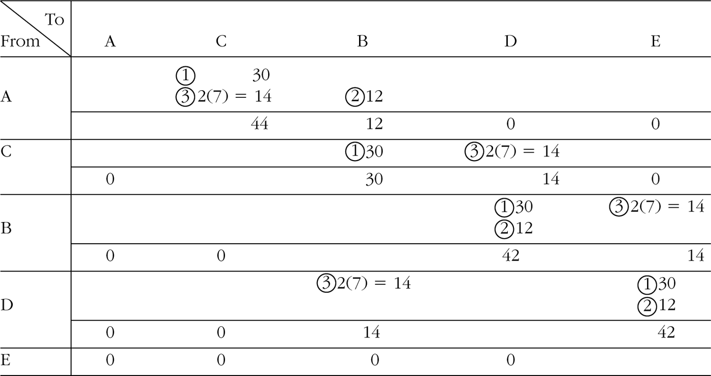
Kesikli parça süreçleri için akış sistemleri
1. Malzeme yönetim sistemi
2. Malzeme akış sistemi
3. Fiziki dağıtım sistemi
Bunların hepsini birleştiren sistem
Lojistik sistemi
Malzeme yönetim sistemi ve fiziki
dağıtım sistemi ile ilgili faaliyetler
sıklıkla “tedarik zinciri yönetimi”
olarak adlandırılır.

İmalat Tesisine doğru Akış

İmalat Tesisi içindeki Akış

İmalat Tesisinden dışa doğru olan Akış
END312 Tesis Planlama ve Yerleşimi

<!-- Slide number: 7 -->

# Akışın Bölümleri-Segments of flow
İmalat Tesisine doğru olan Malzeme  Akışı
END312 Tesis Planlama ve Yerleşimi

<!-- Slide number: 8 -->

# Akışın Bölümleri-Segments of flow
İmalat Tesisi içindeki Malzeme Akışı
END312 Tesis Planlama ve Yerleşimi

<!-- Slide number: 9 -->
# Akışın Bölümleri-Segments of flow

İmalat Tesisinden dışa doğru olan Ürün Akışı
END312 Tesis Planlama ve Yerleşimi

<!-- Slide number: 10 -->
# Akış Sistemi
Tesis planlayan için akış sistemleri çok önemlidir
Ürün / Malzeme /Enerji / Bilgi / İnsan akışı
•➜ ürün akış süreci : Buzdolaplarının fabrikadan, çeşitli dağıtım kanalları yoluyla son kullanıcıya iletilmesi
•➜ bilgi akış süreci : Satış sipariş bilgisinin, satış bölümünden, üretim kontrol bölümüne gönderilmesi
• ➜ insan akış süreci : Hastanelerde hastaların, çalışanların ve ziyaretçilerin hareketi

END312 Tesis Planlama ve Yerleşimi

<!-- Slide number: 11 -->
# Akış Paterni-Flow Patterns
Tüm akış çevresi içindeki kritik düşünce, akış paternidir.
İş istasyonları içindeki Akış-Flow within workstations
Hareket Etüdü ve ergonomik değerlendirmeler
Akış; eş zamanlı, koordineli, simetrik, doğal, ritmik ve tabiatına uygun olmalıdır.
Bölümler içindeki Akış - Flow within departments
Bölüm (Ürün veya süreç bölümleri) tiplerine bağlı mı?
Bölümler arası Akış-Flow between departments
Tesise doğru olan tüm akışın değerlendirilmesinde kullanışlıdır.

END312 Tesis Planlama ve Yerleşimi

<!-- Slide number: 12 -->
12
# Tesis Planlama
END312 Tesis Planlama ve Yerleşimi

<!-- Slide number: 13 -->
13
# Akış Süreci
Akış konusu
işlenen nesne
Akışı ortaya çıkaran kaynaklar
 gerekli akışı sağlamak için ihtiyaç duyulan işleme ve taşıma tesisleri
Kaynakları birleştiren bağlantılar
 akış sürecinin yönetimini kolaylaştıran prosedürleri kapsayan kaynakları düzenleyen araçlar
END312 Tesis Planlama ve Yerleşimi

<!-- Slide number: 14 -->
# İş Yeri Düzenlemede İlkeler
Bütünsel Entegrasyon İlkesi; İş gücü, malzeme, makina, destek eylemleri en iyi biçimde uzlaştıracak büyük bir birim oluşturmaktadır. Tüm tesis tek bir birim gibi hareket etmelidir.
En Küçük Hareket İlkesi; Malzeme ve personel hareketleri en aza indirilmelidir.
Akış İlkesi; İş veya Hizmet alanı her işlem veya süreç için işin akış sırası yönünde düzenlenmelidir. Malzeme kayar gibi ilerlemeli, iş akışlarında geri dönmeler, kesişimler olmamalıdır.
Üç Boyutluluk İlkesi; İnsan, malzeme ve makinanın hareketi üç yönden herhangi birisine doğru olabilir. Yatay ve düşey alan etkin biçimde kullanılmalıdır.
İş Doyumu ve İş Güvenliği İlkesi; İş, işgücü için doyumlu ve güvenli olmalıdır.
Esneklik İlkesi; Yerleşim, en küçük maliyet ve en az sakınca ile ayarlanıp düzenlenebilmelidir.

END312 Tesis Planlama ve Yerleşimi

<!-- Slide number: 15 -->
# İş Yeri Düzenlemede Adımlar
Gerekli Bilgilerin Toplanması; Ürün, Üretim Hacmi, Kalite, Donanım, Üretim Tipi, Binalar, Malzeme Taşıma.
Temel Bilgilerin Analizi ve Eş güdümü; İş gören sayısı, İş istasyonu sayısı, Donanımların cinsi, ölçüsü, miktarı, Gerekli stok ve çalışma alanları,
Malzemenin süreç sırasındaki akışının belirlenmesi,
İş istasyonlarının belirlenmesi,
Kısım kısım hazırlanan tasarının, genel iş yeri düzeni tasarısında birleştirilmesi ve bir bütün olarak binalara yerleştirilmesi,
Malzeme Taşıma sistemenin kurulması.

END312 Tesis Planlama ve Yerleşimi

<!-- Slide number: 16 -->
# İş Yeri Düzenleme Etmenleri
Bir tesisin veya iş yerinin düzenlenmesinde etkili olan çok sayıda etmen vardır.:
Malzeme Etmeni; Tasarım, Değişiklik, gerekli işlemleri ve bunların sırası,
Makina Etmeni; Üretim araçları, takımlar ve bunların kullanımı,
İnsan Etmeni; Gözetim, denetim ve hizmet,
Hareket Etmeni; Bölüm içi ve bölümler arası taşımalar, değişik işlemler, depolamalar ve muayeneler,
Bekleme Etmeni; Sürekli ve geçici depolamalar ve gecikmeler,
Hizmet Etmeni; Bakım, muayene vb hizmetler,
Bina Etmeni; Bina özellikleri, kullanım özellikleri ve donanım,
Değişim Etmeni; Genişleme ve Esneklik.

END312 Tesis Planlama ve Yerleşimi

<!-- Slide number: 17 -->
# Malzeme Akış Sistemleri
Tesis Planlama

<!-- Slide number: 18 -->
# İş Akışı Tipleri
İşletmelerde malzeme, parça ve yarı mamullerin, üretimleri sırasında izledikleri yola iş akışı denilmektedir.
Hangi akış tipinin esas alınacağının belirlenmesinde;
İşletmenin tek veya çok bina, tek veya çok katlı bina,
Malzeme taşıma sistemleri,
Ergonomi ve iş güvenliği kuralları,
Metot etüdü çalışmaları,
Parçaların imalat ve kalite kontrol usulleri,
Temizlik ve bakım kolaylıkları,
Alan ihtiyaçları, esneklik, binanın mimarisi vd. özellikleri dikkate alınır.

END312 Tesis Planlama ve Yerleşimi

<!-- Slide number: 19 -->
# Sistematik Tesis Yeri Düzenleme Yaklaşımı
Entegrasyon: ilgi etmenlerin en üst düzeyde entegre bir biçimde çalışabilme özelliği,
Hareket minimizasyonu: İnsan, malzeme ve teçhizat hareketinin en az düzeyde tutulabilmesi,
Akış Yönünde Yerleştirme: Mümkün olduğu kadar makine ve teçhizatın iş akışı yönünde yerleştirilmesi,
En Az Alan ve Hacim Kullanımı: Hem iki hem de üç boyutta alan ve hacim kullanımının en düşük düzeyde tutulabilmesi

END312 Tesis Planlama ve Yerleşimi

<!-- Slide number: 20 -->
20
# Malzeme Akış Süreci
İş akış maliyetinin enküçüklenmesi prensibi
İş akışı: Malzeme, parça ve yarımamullerin üretimleri sırasında izledikleri yol.
1. İmalat adımlarının sayısını azaltarak, gereksiz hareketlerin çıkarılması
2. Dolaşma/taşıma mesafelerini enküçükleyerek elle taşımanın enküçüklenmesi
3. Akışın mekanizayonu veya otomatik sistemlerle sağlanarak elle taşımaların ortadan kaldırılması
4. Konteyner (birim yük) kullanımı ile akış yoğunluğunun azaltılarak malzeme taşımanın enküçüklenmesi
END312 Tesis Planlama ve Yerleşimi

<!-- Slide number: 21 -->
# İş Akışı Tipleri
Tesis içinde makina ve işgörenlerin yerleştirilmesinde temel amaç; hammadde girişinden, bitmiş ürünün müşteriye teslim edilişine kadar, süreçlerde en az ağırlık, uzaklık ve maliyetle taşınmayı sağlayacak bir iş akışının oluşturulmasıdır.
İş yeri düzenlemede, akış modellerinin bu genel tiplerinin olması çok zor olduğu gibi, gerekli de değildir. Akış tipi seçilirken, kullanılacak alanların boyutları, konumları ve diğer özellikleri her zaman göz önünde tutulmalıdır.
İş Akışı Modelleri
Özellikleri bakımından iki grupta incelenebilir;
Üretim Hattı Bakımından İş Akışı Modelleri
Montaj Hattı Bakımından İş Akışı Modelleri
Temel Yatay ve Dikey İş Akışı Modelleri ve Hibrit modellerden meydana gelmektedir.

END312 Tesis Planlama ve Yerleşimi

<!-- Slide number: 22 -->
22
# Akış Paterni-Flow Patterns Flow within Departments
Ürün Bölümleri Akışı Product departments flow: Bir ürün veya ürün ailesi bölümü içerisindeki akış şekilleri :  a, b ve e’de her istasyonda 1 operatör çalışır. b’de bir operatör 2 iş istasyonuna, d’de ikiden fazla iş istasyonuna bakabilir.

END-TO-END
BACK-TO-BACK
FRONT-TO-FRONT
CIRCULAR
ODD-ANGLE
END312 Tesis Planlama ve Yerleşimi

<!-- Slide number: 23 -->
23
# Akış Paterni-Flow Patterns Flow within Departments
Süreç Bölümleri Akışı: Process departments flow: Bir Süreç bölümü içindeki akış şekilleri :  Benzer makineler aynı bölümde toplanır.
Bölümlerin içindeki iş istasyonlarındaki akış miktarının en küçüklenmesi istenir.
Akış, genellikle iş istasyonları ve ara yollar arasında oluşur.

PARALLEL FLOW
PERPENDICULAR FLOW
DIAGONAL FLOW
END312 Tesis Planlama ve Yerleşimi

<!-- Slide number: 24 -->
# Akış Paterni: Bölümler içindeki Akış Flow Patterns: Flow within Departments
Malzeme aktarma faktörlerine göre ürün ve süreç bölümleri içerisindeki iş akış şekilleri
Hat Akış Paterni - Line flow patterns

Hat Şeklinde İş Akış Örnekleri
END312 Tesis Planlama ve Yerleşimi

<!-- Slide number: 25 -->
# Akış Paterni: Bölümler içindeki Akış Flow Patterns: Flow within Departments
Düzgün ve belirli bir iş akışı üretim kontrolünü kolaylaştırır,
Malzeme taşıma maliyetlerini düşürür
Verimliliği artırır.
Üretim Hattı Bakımından İş Akışı Modelleri
Doğrusal (Düz)
U Biçimli
S Biçimli
Bükümlü  (Helezoni)

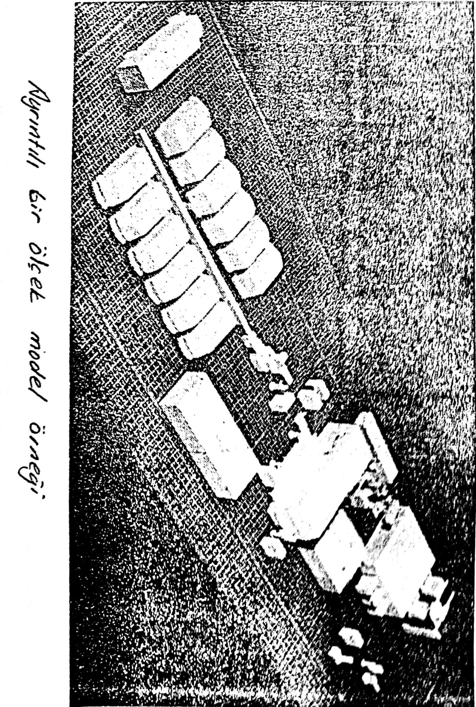
END312 Tesis Planlama ve Yerleşimi

<!-- Slide number: 26 -->
# İş Akışı Modelleri
Montaj Hattı Bakımından İş Akışı Modelleri
Tarak Biçimli
Ağaç Biçimli
Dal Biçimli
Üst Üste (Havai)

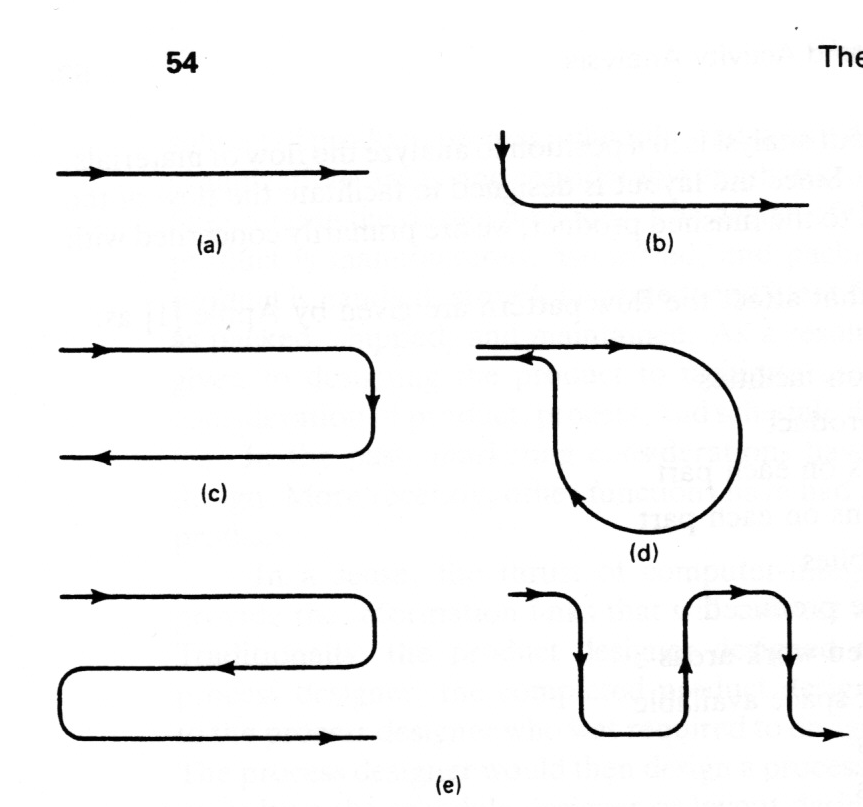
Düz
L akış
U akış
O akış
S akış
END312 Tesis Planlama ve Yerleşimi

<!-- Slide number: 27 -->
# İş Akışı Tipleri
Belirlenen iş akışı malzeme taşıma sisteminin kurulmasına da esas teşkil eder.

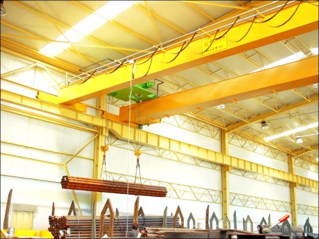

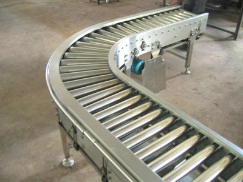

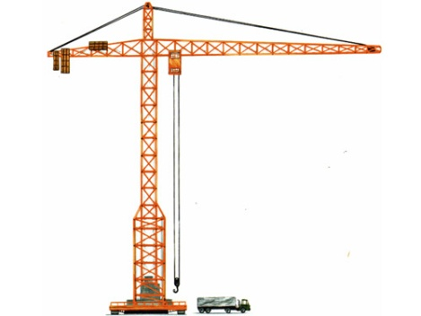

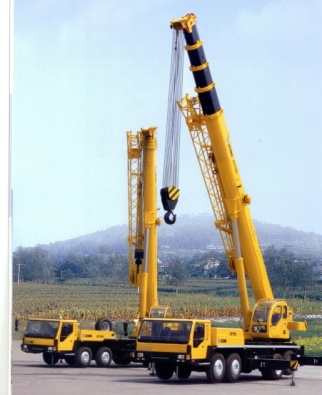

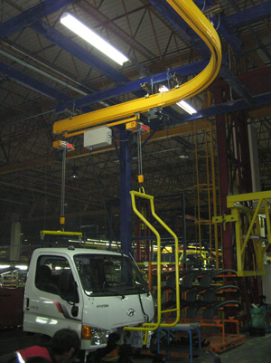

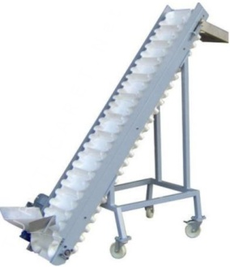
END312 Tesis Planlama ve Yerleşimi

<!-- Slide number: 28 -->
# Akış Paterni: Bölümler içindeki Akış Flow Patterns: Flow within Departments
Malzeme aktarma faktörlerine göre ürün ve süreç bölümleri içerisindeki iş akış şekilleri
Halka Şeklinde İş Akış Örnekleri

Balık Kılçığı Şeklinde İş Akış Örnekleri

İçten Döngü

Ağaç Şeklinde İş Akış Örnekleri

Dıştan Halka
END312 Tesis Planlama ve Yerleşimi

<!-- Slide number: 29 -->
29
# Akış Paterni: Bölümler Arası Akış Flow Patterns: Flow between Departments

BÖLÜMLER ARASI AKIŞLAR
En büyük yük
Akış yoğunluğu
Yol payları
Taşıyıcı kapasiteleri
Makine kapasiteleri
Yarı mamul stoklama kapasiteleri
Üretim çizelgesi
Taşıyıcı dağıtım kuralları
At the same location
On adjacent sides
On the same side
Girdi-Çıktı Noktalarına göre İş Akış Örnekleri
On opposite sides
END312 Tesis Planlama ve Yerleşimi

<!-- Slide number: 30 -->
30
# Malzeme Akış SüreciAkış Paterni: Bölümler Arası Akış Flow Patterns: Flow between Departments
Flow within a facility -pattern categories

Geleneksel Bölümler Arası Akış
Halka Şeklinde Bölümler Arası Akış
Kılçık Şeklinde Bölümler Arası Akış

Parçalanmış Bölümler Arası Akış
Çift Yönlü Bölümler Arası Akış
END312 Tesis Planlama ve Yerleşimi

<!-- Slide number: 31 -->
# İş Akışı Modelleri

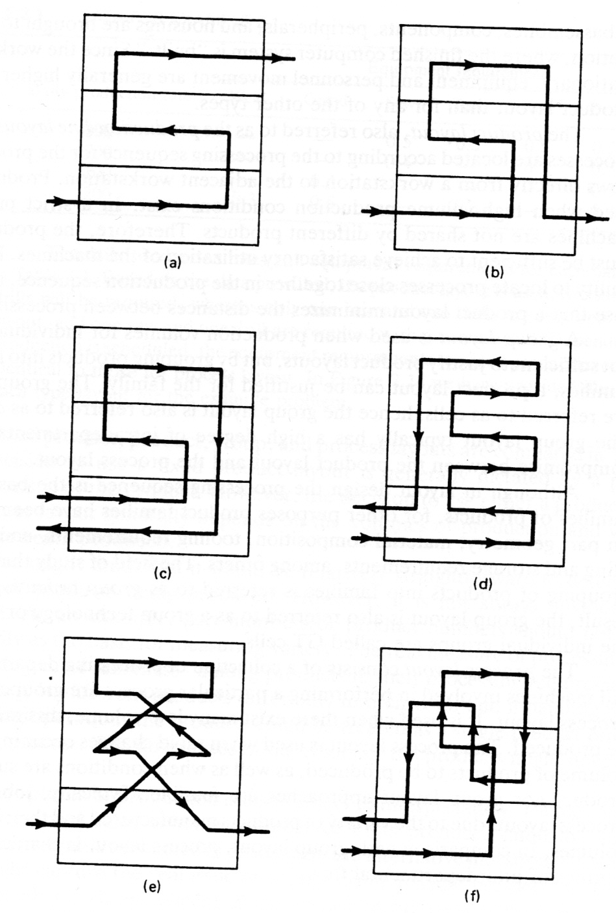
Dikey İş Akışı Modelleri
Yukarı ya da aşağıya doğru süreç akış sistemi,
Merkezi ya da merkezi olmayan kaldırma (elevasyon) sistemi,
Tek yönlü yada geri dönüşlü (çekmeli) akış sistemi,
Dikey yada eğimli akış,
Tek ya da çoğul akış
Binalar arası akış

END312 Tesis Planlama ve Yerleşimi

<!-- Slide number: 32 -->
# Akış Planlama - Flow Planning
Bir tesis içindeki etkin bir akış, bölümler arasındaki akışa bağlıdır. Bu akış, departmanlar içindeki etkin akışa, bölümler içindeki akış ise iş istasyonları içindeki akışın etkinliğine bağlıdır.

Akış Planlama Hiyerarşisi
END312 Tesis Planlama ve Yerleşimi

<!-- Slide number: 33 -->
# Genel bir akış şeklinin işaretleri
Bir akış mal kabul ve alış ile başlar ve göndermeyle son bulur.
Akış Düzgün ve kısa hatlar olmalı
Minimum geriye dönüşler
Malzemeler doğrudan kullanılacağı yere doğru hareket etmeli
Minimum Süreç içi stoklar – Min WIP
Akış paterni kolayca genişletilebilmeli, yeni süreçler kolayca katılabilmeli ve adapte edilebilmelidir.
END312 Tesis Planlama ve Yerleşimi

<!-- Slide number: 34 -->
# Etkin Akış Prensipleri -Principles of effective flow
Akış Yolları kesintisiz olmalıdır.
Maximize directed (uninterrupted) flow paths

Kesintisiz Akış
Kesintili Akış
END312 Tesis Planlama ve Yerleşimi

<!-- Slide number: 35 -->
35
# Etkin Akış Prensipleri
Akış Hattı üzerinde geri dönüşler olmamalıdır. Minimum Geri dönüşler: Geri dönüşler akış yolunun uzunluğunu arttırır.

Geri Dönüşlü Akış
Yönlü Hat Üzerinde Geri Dönüşlü Akış
END312 Tesis Planlama ve Yerleşimi

<!-- Slide number: 36 -->
# Etkin Akış Prensipleri - Principles of effective flow
Minimize Akış
Gönderilen malzemeler, bilgi veya insanların nihai kullanım noktalarına yönlendirilmesi
Ardışık iki kullanıcı noktaya göndermek yerine mümkün olduğunca aynı anda akış planlanması
Akışların ve operasyonların birleştirilmesi
Yönlendirilmiş akış yollarının maksimizasyonu Maximize directed flow path
Akış maliyetinin Minimizasyonu Minimize the cost of the flow
Manuel taşımaların Minimizasyonu (Otomatik veya mekanize edilmiş akış)
Taşıyıcıların boşta gezmelerinin minimizasyonu

END312 Tesis Planlama ve Yerleşimi

<!-- Slide number: 37 -->
# Sistematik Tesis Yeri Düzenleme Yaklaşımı
İş Güvenliği: İşçi sağlığı ve iş güvenliği önlemlerinin gerektiği şekilde alınması
Çalışanların Tatmini: Tesis yeri düzeninde çalışanların tatminine yönelik önlemlerin alınması,
Esneklik: Değişikliklerin en az maliyet ile gerçekleştirilebilmesi ve çeşitli üretimlerin yapılabilmesi

END312 Tesis Planlama ve Yerleşimi

<!-- Slide number: 38 -->
# Akışın Ölçülmesi
Tesis Planlama

<!-- Slide number: 39 -->
# Akışın Ölçülmesi - Measuring Flow
Nicel Akış Ölçümü- Quantitative flow measurement
Bölümler arasında büyük miktarlardaki malzemelerin, bilgi ve insanların hareketi
Belli bir dönem içindeki hareketler veya seyahat edilen uzaklıklar

Nitel Akış Ölçümü- Qualitative flow measurement
Bölümler arasındaki malzemelerin, bilgi ve insan akışlarının çok küçük hareketleri
Bölümler arası önemli iletişim ve organizasyonlar arası etkileşim
Organizasyondaki bölümlerin birimleri arasındaki dönemsel ilişkilerin seviyesi
Genellikle her iki ölçütte kullanılmaktadır.
END312 Tesis Planlama ve Yerleşimi

<!-- Slide number: 40 -->
# Malzeme Akış Sisteminin tasarımı ve analizi için Grafik Araçlar

 Artık biliyoruz ki:
Montaj Şemaları-Assembly chart
Operasyon Süreç Şemaları- Operations process chart
 Tesis Planlamanın özel araçları:
Akış Süreç Şeması-Flow process chart
Akış Diyagramı-Flow diagram
Geliş-Gidiş Matrisi - From-to chart
İlişki Şeması-Relationship chart
İlişki Diyagramı - Relationship diagram

END312 Tesis Planlama ve Yerleşimi

<!-- Slide number: 41 -->
# Akış Süreç Şeması-Flow process chart
Akış Süreç Şeması, bir ürünün veya parçanın:
Hangi işlemlerden geçtiğini
Hangi sırayla ilerlediğini
Nerede kontrol edildiğini
Taşındığını, beklediğini veya depolandığını
başlangıçtan bitişe kadar ayrıntılı biçimde gösteren şemadır.
Akış Süreç Şeması Operasyon Süreç Şemalarına benzerdir.

END312 Tesis Planlama ve Yerleşimi

<!-- Slide number: 42 -->
# Akış Süreç Şeması-Flow process chart
Akış Süreç Şeması, Operasyon Süreç Şemalarına benzerdir.
Akış Süreç Şeması, montajlama, operasyonlar ve muayeneleri gösterir ayrıca malzeme taşıma ve depolamayı da gösterir.

END312 Tesis Planlama ve Yerleşimi

<!-- Slide number: 43 -->
# Akış Süreç Şeması-Flow process chart
 Süreç boyunca malzeme hareket ederken çeşitli durumlar olabilir.
 İşlem Görebilir, Montaj veya demontajı yapılabilir.
 Hareket ettirilebilir.
 Sayılabilir, kontrol veya muayene edilebilir.
 Başka bir işlem için bekleyebilir.
 Stoklanabilir.

END312 Tesis Planlama ve Yerleşimi

<!-- Slide number: 44 -->
# Akış Süreç Şeması-Flow process chart
 Süreç şemalarında kullanılan bazı kurallar ve varsayımlar
 Yatay Hat : Sürecin malzeme ile beslendiğini gösterir.
 Dikey Hat : Sürecin kronolojik sırada düzenlenmiş adımlarını gösterir.
  Hatlar kesiştiğinde yatay hat yol verir.

İşlem Sırası Hattı

Malzeme Hattı
Dikey Hat
Yatay Hat
END312 Tesis Planlama ve Yerleşimi

<!-- Slide number: 45 -->
# Akış Süreç Şeması-Flow process chart
 Tipik Süreç Şeması
 Süre/Parça
 0,024

Yeniden İşlenmek için Malzemenin Geri Dönmesi:
Hurda, Fire veya Kayıp Malzeme Akışı:
 98 Ton/gün
3
% 10
1
Tanım
4
Boyama
2
Test
4
14
1
Hurda
84
END312 Tesis Planlama ve Yerleşimi

<!-- Slide number: 46 -->
# Akış Süreç Şeması-Flow process chart

END312 Tesis Planlama ve Yerleşimi

<!-- Slide number: 47 -->
# Akış Şeması-Flow diagram

Akış şeması, ilgili alanın akış süreç şemasına karşılık gelen yerleşim düzenidir.
END312 Tesis Planlama ve Yerleşimi

<!-- Slide number: 48 -->
# Geliş Gidiş Matrisi
Tesis Planlama

<!-- Slide number: 49 -->
# Geliş Gidiş Matrisi
 Satırlarında yukarıdan aşağı, sütunlarında soldan sağa aynı sırada kaydedilmiş iş istasyonları veya işlemlerin adlarını (numaralarını veya kodları) içeren kare matrislerdir.
 Matris simetrik değildir. (A’dan B’ye akış miktarı, B’den A’ya akış miktarlarından farklıdır).
 İlişkiler ortak bir ölçüt cinsinden belirlenir, sayısal olarak şemaya işlenir. (akış miktarı/gün, taşıma birimi/gün, palet/gün, vb....)
 Bir başka geliş-gidiş matrisi gösteriminde, işlemler veya üretim bölümleri ortada dikey olarak sıralanır, geldiği yer ve gittiği yer ise eşkenar dörtgenin kenarlarında yer alır.

END312 Tesis Planlama ve Yerleşimi

<!-- Slide number: 50 -->
50
# Akışın Ölçülmesi
Gezi Diyagramı (From- To Chart)
bölümler arasındaki akışları ölçer.
Mil mesafe şemasına benzerdir.

İlişki Diyagramı (Relationship Chart)
END312 Tesis Planlama ve Yerleşimi

<!-- Slide number: 51 -->
# Akış Şiddetlerinin Ölçümü
 Malzemelerin benzer özellikler taşıdığı durumlarda aynı ölçü birimleri kullanılabilir veya ölçü birimleri birbirlerine dönüştürülebilir. (ton,kg,lb, m3 , ft3,... , kutu, kasa)
 Akış şiddeti ölçümü, birim zamanda hareket eden parça sayısı ile parça başına ölçü biriminin çarpılmasıyla yapılabilir.
 Ancak malzemelerin özelliklerinin farklı olması durumunda akış şiddetinin ölçülmesi güçleşir. Böyle durumlarda, malzemelerin taşınabilirliğinin ölçülebilmesi için MAG ölçüm yöntemi geliştirilmiştir.

END312 Tesis Planlama ve Yerleşimi

<!-- Slide number: 52 -->
# Akış Şiddetlerinin Ölçümü
 Bir parçanın taşınabilirliğini etkileyebilecek etmenler;
 A : Parçanın Boyutu (Hacmi)
 B : Parçanın Yoğunluğu
 C : Parçanın Biçimi
 D : Parçaya veya çevresindekilere zarar verme riski
 E : Parçanın Durumu
 Herhangi bir parçanın;
 MAG Akış Şiddeti değeri = A[1+1/4(B+C+D+E)]

END312 Tesis Planlama ve Yerleşimi

<!-- Slide number: 53 -->
# Akış Şiddetlerinin Ölçümü
 Parçaların boyutlarına karşılık gelen değerler aşağıdaki gibidir. Ara değerler için interpolasyon uygulanır.

| Hacim (cm3) | Hacim (in3) | MAG Ölçüsü |
| --- | --- | --- |
| 0,75 | 0,05 | 0,005 |
| 1,5 | 0,1 | 0,05 |
| 15 | 1 | 0,25 |
| 150 | 10 | 1 |
| 1.500 | 100 | 3,5 |
| 15.000 | 1.000 | 10 |
| 150.000 | 10.000 | 25 |
| 1.500.000 | 100.000 | 50 |
END312 Tesis Planlama ve Yerleşimi

<!-- Slide number: 54 -->
# Akış Şiddetlerinin Ölçümü
 B,C,D ve E değerleri ise aşağıdaki tablo yardımıyla bulunabilir.

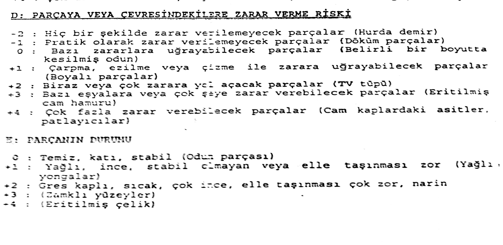
END312 Tesis Planlama ve Yerleşimi

<!-- Slide number: 55 -->
# ÖRNEK
 Kitap 237. Sayfası Örnek 6.1
 Presten döküm tezgâhına geçerken taban çapı 6 cm ve yüksekliği 17 cm. Olan, silindir şeklindeki bir kalıp merkezleme mili, şekil olarak biraz düzensiz bir yapıya sahip olup, yoğundur ve ağırdır. Kolaylıkla zarar verilemeyecek olan bu parça yağlıdır ve elle taşınması zordur. B-C-D-E değer tablosu ve dönüşüm tablosundan yararlanarak, bu parçanın akış şiddetini hesaplayınız. (pi=3 alınacaktır.) bu parçanın yılda 50.000 adet üretildiğini kabul ederek, kalıp merkezleme milinin, pres-döküm tezg’ahları arasındaki geçişiş sırasınaki yıllık hareket akış şiddetini bulunuz.

END312 Tesis Planlama ve Yerleşimi

<!-- Slide number: 56 -->
# ÖRNEK-Çözüm
150 ve 1500 cm3 arasında olduğu için İnterpolasyon yöntemiyle oran kurulur:
 R = 6 cm (Çap)
r = 3 cm (Yarı Çap)
 h = 17 cm (Yükseklik) ise
 Hacim =
 B : Parçanın Yoğunluğu : Ağır ve Yoğun
 C : Parçanın Biçimi : Uzun, Yuvarlatılmış ve Düzensiz
 D : Parçaya veya Çevredikelere zarar verme riski : Kolaylıkla zarar verilemeyecek tarzda
 E : Parçanın Durumu : Yağlı ve elle taşınması zordur.

A=1,57 Mag, B=2, C=1, D=-1, E=1
 MAG Akış Şiddeti değeri = A[1+1/4(B+C+D+E)]

Mag Akış Değeri = 1,57[1+1/4(2+1-1+1)]=2,74 Mag
Yıllık Hareket Akış Değeri = 2,74*50.000*1=137.000 Mag
END312 Tesis Planlama ve Yerleşimi

<!-- Slide number: 57 -->
# Gezi Diyagramı (From- To Chart) Prosedürü
Tüm bölümleri listele Satır ve sütunlara tüm akış Paterni olacak şekilde bölümler listelenir.
Akış için bir ölçü tesis edilir.  tesis için akış hacmini tam olarak gösteren denk bir ölçü belirlenir.
Eğer malzemeler boyut, ağırlığı, zarar görme riski ve şekil bakımından denk ise, ölçü, gezi veya taşıma sayısı olabilir.
Eğer malzemeler birbirinden farklı ve çeşitli ise, eşdeğer malzemeler tesis edilmeli böylece sayısal kayıtlar gezi diyagramına hareket miktarları kaydedilir.
Kayıtlı Akış Hacmi- Record the flow volumes hareket eden malzemeler için akış yolunu temel alan gezi şeması oluşturulur.

END312 Tesis Planlama ve Yerleşimi

<!-- Slide number: 58 -->
58
# Gezi Diyagramı (From- To Chart)
Olası Alternatif Yerleşimler:
Malzemelerin Akışı

Gezi Diyagramı (From- To Chart)

END312 Tesis Planlama ve Yerleşimi

<!-- Slide number: 59 -->
# Gezi Diyagramı (From- To Chart)-Örnek
Component 3 is twice bigger than the other two
Components 1 and 2 are of the same size
Bir firma 3 parça imal etmektedir. Aynı büyüklük ve
ağırlığa sahip parça 1 ve 2, taşıma yönlü eşdeğer
sayılmaktadır. Parça 3 yaklaşık bunların iki katı
büyüklükte olup, bir birim parça 3’ün taşınması, parça
1 ya da 2’nin iki birim taşınmasına eşdeğer
görülmektedir.

| Parça | Üretim Miktarı (Günlük) | Rota |
| --- | --- | --- |
| 1 | 30 | A-C-B-D-E |
| 2 | 12 | A-B-D-E |
| 3 | 7 | A-C-D-B-E |
Gezi Diyagramının Hazırlanışı  (From- To Chart)
END312 Tesis Planlama ve Yerleşimi

<!-- Slide number: 60 -->
Frekans Tablosu
# Gezi Diyagramı (From- To Chart)-
| Akış | Bölümler | Sıklığı - Frekans |
| --- | --- | --- |
| 1 | Stores-Milling | 12 |
| 2 | Stores-Turning | 6 |
| 3 | Stores-Press | 9 |
| 4 | Stores-Plate | 1 |
| 5 | Stores-Assembly | 4+1=5 |
| 6 | Milling-Plate | 7+3=10 |
| 7 | Milling-Assembly | 2 |
| 8 | Turning-Milling | 0+3=3 |
| 9 | Turning-Plate | 4+1=5 |
| 10 | Press-Plate | 3 |
| 11 | Press-Assembly | 1 |
| 12 | Press-Warehouse | 1 |
| 13 | Plate-Assembly | 4 |
| 14 | Plate-Warehouse | 3 |
| 15 | Assembly-Warehouse | 7 |

END312 Tesis Planlama ve Yerleşimi

<!-- Slide number: 61 -->
# Toplam Akış Matrisi
Toplam Akış Matrisi
|  | Stores | Milling | Turning | Press | Plate | Assembly | Warehouse |
| --- | --- | --- | --- | --- | --- | --- | --- |
| Stores | - | 12 | 6 | 9 | 1 | 5 |  |
| Milling |  | - | 3 |  | 10 | 2 |  |
| Turning |  |  | - |  | 5 |  |  |
| Press |  |  |  | - | 3 | 1 | 1 |
| Plate |  |  |  |  | - | 4 | 3 |
| Assembly |  |  |  |  |  | - | 7 |
| Warehouse |  |  |  |  |  |  | - |

Gezi Diyagramı (From- To Chart)-
END312 Tesis Planlama ve Yerleşimi

<!-- Slide number: 62 -->
# Gezi Diyagramı (From- To Chart)-
Frequency chart
Frekans Tablosu

### Chart

| Category | Seri 2 |
|---|---|
| 1 | 12.0 |
| 2 | 10.0 |
| 3 | 9.0 |
| 4 | 7.0 |
| 5 | 6.0 |
| 6 | 5.0 |
| 7 | 5.0 |
| 8 | 4.0 |
| 9 | 3.0 |
| 10 | 3.0 |
| 11 | 3.0 |
| 12 | 2.0 |
| 13 | 1.0 |
| 14 | 1.0 |
| 15 | 1.0 || Akış | Bölümler | Sıklığı - Frekans |
| --- | --- | --- |
| 1 | Stores-Milling | 12 |
| 2 | Stores-Turning | 6 |
| 3 | Stores-Press | 9 |
| 4 | Stores-Plate | 1 |
| 5 | Stores-Assembly | 4+1=5 |
| 6 | Milling-Plate | 7+3=10 |
| 7 | Milling-Assembly | 2 |
| 8 | Turning-Milling | 0+3=3 |
| 9 | Turning-Plate | 4+1=5 |
| 10 | Press-Plate | 3 |
| 11 | Press-Assembly | 1 |
| 12 | Press-Warehouse | 1 |
| 13 | Plate-Assembly | 4 |
| 14 | Plate-Warehouse | 3 |
| 15 | Assembly-Warehouse | 7 |
END312 Tesis Planlama ve Yerleşimi

<!-- Slide number: 63 -->
# Faaliyet İlişki Şeması
Tesis Planlama

<!-- Slide number: 64 -->
# Faaliyet İlişki Şeması
 Günümüzde sadece akış ilişki şeması yeterli değildir. Eylem ilişki şeması, hangi eylemlerin diğer eylemlerle ilişkisi olduğunu gösterir, ilişkilerin ölçüsünü, önem derecesini belirler.
 Bütün bölümler (departmanlar) dikkate alınır.
 Yakınlık ilişkisi sembolleri bir şema üzerinde tanımlanır.
 Yakınlık ilşkisinin belirlenmesinde kullanılacak ölçüt tanımlanır. İlişki kodları, gerekçeleri, belirtilerek açıklanır.
 Bütün bölüm çiftleri için ilişki değerleri ve gerekçeleri saptanarak şema üzerinde gösterilir.

END312 Tesis Planlama ve Yerleşimi

<!-- Slide number: 65 -->
65
# Faaliyet İlişki Diyagramı
İlişki Diyagramı (Relationship Chart) Yakınlık ilişkilerinin değerlerini (closeness relationships values) kullanarak nitel akış ölçüsüdür.
Kalitatif ölçümler Muther (1973) tarafından geliştirilen Yakınlık İlişki Değerleri ve Muther Diyagramları kullanılarak yapılır.
Yaygın olarak kullanılan Yakınlık ilişkisi Değerleri aşağıdaki tabloda verilmiştir:

İlişkinin Önemi

| Değer | Yakınlık |
| --- | --- |
| A | Kesinlikle gerekli |
| E | Özellikle önemli |
| I | Önemli |
| O | Sıradan yakınlık |
| U | Önemli değil |
| X | Arzu edilmez |
| XX | Kesinlikle istenmez |

END312 Tesis Planlama ve Yerleşimi

<!-- Slide number: 66 -->
# Akış İlişki Şeması
 Malzeme akışının şeması (Hizmt vb. Eylemler eklenmezse) iki yaklaşım:
 Belli bir noktadan malzeme ile başlanır, akış sırasına göre devam edilir.
 En yüksek akış şiddetinin olduğu yerden başlanır, akış şiddetinin azaldığı sırada devam edilir.
 Toplam şiddet, her iki yöndeki akışın toplamıdır.

END312 Tesis Planlama ve Yerleşimi

<!-- Slide number: 67 -->
# Akış İlişki Şeması
 Uygulamada akış ilişki şemasının hazırlanması için adımlar:
 Tüm etkinlikler, yan işlemler, alanlar, bölümler ve ilgili özellikler tanımlanır.
 Eylemlerin tümü, önce işlemler sonra hizmetler olmak üzere akış ilişki şeması üzerinde listelenir.
 İşlemsel eylemlerin akış şiddetleri belirlenir.
 Hizmet veya akış dışı işlemler için akış ilişki şeması kurulur.
 Akış ve akış dışı ilişkilerin derecelendirilmesi bir arada düşünülerek birleşik akış ilişki şeması kurulur.

END312 Tesis Planlama ve Yerleşimi

<!-- Slide number: 68 -->
# Akış İlişki Şeması
 Bir kaç çeşit ürünün olduğu durumda izlenecek yollar:
 Her ürün için ayrı bir şema çizilir.
 Tüm ürünler için tek şema çizilir. Her ürün için ayrı renk kodu, sayı kodu, akış kodu ve sembol kodu kullanılır.

END312 Tesis Planlama ve Yerleşimi

<!-- Slide number: 69 -->
# İlişki Şeması - Relationship Chart
İlişkilerin çok katmanlı ve büyük bir çeşitlilik içermesi nedeniyle, her bir ana ilişkiyi ölçmek için ayrı ayrı ilişki şemasının oluşturulması önerilmektedir.
Malzeme Akışı - material flow
İnsan Akışı - personnel flow
Bilgi Akışı - information flow
Organizasyonel, Kontrol, Çevre ve süreç İlişkileri ve diğerleri gibi.
END312 Tesis Planlama ve Yerleşimi

<!-- Slide number: 70 -->
# İlişki Diyagramı
Ayırt edici olması amacıyla
| Kod | Önem Derecesi | Bulunma %'si |
| --- | --- | --- |
| A | Kesinlikle gerekli | 5 |
| X | İstenilmeyen |  |
| E | Çok önemli | 10 |
| I | Önemli %20 | 15 |
| O | Az önemli | 20 |
| U | Önemsiz | 50 |
END312 Tesis Planlama ve Yerleşimi

<!-- Slide number: 71 -->
# İlişki Diyagramı

Diyagramın Kurulması:

Bütün bölümler diyagramda sıralanır.
Görüşme ve anketler ile ilişkileri somutlaştır.
İlişkinin sebebini belirle
İlişki değerini belirle
Sonuçları tartış ve yorumla.
Farklı ilişkiler için farklı REL kurulması gerekir:
Malzeme akışı, personel akışı, ekipman akışı

END312 Tesis Planlama ve Yerleşimi

<!-- Slide number: 72 -->
# İlişki Şeması - Relationship Chart
İlişki Şeması değerlerin sebepleriyle birlikte yakınlık değerlerini de içerebilir.

Diyagramın Kurulması:

Bütün bölümler diyagramda sıralanır.
Görüşme ve anketler ile ilişkileri somutlaştır.
İlişkinin sebebini belirle
İlişki değerini belirle
Sonuçları tartış ve yorumlattır.
İlişkinin Önemi

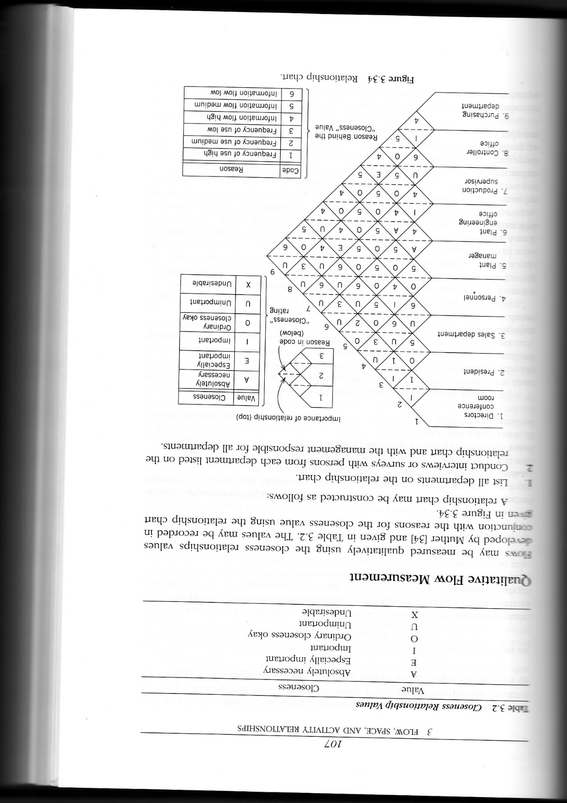
| Değer | Yakınlık |
| --- | --- |
| A | Kesinlikle Gerekli |
| E | Özellikle Önemli |
| I | Önemli |
| O | Normal |
| U | Önemli değil |
| X | Arzu edilmez |
| XX | Kesinlikle İstenmez |
END312 Tesis Planlama ve Yerleşimi

<!-- Slide number: 73 -->
# Faaliyet İlişki Şeması

Değişik sistemlere göre önemin gerekçeleri değişik olacaktır. Örnek bir gerekçeleri ve kodları aşağıda verilmiştir.

| Kod | Önem Gerekçesi |
| --- | --- |
| 01 | Ortak Ekipman Kullanımı |
| 02 | Malzeme Hareketi |
| 03 | Personel Hareketi |
| 04 | Denetim |
| 05 | Ortak Gereçlerin Kullanımı |
| 06 | Gürültü ve Kirlilik |
| 07 | İletişim Sıklığı |
END312 Tesis Planlama ve Yerleşimi

<!-- Slide number: 74 -->
# İlişki Diyagramı
Yanda bir önceki yansıda verilen REL' e göre geliştirilmiş faaliyet ilişki diyagramı görülmektedir.
Büyük oranda tasarımcının kararlarına bağlı olarak gelişir.
Tasarımcı yaptığı değişiklikler ile yakınlık derecesinin tatmin edildiğini düşündüğü noktada bırakır.

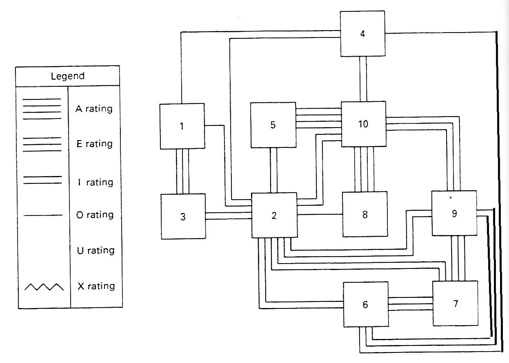
END312 Tesis Planlama ve Yerleşimi

<!-- Slide number: 75 -->
# Faaliyet İlişki Diyagramı
Faaliyet İlişki diyagramı için çizim kuralları

| İlişkinin Önemi | Sembol | Sayısal Değer | Renk Kodu | Çizgi Kodu |
| --- | --- | --- | --- | --- |
| Kesinlikle gerekli | A | 4 | Kırmızı |  |
| Özellikle önemli | E | 3 | Turuncu-Sarı |  |
| Önemli | I | 2 | Yeşil |  |
| Sıradan yakınlık | O | 1 | Mavi |  |
| Önemli değil | U | 0 | Renksiz |  |
| Arzu edilmez | X | -1 | Kahverengi |  |
| Kesinlikle istenmez | XX | -2,-3,-4 | Siyah |  |

END312 Tesis Planlama ve Yerleşimi

<!-- Slide number: 76 -->
# Akış İlişki Şemasında Kullanılan Gösterimler

| Ölçüt | Ölçüt Birimi | Gösterim | Nicel Değer |
| --- | --- | --- | --- |
| 0-800 | Mag |  | 1 |
| 801-2.300 | Mag |  | 2 |
| 2.301-3.800 | Mag |  | 3 |
| 3.801-5.300 | Mag |  | 4 |
| 5.301-6.800 | Mag |  | 5 |
| 6.801-8.300 | Mag |  | 6 |
| 8.301< | Mag |  | 7 |

END312 Tesis Planlama ve Yerleşimi

<!-- Slide number: 77 -->
# İlişki diyagramı - Relationship Diagram
Bölümlerin mekânsal organizasyonları düzenlemek için yakınlık ilişkilerinin dönüşümünü sağlar.
Relationship Chart
Relationship Diagram

|  | D1 | D2 | D3 | D4 | S1 | S2 |
| --- | --- | --- | --- | --- | --- | --- |
| Bölüm 1 | - | X | U | E | U | O |
| Bölüm 2 |  | - | A | U | X | I |
| Bölüm 3 |  |  | - | U | U | U |
| Bölüm 4 |  |  |  | - | U | A |
| Depo 1 |  |  |  |  | - | A |
| Depo 2 |  |  |  |  |  | - |

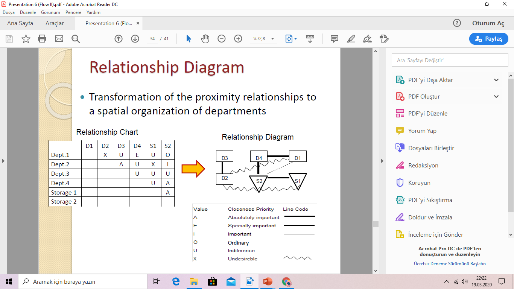
END312 Tesis Planlama ve Yerleşimi

<!-- Slide number: 78 -->

# İlişki diyagramı - Relationship Diagram

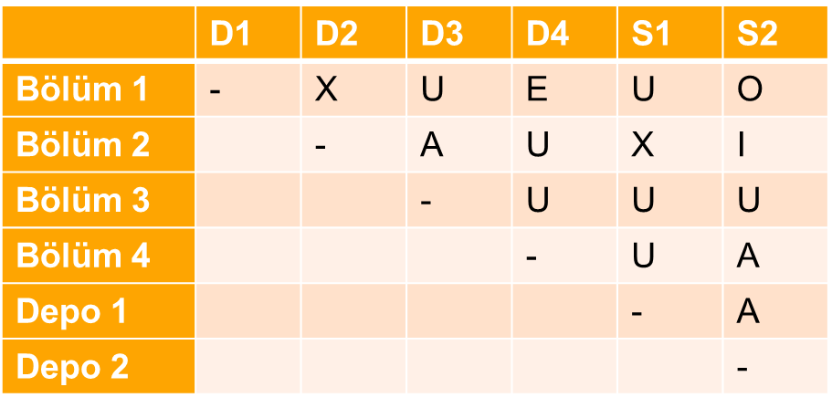
Başlangıç Şema

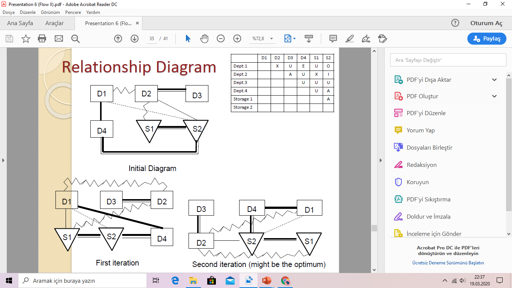
İkinci İterasyon (might be the optimum)

İlk İterasyon
END312 Tesis Planlama ve Yerleşimi

<!-- Slide number: 79 -->
# Faaliyet İlişki Diyagramı
Faaliyet İlişki diyagramının çizilmesi için bir algoritma:
 Diyagramı çizilecek olan eylemlerin/bölümlerin sayıları ve adları belirlenir.
A ilişkilerinin diyagramı çizilir. Eylem türleri için uygun sembolleri kullanılır. Sembolün içine bölüm veya eylemin kodu yazılır.
Tam 4 hatlı ilişkiler eşit uzaklıkta olacak şekilde diyagram düzenlenir ve E ilişkileri diyagrama eklenir.
Tüm 3 hatlı ilişkiler eşit uzaklıkta olacak şekilde diyagram düzenlenir ve I ilişkileri diyagrama eklenir.
Benzer işlemler O, X ve XX ilişkileri için yinelenir.
Diyagram son şekline getirilir.

END312 Tesis Planlama ve Yerleşimi

<!-- Slide number: 80 -->
# İlişki diyagramı – Prosedürü - Relationship Diagram–systematic procedure
“A” ilişkisi olan bölümleri yerleştir. Place the departments among which there is relationship
Bölümleri yerleştirmeden önce ‘‘E’’ ilişkisi olan bölümleri ekle. Yeniden düzenle. Add the departments among which there is “E” relationship to the previously placed departments. Rearrange.
Bölümleri yerleştirmeden önce “X”  ilişkisi olan bölümleri ekle ve yeniden düzenle. Add the departments among which there is relationship to the previously placed departments. Rearrange.
“I”  ilişkisi olan bölümleri ekle ve düzenle. Add the departments among which there is relationship. Rearrange.
“O”  ilişkisi olan bölümleri ekle ve düzenle. Add the departments among which there is “O” relationship. Rearrange.
Geriye kalan bölümleri ekle ve düzenle. Add the rest of the departments. Rearrange.
Bütün bölümlerin yerleştirildiyse ve önemli ilişkiler sıralandıysa doğruluk kontrolü yap. yerleştirilmediğini kontrol et ve Verify if all the departments are placed and if the important relations are respected

END312 Tesis Planlama ve Yerleşimi

### Notes:

<!-- Slide number: 81 -->
# İlişki Diyagramı

Yandaki REL göz önüne alındığında;
A ilişkisi (5,10) ve (8,10)
X yok
E (1,3), (6,7), (7,9) ve (9,10)
I (2,3), (2,5), (2,6), (2,7), (2,9), (2,10), (4,10) ve (6,9)
O (1,2), (1,4), (2,4), (2,8) ve (4,6)
Faaliyet ilişki diyagramı çizilirken bağlantı çizgilerinin diğer çizgileri kesmemesine özen gösterilir.
Önem derecesine göre ilişkiler belirlenir. Genellikle A 4, E 3, I 2 ve O için 1 çizgili hat kullanılır.

END312 Tesis Planlama ve Yerleşimi

<!-- Slide number: 82 -->
# İlişki Diyagramı

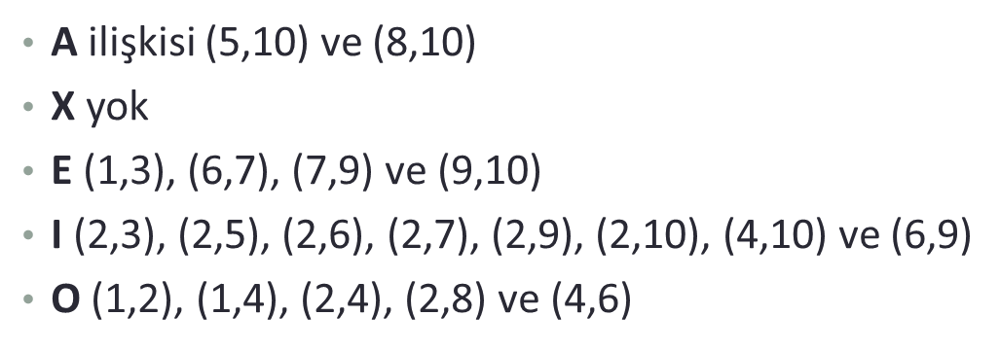

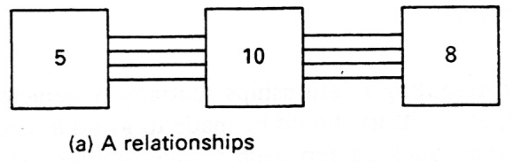

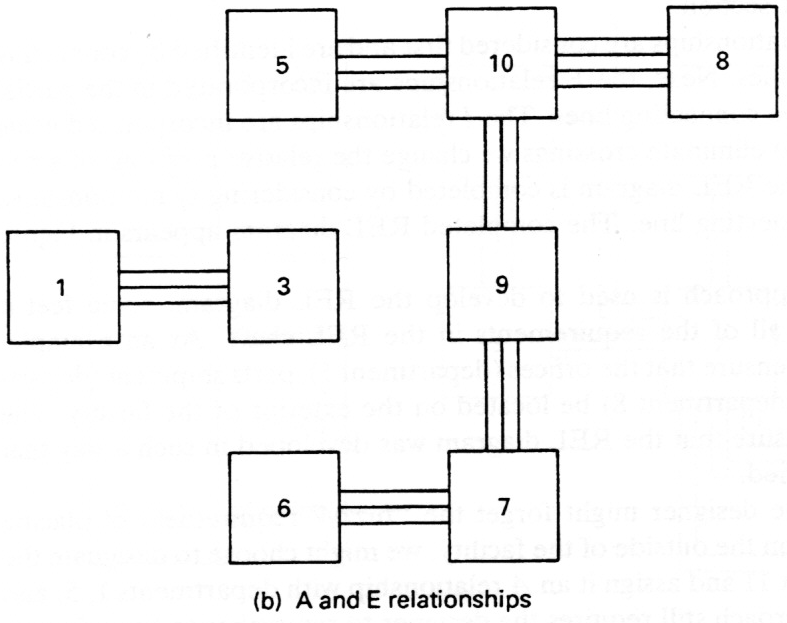

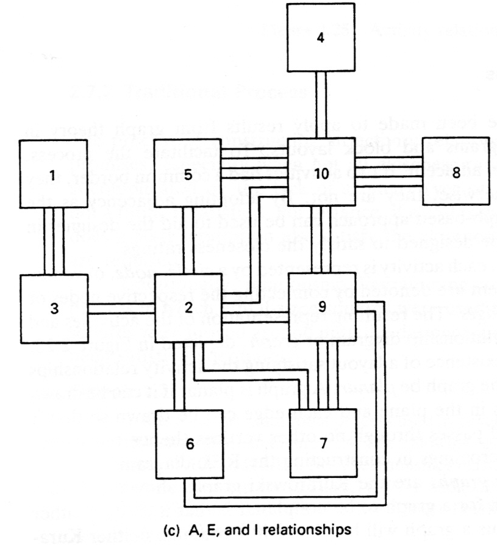

END312 Tesis Planlama ve Yerleşimi

<!-- Slide number: 83 -->
# Örnek

Bir firma 3 parça imal etmektedir. Aynı büyüklük ve ağırlığa sahip parça 1 ve 2, taşıma yönlü eşdeğer sayılmaktadır. Parça 3 yaklaşık bunların iki katı büyüklükte olup, bir birim parça 3’ün taşınması, parça 1 ya da 2’nin iki birim taşınmasına eşdeğer görülmektedir. Beklenen haftalık üretimi temel alan geliş gidiş matrisini, faaliyet ilişki diyagramını  ve akış ilişki şemasını oluşturunuz?

| Parça | Üretim Miktarı (Günlük) | Rota |
| --- | --- | --- |
| 1 | 30 | A-C-B-D-E |
| 2 | 12 | A-B-D-E |
| 3 | 7 | A-C-D-B-E |
Gezi Diyagramının Hazırlanışı  (From- To Chart)
END312 Tesis Planlama ve Yerleşimi

<!-- Slide number: 84 -->
# Örnek
Geliş- Gidiş Matrisi
Toplam Akış Matrisi
|  | A | B | C | D | E |
| --- | --- | --- | --- | --- | --- |
| A | - | 12 | 44 |  |  |
| B |  | - |  | 42 |  |
| C |  | 30 | - | 14 |  |
| D |  | 14 |  | - | 42 |
| E |  |  |  |  | - |
|  | A | B | C | D | E |
| --- | --- | --- | --- | --- | --- |
| A | - | 12 | 44 |  |  |
| B |  | - | 30 | 56 |  |
| C |  |  | - | 14 |  |
| D |  |  |  | - | 42 |
| E |  |  |  |  | - |
Departmanlar arasındaki toplam akışları büyükten küçüğe doğru sıralanır.
0-11  U: Önemli Değil 0  Tek Çizgi
11-22  O: Normal 1  Çift Çizgi
23-34  I: Önemli 2  Üç Çizgi
35-46  E: Özellikle Önemli 3  4 Çizgi
47-57  A: Kesinlikle Önemli 4  Taralı Çizgi
Bu noktada bir ölçek problemiyle karşılaşılmasına rağmen şu şekildeki bir öneriyle departmanlar arasındaki ilişkilerin derecelendirilmesi ve önem sırasına göre sıralanması mümkün olabilir.
BD56
AC44
DE42
BC30
CD14
AB12
END312 Tesis Planlama ve Yerleşimi

<!-- Slide number: 85 -->
# Örnek
BD56:A
AC44:E
DE42:E
BC30:I
CD14:O
AB12:O
|  | A | B | C | D | E |
| --- | --- | --- | --- | --- | --- |
| A | - | O,1 | E,3 | X | X |
| B |  | - | I,2 | A,4 | X |
| C |  |  | - | O,1 | X |
| D |  |  |  | - | E,3 |
| E |  |  |  |  | - |
0-11  U: Önemli Değil 0  Tek Çizgi
11-22  O: Normal 1  Çift Çizgi
23-34  I: Önemli 2  Üç Çizgi
35-46  E: Özellikle Önemli 3  4 Çizgi
47-57  A: Kesinlikle Önemli 4  Taralı Çizgi
A
O
E
B
E
D
B
D
B
X
I
X
A
C
E
C
A
O
X
X
D
E
C
A
E
END312 Tesis Planlama ve Yerleşimi

<!-- Slide number: 86 -->
# Alıştırma-1
| Ürün | İşlem Sırası (ROTA) | Haftalık Üretim Miktarı |
| --- | --- | --- |
| 1 | ABCDEF | 960 |
| 2 | ABCBEDCF | 1.200 |
| 3 | ABCDEF | 720 |
| 4 | ABCEBCF | 2.400 |
| 5 | ACEF | 1.800 |
| 6 | ABCDEF | 480 |
| 7 | ABDECBF | 2.400 |
| 8 | ABDECBF | 3.000 |
| 9 | ABCDF | 960 |
| 10 | ABDEF | 1.200 |
XYZ firması altı departmanlı (A,B,C,D,E,F) bir tesise sahiptir. Özet olarak 10 ürünün işlem sırası ve ürünler için haftalık üretim tahminleri ve alan gereksinimleri aşağıdaki gibidir. Beklenen haftalık üretimi temel alan geliş gidiş matrisini oluşturunuz?
| Departmanlar | Alan Gereksinimi (Boyutlar) |
| --- | --- |
| A | 40X40 |
| B | 45X45 |
| C | 30X30 |
| D | 50X50 |
| E | 60X60 |
| F | 50X50 |
END312 Tesis Planlama ve Yerleşimi

<!-- Slide number: 87 -->
# Alıştırma-2
| Ürün | İşlem Sırası (ROTA) | Haftalık Üretim Miktarı |
| --- | --- | --- |
| 1 | ABCDBEFCDH | 500 |
| 2 | MGNONO | 350 |
| 3 | HLHK | 150 |
| 4 | CFEDH | 200 |
| 5 | NON | 100 |
| 6 | IJHKL | 150 |
| 7 | GNO | 200 |
| 8 | ACFBEDHD | 440 |
| 9 | GMN | 280 |
| 10 | IHJ | 250 |
Bir oyuncak imalat firması 10 farklı tipte ürün imal etmektedir. 15 eşit büyüklükte departmandan oluşmaktadır. Ürün oranları ve tahminleri aşağıda verilmiştir. Beklenen haftalık üretimi temel alan geliş gidiş matrisini oluşturunuz?
END312 Tesis Planlama ve Yerleşimi

<!-- Slide number: 88 -->
# İşyeri Düzenleme
Tesis Alanın Hesaplanması - Alan Gereksinimi

<!-- Slide number: 89 -->
# Alan Gereksinimi
Bu aşamaya kadar faaliyet arasındaki ilişkiler ve faaliyet arası akışlara ilişkin bilgiler üzerinde çalışılmış ancak bu faaliyetlerin icra edilebilmesi için ihtiyaç duyulan alan gereksinimleri incelenmemiştir.
Bu bölümde ise iş yerinin düzenlenmesi konusunda alan belirleme çalışmaları iki noktada toplanmaktadır:
 Gereksinim Duyulan Alan
Kullanılabilir Alan (Mevcut Alan)
Alan gereksinimi hesaplamadan önce projede yer alacak olan makina ve donanımın belirlenmesi gereklidir.

END312 Tesis Planlama ve Yerleşimi

<!-- Slide number: 90 -->
# Alan Gereksinimleri - Space Requirements
Belki de tesis planlamasında en zor belirlenen iş, tesis için gereksinim duyulan alan miktarıdır.
Alan gereksinimleri belirlenebilmesi için:
İş istasyonlarının bireysel gereksinimleri – for individual workstations
Bölümlerin gereksinimleridir. - Department requirements

END312 Tesis Planlama ve Yerleşimi

<!-- Slide number: 91 -->
# İş İstasyonu Gereksinimleri - Workstation Requirements

Donanım Alanı Equipment space
Makineler The equipment
Makine Hareketi Machine travel
Makine Bakımı Machine maintenance
Tesis Hizmetleri Plant services
Materials space
Malzeme alma ve depolama
Süreç içi malzemeler In-process materials
Malzeme depolama ve yollama
Atık ve fire depolama ve yollama
Avadanlık, Tools, sabitleyici, kalibre, kalıp ve bakım malzemeleri
Personel Alanları-Personnel area
Operatörler (Hareket etüdü & Ergonomi)
Malzeme Taşıma
Dahili ve Harici Operatör yolları
END312 Tesis Planlama ve Yerleşimi

<!-- Slide number: 92 -->
# Donanım için Alan Gereksinimi
% 20
% 13
Ana Fonksiyon Alanı

% 18
% 25
 : Alan (Ana Fonksiyon Alanı)

id  : İşletme Donanımı
ad : Ara Depolar
uy : Ulaşım Yolları
kk : Kalite Kontrol
sa : Serbest Alan

END312 Tesis Planlama ve Yerleşimi

<!-- Slide number: 93 -->
# Donanım için Alan Gereksinimi
İşletme Donanım Alanı
İşletme Donanımı için gerekli toplam alan, bireysel donanım gereksinimlerinin toplamına eşittir.

Bir j makinası için;
END312 Tesis Planlama ve Yerleşimi

<!-- Slide number: 94 -->
# Donanım için Alan Gereksinimi
Bir operatöre birden fazla makinada görev verilmişse, işletme donanımının toplam alanı, makinaların birbiriyle olan yerleşim açılarına da bağlı olur.
Eğik yerleştirmeler, düz yerleştirmelere göre daha fazla alan gerektirir.
 30-60 eğik yerleştirme ile 120-150’lik eğik yerleştirmelerde iki katına ulaşan alan gereksinimleri söz konusu olabilir.

END312 Tesis Planlama ve Yerleşimi

<!-- Slide number: 95 -->
# Alan Katsayı Yöntemi
Bu yöntemde temel bilgi, işletme donanımı kabul alanı

  eşitliği ile bireysel donanım alanları hesaplanır.

Bireysel donanım taban alanı < 8               ise;
END312 Tesis Planlama ve Yerleşimi

<!-- Slide number: 96 -->
# Alan Katsayı Yöntemi

Alan Katsayıları Aşağıdaki Tablodan bulunabilir;
END312 Tesis Planlama ve Yerleşimi

<!-- Slide number: 97 -->
# Örnek
END312 Tesis Planlama ve Yerleşimi

<!-- Slide number: 98 -->
# Bölüm Gereksinimleri - Departmental Specification
İş istasyonları için gereksinim duyulan alan belirlenir belirlenmez, bölümler için gereksinim duyulan alanlarda belirlenmiş olur.
Bölüm Alanı-Departmental area:
İş istasyonlarının toplam alanı -Sum of areas of workstations
Donanım bakımı - Equipment maintenance
Avadanlık, kalıp ve tesis hizmetleri
Depolama Alanı- Storage area
Yedek Parça alanı vd.
Bölüm içi malzeme taşıma
Koridor boşlukları Aisle space
Bunlar paylaşılabilir.

END312 Tesis Planlama ve Yerleşimi

<!-- Slide number: 99 -->
# Departmental Specification
Bölümler için gereksinim duyulan toplan alan, bölüm hizmetleri ve alan gereksinimleri tablosuyla (Departmental Service and Area Requirement Sheet) belirlenir.

END312 Tesis Planlama ve Yerleşimi

<!-- Slide number: 100 -->
# Donanım Harici Alan Gereksinimlerinin Hesaplanması
END312 Tesis Planlama ve Yerleşimi

<!-- Slide number: 101 -->
# Donanım Harici Alan Gereksinimlerinin Hesaplanması
END312 Tesis Planlama ve Yerleşimi

<!-- Slide number: 102 -->
# Donanım Harici Alan Gereksinimlerinin Hesaplanması
100 kişiye kadar : Her 10 kişi için bir duş, bir lavabo ve bir tuvalet
100 kişiden fazla : Her ek 15 kişi için birer ek lavabo, duş ve tuvalet düşünülebilir.
Tesisin yemekhanesi mutfak alanı ve yemek salonundan oluşur.
Mutfak Alanı için Katsayılar:

END312 Tesis Planlama ve Yerleşimi

<!-- Slide number: 103 -->
# Örnek
END312 Tesis Planlama ve Yerleşimi

<!-- Slide number: 104 -->
# Eylem Alanı ve Özellikleri
Gereksinim duyulan alanın büyüklüğü yanında, türü ve biçimi de önemlidir. Alan gereksinimleri belirlenirken, bu alanların tür ve biçimlerini ortaya koyan fiziksel özellikleri de gözönünde bulundurulmalıdır.
Gereksinilen Alan, Kullanılabilir Alan
İstenilen tüm alanların elde edilmesi, bir çok iş yeri düzenleme probleminde mümkün olmaz. Gereksinilen alan olarak belirlenen alan ile kullanılabilir alan arasında bir uzlaşma, bir dengeleme yapmak gerekir.
Genel toplam miktarın dengelenmesi, basit bir toplama ve karşılaştırmadır. Eğer alan gereksinimi uyrulamaz ise, bu gereksinim budanır veya sıkıştırılır. Ancak, bir çok düzenlemenin özellikle yetersiz hizmet alanı ile son bulmasının bir nedeni de budur.

END312 Tesis Planlama ve Yerleşimi

<!-- Slide number: 105 -->
# Bulunan Alanların Diyagrama Yerleştirilmesi
Önceki bölümde anlatıldığı şekilde bulunan alanlar diyagrama yerleştirilir. Bu çalışma için, bulunan alanlar, akış ilişki şeması ve/veya eylem ilişki diyagramı ile birleştirilebilir.
Mekan İlişki Diyagramları için Alan Çizim Kuralları

END312 Tesis Planlama ve Yerleşimi

<!-- Slide number: 106 -->
# Bulunan Alanların Diyagrama Yerleştirilmesi
Akış Esaslı Mekan İlişki Diyagramı

END312 Tesis Planlama ve Yerleşimi

<!-- Slide number: 107 -->
# Bulunan Alanların Diyagrama Yerleştirilmesi
Eylem Esaslı Mekan İlişki Diyagramı

END312 Tesis Planlama ve Yerleşimi

<!-- Slide number: 108 -->
# Tesis Düzenleme
Bazı iş yeri düzenleme projelerinde; özellikle belirli eylemler kritik ise veya çok fazla yatırım gerektiriyorsa, alanın belli bir ölçeği üzerinde donanımın modeli veya küçük maketi hazırlanabiliyorsa ayrıntılı düzenleme taslaklarının yapılması önerilmektedir.

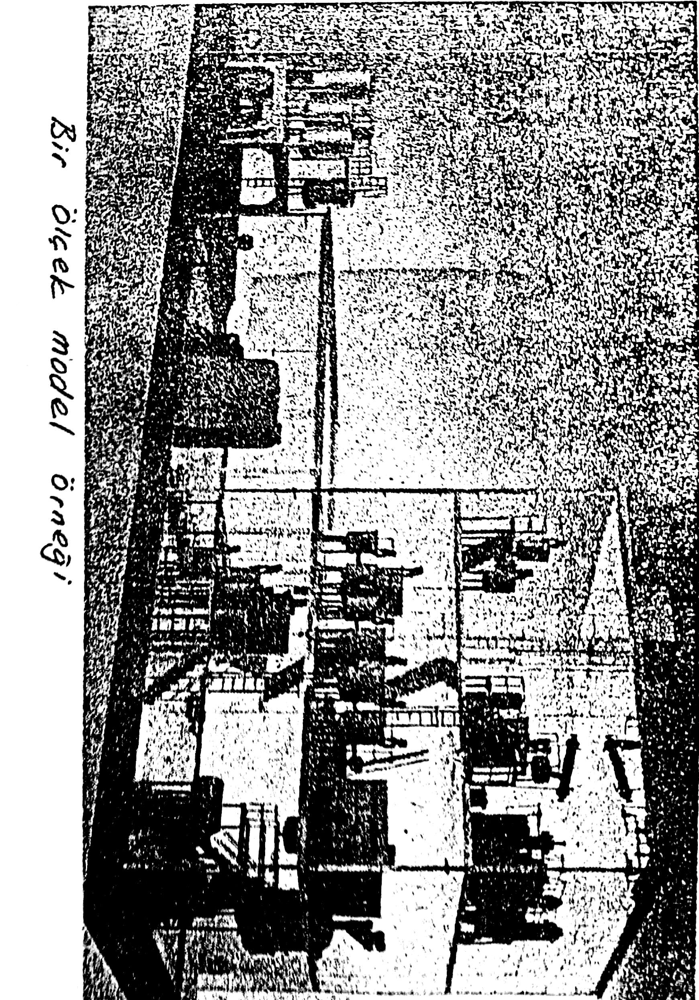

END312 Tesis Planlama ve Yerleşimi

<!-- Slide number: 109 -->
# Gelecek Ders

Malzeme Taşıma-Material handling

END312 Tesis Planlama ve Yerleşimi