<!-- Slide number: 1 -->
# Yerleşim Tasarımı I
Layout design I.
Dr.Öğr.Üyesi Gökçe KILIÇKAYA ÇAKMAK

END303 TESİS PLANLAMA VE YERLEŞİM
1

<!-- Slide number: 2 -->
# Ders Planı
Bölüm 6
Temel Yerleşim Tipleri (Basic layout types)
Sistematik Yerleşim Planlama Prosedürü (Systematic layout planning procedure)
Bilgisayarlı Yerleşim Planlama (Computerized layout planning)
Algoritmaların Sınıflandırılması (Algorithm classification)
Yerleşimin Değerlendirilmesi (Evaluation of the layout)
Yerleşim Oluşturulması/Kurulması (Construction of the layout)

END303 TESİS PLANLAMA VE YERLEŞİM
2

<!-- Slide number: 3 -->
# Giriş
Layout; bahçe, kent, vb. yerlerin planlaması anlamına gelmektedir.
Tesis Yerleşimi (Facility Layout) ise;
Departmanların
İş merkezlerinin ve
Ekipmanların ve işlerin sistem boyunca hareketlerine göre düzenlenmesi demektir.
Tesis Yerleşimi bir işletme için üç açıdan önem arz eder:
Önemli miktarlarda para ve çaba gerektirir.
Uzun dönemli kararları içerir ki bunlardan geri dönüş (yapılan hataların giderilmesi) oldukça zordur.
İşlemler üzerinde maliyet ve performans açısından oldukça etki sahibidir.

END303 TESİS PLANLAMA VE YERLEŞİM
3

<!-- Slide number: 4 -->
# Tesis Yeri Düzenleme
Üretim ve Hizmet Sistemlerini oluşturan tüm faaliyetlerin fiziksel konumlara göre düzenlenmesi, eş güdülenmesi anlamına gelen iş yeri düzenleme (Tesis Yerleşim Düzeni) tesis planlamanın ikinci aşamasını oluşturur.
Endüstriyel işletmeler ve hizmet işletmeleri için iş yeri düzenlemeleri yapılır. Söz konusu olan  bir endüstriyel işletme ise yapılan düzenlemeye fabrika düzenleme de denir.

Banka
İmalat
Askeri Birlikler
Klasik Fabrika Yerleşimi
Ofis
AVM
Hastane
…
Okul
END303 TESİS PLANLAMA VE YERLEŞİM
4

<!-- Slide number: 5 -->
# Tesis Yeri Düzenleme
	Tesis yeri düzenleme, mamul ve hizmet üretiminde kullanılan işgücü, malzeme, makine ve teçhizat gibi fiziksel kaynakların istenen kapasite, kalite, maliyet ve ergonomik koşulları sağlayarak en verimli bir şekilde üretimin yapılacağı alan üzerine yerleştirilmesidir.
Bu problemin sınırlarını belirlemek oldukça zordur.
Bazen yeni bir makinenin yerinin tespiti yapılırken bazen de yeni bir fabrikanın yerleşim planı tasarlanır.

END303 TESİS PLANLAMA VE YERLEŞİM
5

<!-- Slide number: 6 -->
# Tesis Yeri Düzenleme Nedenleri
Aşağıdaki sebeplerden dolayı ihtiyaç duyulabilir:
Yeni bir tesis kurulması,
Yeni bir alana veya binaya taşınılması,
Yeni ürün tasarımları veya mevcut ürünlerdeki tasarım ve imalat yöntem değişiklikleri, teknolojik yenilemeler,
Bazı ürün üretimlerinden vazgeçilmesi,
Bir ürüne olan talebin artması veya azalması,
Mevcut makinelerin satılması, kiralanması veya fason işletmelere verilmesi,
Malzeme akışındaki verimsizlikler, malzeme takibindeki aksamalar, tıkanıklıklar, darboğazlar,
Aşırı malzeme taşımalarının oluşması, maliyetlerdeki artışlar,
İş kazalarına karşı alınan iş güvenliği önlemleri.

END303 TESİS PLANLAMA VE YERLEŞİM
6

<!-- Slide number: 7 -->
# Tesis Yeri Düzenlemenin Amacı
 İnsan, malzeme ve sermaye gibi üretim ögelerinden en büyük verimi sağlamak,
 Düzgün bir yönde yerleştirme yapmak,
 Düzgün ve engelsiz bir taşıma yolu sağlamak,
 Geri yönde taşımalardan kaçınmak,
 İş gücünün sağlığı ve güvenliği üzerindeki riski azaltmak,
 Yardımcı tesislerin verimli ve ekonomik dağılımını sağlamak,
 Ekipman yatırımının azaltılması,
 Toplam üretim zamanının azaltılması,
 Mevcut alanın en yüksek düzeyde kullanımı,
 İşçi kolaylığı, güvenliği ve konforunun sağlanması,
 Malzeme taşıma maliyetinin en küçüklenmesi
END303 TESİS PLANLAMA VE YERLEŞİM
7

<!-- Slide number: 8 -->
# Tesis Yeri Düzenlemenin Yararları
1.	Toplam üretim süresinin en aza indirilmesi, beklemelerin ve geri dönüşlerin azaltılması.
2.	Malzeme taşımaların en aza indirilmesi, malzeme taşıma düzeninin geliştirilmesi
3.	Üretimin esnek bir yapıya kavuşturulması, üretim planındaki değişikliklere daha hızlı uyum gösterilmesi
4.	Çalışanlara çalışma kolaylığı, ergonomik koşullar ve iş kazalarına karşı iş güvenliği sağlanması,
5.	Gerekli sermaye miktarının azaltılması, alanlardan en verimli bir şekilde yararlanılması
6.	 Üretim planlama ve kontrolü faaliyetlerinin daha etkin ve verimli bir şekilde yapılabilir hale getirilmesi, stok alanları ve düzenlerinin belirlenmesi, makine yüklemelerinin dengeli hale getirilmesi, kapasite kullanım oranlarının yükseltilmesi
7.	 Temizlik, bakım-onarım, kalite kontrol vd. faaliyetlerin daha etkin ve verimli bir şekilde yapılabilir duruma getirilmesi
8.	 Geleceğe yönelik gelişmeler için gerekli önlemlerin alınması

END303 TESİS PLANLAMA VE YERLEŞİM
8

<!-- Slide number: 9 -->
# Tesis Yeri Düzenleme Türleri
 Yerleşim düzeni kararları;
 makinelerin (üretim alanlarında),
 ofislerin ve masaların (ofis düzenlemelerinde) veya,
 hizmet alanlarının (hastane veya AVM gibi yerlerde) en iyi şekilde yerleştirilmesini içerir.
 Etkin bir yerleşim düzeni;
 Malzemelerin,
 İnsanların ve
 Bilginin alan içerisinde veya alanlar arasında akışını kolaylaştırır.
- Bu amaca ulaştıracak çeşitli yaklaşımlar geliştirilmiştir.

END303 TESİS PLANLAMA VE YERLEŞİM
9

<!-- Slide number: 10 -->
# Tesis Yeri Düzenleme Türleri
 Ofis Yerleşim Düzeni (Office Layout)
 Mağaza Yerleşim Düzeni (Store Layout)
 Depo Yerleşim Düzeni (Depot/Warehouse Layout)
 Ürüne Göre (Ürün Odaklı) Yerleşim Düzeni (Product Oriented Layout)
 Prosese Göre (Süreç Odaklı) Yerleşim Düzeni (Process Oriented Layout)
 Sabit Konumlu (Proje Tipi) Yerleşim Düzeni (Fix-Position/Project Layout)
 Üretim Hücresi Yerleşim Düzeni (Work Cell Layout)

END303 TESİS PLANLAMA VE YERLEŞİM
10

<!-- Slide number: 11 -->
# Tesis Yeri Düzenleme Türleri
 Ofis Yerleşim Düzeni: Bilgi akışının sağlanması için çalışanları, ekipmanlarını ve alanları/ofisleri konumlandırır.
 Mağaza Yerleşim Düzeni: Teşhir alanını ayırır ve müşteri davranışlarını yanıtlar.
 Depo Yerleşim Düzeni: Depo alanı ve taşıma sistemleri arasındaki tercihi belirler.
 Ürüne Göre (Ürün Odaklı) Yerleşim Düzeni: Tekrarlı veya sürekli üretim için en iyi personel ve makine kullanımını sağlar. (Akış tipi Üretim, Montaj Hatları)
 Prosese Göre (Süreç Odaklı) Yerleşim Düzeni: Düşük hacimli, yüksek çeşitliliğe sahip üretimlerle ilgilenir. (Atölye Tipi veya Kesikli Üretim)
 Sabit Konumlu (Proje Tipi) Yerleşim Düzeni: Mekik, Uçak, Gemi bina gibi geniş büyük ve hacimli projelerin yerleşim düzeni gereksinimlerini belirler.
 Üretim Hücresi Yerleşim Düzeni: Tek bir ürün veya bir grup ürünün üretimine odaklanmak için makineleri ve ekipmanları düzenler.

END303 TESİS PLANLAMA VE YERLEŞİM
11

<!-- Slide number: 12 -->
# Tesis Yeri Düzenleme Statejileri
|  | Yerleşim Statejileri |  |  |
| --- | --- | --- | --- |
|  |  | AMAÇ | ÖRNEKLER |
| Ofis – Office |  | Sık iletişim kurması gereken çalışanların birbirine yakın yerleştirmek | Allstate Insurance Microsoft Corp. |
| Mağaza- Store/Retail |  | Yüksek Marjlı ürünleri müşteriye sergilemek | Kroger’s Supermarket Walgreen’s Bloomingdale’s |
| Depo- Warehouse (storage) |  | Düşük Maliyetle depolamayla düşük maliyetli taşıma sistemini dengelemek | Federal-Mogul’s warehouse The Gap’s distribution center |
| Proje - Project (fixed position) |  | Malzemeleri tesis etrafında sınırlı saklama alanlarına kaydırmak | Ingall Ship Building Corp. Trump Plaza Pittsburgh Airport |
END303 TESİS PLANLAMA VE YERLEŞİM
12

<!-- Slide number: 13 -->
# Tesis Yeri Düzenleme Statejileri
|  | Yerleşim Statejileri |  |  |
| --- | --- | --- | --- |
|  |  | AMAÇ | ÖRNEKLER |
| Atölye Tipi - Job Shop (process oriented) |  | Herbir ürün çeşitli malzemelerin akışını yönetmek | Arnold Palmer Hospital Hard Rock Cafe Olive Garden |
| Üretim Hücresi - Work Cell (product families) |  | Bir ürün ailesinin belirlenmesi, takımlar oluşturulması, takım üyelerine çapraz eğitimler verilmesi | Hallmark Cards Wheeled Coach Ambulances |
| Tekrarlı/Sürekli- Repetitive/ Continuous (product oriented) |  | Her bir iş istasyonundaki görev zamanına eşitlemek | Sony’s TV assembly line Toyota Scion |
END303 TESİS PLANLAMA VE YERLEŞİM
13

<!-- Slide number: 14 -->
# Temel Yerleşim Tipleri
Yerleşim Tasarımının Türleri:
Blok Yerleşim (Block layout)
Bölümlerin boyutları ve göreli yerlerini gösterir
Detaylı Yerleşim (Detailed layout)
Bölümler arasındaki tüm üretim ekipmanlarının, iş istasyonlarının ve depolama alanlarının kesin yerleşim yerini gösterir.
Bölümlerin Planlama Türleri
Sabit Ürün Yerleşimi - Fixed product layout
Ürün Yerleşimi - Product layout
Grup Yerleşimi - Group layout
Süreç Yerleşimi - Process layout

END303 TESİS PLANLAMA VE YERLEŞİM
14

<!-- Slide number: 15 -->
# İş Yeri Düzenleme Sistemleri
 Bir iş yeri düzenlemesinin tasarımına başlamadan önce, üretimin nasıl yapılacağına karar verilmiş olmalıdır. Üretim türü yerleşim şeklini belirleyen en önemli etkendir.
 Dört temel yerleşim tipi mevuttur:
 Ürün tipi (Product Layout)
 Tekrarlı üretimler için en iletken yapıyı sunar.
 Süreç tipi (Process Layout)
 Kesikli işlemlerde kullanılır.
 Sabit pozisyonlu yerleşim (Fixed-position Layout)
 Proje tipi üretimler için uygundur.
 Hücresel Üretim Düzenlemesi (Cell Layout)
 Bir de bu yerleşimlerin birlikte değerlendirildiği hibrit model

END303 TESİS PLANLAMA VE YERLEŞİM
15

<!-- Slide number: 16 -->
# Ürün Yerleşimi (Product Layout)
Ürün:
Standardize edilmiş
Büyük miktarda sabit talep
Yerleşim-Layout:
Ürünü üretmek için gereksinim duyulan tüm iş istasyonlarının birleştirilmesi

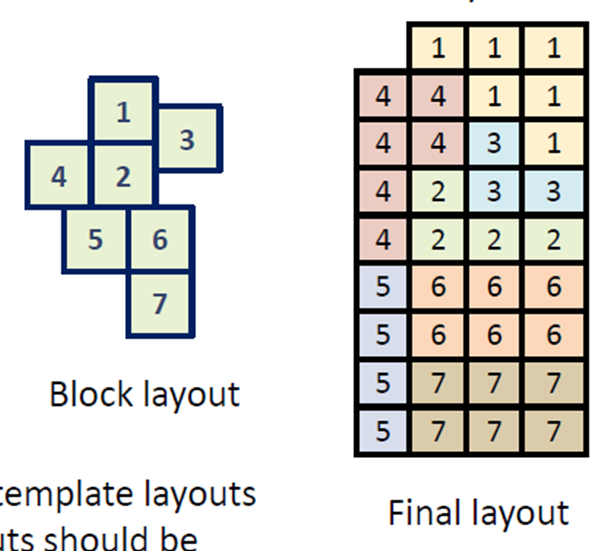

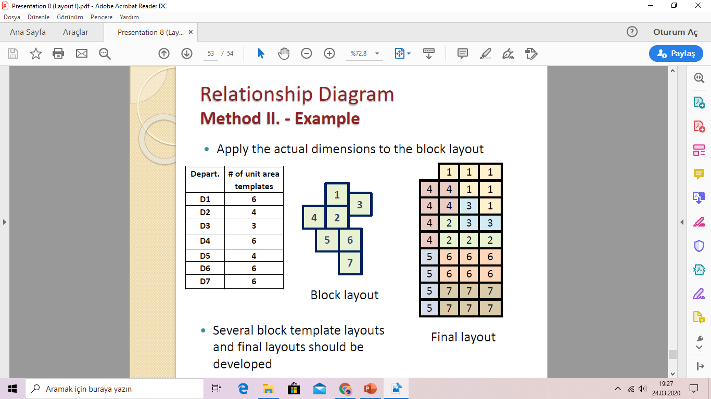

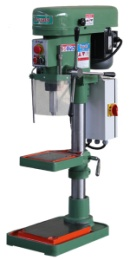
END303 TESİS PLANLAMA VE YERLEŞİM
16

<!-- Slide number: 17 -->
# Ürün Yerleşimi
Ürün Akışları, personel ve ekipman hareketlerinin sınırlı olduğu bir montaj hattı düşünülür.
Avantajları
Düzgünleştirme, basit, mantıklı ve yönlü akış
Yüksek Üretim Hızı
Birim maliyet başına düşük maliyet
Yüksek makine ve iş gücü kullanımı
Düşük Malzeme taşıma maliyetleri
Kalifiye olmayan işçilik
Düşük Süreç İçi Stoklar (Work-In-Process Inventory) (WIP)
Dezavantajlar
Yüksek makine kullanımı riskli
Süreç performansı darboğaz operasyonlara bağımlıdır.
Ürün tasarımı için yeterince esneklik olmayabilir, Hacim değişebilir.
Çalışanların motivasyonu azalır.
Devasa yatırım gereksinimi duyulur.

END303 TESİS PLANLAMA VE YERLEŞİM
17

<!-- Slide number: 18 -->
# Sabit Ürün Yerleşimi (Fixed Product Layout)
Ürün:
Fiziken Geniş ve büyüktür
Hareket ettirmek zor ve hantal
Düşük tek tük talep

Yerleşim Layout:
Bu tipte ürün belirli bir yerde sabittir ve üretim olanakları gerektiğinde buraya taşınır.

Örn:Gemi, Uçak, Köprü,..

END303 TESİS PLANLAMA VE YERLEŞİM
18

<!-- Slide number: 19 -->
# Sabit Konumlu (Proje Tipi) Yerleşim Düzeni
Sabit Konumlu Ürüne Göre Yerleştirmenin Yararları:
1.	Malzeme taşıma maliyetleri düşüktür.
2.	İş dağıtımı ve kontrolü nispeten kolaydır.
3.	Takım çalışmasının getirdiği avantajlara sahiptir.
Esnek bir üretim yapısı vardır.
Sabit Konumlu Ürüne Göre Yerleştirmenin Sakıncaları:
1.	Makine ve teçhizatın taşınma ve yerleştirme maliyeti vardır.
2.	Makine ve teçhizatın kullanım oranı düşüktür.
3.	Kalifiye işçiye gereksinim gösterir.

END303 TESİS PLANLAMA VE YERLEŞİM
19

<!-- Slide number: 20 -->
# Süreç Yerleşimi (Process Layout)
Ürün-Product:
Çok çeşitli Great variety
Kesikli Talep

Yerleşim - Layout:
Benzer tipteki makine ve gereçler aynı grupta ve bir bölüm içinde toplanır.
Benzer bölümler birleştirilir.

Örn:Hastane, Uçak bakım
Hangarları,..

END303 TESİS PLANLAMA VE YERLEŞİM
20

<!-- Slide number: 21 -->
# Süreç Yerleşimi

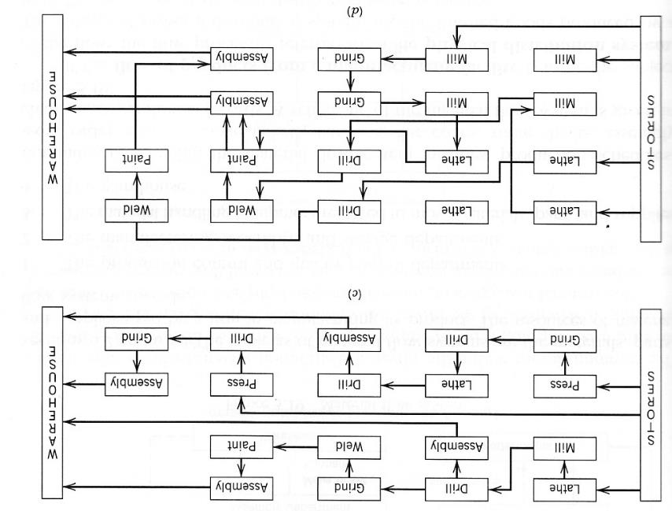

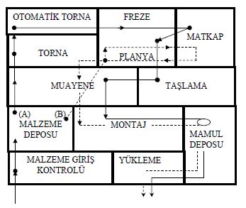

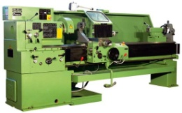

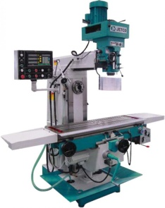

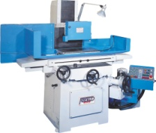

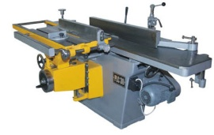

END303 TESİS PLANLAMA VE YERLEŞİM
21

<!-- Slide number: 22 -->
# Süreç Yerleşimi
Benzer veya aynı süreçler grup olarak bir araya getirilir.
Avantajları
Makine kullanımını arttırır
Personel ve makine tahsisinde esneklik
Makinelerin arızalanmasına karşı gürbüzdür
Tasarım ve üretim hacmi değişikliklerine karşı gürbüzdür
Özel denetimler yapılabilir.
Dezavantajları
Malzeme taşıma gereksinimini arttırır. Malzeme taşıma yavaş ve yetersizdir.
WIP arttırır.
Çok uzun üretim hattı
İşleri çizelgelemek zordur.
Yüksek kalifiye isçilik gerektirir.
Sürecin performansını analiz etmek zordur.
Ekipman kullanım oranları düşüktür.

END303 TESİS PLANLAMA VE YERLEŞİM
22

<!-- Slide number: 23 -->
# Süreç Yerleşiminin Sakıncaları
Prosese Göre Yerleştirmenin Sakıncaları:
1.	Yarı mamul stokları için fazla alan gereklidir.
2.	Makineler farklı işler işleyeceğinden hazırlık zamanları uzundur.
3.	Üretimin planlaması ve kontrolü karışıktır.
4.	Malzeme taşıma maliyetleri yüksektir.
5.	Nitelikli eleman kullanımı gerekir.
6.	Üretim hızı düşük, beklemeler fazladır.

END303 TESİS PLANLAMA VE YERLEŞİM
23

<!-- Slide number: 24 -->
# Süreç Yerleşimi-Process Layout
Süreç tipi yerleşim özellikle hizmet sektöründe oldukça yaygın kullanılır.
Hastaneler
Okullar
Bankalar
Hava Yolları
Kütüphaneler vb…

Bölüm
B
Bölüm
A
Bölüm
C
Bölüm
D

Bölüm
E
END303 TESİS PLANLAMA VE YERLEŞİM
24

<!-- Slide number: 25 -->
# Süreç Yerleşimi
Hasta A (Ayak Kırılması) AS triyajı, radyoloji, cerrahi müdahale, hasta yatağı, eczane ve en son fatura ödeme rotasını (Mavi ok) takip eder.
Hasta B (Ritim bozukluğu) AS triyajı, cerrahi müdahale, eczane, laboratuar, hasta yatağına ve en son fatura ödeme rotasını (Yeşil ok) takip eder.

ACİL SERVİS

Surgery
ER triage room
Emergency room admissions

Laboratories

Radiology
ER Beds
Pharmacy
Billing/exit
Patient A - broken leg

Patient B -	erratic heart pacemaker

END303 TESİS PLANLAMA VE YERLEŞİM
25

<!-- Slide number: 26 -->
# Süreç Yerleşimi
Süreç odaklı yerleşim düzeni tasarlarken en genel yaklaşım, departmanların veya iş merkezlerinin taşıma maliyetini minimize edecek şekilde düzenlenmesidir.
Yüksek ürün veya insan akışı olan bölümler yan yana yerleştirilmelidir.
Malzeme Taşıma Maliyetleri;
Iki Merkez arasında taşıma yapılacak insan veya yük miktarı : Belirli bir zaman periyodunda iki departman arasında taşınacak yük miktarı (veya insan veya bilgi)
İki Merkez arasında taşınacak insanlar ve yükler arasındaki uzaklıklar : Yükün (veya insanların) departmanlar arasındaki mesafenin bir fonksiyonu olarak kabul edilir.

END303 TESİS PLANLAMA VE YERLEŞİM
26

<!-- Slide number: 27 -->
# Süreç Yerleşimi
Amaç Fonksiyonu;

Burada;
n	=	 departman veya iş merkezlerinin toplam sayısı
i, j	=	bireysel departmanlar
Xij	=	departman i’den departman j’ye taşınan yük miktarı
Cij	=	bir yükü departman i’den departman j’ye taşıma maliyeti
END303 TESİS PLANLAMA VE YERLEŞİM
27

<!-- Slide number: 28 -->
# Örnek-1 (Süreç Yerleşimi)
Arrange six departments in a factory to minimize the material handling costs. Each department is 20 x 20 feet and the building is 60 feet long and 40 feet wide.
Construct a "from-to matrix"
Determine the space requirements
Develop an initial schematic diagram
Determine the cost of this layout
Try to improve the layout
Prepare a detailed plan

Birbirine komşu departmanlar ise taşıma maliyeti 1 $,

Birbirine komşu olmayan departmanlar arası taşıma maliyeti ise 2 $’dır.

6! = 720 farklı çözüm vardır.
END303 TESİS PLANLAMA VE YERLEŞİM
28

<!-- Slide number: 29 -->
# Örnek-1 (Süreç Yerleşimi)
Başlangıç-bitiş matrisi
Number of loads per week
	Department	Assembly	Painting	Machine	Receiving	Shipping	Testing
		(1)	(2)	Shop (3)	(4)	(5)	(6)
	Assembly (1)
	Painting (2)
	Machine Shop (3)
	Receiving (4)
	Shipping (5)
	Testing (6)

			50	100	0	0	20
				30	50	10	0
					20	0	100
						50	0
							0

END303 TESİS PLANLAMA VE YERLEŞİM
29

<!-- Slide number: 30 -->
# Örnek-1 (Süreç Yerleşimi)
Alan gereksinimlerini belirleyin
	Area A	Area B	Area C

	Area D	Area E	Area F

40'

60'

	Assembly	Painting	Machine Shop
	Department	Department	Department
	(1)	(2)	(3)

	Receiving	Shipping	Testing
	Department	Department	Department
	(4)	(5)	(6)
END303 TESİS PLANLAMA VE YERLEŞİM
30

<!-- Slide number: 31 -->

# Örnek-1 (Süreç Yerleşimi)
100

Assembly
(1)

Painting
(2)

Machine Shop (3)
50
30

20
20
10
50
100

Receiving
(4)

Shipping
(5)

Testing
(6)
50

Interdepartmental Flow Graph
İlk şematik diyagramı geliştirin
Maliyetini belirleyin
Cost 	=		$50	+	$200	+	$40			(1 and 2)		(1 and 3)		(1 and 6)
		+	$30	+	$50	+	$10			(2 and 3)		(2 and 4)		(2 and 5)
		+	$40	+	$100	+	$50			(3 and 4)		(3 and 6)		(4 and 5)
	= $570
Birbirine komşu departmanlar ise taşıma maliyeti 1 $,
Birbirine komşu olmayan departmanlar arası taşıma maliyeti ise 2 $’dır.  6! = 720 farklı çözüm vardır.
END303 TESİS PLANLAMA VE YERLEŞİM
31

<!-- Slide number: 32 -->

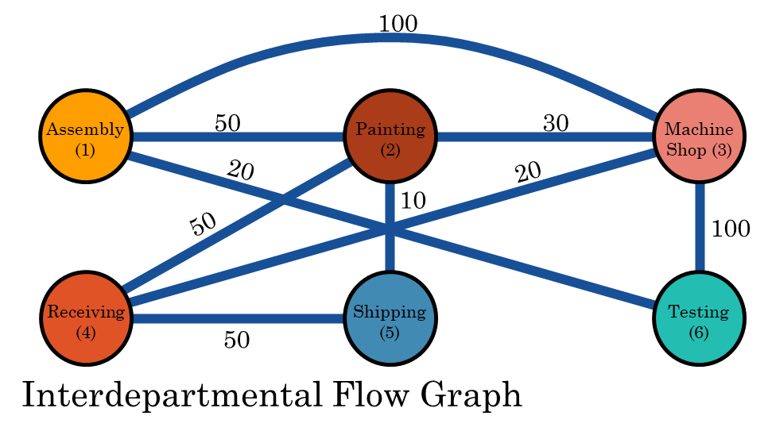
# Örnek-1 (Süreç Yerleşimi)
30

Painting
(2)

Assembly
(1)

Machine Shop (3)
50
100

10
20
20
100
50

Receiving
(4)

Shipping
(5)

Testing
(6)
50

Revised Interdepartmental Flow Graph
Cost 	=		$50	+	$100	+	$20			(1 and 2)		(1 and 3)		(1 and 6)
		+	$60	+	$50	+	$10			(2 and 3)		(2 and 4)		(2 and 5)
		+	$40	+	$100	+	$50			(3 and 4)		(3 and 6)		(4 and 5)
	= $480
Birbirine komşu departmanlar ise taşıma maliyeti 1 $,
Birbirine komşu olmayan departmanlar arası taşıma maliyeti ise 2 $’dır.  6! = 720 farklı çözüm vardır.
END303 TESİS PLANLAMA VE YERLEŞİM
32

<!-- Slide number: 33 -->
# Örnek-1 (Süreç Yerleşimi)
	Area A	Area B	Area C

	Area D	Area E	Area F

40'

60'

	 Painting 	 Assembly 	Machine Shop
	Department	Department	Department
	(2)	(1)	(3)

	Receiving	Shipping	Testing
	Department	Department	Department
	(4)	(5)	(6)
END303 TESİS PLANLAMA VE YERLEŞİM
33

<!-- Slide number: 34 -->
# Ürün Ailesi-Grup Yerleşimi Product Family -Group Layout
Ürün:
Benzer parça ailelerinin gruplandırılmasıyla yapılabilir.
Örn:Otomobil montaj hattı, Beyaz eşya montaj hattı,…
Yerleşim:
Ürün ailelerini üretmek için gereksinim duyulan tüm iş istasyonlarının birleştirilmesidir.

END303 TESİS PLANLAMA VE YERLEŞİM
34

<!-- Slide number: 35 -->
# Ürün Ailesi-Grup Yerleşimi
Ürün ailesi yerleşimleri ürün yerleşimi ve süreç yerleşiminin bir karışımı gibidir.
Avantajları
Ürün ve süreç yerleşiminin faydalı alanları birleştirilir
Yüksek makine kullanımı
Düzgünleştirilmiş akış hatları ve daha kısa mesafeler
Takım çalışması
Dezavantajları
Genel bir denetim gerektirmesi
Büyük iş gücü yeteneği ve kalifiye iş gücü gereksinimi
Üretim hücrelerinin dengelenmesi zordur ve dengelenmemiş hücreler WIP’ı arttırabilir.

END303 TESİS PLANLAMA VE YERLEŞİM
35

<!-- Slide number: 36 -->
# Yerleşim Tiplerinin Kıyaslanması

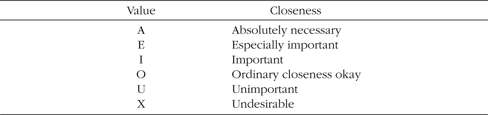
Üretim hacmi ve Ürün çeşidine karşılaştırma
END303 TESİS PLANLAMA VE YERLEŞİM
36

<!-- Slide number: 37 -->
# Sistematik Yerleşim Planlama (SLP)
 Richard Muther tarafından geliştirilen bir yaklaşım, uygulama alanında sayısız sorunların çözümlenmesinde başarılı olmuştur. Bu nedenle geniş kabul görmektedir. Bu yaklaşımı “Sistematik İş Yeri Düzeni Planlaması” veya “Sistematik Fabrika Düzenlemesi” olarak bilinir.
 Sistematik düzenlemeden önce fabrika sistemi oluşturulur.
 İlk olarak  üretim bölümleri bir arada ürün bölümü olarak ele alınır.
 Üretim bölümlerinin bir araya getirilmesinden sonra yardımcı bölümler eklenir. (Teslim alma, depolama, gönderme, kalite kontrol, mühendislik, bakım-onarım...)
 Muhasebe, satın alma gibi hizmet bölümleri eklenir.

END303 TESİS PLANLAMA VE YERLEŞİM
37

<!-- Slide number: 38 -->
# Sistematik Yerleşim Planlama (SLP)
Richard Muther’in Sistematik İş Yeri Düzenleme Planlama Algoritması
Girdi Verileri ve Faaliyetler
1. Malzemelerin Akışı
2.Faaliyet İlişkileri
Analiz
3.İlişki Diyagramları
4. Alan  Gereksinimleri
5.Varolan Alan
6.Alan İlişki Diyagramı ve Nicel Analiz
7.Değiş.Hususlar ve Öneriler
8. Kısıtlar
Arama
9. Alternatif Düzenlemeler
10.Değerlendirme

Seçme
SLP
END303 TESİS PLANLAMA VE YERLEŞİM
38

<!-- Slide number: 39 -->
# 1. Girdi Verileri ve Faaliyetler
Operasyon Süreç Şeması
Operation process chart
Malzeme Listesi
Bill of materials

END303 TESİS PLANLAMA VE YERLEŞİM
39

<!-- Slide number: 40 -->
# 2. Malzemelerin Akışı
Akış Süreç Şeması
Flow process chart
Geliş Gidiş Matrisi
From-to chart

END303 TESİS PLANLAMA VE YERLEŞİM
40

<!-- Slide number: 41 -->
# 3. Etkinlik İlişkileri

İlişki şeması,  yakınlık ilişki değerlerini kullanarak niteliksel akışları ölçer.

END303 TESİS PLANLAMA VE YERLEŞİM
41

<!-- Slide number: 42 -->
# 4. İlişki Diyagramı
İlişki diyagramı mekânsal olarak etkinlikleri pozisyonların (yerlerine) yerleştirir.
Etkinlik çiftleri arasındaki ilişkinin yakınlığını yansıtır.
Genellikle 2 boyutludur.

END303 TESİS PLANLAMA VE YERLEŞİM
42

<!-- Slide number: 43 -->
# 5. Alan gereksinimleri
Bölüm alanlarının gereksinimleri- Required departmental area

| Bölüm | Fonksiyon | Alan (ft2) |
| --- | --- | --- |
| D1 | Alma | 12.000 |
| D2 | Tornalama | 8.000 |
| D3 | Pres | 6.000 |
| D4 | Vida Makinesi | 12.000 |
| D5 | Montaj | 8.000 |
| D6 | Paketleme | 12.000 |
| D7 | Gönderme | 12.000 |
END303 TESİS PLANLAMA VE YERLEŞİM
43

<!-- Slide number: 44 -->
# 7. Alan İlişki Diyagramı
Alan İlişki Diyagramı, ilişki diyagramıyla alan ilişkilerini birleştirir.

END303 TESİS PLANLAMA VE YERLEŞİM
44

<!-- Slide number: 45 -->
# 10. Alternatif Yerleşimler- Layout alternatives
Bir alan ilişki diyagramının birkaç uygun alternatif blok yerleşimine block layouts dönüştürülmesini sağlar.
Mekanik bir süreç değildir.
Önsezilere, yargılara ve deneyim önemlidir.

END303 TESİS PLANLAMA VE YERLEŞİM
45

<!-- Slide number: 46 -->
# Bilgisayarlı Yerleşim Planlama
 Bilgisayarlar tesis yerleşim süreçlerindeki en büyük desteği sağlar.
 Tasarımcı, bilgiyi dönüştürmek, tutarlılığı sağlamak ve bunların bütünleştirilmesini sağlamak üzere çoklu tasarım verileriyle etkileşimde bulunmak zorundadır.
Blok yerleşim planı için karar destekçileri
 Bilgi gereksinimleri
 Algoritmaların Sınıflandırılması
 Yerleşim Yazılımları:
 “Klasik-Classical” yerleşim Programları
 Craft, Corelap, Aldep, ve Planet
 “Yenilikçi” yerleşim Programları
 M-Craft, LayOpt, FactoryPlan

END303 TESİS PLANLAMA VE YERLEŞİM
46

<!-- Slide number: 47 -->
# Bilgisayarlı Yerleşim Planlama
Yerleşim Planlamada bilgi
Nicel Bilgi
Örneğin Bir etkinlik için gereksinim duyulan alan, maliyet bilgisi, bölümler arasındaki uzaklıklar, iki etkinlik arasındaki toplam akış
Nitel Bilgi
Örneğin, Tasarımcının öncelikleri, etkinlik ilişki şeması
Grafik Bilgi
Blok planın çizimi
Bilgisayarlı yerleşim planını anahtar elemanı, bu üç bilginin elle çalıştırılması ve temsilidir.
Grafik Temsil çok fazla çetrefilli/zorlaştırıcı bir yoldur. Görsel olarak uygun bir yöntem, elle çalıştırmak için uygun değildir veya aksi.

END303 TESİS PLANLAMA VE YERLEŞİM
47

<!-- Slide number: 48 -->
# Grafik Temsil
“Noktalar ve çizgiler” temsil edilmesi, analiz için  uygun değildir.

END303 TESİS PLANLAMA VE YERLEŞİM
48

<!-- Slide number: 49 -->
# Grafik Temsil
Kesikli -Discrete
Milimetrik ölçüler ve hesaplama zorluğu
Sürekli- Continuous
Dikdörtgen binalar ve bölüm şekilleri

END303 TESİS PLANLAMA VE YERLEŞİM
49

<!-- Slide number: 50 -->
# Grafik Temsil
Çoğu prosedür ‘‘Birim kareler’’ yaklaşımını kullanır.
Her bir etkinlik için mevcut alan ve alan gereksinimleri, birim alanın tam sayılı bir katsayısı olarak  ifade edilir.
Birim kare Alanı yaklaşımı, bir sayı matrisi veya iki boyutlu dizi olarak temsil edilebilirler.
Kullanımı (örneğin komşulukların belirlenmesi) basittir. Fakat görsel olarak canlandırmak zordur.

END303 TESİS PLANLAMA VE YERLEŞİM
50

<!-- Slide number: 51 -->
# Grafik Temsil
Bölüm parçalara ayrılamaz
Herhangi bir bölüme atanan bir birim kare (grid), diğer birim karelerden ulaşılabilir olmak zorundadır.
Çevrelenmiş/kapanmış geçersizdir. (orta avlu-atrium)

END303 TESİS PLANLAMA VE YERLEŞİM
51

<!-- Slide number: 52 -->
# Yerleşim Tasarımı Algoritmik Yaklaşımlar
Veri Girişi
Nitel veri ilişkileri (İlişki Şeması) (Relationship chart)
Konular
Hazırlanması  uzun bir zaman alabilir
Nicel veri-Akış verisi (Geliş Gidiş Şeması) (From-to chart)
Amaç
Bilgisayar tarafından hazırlanabilir.
İkiside Both
3 Kavram-Konsept:
Yerleşim Geliştirme (Layout Improvement)
Başlangıç bir yerleşimle başlanır ve bir takım değişiklikler yapılarak geliştirilir.
Yerleşim Oluşturma (Layout Construction)
Karalamalardan bir yerleşim geliştirmek
Boyutları verilmiş
Boyutları olmayan ‘’Yeşil bir alan”
Yerleşim değerlendirme (Layout Evaluation)

END303 TESİS PLANLAMA VE YERLEŞİM
52

<!-- Slide number: 53 -->
# Yerleşim Değerlendirme
Algoritma iyi yerleşimi kötüsünden ayırmaya yarar.

Minimum toplam maliyet/seyahat/yükleme vb. :

Toplam ilişkiyi maksimize eden:

Toplam faydayı maksimize eden (Önceliklendirme Matrisi)

END303 TESİS PLANLAMA VE YERLEŞİM
53

<!-- Slide number: 54 -->
# Komşuluk Esaslı Puanlama
END303 TESİS PLANLAMA VE YERLEŞİM
54

<!-- Slide number: 55 -->
# Örnek-2 (Komşuluk Esaslı Puanlama)

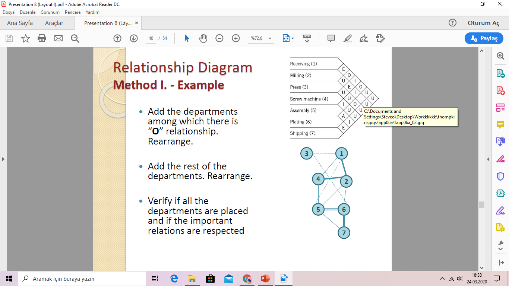
END303 TESİS PLANLAMA VE YERLEŞİM
55

<!-- Slide number: 56 -->
# Örnek-3 (Komşuluk Esaslı Puanlama)
Aşağıdaki yerleşimin planının yerleşim puanını (A=8, E=4, I=2, O=1, U=0 ve X=-8) değerlerini kullanarak bulunuz.

END303 TESİS PLANLAMA VE YERLEŞİM
56

<!-- Slide number: 57 -->
# Örnek-3 (Komşuluk Esaslı Puanlama)
Aşağıdaki yerleşimin planının yerleşim puanını (A=8, E=4, I=2, O=1, U=0 ve X=-8) değerlerini kullanarak bulunuz (24).

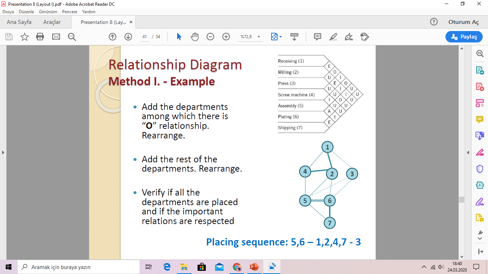
END303 TESİS PLANLAMA VE YERLEŞİM
57

<!-- Slide number: 58 -->
# Komşuluk Esaslı Puanlama
Etkinlik Değerlendirmesi- Efficiency rating: Alternatifleri karşılaştırdığımızda, her bir amaç fonksiyonunu aşağıdaki gibi normalize edebiliriz.

Komşuluk esaslı puanlama, farklı yerleşim alternatiflerini aynı ölçekte karşılaştırabilmek için normalize edilir. Bu formül, yerleşimin ne kadar iyi olduğunu 0–1 aralığında ifade eden bir etkinlik ölçüsüdür.
END303 TESİS PLANLAMA VE YERLEŞİM
58

<!-- Slide number: 59 -->
# Uzaklık Esaslı Puanlama Distance Based Scoring
END303 TESİS PLANLAMA VE YERLEŞİM
59

<!-- Slide number: 60 -->
# Örnek-4 (Uzaklık Esaslı Puanlama)

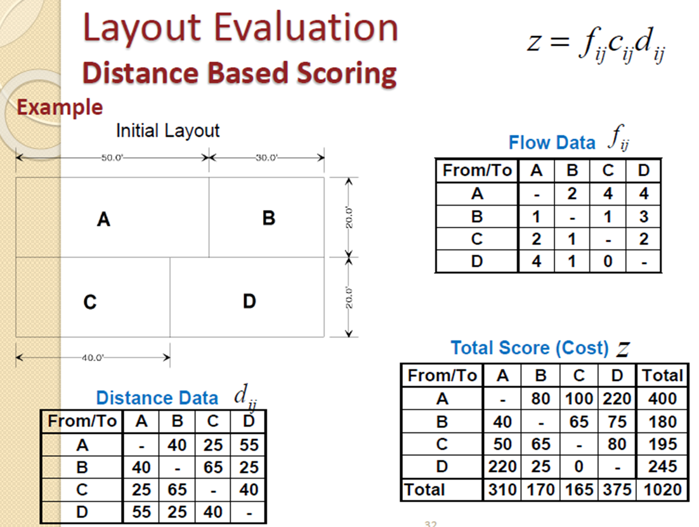

END303 TESİS PLANLAMA VE YERLEŞİM
60

<!-- Slide number: 61 -->
# Yerleşim Oluşturma (Layout construction)
Karalamalardan blok yerleşim geliştirilmesi
İhtiyaç olduğumuz şeyler;
İlişki Diyagramı- Relationship diagram
Alan gereksinimleri - Space requirements

END303 TESİS PLANLAMA VE YERLEŞİM
61

<!-- Slide number: 62 -->
# İlişki Diyagramının Oluşturulması
Bölümlerin mekânsal organizasyonunu için İlişki şemasının dönüşümü yapılır.

END303 TESİS PLANLAMA VE YERLEŞİM
62

<!-- Slide number: 63 -->
# İlişki Diyagramının Oluşturulması

END303 TESİS PLANLAMA VE YERLEŞİM
63

<!-- Slide number: 64 -->
# Metot I. İlişki Diyagramının Oluşturulması
“A” ilişkisine sahip olan bölümleri yerleştir.
“E” ilişkisine sahip olan bölümleri ekle ve yeniden düzenle.
“X” ilişkisine sahip olan bölümleri ekle ve yeniden düzenle.
“I” ilişkisine sahip olan bölümleri ekle ve yeniden düzenle.
O” ilişkisine sahip olan bölümleri ekle ve yeniden düzenle.
Geriye kalan bölümleri ekle ve yeniden düzenle.
Önem derecelerine göre tüm bölümlerin yerleştirilip yerleştirilmediğini kontrol edilir ve bölümler önem derecelerine göre sıralanır.

END303 TESİS PLANLAMA VE YERLEŞİM
64

<!-- Slide number: 65 -->
# Örnek-5 (Method I. İlişki Diyagramı)
Aşağıda ilişki şeması ve alanları verilen bölümlerin gerçek boyutlarına göre yerleşimini Metot-I’e göre belirleyiniz.

| Bölüm | Fonksiyon | Alan (ft2) |
| --- | --- | --- |
| D1 | Alma | 12.000 |
| D2 | Tornalama | 8.000 |
| D3 | Pres | 6.000 |
| D4 | Vida Makinesi | 12.000 |
| D5 | Montaj | 8.000 |
| D6 | Paketleme | 12.000 |
| D7 | Gönderme | 12.000 |
END303 TESİS PLANLAMA VE YERLEŞİM
65

<!-- Slide number: 66 -->
# Örnek-5 (Method I. İlişki Diyagramı)

“A” ilişkisine sahip olan bölümleri yerleştir.
“E” ilişkisine sahip olan bölümleri ekle ve yeniden düzenle.

END303 TESİS PLANLAMA VE YERLEŞİM
66

<!-- Slide number: 67 -->
# Örnek-5 (Method I. İlişki Diyagramı)

“X” ilişkisine sahip olan bölümleri ekle ve yeniden düzenle.
“I” ilişkisine sahip olan bölümleri ekle ve yeniden düzenle.

END303 TESİS PLANLAMA VE YERLEŞİM
67

<!-- Slide number: 68 -->
# Örnek-5 (Method I. İlişki Diyagramı)

O” ilişkisine sahip olan bölümleri ekle ve yeniden düzenle.
Geriye kalan bölümleri ekle ve yeniden düzenle.
Önem derecelerine göre tüm bölümlerin yerleştirilip yerleştirilmediğini kontrol edilir ve bölümler önem derecelerine göre sıralanır.

END303 TESİS PLANLAMA VE YERLEŞİM
68

<!-- Slide number: 69 -->
# Örnek-5 (Method I. İlişki Diyagramı)

O” ilişkisine sahip olan bölümleri ekle ve yeniden düzenle.
Geriye kalan bölümleri ekle ve yeniden düzenle.
Önem derecelerine göre tüm bölümlerin yerleştirilip yerleştirilmediğini kontrol edilir ve bölümler önem derecelerine göre sıralanır.

Yerleştirme Sırası-Placing sequence: 5,6 –1,2,4,7 -3
END303 TESİS PLANLAMA VE YERLEŞİM
69

<!-- Slide number: 70 -->
# Metot II. İlişki Diyagramı
Prosedür- Procedure:
Adım 1. Yerleşime ilk girecek bölümü seç
En büyük ‘‘A’’ değerine sahip bölüm seçilir.
Adım 2. Yerleşime ikinci girecek bölümü seç
İlk bölümle ‘‘A’’ ilişkisine sahip olan bölümü seç.
Adım 3. Yerleşime ikinci girecek bölümü seç
AA, AE, AI, A*, EE, EI, E*, II,I*
Adım 4. Yerleşime ikinci girecek bölümü seç
AAA, AAE, AAI, AA*, AEE, AEI
Adım n. Adım 3 ve Adım 4’te tarif edilen kurallara göre n bölüm yerleştirilir.
* yerine “O” veya “U” için

END303 TESİS PLANLAMA VE YERLEŞİM
70

<!-- Slide number: 71 -->
# Örnek-6 (Metot II. İlişki Diyagramı)
Bölümlerin gerçek boyutlarına göre yerleşimini belirleyiniz.

| Bölüm | Fonksiyon | Alan (ft2) |
| --- | --- | --- |
| D1 | Alma | 12.000 |
| D2 | Tornalama | 8.000 |
| D3 | Pres | 6.000 |
| D4 | Vida Makinesi | 12.000 |
| D5 | Montaj | 8.000 |
| D6 | Paketleme | 12.000 |
| D7 | Gönderme | 12.000 |
END303 TESİS PLANLAMA VE YERLEŞİM
71

<!-- Slide number: 72 -->
# Örnek-6 (Metot II. İlişki Diyagramı)
Etkinlik ilişki şeması ilişki diyagramı matrisine (relationship diagram worksheet) dönüştürülür.

| REL | D1 | D2 | D3 | D4 | D5 | D6 | D7 |
| --- | --- | --- | --- | --- | --- | --- | --- |
| A |  |  |  |  | 6 | 5 |  |
| E | 2 | 1-4 |  | 2 |  | 7 | 6 |
| I | 4 | 5-6 |  | 1-5 | 2-4-7 | 2 | 5 |
| O | 3-5 |  | 1-6 |  | 1 | 3 |  |
| U | 6-7 | 3-7 | 2-4-5-7 | 3-6-7 | 3 | 1-4 | 1-2-3-4 |
| X |  |  |  |  |  |  |  |
END303 TESİS PLANLAMA VE YERLEŞİM
72

<!-- Slide number: 73 -->
# Örnek-6 (Metot II. İlişki Diyagramı)
Adım 1. Yerleşime ilk girecek bölümü seç
En büyük ‘‘A’’ değerine sahip bölüm seçilir.
Eğer bir bağ var ise, En büyük E değerine sahip olan seçilir. Sonra sırasıyla I ve X
6 veya 5 => 6 ise seçilir. (E ilişkisine daha çok sahip olduğu için)

| REL | D1 | D2 | D3 | D4 | D5 | D6 | D7 |
| --- | --- | --- | --- | --- | --- | --- | --- |
| A |  |  |  |  | 6 | 5 |  |
| E | 2 | 1-4 |  | 2 |  | 7 | 6 |
| I | 4 | 5-6 |  | 1-5 | 2-4-7 | 2 | 5 |
| O | 3-5 |  | 1-6 |  | 1 | 3 |  |
| U | 6-7 | 3-7 | 2-4-5-7 | 3-6-7 | 3 | 1-4 | 1-2-3-4 |
| X |  |  |  |  |  |  |  |

END303 TESİS PLANLAMA VE YERLEŞİM
73

<!-- Slide number: 74 -->
# Örnek-6 (Metot II. İlişki Diyagramı)
Adım 2. Yerleşime ikinci girecek bölümü seç
İlk bölümle ‘‘A’’ ilişkisine sahip olan bölümü seç.
5 seçilir. (6 ile A ilişkisi olduğu için)

| REL | D1 | D2 | D3 | D4 | D5 | D6 | D7 |
| --- | --- | --- | --- | --- | --- | --- | --- |
| A |  |  |  |  | 6 | 5 |  |
| E | 2 | 1-4 |  | 2 |  | 7 | 6 |
| I | 4 | 5-6 |  | 1-5 | 2-4-7 | 2 | 5 |
| O | 3-5 |  | 1-6 |  | 1 | 3 |  |
| U | 6-7 | 3-7 | 2-4-5-7 | 3-6-7 | 3 | 1-4 | 1-2-3-4 |
| X |  |  |  |  |  |  |  |
END303 TESİS PLANLAMA VE YERLEŞİM
74

<!-- Slide number: 75 -->
# Örnek-6 (Metot II. İlişki Diyagramı)
Adım 3. Yerleşime üçüncü girecek bölümü seç
Mevcut yerleşim ile En yüksek AA, AE, AI, A*, EE, EI, E*, II,I* ilişkisine sahip olan bölüm seçilir.
7 seçilir. (EI)

| REL | D1 | D2 | D3 | D4 | D5 | D6 | D7 |
| --- | --- | --- | --- | --- | --- | --- | --- |
| A |  |  |  |  | 6 | 5 |  |
| E | 2 | 1-4 |  | 2 |  | 7 | 6 |
| I | 4 | 5-6 |  | 1-5 | 2-4-7 | 2 | 5 |
| O | 3-5 |  | 1-6 |  | 1 | 3 |  |
| U | 6-7 | 3-7 | 2-4-5-7 | 3-6-7 | 3 | 1-4 | 1-2-3-4 |
| X |  |  |  |  |  |  |  |
END303 TESİS PLANLAMA VE YERLEŞİM
75

<!-- Slide number: 76 -->
# Örnek-6 (Metot II. İlişki Diyagramı)
Adım 4. Yerleşime ikinci girecek bölümü seç
Mevcut yerleşim ile En yüksek AAA, AAE, AAI, AA*, AEE, AEI ilişkisine sahip olan bölüm seçilir.
2 is selected (II*) (4 has I**)

| REL | D1 | D2 | D3 | D4 | D5 | D6 | D7 |
| --- | --- | --- | --- | --- | --- | --- | --- |
| A |  |  |  |  | 6 | 5 |  |
| E | 2 | 1-4 |  | 2 |  | 7 | 6 |
| I | 4 | 5-6 |  | 1-5 | 2-4-7 | 2 | 5 |
| O | 3-5 |  | 1-6 |  | 1 | 3 |  |
| U | 6-7 | 3-7 | 2-4-5-7 | 3-6-7 | 3 | 1-4 | 1-2-3-4 |
| X |  |  |  |  |  |  |  |
END303 TESİS PLANLAMA VE YERLEŞİM
76

<!-- Slide number: 77 -->
# Örnek-6 (Metot II. İlişki Diyagramı)
Adım n. Adım 3 ve Adım 4’te tarif edilen kurallara göre n bölüm yerleştirilir.
4 seçilir. (EI**) (1 has E***)

| REL | D1 | D2 | D3 | D4 | D5 | D6 | D7 |
| --- | --- | --- | --- | --- | --- | --- | --- |
| A |  |  |  |  | 6 | 5 |  |
| E | 2 | 1-4 |  | 2 |  | 7 | 6 |
| I | 4 | 5-6 |  | 1-5 | 2-4-7 | 2 | 5 |
| O | 3-5 |  | 1-6 |  | 1 | 3 |  |
| U | 6-7 | 3-7 | 2-4-5-7 | 3-6-7 | 3 | 1-4 | 1-2-3-4 |
| X |  |  |  |  |  |  |  |
END303 TESİS PLANLAMA VE YERLEŞİM
77

<!-- Slide number: 78 -->
# Örnek-6 (Metot II. İlişki Diyagramı)
Adım n. Adım 3 ve Adım 4’te tarif edilen kurallara göre n bölüm yerleştirilir.
1 seçilir.  (EI***)

| REL | D1 | D2 | D3 | D4 | D5 | D6 | D7 |
| --- | --- | --- | --- | --- | --- | --- | --- |
| A |  |  |  |  | 6 | 5 |  |
| E | 2 | 1-4 |  | 2 |  | 7 | 6 |
| I | 4 | 5-6 |  | 1-5 | 2-4-7 | 2 | 5 |
| O | 3-5 |  | 1-6 |  | 1 | 3 |  |
| U | 6-7 | 3-7 | 2-4-5-7 | 3-6-7 | 3 | 1-4 | 1-2-3-4 |
| X |  |  |  |  |  |  |  |
END303 TESİS PLANLAMA VE YERLEŞİM
78

<!-- Slide number: 79 -->
# Örnek-6 (Metot II. İlişki Diyagramı)
Adım n. Adım 3 ve Adım 4’te tarif edilen kurallara göre n bölüm yerleştirilir.
3 seçilir.  (******)

| REL | D1 | D2 | D3 | D4 | D5 | D6 | D7 |
| --- | --- | --- | --- | --- | --- | --- | --- |
| A |  |  |  |  | 6 | 5 |  |
| E | 2 | 1-4 |  | 2 |  | 7 | 6 |
| I | 4 | 5-6 |  | 1-5 | 2-4-7 | 2 | 5 |
| O | 3-5 |  | 1-6 |  | 1 | 3 |  |
| U | 6-7 | 3-7 | 2-4-5-7 | 3-6-7 | 3 | 1-4 | 1-2-3-4 |
| X |  |  |  |  |  |  |  |
Placing sequence: 6-5-7-2-4-1-3
END303 TESİS PLANLAMA VE YERLEŞİM
79

<!-- Slide number: 80 -->
# Örnek-6 (Metot II. İlişki Diyagramı)
Birim kare şablonlarının sayısını belirle

| Bölüm | Fonksiyon | Alan (ft2) | Birim kare şablonlarının sayısı |
| --- | --- | --- | --- |
| D1 | Alma | 12.000 | 6 |
| D2 | Tornalama | 8.000 | 4 |
| D3 | Pres | 6.000 | 3 |
| D4 | Vida Makinesi | 12.000 | 6 |
| D5 | Montaj | 8.000 | 4 |
| D6 | Paketleme | 12.000 | 6 |
| D7 | Gönderme | 12.000 | 6 |
END303 TESİS PLANLAMA VE YERLEŞİM
80

<!-- Slide number: 81 -->
# Örnek-6 (Metot II. İlişki Diyagramı)
Blok yerleşimi için gerçek boyutlara uygula.

Çeşitli blok şablonu yerleşimler ve nihai yerleşim geliştirilir.

| Bölüm | Birim kare şablonlarının sayısı |
| --- | --- |
| D1 | 6 |
| D2 | 4 |
| D3 | 3 |
| D4 | 6 |
| D5 | 4 |
| D6 | 6 |
| D7 | 6 |

END303 TESİS PLANLAMA VE YERLEŞİM
81

<!-- Slide number: 82 -->
# Gelecek Ders
Yerleşim Oluşturma/Kurma Yöntemleri Layout construction methods

END303 TESİS PLANLAMA VE YERLEŞİM
82