<!-- Slide number: 1 -->
# Yerleşim Tasarımı II
Layout design II
Dr.Öğr.Üyesi Gökçe KILIÇKAYA ÇAKMAK

END303 TESİS PLANLAMA VE YERLEŞİM
1

<!-- Slide number: 2 -->
# Yerleşim Tasarımı II.
Bölüm 6
Yerleşim Düzeni Oluşturma-Layout generation
İkili Değişim Yöntemi-Pairwise exchange method
Grafik Esaslı Yöntem-Graph-based method
CRAFT

END303 TESİS PLANLAMA VE YERLEŞİM
2

<!-- Slide number: 3 -->
# Yerleşim Tasarımı Yöntemleri
Yerleşim Düzenin Değerlendirilmesi
Uzaklık Esaslı Puanlama (Distance-based scoring)
Komşuluk Esaslı Puanlama (Adjacency-based scoring)
Yerleşim Düzeni Oluşturma
Kurma Esaslı Algoritmalar (Construction algorithms)
Bir blok yerleşimi iteratif olarak bölümlerin ilave edilmesiyle oluşturulur.
İyileştirme Esaslı Algoritmalar (Improvement algorithms)
Bir başlangıç yerleşimin sürekli iyileştirilmesi

END303 TESİS PLANLAMA VE YERLEŞİM
3

<!-- Slide number: 4 -->
# Kurma Esaslı Algoritmalar
Kurma Esaslı (Construction) Algoritmalar
Başlangıç Çözümü bulur.
Kurma Esaslı algoritmalar, bir ön çözüme gerek duymaksızın sonuca ulaşabilmektedir.
İki temel işlev söz konusudur; SEÇME ve SIRALAMA.
Teknikler arasındaki farklılaşma bu iki temel işlevin değişik şekillerde yapılabilmesinden kaynaklanmaktadır.
 Seçim işlemi, bölümlerin hangi sırayla alınıp nereye yerleştirileceğini belirlemektedir.
İşlem Adımları
Henüz seçilmemiş bir faaliyeti seç
Bu faaliyeti henüz seçilmemiş boş olan ve sırası gelen bir yere yerleştir.
Faaliyetlerin hepsi atanmadıysa adım 1’e dön, aksi halde dur.

END303 TESİS PLANLAMA VE YERLEŞİM
4

<!-- Slide number: 5 -->
# Kurma Esaslı Algoritmalar
Yerleştirilecek bir etkinlik Seç.
Yerleşime seçilen etkinliği yerleştir.
Seçme kuralları-Selection rules
Önem derecelerini esas alan bölümler seçilir (ilk yerleştirilecek A, sonra E, daha sonra I, vd.)
Yerleştirilen bölüm ile en çok sayıda A (E, I, etc.) ilişkisine sahip bölümler seçilir.
İlk bölümün seçim prosedürüne eşitlik halinde eşitliği bozacak ilave yöntemler alınır.
Kullanıcılara Özel yerleştirme öncelikleri ve maliyetler göz önünde bulundurulabilir.

END303 TESİS PLANLAMA VE YERLEŞİM
5

<!-- Slide number: 6 -->
# Kurma Esaslı Algoritmalar
Kurma esaslı algoritmalarda her faaliyet karelerle temsil edilir.Bu kareler rastgele duramaz, iki temel kurala uymak zorundadır.
Komşuluk (Contiguity)
Bir faaliyetin alanı birden fazla kareden oluşuyorsa,bu kareler yan yana olmalıdır.

Bağlantılılık (Connectedness)
Bir faaliyetin tüm kareleri, tek parça bir alan oluşturmalı.

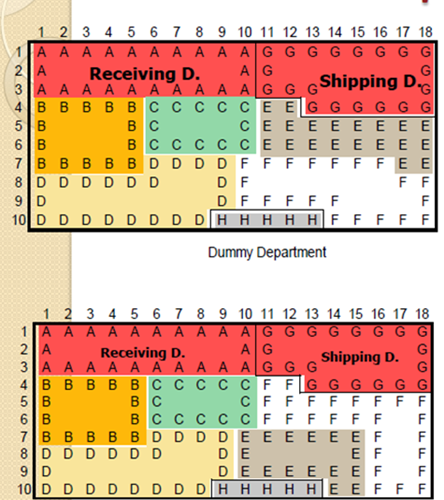

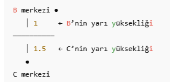
END303 TESİS PLANLAMA VE YERLEŞİM
6

<!-- Slide number: 7 -->
# Kurma Esaslı Algoritmalar
Yerleştirme Kuralları-Placement rules
Komşuluk/Yakınlık Kuralı-Contiguity Rule
Eğer bir etkinlik bir veya daha fazla birim kare ile temsil ediliyor ise, etkinliği temsil eden her bir birim kare, diğer etkinliklerin temsil edildiği birim karelerden en az birisiyle bir kenarı ortak paylaşmak zorundadır.

Bağlantılılık Kuralı- Connectedness Rule
Bir etkinliğin çevre uzunluğu, etkinliklerin temsil edildiği birim karelerin bazı kenarlarıyla tek bir kapalı çevrim oluşturmalıdır.

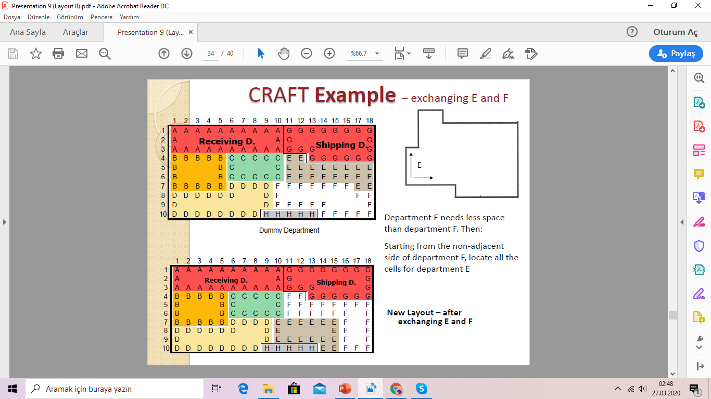

END303 TESİS PLANLAMA VE YERLEŞİM
7

<!-- Slide number: 8 -->
# Kurma Esaslı Algoritmalar
Yerleştirme Kuralları-Placement rules
Çevrelenmiş boşluk Kuralı- Enclosed Voids Rule
Etkinliğin şekli çevrelenmiş bir boşluk oluşturamaz.

Şekil Oranı Kuralı-Shape Ratio Rule
Uygun bir şeklin en uzun kenarı ile en geniş kenarı arasındaki oran belirlenen limitlerle sınırlandırılmış olmalıdır.

Köşe Sayma Kuralı- Corner Count Rule
Uygun bir şekil için köşelerin sayısı verilen maksimum değeri aşmamalıdır.

END303 TESİS PLANLAMA VE YERLEŞİM
8

<!-- Slide number: 9 -->
# İyileştirme Esaslı Algoritmalar
İyileştirme Esaslı Algoritmalar
 Mevcut yerleşim planının iyileştirilmesi amaçlanır.
Başlangıçta bir yerleşim planı verilmelidir.
Kurma esaslı algoritmaların çıktıları, geliştirme algoritmalarının girdileri olarak  kullanılırsa, daha da iyi sonuçlar elde edilebilir.

END303 TESİS PLANLAMA VE YERLEŞİM
9

<!-- Slide number: 10 -->
# İyileştirme Esaslı Algoritmalar
Bir blok plan içindeki bölümler “Hareket ettirilebilir-/Taşınabilir Move”
Eğer bölümlerin şekli sabit değil ise,
Değiştirilecek blok plan için çok fazla serbestlik derecesi  sahip bir yöntem tasarlanabilir.
Çoğu geliştirme algoritması sınırlı sayıda değişiklik yapılmasına izin vermektedir.
Temel Prosedür Basic procedure
Etkinlik çiftleri (veya üçüzleri) seçilir.
Yapılan değişikliklerin etkisini tahmin et.
Onları kendi aralarında değiştir.
Yeni yerleşimin daha iyi olduğunu kontrol et.
 Daha fazla olası iyileştirme sağlanamayıncaya kadar prosedürü tekrarla.

END303 TESİS PLANLAMA VE YERLEŞİM
10

<!-- Slide number: 11 -->
# Algoritmaların Sınıflandırılması

| Kurma Algoritmaları Construction algorithm | İyileştirme Algoritmaları Improvement algorithm |
| --- | --- |
| Grafik Tabanlı Yöntemler (Graph-based method) ALDEP CORELAP PLANET | İkili Yer değiştirme Yöntemleri (Pairwise exchange method) CRAFT MCCRAFT MULTIPLE |
| Blok Plan (BLOCPLAN) Mantık (LOGIC) Tam Sayılı KarışımProgramlama (Mixed integer programming) |  |
END303 TESİS PLANLAMA VE YERLEŞİM
11

<!-- Slide number: 12 -->
# Yerleşim Tasarımı Algortimaları
İKİLİ DEĞİŞİM Yöntemi (Pairwise Exchange Method)
GRAFİK Tabanlı Yöntem (Graph Based Method)
CRAFT Yöntemi (Computerized Relative Allocation of Facilities Technique)
MCRAFT Yöntemi (Micro CRAFT)
BLOK Yerleşim Yöntemi(Blockplan)
LOGIC  Yöntemi (Layout Optimization with Guillotine Induced Cuts)
MULTIPLE Yöntemi (MULTI Floor Plant Evaluation)
CORELAP Yöntemi (Computerized Relations Layout Planning)
ALDEP Yöntemi (Automated Layout Design Program)
WINQSB (Facility Location and Layout Modülü)

END303 TESİS PLANLAMA VE YERLEŞİM
12

<!-- Slide number: 13 -->
# Uzaklıkların Hesaplanması
Merkez, Kütle ağırlık merkezidir.

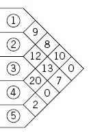

END303 TESİS PLANLAMA VE YERLEŞİM
13

<!-- Slide number: 14 -->
# Uzaklıkların Hesaplanması

END303 TESİS PLANLAMA VE YERLEŞİM
14

<!-- Slide number: 15 -->
# Uzaklıkların Hesaplanması
Merkezden Merkeze Dik Doğrusal Uzaklıklar
Merkezden Merkeze Öklid Uzaklığı

END303 TESİS PLANLAMA VE YERLEŞİM
15

<!-- Slide number: 16 -->
# Uzaklıkların Hesaplanması

A ve B arasındaki dik doğrusal mesafe :
D (AB) = 1.5 + 1 = 2.5
B ve C arasındaki dik doğrusal mesafe :
D (BC) = (5-1.5) + (1+1.5) = 3.5 + 2.5 = 6

END303 TESİS PLANLAMA VE YERLEŞİM
16

<!-- Slide number: 17 -->
# Yerleşim Tasarımı AlgoritmalarıİKİLİ YER DEĞİŞİM YÖNTEMİ (PAIRWISE EXCHANGE METHOD)
Dr.Öğrt.Üyesi Hv.Müh.Alb. Ömer ATLI

END303 TESİS PLANLAMA VE YERLEŞİM
17

<!-- Slide number: 18 -->
# İkili Yer Değişim Yöntemi
İyileştirme Esaslı bir yöntemdir.
Yerleşimi geliştirmek için
Amaç mesafe/uzaklık esaslıdır
Amaç, tesisteki tüm bölümler arasındaki taşınacak malzemelerin toplam maliyetini en küçüklemek veya faydanın en büyüklenmesi amaçlarından biri benimsenebilir.
Merkezden merkeze dik doğrusal uzaklıklar dikkate alınır.
Her adımda sadece iki bölümün yeri karşılıklı olarak değiştirilebilir.
Birbirleri ile yerleri değişecek bölümleri bulmak için, tüm ikili kombinasyonlar denenir ve en iyi amaç fonksiyonu değerine sahip olan değişim seçilir.
Bu değişim adımları, bir iyileşme elde edilemediğinde sona erer.
Nihai yerleşim, başlangıç yerleşim esas aldığından, optimal sonucuna ulaşamayabiliriz.

END303 TESİS PLANLAMA VE YERLEŞİM
18

<!-- Slide number: 19 -->
# İkili Yer Değişim Yöntemi
Prosedür- Procedure
Mevcut başlangıç yerleşim için toplam maliyeti hesapla.
Her bir iterasyonda ikili bölümlerin yerlerini değişimi yapılabilecek olası tüm ikili yer değişimlerini değerlendir.
Toplam maliyette en fazla azaltmayı sağlayan ikili değişim seçilir.
Bir değişim yapıldığında her keresinde uzaklık matrisini tekrar hesapla.
Elde edilen en düşük maliyet bir önceki iterasyonda elde edilen en düşük maliyetten daha iyi değil ise prosedürü sonlandır.

END303 TESİS PLANLAMA VE YERLEŞİM
19

<!-- Slide number: 20 -->
# Örnek -1 (İkili Yer Değişim Metodu)
Eşit büyüklüklere sahip 4 bölüm
Eşit büyüklükte bitişik dört bölüm , maliyet esaslı , birim taşıma maliyetleri aynı (Cij =1 alınabilir.)
Geliş Gidiş Şeması
Uzaklık Matrisi (Mevcut Yerleşime göre)
İkili Değişim Yöntemi (Pairwise Exchange Method) göre Nihai yerleşimi belirleyiniz.

END303 TESİS PLANLAMA VE YERLEŞİM
20

<!-- Slide number: 21 -->
# Örnek -1 (İkili Yer Değişim Metodu)
Yerleşim Planı
| 1 | 2 | 3 | 4 |
| --- | --- | --- | --- |
|  | 1 | 2 | 3 | 4 |
| --- | --- | --- | --- | --- |
| 1 | - | 10 | 15 | 20 |
| 2 |  | - | 10 | 5 |
| 3 |  |  | - | 5 |
| 4 |  |  |  | - |
|  | 1 | 2 | 3 | 4 |
| --- | --- | --- | --- | --- |
| 1 | - | 1 | 2 | 3 |
| 2 |  | - | 1 | 2 |
| 3 |  |  | - | 1 |
| 4 |  |  |  | - |
Bölümler Arası İş Akış Miktarı
Bölümler Arası Uzaklık Matrisi
Toplam Taşıma Maliyetinin En Küçüklenmesi
END303 TESİS PLANLAMA VE YERLEŞİM
21

<!-- Slide number: 22 -->
# Örnek -1 (İkili Yer Değişim Metodu)
Mevcut planda yapılabilen iki değişimler (Komşuluk Arama);
C(N;n) kombinasyonu ile C(4;2)=6 olarak hesaplanır. Buna göre (1-2, 1-3, 1-4, 2-3, 2-4 ve 3-4) ikili yer değişimleri yapılır ve toplam taşıma maliyetini en küçük kılan ikili yer değişim seçilir.

| 1 | 2 | 3 | 4 |
| --- | --- | --- | --- |
Mevcut Başlangıç Yerleşim Planı
| 2 | 1 | 3 | 4 |
| --- | --- | --- | --- |
| 1 | 3 | 2 | 4 |
| --- | --- | --- | --- |
TC2134
(1-2)
TC1324
(2-3)
| 1 | 4 | 3 | 2 |
| --- | --- | --- | --- |
| 3 | 2 | 1 | 4 |
| --- | --- | --- | --- |
TC3214
(1-3)
TC1432
(2-4)
| 1 | 2 | 4 | 3 |
| --- | --- | --- | --- |
| 4 | 2 | 3 | 1 |
| --- | --- | --- | --- |
TC1243
(3-4)
TC4231
(1-4)
END303 TESİS PLANLAMA VE YERLEŞİM
22

<!-- Slide number: 23 -->
# Örnek -1 (İkili Yer Değişim Metodu)
|  | 1 | 2 | 3 | 4 |
| --- | --- | --- | --- | --- |
| 1 | - | 1 | 2 | 3 |
| 2 |  | - | 1 | 2 |
| 3 |  |  | - | 1 |
| 4 |  |  |  | - |
|  | 1 | 2 | 3 | 4 |
| --- | --- | --- | --- | --- |
| 1 | - | 10 | 15 | 20 |
| 2 |  | - | 10 | 5 |
| 3 |  |  | - | 5 |
| 4 |  |  |  | - |
| 1-2 | 2 | 1 | 3 | 4 |
| --- | --- | --- | --- | --- |
| 2 | - | - | 2 | 3 |
| 1 | 1 | - | 1 | 2 |
| 3 |  |  | - | 1 |
| 4 |  |  |  | - |
| 1-2 | 2 | 1 | 3 | 4 |
| --- | --- | --- | --- | --- |
| 2 | - | - | 10 | 5 |
| 1 | 10 | - | 15 | 20 |
| 3 |  |  | - | 5 |
| 4 |  |  |  | - |
Uzaklık Matrisi
Akış Miktarı
Uzaklık Matrisi
Akış Miktarı
Önce Satır, sonra Sütunlar arasında ikili yer değişim yapılır.
| 2 | 1 | 3 | 4 |
| --- | --- | --- | --- |
TC2134
(1-2)
|  | 1 | 2 | 3 | 4 |
| --- | --- | --- | --- | --- |
| 1 | - | 1 | 1 | 2 |
| 2 |  | - | 2 | 3 |
| 3 |  |  | - | 1 |
| 4 |  |  |  | - |

Uzaklık Matrisi
1. İterasyon
END303 TESİS PLANLAMA VE YERLEŞİM
23

<!-- Slide number: 24 -->
# Örnek -1 (İkili Yer Değişim Metodu)
Toplam taşıma maliyeti en küçük kılan ikili yer değişim 1-3 seçilir.

Mevcut Yerleşim Planı
Yeni Yerleşim Planı
| 1 | 2 | 3 | 4 |
| --- | --- | --- | --- |
| 3 | 2 | 1 | 4 |
| --- | --- | --- | --- |
| 2 | 3 | 1 | 4 |
| --- | --- | --- | --- |
TC2314
(3-2)
| 3 | 1 | 2 | 4 |
| --- | --- | --- | --- |
TC3124
(2-1)
TC1234
(3-1)
| 1 | 2 | 3 | 4 |
| --- | --- | --- | --- |
| 3 | 4 | 1 | 2 |
| --- | --- | --- | --- |
TC3412
(2-4)
TC4213
(3-4)
TC3241
(1-4)
| 4 | 2 | 1 | 3 |
| --- | --- | --- | --- |
| 3 | 2 | 4 | 1 |
| --- | --- | --- | --- |
TC3124(1->2) =10(1)+15(1)+20(2)+10(2)+5(1)+5(3) =105
TC1234(1->3) =10(1)+15(2)+20(3)+10(1)+5(2)+5(1) =125
TC3241(1->4) =10(2)+15(3)+20(1)+10(1)+5(1)+5(2) =110
TC2314(2 ->3) =10(2)+15(1)+20(1)+10(1)+5(3)+5(2) = 90
TC3412(2 ->4) =10(1)+15(2)+20(1)+10(3)+5(2)+5(1) =105
TC4213(3->4) =10(1)+15(1)+20(2)+10(2)+5(1)+5(3) =105
2. İterasyon

END303 TESİS PLANLAMA VE YERLEŞİM
24

<!-- Slide number: 25 -->
# Örnek -1 (İkili Yer Değişim Metodu)
Toplam taşıma maliyeti en küçük kılan ikili yer değişim 2-3 seçilir.

Daha düşük maliyetli bir yerleşim olmadığından algoritma sonlandırılır.

Yeni Yerleşim Planı
| 2 | 3 | 1 | 4 |
| --- | --- | --- | --- |
TC2314
(3-2)
3. İterasyon
TC1324(1->2) =10(2)+15(1)+20(3)+10(1)+5(3)+5(1) =120
TC2134(1->3) =10(1)+15(1)+20(2)+10(2)+5(3)+5(1) =105
TC2341(1->4) =10(3)+15(2)+20(1)+10(1)+5(2)+5(1) =105
TC3214(2 ->3) =10(1)+15(2)+20(1)+10(1)+5(2)+5(3) = 95
TC4312(2 ->4) =10(1)+15(1)+20(2)+10(2)+5(3)+5(1) =105
TC2413(3->4) =10(2)+15(1)+20(1)+10(3)+5(1)+5(2) =100
END303 TESİS PLANLAMA VE YERLEŞİM
25

<!-- Slide number: 26 -->
# Örnek -1 (İkili Yer Değişim Metodu)
1-2, 1-3, 1-4, 2-3, 2-4, and 3-4. arasındaki değişikleri tekrarla.
2314 yerleşiminin toplam puanı 90 en iyi seçenektir.
Süreç en düşük toplam puandan daha da iyileşmeye sağlanıncaya kadar tekrar edilir.
Bu durumda elde edilen en iyi seçenek 2314 olarak bulunur ve
Toplam maliyet;

END303 TESİS PLANLAMA VE YERLEŞİM
26

<!-- Slide number: 27 -->
# İkili Yer Değişim Metodu
Bu yöntem optimali garanti etmez, sadece yerel optimumdur.
Prosedür tek bir alternatif üzerinde çevrim oluşturabilir.
Simetrik yerleşim oluşabilir.
Bölümler eş ölçülere sahip olduğu süre içinde ikili yer değişimler başarılı olabilir. Aksi durumda yöntem karmaşıklaşmaktadır.

END303 TESİS PLANLAMA VE YERLEŞİM
27

<!-- Slide number: 28 -->
# Yerleşim Tasarımı AlgoritmalarıGRAFİK TABANLI YÖNTEM(GRAPH BASE METHOD)
Dr.Öğr.Üyesi Gökçe KILIÇKAYA ÇAKMAK

END303 TESİS PLANLAMA VE YERLEŞİM
28

<!-- Slide number: 29 -->
# Grafik Tabanlı Yöntem
İlişki ve blok diyagramlarının oluşturulmasında yer bulmuş diğer bir yaklaşım da graph theory dir.
Bu süreci kullanmak amacıyla yakın (close) kelimesi bitişik (adjacent) anlamında kullanılır.
Buna göre eğer iki faaliyetin ortak sınırı var ise yakın olurlar, aksi halde olmazlar. Bu mantığa göre yakınlık derecelerinin sağlanıp sağlanmadığına bakılır.
Bu yaklaşımda faaliyetler; daire, düğüm veya köşe (vertex) olarak gösterilir ve isimlendirilir.
Faaliyetler, çizgi, bağ veya kenar denen bağ elemanları ile birbirlerine bağlanır.
Sonuç olarak kenar ve köşelerden oluşan bir ilişki diyagramı ortaya çıkar.

END303 TESİS PLANLAMA VE YERLEŞİM
29

<!-- Slide number: 30 -->
# Grafik Tabanlı Yöntem
Kurma esaslı bir algoritmadır.
Faaliyetler ya da bölümler düğüm olarak gösterilir.
Faaliyetler (bölümler) arası ilişkiler ikili bir ayırım yapılmasını sağlar: sağlanması gerekenler ve gerekmeyenler.
Sağlanması gereken komşuluklar ayrıtlarla gösterilir (Bitişik bölümler ayrıtlarla bağlanır).
Serim düzlemsel olarak yayılmamışsa (ayrıtlar kesişiyorsa) çözümü yoktur.
Serim düzlemsel ise, blok diyagramına geçilir.

END303 TESİS PLANLAMA VE YERLEŞİM
30

<!-- Slide number: 31 -->
# Grafik Tabanlı Yöntem
Kurma Esaslı yerleşimi için
Komşuluk esaslı Amaç
Blok yerleşimi için Bitişik grafikler:

END303 TESİS PLANLAMA VE YERLEŞİM
31

<!-- Slide number: 32 -->
# Grafik Tabanlı Yöntem
İlişkiler, alfabetik yakınlık oranları yerine ağırlık olarak verilir.
Puan/Skor, ağırlıkların atanması için oldukça duyarlıdır. Yerleşimin değeri, ağırlıklara duyarlıdır.
Bölüm şekilleri ve sınır uzunlukları dikkate alınmaz.
İlişki sadece bölümler bitişik olduğunda pozitif değerlere sahip olur.  Diğer ilişkiler bitişik değil ise göz ardı edilir.
Uzaklık ve komşuluktan başka ilişki göz önüne alınmaz.
Yakınlık skoru/puanı şunları açıklamaz:
Mesafe
Tüm ilişkiler (bitişik bölümler arasındakiler hariç)
Boyut Özellikleri
Bölümler arasındaki genel sınırların uzunluğunu
Serimler kesişemez (Düzlemsel-planarity)

END303 TESİS PLANLAMA VE YERLEŞİM
32

<!-- Slide number: 33 -->
# Grafik Tabanlı Yöntem
10 köşeli ve 19 kenarlı bir faaliyet ilişki grafiği
Bu grafikte köşeler bir nokta olarak gösterilebiliyor, hiçbir kenar diğer bir kenarı kesmiyor ise bu durumda düzlemsel (planarity) grafik denir.

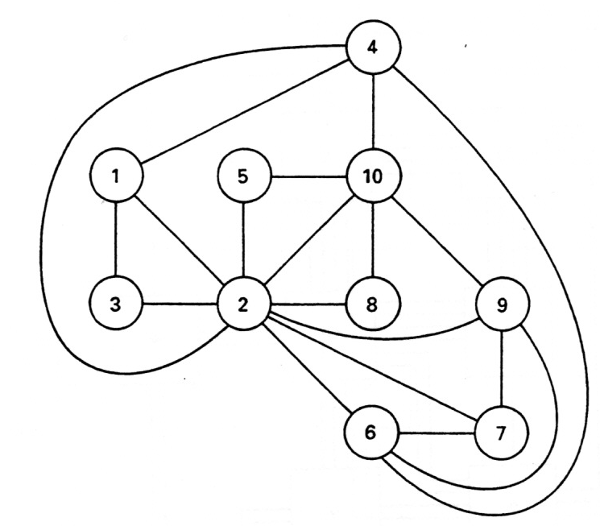

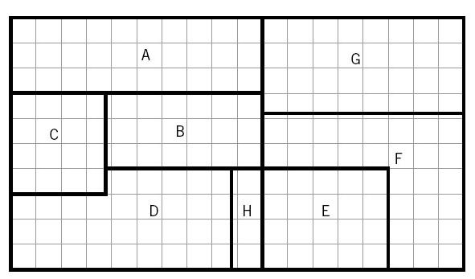
END303 TESİS PLANLAMA VE YERLEŞİM
33

<!-- Slide number: 34 -->
# Grafik Tabanlı Yöntem
Grafikte tanımlanan bölgelere yüz (faces) adı verilir. Ayrıtlarla çevrilmiş bölgeye YÜZ denir.
Eğer bir bölge sınırlanmamış dış bölgede kalıyorsa harici yüz adını alır (B) bölgesi.

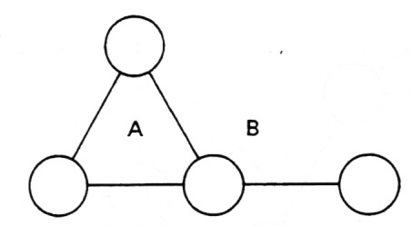

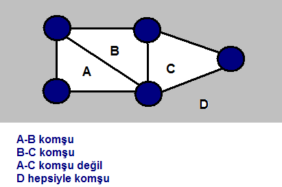
Eğer iki yüzün ortak bir sınırı var ise bu iki yüz bitişiktir. Yanda A ve B, B ve C, C ve D bitişiktir.

Ancak A ve C, A ve D, B ve D bitişik değildir.
END303 TESİS PLANLAMA VE YERLEŞİM
34

<!-- Slide number: 35 -->
# Grafik Tabanlı Yöntem
Prosedür
1. En büyük ağırlığa sahip olan bölüm çifti seçilir. Bağlantılar isteğe bağlı olarak koparılır.
2. Bu seçilen ikili bölümle ağırlıklarının toplamı en fazla olanı 3. bölüm olarak seç.
3. Bir yüz oluşturacak şekilde 4. bölümü belirle. (grafiğin sınır bölgelerinde)
4. Bir bitişik grafik belirle.
5. Uygun bir blok planla kur/oluştur.

END303 TESİS PLANLAMA VE YERLEŞİM
35

<!-- Slide number: 36 -->
# Örnek -1 (Grafik Tabanlı Yöntem)
 Aşağıda ilişki şema ve diyagramı verilen bir tesisin bölümleri arasındaki ağırlıklar verilmiştir. Grafik Tabanlı Yöntem kullanarak uygun bir blok diyagram geliştiriniz.

END303 TESİS PLANLAMA VE YERLEŞİM
36

<!-- Slide number: 37 -->
# Örnek -1 (Grafik Tabanlı Yöntem)

Adım 1. En ağır çifti seç 3 ve 4

Adım 2. Bunlara toplam ağırlığı en büyük olanı, bir yüz oluşturacak şekilde ekle. Son düğüme kadar bu adımı tekrarla. (2) seçilir.

20
3
4

END303 TESİS PLANLAMA VE YERLEŞİM
37

<!-- Slide number: 38 -->
# Örnek -1 (Grafik Tabanlı Yöntem)
Adım 3. Bu yüze eklendiğinde, en büyük ağırlığı veren dördüncü düğümü bir yüz oluşturacak şekilde ekle.
(1) seçilir. Üçgenin içine yerleştirilir.

END303 TESİS PLANLAMA VE YERLEŞİM
38

<!-- Slide number: 39 -->
# Örnek -1 (Grafik Tabanlı Yöntem)
Adım 4. Son düğümü ekle.Beşinci bölüm (5), hangi yüze?

END303 TESİS PLANLAMA VE YERLEŞİM
39

<!-- Slide number: 40 -->
# Örnek -1 (Grafik Tabanlı Yöntem)
Adım 5. Blok diyagramına geçiş?

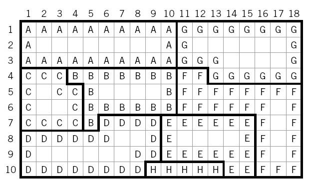

Blok diyagram
END303 TESİS PLANLAMA VE YERLEŞİM
40

<!-- Slide number: 41 -->
# Örnek -1 (Grafik Tabanlı Yöntem)
Adım 6 Blok diyagramına geçiş?
Bağlı bölümler bitişiktir.
Her bir duvar yalnızca bir bitişik sınır oluşturur.

END303 TESİS PLANLAMA VE YERLEŞİM
41

<!-- Slide number: 42 -->
# Grafik Tabanlı Yöntem
İyi yönler
Faaliyet ilişki çizelgesinden, doğrudan alan ilişki diyagramına geçilebilir.
Zayıf yönler
Bitişik tesislerin arasındaki ilişkiyi kuvvetli sayar.
Birden fazla çözümü vardır.
Bilgisayar uygulaması zordur.
Serim tekniği sadece bir ARAÇ’tır. Kullanabileceğimiz yerlerde bütün üstünlükleriyle kullanmalıyız.

END303 TESİS PLANLAMA VE YERLEŞİM
42

<!-- Slide number: 43 -->
# Yerleşim Tasarımı AlgoritmalarıCRAFT YÖNTEMİ (Computerized Relative Allocation of Facilities Technique)
Dr.Öğr.Üyesi Gökçe KILIÇKAYA ÇAKMAK

END303 TESİS PLANLAMA VE YERLEŞİM
43

<!-- Slide number: 44 -->
# Craft Yöntemi
Computerized Relative Allocation of Facilities Technique
Mevcut bir tesisin iyileştirilmesi için
Taşıma/Nakliye maliyetlerinin minimizayonu amaçlanır,
Taşıma Maliyeti  = Akış  * Birim Maliyet * Uzaklık

Varsayımları
Hareket maliyetleri donanım kullanımına bağlı değildir.
Hareket Maliyetleri hareket uzunluğuyla doğrusal olarak ilişkilidir.
Uzaklık ölçüsü olarak bölüm merkezleri arasındaki dik doğrusal uzaklıktır.
Veriler Geliş gidiş şemalarından alınır. (From-To chart)
Bölüm şekilleri dikdörtgensel olarak sınırlandırılmamıştır.
END303 TESİS PLANLAMA VE YERLEŞİM
44

<!-- Slide number: 45 -->
# Craft Yöntemi
Yöntem taşıma maliyetlerininin minimizasyonunu amaçlar. Taşıma maliyetleri, birim taşıma maliyetlerinin bölümler arası uzaklıklar ve iş akış hacmi ile çarpımı olarak tanımlanabilir.
 İş merkezi çiftlerinin yerleşim yerlerine dağıtımı sürekli değiştirilerek en iyi yerleşim düzeni bulunmaya çalışılır. Her değişimde taşıma maliyetleri hesaplanır ve minimum maliyet aranır.
 n kadar yerleşim yeri varsa, ikili değiştirmeler n (n-1)/2 kadar çift oluşur.
 Bu çiftlerden biri seçilerek işleme başlanır ve maksimum 2(n-2)! Kadar iterasyon yapılır.
 Yeri değiştirilmeyecek iş merkezleri varsa, belirlenmelidir.
 Program, minimum maliyetli yol yöntemi kavramına dayanır. Üç temel matris kullanılır. Uzaklık, İş akış miktarı ve birim taşıma maliyeti matrisleri (Birim taşıma maliyetleri çoğu kez 1 “birim” olarak kabul edilir.)

END303 TESİS PLANLAMA VE YERLEŞİM
45

<!-- Slide number: 46 -->
# Craft Yöntemi
 Sadece üretici merkezler arasında düzenleme yapmaya uygundur. Aralarında iş akışı olmayan birimlerin düzenlenmesinde kullanılmaz.
 Bir başlangıç düzenlemeye gerek vardır.
 İş merkezleri arası uzaklıklar düz doğru olarak alınmaktadır. Ancak çoğu hareketler koridorlar boyunca, açı yapacak şekildedir.

END303 TESİS PLANLAMA VE YERLEŞİM
46

<!-- Slide number: 47 -->
# Craft Yöntemi
CRAFT için gerekli girdiler
 Başlangıç yerleşim düzenlemesi planı
 Gezi diyagramı (Bölümler arasında birim zamandaki taşıma sayıları)
 Birim yükün birim mesafeye taşınma maliyetleri
 Düzenlemede yerleri değişmeyecek sabit bölümlerin yerleri ve sayısı
CRAFT çıktıları
 Yalnız ikili değişim
 Yalnız üçlü değişim
 İkili değişimi izleyen üçlü değişim
 Üçlü değişimi izleyen ikili değişim
 En iyi ikili ve üçlü değişim

END303 TESİS PLANLAMA VE YERLEŞİM
47

<!-- Slide number: 48 -->
# Craft Yöntemi
CRAFT’ın Özellikleri
Geliştirme esaslı bir algoritmadır.
Düzenleme alanı br2’lerden oluşur.
Tesisin dış yapısı kare ya da dikdörtgen olmalıdır. Değilse, kalan alanlar sabit alan olur.
Maliyet bilgisi, birim yük için birim uzaklık başına hesaplandığından, bu uzaklık biriminin yerleşim düzeni planındaki 1 br2’ nin bir kenarının uzunluk birimiyle aynı olması uygulamada büyük önem taşır. (Örn: Bir karenin kenarı 2 m. ise, maliyet matrisi elemanlarının birimi 2 m. başına (TL/adet) ya da (TL/ton) olmalıdır)
Bölümler arası akış verilirken br2’ ye göre verilmelidir.

END303 TESİS PLANLAMA VE YERLEŞİM
48

<!-- Slide number: 49 -->
# Craft Algoritması
CRAFT Algoritması
Adım 1. Bölümlerin ağırlık merkezlerini bul.
Adım 2. Bölümlerin ağırlık merkezleri arasındaki Dik doğrusal Uzaklıkları hesapla.
Adım 3. Yerleşimin Toplam taşıma maliyetini hesapla.
Adım 4. Ya Eşit alana sahip bölümleri ya da bir genel bir sınırı sahip olan bölümler arasındaki değişimleri düşünelim.
Adım 5. Her bir olası değişimin taşıma maliyetindeki değişim miktarını belirle.
Adım 6. Taşıma maliyetlerin en büyük düşüşü sağlayan bölüm değişiklikleri seç ve uygula.
Adım 7. Taşıma maliyetlerinde azaltacak Hiçbir ikili değişim yapılamayıncaya kadar yeni yerleşimler için prosedürü tekrar et
Adım 8. İkili-üçlü değişiklikleri dene. En iyisini yap.
Adım 9. Gerçek ağırlık merkezlerini hesapla.
Adım 10. Tekrarla (daha iyisi bulunmayıncaya kadar yeni seçenekler)

END303 TESİS PLANLAMA VE YERLEŞİM
49

<!-- Slide number: 50 -->
# Craft Yöntemi
 Adım adım İYİLEŞTİRME (2’li, 3’lü değişim)

 Bölümler arasında ikili ve/ veya üçlü yer değişimleri yapılır.
 Değişecek bölümler ya KOMŞU olmalı ya da alanları EŞİT bölümler olmalıdır.
 Bölümlerin alanları eşitse problem yok.
 Komşu ise ve alanlar da farklı ise:
 Ağırlık merkezleri değişebilir
 Bölünme olabilir

END303 TESİS PLANLAMA VE YERLEŞİM
50

<!-- Slide number: 51 -->
# Örnek -1 (Craft Yöntemi)
7 bölüme sahip bir tesis i ve j arasındaki tüm malzeme taşıma maliyetleri cij = 1’dir.  Birim büyüklükleri 20 X 20 olup toplam tesis alanı 72,000 m2’ dir.
Toplam gereksinim 70,000 m2 dir. (A)  malzeme giriş ve (G) gönderme bölümleri sabittir. Yerleşimi iyileştiriniz
Toplam mevcut alan > Toplam gereksinim duyulan alan: Böylece 2,000 m2’lik H bölümü yapay (boş) bırakılabilir.

END303 TESİS PLANLAMA VE YERLEŞİM
51

<!-- Slide number: 52 -->
# Örnek -1 (Craft Yöntemi)

Birim kare büyüklüğü = 20 x 20 ft
Başlangıç Yerleşim Planı
END303 TESİS PLANLAMA VE YERLEŞİM
52

<!-- Slide number: 53 -->
# Örnek -1 (Craft Yöntemi)
Başlangıç Yerleşim Planı

Başlangıç Yerleşim Planı
END303 TESİS PLANLAMA VE YERLEŞİM
53

<!-- Slide number: 54 -->
# Örnek -1 (Craft Yöntemi)
Adım 1. Bölümlerin ağırlık merkezlerini bul.
Adım 2. Bölümlerin ağırlık merkezleri arasındaki Dik doğrusal Uzaklıkları hesapla.
Adım 3. Yerleşimin Toplam taşıma maliyetini hesapla.
A ve B arasındaki uzaklık 6 birimdir. (Kırmızı çizgiyle gösterilmiştir.)

Birim kare büyüklüğü = 20 x 20 ft
Başlangıç Yerleşim Planı
Uzaklık Matrisi
Maliyet Matrisi

END303 TESİS PLANLAMA VE YERLEŞİM
54

<!-- Slide number: 55 -->
# Örnek -1 (Craft Yöntemi)
Hangi bölümler değiştirilmeli?
1.  E ve D bölümleri ile
2. F ve G bölümleri birbirlerine daha yakın bir konuma getirildiğinde toplam malzeme akışını azaltılmasına yardımcı olabilir.
3. E ve F değişimi
E ve F bölümleri ancak ve ancak ya aynı alana sahip ise veya genel bir komşuluğu varsa yapılabilir.

Maliyet Matrisi
END303 TESİS PLANLAMA VE YERLEŞİM
55

<!-- Slide number: 56 -->
# Örnek -1 (Craft Yöntemi)
Yer değişim için seçme kriterleri
Taşıma maliyetlerinde değişim miktarı tahmin edilir:
i ve j bölümlerini ele alırsak:
Her bir lokasyonun ağırlık merkezini Li ve Lj alınır.
İkili değişimin yapıldığı kabul edildiğinde, i yeni ağırlık merkezi Lj olur ve j yeni ağırlık merkezi de Li olacaktır.
Yeni tahmini ağırlık merkezlerini kullanarak toplam taşıma maliyetlerindeki değişim hesaplanır.
İki bölümün ağırlık merkezleri geçici olarak birbirleri arasında değiştirilir/takas edilir.
Maliyet azaltımının gerçek boyutu eksik veya fazla tahmin edilmiş olabilir.

END303 TESİS PLANLAMA VE YERLEŞİM
56

<!-- Slide number: 57 -->
# Örnek -1 (Craft Yöntemi)
Ağırlık merkezlerinin takas edilmesi

Centroid of E
Centroid of F
İkili değişim sonrası tahmini değişimi hesaplamak için:

Centroid of F
Centroid of E

END303 TESİS PLANLAMA VE YERLEŞİM
57

<!-- Slide number: 58 -->
# Örnek -1 (Craft Yöntemi)
Toplam taşıma maliyetindeki değişiminin hesaplanması

Uzaklık Matrisi

Başlangıç Maliyet Matrisi

Yeni Maliyet Matrisi

Yeni Uzaklık Matrisi
END303 TESİS PLANLAMA VE YERLEŞİM
58

<!-- Slide number: 59 -->
# Örnek -1 (Craft Yöntemi)

Başlangıç yerleşim planı ve ağırlık merkezleri
TM = 2.974 x 20 = 59.480 birim
E ve F bölümlerinin yer değişimi  sonucunda elde edilen plan
TM = 2.953 x 20 = 59.060 birim
END303 TESİS PLANLAMA VE YERLEŞİM
59

<!-- Slide number: 60 -->
# Örnek -1 (Craft Yöntemi)
İki bölümün yer değişimi- Exchanging two departments
Eğer iki bölümün alanları eşit boyutlarda ise, bir bölüm diğerinin şeklini alacaktır.
Eğer alanlar özdeş değil ise;
İki bölüme bitişik bir kutu çizilir. (bu bitişik şekil, yalnızca iki bölümün birim kutucuklarını içerir.
Küçük olan bölümün birim karelerinin sayısı belirlenir. Bu sayı k olsun.
Daha geniş olan bölümün komşu olmayan kenarlarındaki birim kareleri say. Bu birim kareler, şimdi  küçük bölümün yeni lokasyonu olacaktır. Küçük bölümün boşalttığı alan şimdi geniş bölümün bir parçası haline dönüşür.

END303 TESİS PLANLAMA VE YERLEŞİM
60

<!-- Slide number: 61 -->
# Örnek -1 (Craft Yöntemi)
İki bölümün yer değişimi

END303 TESİS PLANLAMA VE YERLEŞİM
61

<!-- Slide number: 62 -->
# Örnek -1 (Craft Yöntemi)
E ve F ikili yer değişimi

E bölümü F bölümünden daha az alana ihtiyaç duyar. Böylece: F bölümünün komşu olmayan kenarından başlanır. E bölümünün tüm hücreleri yerleştirilir.
E ve F’nin ikili değişimi sonrası Yeni
END303 TESİS PLANLAMA VE YERLEŞİM
62

<!-- Slide number: 63 -->
# Örnek -1 (Craft Yöntemi)

E ve F bölümlerinin yer değişimi  sonucunda elde edilen plan
TM = 2.953 x 20 = 59.060 birim
B ve C bölümlerinin yer değişimi  sonucunda elde edilen plan
TM = 2.953 x 20 = 56.670 birim elde edilen en iyi yerleşimdir.
END303 TESİS PLANLAMA VE YERLEŞİM
63

<!-- Slide number: 64 -->
# Örnek -1 (Craft Yöntemi)
B ve C yer değişiminden sonra oluşan nihai yerleşim

END303 TESİS PLANLAMA VE YERLEŞİM
64

<!-- Slide number: 65 -->
# Örnek -1 (Craft Yöntemi)

B ve C bölümlerinin yer değişimi  sonucunda elde edilen plan
TM = 2.953 x 20 = 56.670 birim elde edilen en iyi yerleşimdir.
Ufak düzeltmeler sonucu elde edilen CRAFT’ın son Yerleşimidir.
END303 TESİS PLANLAMA VE YERLEŞİM
65

<!-- Slide number: 66 -->
# CRAFT İkili değişim için komşuluğun yetersizliği
Alanda iki bölüm eşit değil ise, komşuluk gereklidir fakat bir ikili değişim için yeterli bir koşul değildir.

CRAFT bölüm 2 parçalanamıyor veya diğer bölümlerle yer değiştirme yapılamıyor ise 2 ve 4 bölümleri arasında ikili değişim yapılamaz.
END303 TESİS PLANLAMA VE YERLEŞİM
66

<!-- Slide number: 67 -->
# Craft Yöntemi +/-
Avantajları
 Sabit yerlerin tanımlanabilmesi
 Kısa bilgisayar zamanı gerektirmesi
 Karışık matematiksel hesaplamalar gerektirmemesi
 Maliyet ve tasarrufları göstermesi
 Şekillerin değiştirilebilmesi

Dezavantajları
 Olası değişikliklerin hepsi sınanmaz bu yüzden yerel eniyiçözüm sağlanır.
 Başlangıç yerleşim düzenini kendisi oluşturmaz.
 İstenmeyen yakınlıkları gözönünealmaz.
 Bölüm sayısı sınırlıdır.
 Bir faaliyete ayrılan alanda bölünmeler olabilir.
 Bölümler birbiriyle yer değiştirirken,
 aynı büyüklükte olmak,
 veya birbiriyle komşu olmak veya
 ortak başka bir bölümle sınırdaş olmak zorundadır.

END303 TESİS PLANLAMA VE YERLEŞİM
67

<!-- Slide number: 68 -->
# Craft Yöntemi – Artıları
CRAFT bölüm şekilleri yönünden esneklik sağlar.
Teorik olarak, CRAFT yalnızca dikdörtgen tesislere uygulanabilir. Buna karşın yapay genişletmelerin kullanımıyla, dikdörtgen olmayan şekiller içinde CRAFT algoritması uygulanabilir.
Yapay Bölümler-Dummy departments
Akış yoktur veya diğer bölümlerle etkileşimi yoktur.
Bellirli bir alan gerektirir.
Sabitlenebilir
Kullanmak için:
Dikdörtgen olmayan tesisler
Yerleşimdeki sabit alanlardır (engeller, faydasız alanlar, vd.)
Koridor yerleşimleri
Ekstra alan
Binanın düzensizliği
CRAFT kesin bir hassasiyetle başlangıç yerleşimi kapsar.

END303 TESİS PLANLAMA VE YERLEŞİM
68

<!-- Slide number: 69 -->
# Craft Yöntemi – Eksileri
Sadece Yerel optimal çözüm sağlar.
CRAFT, bir başlangıç yerleşimine bağlı nihai yerleşim edilecek bir yol odaklıdır.  Bu nedenle, farklı başlangıç yerleşimleri CRAFT algosirtmasına girdi olarak kullanılabilir.
CRAFT hem bölümlerin hem de tesisin kendi düzensiz şekilleri-irregular shapes için çalıştırılabilir.
Çoğu zaman, CRAFT çıktıları sunulmadan önce ufak tefek dokunuşlarla nihai hale getirilmek zorundadır.
Komşu olan bölümlerden Büyük olan bölüm kaydırılmaksızın, İki eşit olmayan alanın ikili yer değişimini yapmak daima mümkün değildir.

END303 TESİS PLANLAMA VE YERLEŞİM
69

<!-- Slide number: 70 -->
# Gelecek Ders
Yerleşim Oluşturma Algoritmaları- Layout generation
MCRAFT
BLOCPLAN
LOGIC

END303 TESİS PLANLAMA VE YERLEŞİM
70

<!-- Slide number: 71 -->
# ÇÖZÜMLÜ ÖRNEK SORULAR veÇALIŞMA SORULARI
Yerleşim Tasarımı Algoritmaları

END303 TESİS PLANLAMA VE YERLEŞİM
71

<!-- Slide number: 72 -->
# Çözümlü Örnek Soru-1
Aşağıdaki REL tablosunu ele alalım. İlave olarak 11.faaliyet dış bölüm olarak düşünelim. 11.faaliyetin 1, 5 ve 8 ile "A" ilişkisi olsun.

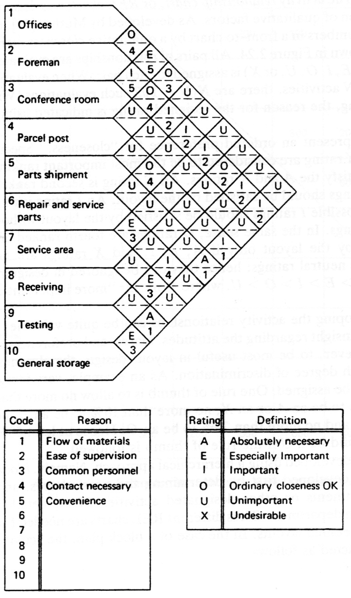

Sadece "A" ilişkilerini kurarsak

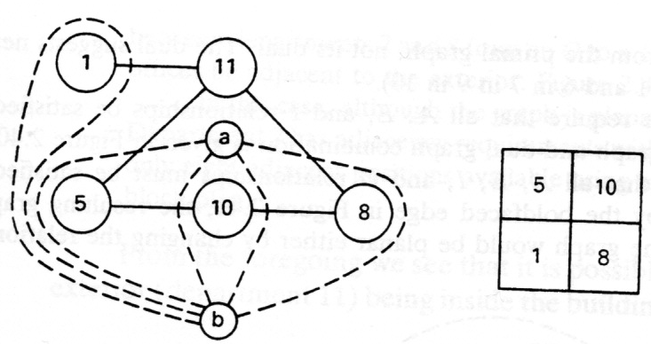
END303 TESİS PLANLAMA VE YERLEŞİM
72

<!-- Slide number: 73 -->
# Çözümlü Örnek Soru-2
5 adet iş merkezi bir atölye içinde yerleştirilecektir. İş merkezlerinin rastgele bir yerleşimine göre aralarındaki uzaklıklar ve iş akışları aşağıdaki gibidir.

|  | A | B | C | D | E |
| --- | --- | --- | --- | --- | --- |
| A | 0 | 5 | 6 | 7 | 8 |
| B | 5 | 0 | 7 | 8 | 10 |
| C | 6 | 7 | 0 | 6 | 5 |
| D | 7 | 8 | 6 | 0 | 7 |
| E | 8 | 10 | 5 | 7 | 0 |
|  | 1 | 2 | 3 | 4 | 5 |
| --- | --- | --- | --- | --- | --- |
| 1 | 0 | 50 | 30 | 40 | 10 |
| 2 | 20 | 0 | 25 | 5 | 45 |
| 3 | 40 | 45 | 0 | 30 | 15 |
| 4 | 60 | 5 | 20 | 0 | 35 |
| 5 | 55 | 3 | 3 | 15 | 0 |
Yerleşme Yerleri arası Uzaklık
(Birim Uzunluk)
İş Merkezleri arası İş Akış Miktarı
(Temel Alınan Zaman için Akış)
END303 TESİS PLANLAMA VE YERLEŞİM
73

<!-- Slide number: 74 -->
# Çözümlü Örnek Soru-2
 Birim yükün birim uzaklığa taşıma maliyeti her iş merkezi, atölye için eşit ise ve bu da 1 birim maliyet ise, toplam iş akış maliyeti, uzaklık ile iş akış matrislerinin karşılıklı hücre değerlerinin çarpımıyla bulunur.

1A, 2B, 3C, 4D ve 5E şeklindeki bir yerleşim düzenlemesi, 3.780 birim maliyet (pb)’lik bir toplam maliyet vermektedir. (Temel alınan zaman için)
|  | A | B | C | D | E | T |
| --- | --- | --- | --- | --- | --- | --- |
| 1 | 0 | 250 | 180 | 280 | 80 | 790 |
| 2 | 100 | 0 | 175 | 40 | 450 | 765 |
| 3 | 240 | 315 | 0 | 180 | 75 | 810 |
| 4 | 420 | 40 | 120 | 0 | 245 | 825 |
| 5 | 440 | 30 | 15 | 105 | 0 | 590 |
| T | 1.200 | 635 | 490 | 605 | 850 | 3.780 |
| 1A | 3C | 5E |
| --- | --- | --- |
| 2B |  |  |
|  | 4D |  |
|  |  |  |
END303 TESİS PLANLAMA VE YERLEŞİM
74

<!-- Slide number: 75 -->
# Çözümlü Örnek Soru-2
 1A, 2B, 3C, 4D, 5E düzenindeki yerleştirmeyi CRAFT ile geliştirelim.
 5 yer olduğuna göre n=5 olup, n(n-1)/2 adet ikili yerdeğiştirme seçeneği mevcuttur. 5*4/2=10 adet ikili yerdeğişim yapılabilir.

| D.N | 1 | 2 | 3 | 4 | 5 | İkili |
| --- | --- | --- | --- | --- | --- | --- |
| 6 | 1 | 4 | 3 | 2 | 5 | 2-4 |
| 7 | 1 | 5 | 3 | 4 | 2 | 2-5 |
| 8 | 1 | 2 | 4 | 3 | 5 | 3-4 |
| 9 | 1 | 2 | 5 | 4 | 3 | 3-5 |
| 10 | 1 | 2 | 3 | 5 | 4 | 4-5 |
| D.N | 1 | 2 | 3 | 4 | 5 | İkili |
| --- | --- | --- | --- | --- | --- | --- |
| 1 | 2 | 1 | 3 | 4 | 5 | 1-2 |
| 2 | 3 | 2 | 1 | 4 | 5 | 1-3 |
| 3 | 4 | 2 | 3 | 1 | 5 | 1-4 |
| 4 | 5 | 2 | 3 | 4 | 1 | 1-5 |
| 5 | 1 | 3 | 2 | 4 | 5 | 2-3 |
END303 TESİS PLANLAMA VE YERLEŞİM
75

<!-- Slide number: 76 -->
# Çözümlü Örnek Soru-2
| Yerleşme Yerleri Arası Uzaklık |  |  |  |  |  |  | İş Merkezleri Arası İş Akış Miktarı |  |  |  |  |  |  |  |  |  |  |  |  |  |
| --- | --- | --- | --- | --- | --- | --- | --- | --- | --- | --- | --- | --- | --- | --- | --- | --- | --- | --- | --- | --- |
|  | A | B | C | D | E |  | 1-2 | 2 | 1 | 3 | 4 | 5 |  | 1-2 | 2 | 1 | 3 | 4 | 5 | T |
| A | 0 | 5 | 6 | 7 | 8 |  | 2 | 0 | 20 | 25 | 5 | 45 |  | 2 | 0 | 100 | 150 | 35 | 360 | 645 |
| B | 5 | 0 | 7 | 8 | 10 |  | 1 | 50 | 0 | 30 | 40 | 10 |  | 1 | 250 | 0 | 210 | 320 | 100 | 880 |
| C | 6 | 7 | 0 | 6 | 5 |  | 3 | 45 | 40 | 0 | 30 | 15 |  | 3 | 270 | 280 | 0 | 180 | 75 | 805 |
| D | 7 | 8 | 6 | 0 | 7 |  | 4 | 5 | 60 | 20 | 0 | 35 |  | 4 | 35 | 480 | 120 | 0 | 245 | 880 |
| E | 8 | 10 | 5 | 7 | 0 |  | 5 | 3 | 55 | 3 | 15 | 0 |  | 5 | 24 | 550 | 15 | 105 | 0 | 694 |
|  |  |  |  |  |  |  |  |  |  |  |  |  |  | T | 579 | 1410 | 495 | 640 | 780 | 3.904 |
|  |  |  |  |  |  |  |  |  |  |  |  |  |  |  |  |  |  |  |  |  |
| Yerleşme Yerleri Arası Uzaklık |  |  |  |  |  |  | İş Merkezleri Arası İş Akış Miktarı |  |  |  |  |  |  |  |  |  |  |  |  |  |
|  | A | B | C | D | E |  | 1-3 | 3 | 2 | 1 | 4 | 5 |  | 1-3 | 3 | 2 | 1 | 4 | 5 | T |
| A | 0 | 5 | 6 | 7 | 8 |  | 3 | 0 | 45 | 40 | 30 | 15 |  | 3 | 0 | 225 | 240 | 210 | 120 | 795 |
| B | 5 | 0 | 7 | 8 | 10 |  | 2 | 25 | 0 | 20 | 5 | 45 |  | 2 | 125 | 0 | 140 | 40 | 450 | 755 |
| C | 6 | 7 | 0 | 6 | 5 |  | 1 | 30 | 50 | 0 | 40 | 10 |  | 1 | 180 | 350 | 0 | 240 | 50 | 820 |
| D | 7 | 8 | 6 | 0 | 7 |  | 4 | 20 | 5 | 60 | 0 | 35 |  | 4 | 140 | 40 | 360 | 0 | 245 | 785 |
| E | 8 | 10 | 5 | 7 | 0 |  | 5 | 3 | 3 | 55 | 15 | 0 |  | 5 | 24 | 30 | 275 | 105 | 0 | 434 |
|  |  |  |  |  |  |  |  |  |  |  |  |  |  | T | 469 | 645 | 1015 | 595 | 865 | 3.589 |
END303 TESİS PLANLAMA VE YERLEŞİM
76

<!-- Slide number: 77 -->
# Çözümlü Örnek Soru-2
| Yerleşme Yerleri Arası Uzaklık |  |  |  |  |  |  | İş Merkezleri Arası İş Akış Miktarı |  |  |  |  |  |  |  |  |  |  |  |  |  |
| --- | --- | --- | --- | --- | --- | --- | --- | --- | --- | --- | --- | --- | --- | --- | --- | --- | --- | --- | --- | --- |
|  | A | B | C | D | E |  | 1-4 | 4 | 2 | 3 | 1 | 5 |  | 1-4 | 4 | 2 | 3 | 1 | 5 | T |
| A | 0 | 5 | 6 | 7 | 8 |  | 4 | 0 | 5 | 20 | 60 | 35 |  | 4 | 0 | 25 | 120 | 420 | 280 | 845 |
| B | 5 | 0 | 7 | 8 | 10 |  | 2 | 5 | 0 | 25 | 20 | 45 |  | 2 | 25 | 0 | 175 | 160 | 450 | 810 |
| C | 6 | 7 | 0 | 6 | 5 |  | 3 | 30 | 45 | 0 | 40 | 15 |  | 3 | 180 | 315 | 0 | 240 | 75 | 810 |
| D | 7 | 8 | 6 | 0 | 7 |  | 1 | 40 | 50 | 30 | 0 | 10 |  | 1 | 280 | 400 | 180 | 0 | 70 | 930 |
| E | 8 | 10 | 5 | 7 | 0 |  | 5 | 15 | 3 | 3 | 55 | 0 |  | 5 | 120 | 30 | 15 | 385 | 0 | 550 |
|  |  |  |  |  |  |  |  |  |  |  |  |  |  | T | 605 | 770 | 490 | 1205 | 875 | 3.945 |
|  |  |  |  |  |  |  |  |  |  |  |  |  |  |  |  |  |  |  |  |  |
| Yerleşme Yerleri Arası Uzaklık |  |  |  |  |  |  | İş Merkezleri Arası İş Akış Miktarı |  |  |  |  |  |  |  |  |  |  |  |  |  |
|  | A | B | C | D | E |  | 1-5 | 5 | 2 | 3 | 4 | 1 |  | 1-5 | 5 | 2 | 3 | 4 | 1 | T |
| A | 0 | 5 | 6 | 7 | 8 |  | 5 | 0 | 3 | 3 | 15 | 55 |  | 5 | 0 | 15 | 18 | 105 | 440 | 578 |
| B | 5 | 0 | 7 | 8 | 10 |  | 2 | 45 | 0 | 25 | 5 | 20 |  | 2 | 225 | 0 | 175 | 40 | 200 | 640 |
| C | 6 | 7 | 0 | 6 | 5 |  | 3 | 15 | 45 | 0 | 30 | 40 |  | 3 | 90 | 315 | 0 | 180 | 200 | 785 |
| D | 7 | 8 | 6 | 0 | 7 |  | 4 | 35 | 5 | 20 | 0 | 60 |  | 4 | 245 | 40 | 120 | 0 | 420 | 825 |
| E | 8 | 10 | 5 | 7 | 0 |  | 1 | 10 | 50 | 30 | 40 | 0 |  | 1 | 80 | 500 | 150 | 280 | 0 | 1010 |
|  |  |  |  |  |  |  |  |  |  |  |  |  |  | T | 640 | 870 | 463 | 605 | 1260 | 3.838 |
END303 TESİS PLANLAMA VE YERLEŞİM
77

<!-- Slide number: 78 -->
# Çözümlü Örnek Soru-2
| Yerleşme Yerleri Arası Uzaklık |  |  |  |  |  |  | İş Merkezleri Arası İş Akış Miktarı |  |  |  |  |  |  |  |  |  |  |  |  |  |
| --- | --- | --- | --- | --- | --- | --- | --- | --- | --- | --- | --- | --- | --- | --- | --- | --- | --- | --- | --- | --- |
|  | A | B | C | D | E |  | 2-3 | 1 | 3 | 2 | 4 | 5 |  | 2-3 | 1 | 3 | 2 | 4 | 5 | T |
| A | 0 | 5 | 6 | 7 | 8 |  | 1 | 0 | 30 | 50 | 40 | 10 |  | 1 | 0 | 150 | 300 | 280 | 80 | 810 |
| B | 5 | 0 | 7 | 8 | 10 |  | 3 | 40 | 0 | 45 | 30 | 15 |  | 3 | 200 | 0 | 315 | 240 | 150 | 905 |
| C | 6 | 7 | 0 | 6 | 5 |  | 2 | 20 | 25 | 0 | 5 | 45 |  | 2 | 120 | 175 | 0 | 30 | 225 | 550 |
| D | 7 | 8 | 6 | 0 | 7 |  | 4 | 60 | 20 | 5 | 0 | 35 |  | 4 | 420 | 160 | 30 | 0 | 245 | 855 |
| E | 8 | 10 | 5 | 7 | 0 |  | 5 | 55 | 3 | 3 | 15 | 0 |  | 5 | 440 | 30 | 15 | 105 | 0 | 590 |
|  |  |  |  |  |  |  |  |  |  |  |  |  |  | T | 1180 | 515 | 660 | 655 | 700 | 3.710 |
|  |  |  |  |  |  |  |  |  |  |  |  |  |  |  |  |  |  |  |  |  |
| Yerleşme Yerleri Arası Uzaklık |  |  |  |  |  |  | İş Merkezleri Arası İş Akış Miktarı |  |  |  |  |  |  |  |  |  |  |  |  |  |
|  | A | B | C | D | E |  | 2-4 | 1 | 4 | 3 | 2 | 5 |  | 2-4 | 1 | 4 | 3 | 2 | 5 | T |
| A | 0 | 5 | 6 | 7 | 8 |  | 1 | 0 | 40 | 30 | 50 | 10 |  | 1 | 0 | 200 | 180 | 350 | 80 | 810 |
| B | 5 | 0 | 7 | 8 | 10 |  | 4 | 60 | 0 | 20 | 5 | 35 |  | 4 | 300 | 0 | 140 | 40 | 350 | 830 |
| C | 6 | 7 | 0 | 6 | 5 |  | 3 | 40 | 30 | 0 | 45 | 15 |  | 3 | 240 | 210 | 0 | 270 | 75 | 795 |
| D | 7 | 8 | 6 | 0 | 7 |  | 2 | 20 | 5 | 25 | 0 | 45 |  | 2 | 140 | 40 | 150 | 0 | 315 | 645 |
| E | 8 | 10 | 5 | 7 | 0 |  | 5 | 55 | 15 | 3 | 3 | 0 |  | 5 | 440 | 150 | 15 | 21 | 0 | 626 |
|  |  |  |  |  |  |  |  |  |  |  |  |  |  | T | 1120 | 600 | 485 | 681 | 820 | 3.706 |
END303 TESİS PLANLAMA VE YERLEŞİM
78

<!-- Slide number: 79 -->
# Çözümlü Örnek Soru-2
| Yerleşme Yerleri Arası Uzaklık |  |  |  |  |  |  | İş Merkezleri Arası İş Akış Miktarı |  |  |  |  |  |  |  |  |  |  |  |  |  |
| --- | --- | --- | --- | --- | --- | --- | --- | --- | --- | --- | --- | --- | --- | --- | --- | --- | --- | --- | --- | --- |
|  | A | B | C | D | E |  | 2-5 | 1 | 5 | 3 | 4 | 2 |  | 2-5 | 1 | 5 | 3 | 4 | 2 | T |
| A | 0 | 5 | 6 | 7 | 8 |  | 1 | 0 | 10 | 30 | 40 | 50 |  | 1 | 0 | 50 | 180 | 280 | 400 | 910 |
| B | 5 | 0 | 7 | 8 | 10 |  | 5 | 55 | 0 | 3 | 15 | 3 |  | 5 | 275 | 0 | 21 | 120 | 30 | 446 |
| C | 6 | 7 | 0 | 6 | 5 |  | 3 | 40 | 15 | 0 | 30 | 45 |  | 3 | 240 | 105 | 0 | 180 | 225 | 750 |
| D | 7 | 8 | 6 | 0 | 7 |  | 4 | 60 | 35 | 20 | 0 | 5 |  | 4 | 420 | 280 | 120 | 0 | 35 | 855 |
| E | 8 | 10 | 5 | 7 | 0 |  | 2 | 20 | 45 | 25 | 5 | 0 |  | 2 | 160 | 450 | 125 | 35 | 0 | 770 |
|  |  |  |  |  |  |  |  |  |  |  |  |  |  | T | 1095 | 885 | 446 | 615 | 690 | 3.731 |
|  |  |  |  |  |  |  |  |  |  |  |  |  |  |  |  |  |  |  |  |  |
| Yerleşme Yerleri Arası Uzaklık |  |  |  |  |  |  | İş Merkezleri Arası İş Akış Miktarı |  |  |  |  |  |  |  |  |  |  |  |  |  |
|  | A | B | C | D | E |  | 3-4 | 1 | 2 | 4 | 3 | 5 |  | 3-4 | 1 | 2 | 4 | 3 | 5 | T |
| A | 0 | 5 | 6 | 7 | 8 |  | 1 | 0 | 50 | 40 | 30 | 10 |  | 1 | 0 | 250 | 240 | 210 | 80 | 780 |
| B | 5 | 0 | 7 | 8 | 10 |  | 2 | 20 | 0 | 5 | 25 | 45 |  | 2 | 100 | 0 | 35 | 200 | 450 | 785 |
| C | 6 | 7 | 0 | 6 | 5 |  | 4 | 60 | 5 | 0 | 20 | 35 |  | 4 | 360 | 35 | 0 | 120 | 175 | 690 |
| D | 7 | 8 | 6 | 0 | 7 |  | 3 | 40 | 45 | 30 | 0 | 15 |  | 3 | 280 | 360 | 180 | 0 | 105 | 925 |
| E | 8 | 10 | 5 | 7 | 0 |  | 5 | 55 | 3 | 15 | 3 | 0 |  | 5 | 440 | 30 | 75 | 21 | 0 | 566 |
|  |  |  |  |  |  |  |  |  |  |  |  |  |  | T | 1180 | 675 | 530 | 551 | 810 | 3.746 |
END303 TESİS PLANLAMA VE YERLEŞİM
79

<!-- Slide number: 80 -->
# Çözümlü Örnek Soru-2
| Yerleşme Yerleri Arası Uzaklık |  |  |  |  |  |  | İş Merkezleri Arası İş Akış Miktarı |  |  |  |  |  |  |  |  |  |  |  |  |  |
| --- | --- | --- | --- | --- | --- | --- | --- | --- | --- | --- | --- | --- | --- | --- | --- | --- | --- | --- | --- | --- |
|  | A | B | C | D | E |  | 3-5 | 1 | 2 | 5 | 4 | 3 |  | 3-5 | 1 | 2 | 5 | 4 | 3 | T |
| A | 0 | 5 | 6 | 7 | 8 |  | 1 | 0 | 50 | 10 | 40 | 30 |  | 1 | 0 | 250 | 60 | 280 | 240 | 830 |
| B | 5 | 0 | 7 | 8 | 10 |  | 2 | 20 | 0 | 45 | 5 | 25 |  | 2 | 100 | 0 | 315 | 40 | 250 | 705 |
| C | 6 | 7 | 0 | 6 | 5 |  | 5 | 55 | 3 | 0 | 15 | 3 |  | 5 | 330 | 21 | 0 | 90 | 15 | 456 |
| D | 7 | 8 | 6 | 0 | 7 |  | 4 | 60 | 5 | 35 | 0 | 20 |  | 4 | 420 | 40 | 210 | 0 | 140 | 810 |
| E | 8 | 10 | 5 | 7 | 0 |  | 3 | 40 | 45 | 15 | 30 | 0 |  | 3 | 320 | 450 | 75 | 210 | 0 | 1055 |
|  |  |  |  |  |  |  |  |  |  |  |  |  |  | T | 1170 | 761 | 660 | 620 | 645 | 3.856 |
|  |  |  |  |  |  |  |  |  |  |  |  |  |  |  |  |  |  |  |  |  |
|  |  |  |  |  |  |  |  |  |  |  |  |  |  |  |  |  |  |  |  |  |
| Yerleşme Yerleri Arası Uzaklık |  |  |  |  |  |  | İş Merkezleri Arası İş Akış Miktarı |  |  |  |  |  |  |  |  |  |  |  |  |  |
|  | A | B | C | D | E |  | 4-5 | 1 | 2 | 3 | 5 | 4 |  | 4-5 | 1 | 2 | 3 | 5 | 4 | T |
| A | 0 | 5 | 6 | 7 | 8 |  | 1 | 0 | 50 | 30 | 10 | 40 |  | 1 | 0 | 250 | 180 | 70 | 320 | 820 |
| B | 5 | 0 | 7 | 8 | 10 |  | 2 | 20 | 0 | 25 | 45 | 5 |  | 2 | 100 | 0 | 175 | 360 | 50 | 685 |
| C | 6 | 7 | 0 | 6 | 5 |  | 3 | 40 | 45 | 0 | 15 | 30 |  | 3 | 240 | 315 | 0 | 90 | 150 | 795 |
| D | 7 | 8 | 6 | 0 | 7 |  | 5 | 55 | 3 | 3 | 0 | 15 |  | 5 | 385 | 24 | 18 | 0 | 105 | 532 |
| E | 8 | 10 | 5 | 7 | 0 |  | 4 | 60 | 5 | 20 | 35 | 0 |  | 4 | 480 | 50 | 100 | 245 | 0 | 875 |
|  |  |  |  |  |  |  |  |  |  |  |  |  |  | T | 1205 | 639 | 473 | 765 | 625 | 3.707 |
END303 TESİS PLANLAMA VE YERLEŞİM
80

<!-- Slide number: 81 -->
# Çözümlü Örnek Soru-2
3A, 2B, 1C, 4D, 5E düzenlemesi 2. İterasyonun başlangıç düzenlemesi olarak alınır.

| D.N | 1 | 2 | 3 | 4 | 5 | İkili | Birim Maliyet |  |
| --- | --- | --- | --- | --- | --- | --- | --- | --- |
| 0 | 1 | 2 | 3 | 4 | 5 | Başlangıç | 3.780 |  |
| 1 | 2 | 1 | 3 | 4 | 5 | 1-2 | 3.904 |  |
| 2 | 3 | 2 | 1 | 4 | 5 | 1-3 | 3.589 | MİN |
| 3 | 4 | 2 | 3 | 1 | 5 | 1-4 | 3.945 |  |
| 4 | 5 | 2 | 3 | 4 | 1 | 1-5 | 3.838 |  |
| 5 | 1 | 3 | 2 | 4 | 5 | 2-3 | 3.710 |  |
| 6 | 1 | 4 | 3 | 2 | 5 | 2-4 | 3.706 |  |
| 7 | 1 | 5 | 3 | 4 | 2 | 2-5 | 3.731 |  |
| 8 | 1 | 2 | 4 | 3 | 5 | 3-4 | 3.746 |  |
| 9 | 1 | 2 | 5 | 4 | 3 | 3-5 | 3.856 |  |
| 10 | 1 | 2 | 3 | 5 | 4 | 4-5 | 3.707 |  |
END303 TESİS PLANLAMA VE YERLEŞİM
81

<!-- Slide number: 82 -->
# Çözümlü Örnek Soru-2
3A, 2B, 1C, 4D, 5E düzenlemesi 2. İterasyonun başlangıç düzenlemesi olarak alınır.

| D.N | 1 | 2 | 3 | 4 | 5 | İkili | Birim Maliyet |  |
| --- | --- | --- | --- | --- | --- | --- | --- | --- |
| 0 | 1 | 2 | 3 | 4 | 5 | Başlangıç | 3.780 |  |
| 1 | 2 | 1 | 3 | 4 | 5 | 1-2 | 3.904 |  |
| 2 | 3 | 2 | 1 | 4 | 5 | 1-3 | 3.589 | MİN |
| 3 | 4 | 2 | 3 | 1 | 5 | 1-4 | 3.945 |  |
| 4 | 5 | 2 | 3 | 4 | 1 | 1-5 | 3.838 |  |
| 5 | 1 | 3 | 2 | 4 | 5 | 2-3 | 3.710 |  |
| 6 | 1 | 4 | 3 | 2 | 5 | 2-4 | 3.706 |  |
| 7 | 1 | 5 | 3 | 4 | 2 | 2-5 | 3.731 |  |
| 8 | 1 | 2 | 4 | 3 | 5 | 3-4 | 3.746 |  |
| 9 | 1 | 2 | 5 | 4 | 3 | 3-5 | 3.856 |  |
| 10 | 1 | 2 | 3 | 5 | 4 | 4-5 | 3.707 |  |
END303 TESİS PLANLAMA VE YERLEŞİM
82

<!-- Slide number: 83 -->
# Çözümlü Örnek Soru-2
2. İterasyonda da birinci iterasyondaki işlemler yapılarak yukarıdaki tablo sonuçları elde edilir.
Minimum Maliyet 3.310 birim maliyet bulunur. (3A,2B,1C,5D,4E)
Kesin çözüm 12. iterasyon sonucunda bulanabilecektir.

| D.N |  |  |  |  |  | İkili | Birim Maliyet |
| --- | --- | --- | --- | --- | --- | --- | --- |
| 0 | 3 | 2 | 1 | 4 | 5 | Başlangıç | 3.589 |
| 1 | 2 | 3 | 1 | 4 | 5 | 3-2 |  |
| 2 | 1 | 2 | 3 | 4 | 5 | 3-1 |  |
| 3 | 4 | 2 | 1 | 3 | 5 | 3-4 |  |
| 4 | 5 | 2 | 1 | 4 | 3 | 3-5 |  |
| 5 | 3 | 1 | 2 | 4 | 5 | 2-1 |  |
| 6 | 3 | 4 | 1 | 2 | 5 | 2-4 |  |
| 7 | 3 | 5 | 1 | 4 | 2 | 2-5 |  |
| 8 | 3 | 2 | 4 | 1 | 5 | 1-4 |  |
| 9 | 3 | 2 | 5 | 4 | 1 | 1-5 |  |
| 10 | 3 | 2 | 1 | 5 | 4 | 4-5 |  |
END303 TESİS PLANLAMA VE YERLEŞİM
83

<!-- Slide number: 84 -->
# Çözümlü Örnek Soru-3
Yedi bölümlü bir işletme ele alınsın ve 48*36=1728 metrekarelik bir alana yerleştirilmek istensin. İşletmenin bölümlerinin adları ve alan gereksinimlerinin aşağıdaki gibi olduğu varsayılsın.

| Bölüm | Alan Gereksinimi metrekare |
| --- | --- |
| A- Ambar | 288 |
| B- Torna Atölyesi | 144 |
| C- Freze Atölyesi | 144 |
| D- Kaynakhane | 288 |
| E- Montaj | 252 |
| F- Kontrol ve Ambalaj | 288 |
| G- Gönderme | 288 |
| Toplam | 1.728 |
|  | A | B | C | D | E | F | G |
| --- | --- | --- | --- | --- | --- | --- | --- |
| A | \* | 50 | 10 | 5 | 30 | 10 | - |
| B | - | \* | 40 | 20 | 15 | - | - |
| C | - | 15 | \* | - | 35 | - | - |
| D | - | 5 | - | \* | 10 | 10 | - |
| E | - | - | - | - | \* | 60 | 30 |
| F | - | 5 | - | - | - | \* | 75 |
Bölümler Arası Günlük Gezi Sayısı
END303 TESİS PLANLAMA VE YERLEŞİM
84

<!-- Slide number: 85 -->
# Çözümlü Örnek Soru-3
Birim alan 3*3=9 metre kare olduğu varsayılırsa

| Bölüm | Br.A. | Ağırlık Merkezi |
| --- | --- | --- |
| A- Ambar | 32 | (Xa,Ya) (4,2) |
| B- Torna Atölyesi | 16 | (Xb,Yb) (2,6) |
| C- Freze Atölyesi | 16 | (Xc,Yc) (6,6) |
| D- Kaynakhane | 32 | (Xd,Yd) (4,10) |
| E- Montaj | 28 | (Xe,Ye) (11,5,10) |
| F- Kontrol ve Ambalaj | 32 | (Xf,Yf) (12,6) |
| G- Gönderme | 32 | (Xg,Yg) (12,2) |
| H- Boş Alan | 4 |  |
|  | A | B | C | D | E | F | G |
| --- | --- | --- | --- | --- | --- | --- | --- |
| A | \* | 50 | 10 | 5 | 30 | 10 | - |
| B | - | \* | 40 | 20 | 15 | - | - |
| C | - | 15 | \* | - | 35 | - | - |
| D | - | 5 | - | \* | 10 | 10 | - |
| E | - | - | - | - | \* | 60 | 30 |
| F | - | 5 | - | - | - | \* | 75 |
Bölümler Arası Günlük Gezi Sayısı
| D |  | E | H |
| --- | --- | --- | --- |
| B | C | F |  |
| A |  | G |  |
END303 TESİS PLANLAMA VE YERLEŞİM
85

<!-- Slide number: 86 -->
# Çözümlü Örnek Soru-3
|  | A | B | C | D | E | F | G |
| --- | --- | --- | --- | --- | --- | --- | --- |
| A | \* | 50 | 10 | 5 | 30 | 10 | - |
| B | - | \* | 40 | 20 | 15 | - | - |
| C | - | 15 | \* | - | 35 | - | - |
| D | - | 5 | - | \* | 10 | 10 | - |
| E | - | - | - | - | \* | 60 | 30 |
| F | - | 5 | - | - | - | \* | 75 |
|  | A | B | C | D | E | F | G |
| --- | --- | --- | --- | --- | --- | --- | --- |
| A |  | 6 | 6 | 8 | 15,5 | 12 |  |
| B |  |  | 4 | 6 | 13,5 |  |  |
| C |  | 4 |  |  | 9,5 |  |  |
| D |  | 6 |  |  | 7,5 | 12 |  |
| E |  |  |  |  |  | 4,5 | 8,5 |
| F |  | 10 |  |  |  |  | 4 |
Bölümler Arası Zigzaglı Uzaklıklar
Bölümler Arası Günlük Gezi Sayısı
|  | B | C | D | E | F | G |  |
| --- | --- | --- | --- | --- | --- | --- | --- |
| A | 300 | 60 | 40 | 465 | 120 |  | 985 |
| B |  | 160 | 120 | 202,5 |  |  | 482,5 |
| C | 60 |  |  | 332,5 |  |  | 392,5 |
| D | 30 |  |  | 75 | 120 |  | 225 |
| E |  |  |  |  | 270 | 255 | 525 |
| F | 50 |  |  |  |  | 350 | 350 |
|  |  |  |  |  |  |  | 2.960 |
END303 TESİS PLANLAMA VE YERLEŞİM
86