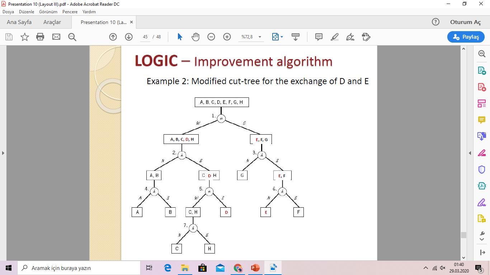
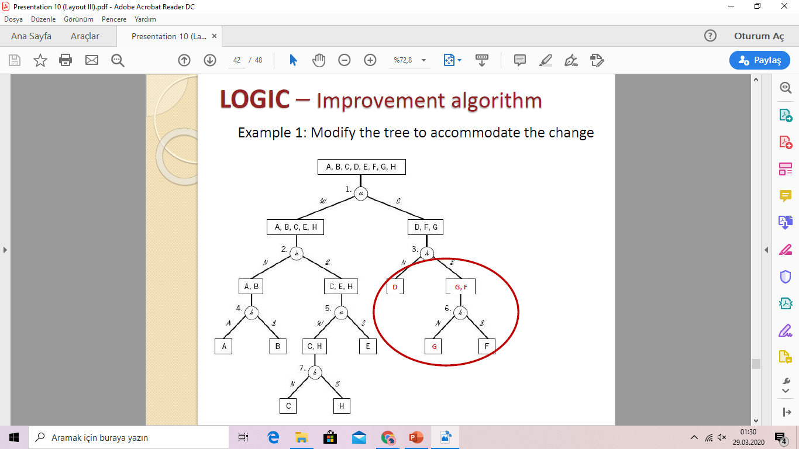

<!-- Slide number: 1 -->
# Yerleşim Tasarımı III.
Layout design III.
Dr.Öğr.Üyesi Gökçe KILIÇKAYA ÇAKMAK
END303 TESİS PLANLAMA VE YERLEŞİM
1

<!-- Slide number: 2 -->
# Yerleşim Tasarımı III
Bölüm 6
Yerleşim Üretme Layout generation
MCRAFT Yöntemi
Blok Plan Yöntemi BLOCPLAN
Mantık Yöntem LOGIC
END303 TESİS PLANLAMA VE YERLEŞİM
2

<!-- Slide number: 3 -->
# Yerleşim Tasarımı için Yöntemler
Yerleşim Düzeni Oluşturma- Layout generation
Kurucu Algoritmalar - Construction algorithms
Bir blok yerleşimi iteratif olarak bölümlerin ilave edilmesiyle oluşturulur.
Geliştirme Algoritmaları - Improvements algorithms
Bir başlangıç yerleşimin sürekli iyileştirilmesi

END303 TESİS PLANLAMA VE YERLEŞİM
3

<!-- Slide number: 4 -->
# Algoritmaların Sınıflandırılması
| Oluşturma Algoritmaları Construction algorithm | Geliştirme Algoritmaları Improvement algorithm |
| --- | --- |
| Grafik Tabanlı Yöntemler (Graph-based method) ALDEP CORELAP PLANET | İkili Yer değiştirme Yöntemleri (Pairwise exchange method) CRAFT MCCRAFT MULTIPLE |
| Blok Plan (BLOCPLAN) Mantık (LOGIC) Tam Sayılı Karışım Programlama (Mixed integer programming) |  |
END303 TESİS PLANLAMA VE YERLEŞİM
4

<!-- Slide number: 5 -->
# MCRAFT –Micro CRAFT Yöntemi
Bitişik olmayan ikili yer değişimlere olanak sağlayan CRAFT algoritmasından geliştirilmiş bir algoritmadır.
Eşit olmayan veya bitişik olmayan bölümler ikili değişim yapılacağı zaman diğer bölümler otomatik olarak yeri değiştirilir.
Yatay süpürme şekillerinde kullanılır.
Bölümleri yerleştirmek
İki bölüm arasında ikili değişim yapıldığı sırada bölümler hareket ettirmek için

END303 TESİS PLANLAMA VE YERLEŞİM
5

<!-- Slide number: 6 -->
# MCRAFT –Süpürme Paterni
Yerleşim, bölümlerin bir sırasına göre verilir.
Her bir iterasyonda, hücreler, sol üst köşeden başlanarak şekillendirilir.
Sıralamadaki ilk bölüm sol üst köşeye yerleştirilir.
İlk bölümün hemen sağındaki bir boşluk var ise, sıralamadaki ikinci bölüm bu boş alana yerleştirilir. Aksi durumda binadaki gelecek sıra geriye kalan bölümleri (kalan hücreler) veya sıradaki gelecek bölümü yerleştirmek için kullanılır.

END303 TESİS PLANLAMA VE YERLEŞİM
6

<!-- Slide number: 7 -->
# MCRAFT Algoritması
1. MCRAFT kullanıcının aşağıdaki gereksinimlerini tam olarak belirlenmesine ihtiyaç duyar.
Tesis boyutları (Dikdörtgen, EnxBoy)
Bantların sayısı
2. Bant genişliği belirlendikten sonra, MCRAFT, başlangıç yerleşimde bölümlerin (sıralamasının) bir vektörüne gereksinim duyar. Bu vektöre dayalı olarak,  yılan gibi kıvrımlı akış yolu boyunca bölümler yerleştirilir.
3. Bir ikilinin seçim prosedürü CRAFT’ta uygulanan yönteme benzerdir. Farklı olan eşit bölümler veya bitişiklik için sınırlamalara ihtiayaç duyulmaz. Not necessarily limited to adjacent or equal-size departments!!
4. Eğer herhangi bir geliştirici ikili değişim seçilir ise, ve daha sonra iki bölüm diğer bölümlerin kaydırma prosedürü kullanılarak süpürülür.
5. Artık daha fazla iyileşme sağlanamayıncaya kadar 3. ve 4. adımlar tekrar edilir.

END303 TESİS PLANLAMA VE YERLEŞİM
7

<!-- Slide number: 8 -->
# Örnek -1 (MCRAFT Tekniği)
CRAFT örneğindeki aynı problemin verilerini kullanırsak
Tesis Boyutları:
360ft X 200ft
Bant sayısı : 3

Başlangıç yerleşim vektörü:
1-7-5-3-2-4-8-6 (A-G-E-C-B-D-H-F)

END303 TESİS PLANLAMA VE YERLEŞİM
8

<!-- Slide number: 9 -->
# Örnek -1 (MCRAFT Tekniği)
Başlangıç Yerleşim Vektörü:
1-7-5-3-2-4-8-6

Nihai Yerleşim (4 İterasyon sonra)
CRAFT’tan daha iyi şekil
Alternatif yerleşimler deneyiniz!

END303 TESİS PLANLAMA VE YERLEŞİM
9

<!-- Slide number: 10 -->
# Örnek -1 (MCRAFT Tekniği)
Başlangıç Yerleşim Vektörü:
1-7-5-3-2-4-8-6

Nihai Yerleşim (4 İterasyon sonra)
CRAFT’tan daha iyi şekil
Alternatif yerleşimler deneyiniz!

END303 TESİS PLANLAMA VE YERLEŞİM
10

<!-- Slide number: 11 -->
# Örnek -1 (MCRAFT Tekniği)
Başlangıç Yerleşim Vektörü:
1-7-5-3-2-4-8-6

Nihai Yerleşim (4 İterasyon sonra)
CRAFT’tan daha iyi şekil
Alternatif yerleşimler deneyiniz!

END303 TESİS PLANLAMA VE YERLEŞİM
11

<!-- Slide number: 12 -->
# Örnek -2 (MCRAFT Tekniği)
Aşağıda yerleşimi verilen bir tesis 5 bölüme sahiptir. Bölümlerin ölçüleri aşağıda verilmiştir. Bir mühendislik ekibi mevcut yerleşimi iyileştirmek maksadıyla MCRAFT yöntemi kullanmak istemektedir. Binanın boyutları ise 20 m x 9 m’dir.
Yerleşim vektörünü belirleyiniz ve MCRAFT için 3 bant kullanarak bir girdi yerleşimi üretiniz.

| Bölümler | Alanlar (m2) |
| --- | --- |
| A | 30 |
| B | 45 |
| C | 51 |
| D | 39 |
| E | 15 |

Yerleşim vektörü 1-3-4-2-5 (A-C-D-B-E)
END303 TESİS PLANLAMA VE YERLEŞİM
12

<!-- Slide number: 13 -->
# Örnek -2 (MCRAFT Tekniği)
Yerleşim vektörü 1-3-4-2-5 (A-C-D-B-E)
Yerleşim vektörü 1-3-4-2-5 (A-C-D-B-E)
| Bölümler | Alanlar (m2) |
| --- | --- |
| A | 30 |
| B | 45 |
| C | 51 |
| D | 39 |
| E | 15 |
Yerleşim vektörü 1-3-4-2-5 (A-C-D-B-E)
END303 TESİS PLANLAMA VE YERLEŞİM
13

<!-- Slide number: 14 -->
# Örnek -2 (MCRAFT Tekniği)
Yerleşim vektörü 1-3-4-2-5 (A-C-D-B-E)
Yerleşim vektörü 1-3-4-2-5 (A-C-D-B-E)
| Bölümler | Alanlar (m2) |
| --- | --- |
| A | 30 |
| B | 45 |
| C | 51 |
| D | 39 |
| E | 15 |
Yerleşim vektörü 1-3-4-2-5 (A-C-D-B-E)
END303 TESİS PLANLAMA VE YERLEŞİM
14

<!-- Slide number: 15 -->
# Örnek -2 (MCRAFT Tekniği)
Yerleşim vektörü 1-3-4-2-5 (A-C-D-B-E)

END303 TESİS PLANLAMA VE YERLEŞİM
15

<!-- Slide number: 16 -->
# MCRAFT –Yorumlar
Güçlü yanları:
CRAFT algoritmasından farklı olarak bitişik hücreler için ikili değişimde sınırlama yoktur.
CRAFT’la kıyaslanınca daha düzgün şekiller elde edilir. (Çoğu durumda dikdörgensel hücrelerle biçimlendirilebilirler.)
Daha fazla ikili değişim alternatifi sağlar. Bölümlerin sayısına bağlı olarak alternatifler exponansiyel olarak artar.
Çok katlı yerleşim planlamaya olanak sağlar.
Zayıflıkları:
Tesis şekliyle sınırlıdır.
Başlangıç yerleşim kesin bir doğrulukla kapsanamaya bilir ancak bölümler bantlar içinde düzenlenebilir.
Bant genişliği, tüm bantlar için aynı olacak şekilde varsayım yapılır.
MCRAFT  sabit bölümler ve engelleri ayırt etmek konusunda etkili değildir. (bunları da kaydırabilir)

END303 TESİS PLANLAMA VE YERLEŞİM
16

<!-- Slide number: 17 -->
# Girdi Verileri-Input data
Nitel Veriler-Qualitative data
Komşuluk esaslı amaç
Girdi-Input: İlişki Şeması
Algoritmalar:
Grafik Tabanlı-Graph-based
CORELAP
ALDEP
Nicel Veriler- Quantitative data
Uzaklık Tabanlı Amaç
Girdi-Input: Geliş Gidiş Şeması
Algoritmalar:
İkili Değişim
CRAFT
MCRAFT
MULTIPLE
İkisi birden- Melez Algoritmalar:
BlokPlan- BLOCPLAN
END303 TESİS PLANLAMA VE YERLEŞİM
17

<!-- Slide number: 18 -->
# Blok Plan TEKNİĞİ BLOCPLAN
Yerleşim Tasarımı III.
END303 TESİS PLANLAMA VE YERLEŞİM
18

<!-- Slide number: 19 -->
# BLOCPLAN Tekniği
Kurma ve Geliştirme esaslı melez bir algoritmadır.
Komşuluk esaslı ve uzaklık esaslı amaç
Bölümler 2 veya 3 bantlıdır fakat bant genişliği dar olabilir.
Tüm bölümler dikdörtgendir.
Sürekli gösterim
Girdi
Geliş Gidiş Şeması- From-To Chart
İlişki Şeması- Relationship chart
BLOCPLAN converts:
From-to chart to Relationship chart through Flow-between chart
Relationship chart to numerical relationship chart based on closeness ratings

END303 TESİS PLANLAMA VE YERLEŞİM
19

<!-- Slide number: 20 -->
# Geliş-Gidiş ve Toplam Akış Matrisi
Bir Geliş-Gidiş Matrisiyle verilen M etkinliğin M(M-1) asimetrik sayısal ilişki sunar.
Toplam Akış Matrisi ise M(M-1)/2 simetrik sayısal ilişki sunar.
|  | D1 | D2 | D3 |
| --- | --- | --- | --- |
| D1 |  |  |  |
| D2 |  |  |  |
| D3 |  |  |  |
|  | D1 | D2 | D3 |
| --- | --- | --- | --- |
| D1 |  |  |  |
| D2 |  |  |  |
| D3 |  |  |  |

|  | D1 | D2 | D3 |
| --- | --- | --- | --- |
| D1 | - |  |  |
| D2 |  | - |  |
| D3 |  |  | - |

END303 TESİS PLANLAMA VE YERLEŞİM
20

<!-- Slide number: 21 -->
# BLOCPLAN Tekniği Prosedür
Prosedür:
BLOCPLAN Toplam Akış Şeması yaratır.
Toplam Akış Şemasındaki En yüksek değerler sonuç değerlere bölünür ve 5 aralık oluşturulur.
Beş aralık A, E, I, O and U gibi 5 ilişki düzeyine karşılık gelir.
İlişki Şeması oluşturulur.
Bu BLOCPLAN’a özgü bir prosedürdür.

END303 TESİS PLANLAMA VE YERLEŞİM
21

<!-- Slide number: 22 -->
# BLOCPLAN (Nitel Nicel) İlişki Şeması
Prosedür:
Seçilen Yakınlık oranlarına bağlı olarak ilişki diyagramındaki alfabetik değerlerin sayısal değerlere dönüştürür.
Örneğin A=10, E=5, I=2, O=1, U=0 and X= -10

|  | D1 | D2 | D3 | D4 | D5 | D6 |
| --- | --- | --- | --- | --- | --- | --- |
| D1 | - | A | I |  | I |  |
| D2 |  | - |  | E | E | O |
| D3 |  |  | - |  | A | X |
| D4 |  |  |  | - |  |  |
| D5 |  |  |  |  | - | O |
| D6 |  |  |  |  |  | - |
|  | D1 | D2 | D3 | D4 | D5 | D6 |
| --- | --- | --- | --- | --- | --- | --- |
| D1 | - | 10 | 2 |  | 2 |  |
| D2 |  | - |  | 5 | 5 | 1 |
| D3 |  |  | - |  | 10 | -10 |
| D4 |  |  |  | - |  |  |
| D5 |  |  |  |  | - | 1 |
| D6 |  |  |  |  |  | - |
İlişki Şeması
Sayısal İlişki şeması
END303 TESİS PLANLAMA VE YERLEŞİM
22

<!-- Slide number: 23 -->
# Örnek -3 (BLOCPLAN Tekniği)
Blok Plan BLOCPLAN Yöntemi, var olan tesis yerleşimlerinin iyileştirilmesine/geliştirilmesine olanak sağlar. Aşağıda verilen Akış matrisinden yola çıkarak toplam akış matrisini ve normalize edilmiş uzaklık skorlarını hesaplayınız. Önerilen yerleşimin en uygun yerleşim olup olmadığını belirleyiniz. Yakınlık Oranları olarak şu verileri kullanınız : A=10, E=5, I=2, O=1, U=0 and X=-10

END303 TESİS PLANLAMA VE YERLEŞİM
23

<!-- Slide number: 24 -->
# Örnek -3 (BLOCPLAN Tekniği)
Tesisin Blok Plan Yöntemiyle elde edilen nihai yerleşimi

END303 TESİS PLANLAMA VE YERLEŞİM
24

<!-- Slide number: 25 -->
# Örnek -3 (BLOCPLAN Tekniği)

Geliş-Gidiş Matrisi
From-to chart

Toplam Akış Matrisi
Flow-between chart
END303 TESİS PLANLAMA VE YERLEŞİM
25

<!-- Slide number: 26 -->
# Örnek -3 (BLOCPLAN Tekniği)
En yüksek Değer 90 olup, 5’e bölündüğünde  90/5=18

Aralıkların Belirlenmesi:
73 - 90 …… A
55 - 72 …… E
37 - 54 ……. I
19 - 36 …… O
00 - 18 ..…. U

Faaliyet İlişki Matrisi
Relationship chart
Toplam Akış Matrisi
END303 TESİS PLANLAMA VE YERLEŞİM
26

<!-- Slide number: 27 -->
# Örnek -3 (BLOCPLAN Tekniği)
Komşuluk Esaslı Puan-Adjacency-based score
Başlangıç Yerleşim: z=15
Nihai Yerleşim : z=15

Normalize edilmiş Komşuluk Puanı (Etkinlik Oranı)
Başlangıç Yerleşim: z=15/24=0.63
Nihai Yerleşim : z=15/24=0.63

END303 TESİS PLANLAMA VE YERLEŞİM
27

<!-- Slide number: 28 -->
# Örnek -3 (BLOCPLAN Tekniği)
Tesisin Başlangıç Yerleşimi
Initial layout of the facility

BLOCPLAN  ile oluşturulan tesisin nihai yerleşimi

END303 TESİS PLANLAMA VE YERLEŞİM
28

<!-- Slide number: 29 -->
# Örnek -3 (BLOCPLAN Tekniği)
Komşuluk Esaslı Puan-Adjacency-based score
Başlangıç Yerleşim: z=15
Nihai Yerleşim : z=15
Normalize edilmiş Komşuluk Puanı (Etkinlik Oranı)
Başlangıç Yerleşim: z=15/24=0.63
Nihai Yerleşim : z=15/24=0.63
Her iki yerleşimde aynı komşuluk puanına sahiptir.
Eğer toplam maliyet (Uzaklık esaslı puanlama ile) esasına göre değerlendirilseydi, sonuçlar farklı olacaktır.:
Başlangıç Maliyet (Cinitial =61.062,70)
Nihai Maliyet (Cfinal =58.133,34)

END303 TESİS PLANLAMA VE YERLEŞİM
29

<!-- Slide number: 30 -->
# BLOCPLAN İlişki-Uzaklık Puanı- (REL-DIST Score)
BLOCPLAN hesaplamaları:
Komşuluk esaslı puan (İlişki şeması-relationship chart)
Uzaklık esaslı puan (Toplam Akış Matrisi- flow-between chart)
İlişki-Uzaklık Puanı- REL-DIST score (sayısal ilişki şeması)
Komşuluk esaslı yerleşim maliyeti akış değerleri yerine sayısal yakınlık oranları (numerical closeness ratings) kullanılır.

Geliş gidiş şemalarının olmadığı durumlarda çok kullanışlıdır.

END303 TESİS PLANLAMA VE YERLEŞİM
30

<!-- Slide number: 31 -->
# Örnek -4 (BLOCPLAN Tekniği)
Aşağıdaki İlişki şeması ve yerleşim verilmiştir. Takip eden ağırlık vektörlerinin kullanıldığı varsayarsak: A=10, E=5, I=2, O=1, U=0 and X=-10, etkinlik oranını (efficiency rating) ve İlişki-uzaklık puanını (REL-DIST score) hesaplayınız.

|  | D1 | D2 | D3 | D4 | D5 |
| --- | --- | --- | --- | --- | --- |
| D1 |  | A | U | E | U |
| D2 |  |  | U | I | I |
| D3 |  |  |  | U | I |
| D4 |  |  |  |  | A |
| D5 |  |  |  |  |  |
İlişki Matrisi
Önerilen Yerleşim
END303 TESİS PLANLAMA VE YERLEŞİM
31

<!-- Slide number: 32 -->
# Örnek -4 (BLOCPLAN Tekniği)
Etkinlik Oranı-Efficiency rating

A=10, E=5, I=2, O=1, U=0 and X=-10

|  | D1 | D2 | D3 | D4 | D5 |
| --- | --- | --- | --- | --- | --- |
| D1 |  | A | U | E | U |
| D2 |  |  | U | I | I |
| D3 |  |  |  | U | I |
| D4 |  |  |  |  | A |
| D5 |  |  |  |  |  |
İlişki Matrisi
Önerilen Yerleşim
END303 TESİS PLANLAMA VE YERLEŞİM
32

<!-- Slide number: 33 -->
# Örnek -4 (BLOCPLAN Tekniği)
İlişki-Uzaklık Puanı- REL-DIST score
1. Uzaklık Matrisinin Hesaplanması
Ağırlık merkezlerini bul
Ağırlık merkezleri arasındaki mesafeyi belirle

Önerilen Yerleşim
Uzaklık Matrisi
END303 TESİS PLANLAMA VE YERLEŞİM
33

<!-- Slide number: 34 -->
# İlişki-Uzaklık Puanı-REL-DIST Score
3. Toplam maliyet hesaplanır.

2. Sayısal ilişki şeması oluşturulur
A=10, E=5, I=2, O=1, U=0 and X=-10

Uzaklık Matrisi
|  | D1 | D2 | D3 | D4 | D5 |
| --- | --- | --- | --- | --- | --- |
| D1 |  | A | U | E | U |
| D2 |  |  | U | I | I |
| D3 |  |  |  | U | I |
| D4 |  |  |  |  | A |
| D5 |  |  |  |  |  |
İlişki Matrisi
Toplam Maliyet Matrisi
|  | D1 | D2 | D3 | D4 | D5 |
| --- | --- | --- | --- | --- | --- |
| D1 |  | 30 | 0 | 25 | 0 |
| D2 |  |  | 0 | 16 | 12 |
| D3 |  |  |  | 0 | 6 |
| D4 |  |  |  |  | 40 |
| D5 |  |  |  |  |  |
|  | D1 | D2 | D3 | D4 | D5 |
| --- | --- | --- | --- | --- | --- |
| D1 |  | 10 | 0 | 5 | 0 |
| D2 |  |  | 0 | 2 | 2 |
| D3 |  |  |  | 0 | 2 |
| D4 |  |  |  |  | 10 |
| D5 |  |  |  |  |  |
Sayısal
İlişki Matrisi

END303 TESİS PLANLAMA VE YERLEŞİM
34

<!-- Slide number: 35 -->
# LOGIC TEKNİĞİ
Yerleşim Tasarımı III.
END303 TESİS PLANLAMA VE YERLEŞİM
35

<!-- Slide number: 36 -->
# LOGIC Tekniği
LOGIC –Layout Optimization with Guillotine Induced Cuts kelimelerinin baş harflerinden oluşmuştur. Giyotin baskılı kesimlerle Yerleşim optimizasyonu
LOGIC- Yatay ve dikey serilerle, binanın bölümlere bölünmesi için alanın daha küçük dilimlere ayrılmasıdır.
Uzaklık esaslı amaç fonksiyonu
Tekrarlı gösterim
Hem kurma hem de geliştirme esaslı bir algoritmadır.

END303 TESİS PLANLAMA VE YERLEŞİM
36

<!-- Slide number: 37 -->
# LOGIC –Kurma Algoritması

END303 TESİS PLANLAMA VE YERLEŞİM
37

<!-- Slide number: 38 -->
# LOGIC –Kurma Algoritması
LOGIC Kesim Ağacı- Cut-tree

END303 TESİS PLANLAMA VE YERLEŞİM
38

<!-- Slide number: 39 -->
# LOGIC –Geliştirme Algoritması
Ağaç budama (yapısı) aynı kalmak koşuluyla bölümler arasında değişiklikler yapılabilir.
Prosedür:
Ağaçtaki iki bölüm değiştirilir.
Değişiklik birleştirilerek ağaç modifiye edilir.
Yeni ağaç üzerinde kesim prosedürüne devam edilir.

END303 TESİS PLANLAMA VE YERLEŞİM
39

<!-- Slide number: 40 -->
# Örnek -5 (LOGIC Tekniği)
Örnek: Başlangıçtaki kesim ağacı. Şimdi D &G yer değiştirelim.

END303 TESİS PLANLAMA VE YERLEŞİM
40

<!-- Slide number: 41 -->
# Örnek -5 (LOGIC Tekniği)
LOGIC –Geliştirme Algoritması- Örnek: Ağaç üzerinde D ve G yerleri değiştirilir.

END303 TESİS PLANLAMA VE YERLEŞİM
41

<!-- Slide number: 42 -->
# Örnek -5 (LOGIC Tekniği)
Örnek: Değişikliği birleştirmek için ağacı düzenle

END303 TESİS PLANLAMA VE YERLEŞİM
42

<!-- Slide number: 43 -->
# Örnek -6 (LOGIC Tekniği)
Örnek: yeni ağaca göre kesme prosedürünü uygula.
Yerleşim sol tarafı (A,B,C,E,H) aynı kalır, kesme prosedürü sadece sağ tarafa (D,F,G) uygulanır.

END303 TESİS PLANLAMA VE YERLEŞİM
43

<!-- Slide number: 44 -->
# Örnek -6 (LOGIC Tekniği)
Bu prosedür eşit ölçülere sahip olmayan bölümlerin yer değiştirmesine izin verir.
Örnek 2: D ve E yer değişimi yapınız.

END303 TESİS PLANLAMA VE YERLEŞİM
44

<!-- Slide number: 45 -->
# Örnek -6 (LOGIC Tekniği)
Örnek 1: Ağaç üzerinde D ve E yerleri değiştirilir.

END303 TESİS PLANLAMA VE YERLEŞİM
45

<!-- Slide number: 46 -->
# Örnek -6 (LOGIC Tekniği)
Örnek 2: yeni ağaca göre kesme prosedürünü uygula.

Nihai Yerleşim
Orijinal Yerleşim
END303 TESİS PLANLAMA VE YERLEŞİM
46

<!-- Slide number: 47 -->
# LOGIC –Yorumlar
Etkin olmadığı durumlar:
Sabit bölümler
Önceden belirlenmiş şekiller
Eğer bina dikdörtgensel ise LOGIC yalnızca dikdörtgensel bölümler üretir.
Dikdörgensel olmayan binalar için uygulanabilir.
BLOCPLAN yerine geçer, Çünkü tüm BLOCPLAN yerleşimleri, LOGIC yerleşimlerdir. (BLOCPLAN çözüm uzayı, LOGIC çözüm uzayının bir alt kümesidir.)

END303 TESİS PLANLAMA VE YERLEŞİM
47

<!-- Slide number: 48 -->
# Gelecek Ders
Yerleşim üretme
MULTIPLE
CORELAP
ALDEP
MIP

END303 TESİS PLANLAMA VE YERLEŞİM
48