<!-- Slide number: 1 -->
# Yerleşim Tasarımı IV.
Layout design IV.
Dr.Öğr.Üyesi Gökçe KILIÇKAYA ÇAKMAK

END303 TESİS PLANLAMA VE YERLEŞİM
1

<!-- Slide number: 2 -->
# Yerleşim Tasarımı IV.
Bölüm 6
Yerleşim Düzeni Oluşturma - Layout generation
CORELAP
ALDEP
MULTIPLE

END303 TESİS PLANLAMA VE YERLEŞİM
2

<!-- Slide number: 3 -->
# Algoritmaların Sınıflandırılması
| Oluşturma Algoritmaları Construction algorithm | Geliştirme Algoritmaları Improvement algorithm |
| --- | --- |
| Grafik Tabanlı Yöntemler (Graph-based method) ALDEP CORELAP PLANET | İkili Yer değiştirme Yöntemleri (Pairwise exchange method) CRAFT MCCRAFT MULTIPLE |
| Blok Plan (BLOCPLAN) Mantık (LOGIC) tam sayılı Karışım Programlama (Mixed integer programming) |  |
END303 TESİS PLANLAMA VE YERLEŞİM
3

<!-- Slide number: 4 -->
# CORELAP YÖNTEMİ
(ComputerIzed Relations Layout PlannIng) Yerleşim Tasarımı Algoritmaları
END303 TESİS PLANLAMA VE YERLEŞİM
4

<!-- Slide number: 5 -->
# CORELAP Tekniği
 Lee ve Moore tarafından 1967 yılında gerçekleştirilmiş bir kuruluş algoritmasıdır.
 Computerized Relationship Layout Planning ifadesinden türetilmiştir.
 İlişki diyagramlarını kullanır.
 Tesisin belirli bir sınırı yoktur/ihmal edilir.
 Önce ilişki diyagramından faydalanılarak ilişki matrisi kurulur.

END303 TESİS PLANLAMA VE YERLEŞİM
5

<!-- Slide number: 6 -->
# CORELAP Tekniği
İşlemci gücü yüksek (main frame) bilgisayarlar için geliştirilmiştir.
Oluşturma tipi-Construction type
Komşuluk esaslı yöntem- Adjacency-based method
CORELAP (A=4, E=3, I=2, O=1, U=0 and X=-1) gibi değerler kullanır.
Yerleşim düzenine girecek bölümlerin seçiminde toplam yakınlık derecesi- TYD (Total Closeness Rating-TCR) kullanılır.
Bir bölüm için toplam yakınlık derecesi Total Closeness Rating (TCR) Her bölümün TCR değeri, o bölümün diğer tüm bölümlerle olan yakınlık/komşuluk ilişkilerinin sayısal değerlerinin toplamıdır.

END303 TESİS PLANLAMA VE YERLEŞİM
6

<!-- Slide number: 7 -->
# CORELAP Tekniği
Tekniğe göre bölümler, yerleşim alanına birer birer yerleştirilir. Uygulanan algoritma 70 bölümlük bir tesisin yerleşimi için kullanılabilir. İş yeri düzeninin en büyük olası boyutları 40x40 ile sınırlıdır.

CORELAP Algoritması için;
Bölümler için etkinlik ilişki şeması,
Bölümlerin sayısı
Her bölümün alanı,
Etkinlik ilişki şeması girişlerinin ağırlıkları gereklidir.
 Matriste bulunan kalitatif veriler, belirli bir kurala uygun olarak sayısal değerlere dönüştürülür.

END303 TESİS PLANLAMA VE YERLEŞİM
7

<!-- Slide number: 8 -->
# CORELAP Tekniği
Farklı tesisler için birbirinden farklı Sayısallaştırma Kuralları kullanılabilir.

| Kod | Öncelik | Değer |  |  |  |
| --- | --- | --- | --- | --- | --- |
| A | Kesinlikle gerekli | 4 | 6 | 32 | 125 |
| E | Çok önemli | 3 | 5 | 16 | 25 |
| I | Önemli | 2 | 4 | 8 | 5 |
| O | Az önemli | 1 | 3 | 4 | 1 |
| U | Önemsiz | 0 | 2 | 2 | 0 |
| X | İstenilmeyen | -1 | 1 | -32 | -125 |
END303 TESİS PLANLAMA VE YERLEŞİM
8

<!-- Slide number: 9 -->
# CORELAP Algoritması
CORELAP Algoritmasının Çalıştırılması;
İlişki şemasında kullanılan yakınlık derecesi simgelerine sayısal değerler verilir.  (A:6 E:5 I:4, O:3 U:2 X:1 gibi),
Her bölümün TCR değeri, o bölümün diğer tüm bölümlerle olan ilişkilerinin sayısal değerlerinin toplamıdır.
Yerleştirilen bölümle A ilişki olan bölüm, yeni yerleştirilecek bölüm olarak belirlenir. A ilişkisi yoksa E ilişkisi, E ilişkisi yoksa I ilişkisi, ... Aranır. Yerleştirilen bölümle aynı tür ilişkisi olan iki ya da daha fazla bölüm varsa toplam yakınlık derecesi (TCR) büyük olan bölüme öncelik verilir. Bu dereceler de eşit ise, yerleşeceği alan büyük olan bölüm dikkate alınır.
Hangi bölümün yerleşeceği belirlendikten sonra, bu bölümün nereye yerleştirileceğine karar verilir. Bu karar yerleştirme puanına göre alınır.
Yerleştirme Puanı: Yerleştirilecek bölümle, komşu olacağı bölümler arasında gerçekleşen ağırlıklandırılmış yakınlık dereceleri toplamıdır.

END303 TESİS PLANLAMA VE YERLEŞİM
9

<!-- Slide number: 10 -->
# CORELAP Bölüm Seçimi
1. En büyük TCR değerine sahip olan bölüm, ilk yerleştirilecek bölüm olarak seçilir. (Eğer yerleşim yeri önceden belirlenmiş bölümler varsa, bu bölümler dikkate alınır.) Eğer bir bağ kurulmuş ise, birden fazla A ilişkisi (E,…vd.) olan bölüm seçilir.
2. İlk bölümle X ilişkisine sahip bir bölüm var ise, yerleşimin en sonuna yerleştirilir ve göz ardı edilir. Eğer bir bağ kurulmuş ise, TCR değeri en küçük olan bölüm seçilir.
3. İkinci bölüm ilk bölümle ilişkisi A (veya E,I, vd) olanlardan bir bölüm seçilir. Bir bağ kurulmuş ise, en büyük TCR değerine sahip olan bölüm seçilir.
4. İkinci bölümle X ilişkisine sahip bir bölüm var ise, yerleşimin en sonuna veya sondaki bölümün yanına yerleştirilir. Eğer bir bağ kurulmuş ise, en küçük TCR değerine sahip olan bölüm seçilir
5. Bir sonra ki bölüm henüz yerleştirilmiş olan bölümlerle ilişkisi A (E, I, vd ) olan bölümlerden biri seçilir. Eğer bir bağ kurulmuş ise, en büyük TCR değerine sajip olan bölüm seçilir.
6. Prosedür, tüm bölümler yerleştirilinceye kadar devam edilir.
Böylece bir Yerleştirme Sırası oluşturulur- Placement sequence

END303 TESİS PLANLAMA VE YERLEŞİM
10

<!-- Slide number: 11 -->
# CORELAP Bölüm Yerleştirme
Bölüm komşulukları
Tam komşuluk- Adjacent (1, 3, 5 veya 7 pozisyonları) bölüm 0 ile
Yarı Komşuluk-Touching (2, 4, 6 veya 8 pozisyonları) bölüm 0

Yerleştirme Puanı-Placing rating (PR) yerleşime girecek bölüm ile komşulukları arasındaki ağırlıklı yakınlık oranlarının toplamıdır.
Bölümleri yerleştirme işlemi, aşağıdaki adımlara göre yapılır.
1. İlk seçilen bölüm, ortaya yerleştirilir.
2. Bir bölümün yerleştirilmesi batı kenarından başlayarak saatin dönüş yönünün tersine doğru mevcut yerleşimin olası konumları için hesaplanan Yerleştirme puanlarına göre belirlenir.
3. Yeni bölüm en büyük Yerleştirme puanına göre yerleştirilir.

END303 TESİS PLANLAMA VE YERLEŞİM
11

<!-- Slide number: 12 -->
# Örnek -1 (CORELAP Bölüm Yerleştirme)
Yerleştirilmiş olan 1 ve 7 nolu bölümlere, 2 nolu bölümün yerleştirilmesi söz konusudur. Bölüm 2, bölüm 1 ile A ilişkisine, Bölüm 7 ile E ilişkisine sahiptir. A: 64 ve E: 16 olarak ağırlıklandırılmıştır.

CORELAP Yerleştirme Puanlarının Gösterimi
| 1 | 1 | 1 |  | 2 | 2 |
| --- | --- | --- | --- | --- | --- |
| 1 | 1 | 1 | 7 | 7 | 7 |
| 1 | 1 | 1 |  |  |  |
| --- | --- | --- | --- | --- | --- |
| 1 | 1 | 1 | 7 | 7 | 7 |
|  | 2 | 2 |  |  |  |
| --- | --- | --- | --- | --- | --- |
| 1 | 1 | 1 |  |  |  |
| 1 | 1 | 1 | 7 | 7 | 7 |
c) Yerleştirme Puanı : 16
a) Önceki Yerleşim
| 1 | 1 | 1 | 2 | 2 |  |
| --- | --- | --- | --- | --- | --- |
| 1 | 1 | 1 | 7 | 7 | 7 |
b) Yerleştirme Puanı : 64
d) Yerleştirme Puanı : 64+16=80
Bu durumda, yerleştirme puanı en yüksek olan seçenek (d) tercih edilir.
END303 TESİS PLANLAMA VE YERLEŞİM
12

<!-- Slide number: 13 -->
# Örnek -1 (CORELAP Bölüm Yerleştirme)
Eğer iki ve daha fazla potansiyel yer arasında aynı yerleştirme puanı elde edilirse, bu yerlerin sınır uzunlukları karşılaştırılır. Sınır uzunlukları, bir bölümle buna komşu bölümler arasındaki ortak birim kareler toplamıdır.
Önceki örnekte yerleşimlerde bölüm 2 için sınır uzunlukları  (b)’de 2, (c)’de 2 ve (d)’de 3’tür.
Eğer bu seçeneklerin yerleştirme puanları eşit olsaydı sınır uzunluğu en büyük olan seçenek (d) tercih edilecekti.
Tüm yerleştirme işlemi bittikten sonra toplam yerleşim skoru  (layout scor) hesaplanır.
T.Yerleşim Sokuru=          (ilişki sayısal değeri) (en kısa dolaylı yol uzunluğu)
En kısa dolaylı yol uzunluğu : Dolaylı taşımaların olduğu bölümler arasındaki en kısa uzaklıktır. Diğer bir ifade ile, aralarında dolaylı taşıma olan bölümler arasındaki en az blok sayısıdır.

END303 TESİS PLANLAMA VE YERLEŞİM
13

<!-- Slide number: 14 -->
# Örnek -2 (CORELAP Tekniği)
Aşağıda ilişki şeması ve bölüm boyutları verilen bir yerleşim düzeni için CORELAP algoritmasına göre bölümlerin yerleştirme sırasını belirleyiniz. Her bir yerleşimi değerlendirerek, yerleşim düzenine bölümleri yerleştiriniz.

A=4, E=3, I=2, O=1, U=0, X= -1
| Bölüm Boyutları | M2 | Br. M2 Sayısı |
| --- | --- | --- |
| 1. Konf.Odası | 100 | 2 |
| 2. Başkan Odası | 200 | 4 |
| 3. Satış Ofisi | 300 | 6 |
| 4. Personel Ofisi | 500 | 10 |
| 5. Tesis Yöneticisi Odası | 100 | 2 |
| 6. Tesis Mühendis Odası | 500 | 10 |
| 7. Uzman Ofisi | 100 | 2 |
| 8. Kontrol Ofisi | 50 | 1 |
| 9. Satın alma Ofisi | 300 | 6 |
END303 TESİS PLANLAMA VE YERLEŞİM
14

<!-- Slide number: 15 -->
# Örnek -2 (CORELAP Tekniği)
1. En büyük TCR değerine sahip olan bölüm, ilk yerleştirilecek bölüm olarak seçilir. Eğer bir bağ kurulmuş ise, birden fazla A ilişkisi (E,…vd.) olan bölüm seçilir.  İlk bölümle X ilişkisine sahip bir bölüm var mı?

A=4, E=3, I=2, O=1, U=0, X=-1
Yerleştirme Sırası : 5
END303 TESİS PLANLAMA VE YERLEŞİM
15

<!-- Slide number: 16 -->
# Örnek -2 (CORELAP Tekniği)
2. İkinci bölüm, birinci bölümle A (veya E,I, vd.) ilişkisi olandır. Eğer bir bağ varsa, En büyük TCR değerine sahip olan bölüm seçilir. Hiç X ilişkisi var mı?

A=4, E=3, I=2, O=1, U=0, X=-1
Yerleştirme Sırası : 5-6
END303 TESİS PLANLAMA VE YERLEŞİM
16

<!-- Slide number: 17 -->
# Örnek -2 (CORELAP Tekniği)
3. Diğer sıradaki, birinci bölümle A (veya E,I, vd.) ilişkisi olandır. Eğer bir bağ varsa, En büyük TCR değerine sahip olan bölüm seçilir. Hiç X ilişkisi var mı?

A=4, E=3, I=2, O=1, U=0, X=-1
Yerleştirme Sırası : 5-6-7
END303 TESİS PLANLAMA VE YERLEŞİM
17

<!-- Slide number: 18 -->
# Örnek -2 (CORELAP Tekniği)
4. Diğer sıradaki, yerleştirilen bölümle A (veya E,I, vd.) ilişkisi olandır. Eğer bir bağ varsa, En büyük TCR değerine sahip olan bölüm seçilir. Hiç X ilişkisi var mı?

A=4, E=3, I=2, O=1, U=0, X=-1
Yerleştirme Sırası : 5-6-7-9
END303 TESİS PLANLAMA VE YERLEŞİM
18

<!-- Slide number: 19 -->
# Örnek -2 (CORELAP Tekniği)
5. Diğer sıradaki, yerleştirilen bölümle A (veya E,I, vd.) ilişkisi olandır. Eğer bir bağ varsa, En büyük TCR değerine sahip olan bölüm seçilir. Hiç X ilişkisi var mı?

A=4, E=3, I=2, O=1, U=0, X=-1
Yerleştirme Sırası : 5-6-7-9-3
END303 TESİS PLANLAMA VE YERLEŞİM
19

<!-- Slide number: 20 -->
# Örnek -2 (CORELAP Tekniği)
6. Diğer sıradaki, yerleştirilen bölümle A (veya E,I, vd.) ilişkisi olandır. Eğer bir bağ varsa, En büyük TCR değerine sahip olan bölüm seçilir. Hiç X ilişkisi var mı?

A=4, E=3, I=2, O=1, U=0, X=-1
Yerleştirme Sırası : 5-6-7-9-3-8
END303 TESİS PLANLAMA VE YERLEŞİM
20

<!-- Slide number: 21 -->
# Örnek -2 (CORELAP Tekniği)
7. Diğer sıradaki, yerleştirilen bölümle A (veya E,I, vd.) ilişkisi olandır. Eğer bir bağ varsa, En büyük TCR değerine sahip olan bölüm seçilir. Hiç X ilişkisi var mı?

A=4, E=3, I=2, O=1, U=0, X=-1
Yerleştirme Sırası : 5-6-7-9-3-8-1
END303 TESİS PLANLAMA VE YERLEŞİM
21

<!-- Slide number: 22 -->
# Örnek -2 (CORELAP Tekniği)
8. Diğer sıradaki, yerleştirilen bölümle A (veya E,I, vd.) ilişkisi olandır. Eğer bir bağ varsa, En büyük TCR değerine sahip olan bölüm seçilir. Hiç X ilişkisi var mı?

A=4, E=3, I=2, O=1, U=0, X=-1
Yerleştirme Sırası : 5-6-7-9-3-8-1-2
END303 TESİS PLANLAMA VE YERLEŞİM
22

<!-- Slide number: 23 -->
# Örnek -2 (CORELAP Tekniği)
9. Diğer sıradaki, yerleştirilen bölümle A (veya E,I, vd.) ilişkisi olandır. Eğer bir bağ varsa, En büyük TCR değerine sahip olan bölüm seçilir. Hiç X ilişkisi var mı?

A=4, E=3, I=2, O=1, U=0, X=-1
Yerleştirme Sırası : 5-6-7-9-3-8-1-2-4
END303 TESİS PLANLAMA VE YERLEŞİM
23

<!-- Slide number: 24 -->
# Örnek -2 (CORELAP Tekniği)
10. Yerleştirme sırasını gösteren TCR değerlerinin nihai tablosu aşağıdaki gibi oluşur.:

A=4, E=3, I=2, O=1, U=0, X=-1
Yerleştirme Sırası : 5-6-7-9-3-8-1-2-4
END303 TESİS PLANLAMA VE YERLEŞİM
24

<!-- Slide number: 25 -->
# Örnek -2 (CORELAP Tekniği)
A=4, E=3, I=2, O=1, U=0, X= -1
Yerleşime Giren Bölüm 7
5 ve 6 Bölümleri
Her iki yerleşim alternatifi aynı PR Yerleştirme puanına sahiptir.

Eğer bölüm 7 şekilde belirtilen yere yerleştirilir ise, PR Yerleştirme puanı;

Yerleştirme Sırası : 5-6-7-9-3-8-1-2-4
END303 TESİS PLANLAMA VE YERLEŞİM
25

<!-- Slide number: 26 -->
# Örnek -2 (CORELAP Tekniği)
A=4, E=3, I=2, O=1, U=0, X=-1
Yerleşime Giren Bölüm 9
5, 6 ve 7 Bölümleri
Eğer bölüm 9 şekilde belirtilen yere yerleştirilir ise, PR Yerleştirme puanı;

Eğer bölüm 9 şekilde belirtilen yere yerleştirilir ise, PR Yerleştirme puanı;

Yerleştirme Sırası : 5-6-7-9-3-8-1-2-4
END303 TESİS PLANLAMA VE YERLEŞİM
26

<!-- Slide number: 27 -->
# Örnek -2 (CORELAP Tekniği)
A=4, E=3, I=2, O=1, U=0, X=-1
Yerleşime Giren Bölüm 3
5, 6, 7 ve 9 Bölümleri
Eğer bölüm 3 şekilde belirtilen yere yerleştirilir ise, PR Yerleştirme puanı;

Yerleşime Giren Bölüm 8
Eğer bölüm 8 şekilde belirtilen yere yerleştirilir ise, PR Yerleştirme puanı;

Yerleştirme Sırası : 5-6-7-9-3-8-1-2-4
END303 TESİS PLANLAMA VE YERLEŞİM
27

<!-- Slide number: 28 -->
# Örnek -2 (CORELAP Tekniği)
A=4, E=3, I=2, O=1, U=0, X=-1
Yerleşime Giren Bölüm 1
5, 6, 7,9 ve 3 Bölümleri
Eğer bölüm 1 şekilde belirtilen yere yerleştirilir ise, PR Yerleştirme puanı;

Yerleşime Giren Bölüm 2

Eğer bölüm 2 şekilde belirtilen yere yerleştirilir ise, PR Yerleştirme puanı;

Yerleşime Giren Bölüm 4
Eğer bölüm 4 şekilde belirtilen yere yerleştirilir ise, PR Yerleştirme puanı;

Yerleştirme Sırası : 5-6-7-9-3-8-1-2-4
END303 TESİS PLANLAMA VE YERLEŞİM
28

<!-- Slide number: 29 -->
# Örnek -3 (CORELAP Tekniği)
Aşağıdaki bir ilişki şeması verilmiştir, bölümlerin yerleştirme sırasını belirleyiniz ve bölümler aynı boyutlara sahip olduğu kabul edildiğinde CORELAP algoritmasına göre en iyi yerleşimi bulunuz. Yakınlık değerleri olarak: A=125, E=25, I=5, O=1, U=0, X=-125 kullanınız ve bölümler sadece tek bir nokta tarafından temas ediyor ağırlığın yarısı göz önünde bulundurulmalıdır.

END303 TESİS PLANLAMA VE YERLEŞİM
29

<!-- Slide number: 30 -->
# Örnek -3 (CORELAP Tekniği)
A=125, E=25, I=5, O=1, U=0, X= -125

TCR değerleri tablosu
END303 TESİS PLANLAMA VE YERLEŞİM
30

<!-- Slide number: 31 -->
# Örnek -3 (CORELAP Tekniği)
1. En büyük TCR değerine sahip olan bölüm, ilk yerleştirilecek bölüm olarak seçilir. Eğer bir bağ kurulmuş ise, birden fazla A ilişkisi (E,…vd.) olan bölüm seçilir.  İlk bölümle X ilişkisine sahip bir bölüm var mı? Evet Bölüm 8.

A=125, E=25, I=5, O=1, U=0, X= -125

Yerleştirme Sırası : 7
END303 TESİS PLANLAMA VE YERLEŞİM
31

<!-- Slide number: 32 -->
# Örnek -3 (CORELAP Tekniği)
2. İlk bölümle X ilişkisine sahip bir bölüm var mı? Evet ise Bölüm 8 yerleşimin sonuna yerleştirilir. Eğer bir bağ var ise TCR değeri en küçük olan seçilir.

A=125, E=25, I=5, O=1, U=0, X= -125

Yerleştirme Sırası : 7-                 -8
END303 TESİS PLANLAMA VE YERLEŞİM
32

<!-- Slide number: 33 -->
# Örnek -3 (CORELAP Tekniği)
3. İkinci bölüm, birinci bölümle A (veya E,I, vd.) ilişkisi olandır. Eğer bir bağ varsa, En büyük TCR değerine sahip olan bölüm seçilir. Hiç X ilişkisi var mı?

A=125, E=25, I=5, O=1, U=0, X= -125

Yerleştirme Sırası : 7-5-                 -8
END303 TESİS PLANLAMA VE YERLEŞİM
33

<!-- Slide number: 34 -->
# Örnek -3 (CORELAP Tekniği)
4. İkinci bölüm, birinci bölümle A (veya E,I, vd.) ilişkisi olandır. Eğer bir bağ varsa, En büyük TCR değerine sahip olan bölüm seçilir. Hiç X ilişkisi var mı?

A=125, E=25, I=5, O=1, U=0, X= -125

Yerleştirme Sırası : 7-5-9                 -8
END303 TESİS PLANLAMA VE YERLEŞİM
34

<!-- Slide number: 35 -->
# Örnek -3 (CORELAP Tekniği)
5. İkinci bölüm, birinci bölümle A (veya E,I, vd.) ilişkisi olandır. Eğer bir bağ varsa, En büyük TCR değerine sahip olan bölüm seçilir. Hiç X ilişkisi var mı?

A=125, E=25, I=5, O=1, U=0, X= -125

Yerleştirme Sırası : 7-5-9-3                 -8
END303 TESİS PLANLAMA VE YERLEŞİM
35

<!-- Slide number: 36 -->
# Örnek -3 (CORELAP Tekniği)
6. İkinci bölüm, birinci bölümle A (veya E,I, vd.) ilişkisi olandır. Eğer bir bağ varsa, En büyük TCR değerine sahip olan bölüm seçilir. Hiç X ilişkisi var mı?

A=125, E=25, I=5, O=1, U=0, X= -125

Yerleştirme Sırası : 7-5-9-3 -1-4               -8
END303 TESİS PLANLAMA VE YERLEŞİM
36

<!-- Slide number: 37 -->
# Örnek -3 (CORELAP Tekniği)
7. İkinci bölüm, birinci bölümle A (veya E,I, vd.) ilişkisi olandır. Eğer bir bağ varsa, En büyük TCR değerine sahip olan bölüm seçilir. Hiç X ilişkisi var mı?

A=125, E=25, I=5, O=1, U=0, X= -125

Yerleştirme Sırası : 7-5-9-3 -1-4-2-6-8
END303 TESİS PLANLAMA VE YERLEŞİM
37

<!-- Slide number: 38 -->
# Örnek -3 (CORELAP Tekniği)
8. Yerleştirme sırasını gösteren TCR değerlerinin nihai tablosu aşağıdaki gibi oluşur.:

Yerleştirme Sırası : 7-5-9-3 -1-4-2-6-8
END303 TESİS PLANLAMA VE YERLEŞİM
38

<!-- Slide number: 39 -->
# Örnek -3 (CORELAP Tekniği)
Yerleştirme Sırası : 7-5-9-3 -1-4-2-6-8
Yerleştirilecek Bölüm : 9
Yerleştirilecek Bölüm : 5

5-7 ilişkisi A: 125
9-5 ilişkisi A: 125
9-7 ilişkisi A: 125
A=125, E=25, I=5, O=1, U=0, X= -125
END303 TESİS PLANLAMA VE YERLEŞİM
39

<!-- Slide number: 40 -->
# Örnek -3 (CORELAP Tekniği)
Yerleştirme Sırası : 7-5-9-3-1-4-2-6-8
Yerleştirilecek Bölüm : 3
Yerleştirilecek Bölüm : 1

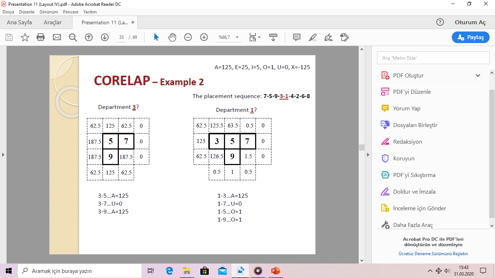
1-3 ilişkisi A: 125
1-7 ilişkisi U: 0
1-5 ilişkisi O: 1
1-9 ilişkisi O: 1
3-5 ilişkisi A: 125
3-7 ilişkisi U: 0
3-9 ilişkisi A: 125
A=125, E=25, I=5, O=1, U=0, X= -125
END303 TESİS PLANLAMA VE YERLEŞİM
40

<!-- Slide number: 41 -->
# Örnek -3 (CORELAP Tekniği)
Yerleştirme Sırası : 7-5-9-3-1-4-2-6-8
Yerleştirilecek Bölüm : 6
Yerleştirilecek Bölüm : 8

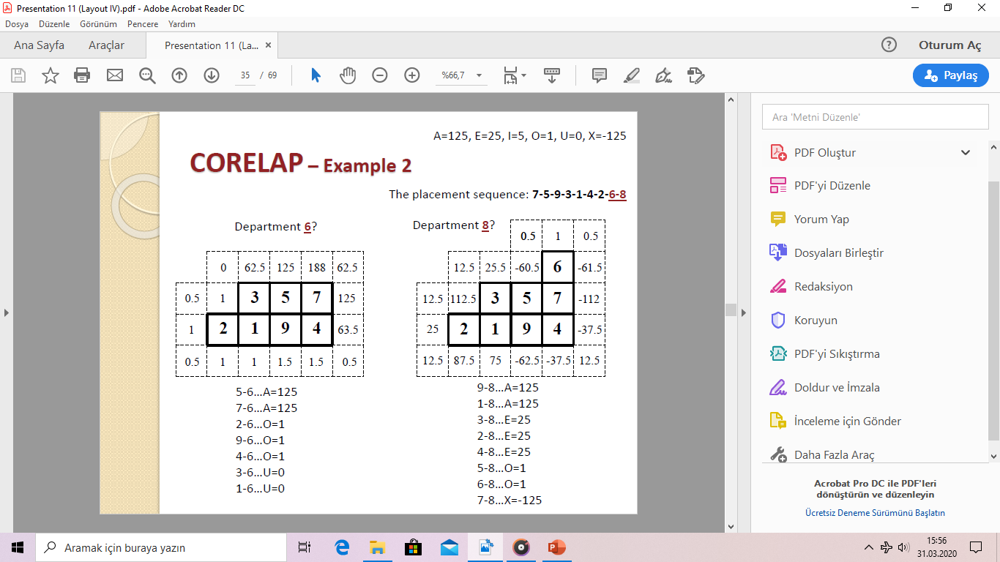
8-9 ilişkisi A: 125
8-1 ilişkisi A: 125
8-3 ilişkisi E: 25
8-2 ilişkisi E: 25
8-4 ilişkisi E: 25
8-5 ilişkisi O: 1
8-6 ilişkisi O: 1
8-7 ilişkisi X: -125
6-5 ilişkisi A: 125
6-7 ilişkisi A: 125
6-2 ilişkisi O: 1
6-9 ilişkisi O: 1
6-4 ilişkisi O: 1
6-3 ilişkisi U: 0
6-1 ilişkisi U: 0
A=125, E=25, I=5, O=1, U=0, X= -125
END303 TESİS PLANLAMA VE YERLEŞİM
41

<!-- Slide number: 42 -->
# Örnek -3 (CORELAP Tekniği)
Yerleştirme Sırası : 7-5-9-3-1-4-2-6-8

Nihai Yerleşim
A=125, E=25, I=5, O=1, U=0, X= -125
END303 TESİS PLANLAMA VE YERLEŞİM
42

<!-- Slide number: 43 -->
# CORELAP Tekniği Yorumlar
Nihai yerleşim, uzaklık esaslı yerleşim puanına göre değerlendirilir.
CORELAP bölümler arasındaki dik doğrusal (rectilinear path) yolun en kısa olanını kullanır. (Alma/ Bırakma alanları bölümlerin uzun kenarlarına komşuluğu en yakın olduğu varsayılır)
Yerleşimler sıklıkla düzensiz bir bina şeklinde sonuçlanır.

END303 TESİS PLANLAMA VE YERLEŞİM
43

<!-- Slide number: 44 -->
# ALDEP – Automated Layout Design Program
Yerleşim Tasarımı Algoritmaları
END303 TESİS PLANLAMA VE YERLEŞİM
44

<!-- Slide number: 45 -->
# ALDEP Tekniği
CORELAP’a benzerdir (Amaçlar, Gereksinimler)
Komşuluk Esaslı Yöntem-Adjacency-based method
Temel farklılıklar:
Rassallık Randomness
Çok katlı Kabiliyet- Multi-floor capability
CORELAP, en iyi yerleşimi üretmesine olanak sağlarken, ALDEP çok sayıda yerleşim üretir.

END303 TESİS PLANLAMA VE YERLEŞİM
45

<!-- Slide number: 46 -->
# ALDEP –Prosedürü
Bölüm Seçimi- Department selection
İlk bölüm Rassal olarak seçilir.
İlk seçilen bölümle “A” ilişkisine (veya “E”, “I”, vd. –kullanıcı tarafından minimum önem seviyesi belirlenir) sahip olan bölümler seçilir, haricinde ikinci bölümde Rassal olarak seçilir.
Eğer böyle bir bölüm yoksa, ikinci bölüm tamamen Rassal olarak seçilir.
Seçim prosedürü, tüm bölümler seçilinceye kadar tekrarlanır.
Bölüm Yerleştirme- Department placement
Sol üst köşeden başlanır ve aşağıya doğru genişletilir
Dikey süpürme paterni
Süpürme genişliği, kullanıcı tarafından belirlenir.
Komşuluk esaslı değerlendirme
Eğer minimum gereksinimler karşılanıyorsa, yerleşim ve puanlar çıkarılır.
Prosedür tekrarlanır. (Her çalıştırmada maksimum 20 yerleşim)
Kullanıcı değerlendirmesine bağlıdır.

END303 TESİS PLANLAMA VE YERLEŞİM
46

<!-- Slide number: 47 -->
# ALDEP Tekniği
Dikey Süperme Paterni
 (Vertical sweep pattern)

Süpürme Genişliği (Sweep width)

Bölüm Boyutu = 8 br kare
Bölüm Boyutu = 14 br kare

1 kare- grid

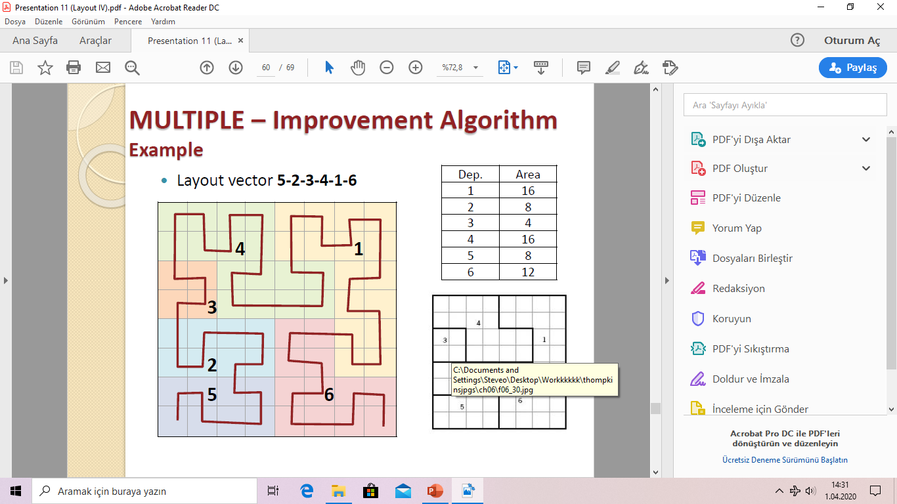
2 kare-grids

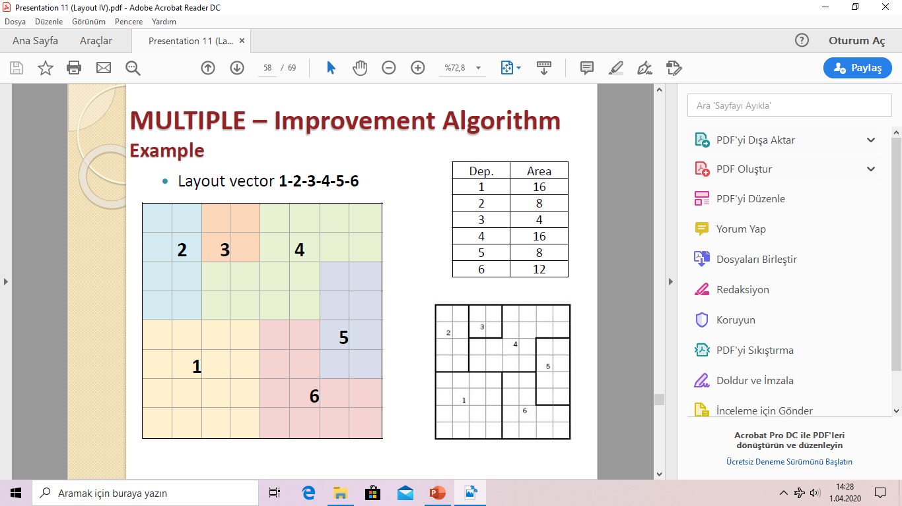
3 kare grids
END303 TESİS PLANLAMA VE YERLEŞİM
47

<!-- Slide number: 48 -->
# Örnek -4 (ALDEP Tekniği)
ALDEP prosedürünü kullanarak, aşağıda ilişki şeması ve bölüm boyutları verilen bir tesis için yerleşim vektörünü, kurma ve geliştirici yerleşimlerini belirleyiniz. Tesisisin boyutları 10x18. Süpürme genişliğini 2 ve minimum kabul edilebilir önem derecesini “E” alarak kullanınız. Yakınlık değerleri : A=64, E=16, I=4, O=1, U=0, X= -1.024

| Bölümler | Alan | Br. Kare Sayısı |
| --- | --- | --- |
| 1 | 12.000 | 30 |
| 2 | 8.000 | 20 |
| 3 | 6.000 | 15 |
| 4 | 12.000 | 30 |
| 5 | 8.000 | 20 |
| 6 | 12.000 | 30 |
| 7 | 12.000 | 30 |
END303 TESİS PLANLAMA VE YERLEŞİM
48

<!-- Slide number: 49 -->
# Örnek -4 (ALDEP Tekniği)
Bölüm Seçimi- Department selection

| Adımlar | Seçilen Bölüm | Seçilme Sebebi |
| --- | --- | --- |
| 1 | 4 | Rassal |
| 2 | 2 | 4 ile ‘’E’’ İlişkisi |
| 3 | 1 | 2 ile ‘’E’’ İlişkisi |
| 4 | 6 | Rassal |
| 5 | 5 | 6 ile ‘’A’’ İlişkisi |
| 6 | 7 | Rassal |
| 7 | 3 | Son kalan |
Yerleşim Vektörü/ Sırası Layout vector: 4-2-1-6-5-7-3
END303 TESİS PLANLAMA VE YERLEŞİM
49

<!-- Slide number: 50 -->
# Örnek -4 (ALDEP Tekniği)
Yerleşim Kurma
Yerleşim Vektörü/ Sırası: 4-2-1-6-5-7-3
Süpürme Genişliği : 2 br.kare
Tesisisin boyutları 10x18

| Bölümler | Br. Kare Sayısı |
| --- | --- |
| 1 | 30 |
| 2 | 20 |
| 3 | 15 |
| 4 | 30 |
| 5 | 20 |
| 6 | 30 |
| 7 | 30 |
Nihai Yerleşim
(Final Layout)

Nihai Yerleşim (Final Layout)
END303 TESİS PLANLAMA VE YERLEŞİM
50

<!-- Slide number: 51 -->
# Örnek -4 (ALDEP Tekniği)
Komşuluk Puanları-Adjacency score

Toplam Komşuluk Puanı : 120
A=64, E=16, I=4, O=1, U=0, X=-1.024
END303 TESİS PLANLAMA VE YERLEŞİM
51

<!-- Slide number: 52 -->
# Örnek -4 (Alternatif çözüm)
Alternatif çözüm
Bölüm seçimi

| Adımlar | Seçilen Bölüm | Seçilme Sebebi |
| --- | --- | --- |
| 1 | 2 | Rassal |
| 2 | 1 | 2 ile ‘’E’’ İlişkisi |
| 3 | 4 | Rassal |
| 4 | 5 | Rassal |
| 5 | 6 | 5 ile ‘’A’’ İlişkisi |
| 6 | 7 | 6 ile ‘’E’’ İlişkisi |
| 7 | 3 | Son kalan |
Yerleşim vektörü : 2-1-4-5-6-7-3
END303 TESİS PLANLAMA VE YERLEŞİM
52

<!-- Slide number: 53 -->
# Örnek -4 (Alternatif çözüm)
Yerleşim Kurma
Yerleşim Vektörü/ Sırası: 2-1-4-5-6-7-3
Süpürme Genişliği : 2 br.kare
Tesisisin boyutları 10x18

A=64, E=16, I=4, O=1, U=0, X=-1.024

| Komşu Bölümler | İlişkisi | Değeri |
| --- | --- | --- |
| 2-1 | E | 16 |
| 1-4 | I | 4 |
| 4-5 | I | 4 |
| 5-6 | A | 64 |
| 6-7 | E | 16 |
| 7-3 | U | 0 |
| Toplam Komşuluk Puanı |  | 104 |

Nihai Yerleşim (Final Layout)
END303 TESİS PLANLAMA VE YERLEŞİM
53

<!-- Slide number: 54 -->
# Örnek -4 (Alternatif çözüm)
Nihai karar, tesis planlamacısına bağlıdır.
Çok sayıda alternatifi göz önünde bulundurulması gereksinim vardır.

Nihai Yerleşim : 2-1-4-5-6-7-3
Nihai Yerleşim : 4-2-1-6-5-7-3

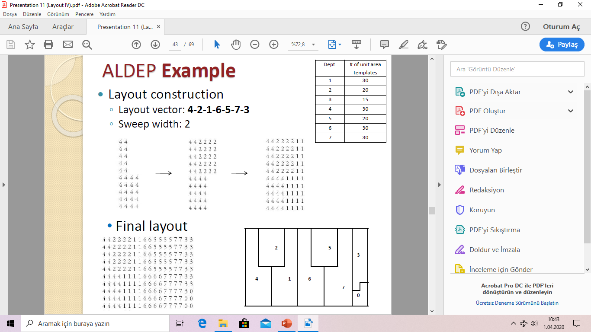
Toplam Komşuluk Puanı : 104
Toplam Komşuluk Puanı : 120
END303 TESİS PLANLAMA VE YERLEŞİM
54

<!-- Slide number: 55 -->
# MULTIPLE –Multi-floor Plant Layout Evaluation
Yerleşim Tasarımı Algoritmaları
END303 TESİS PLANLAMA VE YERLEŞİM
55

<!-- Slide number: 56 -->
# MULTIPLE Tekniği
MULTIPLE –Multi-floor Plant Layout Evaluation- Çok katlı Tesis yerleşim değerlemesi olarak ifade edilebilir.
Kurma ve geliştirme Algoritmasıdır.
Uzaklık Esaslı Algoritmadır.
CRAFT’a benzerdir (bölümler dikdörtgensel şekiller, Kesikli gösterim, ikili yol değişiklikleriyle sınırlı değildir.)
Fakat MULTIPLE komşu olmayan bölümler arasında ikili değişiklikler yapılabilmesine olanak sağlar.
Her bir İterasyon sonrasında yeni bir yerleşim yeniden oluşturmak için Alan doldurma eğrileri (space filling curves)  kullanır.

END303 TESİS PLANLAMA VE YERLEŞİM
56

<!-- Slide number: 57 -->
# MULTIPLE - Alan/Oylum Doldurma Eğrisi
Alan/Oylum doldurma eğrisi (SFC- Space Filling Curves) bir yerleşimdeki bütün birim kareleri (grids) bağlantılıdır.
Her bir kare (grid), kesinlikle bir kez ziyaret edilecek
Gelecek kareye ziyaret mevcut bulunulan kareye daima komşuluğu olacak (yalnızca yatay veya dikey hareketler)
SFC bilgisayar tarafından oluşturulur/üretilir.
SFC, bir iki boyutlu yerleşim içine bir yerleşim vektörü haritalandırmak için MULTIPLE yöntemine olanak sağlar.
Prosedür:
Bölümler, yerleştirme vektörüne göre yerleştirilir (MCRAFT yönteminde olduğu gibi)
Her bir bölüm için gereksinim duyulan birim kare sayısına ulaşılıncaya kadar SFC takip eder.

END303 TESİS PLANLAMA VE YERLEŞİM
57

<!-- Slide number: 58 -->
# Örnek -5 (MULTIPLE Tekniği)
Yerleşim vektörü 1-2-3-4-5-6 olarak verilen aşağıdaki bölümler için bir MULTIPLE yerleşim oluşturunuz. Daha sonra 1 ve 5 bölümlerini değiştirerek elde edeceğiniz yeni yerleşimi oluşturunuz. Tesis ve SFC aşağıda verilmiştir.

| Bölümler | Alan (m2) |
| --- | --- |
| 1 | 16 |
| 2 | 8 |
| 3 | 4 |
| 4 | 16 |
| 5 | 8 |
| 6 | 12 |
END303 TESİS PLANLAMA VE YERLEŞİM
58

<!-- Slide number: 59 -->
# Örnek -5 (MULTIPLE Tekniği)

| Bölümler | Alan (m2) |
| --- | --- |
| 1 | 16 |
| 2 | 8 |
| 3 | 4 |
| 4 | 16 |
| 5 | 8 |
| 6 | 12 |
Yerleşim vektörü: 1-2-3-4-5-6
END303 TESİS PLANLAMA VE YERLEŞİM
59

<!-- Slide number: 60 -->
# Örnek -5 (MULTIPLE Tekniği)

| Bölümler | Alan (m2) |
| --- | --- |
| 1 | 16 |
| 2 | 8 |
| 3 | 4 |
| 4 | 16 |
| 5 | 8 |
| 6 | 12 |
Yerleşim vektörü: 1-2-3-4-5-6
END303 TESİS PLANLAMA VE YERLEŞİM
60

<!-- Slide number: 61 -->
# Örnek -5 (MULTIPLE Tekniği)

| Bölümler | Alan (m2) |
| --- | --- |
| 1 | 16 |
| 2 | 8 |
| 3 | 4 |
| 4 | 16 |
| 5 | 8 |
| 6 | 12 |
Yerleşim vektörü: 1-2-3-4-5-6
END303 TESİS PLANLAMA VE YERLEŞİM
61

<!-- Slide number: 62 -->
# Örnek -5 (MULTIPLE Tekniği)

| Bölümler | Alan (m2) |
| --- | --- |
| 1 | 16 |
| 2 | 8 |
| 3 | 4 |
| 4 | 16 |
| 5 | 8 |
| 6 | 12 |
Yerleşim vektörü: 1-2-3-4-5-6
END303 TESİS PLANLAMA VE YERLEŞİM
62

<!-- Slide number: 63 -->
# Örnek -5 (MULTIPLE Tekniği)

| Bölümler | Alan (m2) |
| --- | --- |
| 1 | 16 |
| 2 | 8 |
| 3 | 4 |
| 4 | 16 |
| 5 | 8 |
| 6 | 12 |
Yerleşim vektörü: 1-2-3-4-5-6
END303 TESİS PLANLAMA VE YERLEŞİM
63

<!-- Slide number: 64 -->
# Örnek -5 (MULTIPLE Tekniği)

| Bölümler | Alan (m2) |
| --- | --- |
| 1 | 16 |
| 2 | 8 |
| 3 | 4 |
| 4 | 16 |
| 5 | 8 |
| 6 | 12 |
Yerleşim vektörü: 1-2-3-4-5-6
END303 TESİS PLANLAMA VE YERLEŞİM
64

<!-- Slide number: 65 -->
# Örnek -5 (MULTIPLE Tekniği)

| Bölümler | Alan (m2) |
| --- | --- |
| 1 | 16 |
| 2 | 8 |
| 3 | 4 |
| 4 | 16 |
| 5 | 8 |
| 6 | 12 |
Yerleşim vektörü: 1-2-3-4-5-6
END303 TESİS PLANLAMA VE YERLEŞİM
65

<!-- Slide number: 66 -->
# Örnek -5 (MULTIPLE Tekniği)
Yerleşim vektörü: 1-2-3-4-5-6

| Böl. | Alan (m2) |
| --- | --- |
| 1 | 16 |
| 2 | 8 |
| 3 | 4 |
| 4 | 16 |
| 5 | 8 |
| 6 | 12 |
END303 TESİS PLANLAMA VE YERLEŞİM
66

<!-- Slide number: 67 -->
# Örnek -5 (MULTIPLE Tekniği)
1 ve 5 Bölümleri yer değiştirdiğindei
Yeni yerleşim vektörü: 5-2-3-4-1-6

Yerleşim vektörü: 5-2-3-4-1-6
END303 TESİS PLANLAMA VE YERLEŞİM
67

<!-- Slide number: 68 -->
# Örnek -5 (MULTIPLE Tekniği)
1 ve 5 Bölümleri yer değiştirdiğindei
Yeni yerleşim vektörü: 5-2-3-4-1-6

| Böl. | Alan (m2) |
| --- | --- |
| 1 | 16 |
| 2 | 8 |
| 3 | 4 |
| 4 | 16 |
| 5 | 8 |
| 6 | 12 |

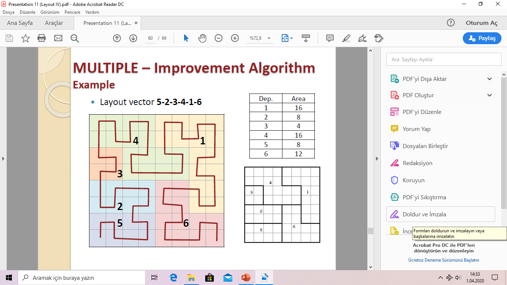
Yerleşim vektörü: 5-2-3-4-1-6
END303 TESİS PLANLAMA VE YERLEŞİM
68

<!-- Slide number: 69 -->
# Örnek -5 (MULTIPLE Tekniği)
| Böl. | Alan (m2) |
| --- | --- |
| 1 | 16 |
| 2 | 8 |
| 3 | 4 |
| 4 | 16 |
| 5 | 8 |
| 6 | 12 |
Başlangıç Yerleşim
Yer değiştirme sonucu Yerleşim

END303 TESİS PLANLAMA VE YERLEŞİM
69

<!-- Slide number: 70 -->
# MULTIPLE –Uygun Eğriler
Uygun eğriler elle üretilen eğrilerdir.
Şu şekilde kullanılırlar:
Eğer Binanın şekli düzensiz ise,
Eğer başlangıç yerleşimi kesinlikle elde etmek/kapsamak istiyor isek,
Eğer çok sayıda engel (duvar) var ise,
Eğer sabit bölümler var ise,
Prosedür:
Herhangi birim kare başlangıç veya sonda olabilir.
Eğriler, diğer bölümü ziyaret etmeden önce özel bir bölüme atanan tüm birim kareleri ziyaret etmelidir.
Sabit bölümler ve engeller ziyaret edilmez.

END303 TESİS PLANLAMA VE YERLEŞİM
70

<!-- Slide number: 71 -->
# MULTIPLE –Uygun Eğriler

END303 TESİS PLANLAMA VE YERLEŞİM
71

<!-- Slide number: 72 -->
# MULTIPLE –Uygun Eğriler
CRAFT örneği için Nihai MULTIPLE Yerleşim

Maliyet, CRAFT tarafından bulunan nihai yerleşimden daha düşük bulunur.
MULTIPLE, her bir iterasyonda olası çözümler kümesinin büyüklüğü düşünüldüğünde CRAFT’a göre kuvvetle muhtemel daha düşük maliyetli sonuçlar elde edilir.

END303 TESİS PLANLAMA VE YERLEŞİM
72

<!-- Slide number: 73 -->
# MULTIPLE –Uygun Eğriler
CRAFT örneği için Nihai MULTIPLE Yerleşim bölüm sınırlarının düzgünleştirilmesi / pürüzsüzleştirilmesi için masaj yapılmasına ihtiyaç duyulabilir.

END303 TESİS PLANLAMA VE YERLEŞİM
73

<!-- Slide number: 74 -->
# MULTIPLE –Kurma Algoritması
Herhangi SFC veya uygun eğriler, boş bir binası doldurmak için kullanılabilir.
Herhangi bir vektör başlangıç yerleşim vektörü olarak kullanılabilir.
Alternatif yerleşimler, farklı SFC denenerek üretilebilir.
Maliyet çok farklı olmayabilir.

END303 TESİS PLANLAMA VE YERLEŞİM
74

<!-- Slide number: 75 -->
# MULTIPLE –Kurma Algoritması

Orijinal Yerleşim Vektörü:
D-B-H-C-F-E
Nihai yerleşim maliyeti z = 54.200

Alternatif Yerleşim Vektörü:
D-E-F-H-B-C
Nihai yerleşim maliyeti z =54.540
Alternatif Yerleşim Vektörü:
D-E-F-B-C-H
Nihai yerleşim maliyeti z =54.900
END303 TESİS PLANLAMA VE YERLEŞİM
75

<!-- Slide number: 76 -->
# Sonuç
Yerleşim Üretme Algoritmaları
Her bir yerleşim algoritmasının güçlü ve zayıf yönlere sahiptir.
CRAFT, MULTIPLEbaşlangıç yerleşim, bina şekli sabit bölümler iyi bir şekilde elde edilir.
BLOCPLAN, LOGICkabul edilebilir (dikdörtgen) şekiller üretir
ALDEP, MULTIPLEçok sayıda alternatif üretir.
Hiçbir algoritma optimal bir yerleşim üretemez. Yani yöntemler Sezgiseldir.
Bilgisayar temelli algoritmalar bir tesis yerleşim  probleminin bütün özel durumları elde edilemez.
İnsan yerleşim planlamacıları, tesis yerleşimin değerlendirilmesi ve geliştirilmesinde anahtar bir rol oynamaya devam edecektir.

END303 TESİS PLANLAMA VE YERLEŞİM
76

<!-- Slide number: 77 -->
# Gelecek Ders
Tesis konumu I- Facility location I.

END303 TESİS PLANLAMA VE YERLEŞİM
77

<!-- Slide number: 78 -->
# ÇÖZÜMLÜ ÖRNEK SORULAR veÇALIŞMA SORULARI
Yerleşim Tasarımı Algoritmaları
END303 TESİS PLANLAMA VE YERLEŞİM
78

<!-- Slide number: 79 -->
# Çözümlü Örnek Soru-1
Aşağıdaki REL chart'ı göz önüne alalım. Burada, farklı olarak ilişki derecelerine aşağıdaki gibi nümerik değerler atayalım (Bu değerler yerine başka değerler de kullanılabilir). Belirli bir bölümün toplam değeri Toplam Yakınlık Derecesi (TCR) olarak isimlendirilir.

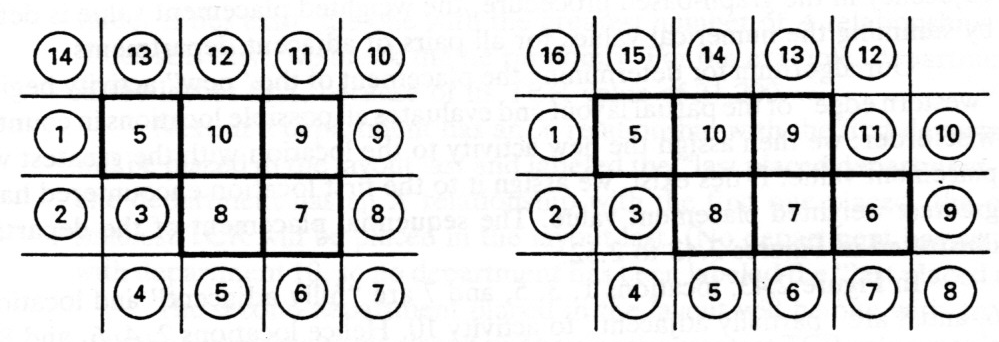
| İlişki | Nümerik Değer |
| --- | --- |
| A | 10.000 |
| E | 1.000 |
| I | 100 |
| O | 10 |
| U | 0 |
| X | -10.000 |
END303 TESİS PLANLAMA VE YERLEŞİM
79

<!-- Slide number: 80 -->
# Çözümlü Örnek Soru-1
Probleme ilişkin TCR değerleri aşağıdaki tabloda hesaplanmıştır.

| Bölümler | Bölümler |  |  |  |  |  |  |  |  |  | Özet |  |  |  |  |  | TCR |
| --- | --- | --- | --- | --- | --- | --- | --- | --- | --- | --- | --- | --- | --- | --- | --- | --- | --- |
|  | 1 | 2 | 3 | 4 | 5 | 6 | 7 | 8 | 9 | 10 | A | E | I | O | U | X |  |
| 1 | - | O | E | O | U | U | U | U | U | U | 0 | 1 | 0 | 2 | 6 | 0 | 1.020 |
| 2 | O | - | I | O | I | I | I | O | I | I | 0 | 0 | 6 | 3 | 0 | 0 | 630 |
| 3 | E | I | - | U | U | U | U | U | U | U | 0 | 1 | 1 | 0 | 7 | 0 | 1.100 |
| 4 | O | O | U | - | U | O | U | U | U | I | 0 | 0 | 1 | 3 | 5 | 0 | 130 |
| 5 | U | I | U | U | - | U | U | U | U | A | 1 | 0 | 1 | 0 | 7 | 0 | 10.100 |
| 6 | U | I | U | O | U | - | E | U | I | U | 0 | 1 | 2 | 1 | 5 | 0 | 1.210 |
| 7 | U | I | U | U | U | E | - | U | E | U | 0 | 2 | 1 | 0 | 6 | 0 | 2.100 |
| 8 | U | O | U | U | U | U | U | - | U | A | 1 | 0 | 0 | 1 | 7 | 0 | 10.010 |
| 9 | U | I | U | U | U | I | E | U | - | E | 0 | 2 | 2 | 0 | 5 | 0 | 2.200 |
| 10 | U | I | U | I | A | U | U | A | E | - | 2 | 1 | 2 | 0 | 4 | 0 | 21.200 |
| İlişki | Nümerik Değer |
| --- | --- |
| A | 10.000 |
| E | 1.000 |
| I | 100 |
| O | 10 |
| U | 0 |
| X | -10.000 |
END303 TESİS PLANLAMA VE YERLEŞİM
80

<!-- Slide number: 81 -->
# Çözümlü Örnek Soru-1
Yerleştirilecek ilk bölüm TCR değeri en yüksek olan bölüm olarak seçilir. Eğer beraberlik var ise bu durumda bünyesinde en çok "A" ilişkisi bulunduran bölüm seçilir. Örnekte TCR değeri en yüksek olan bölüm 10.bölümdür.

| Bölümler | Bölümler |  |  |  |  |  |  |  |  |  | Özet |  |  |  |  |  | TCR |
| --- | --- | --- | --- | --- | --- | --- | --- | --- | --- | --- | --- | --- | --- | --- | --- | --- | --- |
|  | 1 | 2 | 3 | 4 | 5 | 6 | 7 | 8 | 9 | 10 | A | E | I | O | U | X |  |
| 1 | - | O | E | O | U | U | U | U | U | U | 0 | 1 | 0 | 2 | 6 | 0 | 1.020 |
| 2 | O | - | I | O | I | I | I | O | I | I | 0 | 0 | 6 | 3 | 0 | 0 | 630 |
| 3 | E | I | - | U | U | U | U | U | U | U | 0 | 1 | 1 | 0 | 7 | 0 | 1.100 |
| 4 | O | O | U | - | U | O | U | U | U | I | 0 | 0 | 1 | 3 | 5 | 0 | 130 |
| 5 | U | I | U | U | - | U | U | U | U | A | 1 | 0 | 1 | 0 | 7 | 0 | 10.100 |
| 6 | U | I | U | O | U | - | E | U | I | U | 0 | 1 | 2 | 1 | 5 | 0 | 1.210 |
| 7 | U | I | U | U | U | E | - | U | E | U | 0 | 2 | 1 | 0 | 6 | 0 | 2.100 |
| 8 | U | O | U | U | U | U | U | - | U | A | 1 | 0 | 0 | 1 | 7 | 0 | 10.010 |
| 9 | U | I | U | U | U | I | E | U | - | E | 0 | 2 | 2 | 0 | 5 | 0 | 2.200 |
| 10 | U | I | U | I | A | U | U | A | E | - | 2 | 1 | 2 | 0 | 4 | 0 | 21.200 |
END303 TESİS PLANLAMA VE YERLEŞİM
81

<!-- Slide number: 82 -->
# Çözümlü Örnek Soru-1
Eğer ilk yerleştirilecek bölüm ile "X" ilişkili olan bir bölüm var ise bu bölüm en son yerleştirilmek üzere işaretlenir. Beraberlik durumunda en küçük TCR değerli olan bölüm en son yerleştirilmesi amacıyla işaretlenir.
İlk bölüm yerleştirildikten sonra yerleştirilecek bölüm, ilk bölüm ile "A" ilişkili olan bölümlerden seçilir. Eğer birden fazla bölüm A ilişkili ise TCR değeri en yüksek olan seçilir. Beraberlik durumunda rasgele seçim yapılır. Örneğimizde 10.bölüm ile A ilişkili olan 5 ve 8 no'lu bölümlerdir. 5'in TCR değeri 8'den daha büyük olduğundan ikinci bölüm olarak 5 seçilir.

| Bölümler | Bölümler |  |  |  |  |  |  |  |  |  | Özet |  |  |  |  |  | TCR |
| --- | --- | --- | --- | --- | --- | --- | --- | --- | --- | --- | --- | --- | --- | --- | --- | --- | --- |
|  | 1 | 2 | 3 | 4 | 5 | 6 | 7 | 8 | 9 | 10 | A | E | I | O | U | X |  |
| 1 | - | O | E | O | U | U | U | U | U | U | 0 | 1 | 0 | 2 | 6 | 0 | 1.020 |
| 2 | O | - | I | O | I | I | I | O | I | I | 0 | 0 | 6 | 3 | 0 | 0 | 630 |
| 3 | E | I | - | U | U | U | U | U | U | U | 0 | 1 | 1 | 0 | 7 | 0 | 1.100 |
| 4 | O | O | U | - | U | O | U | U | U | I | 0 | 0 | 1 | 3 | 5 | 0 | 130 |
| 5 | U | I | U | U | - | U | U | U | U | A | 1 | 0 | 1 | 0 | 7 | 0 | 10.100 |
| 6 | U | I | U | O | U | - | E | U | I | U | 0 | 1 | 2 | 1 | 5 | 0 | 1.210 |
| 7 | U | I | U | U | U | E | - | U | E | U | 0 | 2 | 1 | 0 | 6 | 0 | 2.100 |
| 8 | U | O | U | U | U | U | U | - | U | A | 1 | 0 | 0 | 1 | 7 | 0 | 10.010 |
| 9 | U | I | U | U | U | I | E | U | - | E | 0 | 2 | 2 | 0 | 5 | 0 | 2.200 |
| 10 | U | I | U | I | A | U | U | A | E | - | 2 | 1 | 2 | 0 | 4 | 0 | 21.200 |
END303 TESİS PLANLAMA VE YERLEŞİM
82

<!-- Slide number: 83 -->
# CORELAP Bölüm Seçimi
İkinci olarak seçilen bölüm ile X ilişkili bir bölüm var ise (daha önce ilk yerleşen bölüm ile X ilişkili bölüm olmaması durumunda) bu bölüm son yerleşecek bölüm olarak işaretlenir. Beraberlik durumunda en küçük TCR değerli bölüm en son yerleşecek bölüm olarak seçilir.
Eğer ilk yerleşen bölüm ile X ilişkili bir bölüm var ise ve ikinci yerleşen bölüm ile de X ilişkili bölüm var ise bu durumda ikinci yerleşen bölüm ile X ilişkili olan bölüm, sondan ikinci yerleşecek bölüm olarak işaretlenir.
Üçüncü yerleşecek bölüm, yerleşmiş olan bölümler ile A ilişkili olan bölümler arasından seçilir. Birden fazla A ilişkili bölüm var ise TCR değeri en yüksek olan bölüm seçilir. A ilişkili bölüm bulunmuyorsa E ilişkili bölümler arasından TCR değeri en yüksek olan bölüm seçilir. O da yoksa sırası ile I ve O ilişkili bölümler arasından TCR değeri en yüksek olan seçilir. Eğer yine seçilemiyor ise bu durumda rasgele bir seçim yapılır. Örneğimizde 8.bölüm 10 ile A ilişkili olduğundan üçüncü yerleşecek bölüm olarak seçilir.
Üçüncü bölüm ile X ilişkili olan bölüm varsa (birden fazla ise TCR değeri en küçük olan) işaretlenerek sondan üçüncü yerleşecek bölüm olarak belirlenir.
Süreç en son bölüm yerleşene kadar devam eder.
Örneğimizde bölümler sırasıyla 10, 5, 8, 9, 7, 6, 2, 3, 1, 4 olarak yerleştirilir. (İnceleyin ve sırayı siz de bulunuz.)

END303 TESİS PLANLAMA VE YERLEŞİM
83

<!-- Slide number: 84 -->
# CORELAP Bölüm Yerleştirme
Bölüm yerleşme sırası belirlendikten sonra, bağıl konumlar belirlenmelidir. Bölümlerin her biri bir kare olarak temsil edilir. Yerleşimleri ise ağırlıklı yerleştirme değerlerine göre yapılır.
Grafik tabanlı prosedürde, çizim bitişiklik kullanımına göre yapılır. Komşu bölümlerden oluşan bütün çiftlere ait değerler toplanarak ağırlıklı yerleştirme değeri hesaplanır.
Yeni yerleşecek bölüm için aday noktalar batı kenarından başlayarak saat yönünün tersinde işaretlenir ve kısmi yerleşim üzerinde değerlendirilir. Sıradaki bölüm en yüksek ağırlıklı yerleştirme değerinin bulunduğu yere atanır. Beraberlik durumunda, daha önce hesaplanmış en yüksek değerin olduğu konuma atama yapılır.

END303 TESİS PLANLAMA VE YERLEŞİM
84

<!-- Slide number: 85 -->
# Çözümlü Örnek Soru-1 Bölüm Yerleştirme
10 ile 5 Bölümleri A ilişkili. A’nın değeri 10.000.
1-3-5-7 Tam komşu     10.000
2-4-6-8 Yarım komşu  10.000*0,5=5.000
 İlk en yüksek değer 1. konumda
5 No’lu bölümü 1. konuma atarız.
Yerleştirme Sırası
10, 5, 8, 9, 7, 6, 2, 3, 1, 4
| İlişki | Nümerik Değer |
| --- | --- |
| A | 10.000 |
| E | 1.000 |
| I | 100 |
| O | 10 |
| U | 0 |
| X | -10.000 |

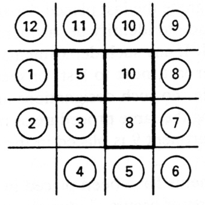

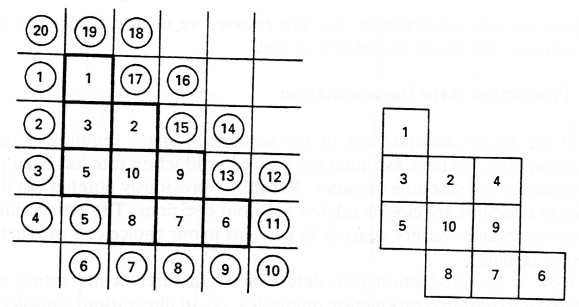

END303 TESİS PLANLAMA VE YERLEŞİM
85

<!-- Slide number: 86 -->
# Çözümlü Örnek Soru-1 Bölüm Yerleştirme
8 Bölüm, 10 ile A ilişkili, 5 ile U ilişkili.
1. konum; 8-5 ilişkisi U olduğundan  0
2. konum;  0
3. konum; Hem 5. bölümden hem de 10. bölümden etkilenmektedir. 5. bölüm ile tam komşu, 10. bölüm ile yarım komşudur.  (0 + 10.000*0,5 = 5.000)
4. konum; Hem 5. bölümden hem de 10. bölümden etkilenmektedir. 5. bölüm ile yarım komşu, 10. bölüm ile tam komşudur.  (0*0,5 + 10.000 = 10.000)
Yerleştirme Sırası
10, 5, 8, 9, 7, 6, 2, 3, 1, 4
| İlişki | Nümerik Değer |
| --- | --- |
| A | 10.000 |
| E | 1.000 |
| I | 100 |
| O | 10 |
| U | 0 |
| X | -10.000 |

END303 TESİS PLANLAMA VE YERLEŞİM
86

<!-- Slide number: 87 -->
# Çözümlü Örnek Soru-1 Bölüm Yerleştirme
| İlişki | Nümerik Değer |
| --- | --- |
| A | 10.000 |
| E | 1.000 |
| I | 100 |
| O | 10 |
| U | 0 |
| X | -10.000 |

END303 TESİS PLANLAMA VE YERLEŞİM
87

<!-- Slide number: 88 -->
# Çözümlü Örnek Soru-1 Bölüm Yerleştirme
| İlişki | Nümerik Değer |
| --- | --- |
| A | 10.000 |
| E | 1.000 |
| I | 100 |
| O | 10 |
| U | 0 |
| X | -10.000 |

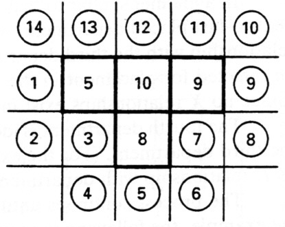

END303 TESİS PLANLAMA VE YERLEŞİM
88

<!-- Slide number: 89 -->
# Çözümlü Örnek Soru-1 Bölüm Yerleştirme
| İlişki | Nümerik Değer |
| --- | --- |
| A | 10.000 |
| E | 1.000 |
| I | 100 |
| O | 10 |
| U | 0 |
| X | -10.000 |

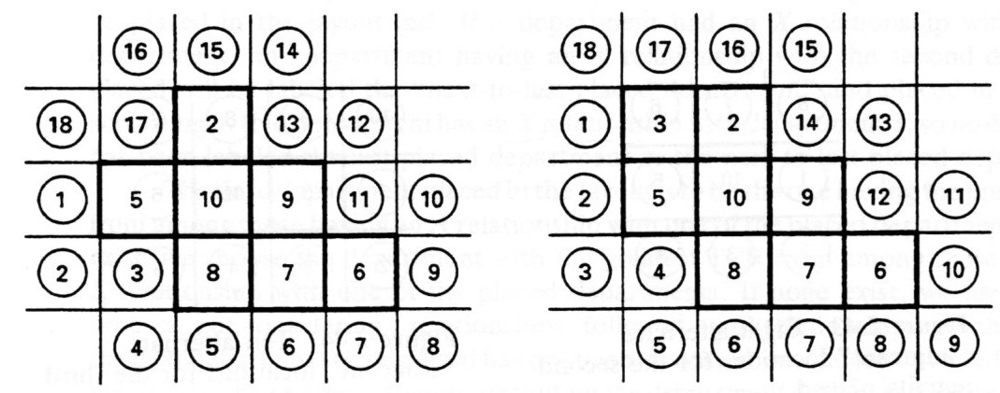

END303 TESİS PLANLAMA VE YERLEŞİM
89

<!-- Slide number: 90 -->
# Çözümlü Örnek Soru-1 Bölüm Yerleştirme
| İlişki | Nümerik Değer |
| --- | --- |
| A | 10.000 |
| E | 1.000 |
| I | 100 |
| O | 10 |
| U | 0 |
| X | -10.000 |

END303 TESİS PLANLAMA VE YERLEŞİM
90

<!-- Slide number: 91 -->
# Çözümlü Örnek Soru-2
Aşağıdaki Daha önce verilen örnekteki ilişki diyagramını göz önüne alalım. Burada, farklı olarak ilişki derecelerine aşağıdaki gibi nümerik değerler atayalım.

|  | 1 | 2 | 3 | 4 | 5 | 6 |
| --- | --- | --- | --- | --- | --- | --- |
| 1 | - | A | A | X | U | O |
| 2 | A | - | E | U | I | A |
| 3 | A | E | - | X | A | X |
| 4 | X | U | X | - | O | A |
| 5 | U | I | A | O | - | A |
| 6 | O | A | X | A | A | - |

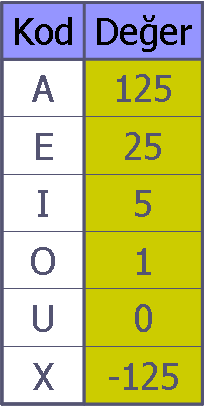
END303 TESİS PLANLAMA VE YERLEŞİM
91

<!-- Slide number: 92 -->
# Çözümlü Örnek Soru-2
Sayısal olarak ifade edilen ilişki matrisinde her bir satırın Toplam Yakınlık Oranları (TCR: Total Closeness Ratings) hesaplanır.

|  | DEPARTMANLAR |  |  |  |  |  | ÖZET |  |  |  |  |  | TCR | SIRA |
| --- | --- | --- | --- | --- | --- | --- | --- | --- | --- | --- | --- | --- | --- | --- |
|  | 1 | 2 | 3 | 4 | 5 | 6 | A | E | I | O | U | X |  |  |
| 1 | - | A | A | X | U | O | 2 | 0 | 0 | 1 | 1 | 1 | 126 | 4 |
| 2 | A | - | E | U | I | A | 2 | 1 | 1 | 0 | 1 | 0 | 280 | 1 |
| 3 | A | E | - | X | A | X | 2 | 1 | 0 | 0 | 0 | 2 | 25 | 5 |
| 4 | X | U | X | - | O | A | 1 | 0 | 0 | 1 | 1 | 2 | -124 | 6 |
| 5 | U | I | A | O | - | A | 2 | 0 | 1 | 1 | 1 | 0 | 256 | 2 |
| 6 | O | A | X | A | A | - | 3 | 0 | 0 | 1 | 0 | 1 | 251 | 3 |
Yerleştirme Sırası
2, 5, 6, 1, 3, 4
END303 TESİS PLANLAMA VE YERLEŞİM
92

<!-- Slide number: 93 -->
# Çözümlü Örnek Soru-2
3*3’lük boş bir matrisin ortasına en yüksek TCR değerine sahip departman atanır. Örnekte bu dept. 2’dir.

Yerleştirme Sırası
2, 5, 6, 1, 3, 4
|  |  |  |
| --- | --- | --- |
|  | Dept-2 |  |
|  |  |  |

|  | 1 | 2 | 3 | 4 | 5 | 6 |
| --- | --- | --- | --- | --- | --- | --- |
| 1 | - | A | A | X | U | O |
| 2 | A | - | E | U | I | A |
| 3 | A | E | - | X | A | X |
| 4 | X | U | X | - | O | A |
| 5 | U | I | A | O | - | A |
| 6 | O | A | X | A | A | - |
END303 TESİS PLANLAMA VE YERLEŞİM
93

<!-- Slide number: 94 -->
# Çözümlü Örnek Soru-2
Dept-2 ile A ilişkisi olan bütün dept.ler (2 ve 6) içerisinde en yüksek TCR değerine sahip dept. seçilir.
Örnekte bu dept., 6’dir.
6’nın 2 ile olan ilişkisine göre matristeki boş yerler için yerleştirme oranları hesaplanır.
İki dept. arasındaki ilişki oranı ile kenar hücreler için 1, köşe hücreler için  değeri çarpılır.
 değeri sezgisel olarak seçilmekle birlikte genellikle =0,5 alınır.

| 62,5 | 125 | 62,5 |
| --- | --- | --- |
| 125 | Dept-2 | 125 |
| 62,5 | 125 | 62,5 |

END303 TESİS PLANLAMA VE YERLEŞİM
94

<!-- Slide number: 95 -->
# Çözümlü Örnek Soru-2
Boş yerler için hesaplanan değerlerden en büyüğüne Dept-6 yerleşir. Eşitlik halinde rasgele seçim yapılır.

| 62,5 | 125 | 62,5 |
| --- | --- | --- |
| 125 | Dept-2 | 125 |
| 62,5 | 125 | 62,5 |

|  | 1 | 2 | 3 | 4 | 5 | 6 |
| --- | --- | --- | --- | --- | --- | --- |
| 1 | - | A | A | X | U | O |
| 2 | A | - | E | U | I | A |
| 3 | A | E | - | X | A | X |
| 4 | X | U | X | - | O | A |
| 5 | U | I | A | O | - | A |
| 6 | O | A | X | A | A | - |
END303 TESİS PLANLAMA VE YERLEŞİM
95

<!-- Slide number: 96 -->
# Çözümlü Örnek Soru-2
Eğer yerleşim matrisin kenarına gelirse bu durumda matris büyür.
Değerler dept.6 ile A ilişkisi olan dept.ler arasında en yüksek TCR değerine sahip dept.’ın yerleşimi ile devam eder.
Örnekte bir sonraki dept., 5’dir.

| 62,5 | 125 | 62,5 |
| --- | --- | --- |
| Dept-6 | Dept-2 | 125 |
| 62,5 | 125 | 62,5 |

|  | 1 | 2 | 3 | 4 | 5 | 6 |
| --- | --- | --- | --- | --- | --- | --- |
| 1 | - | A | A | X | U | O |
| 2 | A | - | E | U | I | A |
| 3 | A | E | - | X | A | X |
| 4 | X | U | X | - | O | A |
| 5 | U | I | A | O | - | A |
| 6 | O | A | X | A | A | - |
END303 TESİS PLANLAMA VE YERLEŞİM
96

<!-- Slide number: 97 -->
# Çözümlü Örnek Soru-2
| 62,5 | 125+2,5 | 5+62,5 | 2,5 |
| --- | --- | --- | --- |
| 125 | Dept-6 | Dept-2 | 5 |
| 62,5 | 125+2,5 | 62,5+5 | 2,5 |

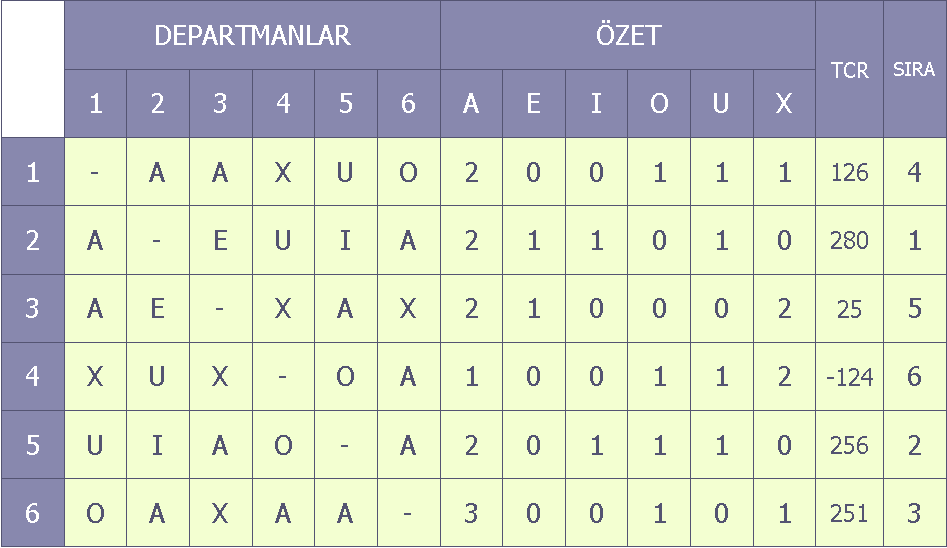
END303 TESİS PLANLAMA VE YERLEŞİM
97

<!-- Slide number: 98 -->
# Çözümlü Örnek Soru-2
| 62,5 | 125+2,5 | 5+62,5 | 2,5 |
| --- | --- | --- | --- |
| 125 | Dept-6 | Dept-2 | 5 |
| 62,5 | 125+2,5 | 62,5+5 | 2,5 |

END303 TESİS PLANLAMA VE YERLEŞİM
98

<!-- Slide number: 99 -->
# Çözümlü Örnek Soru-2
Şimdi ise dept-5 ile A ilişkisi olan dept.lar arasında en büyük TCR değerine sahip dept. aranır.
Örneğimizde bu, dept-3 olmaktadır.

| -62,5 | -125 +12,5 | -62,5 +25 | 12,5 |
| --- | --- | --- | --- |
| -125 +62,5 | Dept-6 | Dept-2 | 25 |
| 125 -62,5 | Dept-5 | -62,5 +125 +25 | 12,5 |
| 62,5 | 125 | 62,5 | 0 |
END303 TESİS PLANLAMA VE YERLEŞİM
99

<!-- Slide number: 100 -->
# Çözümlü Örnek Soru-2
| -62,5 | -112,5 | -37,5 | 12,5 |
| --- | --- | --- | --- |
| -62,5 | Dept-6 | Dept-2 | 25 |
| 62,5 | Dept-5 | 87,5 | 12,5 |
| 62,5 | 125 | 62,5 | 0 |

END303 TESİS PLANLAMA VE YERLEŞİM
100

<!-- Slide number: 101 -->
# Çözümlü Örnek Soru-2
Dept-3 ile A ilişkisi olup da yerleştirilmeyen bir tek dept-1 vardır.
Bu durumda boşluklar dept-1’e göre değerlendirilir.

| 0,5 | 1+62,5 | 0,5+125 | 62,5 |
| --- | --- | --- | --- |
| 1+0 | Dept-6 | Dept-2 | 125 |
| 62,5+0+0,5 | Dept-5 | 125+0,5+0 | 62,5 |
| 125+0 | Dept-3 | 0+125 | 0 |
| 62,5 | 125 | 62,5 | 0 |
| 0,5 | 63,5 | 125,5 | 62,5 |
| --- | --- | --- | --- |
| 1 | Dept-6 | Dept-2 | 125 |
| 63 | Dept-5 | 125,5 | 62,5 |
| 125 | Dept-3 | 125 | 0 |
| 62,5 | 125 | 62,5 | 0 |
END303 TESİS PLANLAMA VE YERLEŞİM
101

<!-- Slide number: 102 -->
# Çözümlü Örnek Soru-2
| 62,5 | 125+0 | 62,5+0 | 0 |
| --- | --- | --- | --- |
| 0,5+125 | Dept-6 | Dept-2 | 0-62,5 |
| -62,5+1+62,5 | Dept-5 | Dept-1 | 0-125 |
| -125+0,5 | Dept-3 | -125+0,5-125 | -62,5 |
| -62,5 | -125 | -62,5 | 0 |
| 62,5 | 125 | 62,5 | 0 |
| --- | --- | --- | --- |
| 125,5 | Dept-6 | Dept-2 | -62,5 |
| 1 | Dept-5 | Dept-1 | -125 |
| -124,5 | Dept-3 | -245,5 | -62,5 |
| -62,5 | -125 | -62,5 | 0 |
END303 TESİS PLANLAMA VE YERLEŞİM
102

<!-- Slide number: 103 -->
# Çözümlü Örnek Soru-2
| 62,5 | 125 | 62,5 | 0 |
| --- | --- | --- | --- |
| Dept-4 | Dept-6 | Dept-2 | -62,5 |
| 1 | Dept-5 | Dept-1 | -125 |
| -124,5 | Dept-3 | -245,5 | -62,5 |
| -62,5 | -125 | -62,5 | 0 |
|  |  |  |  |
| --- | --- | --- | --- |
| Dept-4 | Dept-6 | Dept-2 |  |
|  | Dept-5 | Dept-1 |  |
|  | Dept-3 |  |  |
|  |  |  |  |
END303 TESİS PLANLAMA VE YERLEŞİM
103