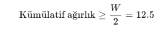
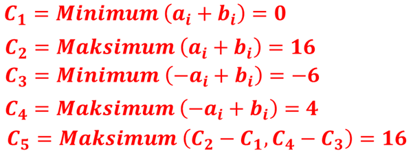
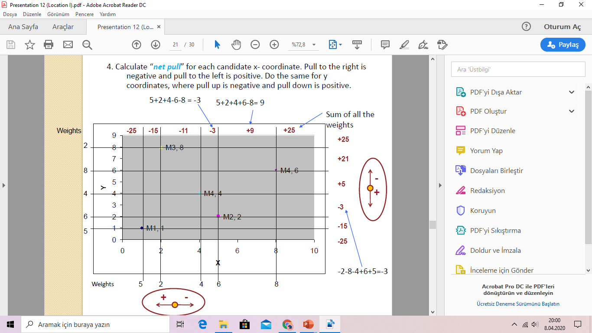
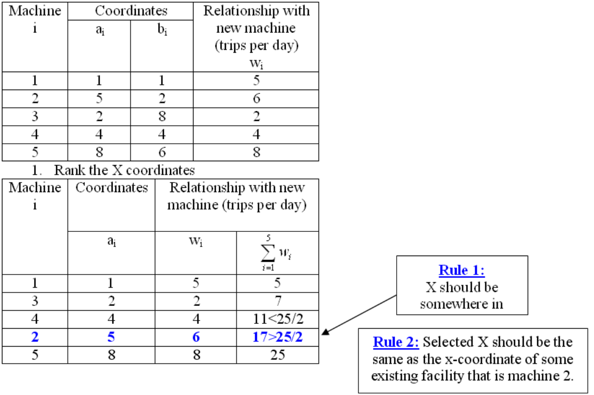
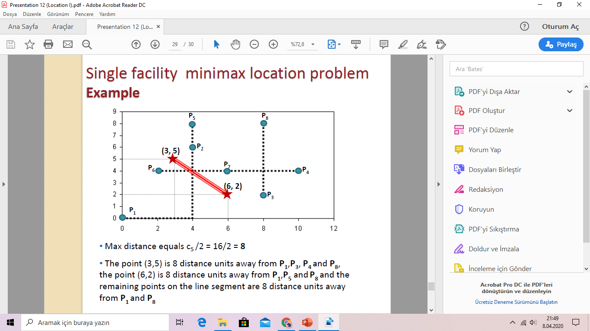

<!-- Slide number: 1 -->
# Tesis Konum I.
Facility Location I.
Dr.Öğr.Üyesi Gökçe KILIÇKAYA ÇAKMAK
END303 TESİS PLANLAMA VE YERLEŞİM
1

<!-- Slide number: 2 -->
# Tesis Konum I.
Bölüm 10
Tesis Konum-Facility location
Sürekli Tesis Konum Modelleri-Continuous facility location models: Tesisin sonsuz sayıda olası nokta içeren bir düzlem üzerinde, herhangi bir koordinata yerleştirilebildiği problemlerdir.
Tek Tesis Minimax Konum Problemi
Tek Tesis Minisum Konum Problemi
Kesikli Tesis Konum Modelleri-Uncontinuous facility location models: P-medyan, P-merkezli problemler…
	Tesisin önceden belirlenmiş, sınırlı sayıdaki aday noktalardan birine kurulmasının söz konusu olduğu problemlerdir.

END303 TESİS PLANLAMA VE YERLEŞİM
2

<!-- Slide number: 3 -->
# Tesis Konum I.
Tesis Yerleşim Kararlarına Etki eden Faktörler:
Ulaştırma/Nakliye (availability, cost)
İş gücü (availability, cost, skills)
Malzemeler (availability, cost, quality)
Ekipman ve Donanım (availability, cost)
Arazi/Arsa (availability, suitability, cost)
Pazar (size, potential needs)
Enerji (availability, cost)
Su  (availability, quality, cost)
Atık (disposal, treatment)

Finansal Kurumlar (availability, strength)
Hükümetler (stability, taxes, import and export restrictions)
Mevcut tesisler (proximity)
Rakipler(size, strength and attitude in that region)
Çoğrafik ve hava koşulları

END303 TESİS PLANLAMA VE YERLEŞİM
3

<!-- Slide number: 4 -->
# Tesis Konum I.
Tesis Konum Problemi
Bölge Ön seçimi (Nitel)
Önceden seçilmiş bölgelerin değerlendirilmesi (Nicel)
Faktör/Puan Derecelendirme-Factor Rating
Maliyet-Kâr-Hacim Analizi-Cost-Profit-Volume analysis
Sürekli tesis konum Problemi
Tesis konum modelleri
Uzayda herhangi bir bölgenin seçimi
Tek ve özel düşünce taşıma/nakliye maliyetleridir.

END303 TESİS PLANLAMA VE YERLEŞİM
4

<!-- Slide number: 5 -->
# Sürekli Tesis Konum Problemleri
Yeni tesis için, uzayda herhangi bir bölge seçebiliriz.
Var olan ilişki tesisler (Tedarikçiler, Müşteriler vd.) için, (x,y) koordinatlarını ve bu tesisler ile yeni tesis arasındaki akışları (maliyetleri) biliyoruz.
Tek ve özel düşüncemiz taşıma/nakliye maliyetleridir.
Tesis konum modellerinin, çok sayıda uygulaması bulunmaktadır;
Yeni havaalanı, Yeni hastane, Yeni okul
Yeni bir iş istasyonu ilave edilmesi
Deponun konumu
Bir tesiste banyo ve lavaboların konumu vd.

END303 TESİS PLANLAMA VE YERLEŞİM
5

<!-- Slide number: 6 -->
# Sürekli Tesis Konum Problemleri
Sürekli Tesis Konum Problemleri Uzaklığın Ölçülmesi
Dikdoğrusal Uzaklıklar (Manhattan)- Rectilinear distance
Birbirleri arasında dikey veya düşey yollar vardır.

Öklid Uzaklık-Euclidean distance
İki nokta arasındaki düz doğrudur.

Akış Yolu Uzaklık Flow path distance
İki nokta arasındaki kat edilen uzaklık

B
A

B
A

B
A
END303 TESİS PLANLAMA VE YERLEŞİM
6

<!-- Slide number: 7 -->
# Dik Doğrusal Tesis Konum Problemleri
 Çeşitli amaç fonksiyonları kullanılabilir.
Minisum Konum Problemi
Yeni tesis ile var olan diğer tesisler arasındaki ağırlıklı uzaklıkların toplamının minimizasyonu
Minimax Konum Problemi
Yeni tesis ile var olan herhangi bir tesis arasındaki maksimum uzaklığın minimizasyonu

END303 TESİS PLANLAMA VE YERLEŞİM
7

<!-- Slide number: 8 -->
# Tek Tesis Minisum Konum Problemi
Amaç Fonksiyonu:

Dik doğrusal modellerde uzaklıklar;

Burada;
X=(x, y) 	   : Yeni Tesisin Koordinatları
Pi = (ai , bi) 	: i’nci Mevcut Tesisin Koordinatları
wi  	   : Yeni tesis ile i’nci mevcut tesis arasındaki ağırlık (Maliyet) katsayısı
di (X, Pi ) 	   : Yeni tesisin i’nci mevcut tesise olan uzaklığı  [m/sefer]

END303 TESİS PLANLAMA VE YERLEŞİM
8

<!-- Slide number: 9 -->
# Tek Tesis Minisum Konum Problemi
Verilen amacı sağlayacak yeni tesis için en uygun (optimal) x ve y değerleri bulunur.

X’in optimal değerini bulmak için şu kurallar uygulanır:
Kural 1. Yeni tesisin X-koordinatı var olan tesislerden herhangi birisiyle aynı olacaktır.
Kural 2. Medyan-Ortanca Durumu: Seçilen X koordinatı, x’in sağ veya sol tarafındaki toplam ağırlığın yarısından daha fazla olamaz.
Aynı kurallar Y’nin optimal değerinin seçiminde de uygulanır.

END303 TESİS PLANLAMA VE YERLEŞİM
9

<!-- Slide number: 10 -->
# Tek Tesis Minisum Konum Problemi
Prosedür
1. X-Koordinatını bul:
Tesislerin x-koordinatları artan sırada (küçükten büyüğe) sıralanır.
Kümülatif ağırlıkları hesapla.
Kümülatif ağırlığı, Toplam ağırlığın yarısını aşan veya bu değere eşit ilk kümülatif toplama sahip tedarikçiyi bul.
Yeni tesisin x-koordinatı ve bu tesisin x-koordinatıyla aynı olacaktır.
2. Y Koordinatını bul
y-coordinate için aynı adımları tekrar edilir.

END303 TESİS PLANLAMA VE YERLEŞİM
10

<!-- Slide number: 11 -->
# Tek Tesis Minisum Konum Problemi
Tek Tesis Mınısum Konum Problemi Alternatif Bölgeler
Eğer yeni tesisi seçilen koordinatlara yerleştiremiyorsak, alternatif bölgeler, olası tüm konumlar için f(x,y) değerlerinin hesaplanmasıyla değerlendirilebilir ve minimum f(x,y) değerini veren konum seçilir.

END303 TESİS PLANLAMA VE YERLEŞİM
11

<!-- Slide number: 12 -->
# Örnek-1 (Dikdoğrusal Uzaklık)
Hv.K.K.lığı 5 farklı üsse malzeme desteği sağlamak amacıyla yeni bir depo konumu belirlemek isteniyor.
Bu üslerin konumu (a, b) koordinatları ve yeni depo ile var olan üsler aralarındaki taşınacak malzemeler için (w) ağırlıklar tabloda belirtilmiştir:
Yeni depo nereye konumlandırılmalıdır?

| a | b | w |
| --- | --- | --- |
| 1 | 1 | 5 |
| 5 | 2 | 6 |
| 2 | 8 | 2 |
| 4 | 4 | 4 |
| 8 | 6 | 8 |
END303 TESİS PLANLAMA VE YERLEŞİM
12

<!-- Slide number: 13 -->
# Örnek-1 (Dikdoğrusal Uzaklık)

Yeni depo (5,4) koordinatına kurulmalıdır.

END303 TESİS PLANLAMA VE YERLEŞİM
13

<!-- Slide number: 14 -->
# Örnek-2 (Tek Tesis Minisum Konum Problemi)
Bir imalat tesisi için yeni bir konum belirlenmesine ihtiyaç duyulmuştur. Tesis, 5 ana tedarikçi ile sıkı bir ilişkiye sahip olup, tedarik malzemeleri oldukça büyük, hantal ve taşıma maliyetleri yüksektir. Bu nedenle yeni tesisin konumun belirlenmesi için ana faktörün, bahse konu 5 tedarikçiye yakın konumlandırılması olarak belirlenmiştir. Tedarikçilerin mevcut koordinatları sırasıyla, S1 = (1,1), S2 = (5,2), S3 = (2,8), S4 =(4,4) ve S5 = (8,6). Birim uzaklığa taşıma maliyeti her bir tedarikçi için aynıdır. Fakat tesis ile her bir tedarikçi arasında her gün sırasıyla 5, 6, 2, 4 ve 8 adet taşıma yapılması gerekmektedir.
Yeni tesis için taşıma maliyetini minimize edecek yeni konumu bulunuz.
Yeni tesisi için toplam ağırlıklı uzaklıkları hesaplayınız.
Eğer yeni tesis optimal konuma yerleştirilemez ise, (5,6), (4,2) ve (8,4) alternatif koordinatlarından ikinci en uygun (optimal) konumu bulunuz.

END303 TESİS PLANLAMA VE YERLEŞİM
14

<!-- Slide number: 15 -->
# Örnek-2 (Tek Tesis Minisum Konum Problemi)
X-Koordinatı için
X-Koordinatını bul:
Tedarikçilerin x-koordinatları artan sırada (küçükten büyüğe) sıralanır.
Kümülatif ağırlıkları hesapla.
Kümülatif ağırlığı, Toplam ağırlığın yarısını aşan veya bu değere eşit ilk kümülatif toplama sahip tedarikçiyi bul.
Yeni tesisin x-koordinatı bu tedarikçinin x-koordinatıyla aynı olacaktır.
Toplam Ağırlığın yarısı: (5+2+4+6+8)/2 = 25/2 =12.5

Kural 1. Kümülatif ağırlığı, Toplam ağırlığın yarısını aşan veya bu değere eşit ilk kümülatif toplama sahip tedarikçiyi bul.
Kural 2. Yeni tesisin x-koordinatı bu tedarikçinin x-koordinatıyla aynı olacaktır. (S2 =5)
END303 TESİS PLANLAMA VE YERLEŞİM
15

<!-- Slide number: 16 -->
# Örnek-2 (Tek Tesis Minisum Konum Problemi)
Y-Koordinatını bul:
Sonuç:

Kural 1. Kümülatif ağırlığı, Toplam ağırlığın yarısını aşan veya bu değere eşit ilk kümülatif toplama sahip tedarikçiyi bul.
If the partial sum exactly equals ½ the total weight, then the solution includes all points between the coordinate where the equality occurred and the next greater coordinate
Kural 2. Yeni tesisin y-koordinatı bu tedarikçinin x-koordinatıyla aynı olacaktır. (S4 =4)
END303 TESİS PLANLAMA VE YERLEŞİM
16

<!-- Slide number: 17 -->
# Örnek-2 (Tek Tesis Minisum Konum Problemi)
Yeni tesis için, En iyi (optimal) konum, X=5 ve Y= 4 koordinatları bulunur.
Yeni tesis ile tedarikçiler arasında toplam ağırlıklı uzaklıklar şu şekilde bulunabilir:

END303 TESİS PLANLAMA VE YERLEŞİM
17

<!-- Slide number: 18 -->
# Örnek-2 (Tek Tesis Minisum Konum Problemi)
O5  f(8,4) = 50+30+20+16+16 = 132
O6   f(5,6) = 45+24+10+12+24 = 115
O7   f(4,2) = 20+6+16+8+64 = 114
Eğer bu alternatiflerden başka bir seçenek yok ise, yeni tesis için, 7’nci konumu seçerdik.

END303 TESİS PLANLAMA VE YERLEŞİM
18

<!-- Slide number: 19 -->
# Eş Maliyet Eğrileri
Tek Tesis Minisum Konum Problemi Eş maliyet eğrileri (Iso-cost contour lines)
Aday hareketler Designate movement, Amaç fonksiyonun değerini değiştirmez.
Yeni tesisi için yaklaşık konumların belirlenmesinde yardımcı olabilirler.

END303 TESİS PLANLAMA VE YERLEŞİM
19

<!-- Slide number: 20 -->
# Eş Maliyet Eğrileri
Prosedür:
1.Var olan tesislerin konumları koordinat eksenine yerleştirilir.
2. Var olan tesislerin her bir koordinat noktalarından geçen dikey ve yatay çizgiler çizilir.
3. Aynı x-koordinatına sahip olan tüm var olan tesislerin ağırlıkları toplanır ve dikey çizgilerin alt  kısmına bu toplam yazılır. Aynı işlem y-koordinatı için de yapılır.
4. Her bir aday x-koordinatı için ‘‘Net çekiş/Etki’’ hesaplanır. (Sağa çekiş pozitiftir ve sola çekişler ise negatiftir.) Aynı işlem y-koordinatı için de yapılır.
5.Aday koordinatlarla ilişkili her birim karelerin eğimleri belirlenir.
Eğim, net yatay çekişlerin, net dikey çekişlere oranlarının negatifine eşittir.
6. Her birim kare içindeki takip eden yaklaşık eğimlerle herhangi bir aday koordinatlardan geçen eş maliyet eğrilerinin iz düşümleri çizilir.

END303 TESİS PLANLAMA VE YERLEŞİM
20

<!-- Slide number: 21 -->
# Örnek-2 (Eş Maliyet Eğrileri)
1.Var olan tesislerin konumları koordinat eksenine yerleştirilir.
2. Var olan tesislerin her bir koordinat noktalarından geçen dikey ve yatay çizgiler çizilir.

Ağırlıklar Kırmızı ile var olan tesislerin koordinatları ise siyah ile verilmiştir.
Minisum algoritmasına göre, çizgilerin kesişimi yeni tesis için aday konumlar olarak düşünülür.

2
8
4
6
5
END303 TESİS PLANLAMA VE YERLEŞİM
21

<!-- Slide number: 22 -->
# Örnek-2 (Eş Maliyet Eğrileri)
3. Aynı x- ve y-koordinatına sahip olan tüm var olan tesislerin ağırlıkları toplanır. Dikey ve yatay çizgilerin alt  kısmına bu toplam yazılır.

2
8
4
6
5
END303 TESİS PLANLAMA VE YERLEŞİM
22

<!-- Slide number: 23 -->
# Örnek-2 (Eş Maliyet Eğrileri)
4. Her bir aday x-koordinatı için ‘‘Net çekiş/Etki’’ hesaplanır. (Sağa çekiş pozitiftir ve sola çekişler ise negatiftir.) Aynı işlem y-koordinatı için de yapılır.

END303 TESİS PLANLAMA VE YERLEŞİM
23

<!-- Slide number: 24 -->
# Örnek-2 (Eş Maliyet Eğrileri)
Bölgeler için Net yatay ve Dikey “güçler/Etkiler-forces” faday koordinatlar tarafından belirlenir.

END303 TESİS PLANLAMA VE YERLEŞİM
24

<!-- Slide number: 25 -->
# Örnek-2 (Eş Maliyet Eğrileri)
5. Aday koordinatlarla ilişkili her birim karelerin eğimleri belirlenir. Eğim, net yatay çekişlerin, net dikey çekişlere oranlarının negatifine eşittir.

END303 TESİS PLANLAMA VE YERLEŞİM
25

<!-- Slide number: 26 -->
# Örnek-2 (Eş Maliyet Eğrileri)
6. Her birim kare içindeki takip eden yaklaşık eğimlerle herhangi bir aday koordinatlardan geçen eş maliyet eğrilerinin iz düşümleri çizilir.

END303 TESİS PLANLAMA VE YERLEŞİM
26

<!-- Slide number: 27 -->
# Örnek-2 (Eş Maliyet Eğrileri)
Örnek Eş Maliyet Eğrileri- İz düşüm Çizgileri:

END303 TESİS PLANLAMA VE YERLEŞİM
27

<!-- Slide number: 28 -->
# Tek Tesis Mınımax Konum Problemi
Facility Location I.
END303 TESİS PLANLAMA VE YERLEŞİM
28

<!-- Slide number: 29 -->
# Tek Tesis Minimax Konum Problemi

END303 TESİS PLANLAMA VE YERLEŞİM
29

<!-- Slide number: 30 -->
# Örnek-2 (Tek Tesis Minimax Konum Problemi)
Sekiz (8) tesise sahip Hava İkmal Bakım Merkezi yeni bir bina inşa etmeyi düşünmektedir. Ve en elverişli bir konumu belirlemek istemektedir. Yeni inşaat için en uygun konumu belirlerken, var olan diğer tesislere mümkün olduğunca yakın olmasını istiyor. Mevcut tesislerin konumları aşağıdaki tabloda verilmiştir. İlave tesis için en iyi minimax konumu bulunuz. Herhangi bir diğer tesisle olan maksimum uzaklık nedir bulunuz?

| i | Ai | Bi |
| --- | --- | --- |
| 1 | 0 | 0 |
| 2 | 4 | 6 |
| 3 | 8 | 2 |
| 4 | 10 | 4 |
| 5 | 4 | 8 |
| 6 | 2 | 4 |
| 7 | 6 | 4 |
| 8 | 8 | 8 |
END303 TESİS PLANLAMA VE YERLEŞİM
30

<!-- Slide number: 31 -->
# Örnek-2 (Tek Tesis Minimax Konum Problemi)
| i | Ai | Bi |  |  |
| --- | --- | --- | --- | --- |
| 1 | 0 | 0 | 0 | 0 |
| 2 | 4 | 6 | 10 | 2 |
| 3 | 8 | 2 | 10 | -6 |
| 4 | 10 | 4 | 14 | -6 |
| 5 | 4 | 8 | 12 | 4 |
| 6 | 2 | 4 | 6 | 2 |
| 7 | 6 | 4 | 10 | -2 |
| 8 | 8 | 8 | 16 | 0 |

Yeni tesis için optimal konum, bu iki noktayı birleştiren doğru parçası üzerindedir.

END303 TESİS PLANLAMA VE YERLEŞİM
31

<!-- Slide number: 32 -->
# Örnek-2 (Tek Tesis Minimax Konum Problemi)
(3,5) noktası,  P1, P3, P4 ve P8’den 8 birim uzaklıktadır. (6,2) noktası ise P1, P5 ve  P8’den 8 birim uzaklıktadır. Doğru parçası üzerindeki geriye kalan tüm noktalar P1 ve P8’den 8 birim uzaklıktadır.

END303 TESİS PLANLAMA VE YERLEŞİM
32

<!-- Slide number: 33 -->
# Gelecek Ders
Tesis Konum II.
Konum Atama Modeli-Location allocation model
Tesis/Fabrika Konum Modeli-Plant location model
Ağ Konum Problemleri-Network location problems

END303 TESİS PLANLAMA VE YERLEŞİM
33