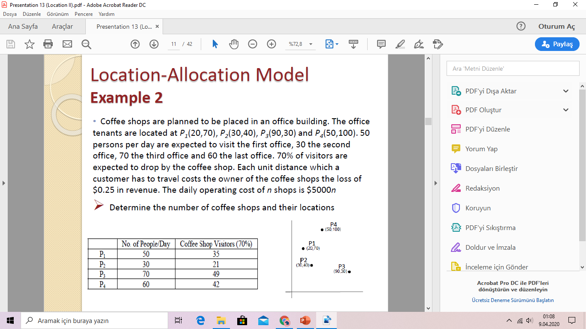
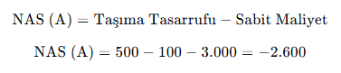

<!-- Slide number: 1 -->
# TESİS KONUM II.
Dr.Öğr.Üyesi Gökçe KILIÇKAYA ÇAKMAK
END303 TESİS PLANLAMA VE YERLEŞİM
1

<!-- Slide number: 2 -->
# TESİS KONUM II.
Bölüm 10
Konum- Atama Modeli- Location-Allocation Model
Tesis/Fabrika Konum Modeli-Plant Location Model
Ağ Konum Modelleri-Network Location Models

END303 TESİS PLANLAMA VE YERLEŞİM
2

<!-- Slide number: 3 -->
# Tesis Konum Modelleri
 Dik doğrusal Tesis Konum Problemleri
Diğer tesislerle ilişkili yeni bir tesisin konumu
Tek Tesis Minisum Konum Problemi
Tek Tesis Minimax Konum Problemi
 Ağ Konum Modelleri- Network Location Models
1- Medyanlı Problemler (Minisum) - 1-Median Problem (Minisum)
1- Merkezli Problem (Minimax) - 1-Center Problem (Mimimax)
 Konum Atama Modelleri- Location Allocation Models
Yeni tesislerin, konumlarının ve müşteri gruplarının bir tanesi tarafından hizmet verilmesini sağlayacak sayının belirlenmesi.
 Tesis/ Fabrika Konum Problemi- Plant Location Problem
Yeni tesislerin olası konumları biliniyor. Yeni tesislerin, konumlarının ve müşteri gruplarının bir tanesi tarafından hizmet verecek olanın seçilmesi.

END303 TESİS PLANLAMA VE YERLEŞİM
3

<!-- Slide number: 4 -->
# Tesis Atama Modeli
 Atamaların kapsamı:
Yeni tesislerin optimum sayısı - optimum number of new facilities
Yeni tesisler nereye konumlanacak; where new facilities are to be located
Her bir yeni tesis hangi müşterilere (var olan tesislere) hizmet edecek
 Amaçlar:
 Toplam malzeme taşıma maliyetlerinin minimizasyonu
 Toplam sabit maliyetlerin minimizasyonu

END303 TESİS PLANLAMA VE YERLEŞİM
4

<!-- Slide number: 5 -->
# Tesis Atama Modeli

END303 TESİS PLANLAMA VE YERLEŞİM
5

<!-- Slide number: 6 -->
# Tesis Atama Modeli
Mevcut tesislerin her biriyle, yalnızca bir tek yeni tesisin etkileşim içinde bulunduğunu sağlamak
END303 TESİS PLANLAMA VE YERLEŞİM
6

<!-- Slide number: 7 -->
# Tesis Atama Modeli Çözümü
 Bir sayılama (enümerasyon) algoritması uygulanarak çözülebilir.
 m Müşteri ve n tesis için, muhtemel alternatiflerin sayısı:

 Prosedür:
 n’nin her bir değeri için tüm atama kombinasyonları belirlenir/numaralandırılır.
 Her bir atama kombinasyonu için her bir yeni tesisin optimum konumu belirlenir.
 Minimum maliyetli çözüm  belirlenir.

END303 TESİS PLANLAMA VE YERLEŞİM
7

<!-- Slide number: 8 -->
# Örnek-1 (Tesis Atama Modeli)
4 Müşteri var:
Konumları: P1(0,0), P2(3,0), P3(6,0), P4(12,0)
 Ağırlıkları: w1 = w2 = w3 = 1 and w4 = 2
 n yeni tesisin kurulum maliyeti: g(n)= 5n
 Kaç adet tesisi kurulmalıdır?
 Hangi müşterilere, hangi tesisler tarafından hizmet edilmelidir?
 Bu tesisiler nereye konumlandırılmalıdır?
 Minimum toplam maliyet nedir?
 Çözüm için 4 farklı senaryo mevcuttur.
 1.n = 1
 2.n = 2
 3.n = 3
 4.n = 4

END303 TESİS PLANLAMA VE YERLEŞİM
8

<!-- Slide number: 9 -->
# Örnek-1 (Tesis Atama Modeli)

 N =1, olduğunda:
 tek tesis konum modeli olarak kolayca çözülür:
 Minisum Konum Problemi: - x koordinatı

Toplam Maliyet:
TC(n=1) = 1*(6-0) + 1*(6-3) + 1*(6-6) + 2*(12-6) + 5*1 = 26

| ai | wi | Σ wi |
| --- | --- | --- |
| 0 | 1 | 1 |
| 3 | 1 | 2 |
| 6 | 1 | 3 |
| 12 | 2 | 5 |
Toplam Ağırlığın Yarısı :  5/2 = 2.5

Tesisin Konumu:  X=6 Y=0
END303 TESİS PLANLAMA VE YERLEŞİM
9

<!-- Slide number: 10 -->
# Örnek-1 (Tesis Atama Modeli)
 N =2, olduğunda:

 Minisum tekniğiyle, her bir durum çözülür.

Toplam Maliyet:
TC(2a) (0,0) ve (6,0) için = 1*(0-0) + 1*(6-3) + 1*(6-6) + 2*(12-6) + 5*2 = 25
TC(2a) (0,0) ve (12,0) için = 1*(0-0) + 1*(12-3) + 1*(12-6) + 2*(12-12) + 5*2 = 25

Durum A.

Bu Durumlar için
Toplam Maliyetler ve
Konumlar bulunur.
| ai | wi | Σ wi |
| --- | --- | --- |
| 3 | 1 | 1 |
| 6 | 1 | 2 |
| 12 | 2 | 4 |
END303 TESİS PLANLAMA VE YERLEŞİM
10

<!-- Slide number: 11 -->
# Örnek-1 (Tesis Atama Modeli)
N =3, olduğunda;

 Olası alternatiflerin tümü için toplam maliyetler ve konumlar bulunur.
 En düşük maliyetli durum seçilir.
 N =4, olduğunda:
END303 TESİS PLANLAMA VE YERLEŞİM
11

<!-- Slide number: 12 -->
# Örnek-2 (Tesis Atama Modeli)
Bir ofis binasına, kahve dükkanı (Coffee shops) yerleştirilmesi planlanmıştır. Ofisler, sırasıyla P1(20,70), P2(30,40), P3(90,30) and P4(50,100) koordinatlarında bulunmaktadır. İlk ofis tarafından günde 50 kişinin, ikinci ofis tarafından 30 kişi, 3. ofis 70 kişi ve son ofis 60 kişi tarafından ziyaret edilmesi beklenmektedir. Ziyaretçilerin % 70’inin kahve dükkanına geçerken uğraması beklenmektedir. Bir müşterinin her defasında birim uzaklığı seyahat maliyetine sahip olup, kahve dükkanı sahibinin gelirinde 0,25 $ kayba sebep olmaktadır. N dükkanın günlük işletme maliyeti 5.000n $’dır.
Kahve dükkanı sayısını ve konumlarını bulunuz?

END303 TESİS PLANLAMA VE YERLEŞİM
12

<!-- Slide number: 13 -->
# Örnek-2 (Tesis Atama Modeli)
 N =1, olduğunda:
 tek tesis konum modeli olarak kolayca çözülür:
 Minisum Konum Problemi: - x ve y koordinatları

| ai | Wi | Σ wi |
| --- | --- | --- |
| 20 | 35 | 35 |
| 30 | 21 | 56 |
| 50 | 42 | 98 |
| 90 | 49 | 147 |
| bi | wi | Σ wi |
| --- | --- | --- |
| 30 | 49 | 49 |
| 40 | 21 | 70 |
| 70 | 35 | 105 |
| 100 | 42 | 147 |
Toplam Maliyet:
(X* , Y* )  = (50, 70)
TC(n=1)  = 0,25[35*(30) + 21*(50) + 49*(80) + 42*(30)] + 5.000*1
                = 6.820
END303 TESİS PLANLAMA VE YERLEŞİM
13

<!-- Slide number: 14 -->
# Örnek-2 (Tesis Atama Modeli)
 N =2, olduğunda:

Toplam Maliyet:
TC(n>=2) = 0,25[Seyahat Maliyeti] + 5.000*n >=10.000

 Tek bir kahve dükkânının işletme maliyeti 6.820 $ iken, Birden fazla kahve dükkanı olduğunda, her bir kahve dükkanının sabit maliyetleri ve seyahat maliyetleri 10.000 $’dan fazla olacaktır. Bu nedenle 1 kahve dükkânından fazla dükkan açılması düşüncesine ihtiyaç bulunmamaktadır.

END303 TESİS PLANLAMA VE YERLEŞİM
14

<!-- Slide number: 15 -->
# Tesis/Fabrika Konum Problemi
 Ne biliyoruz:
 Yeni tesisler için muhtemel konumları
 Belirlenenlerin kapsamı:
 Yeni tesislerin optimum sayısı
 (mevcut tesisler tarafından ) hangi müşterilere her bir yeni tesis tarafından hizmet edileceği
 Amaç:
 Tüm müşterilerin tüm taleplerini karşılayacak toplam maliyetin minimizasyonu

END303 TESİS PLANLAMA VE YERLEŞİM
15

<!-- Slide number: 16 -->
# Tesis/Fabrika Konum Problemi

END303 TESİS PLANLAMA VE YERLEŞİM
16

<!-- Slide number: 17 -->
# Tesis/Fabrika Konum Problemi
Matematiksel Model
END303 TESİS PLANLAMA VE YERLEŞİM
17

<!-- Slide number: 18 -->
# Tesis/Fabrika Konum Problemi
Basitleştirilmiş/ Sadeleştirilmiş Model

END303 TESİS PLANLAMA VE YERLEŞİM
18

<!-- Slide number: 19 -->
# Örnek-3 (Tesis Konum Problemi)
5 müşteri mevcuttur. (1, 2, 3, 4 ve 5).
 Yeni deponun konumu için bu 5 bölge düşünülmektedir. (A, B, C, D ve E)
 Her bir müşteri yalnızca bir depodan tarafından hizmet alacaktır.
 Aşağıdaki tabloda her bir alternatif bölge için toplam yıllık maliyetler gösterilmiştir.
 Eğer yalnızca 1 depo inşa etmek istiyorsak, hangi bölge seçilmelidir?
 Eğer B ve C bölgelerine 2 depo inşa edilmesine karar verilmiş ise, kaç adet ilave depo inşa edilmesi gerekir ve hangi bölgeye?

END303 TESİS PLANLAMA VE YERLEŞİM
19

<!-- Slide number: 20 -->
# Örnek-3 (Tesis Konum Problemi)
Eğer yalnızca bir depo inşa edilecekse, C konumu seçilmelidir.

END303 TESİS PLANLAMA VE YERLEŞİM
20

<!-- Slide number: 21 -->
# Örnek-3 (Tesis Konum Problemi)
Eğer B ve C bölgelerine 2 depo inşa edilmesine karar verilmiş ise,
C konumu 4 ve 5 numaralı müşterilerin,
B konumundan ise 1, 2 ve 3 numaralı müşterilerine hizmet edecektir.
Toplam Maliyet: TC=500+200+1.200+2.000+ 700+800+2.000 = 7.400

END303 TESİS PLANLAMA VE YERLEŞİM
21

<!-- Slide number: 22 -->
# Örnek-3 (Tesis Konum Problemi)
Eğer üçüncü bir depo ilave edilmesini düşünürsek, her bir Aday bölge için Net Yıllık Tasarrufu (NYT) Net Annual Savings (NAS) değerini hesaplayabiliriz:
NAS (A) = 500 -100 -3.000 = -2.600

END303 TESİS PLANLAMA VE YERLEŞİM
22

<!-- Slide number: 23 -->
# Örnek-3 (Tesis Konum Problemi)
Eğer dördüncü bir depo ilave edilmesini düşünürsek, her bir Aday bölge için Net Yıllık Tasarrufu (NYT) Net Annual Savings (NAS) değerini hesaplayabiliriz:
NAS (D) = 1.200 -300 -3.000 = -2.100

END303 TESİS PLANLAMA VE YERLEŞİM
23

<!-- Slide number: 24 -->
# ÇöZÜMLÜ ÖRNEK SORULAR VE ÇALIŞMA SORULARI

END303 TESİS PLANLAMA VE YERLEŞİM
24

<!-- Slide number: 25 -->
# Çözümlü Örnek Soru-1 (Tesis Konum Problemi)
Hv.K.K.lığı, ülkenin ege bölgesine harekat ihtiyaçlarına yönelik hizmet etmek için, Bandırma ve Datça’da bölgesel depolar konumlandırmayı planlamaktadır. Hv.K.K.lığı, 4 Bandırma ve Datça 'dan 4 arazi seçmiştir. Bu dört tesisin her biri için, Müşteri (Üs) taleplerini karşılamanın Aylık maliyeti ve yıllık kira maliyetleri aşağıdaki tabloda özetlenmiştir. Toplam maliyeti minimize edecek dağıtım merkezinin optimal büyüklüğünü belirleyiniz.

END303 TESİS PLANLAMA VE YERLEŞİM
25

<!-- Slide number: 26 -->
# Çözümlü Örnek Soru-1 (Tesis Konum Problemi)
Toplam maliyeti minimize edecek dağıtım merkezi C seçilmelidir.
Toplam Aylık/Yıllık Maliyetin optimal büyüklüğünü ise; TC = 88.000 $/Ay veya TC=1.045.000 $/Yıl olarak bulunur.

END303 TESİS PLANLAMA VE YERLEŞİM
26

<!-- Slide number: 27 -->
# Çözümlü Örnek Soru-1 (Tesis Konum Problemi)
Eğer ikinci depo ilave edilmek istenir ise; İlave depo ayarlanmasına ihtiyaç yoktur. C bölgesine yerleştirilecek depo dağıtım merkezinin Toplam maliyeti TC = 88.000 $/Ay veya TC=1.045.000 $/Yıl olarak en düşüktür.
END303 TESİS PLANLAMA VE YERLEŞİM
27