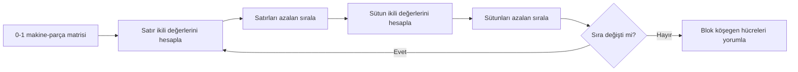
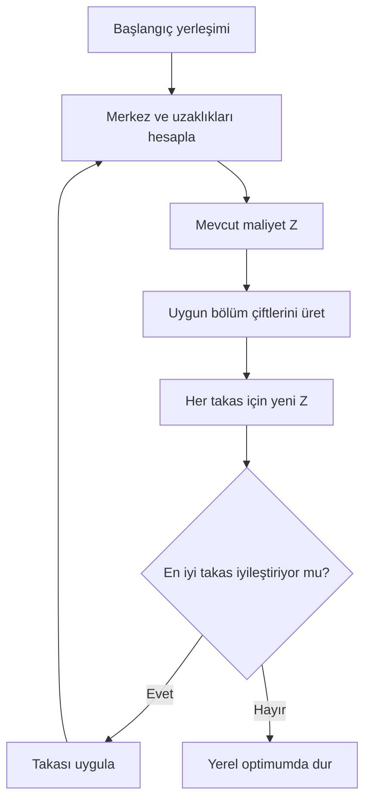
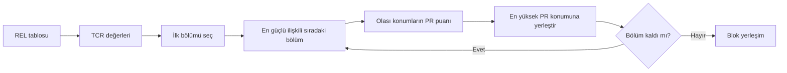
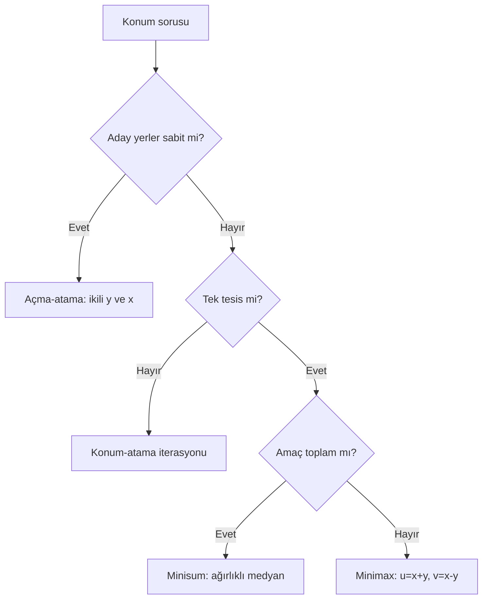
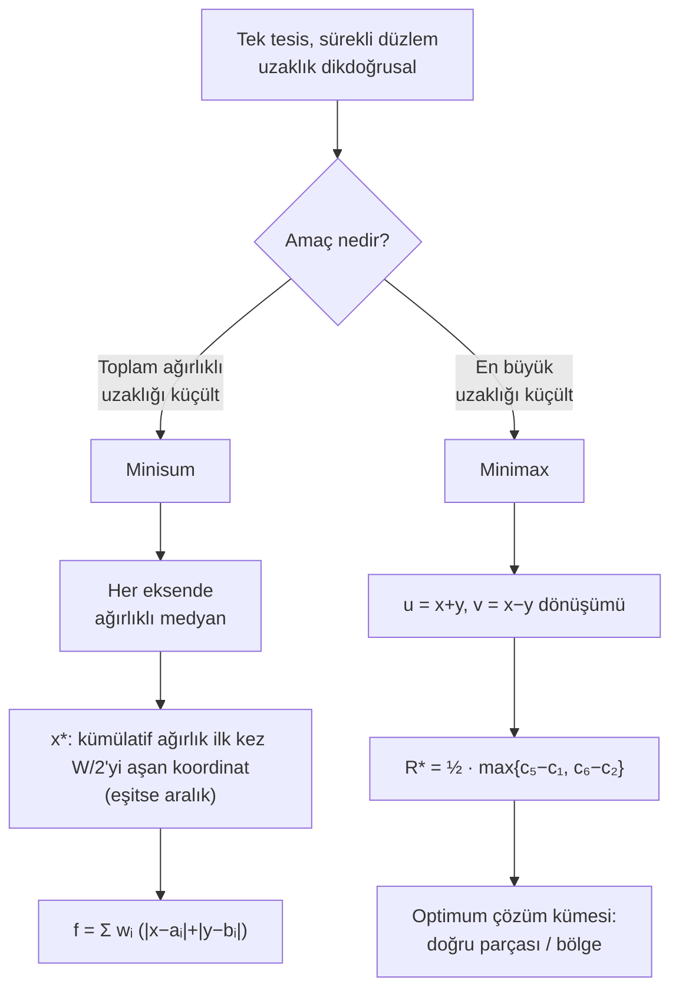
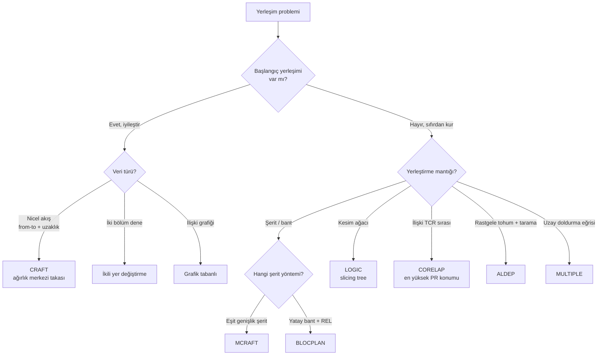
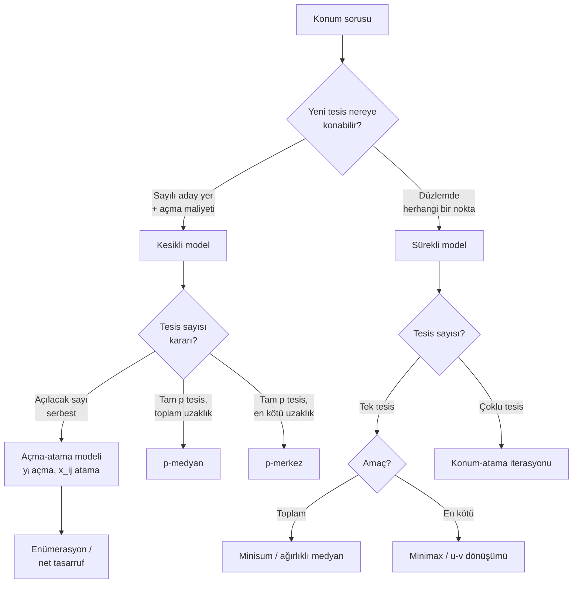

# Görsel Atlas

> [!info]
> Mermaid diyagramları Obsidian içinde canlıdır. TikZ kaynakları `07 Ekler/TikZ Kaynakları`, derlenmiş SVG'ler bu klasördedir.

## Dersin bütünü

![[07 Ekler/Diyagramlar/tesis-planlama-sureci.svg]]

![[07 Ekler/Diyagramlar/yontem-uzayi.svg]]

## Kapasite ve ilişki

![[07 Ekler/Diyagramlar/kapasite-stratejileri.svg]]

![[07 Ekler/Diyagramlar/faaliyet-iliski-diyagrami.svg]]

## ROC döngüsü

Paket: [[09 Öğrenme Paketleri/HF05A - DCA ve ROC Hücre Oluşturma|HF05A]]

## Yerleşim iyileştirme döngüsü

Paketler: [[09 Öğrenme Paketleri/HF08A - İkili Yer Değişim Yöntemi|İkili değişim]], [[09 Öğrenme Paketleri/HF08C - CRAFT Yöntemi|CRAFT]], [[09 Öğrenme Paketleri/HF09A - MCRAFT|MCRAFT]]

## CORELAP kurma mantığı

Paket: [[09 Öğrenme Paketleri/HF10A - CORELAP|HF10A]]

## Konum modelleri

Paketler: [[09 Öğrenme Paketleri/HF11A - Minisum ve Ağırlıklı Medyan|Minisum]], [[09 Öğrenme Paketleri/HF11B - Minimax ve Optimum Çözüm Kümesi|Minimax]], [[09 Öğrenme Paketleri/HF12B - Kesikli Tesis Konumu ve Açma Atama|Açma-atama]]

### Minimax çözüm kümesi

![[07 Ekler/Diyagramlar/minimax-cozum-kumesi.svg]]

## Haftalık konu haritası (HF01–HF12)

Dersin akışı: her hafta bir öncekinin üzerine kurulur. Kapasite ve süreç kararları ürünü tanımlar, akış ve alan analizi yerleşimi besler, yerleşim algoritmaları tesis içini çözer, konum modelleri ise tesisin dış dünyadaki yerini belirler.

```mermaid
flowchart LR
    H01[HF01<br/>Giriş ve ürün-süreç-çizelgeleme] --> H02[HF02<br/>Kapasite planlama / BEP]
    H02 --> H03[HF03<br/>Süreç tasarımı II / ıskarta]
    H03 --> H04[HF04<br/>Süreç III / makine-operatör]
    H04 --> H05[HF05<br/>Akış I / grup teknolojisi]
    H05 --> H06[HF06<br/>Akış II / from-to ve alan]
    H06 --> H07[HF07<br/>Yerleşim I / SLP]
    H07 --> H08[HF08<br/>Yerleşim II / CRAFT]
    H08 --> H09[HF09<br/>Yerleşim III / MCRAFT-BLOCPLAN-LOGIC]
    H09 --> H10[HF10<br/>Yerleşim IV / CORELAP-ALDEP-MULTIPLE]
    H10 --> H11[HF11<br/>Konum I / minisum-minimax]
    H11 --> H12[HF12<br/>Konum II / kesikli ve p-medyan]

    subgraph KAP[Kapasite ve süreç]
        H01
        H02
        H03
        H04
    end
    subgraph AKIS[Akış ve alan]
        H05
        H06
    end
    subgraph YER[Yerleşim algoritmaları]
        H07
        H08
        H09
        H10
    end
    subgraph KON[Konum modelleri]
        H11
        H12
    end
```

## Minisum vs Minimax karar akışı

Tek tesis sürekli konum probleminde amaç fonksiyonu yöntemi belirler: **toplam** maliyet minisum'a, **en kötü** uzaklık minimax'a götürür.

Paketler: [[09 Öğrenme Paketleri/HF11A - Minisum ve Ağırlıklı Medyan|Minisum]], [[09 Öğrenme Paketleri/HF11B - Minimax ve Optimum Çözüm Kümesi|Minimax]]

## Yerleşim algoritmaları karar ağacı

Önce **iyileştirme mi kurma mı** sorusu sorulur: elde bir yerleşim varsa iyileştir, yoksa sıfırdan kur. Sonra veri türü (from-to mu, REL mi) alt yöntemi belirler.

Paketler: [[09 Öğrenme Paketleri/HF08C - CRAFT Yöntemi|CRAFT]], [[09 Öğrenme Paketleri/HF09A - MCRAFT|MCRAFT]], [[09 Öğrenme Paketleri/HF09B - BLOCPLAN|BLOCPLAN]], [[09 Öğrenme Paketleri/HF09C - LOGIC ve Kesim Ağacı|LOGIC]], [[09 Öğrenme Paketleri/HF10A - CORELAP|CORELAP]], [[09 Öğrenme Paketleri/HF10B - ALDEP|ALDEP]], [[09 Öğrenme Paketleri/HF10C - MULTIPLE|MULTIPLE]]

## Kesikli vs sürekli konum karar akışı

Yeni tesisin yerleşebileceği nokta kümesi modeli belirler: **her koordinat** serbestse sürekli, yalnız **sayılı aday** varsa kesikli model kullanılır.

Paketler: [[09 Öğrenme Paketleri/HF12A - Konum Atama ve Tesis Sayısı|Konum-atama]], [[09 Öğrenme Paketleri/HF12B - Kesikli Tesis Konumu ve Açma Atama|Açma-atama]]

## NumPy Grafikleri ve Hesap Görselleri

Bu bölümdeki grafikler, ders notlarındaki matematiksel algoritmaların sayısal sonuçlarını görsel olarak anlamanıza yardımcı olması için Python ve NumPy ile üretilmiştir.

### 1. Kapasite ve Finans
#### Başa Baş Noktası Analizi
![[07 Ekler/Grafikler/basa-bas-grafigi.svg]]
* **Açıklama:** Sabit maliyetler ($F$), birim satış fiyatı ($P$) ve birim değişken maliyet ($V$) arasındaki ilişkiyi gösterir. Katkı payı doğrusu ve toplam maliyet doğrusunun kesişim noktası **Başa Baş Satış Hacmi** ($BEP = F/(P-V)$) olarak işaretlenmiştir.

#### Operatör-Makine Atama Maliyet Eğrisi
![[07 Ekler/Grafikler/operator-makine-maliyet.svg]]
* **Açıklama:** Bir operatöre atanan makine sayısı ($m$) arttıkça, birim başına düşen toplam üretim maliyetinin değişimini gösterir. Operatör aylak süresi ile makine aylak süresi arasındaki ekonomik dengenin minimum noktasını ($m^*$) görselleştirir.

---

### 2. Hücre Tasarımı ve Akış
#### DCA / ROC Hücre Oluşturma
![[07 Ekler/Grafikler/roc-kumeleme.svg]]
* **Açıklama:** Sol tarafta unclustered (düzensiz) 0-1 makine-parça matrisi, sağ tarafta ise **ROC (Rank Order Clustering)** algoritması çalıştırıldıktan sonra blok-köşegen yapısına kavuşan matris görülmektedir. Kırmızı ve yeşil kesikli çizgiler, bağımsız imalat hücrelerini (Machine-Part Cells) temsil eder.

#### Hollier Akış Şeması (Backtracking Analizi)
![[07 Ekler/Grafikler/hollier-akis-semasi.svg]]
* **Açıklama:** Makinelerin Hollier sıralama oranına ($Ratio = Toplam Çıkış / Toplam Giriş$) göre soldan sağa dizilimini ve aralarındaki malzeme akışlarını ($f_{ij}$) gösterir. Üstteki yeşil yaylar ileri akışları, alttaki kırmızı yaylar ise geriye akışları (backtracking) temsil eder. Amaç, kırmızı yayların toplam şiddetini minimize etmektir.

#### Akış Şiddeti (From-To Matrisi)
![[07 Ekler/Grafikler/from-to-matrisi.svg]]
* **Açıklama:** Bölümler arasındaki akış yoğunluğunu (yük/dönem) sayısal ve renk yoğunluğuyla gösteren From-To ısı haritasıdır.

---

### 3. Tesis Konumu
#### Dikdoğrusal Minisum Konumu
![[07 Ekler/Grafikler/minisum-konum.svg]]
* **Açıklama:** Düzlemdeki mevcut tesislere olan toplam ağırlıklı mesafeyi minimize eden tek yeni tesisin konumunu gösterir. Optimal koordinat, her eksende bağımsız olarak ağırlıklı medyan ile bulunur.

#### Dikdoğrusal Minimax Geometrisi
![[07 Ekler/Grafikler/minimax-geometri.svg]]
* **Açıklama:** Maksimum dikdoğrusal mesafeyi minimize eden optimum noktaların kümesini gösterir. U-V koordinat dönüşümüyle elde edilen optimum çözüm, bu örnekte kırmızı renkli doğru parçasıdır. Çözüm kümesinin sınırları Manhattan çemberleriyle çevrelenmiştir.

#### Kesikli Tesis Konumu (Açma ve Atama Çözümü)
![[07 Ekler/Grafikler/kesikli-konum-atama.svg]]
* **Açıklama:** Sabit açma maliyeti olan aday konumlar arasından hangilerinin seçildiğini (açık yeşil üçgenler) ve hangi müşterilerin (mavi daireler) hangi açık tesislere atandığını (kesikli çizgilerle yönlendirmeler) gösterir.
