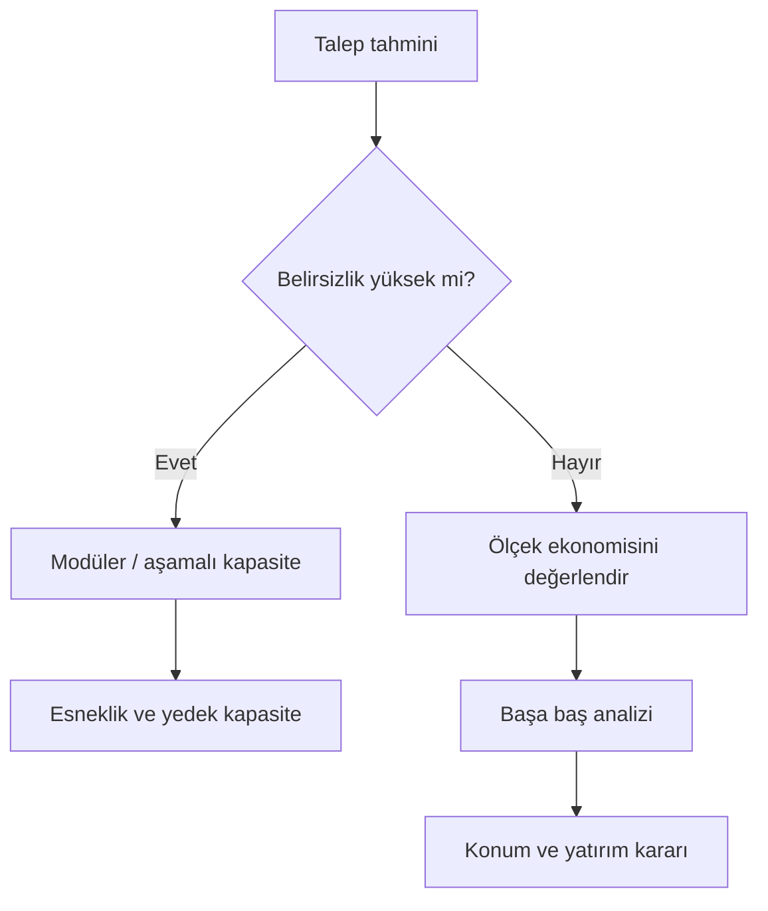

# HF02 - Tesis Kapasite Planlama

!!! abstract "Ana fikir"
> Kapasite planı, talebin **ne zaman ve ne kadar** karşılanacağını belirler. Çok az kapasite satış ve hizmet kaybına; fazla kapasite ise atıl yatırım ve yüksek sabit maliyete yol açar.

## Kapasite stratejileri

| Strateji | Davranış | Avantaj | Risk |
|---|---|---|---|
| Öncü | Kapasite talebin önünde | Hizmet düzeyi ve büyüme fırsatı | Atıl kapasite |
| Takipçi | Kapasite talep kesinleşince artar | Düşük yatırım riski | Talep kaçırma |
| Eş zamanlı | Küçük ve sık artışlar | Dengeli risk | Sık yatırım ve geçiş maliyeti |

## Temel ölçüler

$$
U=\frac{Q_{gerçek}}{Q_{en\ iyi\ işletim}}
$$

Slayttaki örnekte $Q_{gerçek}=83$ ve $Q_{en\ iyi}=120$ için:

$$U=\frac{83}{120}=0{,}6917\approx 69\%$$

### Ölçek ve kapsam ekonomisi

- **Ölçek ekonomisi:** Üretim hacmi arttıkça sabit maliyetler yayılır ve birim maliyet düşer.
- **Ölçek ekonomisizliği:** Koordinasyon ve karmaşıklık arttığında birim maliyet yeniden yükselir.
- **Kapsam ekonomisi:** Birden fazla ürünün ortak kaynak kullanması toplam maliyeti düşürür.

## Başa baş analizi

$$TR=Px, \qquad TC=F+Vx$$

$$
x_{BB}=\frac{F}{P-V}, \qquad
\Pi=(P-V)x-F
$$

Burada $P$ birim fiyat, $V$ birim değişken maliyet, $F$ sabit maliyet ve $x$ üretim miktarıdır.

!!! example "Yap veya satın al"
> Dışarıdan alım maliyeti $c_1x$, içeride üretim maliyeti $K+c_2x$ olsun:
> $$x^*=\frac{K}{c_1-c_2}$$
> $x>x^*$ ise yalnız maliyet açısından içeride üretim avantajlıdır. Kalite, gizlilik, tedarik riski ve esneklik ayrıca değerlendirilir.

!!! warning "Sık hata"
> Tasarım kapasitesi, etkin kapasite ve gerçekleşen çıktı aynı değildir. Paydanın hangi kapasite tanımı olduğu açıkça yazılmalıdır.

## Kaynaklar

- HF2-P2-Tesis Kapasite Planlama-2025.pptx|Ders sunumu
- 05 Kaynaklar/MarkItDown/HF02 - Ham|MarkItDown ham metni
- 03 Formüller/Formül Föyü#Kapasite ve maliyet|Formül föyü
- 08 Hesaplamalar/Hesap Sonuçları#Grafikler|Python grafikleri

Önceki: HF01 - Giriş ve Ürün, Süreç, Çizelgeleme Tasarımı I · Sonraki: HF03 - Ürün, Süreç ve Çizelgeleme Tasarımı II
