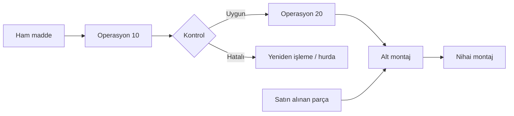

# HF03 - Ürün, Süreç ve Çizelgeleme Tasarımı II

!!! abstract "Ana fikir"
> Süreç tasarımı, ürünün **hangi işlemlerle, hangi sırada ve hangi kaynaklarla** üretileceğini tanımlar. Çizelge tasarımı ise bu yapıyı talep miktarına dönüştürür.

## Süreç tasarımının üç kararı

1. **Süreci belirle:** Yap/satın al, gerekli parçalar ve malzemeler.
2. **Süreci seç:** Alternatif yöntem, makine, teknoloji ve rota.
3. **Süreci sırala:** Montaj şeması, operasyon süreç şeması ve öncelik diyagramı.

| Doküman | Cevapladığı soru |
|---|---|
| Parça listesi | Ürün hangi parçalardan oluşur? |
| Malzeme listesi (BOM) | Ne kadar ve hangi malzeme gerekir? |
| Rota kartı | Parça hangi operasyonlardan geçer? |
| Montaj şeması | Bileşenler nasıl birleşir? |
| Operasyon süreç şeması | İşlem ve kontrollerin sırası nedir? |
| Öncelik diyagramı | Hangi görev hangisinden önce bitmelidir? |

## Pazarlama bilgisinden çizelgeye

Pazarlamadan beklenen veriler ürün karması, dönemsel talep, teslim zamanı, büyüme ve belirsizliktir. Pareto yaklaşımıyla az sayıdaki yüksek hacimli ürün, toplam üretimin büyük bölümünü oluşturabilir:

- yüksek hacim / düşük çeşitlilik → ürün odaklı akış,
- düşük hacim / yüksek çeşitlilik → süreç odaklı akış,
- orta hacim / orta çeşitlilik → hücresel yaklaşım.

## Iskarta payı

Tek aşamada iyi ürün hedefi $O$ ve ıskarta oranı $s$ ise:

$$I=\frac{O}{1-s}$$

Ardışık $n$ aşama için hesap son operasyondan geriye doğru yapılır:

$$I_1=\frac{O_n}{\prod_{k=1}^{n}(1-s_k)}$$

!!! tip "> Düşük hacimli ve rassal hata durumlarında yalnız beklenen değere güvenmek yerine binom dağılımı ile hedef güven düzeyi dikkate alınır."

## Kaynaklar

- HF3-P3-Ürün, Süreç ve Çizelgeleme Tasarımı II-2025.pptx|Ders sunumu
- 05 Kaynaklar/MarkItDown/HF03 - Ham|MarkItDown ham metni
- 03 Formüller/Formül Föyü#Fire ve süreç miktarı|Formül föyü

Önceki: HF02 - Tesis Kapasite Planlama · Sonraki: HF04 - Ürün, Süreç ve Çizelgeleme Tasarımı III
