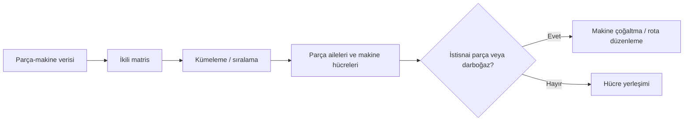

# HF05 - Akış, Alan ve Etkinlik İlişkileri I

!!! abstract "Ana fikir"
> Bölüm planlamasında amaç, benzer işlem rotalarına sahip parçaları ve bu parçaları işleyen makineleri **üretim hücreleri** halinde gruplayarak taşıma, WIP ve beklemeyi azaltmaktır.

## Hacim-çeşitlilik ve yerleşim

| Ürün hacmi | Ürün çeşitliliği | Uygun yaklaşım |
|---|---|---|
| Yüksek | Düşük | Ürün/hat yerleşimi |
| Orta | Orta | Grup teknolojisi ve hücresel imalat |
| Düşük | Yüksek | Süreç/atölye yerleşimi |

## Grup teknolojisi

Grup teknolojisi, benzer tasarım veya üretim özelliklerine sahip parçaları **parça aileleri** olarak tanımlar. Hücresel imalat bu ailelere gerekli makineleri yakınlaştırır.

## Parça-makine oluşum matrisi

$$
a_{ij}=\begin{cases}
1, & \text{parça }i\text{, makine }j\text{ üzerinde işlem görür}\cr
0, & \text{aksi halde}
\end{cases}
$$

İdeal yeniden sıralamada 1'ler köşegen boyunca bloklar oluşturur. Blok dışındaki 1'ler **istisnai eleman**, blok içindeki 0'lar **boşluk** olarak yorumlanır.

## Kümeleme yaklaşımları

| Yöntem | Temel fikir |
|---|---|
| Doğrudan Kümeleme (DCA) | Satır/sütun benzerliğine göre 1'leri bloklaştırır |
| İkili Sıralama (ROC) | Satır ve sütunları ikili sayısal ağırlıklarla tekrar sıralar |
| Küme Tanılama | Benzerlik ölçülerinden parça/makine grupları çıkarır |
| Maliyet Analizi | Hücre içi ve hücreler arası taşıma maliyetini karşılaştırır |
| Hollier | Akış matrisinden bölüm sırası geliştirir |

## Hücresel imalatın etkileri

**Beklenen kazanımlar:** kısa akış, düşük WIP, kısa hazırlık ve teslim süresi, yüksek kalite sahipliği.  
**Riskler:** makine tekrarı, dengesiz hücre yükü, ürün karması değişiminde bozulma ve hücreler arası istisnai akış.

> [!question] Kendini sınama
> Parça-makine matrisinde blok dışındaki iki istisnai parça için hangi seçenekler değerlendirilebilir? Makine çoğaltma, alternatif rota, taşeronluk ve hücreler arası taşıma maliyetlerini karşılaştır.

## Kaynaklar

- HF5-P5-Akış, Alan ve Etkinlik İlişkileri I 2025.pptx|Ders sunumu
- 05 Kaynaklar/MarkItDown/HF05 - Ham|MarkItDown ham metni

Önceki: HF04 - Ürün, Süreç ve Çizelgeleme Tasarımı III · Sonraki: HF06 - Akış, Alan ve Etkinlik İlişkileri II
