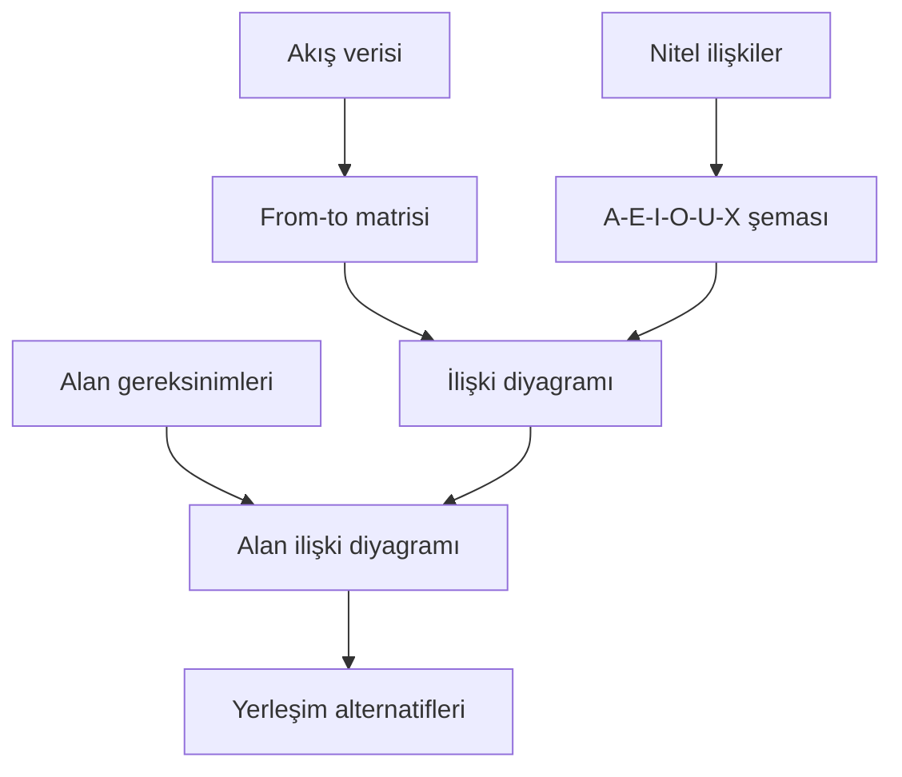

# HF06 - Akış, Alan ve Etkinlik İlişkileri II

!!! abstract "Ana fikir"
> Etkin yerleşim için yalnız malzeme miktarı değil; insan, bilgi, güvenlik ve destek ilişkileri de ölçülür. **From-to matrisi** nicel akışı, **ilişki şeması** ise nitel yakınlık gereksinimini temsil eder.

## Akış seviyeleri

- **Tesisler arası:** tedarikçi, fabrika, depo ve müşteri ağı.
- **Bölümler arası:** üretim alanları arasındaki yük hareketi.
- **Bölüm içi:** iş istasyonları arasındaki rota.
- **İş istasyonu içi:** operatörün el, göz ve ekipman hareketleri.

İyi akış; doğrudan, kesintisiz, geri dönüşsüz, çaprazlaşması az ve güvenli olmalıdır.

## From-to matrisi

$f_{ij}$, $i$ bölümünden $j$ bölümüne dönemsel akış olsun. Yerleşimin taşıma ölçütü:

$$
M=\sum_i\sum_j f_{ij}\,c_{ij}\,d_{ij}
$$

$c_{ij}$ birim yük-birim mesafe maliyeti, $d_{ij}$ bölümler arası uzaklıktır. Tek yönlü matris yön bilgisini; toplam akış matrisi $f_{ij}+f_{ji}$ yakınlık şiddetini gösterir.

## Faaliyet ilişki şeması

| Kod | Anlam | Tipik ağırlık |
|:---:|---|---:|
| A | Mutlaka yakın | 64 |
| E | Özellikle önemli | 16 |
| I | Önemli | 4 |
| O | Olağan yakınlık | 1 |
| U | Önemsiz | 0 |
| X | Yakınlık istenmez | negatif / kısıt |

!!! warning "> A-E-I-O-U-X ağırlıkları evrensel sabit değildir. Kullanılan puan sistemi raporda açıkça belirtilmelidir; X ilişkisi yalnız düşük puan değil, çoğu zaman sert kısıttır."

## Alan gereksinimi

Toplam bölüm alanı yalnız makine taban alanı değildir:

$$A_{bölüm}=A_{makine}+A_{operatör}+A_{WIP}+A_{koridor}+A_{bakım}+A_{güvenlik}$$

Alan katsayısı yaklaşımında net makine alanı deneysel bir genişleme katsayısıyla çarpılır; ayrıntılı tasarımda her unsur ayrı hesaplanır.

## Kaynaklar

- HF6-P6-Akış, Alan ve Etkinlik İlişkileri II 2025.pptx|Ders sunumu
- 05 Kaynaklar/MarkItDown/HF06 - Ham|MarkItDown ham metni
- 03 Formüller/Formül Föyü#Akış ve yerleşim maliyeti|Formül föyü
- 08 Hesaplamalar/Hesap Sonuçları#Grafikler|From-to grafiği

Önceki: HF05 - Akış, Alan ve Etkinlik İlişkileri I · Sonraki: HF07 - Yerleşim Tasarımı I
