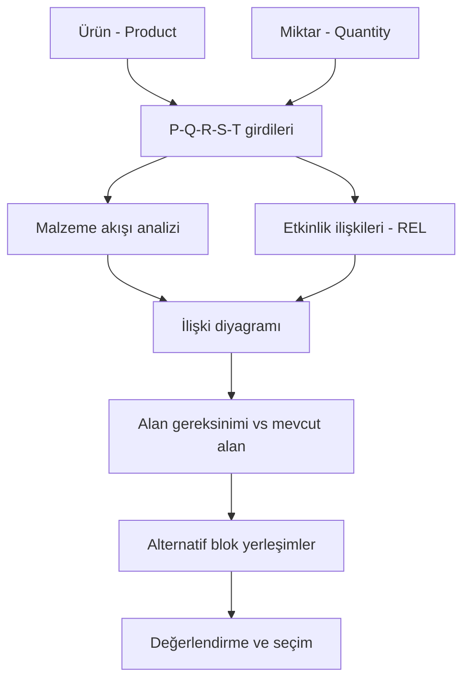
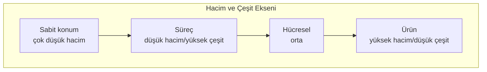

# HF07 - Yerleşim Tasarımı I

!!! abstract "Ana fikir"
> Yerleşim tasarımı; işgücü, malzeme, makine ve ekipman gibi fiziksel kaynakları kapasite, maliyet, akış, güvenlik ve ergonomi hedeflerini sağlayacak şekilde alana yerleştirir. Doğru yerleşim **tipi** ürün hacmi ve çeşitliliğiyle uyumlu seçilmeli, doğru yerleşim **planı** ise sistematik bir prosedürle (SLP) üretilip nicel ve nitel ölçütlerle değerlendirilmelidir.

## 1. Kavramsal Açıklama

### Neden önemli?
Tesis yerleşimi (facility layout); departmanların, iş merkezlerinin, ekipmanların ve işlerin sistem boyunca hareketlerine göre düzenlenmesidir. Bir işletme için üç açıdan kritiktir:

1. **Yüksek maliyet ve çaba:** Önemli miktarda para ve emek gerektirir.
2. **Uzun dönemli ve geri dönüşü zor karar:** Yapılan hatayı düzeltmek (makineyi sökmek, binayı yeniden bölmek) pahalı ve zordur.
3. **Operasyonel etki:** Malzeme taşıma maliyeti, üretim süresi, WIP (süreç içi stok) ve performans doğrudan yerleşime bağlıdır.

> Gerçek hayat: Bir hastane acil servisinde radyolojinin triyaj odasına uzak olması her hastayı dakikalarca geciktirir; bir montaj fabrikasında boyahanenin montajdan uzak olması her gün yüzlerce gereksiz forklift turuna yol açar. Yerleşim, "bir kerelik" gibi görünen ama yıllarca her gün maliyet üreten bir karardır.

### Nasıl çalışır? (büyük resim)
Yerleşim problemi iki düzeyde ele alınır:

- **Blok yerleşim (block layout):** Bölümlerin yalnızca **boyutu ve göreli konumu** belirlenir.
- **Detaylı yerleşim (detailed layout):** Makine, iş istasyonu, raf, kapı, koridor ve servislerin **kesin konumu** belirlenir.

Önce blok düzeyinde ilişki ve alan bloklarını doğrulamak, sonra detaylandırmak doğru sıradır.

## 2. Yerleşim Tipleri

Üretim türü yerleşim şeklini belirleyen **en önemli** etkendir. Dört temel tip ve bir hibrit model vardır.

| Tip | Uygun koşul | Örnek | Güçlü yön | Zayıf yön |
|---|---|---|---|---|
| **Ürün** (Product) | Yüksek hacim, standart ürün | Sony TV hattı, Toyota Scion | Hızlı, basit, yönlü akış; düşük birim maliyet; düşük WIP; kalifiye olmayan işçilik | Düşük esneklik; darboğaza bağımlılık; devasa yatırım; düşük motivasyon |
| **Süreç** (Process) | Düşük hacim, yüksek çeşit | Hastane, atölye, banka | Rota/ürün esnekliği; yüksek makine kullanımı; arıza ve hacim değişimine gürbüz | Uzun taşıma, yüksek WIP; çizelgeleme zor; uzun hazırlık; nitelikli işgücü |
| **Sabit konum** (Fixed-position) | Büyük/ağır/hantal ürün, düşük talep | Gemi, uçak, köprü | Ürün hareket etmez; düşük taşıma maliyeti; takım çalışması | Makine taşıma/kurulum maliyeti; düşük ekipman kullanımı; kalifiye işçi |
| **Hücresel** (Cell / Grup) | Ürün aileleri | Hallmark, ambulans üretimi | Ürün + süreç avantajının birleşimi; kısa akış; takım sahipliği | Hücre dengeleme zor; dengesiz hücre WIP artırır |
| **Hibrit** | Karma gereksinim | — | Yerel optimizasyon | Yönetim karmaşıklığı |

!!! note "Hizmet sektörü"
> Süreç tipi yerleşim hizmet sektöründe çok yaygındır: hastaneler, okullar, bankalar, hava yolları, kütüphaneler. Ayrıca özelleşmiş türler vardır: **Ofis** (bilgi akışı), **Mağaza** (yüksek marjlı ürünü sergileme), **Depo** (depolama–taşıma dengesi).

## 3. Süreç Yerleşiminde Taşıma Maliyeti

Süreç odaklı yerleşimde en genel amaç, departmanları **taşıma maliyetini minimize edecek** şekilde düzenlemektir. Yüksek akışlı bölümler yan yana yerleştirilir.

$$
Z=\sum_{i=1}^{n}\sum_{j=1}^{n} X_{ij}\,C_{ij}\,d_{ij}
$$

| Sembol | Anlam | Birim |
|---|---|---|
| $n$ | departman/iş merkezi sayısı | adet |
| $i,j$ | bireysel departmanlar | — |
| $X_{ij}$ (veya $f_{ij}$) | $i$'den $j$'ye taşınan yük/akış miktarı | yük/dönem |
| $C_{ij}$ | bir yükü $i$'den $j$'ye taşıma birim maliyeti | TL/(yük·birim) |
| $d_{ij}$ | $i$–$j$ arası uzaklık (veya komşuluk katsayısı) | birim |
| $Z$ | toplam dönemsel taşıma maliyeti | TL/dönem |

!!! warning "Komşuluk katsayısı ≠ gerçek uzaklık"
> HF07 Örnek-1'de uzaklık yerine **katsayı** kullanılır: komşu çift için $d=1$, komşu olmayan için $d=2$. Bu gerçek geometrik mesafe değildir; sorunun tanımladığı kuralı **aynen** uygula. Ayrıca bu kaynak örneği, ortak köşeyi de komşu sayar (ileri köşede detay).

### 3.1 Tam Çözümlü Örnek-1 (Süreç yerleşimi, 6 bölüm)
!!! example "Kaynak: HF07 slayt 28–33"
> 6 departman; her biri 20×20 ft; bina 60 ft uzun, 40 ft geniş (2×3 ızgara). Komşu çift maliyeti 1 \$, komşu olmayan 2 \$. Toplam $6!=720$ olası çözüm vardır. Haftalık çift akışları: $F_{12}=50$, $F_{13}=100$, $F_{16}=20$, $F_{23}=30$, $F_{24}=50$, $F_{25}=10$, $F_{34}=20$, $F_{36}=100$, $F_{45}=50$.

**Başlangıç yerleşimi** (1=Montaj, 2=Boya, 3=Talaşlı imalat, 4=Teslim alma, 5=Sevkiyat, 6=Test):

| 1 | 2 | 3 |
|---|---|---|
| 4 | 5 | 6 |

Kaynağın komşuluk kuralıyla (köşe teması da komşu) katkılar:

| Çift | Akış | Katsayı $d$ | Katkı |
|---|---:|---:|---:|
| 1-2 | 50 | 1 | 50 |
| 1-3 | 100 | 2 | 200 |
| 1-6 | 20 | 2 | 40 |
| 2-3 | 30 | 1 | 30 |
| 2-4 | 50 | 1 | 50 |
| 2-5 | 10 | 1 | 10 |
| 3-4 | 20 | 2 | 40 |
| 3-6 | 100 | 1 | 100 |
| 4-5 | 50 | 1 | 50 |

$$Z_0 = 50+200+40+30+50+10+40+100+50 = 570\ \$$$

**İyileştirme:** 1 ve 2 yer değiştirir → yerleşim `2 1 3 / 4 5 6`. Bu, yüksek akışlı 1-3 çiftini (100) komşu yapar ($d$: 2→1):

$$Z_1 = 50+100+20+60+50+10+40+100+50 = 480\ \$$$

$$\text{Tasarruf}=570-480=90\ \$ \quad(\%15{,}79)$$

> [!success] Sonuç
> İyileştirilmiş yerleşim haftada 90 \$ tasarruf sağlar. Belirleyici hamle, en yüksek akışlı çifti (1-3 = 100) komşu konuma getirmektir.

## 4. Sistematik Yerleşim Planlama (SLP)

**Richard Muther** tarafından geliştirilen, geniş kabul gören sistematik bir prosedürdür. Sistematik düzenlemeden önce fabrika sistemi kurulur: önce üretim bölümleri, sonra yardımcı bölümler (teslim alma, depolama, kalite kontrol, bakım), en son hizmet bölümleri (muhasebe, satın alma) eklenir.

### 4.1 P-Q-R-S-T girdileri

| Harf | İngilizce | Türkçe |
|---|---|---|
| **P** | Product | Ürün |
| **Q** | Quantity | Miktar |
| **R** | Routing | Rota / iş akışı |
| **S** | Supporting services | Yardımcı hizmetler |
| **T** | Time | Zaman |

### 4.2 SLP Algoritması (Muther adımları)

1. **Girdi verileri ve faaliyetler** — Operasyon süreç şeması, malzeme listesi (BOM).
2. **Malzeme akışı** — Akış süreç şeması, geliş-gidiş matrisi (from-to chart).
3. **Faaliyet ilişkileri** — İlişki şeması (A-E-I-O-U-X yakınlık değerleriyle nitel akış).
4. **İlişki diyagramı** — Etkinlikleri mekânsal olarak (2 boyutlu) konumlar.
5. **Alan gereksinimleri** — Her bölümün ihtiyaç duyduğu alan.
6. **Mevcut alan** — Kullanılabilir alan.
7. **Alan ilişki diyagramı + nicel analiz** — İlişki diyagramı ile alanı birleştirir.
8. **Değiştirici hususlar ve kısıtlar** — Pratik sınırlamalar.
9. **Alternatif düzenlemeler** — Birkaç uygun blok yerleşim üretilir (mekanik değil; sezgi, yargı, deneyim önemli).
10. **Değerlendirme ve seçim** — Çok ölçütlü değerlendirme.

> Adım 1–2: **Girdi**; 3–8: **Analiz**; 9–10: **Arama ve Seçim**.

## 5. Bilgisayarlı Yerleşim Planlama ve Algoritma Sınıflandırması

Yerleşim planlamada üç tür bilgi işlenir:

| Bilgi türü | Örnek |
|---|---|
| **Nicel** | Alan, maliyet, bölümler arası uzaklık, toplam akış |
| **Nitel** | Tasarımcı öncelikleri, etkinlik ilişki şeması |
| **Grafik** | Blok planın çizimi |

Çoğu prosedür **birim kareler (unit squares)** yaklaşımını kullanır: her bölüm, birim alanın tam katı kadar birim kareyle temsil edilir. Komşulukları belirlemek kolaydır ama görsel canlandırma zordur. İki kural zorunludur:

- **Komşuluk/Bağlantılılık:** Bir bölümün kareleri yan yana ve tek parça olmalıdır.
- **Çevrelenmiş boşluk yok:** Bir bölüm kapalı bir iç avlu (atrium) oluşturamaz.

### Algoritma sınıflandırması (3 konsept)

| Sınıf | Başlangıç | Ne yapar | Örnek |
|---|---|---|---|
| **Kurma** (Construction) | Boş alan | Sıfırdan yerleşim oluşturur (seçme + sıralama) | Grafik tabanlı, CORELAP, ALDEP |
| **İyileştirme** (Improvement) | Mevcut yerleşim | Değişimlerle geliştirir | İkili değişim, CRAFT |
| **Değerlendirme** (Evaluation) | Verilen yerleşim | İyi yerleşimi kötüden ayırır | Komşuluk/uzaklık puanı |

## 6. Yerleşim Değerlendirme

### 6.1 Komşuluk esaslı puan
Yalnız ortak sınır paylaşan (komşu) çiftlerin ilişki değerini büyütür.

$$
S_A=\sum_{i<j} w_{ij}\,x_{ij},\qquad
x_{ij}=\begin{cases}1,&i,j\text{ ortak sınır paylaşıyor}\\0,&\text{aksi halde}\end{cases}
$$

Tipik ağırlıklar:

| REL | A | E | I | O | U | X |
|---|---:|---:|---:|---:|---:|---:|
| $w$ | 8 | 4 | 2 | 1 | 0 | -8 |

Amaç $S_A$'yı **maksimize** etmektir. Normalize etkinlik oranı (slayt 58):

$$
\eta=\frac{\sum_{i<j} w_{ij}x_{ij}}{\sum_{i<j} w_{ij}}
$$

### 6.2 Uzaklık esaslı maliyet
$$
Z_D=\sum_i\sum_{j\ne i} f_{ij}\,c_{ij}\,d_{ij},\qquad
d_{ij}=|x_i-x_j|+|y_i-y_j|\ \text{(dik doğrusal)}
$$

Amaç $Z_D$'yi **minimize** etmektir.

### 6.3 Tam Çözümlü Örnek-3 (Komşuluk puanı)
!!! example "Kaynak: HF07 slayt 56–57"
> 7 bölümlü yerleşimde komşu çiftlerin REL değerleri verilmiştir. $A=8,E=4,I=2,O=1,U=0,X=-8$ ile puanı bulun.

| Komşu çift | REL | Puan |
|---|:---:|---:|
| 1-2 | E | 4 |
| 1-3 | O | 1 |
| 3-7 | U | 0 |
| 1-6 | U | 0 |
| 2-4 | E | 4 |
| 2-6 | O | 1 |
| 6-7 | E | 4 |
| 5-6 | A | 8 |
| 4-5 | I | 2 |

$$S_A = 4+1+0+0+4+1+4+8+2 = 24$$

> [!success] Sonuç
> Yerleşim puanı **24**'tür. Yalnız gerçek ortak sınırlar sayılmıştır; bu değerlendirme adımında köşe teması komşuluk sayılmaz.

## 7. İlişki Diyagramı Kurma (Metot I ve Metot II)

REL şemasını öncelik sırasıyla mekânsal yakınlığa dönüştürür. Sıra: $A>E>I>O>U$; `X` ayrıca kaçınılması gereken ilişki olarak denetlenir.

### Metot I
1. "A" ilişkili bölümleri yerleştir.
2. "E" ilişkilerini ekle ve yeniden düzenle.
3. "X" ilişkilerini ayıracak biçimde düzenle.
4. "I", sonra "O" ilişkilerini işle.
5. Kalan bölümleri ekle, önem sırasını kontrol et.

### Metot II
1. En çok "A" ilişkisi olan ilk bölümü seç (bağda E, sonra I ile çöz).
2. İlk bölümle "A" ilişkili ikinci bölümü seç.
3. Her aday için yerleştirilmiş bölümlerle **ilişki imzasını** çıkar.
4. İmzaları öncelik dizisiyle karşılaştır:
$$AA>AE>AI>A*>EE>EI>E*>II>I*\quad(* = O\text{ veya }U)$$
5. Adayı en güçlü ilişkilerine yakın konuma ekle; tüm bölümler bitene kadar tekrarla.

### 7.1 Tam Çözümlü Örnek-6 (Metot II)
!!! example "Kaynak: HF07 slayt 71–81"
> 7 bölümün REL çalışma tablosundan yerleştirme sırasını bul.

A ilişkisi yalnız D5-D6'dadır; D6'nın E ilişkisi (D7 ile) olduğundan kaynak **D6**'yı ilk seçer. Sonra D6 ile A ilişkili **D5**, ardından D7 (EI imzası), D2 (II*), D4 (EI**), D1 (EI***), D3:

$$\boxed{6-5-7-2-4-1-3}$$

Alanları birim kareye çevirme ($a_0=2000$ ft²):

| Bölüm | Fonksiyon | Alan (ft²) | Birim kare |
|---|---|---:|---:|
| D1 | Alma | 12.000 | 6 |
| D2 | Tornalama | 8.000 | 4 |
| D3 | Pres | 6.000 | 3 |
| D4 | Vida Makinesi | 12.000 | 6 |
| D5 | Montaj | 8.000 | 4 |
| D6 | Paketleme | 12.000 | 6 |
| D7 | Gönderme | 12.000 | 6 |

Toplam **35** birim kare. Yuvarlama gerekirse tavan ($\lceil A_i/a_0\rceil$) kullanılır.

## 8. Pratik Sorular

> [!question] Soru 1
> Bir süreç yerleşiminde A-B arası 40, B-A arası 10 yük taşınıyor. Uzaklık 3 birim, iki yönde birim maliyet 2 TL/yük olsun. Yönlü from-to matrisiyle toplam maliyet nedir? Yalnız `40` akışını kullanmak ne zaman doğru olur?

> [!answer]- Cevap
> Yönlü matriste iki yön de sayılır: $(40+10)(2)(3)=300$ TL. Yalnız 40, veri zaten çiftin toplamı olarak verilmişse veya B-A gerçekten sıfırsa kullanılabilir.

> [!question] Soru 2
> Aşağıdaki yerleşimin (komşu çiftler: 1-2=A, 1-3=E, 2-4=X, 3-4=I, 4-5=A) komşuluk puanını standart ağırlıklarla ($A=8,E=4,I=2,X=-8$) bulun.

> [!answer]- Cevap
> $$S_A = 8+4-8+2+8 = 14$$
> X ilişkili 2-4 komşuluğu puanı 8 düşürür; X'i pozitif almak en sık hatadır.

> [!question] Soru 3
> Bir ürün yüksek hacimli ve standart; başka bir ürün ise çok büyük, hantal ve düşük talepli. Her biri için hangi yerleşim tipi uygundur ve neden?

> [!answer]- Cevap
> Yüksek hacim/standart → **Ürün yerleşimi** (montaj hattı, yönlü akış, düşük birim maliyet). Büyük/hantal/düşük talep → **Sabit konum yerleşimi** (ürün sabit, kaynaklar ürüne taşınır; gemi, uçak, köprü gibi).

> [!question] Soru 4
> Metot II'de yerleştirilmiş iki bölümle ilişkileri `(A,U)` ve `(E,E)` olan iki aday var. Hangisi önce seçilir? Toplam sayısal ağırlık kullanmak neden yanlış olabilir?

> [!answer]- Cevap
> Öncelik dizisinde `A*` (yani `AU`), `EE`'den önce gelir → **`(A,U)` adayı** seçilir. Yöntem ilişki harflerini leksikografik öncelikle karşılaştırır; keyfî sayısal ağırlık toplamı kaynak yöntemle aynı sonucu vermeyebilir.

## 9. Sık Yapılan Hatalar

!!! warning "Dikkat"
> - **Yönlü matrisin alt üçgenini yok saymak:** Akış yönlüyse $f_{ij}$ ve $f_{ji}$ ayrıdır; simetrik uzaklık, yönlü akışı silmek için gerekçe değildir.
> - **Komşuluk katsayısı (1/2) ile gerçek uzaklığı karıştırmak:** Soru hangi $d$ kuralını tanımlıyorsa onu kullan.
> - **X ilişkisini düşük yakınlık (U gibi) saymak:** X = kaçınılması gereken ilişki; ayrı kontrol edilir, $-8$ alınır.
> - **Köşe temasını değerlendirmede komşuluk saymak:** Değerlendirme puanında yalnız ortak sınır komşuluktur (Örnek-3 = 24). Yalnız HF07 Örnek-1'in maliyet kuralı köşeyi komşu sayar — bunlar farklı bağlamlardır.
> - **Erken aşamada santimetre düzeyinde çizmek:** Sahte hassasiyet yaratır. Önce ilişki ve alan blokları, sonra detay.
> - **Alanı aşağı yuvarlamak:** Birim kare sayısında tavan kullanılmalı; aksi halde yetersiz alan üretilir.

## 10. Öğrenme Paketleri ve İlgili Notlar

- HF07A - Süreç Yerleşimi Taşıma Maliyeti — Akış-maliyet hesabı, from-to matrisi, tasarruf.
- HF07B - Komşuluk ve Uzaklık Esaslı Puanlama — $S_A$, $\eta$ ve $Z_D$ hesapları.
- HF07C - İlişki Diyagramı Kurma — Metot I/II, REL imzaları, birim kare dönüşümü.

## Kaynaklar

- HF7-P7-Yerlesim Tasarımı I-2025.pptx|Ders sunumu
- 05 Kaynaklar/MarkItDown/HF07 - Ham|MarkItDown ham metni

Önceki: HF06 - Akış, Alan ve Etkinlik İlişkileri II · Sonraki: HF08 - Yerleşim Tasarımı II
