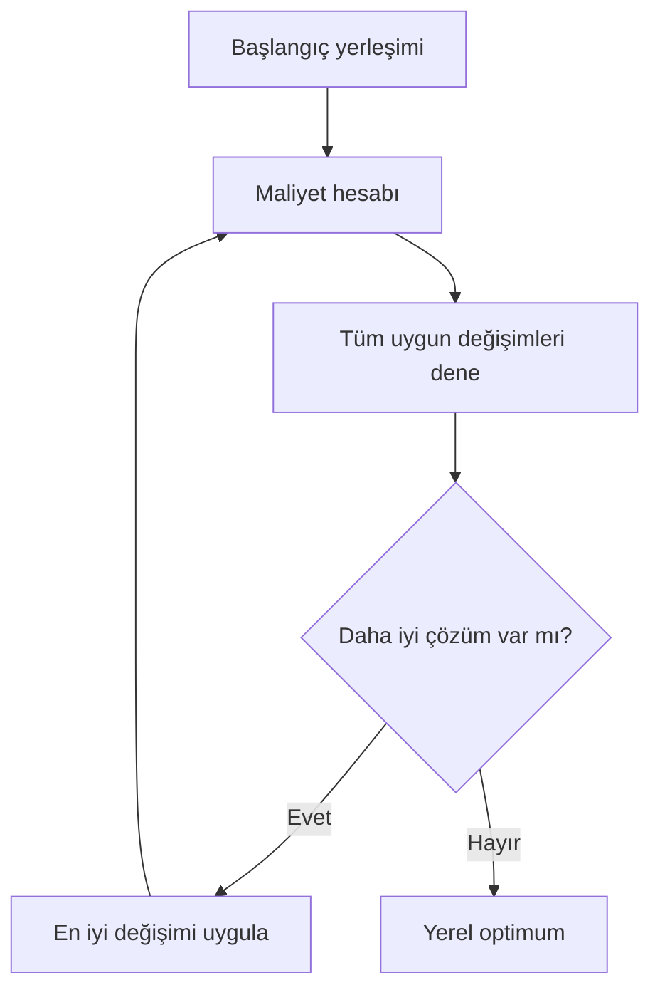

# HF08 - Yerleşim Tasarımı II

!!! abstract "Ana fikir"
> Yerleşim algoritmaları ya boş alana çözüm **kurar** ya da mevcut çözümü bölüm değişimleriyle **iyileştirir**. İkili yer değişimi ve CRAFT yerel arama mantığıyla çalışır.

## Sınıflandırma

| Sınıf | Başlangıç | Örnek yaklaşım |
|---|---|---|
| Kurma algoritması | Boş alan | Grafik tabanlı yerleştirme |
| İyileştirme algoritması | Mevcut yerleşim | İkili değişim, CRAFT |
| Karma | Başlangıç + yerel arama | Kur ve iyileştir |

## İkili yer değişim yöntemi

1. Başlangıç yerleşimin maliyetini hesapla.
2. Uygun her bölüm çiftini değiştir.
3. Yeni maliyeti hesapla.
4. En fazla iyileştiren değişimi kabul et.
5. İyileşme kalmayana kadar tekrarla.

$$C(L)=\sum_i\sum_j f_{ij}c_{ij}d_{ij}(L)$$

## Grafik tabanlı yöntem

Bölümler düğüm, yakınlık gereksinimleri ağırlıklı kenar olarak gösterilir. Amaç, yüksek ağırlıklı kenarların mümkün olduğunca komşu olduğu bir düzlemsel komşuluk grafiği kurmaktır. Grafik, alan boyutları eklenmeden önce ilişki yapısını görünür kılar.

## CRAFT

CRAFT, başlangıç yerleşiminden hareketle akış-mesafe maliyetini azaltan bölüm değişimlerini arar.

**Artıları:** hızlı, uygulanabilir başlangıç çözümünü iyileştirir, büyük problemlerde yararlıdır.  
**Eksileri:** başlangıç çözümüne duyarlı, yerel optimumda kalabilir, eşit olmayan alanlarda uygun değişim kümesi sınırlıdır.

!!! warning "Değişim uygunluğu"
> Her bölüm çifti fiziksel olarak değiştirilemez. Alan, şekil, sabit ekipman, kat ve komşuluk kısıtları kontrol edilmelidir.

## Kaynaklar

- HF8-P8-Yerlesim Tasarımı II-2025.pptx|Ders sunumu
- 05 Kaynaklar/MarkItDown/HF08 - Ham|MarkItDown ham metni

Önceki: HF07 - Yerleşim Tasarımı I · Sonraki: HF09 - Yerleşim Tasarımı III
