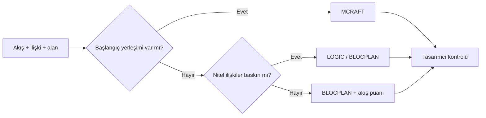

# HF09 - Yerleşim Tasarımı III

!!! abstract "Ana fikir"
> MCRAFT, BLOCPLAN ve LOGIC farklı veri ve geometri varsayımlarıyla blok yerleşim üretir. Algoritma seçimi; bölüm şekilleri, nitel/nicel ilişki verisi ve başlangıç yerleşiminin varlığına bağlıdır.

## Yöntem karşılaştırması

| Yöntem | Tür | Başlıca veri | Ayırt edici özellik |
|---|---|---|---|
| MCRAFT | İyileştirme | Akış, maliyet, mevcut yerleşim | Süpürme paterni ve bölüm değişimleri |
| BLOCPLAN | Kurma + iyileştirme | REL chart, akış, alan | Dikdörtgen blok bantları; REL-DIST |
| LOGIC | Kurma + iyileştirme | İlişki ve alan | Mantıksal komşulukla çözüm oluşturma |

## MCRAFT

MCRAFT, CRAFT mantığını mikro bilgisayar ortamına ve farklı bölüm şekillerine uyarlar. Alanı bir süpürme paterni boyunca doldurur, aday değişimleri değerlendirir ve akış-mesafe maliyeti azaldıkça çözümü günceller.

## BLOCPLAN

1. Bölüm alanlarını ve bina oranını tanımla.
2. From-to ve/veya A-E-I-O-U-X ilişkilerini sayısallaştır.
3. Bantlar içinde blok sıraları üret.
4. İlişki-uzaklık puanını hesapla.
5. En iyi alternatifleri tasarımcı değerlendirmesine sun.

Genel REL-DIST mantığı:

$$S_{RD}=\sum_{i<j} r_{ij}d_{ij}$$

$r_{ij}$ yakınlık önemini, $d_{ij}$ bölüm uzaklığını gösterir. Daha küçük değer tercih edilir; kullanılan işaret ve ağırlık kuralı raporda belirtilmelidir.

## LOGIC

LOGIC önce yüksek yakınlık ilişkilerini merkeze alan bir kurma sırası üretir; ardından bölüm ekleme veya değişimleriyle puanı geliştirir. Nitel ilişkilerin baskın olduğu erken tasarım aşamalarında yararlıdır.

!!! important "> Algoritmanın puanı, yangın kaçışı, kolonlar, kapılar, bakım erişimi ve genişleme gibi gerçek kısıtların yerine geçmez."

## Kaynaklar

- HF9-P9-Yerlesim Tasarımı III-2025.pptx|Ders sunumu
- 05 Kaynaklar/MarkItDown/HF09 - Ham|MarkItDown ham metni

Önceki: HF08 - Yerleşim Tasarımı II · Sonraki: HF10 - Yerleşim Tasarımı IV
