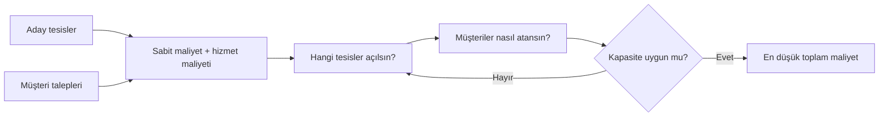

# HF12 - Tesis Konumu II

!!! abstract "Ana fikir"
> Kesikli tesis konum probleminde aday yerler önceden bellidir. Karar, hangi tesislerin açılacağı ve her müşterinin hangi açık tesise atanacağıdır.

## Karar değişkenleri

$$
y_i=\begin{cases}1,&i\text{ tesisi açılırsa}\\0,&\text{aksi halde}\end{cases}
$$

$$
x_{ij}=\begin{cases}1,&j\text{ müşterisi }i\text{ tesisine atanırsa}\\0,&\text{aksi halde}\end{cases}
$$

## Kapasitesiz tesis konum modeli

$$
\min \; \sum_i F_i y_i+\sum_i\sum_j c_{ij}x_{ij}
$$

$$
\sum_i x_{ij}=1 \quad \forall j
$$

$$
x_{ij}\le y_i \quad \forall i,j
$$

$F_i$ tesis açma sabit maliyeti, $c_{ij}$ müşteriyi $i$ tesisinden karşılama maliyetidir. Kapasite varsa:

$$
\sum_j q_jx_{ij}\le K_i y_i
$$

eklenir.

## Model ailesi

| Model | Amaç |
|---|---|
| Tesis atama | Talep noktalarını mevcut/yeni tesislere atama |
| Sabit maliyetli tesis konum | Açılacak tesis sayısı ve atamayı birlikte seçme |
| $p$-medyan | Tam $p$ tesisle toplam ağırlıklı uzaklığı azaltma |
| $p$-merkez | Tam $p$ tesisle en kötü uzaklığı azaltma |

!!! example "Sabit maliyet etkisi"
> Slayttaki kahve dükkânı örneğinde tek tesisin toplam maliyeti 6.820 iken iki tesisin yalnız sabit maliyeti 10.000'e ulaşır. Taşıma azalmasına rağmen ikinci tesis ekonomik değildir. Bu, konum ve tesis sayısının birlikte çözülmesi gerektiğini gösterir.

## Sınav çözüm sırası

1. Kümeleri, parametreleri ve birimleri tanımla.
2. $x$ ve $y$ karar değişkenlerini yaz.
3. Sabit ve değişken maliyetleri amaç fonksiyonunda ayır.
4. Her talebin tam bir tesise atanmasını sağla.
5. Atamanın yalnız açık tesise yapılmasını bağla.
6. Varsa kapasite ve tesis sayısı kısıtını ekle.

## Kaynaklar

- HF12-P12-Tesis Konumu II-2025.pptx|Ders sunumu
- 05 Kaynaklar/MarkItDown/HF12 - Ham|MarkItDown ham metni
- 03 Formüller/Formül Föyü#Kesikli tesis konumu|Formül föyü

Önceki: HF11 - Tesis Konumu I · Sonraki: Ana Sayfa
