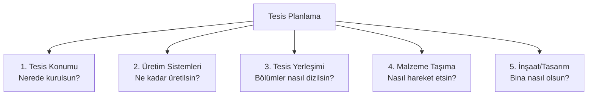
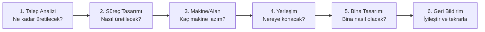

# HF01 - Giriş ve Ürün, Süreç, Çizelgeleme Tasarımı I

!!! abstract "Bu hafta ne öğreneceğiz?"
    Tesis planlamanın **5 temel bileşeni**, ürün-süreç-çizelge tasarımının birbirine bağımlılığı ve eş zamanlı mühendisliğin maliyet üzerindeki dramatik etkisi.

---

## Sınav Sorusu ile Başla

!!! example "Gerçek Sınav Sorusu Tarzı"
    *"Bir üretim tesisi kuracaksınız. Tesis planlamanın 5 bileşenini sıralayın ve 'eş zamanlı mühendislik' kavramını açıklayın. Maliyetin ne kadarı tasarım aşamasında belirlenir?"*

**Bu soruyu çözmek için şunları bilmen lazım:**

1. Tesis planlama sadece bina çizmek değil — 5 farklı karar var
2. Ürün, süreç ve çizelge tasarımı birbirinden ayrılamaz üçlü
3. Eş zamanlı mühendislik neden %70-80 gibi yüksek bir sayı verir

---

## 1. Tesis Nedir? (5 Yaşındaki Versiyonu)

Diyelim ki pizza dükkanı açıyorsun. Karar vermen gereken şeyler:

| Soru | Tesis Planlamadaki Adı |
|------|----------------------|
| Dükkânı nereye açayım? | **Konum** (Location) |
| Kaç fırın, kaç çalışan? | **Sistemler** (Systems) |
| Fırın, tezgâh, kasa nereye? | **Yerleşim** (Layout) |
| Hamur nasıl taşınacak? | **Taşıma** (Handling) |
| Binayı nasıl inşa edeyim? | **İnşaat/Tasarım** (Design) |

Fabrikada da tam bu 5 kararın toplamı "tesis planlama"dır.

---

## 2. Tesis Planlamanın 5 Bileşeni



!!! info "Sınavda sık sorulan"
    "Tesis planlamanın kaç bileşeni var ve nelerdir?" → **5 bileşen**: Konum, Sistemler, Yerleşim, Malzeme Taşıma, İnşaat/Tasarım. İngilizceleri: Location, Systems, Layout, Handling, Design.

---

## 3. Ürün – Süreç – Çizelge Üçlüsü

Bu üç tasarım kararı birbirinden **ayrılamaz**. Birini değiştirirsen diğerleri de değişmek zorunda kalır.

| Tasarım | Ne Soruyor? | Örnek |
|---------|-------------|-------|
| **Ürün Tasarımı** | Ne üretiyoruz? | Araba mı, bisiklet mi? |
| **Süreç Tasarımı** | Nasıl üretiyoruz? | Elle mi, CNC'yle mi? |
| **Çizelge Tasarımı** | Ne zaman, kaç tane? | Günde 200 adet, gece vardiyası |

!!! warning "Neden birbirinden ayrılamaz?"
    Bisiklet üretmeye karar verdikten sonra (ürün) CNC torna almak gerekir (süreç) ve bu makine kapasitesine göre de üretim takvimi (çizelge) belirlenir. Sırayla değil, **eş zamanlı** düşünülmesi gerekir.

---

## 4. Eş Zamanlı Mühendislik (Concurrent Engineering)

### Klasik Yaklaşım (Sıralı — Yanlış)

```
Ürün Tasarımı → Süreç Tasarımı → Üretim → "Oops, bu makinede üretilemez!"
```

Sorun: Tasarım bittikten sonra üretim sorunu bulursun → **çok geç, çok pahalı**.

### Eş Zamanlı Mühendislik (Doğru)

```
Ürün Tasarımı   ←→ Üretim Mühendisi
Süreç Tasarımı  ←→ Kalite Uzmanı     (Hepsi aynı anda çalışıyor)
Çizelge         ←→ Tedarik Zinciri
```

Tasarım aşamasında herkes masada → sorunlar **en ucuz** aşamada çözülür.

### Neden %70-80 diyoruz?

!!! success "Kilit Bilgi — Sınavda Çıkar"
    Bir ürünün **yaşam boyu maliyetinin %70-80'i**, ürünün *tasarım aşamasında* kesinleşir.

    Yani: Mühendis çizim masasında bir vida boyutuna karar verdiğinde, o vidayı üretmenin, takmanın, değiştirmenin maliyeti de otomatik olarak "kilitlendi".

    Tasarım sonrası değişiklik = **10-100 kat daha pahalı**.

```
Tasarım aşaması: 1 TL'lik değişiklik
Prototip aşaması: 10 TL
Üretim aşaması: 100 TL
Müşteriye teslim sonrası: 1.000 TL
```

---

## 5. 6 Adımlı Tesis Planlama Süreci



Her adım bir sonrakini besler. Bu yüzden tesis planlama **yinelemeli (iteratif)** bir süreçtir.

---

## 6. Gerçek Hayat Bağlantısı

!!! info "Neden bu kadar büyük para?"
    - ABD'de her yıl milli gelirin **%8'i** yeni tesis kurmaya harcanır
    - Fabrika maliyetlerinin **%20-50'si** malzeme taşımadır
    - İyi bir yerleşim tasarımı taşıma maliyetini **%10-30 azaltır**

    → Tesis planlamacısının tek bir kararı, yıllık milyonlarca TL fark yaratır.

---

## 7. Sık Yapılan Hatalar

!!! warning "Dikkat"
    - **"Eş zamanlı = aynı anda teslim"** değil. Eş zamanlı = **farklı ekiplerin paralel çalışması**.
    - **Bileşen sayısı**: 4 değil **5** (konum, sistemler, yerleşim, taşıma, **inşaat**).
    - **%70-80**: Bu maliyetin kaçını tasarımda "harcıyoruz" değil, kaçını "**belirliyoruz**". Harcama sonraki aşamalarda olur ama karar şimdi kesinleşir.

---

## 8. Pratik Sorular

!!! question "Soru 1"
    Tesis planlamanın 5 bileşenini yazınız ve her birini bir cümleyle açıklayınız.

??? success "Cevap"
    1. **Konum**: Tesisin hangi coğrafi bölgede kurulacağı
    2. **Sistemler**: Kapasite ve üretim sistemlerinin tasarımı
    3. **Yerleşim**: Bölüm ve makinelerin tesis içindeki dizilimi
    4. **Malzeme Taşıma**: Malzemelerin tesis içinde nasıl hareket edeceği
    5. **İnşaat/Tasarım**: Binanın fiziksel yapısı ve altyapısı

!!! question "Soru 2"
    Eş zamanlı mühendisliği sıralı mühendislikten ayıran temel fark nedir?

??? success "Cevap"
    Sıralı mühendislikte ürün tasarımı → süreç tasarımı → üretim sırayla yapılır. Eş zamanlı mühendislikte tüm ekipler **aynı anda** çalışır. Bu sayede tasarım hataları en ucuz aşamada yakalanır. Maliyet: tasarım aşamasında değişiklik 1 TL iken, üretim sonrası 100-1.000 TL.

!!! question "Soru 3"
    Bir ürünün yaşam boyu maliyetinin kaçta kaçı tasarım aşamasında belirlenir? Bu rakamın önemi nedir?

??? success "Cevap"
    **%70-80'i** tasarım aşamasında belirlenir. Bu rakamın önemi: mühendis çizim masasında karar verirken maliyetin büyük bölümünü "kilitlemektedir". Sonraki aşamalarda değiştirmek giderek daha pahalı hale gelir.

---

Sonraki: [HF02 — Tesis Kapasite Planlama](hf02.md)
