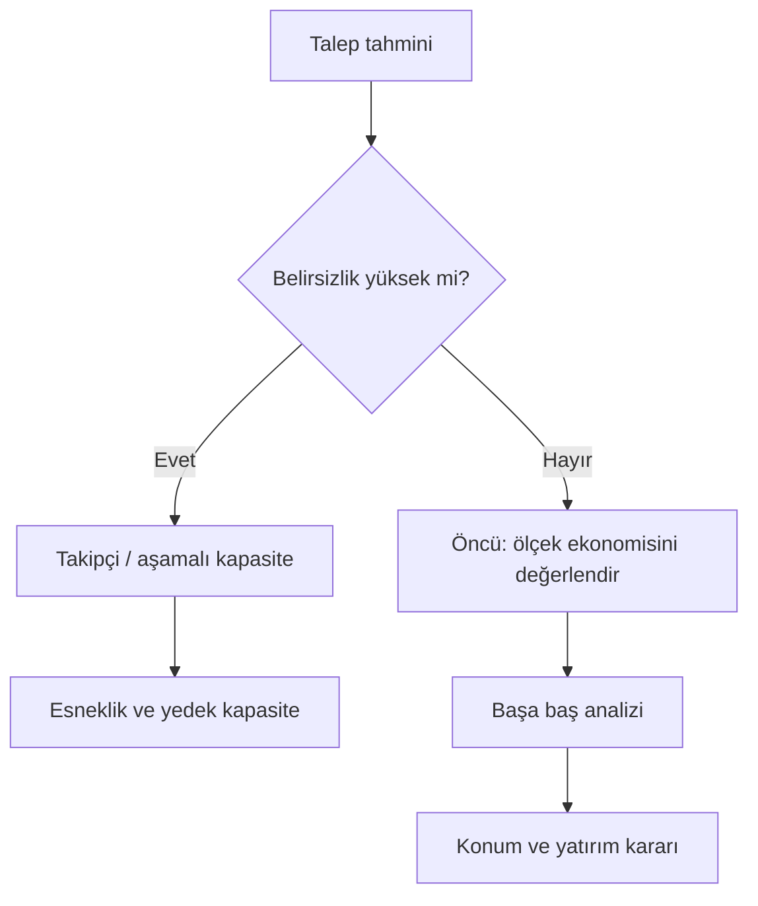
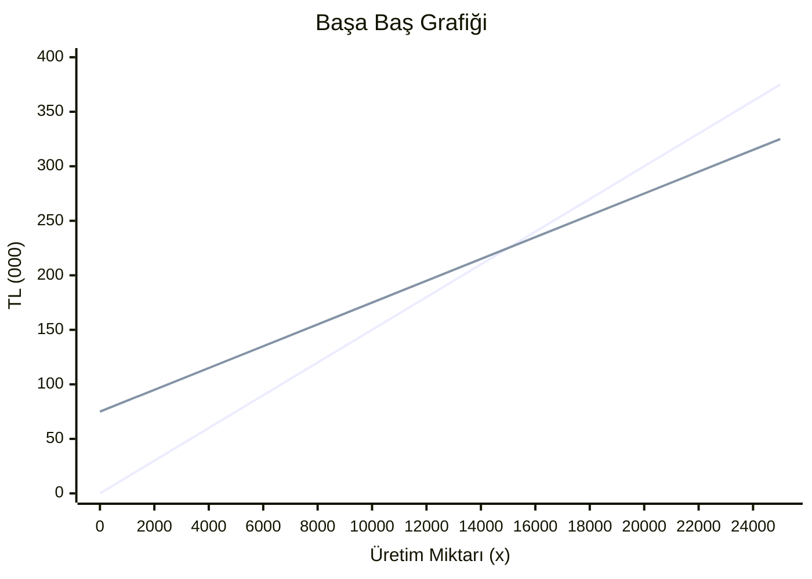

# HF02 - Tesis Kapasite Planlama

!!! abstract "\1"
> Kapasite planlaması, talebin **ne zaman, nerede ve ne kadar** karşılanacağını belirler; çok az kapasite satış/hizmet kaybına, fazla kapasite ise atıl yatırıma ve yüksek sabit maliyete yol açtığı için başa baş analizi ve dinamik büyüme modelleriyle bu denge optimize edilir.


## 1. Kapasite nedir?

**Kapasite**, bir tesisin belirli bir zaman diliminde üretebileceği, kabul edebileceği, depolayabileceği veya işleyebileceği maksimum birim sayısıdır. Aynı zamanda sistemin "üretim yapabilme kabiliyeti" olarak da tanımlanır.

!!! tip "\1"
> Kapasiteyi bir **otoyolun şerit sayısı** gibi düşünün. Çok az şerit → trafik sıkışır (talep karşılanamaz, müşteri kaçar). Çok fazla şerit → boş asfalt, israf edilmiş yatırım. Doğru kapasite, "trafiğin akmaya devam ettiği ama asfaltın boşa gitmediği" noktadır.

Kapasite kararları neden kritiktir?

- **Sermaye gereksinimi**: Sabit maliyetin büyük bölümünü belirler (bina, makine, hangar).
- **Rekabet gücü**: Talebi karşılayamayan firma pazar payını rakibe kaptırır.
- **Geri dönüş oranı**: Tesis büyüklüğü, yatırımın geri dönüşünü (ROI) ve kullanım oranını doğrudan etkiler.

### Kapasite türleri (paydanın seçimi)

| Tür | Anlamı | Gerçek hayat örneği |
|---|---|---|
| **Tasarım kapasitesi** | İdeal koşullarda teorik maksimum çıktı | Bir fırının etiketinde "günde 10.000 ekmek" yazması |
| **Etkin kapasite** | Bakım, vardiya, ürün karması gibi gerçekçi kısıtlar düşülünce ulaşılabilir çıktı | Aynı fırının temizlik/mola sonrası gerçekçi 8.500 ekmek hedeflemesi |
| **Fiili (gerçekleşen) çıktı** | Gerçekten üretilen miktar | Arıza yaşanan bir günde fiilen 7.000 ekmek çıkması |

!!! warning "\1"
> Tasarım kapasitesi ≥ etkin kapasite ≥ fiili çıktı sıralaması her zaman geçerlidir. Bir oran hesabında **paydanın hangi kapasite tanımı olduğu açıkça yazılmalıdır**; yoksa "kullanım oranı" ile "verimlilik" birbirine karışır.

### Yeni tesiste cevaplanması gereken 3 soru

1. **Ne zaman?** İnşaat süresi (lead time) ve talep paterninin değişimi zamanlamayı belirler.
2. **Nerede?** Hammaddeye/pazara yakınlık, işçilik maliyeti (gerekirse deniz aşırı), vergi indirimleri, yaşam standardı.
3. **Ne kadar?** Tesis boyutu: çok fazla → atıl kapasite; çok az → kaçırılan talep.

---

## 2. Temel ölçüler: Kullanım oranı ve verimlilik

### Kapasite kullanım oranı

$$
U=\frac{Q_{kullanılan}}{Q_{en\ iyi\ işletim}}
$$

- $U$ = kapasite kullanım oranı (utilization rate)
- $Q_{kullanılan}$ = belirli dönemde gerçekleşen çıktı (fiili üretim)
- $Q_{en\ iyi\ işletim}$ = en iyi işletim düzeyi (best operating level) — birim maliyetin en düşük olduğu üretim seviyesi

Yüzde istenirse 100 ile çarpılır.

!!! example "\1"
> Bir tesis bir haftada 83 birim üretmiştir. Tarihsel en iyi işletim düzeyi 120 birim/haftadır. Kapasite kullanım oranı nedir?
>
> **Adım 1 — Pay ve paydayı yerleştir:**
> $$U=\frac{Q_{kullanılan}}{Q_{en\ iyi}}=\frac{83}{120}$$
>
> **Adım 2 — Hesapla:**
> $$U=0{,}6917 \approx \%69$$
>
> **Yorum:** Tesis, en iyi işletim düzeyinin yaklaşık %69'unu kullanmıştır — düşük kapasite kullanımı. Bu tek başına "kötü" demek değildir; nedeni (talep yetersizliği mi, arıza mı) ek bilgi ister.

!!! tip "\1"
> **Kullanım oranı** = fiili çıktı / en iyi işletim düzeyi (kapasitenin ne kadarını çalıştırdık?).
> **Verimlilik** = fiili çıktı / etkin kapasite (planlanan koşullarda ne kadar başarılı çalıştık?). İkisi farklı paydaları kullanır; soruda hangisinin istendiğine dikkat edin.

### Ölçek ve kapsam ekonomisi

- **Ölçek ekonomisi (economies of scale):** Üretim hacmi arttıkça sabit maliyetler daha çok birime yayılır → birim maliyet düşer. *Sezgi: Matbaada 1.000 katalog 0,40 TL/adet iken 3.000 katalog 0,11 TL/adet (Slayt 12).*
- **Ölçek ekonomisizliği (diseconomies of scale):** "En iyi işletim düzeyi" aşıldığında koordinasyon ve karmaşıklık artar → birim maliyet yeniden yükselir. *Sezgi: 8.000 ft² mağaza, 2.600 ft²'lik mağazadan daha pahalı birim maliyetle çalışabilir (Slayt 11).*
- **Kapsam ekonomisi (economies of scope):** İki ürünü birlikte üretmenin maliyeti, ayrı ayrı üretmenin toplamından küçükse oluşur — ortak ekipman/işgücü paylaşılır. *Sezgi: Bir savunma kampüsünde test laboratuvarı, enerji ve güvenliğin merkezileştirilmesi.*

---

## 3. Kapasite stratejileri

Firma, kapasiteyi talebe göre **ne zaman** ekleyeceğine karar vermelidir. Üç temel strateji:

| Strateji | Davranış | Avantaj | Risk / Dezavantaj | Ne zaman tercih edilir? |
|---|---|---|---|---|
| **Öncü (Leader)** | Kapasite talebin **önünde** kurulur | Yüksek hizmet düzeyi; talep patlamasını karşılar; büyüme fırsatı | Atıl kapasite, yüksek sabit maliyet | Talep büyümesi kesin ve hızlı; pazar payı kritik |
| **Takipçi (Follower)** | Kapasite, talep kesinleşince artar | Düşük yatırım riski; yüksek kullanım oranı | Talep kaçırma, kıtlık (kısa kalma) riski | Talep belirsiz; sermaye kısıtlı |
| **Ortalama / Eş zamanlı (Average)** | Küçük ve sık artışlarla talebi yakından izler | Dengeli risk; aşırı atıl/aşırı kıtlık ikisi de sınırlı | Sık yatırım ve geçiş (kurulum) maliyeti; ölçek avantajı azalır | Modüler/aşamalı genişleme mümkün |

!!! tip "\1"
> **Öncü** = "ev sahibi misafirden önce ekstra sandalye dizer" (boş kalabilir ama kimse ayakta kalmaz). **Takipçi** = "misafir gelince sandalye getirir" (ucuz ama birileri bekler). **Ortalama** = "her gelen grup için birer ikişer ekler" (dengeli ama sürekli mutfağa gidip gelir).



---

## 4. Başa baş analizi (Tek ürün)

**Başa baş noktası (BBN / Break-Even Point)**, toplam gelirin toplam maliyete eşit olduğu, yani kârın sıfır olduğu üretim/satış düzeyidir. *Sıfır kâr noktası, ölü nokta, kâra geçiş noktası* da denir.

### Semboller ve formüller

$$
TR=Px, \qquad TC=F+Vx
$$

$$
x_{BB}=\frac{F}{P-V}, \qquad
\Pi=(P-V)x-F
$$

- $P$ = birim satış fiyatı (tüm iskontolardan sonra)
- $V$ = birim değişken maliyet
- $F$ = toplam sabit maliyet
- $x$ = üretim/satış miktarı
- $TR$ = toplam gelir (total revenue) $=Px$
- $TC$ = toplam maliyet (total cost) $=F+Vx$
- $\Pi$ = kâr
- $P-V$ = **birim katkı payı** (her satışın sabit maliyeti karşılamaya kattığı tutar)

**Satış tutarı cinsinden başa baş** (katkı payı oranı $CMR=\dfrac{P-V}{P}=1-\dfrac{V}{P}$ ile):

$$
S_{BB}=\frac{F}{CMR}=\frac{F}{1-\dfrac{V}{P}}
$$

**Hedef kâr** $\Pi^*$ için gereken miktar:

$$
x_{hedef}=\frac{F+\Pi^*}{P-V}
$$

### BEP grafiğinin okunması



Grafiği şöyle okuyun (Örnek 4 verileriyle, $F=75.000$, $V=10$, $P=15$):

- **Yatay sabit maliyet zemini ($F$):** $x=0$'da bile ödenir; grafikte 75.000 TL'den başlar.
- **Toplam maliyet doğrusu ($TC=F+Vx$):** $F$'den başlar, eğimi $V$'dir.
- **Toplam gelir doğrusu ($TR=Px$):** orijinden başlar, eğimi $P$'dir; $P>V$ olduğu için $TC$'yi bir noktada keser.
- **Kesişim = Başa Baş Noktası (BBN):** İki doğrunun kesiştiği yer. **Solunda zarar koridoru** (TC > TR), **sağında kâr koridoru** (TR > TC).
- İki doğru arasındaki dikey mesafe = o hacimdeki kâr (sağda) veya zarar (solda).

!!! example "\1"
> X Matbaacılık AŞ bir kitap çıkaracaktır. Başa baş satış adedini bulun.
> - Satış fiyatı $P=500$ TL
> - Sabit maliyetler: Telif 300.000 + Resim 80.000 + Dizgi 150.000 = **$F=530.000$ TL**
> - Birim değişken maliyetler: Baskı/kıvırma 35 + Mürekkep/kâğıt 110 + Kitabevi iskontosu 50 + Diğer 5 = **$V=200$ TL**
>
> **Adım 1 — Birim katkı payını bul:**
> $$P-V=500-200=300\text{ TL/kitap}$$
>
> **Adım 2 — Matematiksel başa baş miktarını hesapla:**
> $$x_{BB}=\frac{F}{P-V}=\frac{530.000}{300}=1.766{,}67\text{ kitap}$$
>
> **Adım 3 — Uygulanabilir karara yuvarla:** Kitap bölünemez ve 1.766 adet hâlâ zarar bırakır. Bu yüzden **yukarı (tavana) yuvarlanır:**
> $$x_{uygulanabilir}=\lceil 1.766{,}67 \rceil = 1.767\text{ kitap}$$
>
> **Kontrol (1.767 adette):**
> $$TR=500 \times 1.767=883.500\text{ TL}, \quad TC=530.000+200 \times 1.767=883.400\text{ TL}$$
> İlk tam adette 100 TL kâr oluşur; gerçek eşitlik 1.766,67'dedir.

!!! warning "\1"
> - **Yuvarlama hatası:** Kesirli başa baş "en yakına" değil, **yukarı** yuvarlanır. 1.766 adet hâlâ zarardır; minimum zararsız adet 1.767'dir.
> - **$P/V$ ile bölmek:** Başa baş $\dfrac{F}{P-V}$'dir, $\dfrac{F}{P/V}$ değil. Önce mutlaka **katkı payı $P-V$**'yi yazın.
> - **Sabit maliyeti $x$ ile çarpmak:** $F$ hacimden bağımsızdır. Doğru kurulum $TC=F+Vx$'tir; $F$ tek başına durur.
> - **Katkı payı ($P-V$, TL) ile katkı payı oranını ($CMR$, ondalık) karıştırmak:** Miktar BBN'sinde $P-V$, tutar BBN'sinde $CMR$ kullanılır.

---

## 5. Çok ürünlü başa baş (Ağırlıklı katkı payı)

Firmaların çoğu farklı fiyat ve değişken maliyetli birden çok ürün satar. Bu durumda her ürünün katkısı, **satış tutarı içindeki payı ($W_i$) ile ağırlıklandırılır.**

$$
CMR_i=1-\frac{V_i}{P_i}, \qquad
W_i=\frac{P_iQ_i}{\sum_j P_jQ_j}, \qquad
\overline{CMR}=\sum_i W_i \cdot CMR_i
$$

$$
BEP_{TL}=\frac{F}{\overline{CMR}}
$$

- $CMR_i$ = $i$ ürününün katkı payı oranı
- $W_i$ = $i$ ürününün toplam **satış tutarı** içindeki yüzdesi (ondalık)
- $\overline{CMR}$ = ağırlıklı (weighted) katkı payı oranı
- $F$ = toplam sabit maliyet
- $BEP_{TL}$ = para birimi cinsinden başa baş

!!! example "\1"
> Aylık sabit maliyet 3.000 $, yılda 312 gün çalışılıyor.
>
> | Ürün | Yıllık adet | Fiyat ($) | Değişken maliyet ($) |
> |---|---:|---:|---:|
> | Sandviç | 9.000 | 5,00 | 3,00 |
> | İçecek | 9.000 | 1,50 | 0,50 |
> | Fırın patates | 7.000 | 2,00 | 1,00 |
>
> **Adım 1 — Her ürün için satış tutarı, ağırlık ve katkı oranı tablosu:**
>
> | Ürün | Satış ($) | $W_i$ | $CMR_i=1-V_i/P_i$ | $W_i \cdot CMR_i$ |
> |---|---:|---:|---:|---:|
> | Sandviç | 45.000 | 0,621 | 0,40 | 0,248 |
> | İçecek | 13.500 | 0,186 | 0,67 | 0,125 |
> | Fırın patates | 14.000 | 0,193 | 0,50 | 0,097 |
> | **Toplam** | **72.500** | **1,000** | | **≈0,470** |
>
> **Adım 2 — Yıllık sabit maliyet:**
> $$F=3.000 \times 12=36.000\text{ $}$$
>
> **Adım 3 — Yıllık başa baş satış tutarı (slayt yuvarlamasıyla):**
> $$BEP_{TL}=\frac{36.000}{0{,}47}=76.596\text{ $/yıl}$$
>
> **Adım 4 — Günlük başa baş satış:**
> $$BEP_{günlük}=\frac{76.596}{312}\approx 245{,}50\text{ $/gün}$$

!!! note "\1"
> Ham sayılarla tam hassasiyette $\overline{CMR}=0{,}46897$ çıkar ve $BEP_{TL}\approx 76.765$ $/yıl olur. Slayt ara oranı 0,47'ye yuvarladığı için 76.596 $ raporlar. **Sınavda ara değerleri mümkün olduğunca yuvarlamadan taşıyın** — erken yuvarlama sonucu kaydırır.

!!! warning "\1"
> - **$W_i$ olarak adet payı kullanmak:** Ağırlık, **satış tutarı** ($P_iQ_i$) payıdır, adet payı değil. İçeceğin adet payı yüksek olsa da ucuz olduğu için tutar ağırlığı düşüktür (0,186).
> - **Katkı oranlarını ağırlıksız ortalamak:** $\overline{CMR}\neq \frac{CMR_1+CMR_2+\dots}{n}$. Mutlaka $\sum W_i CMR_i$ kullanın.
> - **Dönem uyumsuzluğu:** Aylık sabit maliyeti yıllık satışla kullanmayın; hepsini aynı döneme getirin (3.000 → 36.000).

---

## 6. Yap veya satın al kararı (Make or Buy)

Firma bir parçayı dışarıdan **satın** alabilir ($c_1$ TL/adet) ya da kendi **üretebilir** (birim maliyet $c_2$, ama $K$ kadar yatırım gerekir). Burada **yatırım ile ölçek ekonomisi arasında bir takas (trade-off)** vardır: üretim arttıkça birim üretim maliyeti düşer.

$$
TC_{satın}=c_1 x, \qquad TC_{yap}=K+c_2 x
$$

İki toplam maliyeti eşitleyerek eşik miktarı:

$$
x^*=\frac{K}{c_1-c_2}
$$

- $c_1$ = dışarıdan satın alma birim maliyeti
- $c_2$ = içeride üretim birim maliyeti ($c_2<c_1$)
- $K$ = içeride üretim için gerekli yatırım/sabit maliyet
- $x^*$ = iki seçeneğin maliyetinin eşitlendiği eşik miktar

**Karar:** $x<x^*$ → **satın al** daha ucuz; $x>x^*$ → **yap** (içeride üret) daha ucuz; $x=x^*$ → eşit.

!!! example "\1"
> Bir bilgisayar üreticisi klavye için karar verecek. Dışarıdan alım 50 TL/adet, içeride üretim 35 TL/adet, üretim yatırımı 8.000.000 TL.
>
> $$50x=8.000.000+35x \;\Rightarrow\; 15x=8.000.000 \;\Rightarrow\; x^*=533.333{,}33\text{ adet}$$
>
> Firma, yatırımı haklı çıkarmak için **533.333 adetten fazla** satmalıdır. 533.334 adet ve üzerinde içeride üretim, altında satın alma daha ucuzdur.

!!! warning "\1"
> - **Yalnız birim maliyete bakmak:** $c_2<c_1$ diye hemen "yap" demeyin — yatırım $K$ büyük bir hacim gerektirebilir. İki **toplam maliyeti** yazın.
> - **Karar sadece maliyet değildir:** Eşik yalnız modeldeki maliyetleri karşılaştırır. Kalite, gizlilik, tedarik kesintisi riski, kapasite uygunluğu, teslim süresi ve esneklik de değerlendirilir. "Talep eşiğin üzerinde → her koşulda yap" demek yanlıştır.
> - **Statik model uyarısı:** BBN analizi kapasitenin yaklaşık, **statik** bir tahminidir; talepteki dinamik değişkenliği göz ardı eder → bir sonraki modele ihtiyaç doğar.

---

## 7. Dinamik kapasite büyüme kuralı

BBN statiktir; oysa talep zamanla değişir. Talep yılda sabit $D$ kadar artarken, **kapasite ilavelerinin büyüklüğü ($y$) ve aralığı ($x$)**, ölçek ekonomisi ile paranın zaman değeri dengelenerek seçilir.

### Model değişkenleri ve kurulum

| Sembol | Anlam |
|---|---|
| $D$ | Talebin yıllık doğrusal artışı (kapasite/yıl) |
| $x$ | İki kapasite ilavesi arasındaki süre (yıl) |
| $y$ | Her ilavede kurulan kapasite |
| $r$ | Sürekli bileşik yıllık iskonto oranı |
| $f(y)=ky^a$ | $y$ kapasiteli ilavenin maliyeti ($0<a<1$ → ölçek ekonomisi) |

$x$ yıl boyunca biriken talep kadar kapasite eklendiğinden:

$$
y=xD
$$

Sonsuz yatırım dizisinin (zamanlar $0,x,2x,\dots$) bugünkü değeri bir geometrik seridir:

$$
C(x)=f(xD)+e^{-rx}f(xD)+e^{-2rx}f(xD)+\cdots=\frac{f(xD)}{1-e^{-rx}}=\frac{k(xD)^a}{1-e^{-rx}}
$$

### Optimum koşulu

$C(x)$'in logaritmasının türevi sıfıra eşitlenince, boyutsuz dönüşüm $u=rx$ ile:

$$
g(u)=\frac{u}{e^{u}-1}=a
$$

$a$ değerine karşılık gelen $u$, slayttaki **$u$–$g(u)$ tablosundan** (veya sayısal çözümden) okunur. Sonra:

$$
x^*=\frac{u}{r}, \qquad y^*=x^*D, \qquad f(y^*)=k(y^*)^a
$$

!!! important "\1"
> Optimum **zaman aralığını** $x^*$ yalnızca $a$ ve $r$ belirler. Talep artışı $D$ ve ölçek katsayısı $k$, ilavenin **büyüklüğünü ve maliyetini** değiştirir ama $x^*$'da görünmez.

!!! example "\1"
> $D=5.000$ ton/yıl, $r=0{,}16$ olsun. Optimal aralık, ilave kapasite ve maliyeti bulun.
>
> **Adım 1 — $u$ değerini bul ($a=0{,}62$):** Tablodan $g(u)=0{,}62$ veren $u\approx 0{,}89$.
> $$g(0{,}89)=\frac{0{,}89}{e^{0{,}89}-1}=0{,}62015 \;\checkmark$$
>
> **Adım 2 — Optimal zaman aralığı:**
> $$x^*=\frac{u}{r}=\frac{0{,}89}{0{,}16}=5{,}5625\text{ yıl}$$
>
> **Adım 3 — İlave kapasite:**
> $$y^*=x^*D=5{,}5625 \times 5.000=27.812{,}5\text{ ton}$$
>
> **Adım 4 — Her ilavenin maliyeti:**
> $$f(y^*)=0{,}0107 \times (27.812{,}5)^{0{,}62}=6{,}093\text{ milyon TL}$$
>
> **Sonuç:** Firma yaklaşık her **5,5625 yılda bir, 27.812,5 ton** kapasiteyi **≈6,093 milyon TL** ile eklerse en iyiyi yapar.

!!! warning "\1"
> - **$y=D/x$ yazmak:** Doğrusu $y=xD$'dir. Birim kontrolü: yıl × (kapasite/yıl) = kapasite.
> - **Sürekli iskontoyu basit iskontoyla karıştırmak:** Model $e^{-rt}$ kullanır, $(1+r)^{-t}$ değil.
> - **$u$'yu kapasite sanmak:** $u=rx$ boyutsuzdur. Önce $x=u/r$, sonra $y=xD$.
> - **Geometrik seri paydası:** $1+q+q^2+\dots=\dfrac{1}{1-q}$; payda $1-e^{-rx}$'tir, $1+e^{-rx}$ değil.

### Modelin sınırları

- Tesis ömrünü **sonsuz** kabul eder (gerçekte sonludur; eskime, yeni teknoloji, yeni pazar tesisi kapatabilir).
- Talep artışını **sabit doğrusal** ($D$) varsayar; gerçek talep karmaşık olabilir.
- Yasal düzenlemeler, vergi, konum ve genel maliyetler modele dahil değildir.

---

## 8. Özet kavram haritası

```mermaid
flowchart LR
  K[Kapasite] --> O[Ölçeği/strateji seç]
  O --> S{Statik mi dinamik mi?}
  S -- Statik --> BEP[Başa baş analizi]
  BEP --> T[Tek ürün: F/(P-V)]
  BEP --> C[Çok ürün: F/CMR_bar]
  BEP --> Y[Yap-satın al: K/(c1-c2)]
  S -- Dinamik --> D[Dinamik büyüme: u/r]
```

---

## Kaynaklar

**Öğrenme paketleri (hesap odaklı):**
- \1
- \1
- \1

**Diğer:**
- \1
- \1
- \1
- \1

Önceki: \1 · Sonraki: \1
