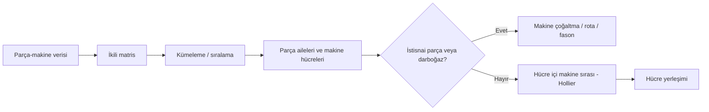

# HF05 - Akış, Alan ve Etkinlik İlişkileri I

!!! abstract "\1"
> Bölüm planlamasında amaç, benzer işlem rotalarına sahip parçaları ve bunları işleyen makineleri **üretim hücreleri** halinde gruplayarak taşıma, WIP ve beklemeyi azaltmaktır. Bu hafta hücre oluşturmanın iki temel matris yöntemi olan **DCA** (Direct Clustering Algorithm — 1'leri satır/sütun toplamına göre bloklaştırma) ile **ROC** (Rank Order Clustering — ikili ağırlıklı yeniden sıralama), bunların yetersiz kaldığı yerde devreye giren **Maliyet Analizi**, ve hücre içi makine sırasını belirleyen **Hollier** algoritması işlenir. Akış, alan ve etkinlik ilişkileri tesis tasarımının üç anahtar girdisidir.

## Akış, alan ve etkinlik ilişkileri

| Kavram | Tanım | Bağlı olduğu faktörler |
|---|---|---|
| **Akış (Flow)** | Malzeme, insan, donanım, bilgi ve paranın hareketi | Parti büyüklüğü, birim yük, malzeme aktarma sistemi, yerleşim, bina şekli |
| **Alan (Space)** | Tesisteki alan gereksinimi miktarı | Parti büyüklüğü, stok sistemi, donanım tipi/boyutu, ofis-yemekhane-lavabo tasarımı |
| **Etkinlik (Activity)** | Makineler/bölümler arası faaliyet ilişkileri | Akışın ölçülmesiyle hesaplanır; organizasyonel, çevresel, süreç ve kontrol ilişkilerini belirler |

Akış üç tiptir: tesisten **giden dış akış**, tesise **gelen akış** ve **tesis içi akış**. Etkinlik ilişkileri tesis tasarımının anahtar girdisidir ve akış ilişkileri tarafından belirlenir.

## Hacim-çeşitlilik ve yerleşim

| Ürün hacmi | Ürün çeşitliliği | Uygun yaklaşım | İngilizce |
|---|---|---|---|
| Yüksek (standart, sabit, büyük talep) | Düşük | Ürün/hat yerleşimi | Product layout (flow shop) |
| Fiziksel büyük, taşınması zor, düşük talep | — | Sabit ürün yerleşimi | Fixed product layout |
| Orta | Orta (benzer parça aileleri) | Grup teknolojisi ve hücresel imalat | Group layout |
| Düşük | Yüksek (yukarıdakilerin hiçbiri) | Süreç/atölye yerleşimi | Process layout (job shop) |

## Grup teknolojisi ve hücresel imalat

Grup teknolojisi (ürün ailesi bölümleri), **orta hacimli-çeşitli** parçaları benzer imalat operasyonları ve tasarım özelliklerine göre **parça aileleri** olarak toplar. İmalat hücresi; makineleri, çalışanları, malzemeleri, avadanlıkları ve taşıma/depolama donanımlarını bir araya getirir ve **minimum dış desteğe** ihtiyaç duyar. Sıklıkla JIT, TQM ve TEI ile tasarlanır.

**Hücresel imalatın yararları (3 başlık):**
- **Azaltma (Reduction):** Envanter, alan, bürokrasi, donanım, taşıma
- **Basitleştirme (Simplification):** İletişim, taşıma, çizelgeleme/planlama
- **İyileştirme (Improvement):** Verimlilik, esneklik, kalite, müşteri memnuniyeti

!!! info "\1"
> İki bağımsız boyut vardır: (1) **benzer tasarım, farklı imalat** ve (2) **farklı tasarım, benzer imalat**. Hücreleme açısından önemli olan **benzer imalat gereksinimi**dir; çünkü hücreye atanan makineleri o belirler.

## Parça-makine oluşum matrisi

$$
a_{ij}=\begin{cases}
1, & \text{parça }i\text{, makine }j\text{ üzerinde işlem görür}\\
0, & \text{aksi halde}
\end{cases}
$$

İdeal yeniden sıralamada 1'ler köşegen boyunca bloklar (hücreler) oluşturur. Blok dışındaki 1'ler **istisnai eleman / istisnai parça**, blok içindeki 0'lar **boşluk** olarak yorumlanır.

> [!caution] Matrisin saklayamadığı bilgiler
> - Aynı makinedeki **işlem sayısı/tekrarı** (matris yalnız var/yok bilgisidir).
> - **İşlem sırası** (rota).
> - Aynı tipten **birden fazla makine** (yalnız birer adet gösterilebilir).
> Bu sınırlar darboğaz ve istisna analizinde kritiktir.

---

# 1 · DCA — Doğrudan Kümeleme Algoritması

!!! note "\1"
> Satır ve sütun toplamlarıyla ön sıralama yapılır, sonra 1'ler ardışık ötelemelerle köşegene doğru bloklaştırılır.

### Algoritma — adım adım

1. **Makine-parça matrisi oluşturulur.** Parça makinede işleniyorsa "1", işlenmiyorsa boş/0 bırakılır.
2. **Her sütun ve satırdaki 1'ler toplanır.**
3. **Satırlar azalan sırada** (en çok 1'i olan satır üstte) sıralanır.
4. **Sütunlar artan sırada** (en az 1'i olan sütun solda) sıralanır.
5. **Sütunlar sıralanır (öteleme):** İlk satırdan başlanır; ilk satırda "1" bulunan tüm sütunlar **sola** kaydırılır, sonra ikinci satır için tekrarlanır, böyle devam edilir.
6. **Satırlar sıralanır (öteleme):** En soldaki sütundan başlanır; o sütunda "1" bulunan satırlar **yukarı** kaydırılır, sonra ikinci sütunla devam edilir.
7. **Hücreler oluşturulur/biçimlendirilir.** Köşegen boyunca yoğun 1 blokları hücre olur.

### Tam sayısal örnek — 5×6 matris (slayt 20-22)

**Başlangıç matrisi** (parçalar P1-P6, makineler M1-M5):

| | P1 | P2 | P3 | P4 | P5 | P6 | **Satır Σ** |
|---|:-:|:-:|:-:|:-:|:-:|:-:|:-:|
| **M1** | 1 | 1 |  | 1 |  |  | **3** |
| **M2** |  |  | 1 |  | 1 |  | **2** |
| **M3** | 1 |  |  | 1 |  |  | **2** |
| **M4** |  |  | 1 |  |  | 1 | **2** |
| **M5** |  |  | 1 |  |  | 1 | **2** |
| **Sütun Σ** | 2 | 1 | 3 | 2 | 1 | 2 | |

Adım 2: Makine (satır) toplamları $M1=3$, diğerleri $2$; parça (sütun) toplamları $(2,1,3,2,1,2)$.

Adım 3-6 (öteleme) sonunda kaynak nihai sırası:
- **Sütun (parça) sırası:** P3 – P5 – P6 – P1 – P2 – P4
- **Satır (makine) sırası:** M2 – M4 – M5 – M1 – M3

**Son (bloklaşmış) matris:**

| | P3 | P5 | P6 | P1 | P2 | P4 |
|---|:-:|:-:|:-:|:-:|:-:|:-:|
| **M2** | 1 | 1 |  |  |  |  |
| **M4** | 1 |  | 1 |  |  |  |
| **M5** | 1 |  | 1 |  |  |  |
| **M1** |  |  |  | 1 | 1 | 1 |
| **M3** |  |  |  | 1 |  | 1 |

**Sonuç:**
- **Hücre #1:** M2, M4, M5 makinelerinde **P3, P5, P6** parçaları işlenir.
- **Hücre #2:** M1, M3 makinelerinde **P1, P2, P4** parçaları işlenir.

Her "1" kendi bloğunda kaldığı için bu örnekte **blok dışı istisna yoktur** — temiz bir köşegen blok yapısı elde edilir.

### Darboğaz makineler (Bottleneck machines)

Bir makine iki ayrı hücredeki parçalarca zorunlu kullanılıyorsa **darboğaz** olur (örnekte Makine 2'nin hem #3 hem #5 parçalarına gerekmesi gibi). Köşegen üzerine yerleştirilemez ve tam olarak bir hücreye atanamaz.

**Olası çözümler:**
- Darboğaz makineyi farklı hücrelere **yakın** veya **hücreler arasındaki sınıra** yerleştir.
- Parçaları **yeniden tasarla** (redesign).
- Parçaları **fason** yaptır (outsource).
- Makineyi **çoğalt** — aynı makineden bir tane daha al (duplicate).

### DCA'nın eksiklikleri

- Parça ve makine sayısı arttıkça işlem ve öteleme sayısı artar → **büyük modellerde ağır çalışır**.
- İstisnai parçalar köşegen blok yapısını bozar.
- Aynı makinedeki **işlem tekrarı** ifade edilemez.
- Darboğaz makineler tek bir hücreye atanamaz.
- Aynı tipten makineden yalnız **birer adet** gösterilebilir.

---

# 2 · ROC — Rank Order Clustering (İkili Sıralama)

!!! note "\1"
> Her satır ve sütun bir **ikili sayı (binary string)** gibi düşünülür. Bu ikili dizinin **ondalık karşılığına** göre satırlar ve sütunlar yeniden sıralanır; matris değişmeyene kadar tekrarlanır. Hücreyi otomatik **çizmez**, yalnız sıralar.

### İkili ağırlık mantığı (en kritik nokta)

Bir satırı/sütunu ondalığa çevirmek için her hücreye **2'nin kuvveti** ağırlık verilir. Yaygın ROC gösteriminde **en soldaki/en üstteki konum en yüksek ağırlığa** sahiptir (en anlamlı bit). Örnek: `1 0 1 1` satırı, soldan sağa $8, 4, 2, 1$ ağırlıklarıyla:

$$1(8)+0(4)+1(2)+1(1)=11$$

$m$ sütunlu matris için **satır ondalık değeri** ($b_{ip}$ = i. satır, p. sütundaki ikili değer):

$$R_i=\sum_{p=1}^{m} b_{ip}\,2^{\,m-p}$$

$n$ satırlı matris için **sütun ondalık değeri**:

$$C_j=\sum_{p=1}^{n} b_{pj}\,2^{\,n-p}$$

### Algoritma — adım adım

1. **Bileşen parçalar (sütunlar) için ikili ağırlıklar** atanır ve her **satır (makine)** için ondalık değer $R_i$ hesaplanır.
2. Hesaplanan ondalık değerlere göre **satırlar (makineler) sıralanır** (büyükten küçüğe / azalan).
3. **Makineler (satırlar) için ikili ağırlıklar** atanır ve her **sütun (parça)** için ondalık değer $C_j$ hesaplanır.
4. Hesaplanan değerlere göre **sütunlar (parçalar) sıralanır**.
5. **Matris bir önceki tura göre değişmediyse DUR.** Değiştiyse adım 1'e dön ve **tekrarla**.

!!! warning "\1"
> ROC'un sonucu, **ağırlık yönü** ile **sıralama yönünün** birlikte tutarlı kullanılmasına bağlıdır.
> - Slaytta ağırlık yönü "parçalar için **sağdan sola**", "makineler için **alttan üste**" tarif edilir; yani en **soldaki/üstteki** konum en büyük 2'nin kuvvetini alır.
> - Ondalık değer çıktıktan sonra satır/sütunlar **azalan** sırada dizilir; en büyük ikili değer sola/üste gelir.
> - **Ağırlık yönünü ters alırsan** ($1,2,4,8$ gibi) hem ondalık değerler hem nihai sıra değişir ve hücreler bozulur.
> - Sınavda **verilen ağırlık yönünü** alıp 2'nin kuvvetlerini tablo üstüne yaz; sonra sıralama yönünü buna göre seç. ROC **hücre sınırını otomatik çizmez** — sıralama bittikten sonra 1'lerin yoğunlaştığı (kırmızı dikdörtgenle gösterilen) doğal blok hücre kabul edilir.

### Tam sayısal örnek — 3×3 matris

$$B=\begin{bmatrix}1&0&1\\0&1&1\\1&0&0\end{bmatrix}\quad(\text{satırlar M1-M3, sütunlar P1-P3})$$

**Adım 1 — satır değerleri** (sütun ağırlıkları soldan sağa $4, 2, 1$):

$$R_{M1}=1(4)+0(2)+1(1)=5,\quad R_{M2}=0+2+1=3,\quad R_{M3}=4+0+0=4$$

**Adım 2 — satırları azalan sırala:** $R=(5,4,3)\Rightarrow$ sıra **M1 – M3 – M2**.

**Adım 3 — sütun değerleri** (yeni satır sırasında, üstten alta ağırlıklar $4, 2, 1$):

| | P1 | P2 | P3 |
|---|:-:|:-:|:-:|
| **M1** (ağırlık 4) | 1 | 0 | 1 |
| **M3** (ağırlık 2) | 1 | 0 | 0 |
| **M2** (ağırlık 1) | 0 | 1 | 1 |

$$C_{P1}=1(4)+1(2)+0(1)=6,\quad C_{P2}=0+0+1=1,\quad C_{P3}=1(4)+0+1=5$$

**Adım 4 — sütunları azalan sırala:** $C=(6,5,1)\Rightarrow$ sıra **P1 – P3 – P2**.

**Adım 5 — bir sonraki turda sıra değişmezse DUR.** Nihai matris:

| | P1 | P3 | P2 |
|---|:-:|:-:|:-:|
| **M1** | 1 | 1 | 0 |
| **M3** | 1 | 0 | 0 |
| **M2** | 0 | 1 | 1 |

Sol-üst köşede {M1, M3} × {P1, P3} bloğunda 1'ler yoğunlaşır; bu doğal blok hücre olarak yorumlanır.

---

# 3 · Küme Tanılama Algoritması (Cluster Identification)

!!! note "\1"
> Makineleri ve parçaları iki tür düğümü olan bir **grafik** gibi düşün; bağlantılı bileşenler hücredir.

### Adımlar
1. Herhangi bir satır seç ve üzerini çiz.
2. Üzeri çizilen her "1"den **dikey** çizgiler çiz.
3. Üzeri çizilen her "1"den **yatay** çizgiler çiz.
4. Yatay veya dikey çizgilerin geçtiği tüm "1"ler üzeri çizilene kadar **tekrarla**.
5. Üzeri çizilen tüm makine ve parçalardan **bir hücre** oluştur.
6. Üzeri çizilen elemanları **sil** ve kalan matrisle yeniden başla.

### Slayttan sonuç (8 parça, 7 makine)
- **Hücre #1:** Parçalar P2, P3, P5, P8 — Makineler M1, M5, M7
- **Hücre #2:** Parçalar P1, P6 — Makineler M2, M4
- **Hücre #3:** Parçalar P4, P7 — Makineler M3, M6

---

# 4 · Maliyet Analizi Algoritması (Küme Maliyet Analizi)

!!! note "\1"
> Gerçek problemler nadiren temiz çözülür. Maliyet analizi (1) **makine sayısı sınırını** dikkate alır ve (2) **fason maliyetini** hesaba katar. Hücreler sınırlı sayıda makine içerebilir; sığmayan değerli parça **istisna** olarak fason verilir.

### Adımlar
1. **En yüksek maliyetli sütunun** üzeri çizilir.
2. Her üzeri çizili "1" için **yatay** çizgiler çiz.
3. Yalnız yatay çizgilerin geçtiği parçalardan bir grup oluştur; her parça için temel küme tanımlama algoritmasını uygula. **Her zaman en yüksek maliyetli parçayla başla.** Makine üst sınırı aşılırsa parça **istisnai** olur (fason); aşılmazsa **kabul edilir**.
4. Üzeri çizili makine ve parçalardan **bir hücre** oluştur.
5. İstisnaları ve seçilen hücrenin parçalarını **ele; yeni matris** kurup yeniden başla.

!!! warning "\1"
> Üst sınır, matristeki **1 sayısı değil**, hücredeki **farklı (distinct) makine** sayısıdır. Aynı makine birçok parçada tekrar edebilir; sayarken makine kümelerinin **birleşimini** al.

### Tam sayısal örnek — 7×11 matris (slayt 48-59), sınır = 4 makine

| | P1 | P2 | P3 | P4 | P5 | P6 | P7 | P8 | P9 | P10 | P11 |
|---|:-:|:-:|:-:|:-:|:-:|:-:|:-:|:-:|:-:|:-:|:-:|
| **M1** |  | 1 | 1 |  |  |  | 1 |  |  |  |  |
| **M2** | 1 |  |  |  | 1 |  |  |  |  |  | 1 |
| **M3** |  |  |  |  |  |  |  |  |  | 1 | 1 |
| **M4** | 1 |  | 1 |  |  | 1 |  |  |  |  |  |
| **M5** |  |  |  |  | 1 |  |  | 1 |  |  |  |
| **M6** | 1 |  |  | 1 |  |  |  | 1 | 1 | 1 |  |
| **M7** |  |  | 1 | 1 |  | 1 | 1 |  | 1 |  |  |
| **Maliyet** | 2,5 | 8,0 | **70,0** | 6,0 | 15,0 | 5,0 | 10,0 | 7,0 | 2,0 | 30,0 | 4,0 |

**Kabul/red zinciri** (P3 en pahalısı, ondan başlanır; her parça eklenince *farklı makine* sayısı kontrol edilir):

| Aday parça | Maliyet | Eklenen makineler | Toplam farklı makine | Karar |
|---|:-:|---|:-:|---|
| P3 (başlangıç) | 70,0 | M1, M4, M7 | 3 | çekirdek |
| P7 | 10,0 | (M1, M7 zaten var) | 3 | ✅ KABUL |
| P2 | 8,0 | (M1 zaten var) | 3 | ✅ KABUL |
| P4 | 6,0 | +M6 (M6,M7) | 5 > 4 | ❌ İSTİSNA |
| P6 | 5,0 | (M4, M7 zaten var) | 3 | ✅ KABUL |
| P1 | 2,5 | +M2,+M6 | >4 | ❌ İSTİSNA |
| P9 | 2,0 | +M6 | >4 | ❌ İSTİSNA |

**Hücre #1:** Parçalar **P2, P3, P6, P7** — Makineler **M1, M4, M7** (3 makine, sınırın altında).

Kalan matris (P1, P4, P9 istisna olarak çıkarıldıktan sonra):

| | P5 | P8 | P10 | P11 |
|---|:-:|:-:|:-:|:-:|
| **M2** | 1 |  |  | 1 |
| **M3** |  |  | 1 | 1 |
| **M5** | 1 | 1 |  |  |
| **M6** |  | 1 | 1 |  |
| **Maliyet** | 15,0 | 7,0 | 30,0 | 4,0 |

**Hücre #2:** Parçalar **P5, P8, P10, P11** — Makineler **M2, M3, M5, M6** (4 makine, tam sınırda).

**Nihai sonuç:** 2 hücre + **istisnai parçalar P1, P4, P9** (darboğaz çözümleriyle — fason, yeniden tasarım veya makine çoğaltma — ele alınır).

!!! tip "\1"
> En pahalı parçaları **kendi hücresinde** üretmek, onları hücreler arası taşımanın veya hepsini tek dev hücrede toplamanın maliyetinden kaçınmayı sağlar. İstisnai (düşük değerli ama çok makine isteyen) parçaları fason vermek, sınırlı kapasiteyi en değerli akışa ayırır — algoritmanın getirdiği **tasarruf** budur.

---

# 5 · Hollier Algoritması — Hücre İçi Makine Sıralama

!!! note "\1"
> Parça-makine grupları belirlendikten **sonra**, hücredeki makinelerin **en uygun mantıksal dizilimini** bulmak. Hedef: **ileri (sıralı) hareketlerin oranını en büyük**, makineler arası **toplam akışı en küçük** yapmak. Geliş-Gidiş (From-To) tablosuna dayanır.

### Algoritma — adım adım

1. **Geliş-Gidiş matrisi oluşturulur.** Değerler makineler arası gerçekleşen **parça hareketi sayısı**dır. Hücreye giren ve hücreden çıkan akışlar **dikkate alınmaz**. Matris **asimetriktir**.
2. **Her makine için satır ve sütun toplamları** alınır:
   - **Gidiş** $G_i$ = i. makinenin **satır toplamı** (gönderdiği parçalar),
   - **Geliş** $A_i$ = i. makinenin **sütun toplamı** (aldığı parçalar),
   - **Oran** $r_i = G_i / A_i$.
3. **Oranlar büyükten küçüğe (azalan) sıralanır.** Yüksek oranlı makineler (çok gönderip az alanlar) akışın **başına**; düşük oranlılar **sonuna** yerleştirilir. **Eşitlik durumunda gelen ($A_i$) değeri yüksek olan makine, düşük olanın önüne** konur. $A_i=0,\,G_i>0$ ise oran $\infty$ olur ve makine **en başa** gelir.

$$G_i=\sum_j f_{ij},\qquad A_i=\sum_j f_{ji},\qquad r_i=\frac{G_i}{A_i}$$

### Sıralama sonrası performans ölçütleri

Hücreye malzeme taşıma sistemi eklenecekse sıra **3 kritere** göre derecelendirilir. Sıraya göre bir hareket:
- **İleri sıralı (forward):** hemen **sağdaki** (bir sonraki) makineye,
- **Atlamalı (bypassing):** sağa, fakat arada **en az bir makine atlayarak**,
- **Geri (backtracking):** **soldaki** herhangi bir makineye.

$$\%\text{kategori}=100\times\frac{\text{kategori akışı}}{\text{toplam hücre içi akış}}$$

### Tam sayısal örnek — 4 makine (slayt 63-66)

Bir GT hücresi 1, 2, 3, 4 makinelerinden oluşur; 50 parça analiz edilir. Geliş-Gidiş matrisi:

| From\To | 1 | 2 | 3 | 4 | **Gidiş $G_i$** | **Geliş $A_i$** | **Oran $r_i$** |
|---|:-:|:-:|:-:|:-:|:-:|:-:|:-:|
| **1** | 0 | 5 | 0 | 25 | **30** | 50 | 0,60 |
| **2** | 30 | 0 | 0 | 15 | **45** | 45 | 1,00 |
| **3** | 10 | 40 | 0 | 0 | **50** | 0 | $\infty$ |
| **4** | 10 | 0 | 0 | 0 | **10** | 40 | 0,25 |

**Adım 3 — azalan oran sırası:** $\infty > 1,00 > 0,60 > 0,25 \Rightarrow$ **3 – 2 – 1 – 4**.

Bu sırada hareketleri sınıflandır (sıra konumları: 3=1., 2=2., 1=3., 4=4.):

| Hareket | Adet | Konum farkı | Tür |
|---|:-:|---|---|
| $3\to2$ | 40 | +1 (komşu) | İleri sıralı |
| $2\to1$ | 30 | +1 (komşu) | İleri sıralı |
| $1\to4$ | 25 | +1 (komşu) | İleri sıralı |
| $3\to1$ | 10 | +2 (atlamalı) | Atlamalı |
| $2\to4$ | 15 | +2 (atlamalı) | Atlamalı |
| $1\to2$ | 5 | geri | Geri dönüş |
| $4\to1$ | 10 | geri | Geri dönüş |

$$\text{İleri sıralı}=40+30+25=95,\quad \text{Atlamalı}=10+15=25,\quad \text{Geri}=5+10=15$$
$$T=95+25+15=135$$
$$p_s=\frac{95}{135}=0{,}704=\%70{,}4,\quad p_a=\frac{25}{135}=0{,}185=\%18{,}5,\quad p_g=\frac{15}{135}=0{,}111=\%11{,}1$$

Yuvarlanmış toplam: $\%70{,}4+\%18{,}5+\%11{,}1=\%100{,}0$. İleri sıralı akış oranının yüksek (%70+) olması iyi bir hücre sırasına işaret eder.

---

# DCA vs ROC — Karşılaştırma

| Özellik | DCA (Doğrudan Kümeleme) | ROC (İkili Sıralama) |
|---|---|---|
| **Temel mekanizma** | Satır/sütun toplamı + 1'leri öteleme | İkili ağırlık → ondalık değer → yeniden sıralama |
| **Hücre çizimi** | Bloklaştırmayı doğrudan yapar | Yalnız sıralar; bloğu kullanıcı yorumlar |
| **Yineleme** | Genelde tek geçiş öteleme | Matris değişmeyene kadar **tekrarlı** |
| **Avantaj** | Sezgisel, küçük matriste hızlı; hücreleri görsel verir | Sistematik, deterministik; sıralama kesin sayısal kuralla |
| **Avantaj 2** | Elle uygulaması kolay | İkili ağırlık sayesinde belirsizlik az |
| **Dezavantaj** | Büyük matriste **ağır çalışır**; öteleme adımları artar | Ağırlık yönü/sıralama yönü **karıştırılırsa** sonuç bozulur |
| **Dezavantaj 2** | İstisna/darboğazda köşegen bozulur | Hücre sınırını otomatik **çizmez** |
| **Ortak sınır** | İşlem tekrarını, rotayı, çoklu makineyi gösteremez | Aynı matris kısıtları geçerlidir |
| **Ne zaman?** | Görsel, küçük-orta problem | Deterministik sıralama istenince |

---

# Pratik Sorular

> [!question] Soru 1 — DCA satır/sütun toplamı
> Bir parça P, M1, M3 ve M4 makinelerinde işleniyor. DCA'da bu parçanın **sütun toplamı** kaçtır? Bu değer adım 4'te sütunu nereye taşır (artan sıralamada)?
>> [!success]- Çözüm
>> Sütun toplamı = **3** (üç makinede işleniyor). Adım 4'te sütunlar **artan** sıralandığından, 3 değeri görece büyük olduğu için bu parça **sağ tarafa** doğru konumlanır; az makine kullanan parçalar sola gelir.

> [!question] Soru 2 — ROC ikili değer ve sıralama
> Satırlar A=`1100`, B=`0011`, C=`1000`; ağırlıklar soldan sağa $8, 4, 2, 1$.
> (a) $R_A$, $R_B$, $R_C$ değerlerini bul. (b) Azalan satır sırasını yaz. (c) Ağırlığı yanlışlıkla $1,2,4,8$ (soldan sağa) alsaydın B'nin değeri ne olurdu?
>> [!success]- Çözüm
>> (a) $R_A=1(8)+1(4)+0+0=\mathbf{12}$; $R_B=0+0+1(2)+1(1)=\mathbf{3}$; $R_C=1(8)+0+0+0=\mathbf{8}$.
>> (b) Azalan: **A – C – B** ($12>8>3$).
>> (c) Ters ağırlıkla $R_B=0(1)+0(2)+1(4)+1(8)=\mathbf{12}$ — yani sonuç tamamen değişir. **Ağırlık yönü** kritiktir (bkz. uyarı).

> [!question] Soru 3 — Hollier oranı ve sıra
> Üç makine için Gidiş/Geliş toplamları: M1 = 30/10, M2 = 20/20, M3 = 10/30. (a) Oranları hesapla. (b) Hollier sırasını yaz. (c) Hangi makine akışın başına gelir, neden?
>> [!success]- Çözüm
>> (a) $r_{M1}=30/10=\mathbf{3}$; $r_{M2}=20/20=\mathbf{1}$; $r_{M3}=10/30=\mathbf{1/3}\approx0{,}33$.
>> (b) Azalan oran sırası: **M1 – M2 – M3**.
>> (c) **M1** akışın başına gelir; çünkü oranı en yüksektir (çok gönderip az alır → akışın kaynağına yakın).

> [!question] Soru 4 — Maliyet analizinde makine sınırı
> Bir hücreye aday parçaların maliyetleri 40, 25, 12; gerektirdikleri makine kümeleri sırasıyla {1,2}, {2,3}, {4,5}. Hücre sınırı **3 makine**. Maliyet önceliğiyle hangi parçalar kabul edilir, hangisi istisna olur?
>> [!success]- Çözüm
>> En pahalı parça (40) → {1,2}, toplam **2** makine: **KABUL**. İkinci parça (25) → {2,3} eklenince birleşim {1,2,3}, toplam **3** makine: **KABUL**. Üçüncü parça (12) → {4,5} eklenince {1,2,3,4,5}, toplam **5 > 3**: **İSTİSNA** (fason düşünülür). Sınır 1 sayısını değil **farklı makine** sayısını sayar.

> [!question] Soru 5 — Hollier akış yüzdeleri
> Bir hücrede toplam 200 hareketin 130'u ileri sıralı, 50'si atlamalı, 20'si geri dönüştür. Üç yüzdeyi hesapla.
>> [!success]- Çözüm
>> $p_s=130/200=\mathbf{\%65}$; $p_a=50/200=\mathbf{\%25}$; $p_g=20/200=\mathbf{\%10}$. Toplam %100. İleri sıralı oran %65 olduğundan sıra makul ama atlamalı+geri (%35) iyileştirmeye açıktır.

---

## GT-HİS sistem performans ölçütleri (bağlam)

$N$ makineli, $n_f$ parça ailesinden oluşan bir hücresel imalat sistemi (HİS) için:
- $i$ = makine indisi: $1, 2, \dots, n$
- $j$ = parça ailesi indisi: $1, 2, \dots, n_f$

Türetilen ölçütler arasında **saatlik üretim hızı**, **makine/hücre kullanım oranı** ve **imalat tamamlanma süresi (MLT)** bulunur; operasyon dışı süre $T_{no}$ (bekleme) makine başına eklenir. Bu hesaplar Çalışma Sorusu-1'in (slayt 69-72) konusudur ve detaylı sayısal çözümü öğrenme paketlerinde işlenir.

---

## İlgili öğrenme paketleri

- \1 — matris kurma, DCA öteleme, ROC ikili değer alıştırmaları, tekrar kaydı ve hata kartı.
- \1 — küme tanılama, maliyet/sınır kararı, Hollier oranı ve akış yüzdeleri.

> [!question] Kendini sınama
> Parça-makine matrisinde blok dışındaki iki istisnai parça için hangi seçenekler değerlendirilebilir? Makine çoğaltma, alternatif rota, fason ve hücreler arası taşıma maliyetlerini karşılaştır; ardından maliyet analizinde aynı parçaların neden "istisna" damgası yediğini açıkla.

## Kaynaklar

- \1
- \1

Önceki: \1 · Sonraki: \1
