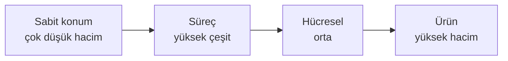
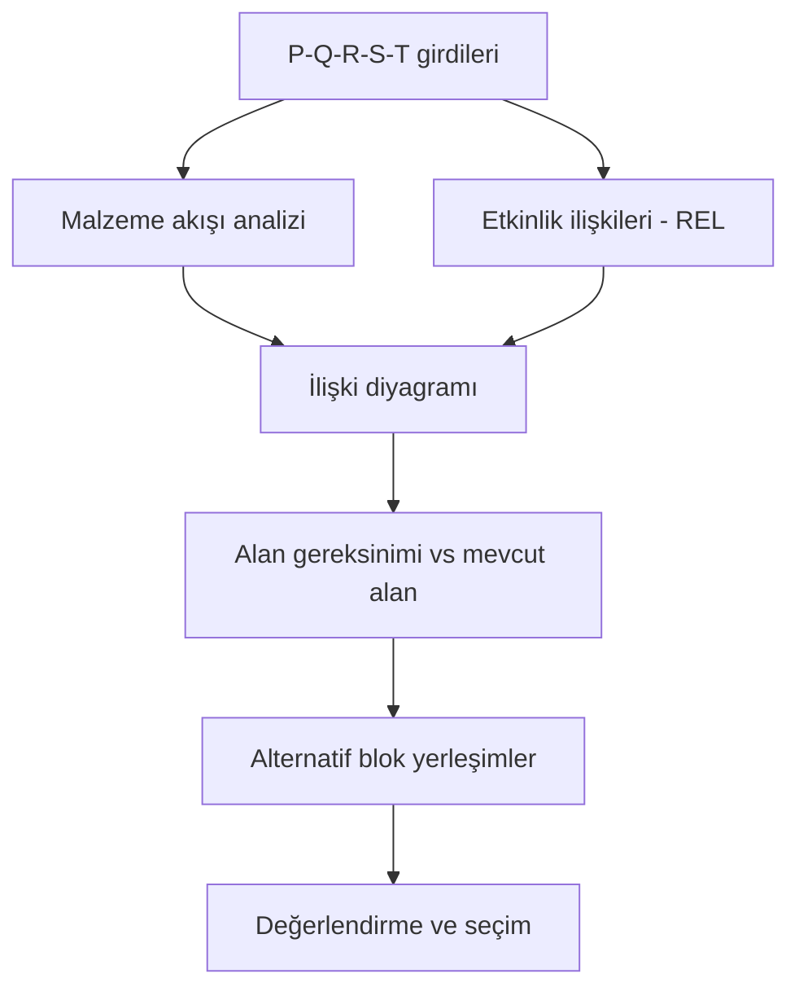

# HF07 - Yerleşim Tasarımı I

!!! abstract "Bu hafta ne öğreneceğiz?"
    Yerleşim tiplerinin seçimi (ürün/süreç/sabit/hücresel), taşıma maliyeti minimizasyonu, Sistematik Yerleşim Planlama (SLP) ve yerleşim değerlendirme puanlaması.

---

## Sınav Sorusu ile Başla

!!! example "Gerçek Sınav Sorusu Tarzı"
    *"6 bölümlü bir fabrikada 2×3 ızgara düzeninde komşu çiftler 1 $, komşu olmayanlar 2 $ maliyet taşıyor. Başlangıç yerleşimi: üst sıra 1-2-3, alt sıra 4-5-6. Haftalık akışlar: F₁₃=100, F₂₃=30, F₃₆=100 ... Toplam maliyeti hesaplayın ve iyileştirme öneriniz nedir?"*

**Bu soruyu çözmek için şunları bilmen lazım:**

1. Komşu çifti nasıl tanımlarsın (ortak kenar)
2. $Z = \sum X_{ij} \cdot C_{ij} \cdot d_{ij}$ formülünü nasıl uygularsın
3. Hangi bölümleri değiştirmenin en büyük tasarrufu sağlar

---

## Bunu 5 Yaşındaki de Anlar

Düşün ki oyuncaklarını düzenliyorsun:

- Lego seti her gün kullanıyorsan → **gözünün önüne** koy (hızlı ulaşmak için)
- Dev bir gemi maket varsa → **masada** duruyor, sen çevresinde dolaşıyorsun
- Hem Lego hem araba yarışı pistini kullanıyorsan → **ikisini yakın** yerlere koy

Fabrikada da aynı mantık geçerli. Makineleri ve bölümleri doğru yerlere koymazsan, insanlar ve malzemeler boşuna km yürür, zaman ve para boşa gider.

---

## 1. Neden Önemli?

Tesis yerleşimi; departmanların, iş merkezlerinin ve ekipmanların akışa göre düzenlenmesidir. Üç açıdan kritiktir:

1. **Yüksek maliyet:** Kurulum ve değişiklik pahalıdır
2. **Geri dönemezsin:** Yapılan hatayı düzeltmek (makineyi sökmek, binayı bölmek) çok zordur
3. **Her gün maliyet üretir:** Kötü yerleşim, yıllarca yüksek taşıma ve WIP maliyetine yol açar

!!! info "Gerçek hayat"
    Bir hastanede radyoloji acil servisten uzaksa her hasta dakikalarca gecikir. Bir fabrikada boya hanesi montajdan uzaksa her gün yüzlerce gereksiz forklift turu yapılır.

---

## 2. Yerleşim Tipleri

### 🍪 5 Yaşındaki Versiyonu

| Oyuncak analojisi | Fabrika karşılığı |
|---|---|
| Lego fabrikası: hep aynı şeyi yapıyor, hızlı, sıralı | **Ürün yerleşimi** |
| Dev gemi maketi: ürün hareket etmiyor, sen etrafında çalışıyorsun | **Sabit konum** |
| Her çocuğun farklı bir oyuncak istediği oyun odası: çok çeşit, az adet | **Süreç yerleşimi** |
| Benzer oyuncakları grupladın, her gruba kendi köşe | **Hücresel yerleşim** |

### Karşılaştırma tablosu

| Tip | Uygun koşul | Örnek | Güçlü yön | Zayıf yön |
|---|---|---|---|---|
| **Ürün** | Yüksek hacim, standart ürün | Toyota montaj hattı | Hızlı, düşük birim maliyet | Düşük esneklik, darboğaza bağımlı |
| **Süreç** | Düşük hacim, yüksek çeşit | Hastane, atölye | Esnek, makineler verimli | Uzun taşıma, yüksek WIP |
| **Sabit konum** | Büyük / hantal ürün | Gemi, uçak, köprü | Ürün hareket etmez | Makine kurulum maliyeti yüksek |
| **Hücresel** | Ürün aileleri | Ambulans üretimi | Ürün + süreç avantajı | Hücre dengeleme zor |

---

## 3. Taşıma Maliyeti Minimizasyonu

### 🍪 5 Yaşındaki Versiyonu

"En çok arkadaşını ziyaret ettiğin kişiyi komşun yap. Uzakta yaşayan arkadaşını çok görmüyorsun zaten."

Fabrikada da: **en fazla malzeme taşınan bölümleri yan yana koy**, taşıma maliyeti düşsün.

### Formül

$$
Z = \sum_{i}\sum_{j} X_{ij} \cdot C_{ij} \cdot d_{ij}
$$

| Sembol | Açıklama |
|--------|----------|
| $X_{ij}$ | $i$'den $j$'ye taşınan yük miktarı |
| $C_{ij}$ | Birim taşıma maliyeti |
| $d_{ij}$ | $i$–$j$ arası uzaklık (veya komşuluk katsayısı) |
| $Z$ | Toplam taşıma maliyeti → **minimize** edilir |

!!! warning "Komşuluk katsayısı ≠ gerçek uzaklık"
    Bazı sorularda: komşu çift → katsayı 1, komşu olmayan → katsayı 2. Bu gerçek metre değil, sorunun belirlediği kuraldır. Soruyu dikkatli oku!

### Tam Çözümlü Örnek (6 Bölüm)

!!! example "Soru"
    6 departman, 2×3 ızgara. Komşu çift maliyeti 1 \$, komşu olmayan 2 \$. Haftalık akışlar: $F_{12}=50$, $F_{13}=100$, $F_{16}=20$, $F_{23}=30$, $F_{24}=50$, $F_{25}=10$, $F_{34}=20$, $F_{36}=100$, $F_{45}=50$.

**Başlangıç yerleşimi:**

| 1 | 2 | 3 |
|---|---|---|
| 4 | 5 | 6 |

| Çift | Akış | Katsayı | Katkı |
|------|------|---------|-------|
| 1-2 | 50 | 1 | 50 |
| 1-3 | 100 | 2 | **200** |
| 1-6 | 20 | 2 | 40 |
| 2-3 | 30 | 1 | 30 |
| 2-4 | 50 | 1 | 50 |
| 2-5 | 10 | 1 | 10 |
| 3-4 | 20 | 2 | 40 |
| 3-6 | 100 | 1 | 100 |
| 4-5 | 50 | 1 | 50 |

$$Z_0 = 570 \$$$

**İyileştirme:** 1 ve 2 yer değiştirsin → `2 1 3 / 4 5 6`. Artık 1-3 komşu (akış 100, katsayı 1 oldu):

$$Z_1 = 480 \$ \quad \Rightarrow \quad \text{Tasarruf} = 90 \$ \ (\%15{,}79)$$

!!! success "Sonuç"
    En yüksek akışlı çifti (1-3 = 100) komşu yapmak 90 \$/hafta tasarruf sağlar.

---

## 4. Sistematik Yerleşim Planlama (SLP)

### 🍪 5 Yaşındaki Versiyonu

"Oda düzenlemeden önce bir plan yap:

1. Hangi eşyaların var?
2. Ne kadar yer tutuyorlar?
3. Hangileri birbirine yakın olmalı?
4. Alternatif planları kağıda çiz.
5. En iyisini seç."

SLP de tam bu — fabrika için.

### Girdiler: P-Q-R-S-T

| Harf | İngilizce | Türkçe |
|------|-----------|--------|
| **P** | Product | Ürün |
| **Q** | Quantity | Miktar |
| **R** | Routing | Rota / iş akışı |
| **S** | Supporting services | Yardımcı hizmetler |
| **T** | Time | Zaman |

### SLP Adımları

1. Girdi verileri ve faaliyetler
2. Malzeme akışı (from-to matrisi)
3. Faaliyet ilişkileri (A-E-I-O-U-X)
4. İlişki diyagramı
5. Alan gereksinimleri
6. Mevcut alan
7. Alan ilişki diyagramı
8. Değiştirici hususlar ve kısıtlar
9. Alternatif düzenlemeler
10. **Değerlendirme ve seçim**

---

## 5. Algoritma Sınıflandırması

| Sınıf | Başlangıç | Ne yapar | Örnek |
|---|---|---|---|
| **Kurma** | Boş alan | Sıfırdan yerleşim oluşturur | CORELAP, ALDEP |
| **İyileştirme** | Mevcut yerleşim | Değişimlerle geliştirir | CRAFT |
| **Değerlendirme** | Verilen yerleşim | İyi yerleşimi kötüden ayırır | Komşuluk puanı |

---

## 6. Yerleşim Değerlendirme

### Komşuluk esaslı puan

$$
S_A = \sum_{i<j} w_{ij} \cdot x_{ij}
$$

$x_{ij}=1$ → $i$ ve $j$ ortak sınır paylaşıyor (komşu)  
$x_{ij}=0$ → paylaşmıyor

Standart ağırlıklar:

| REL | A | E | I | O | U | X |
|-----|---|---|---|---|---|---|
| $w$ | 8 | 4 | 2 | 1 | 0 | -8 |

Amaç $S_A$'yı **maksimize** etmek.

### Uzaklık esaslı maliyet

$$
Z_D = \sum_i\sum_{j \neq i} f_{ij} \cdot c_{ij} \cdot d_{ij}
$$

$d_{ij} = |x_i - x_j| + |y_i - y_j|$ (dik doğrusal uzaklık) → **minimize** edilir.

### Tam Çözümlü Örnek (Komşuluk Puanı)

!!! example "Soru"
    7 bölümlü yerleşim. Komşu çiftler: 1-2=E, 1-3=O, 1-6=U, 2-4=E, 2-6=O, 3-7=U, 4-5=I, 5-6=A, 6-7=E.

| Çift | REL | Puan |
|------|-----|------|
| 1-2 | E | 4 |
| 1-3 | O | 1 |
| 1-6 | U | 0 |
| 2-4 | E | 4 |
| 2-6 | O | 1 |
| 3-7 | U | 0 |
| 4-5 | I | 2 |
| 5-6 | A | 8 |
| 6-7 | E | 4 |

$$S_A = 4+1+0+4+1+0+2+8+4 = \mathbf{24}$$

---

## 7. İlişki Diyagramı Kurma (Metot II)

### 🍪 5 Yaşındaki Versiyonu

"Kim herkesle en çok arkadaş? Onu ortaya koy. Sonra onunla en iyi arkadaşını yanına ekle. Böyle böyle herkesi yerleştir."

### Adımlar

1. En çok "A" ilişkisi olan bölümü seç → **ilk bölüm**
2. Onunla "A" ilişkili ikinci bölümü seç
3. Her yeni aday için **ilişki imzasını** belirle (yerleşmiş bölümlerle ilişkilerini sırala)
4. İmzaları öncelik dizisiyle karşılaştır:

$$AA > AE > AI > A* > EE > EI > E* > II > I* \quad (* = O \text{ veya } U)$$

5. En güçlü ilişkilere en yakın konuma ekle

### Tam Çözümlü Örnek (7 Bölüm)

!!! example "Kaynak: Ders Sunumu, Slayt 71-81"
    A ilişkisi yalnız D5-D6'da var. D6 ilk seçilir. Ardından: D5 → D7 → D2 → D4 → D1 → D3.

$$\boxed{6 \to 5 \to 7 \to 2 \to 4 \to 1 \to 3}$$

Birim kare dönüşümü ($a_0 = 2.000$ ft²):

| Bölüm | Alan (ft²) | Birim kare |
|-------|-----------|-----------|
| D1 | 12.000 | 6 |
| D2 | 8.000 | 4 |
| D3 | 6.000 | 3 |
| D4 | 12.000 | 6 |
| D5 | 8.000 | 4 |
| D6 | 12.000 | 6 |
| D7 | 12.000 | 6 |

Toplam **35** birim kare.

---

## 8. Sık Yapılan Hatalar

!!! warning "Dikkat"
    - **Yönlü matrisin yarısını yok saymak:** $f_{ij}$ ve $f_{ji}$ ayrıdır; simetrik uzaklık, yönlü akışı silmek için gerekçe değildir.
    - **X ilişkisini U gibi saymak:** X = kaçınılması gereken ilişki → $w = -8$.
    - **Köşe temasını komşuluk saymak (değerlendirmede):** Değerlendirme puanında yalnız ortak **kenar** komşuluktur.
    - **Alanı aşağı yuvarlamak:** Birim kare sayısında tavan kullanılmalı.
    - **Komşuluk katsayısını (1/2) gerçek uzaklıkla karıştırmak.**

---

## 9. Pratik Sorular

!!! question "Soru 1"
    A-B arası 40, B-A arası 10 yük taşınıyor. Uzaklık 3 birim, birim maliyet 2 TL/yük. Toplam maliyet?

??? success "Cevap"
    $(40+10) \times 2 \times 3 = \mathbf{300 \text{ TL}}$. Yönlü matriste her iki yön ayrı sayılır.

!!! question "Soru 2"
    Komşu çiftler: 1-2=A, 1-3=E, 2-4=X, 3-4=I, 4-5=A. Standart ağırlıklarla komşuluk puanı?

??? success "Cevap"
    $S_A = 8 + 4 + (-8) + 2 + 8 = \mathbf{14}$. X ilişkisi −8 alınır, sık yapılan hata pozitif yazmaktır.

!!! question "Soru 3"
    Ürün yüksek hacimli ve standart; başka bir ürün çok büyük ve düşük talepli. Her biri için hangi yerleşim tipi?

??? success "Cevap"
    Yüksek hacim/standart → **Ürün yerleşimi** (montaj hattı). Büyük/hantal/düşük talep → **Sabit konum** (ürün sabit, kaynaklar ürüne taşınır; gemi, uçak gibi).

!!! question "Soru 4"
    Metot II'de yerleştirilmiş iki bölümle ilişkileri `(A,U)` ve `(E,E)` olan iki aday var. Hangisi önce seçilir?

??? success "Cevap"
    Öncelik dizisinde `A*` (yani `AU`), `EE`'den önce gelir → **(A,U) adayı** seçilir.

---
