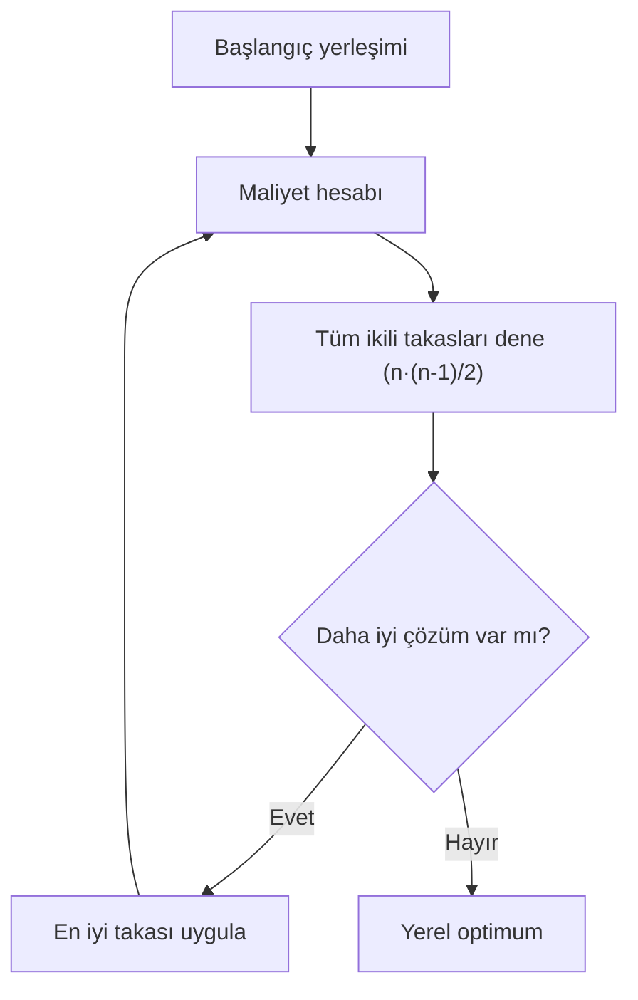

# HF08 - Yerleşim Tasarımı II

!!! abstract "\1"
> Yerleşim algoritmaları ya boş alana çözüm **kurar** (grafik tabanlı) ya da mevcut bir yerleşimi bölüm değişimleriyle **iyileştirir** (ikili yer değişimi, CRAFT). Bu haftanın üç yöntemi de yerel arama mantığıyla çalışır: her adımda olası takasların maliyet etkisi hesaplanır, en çok iyileştiren uygulanır, iyileşme kalmayınca durulur. Hiçbiri küresel optimumu garanti etmez; sonuç başlangıç yerleşimine bağlıdır.

## Sınıflandırma

| Sınıf | Başlangıç | Örnek yaklaşım |
|---|---|---|
| Kurma algoritması (construction) | Boş alan | Grafik tabanlı, ALDEP, CORELAP, PLANET, BLOCPLAN |
| İyileştirme algoritması (improvement) | Mevcut yerleşim | İkili değişim, **CRAFT**, MCRAFT, MULTIPLE |
| Karma | Başlangıç + yerel arama | Kur ve sonra iyileştir |

!!! tip "\1"
> Kurma esaslı algoritmanın çıktısı, iyileştirme esaslı algoritmanın girdisi olarak kullanılırsa daha iyi sonuç elde edilir. Tipik akış: grafik tabanlı yöntem → başlangıç bloğu → CRAFT iyileştirmesi.

## Uzaklığın hesaplanması

Tüm bu yöntemlerde uzaklık, bölüm **ağırlık merkezleri** (kütle merkezi) arasındaki **dik doğrusal (rektiliner)** uzaklıktır:

$$d_{ij}=|x_i-x_j|+|y_i-y_j|$$

Toplam taşıma maliyeti (akış-mesafe maliyeti):

$$C(L)=\sum_i\sum_{j\ne i} f_{ij}\,c_{ij}\,d_{ij}(L)$$

Burada $f_{ij}$ akış (gezi/taşıma miktarı), $c_{ij}$ birim taşıma maliyeti (çoğu kez $1$), $d_{ij}$ ise ağırlık merkezleri arası rektiliner uzaklıktır.

!!! example "\1"
> A merkezi ile B merkezi arası: $D_{AB}=1{,}5+1=2{,}5$. B ile C arası: $D_{BC}=(5-1{,}5)+(1+1{,}5)=3{,}5+2{,}5=6$.

---

## 1. İkili yer değişim yöntemi (Pairwise Exchange Method)

İyileştirme esaslı, mesafe esaslı bir yöntemdir. Her adımda **sadece iki bölümün** yeri karşılıklı değiştirilir; tüm ikili kombinasyonlar denenir ve amaç fonksiyonunu en çok iyileştiren takas seçilir.

### Algoritma

1. Mevcut başlangıç yerleşiminin toplam maliyetini hesapla.
2. Bir iterasyonda yapılabilecek tüm ikili yer değişimlerini üret — toplam $\binom{n}{2}=\dfrac{n(n-1)}{2}$ aday.
3. Her takas için uzaklık matrisini yeniden kur ve yeni maliyeti hesapla.
4. Toplam maliyeti en çok azaltan ikili değişimi seç ve uygula.
5. Elde edilen en düşük maliyet bir önceki iterasyondan daha iyi değilse prosedürü sonlandır (yerel optimum).

!!! warning "\1"
> `[3,2,1,4]` yazımı, konum 1'de bölüm 3, konum 2'de bölüm 2, konum 3'te bölüm 1, konum 4'te bölüm 4 demektir. **Uzaklık matrisi konumlara**, **akış matrisi bölüm adlarına** aittir. Bir takas sonrası konum haritasını yeniden yazmadan eski uzaklıkları kullanmak en sık yapılan hatadır.

### Tam çözümlü örnek (slayt 20-26)

Eşit büyüklükte dört bölüm doğrusal `[1,2,3,4]` yerleşimindedir. Konum uzaklığı sıra farkı, $c=1$ ve çift akışları aşağıdadır.

| Çift | 1-2 | 1-3 | 1-4 | 2-3 | 2-4 | 3-4 |
|---|---:|---:|---:|---:|---:|---:|
| Akış | 10 | 15 | 20 | 10 | 5 | 5 |

**Başlangıç:**

$$C_{1234}=10(1)+15(2)+20(3)+10(1)+5(2)+5(1)=125$$

**1. iterasyon** ($\binom{4}{2}=6$ takas):

| Takas | Yeni sıra | Maliyet |
|---|---|---:|
| 1-2 | 2134 | 105 |
| 1-3 | 3214 | **95** |
| 1-4 | 4231 | 120 |
| 2-3 | 1324 | 120 |
| 2-4 | 1432 | 105 |
| 3-4 | 1243 | 125 |

En iyi takas 1-3'tür → yeni sıra `3214`, maliyet 95.

**2. iterasyon:** `3214`'ten tüm takaslar denenir; en iyisi bölüm 3 ile 2'nin takasıdır:

$$C_{2314}=10(1)+15(1)+20(2)+10(1)+5(3)+5(2)=90$$

**3. iterasyon:** `2314`'ten 90'ın altına inen aday yoktur → **durur**.

> [!success] Sonuç
> Nihai yerleşim `2314`, maliyet **90**. Tasarruf $125-90=35$ (%28). Bu yerel optimumdur; başlangıç farklı olsaydı sonuç değişebilirdi.

---

## 2. Grafik tabanlı yöntem (Graph-Based Method)

Kurma esaslı bir algoritmadır. Bölümler **düğüm (köşe)**, sağlanması istenen komşuluklar **ağırlıklı kenar (ayrıt)** olarak gösterilir. Amaç, yüksek ağırlıklı kenarların komşu olduğu, kenarların kesişmediği bir **düzlemsel (planar)** grafik kurmak ve onu blok plana çevirmektir.

- İki faaliyetin ortak sınırı varsa "yakın/bitişik" sayılır.
- Serim düzlemsel değilse (kenarlar kesişiyorsa) çözüm yoktur; düzlemselse blok diyagramına geçilir.
- Kenarlarla çevrili bölgeye **yüz (face)** denir; sınırlanmamış dış bölge **harici yüzdür**.

Komşuluk skoru:

$$S(G)=\sum_{(i,j)\in E(G)} w_{ij}$$

### Prosedür

1. En büyük ağırlıklı bölüm çiftini seç.
2. Bu iki düğüme toplam ağırlığı en büyük üçüncü düğümü ekle: $s_k=w_{ka}+w_{kb}$.
3. Bir yüz oluşturacak biçimde dördüncü düğümü ekle (yüz puanı $s(k,F)=\sum_{i\in\partial F}w_{ki}$).
4. Bitişik grafiği tamamla; kenarların kesişmediğini kontrol et.
5. Bağlı düğümleri ortak sınır paylaşacak biçimde blok plana dönüştür.

!!! example "\1"
> Beş bölümde en ağır çift $w_{34}=20$ (çekirdek 3-4). Üçüncü düğüm için $s_2=12+13=25$ en yüksektir → 2 eklenir. Dördüncü düğüm için yüz `{2,3,4}` üzerinde $s(1,F)=9+8+10=27$ → 1 eklenir. Son düğüm 5, en iyi yüze yerleşir. Toplam pozitif komşuluk skoru $S=81$.

!!! note "\1"
> Grafik yöntemi yalnız komşuluğu değerlendirir; gerçek mesafeyi, ortak sınır uzunluğunu, bölüm alanını ve koridor rotasını puanlamaz. Bu yüzden nihai ayrıntılı plan değil, bir **kurma aracıdır**. Bitişik tesisler arasındaki ilişkiyi kuvvetli sayar, birden fazla çözüm üretir, bilgisayar uygulaması zordur.

---

## 3. CRAFT (Computerized Relative Allocation of Facilities Technique)

İyileştirme esaslı bir algoritmadır. Mevcut bir tesisin **taşıma maliyetini** minimize eder:

$$\text{Taşıma Maliyeti}=\text{Akış}\times\text{Birim Maliyet}\times\text{Uzaklık}$$

**Üç temel matris** kullanır: uzaklık ($D$), iş akış miktarı ($F$, from-to chart), birim taşıma maliyeti ($C$, çoğu kez 1). $n$ yerleşim yeri için bir iterasyonda $\dfrac{n(n-1)}{2}$ ikili takas, en fazla $2(n-2)!$ iterasyon olabilir.

### Varsayımlar

- Hareket maliyeti donanım kullanımına bağlı değildir.
- Hareket maliyeti, hareket uzunluğuyla **doğrusal** ilişkilidir.
- Uzaklık ölçüsü, bölüm merkezleri arası **dik doğrusal** uzaklıktır.
- Veriler from-to (geliş-gidiş) şemasından alınır.
- Tesisin dış yapısı kare/dikdörtgen olmalıdır; değilse kalan alanlar sabit (yapay/dummy) bölüm olur.

### CRAFT algoritması (10 adım, slayt 49)

1. Bölümlerin ağırlık merkezlerini bul.
2. Ağırlık merkezleri arasındaki dik doğrusal uzaklıkları hesapla.
3. Yerleşimin toplam taşıma maliyetini hesapla.
4. Eşit alana sahip bölümler **veya** ortak (genel) sınırı olan bölümler arasındaki değişimleri ele al.
5. Her olası değişimin taşıma maliyetindeki değişim miktarını belirle.
6. Maliyette en büyük düşüşü sağlayan bölüm değişimini seç ve uygula.
7. Maliyeti azaltan hiçbir ikili değişim kalmayana kadar yeni yerleşimler için tekrarla.
8. İkili-üçlü değişimleri dene; en iyisini uygula.
9. Gerçek ağırlık merkezlerini (yeni geometriyle) yeniden hesapla.
10. Daha iyisi bulunmayana kadar tekrarla.

CRAFT çıktı seçenekleri: yalnız ikili, yalnız üçlü, ikiliyi izleyen üçlü, üçlüyü izleyen ikili, en iyi ikili-üçlü değişim.

### Ağırlık merkezi ve maliyet değişim formülü

Eşit alanlı hücrelerden oluşan bir bölümün ağırlık merkezi:

$$x_i=\frac{1}{n_i}\sum_{h\in i}x_h,\qquad y_i=\frac{1}{n_i}\sum_{h\in i}y_h$$

Farklı alanlı parçalar varsa **alan ağırlıklı** merkez kullanılır:

$$x_i=\frac{\sum_h a_h\,x_h}{\sum_h a_h},\qquad y_i=\frac{\sum_h a_h\,y_h}{\sum_h a_h}$$

İki bölümün merkezleri geçici olarak takas edilerek maliyet değişimi **tahmin** edilir. Bir $i$-$j$ takasının toplam maliyetteki değişimi:

$$\Delta C = 2\times w_{ij}\times (d_{\text{old}}-d_{\text{new}})$$

Burada $w_{ij}$ iki bölüm arası toplam akış (simetrik akışta $f_{ij}+f_{ji}$), çarpan $2$ ise hem $i\!\to\!j$ hem $j\!\to\!i$ yönünü kapsar. $\Delta C<0$ olan takaslar maliyeti **düşürür** ve uygulanmaya değerdir; en negatif $\Delta C$'li takas seçilir.

!!! warning "\1"
> Farklı alanlı (çok hücreli) bölümlerde merkezi **basit koordinat ortalamasıyla** bulmak yanlıştır. Her hücrenin koordinatı kendi **alanı ile ağırlıklandırılmalıdır**: $x_i = \frac{\sum a_h x_h}{\sum a_h}$. Alan çarpanını unutmak (yalnız koordinatları toplayıp bölmek), büyük bölümlerin merkezini yanlış yere kaydırır ve tüm uzaklık matrisini bozar. Ayrıca takas sonrası şekil değiştiyse merkezleri **gerçek geometriyle yeniden hesapla** — tahmini merkez nihai değildir.

!!! warning "\1"
> Hücre kenarı 20 ft ise, uzaklık matrisindeki "1 birim" = 20 ft'tir. Birim taşıma maliyetinin uzaklık birimi de buna uymalıdır; aksi halde $C$ sayısal olarak anlamsız olur.

### Tam çözümlü CRAFT örneği — 5 iş merkezi (slayt 73-83)

Beş iş merkezi A-E konumlarına yerleştirilecek. $c_{ij}=1$. Başlangıç ataması `1A, 2B, 3C, 4D, 5E`.

**Uzaklık matrisi (konum):**

|  | A | B | C | D | E |
|---|---:|---:|---:|---:|---:|
| A | 0 | 5 | 6 | 7 | 8 |
| B | 5 | 0 | 7 | 8 | 10 |
| C | 6 | 7 | 0 | 6 | 5 |
| D | 7 | 8 | 6 | 0 | 7 |
| E | 8 | 10 | 5 | 7 | 0 |

**Akış matrisi (bölüm, yönlü):**

|  | 1 | 2 | 3 | 4 | 5 |
|---|---:|---:|---:|---:|---:|
| 1 | 0 | 50 | 30 | 40 | 10 |
| 2 | 20 | 0 | 25 | 5 | 45 |
| 3 | 40 | 45 | 0 | 30 | 15 |
| 4 | 60 | 5 | 20 | 0 | 35 |
| 5 | 55 | 3 | 3 | 15 | 0 |

**Adım 1-3 (Başlangıç maliyeti):** Akış ile uzaklık matrislerinin karşılıklı hücreleri çarpılıp toplanır. Satır toplamları 790, 765, 810, 825, 590 → $C_0 = 3.780$ birim.

**1. iterasyon** — $\binom{5}{2}=10$ ikili aday:

| Takas | Maliyet |  |
|---|---:|---|
| 1-2 | 3.904 | |
| **1-3** | **3.589** | **MİN** |
| 1-4 | 3.945 | |
| 1-5 | 3.838 | |
| 2-3 | 3.710 | |
| 2-4 | 3.706 | |
| 2-5 | 3.731 | |
| 3-4 | 3.746 | |
| 3-5 | 3.856 | |
| 4-5 | 3.707 | |

En düşük 3.589, takas **1-3** → yeni atama `3A, 2B, 1C, 4D, 5E`.

**2. iterasyon:** `3A,2B,1C,4D,5E` başlangıç alınıp 10 takas yeniden denenir. Kaynak slayt, **4-5** takasıyla `3A,2B,1C,5D,4E` atamasının minimum verdiğini ve maliyetin **3.310** olduğunu belirtir. Kesin çözümün 12. iterasyonda bulunabileceği not edilir.

> [!danger] Kaynak slayt sayısal uyarısı
> Slayt 83 ikinci iterasyon için **3.310** yazar, ancak öğrenme paketinde slayt 73'teki iki matrisin bağımsız çarpım-toplamı `3A,2B,1C,5D,4E` ataması için **3.510** vermektedir. Sınavda kaynak değeri (3.310) beklenebilir; ancak matrisi elle çarparken 3.510 çıkarsa şaşırma — hesabını matris çarpımıyla **bağımsız doğrula**. Ayrıntı için → \1.

### Ağırlık merkezi örneği — 7 bölüm (slayt 84-86)

48×36 = 1728 m² alana yedi bölüm yerleşir. Birim hücre 3×3 = 9 m². Bölümler hücrelere bölünür, **alan ağırlıklı** ağırlık merkezleri hesaplanır:

| Bölüm | Birim Alan (hücre) | Ağırlık Merkezi (x,y) |
|---|---:|---|
| A - Ambar | 32 | (4, 2) |
| B - Torna | 16 | (2, 6) |
| C - Freze | 16 | (6, 6) |
| D - Kaynakhane | 32 | (4, 10) |
| E - Montaj | 28 | (11,5 , 10) |
| F - Kontrol/Ambalaj | 32 | (12, 6) |
| G - Gönderme | 32 | (12, 2) |
| H - Boş Alan (dummy) | 4 | — |

Bu merkezlerden rektiliner uzaklıklar çıkarılır (örn. $d_{AB}=|4-2|+|2-6|=6$), gezi sayısı (akış) ile çarpılıp toplanır → başlangıç toplam maliyet **2.960** birim. Buradan CRAFT iyileştirmesine geçilir.

### CRAFT'ta komşuluğun yetersizliği

!!! warning "\1"
> İki bölüm eşit alanlı **değilse** komşuluk gereklidir fakat ikili değişim için **yeterli koşul değildir**. Eğer bir bölüm parçalanamıyor (bağlantısı kopuyor) veya başka bölümlerle uygun şekil kuramıyorsa, komşu olsa bile takas yapılamaz. Büyük bölüm kaydırılmadan iki eşit olmayan alanın ikili değişimi her zaman mümkün değildir.

### Avantaj / Dezavantaj tablosu

| Avantajları | Dezavantajları |
|---|---|
| Sabit (dummy/yapay) bölümler tanımlanabilir | Tüm değişiklikler sınanmaz → yalnız **yerel optimum** |
| Kısa bilgisayar zamanı gerektirir | Başlangıç yerleşimini **kendisi oluşturmaz** |
| Karmaşık matematiksel hesap gerektirmez | İstenmeyen yakınlıkları göz önüne almaz |
| Maliyet ve tasarrufları açıkça gösterir | Bölüm sayısı sınırlıdır |
| Bölüm şekillerinde esneklik sağlar | Bir bölümün alanı **bölünebilir** (kopabilir) |
| Yapay genişletmelerle dikdörtgen olmayan tesisler, koridorlar, engeller işlenebilir | Takas için bölümler ya eşit alanlı ya komşu ya ortak sınırdaş olmalı |
| Başlangıç yerleşimini hassasiyetle kapsar | Sonuç **başlangıca bağlı**; farklı başlangıçlar farklı sonuç verir |

!!! warning "\1"
> Her bölüm çifti fiziksel olarak değiştirilemez. Bir takası uygulamadan önce kontrol et: alanlar eşit mi? Değilse komşu/ortak sınırlı mı? Bölüm bütünlüğü (bağlantılılık) korunuyor mu? Sabit ekipman, kat, şekil kısıtları ihlal ediliyor mu?

---

## Karşılaştırma

| Özellik | İkili değişim | Grafik tabanlı | CRAFT |
|---|---|---|---|
| Tip | İyileştirme | Kurma | İyileştirme |
| Başlangıç gerekir mi? | Evet | Hayır | Evet |
| Ölçüt | Mesafe-akış maliyeti | Komşuluk ağırlığı | Mesafe-akış maliyeti |
| Bölüm alanları | Genelde eşit | İşlenmez (sadece ilişki) | Eşit veya komşu/dummy ile farklı |
| Değişim türü | Yalnız ikili | — (ekleme) | İkili + üçlü |
| Optimum | Yerel | Çoklu çözüm | Yerel |

---

## Öğrenme paketleri

- \1 (tam iterasyon, $\binom{n}{2}$, isim-konum tuzağı)
- \1 (düğüm-kenar-yüz, düzlemsellik, yüz puanı)
- \1 (üç matris, ağırlık merkezi, ΔC, slayt sayısal uyarıları)

## Pratik sorular

> [!question] Soru 1 — Ağırlık merkezi (alan × koordinat)
> P bölümü, merkezleri $(1,1),(3,1),(1,3)$ olan üç **eşit** hücreden; Q bölümü $(5,4)$ merkezli tek hücreden oluşuyor. P'nin ağırlık merkezini ve P-Q dik doğrusal uzaklığını bulun.

> [!success]- Çözüm
> Eşit hücrelerde basit ortalama yeterli:
> $$P=\left(\tfrac{1+3+1}{3},\ \tfrac{1+1+3}{3}\right)=\left(\tfrac{5}{3},\tfrac{5}{3}\right)$$
> $$d_{PQ}=\left|5-\tfrac{5}{3}\right|+\left|4-\tfrac{5}{3}\right|=\tfrac{10}{3}+\tfrac{7}{3}=\tfrac{17}{3}\approx 5{,}67$$
> Not: Hücreler **farklı alanlı** olsaydı her koordinatı alanıyla çarpıp toplam alana bölmek gerekirdi.

> [!question] Soru 2 — ΔC ile takas kararı
> Üç konumun uzaklıkları $d_{AB}=2,\ d_{AC}=3,\ d_{BC}=5$; bölümler arası simetrik akışlar $w_{12}=2,\ w_{13}=3,\ w_{23}=10$, $c=1$. Başlangıç `1A,2B,3C`. Tüm ikili takasların maliyetini hesapla, en iyisini seç.

> [!success]- Çözüm
> Başlangıç: $C_0=2(d_{AB})+3(d_{AC})+10(d_{BC})=2(2)+3(3)+10(5)=63$.
> - **1-2 takası** (1→B, 2→A): $d_{13}=d_{BC}=5$, $d_{23}=d_{AC}=3$ → $C=2(2)+3(5)+10(3)=49$. ($\Delta C=-14$)
> - **1-3 takası** (1→C, 3→A): $d_{12}=d_{CB}=5$, $d_{23}=d_{BA}=2$ → $C=2(5)+3(3)+10(2)=39$. ($\Delta C=-24$)
> - **2-3 takası** (2→C, 3→B): $d_{12}=d_{AC}=3$, $d_{13}=d_{AB}=2$ → $C=2(3)+3(2)+10(5)=62$. ($\Delta C=-1$)
> En negatif $\Delta C$ takas **1-3** → yeni atama `3A,2B,1C`, maliyet **39**.

> [!question] Soru 3 — Yönlü akışta toplam maliyet
> `1A,2B,3C` atamasında $d_{AB}=4,\ d_{AC}=6,\ d_{BC}=3$. Yönlü akışlar $f_{12}=10,\ f_{21}=5,\ f_{13}=2,\ f_{31}=8,\ f_{23}=7,\ f_{32}=1$ ve $c=2$. Toplam taşıma maliyetini bul.

> [!success]- Çözüm
> Yönlü akışlarda her çift için iki yönü topla, sonra uzaklıkla çarp:
> $$C=2\big[(10+5)\cdot 4+(2+8)\cdot 6+(7+1)\cdot 3\big]=2\big[60+60+24\big]=2(144)=288$$

> [!question] Soru 4 — Yöntem seçimi
> Boş bir binaya yerleşim yapılacak; başlangıç planı yok ve elimizde sadece bölümler arası ilişki ağırlıkları var. İkili değişim veya CRAFT doğrudan uygulanabilir mi?

> [!success]- Çözüm
> Hayır. Hem ikili değişim hem CRAFT **iyileştirme esaslıdır** ve bir başlangıç yerleşimi ister. Önce bir **kurma esaslı** yöntem (grafik tabanlı, ALDEP, CORELAP vb.) ile başlangıç bloğu üretilmeli, sonra iyileştirme yöntemine girdi olarak verilmelidir.

> [!question] Soru 5 — Komşuluk yeterli mi?
> Eşit olmayan, komşu iki bölümün merkez takası 500 birim tasarruf **tahmin** ediyor; ancak takas uygulanınca bloklardan biri iki kopuk parçaya ayrılıyor. Değişim kabul edilir mi?

> [!success]- Çözüm
> Hayır. Komşuluk gerekli olsa da yeterli değildir; **bölüm bütünlüğü (bağlantılılık)** korunmalıdır. Başka bir hücre aktarımıyla bütünlük sağlanamıyorsa aday elenir. Ayrıca tahmini tasarruf gerçek tasarruf değildir — yeni geometrinin gerçek merkezleriyle maliyet yeniden hesaplanmalıdır.

## Kaynaklar

- \1
- \1

Önceki: \1 · Sonraki: \1
