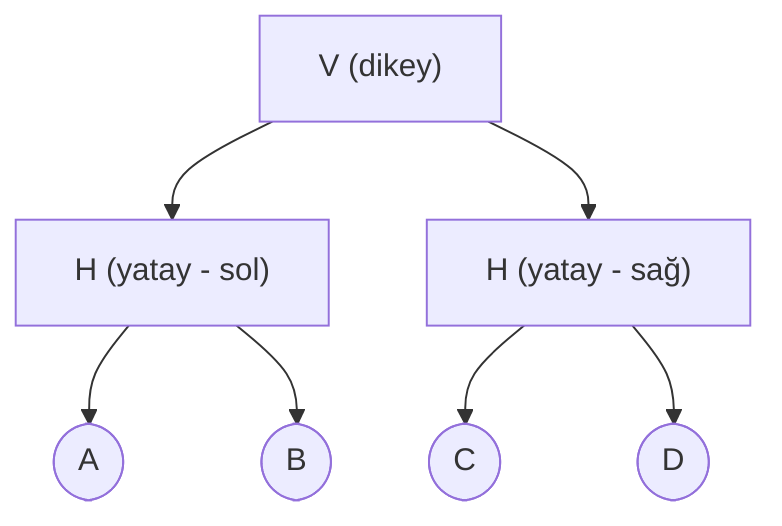

# HF09 - Yerleşim Tasarımı III

!!! abstract "Bu hafta ne öğreneceğiz?"
    **MCRAFT** (vektör + yılan süpürmesi), **BLOCPLAN** (nitel ilişkiyi sayısal puana çevirme) ve **LOGIC** (giyotin kesim ağacı) — blok yerleşim üretme ve iyileştirme algoritmaları.

---

## Sınav Sorusu ile Başla

!!! example "Gerçek Sınav Sorusu Tarzı"
    *"BLOCPLAN'da from-to matrisinden birleşik çift akışlar hesaplanmış ve A/E/I/O/U sınıflandırması yapılmıştır. Ağırlıklar A=10, E=5, I=2, O=1, U=0, X=-10. Verilen yerleşim için komşuluk puanı $Z_A$'yı ve etkinlik oranı $ER$'yi hesaplayınız."*

**Bu soruyu çözmek için şunları bilmen lazım:**

1. BLOCPLAN'da $Z_A$ = komşu çiftlerin ağırlık toplamı
2. $ER$ = $Z_A$ / tüm pozitif ilişki ağırlıklarının toplamı (X'i dışarıda bırak)
3. $RD$ = ilişki ağırlığı × uzaklık toplamı (minimize edilmeli)

---

## 1. Üç Algoritmanın Özeti (5 Yaşındaki)

Üç farklı "mobilya yerleştirme" stratejisi düşün:

| | MCRAFT | BLOCPLAN | LOGIC |
|--|--------|----------|-------|
| **Başlangıç** | Mevcut yerleşim var | Boş alan | Boş alan |
| **Yaklaşım** | Yılan sürüp takas et | Skor hesapla, iyisini seç | Odayı gitgide böl |
| **Girdi** | Akış + maliyet | İlişki şeması (A-E-I-O-U) | Alan + akış |

---

## 2. MCRAFT

### Fikir

Bölümleri bir **sıraya (vektöre)** koy. Onları yılan gibi kıvrılarak bantlara doldur. Sonra iki bölümü değiştir — maliyet düştü mü?

### Temel Formüller

$$w = \frac{H}{b} \quad \text{(bant genişliği)}$$

$$\ell_i = \frac{A_i}{w} \quad \text{(bölümün tek banttaki uzunluğu)}$$

$$C = \sum_{i<j} F_{ij} \cdot c_{ij} \cdot d_{ij}, \quad \Delta C = C_{\text{yeni}} - C_{\text{eski}}$$

| Sembol | Açıklama |
|--------|----------|
| $H$ | Tesis yüksekliği (enlemesi) |
| $b$ | Bant sayısı |
| $A_i$ | Bölüm alanı |
| $F_{ij}$ | Akış şiddeti |
| $c_{ij}$ | Birim taşıma maliyeti |
| $d_{ij}$ | Bölüm merkezleri arası uzaklık |

Karar: $\Delta C < 0$ → takas maliyeti düşürür → **uygula**.

### Yılan Süpürmesi

```
Bant 1: → A → C → D  (soldan sağa)
Bant 2: ← D ← B     (sağdan sola, U dönüşü)
Bant 3: → E          (tekrar soldan sağa)
```

Vektör `A-C-D-B-E` bu şekilde bantlara yayılır. Büyük bölümler bant geçişinde ikiye bölünebilir.

### MCRAFT Özellikleri

- CRAFT'tan farkı: **bitişik olmayan ve eş alanlı olmayan** bölümleri de değiştirebilir
- Değişim olunca **tüm yerleşim yeniden süpürülür** (blok aynen taşınmaz)

---

## 3. BLOCPLAN

### Fikir

From-to matrisini önce nicel (toplam akış), sonra nitel (A/E/I/O/U) sembollere, sonra sayısal ağırlıklara çevir. Her yerleşim alternatifini üç puanla değerlendir.

### Adım Adım

**Adım 1:** Toplam akış (flow-between):

$$F_{ij} = f_{ij} + f_{ji} \quad (i < j)$$

**Adım 2:** Aralıklarla A/E/I/O/U ata:

En büyük $F_{max}$'ı 5'e böl → eşit aralıklar:

| Aralık | İlişki |
|--------|--------|
| $0.8 F_{max}$ – $F_{max}$ | A |
| $0.6 F_{max}$ – $0.8 F_{max}$ | E |
| ... | ... |
| 0 – $0.2 F_{max}$ | U |

**Adım 3:** Ağırlık vektörü (genelde: A=10, E=5, I=2, O=1, U=0, X=-10)

**Adım 4:** Üç puan hesapla:

### Komşuluk Puanı ($Z_A$)

$$Z_A = \sum_{i<j} w_{ij} \cdot a_{ij}$$

$a_{ij} = 1$ → bölümler **ortak kenar** paylaşıyor (komşu), aksi halde 0.

**Büyük $Z_A$ iyidir.**

### Etkinlik Oranı ($ER$)

$$ER = \frac{Z_A}{\sum_{i<j} \max(w_{ij}, 0)}$$

Payda: yalnız **pozitif** ilişki ağırlıklarının toplamı (X çiftlerini dışarıda bırak).

**Büyük $ER$ iyidir** (0-1 arası).

### İlişki-Uzaklık Puanı ($RD$)

$$RD = \sum_{i<j} w_{ij} \cdot d_{ij}$$

$d_{ij}$ = bölüm merkezleri arası uzaklık.

**Küçük $RD$ iyidir.**

!!! warning "Z ve ER büyüt, RD küçüt!"
    Her üç puanı yan yana yaz: $Z_A$, $ER$, $RD$. İlk ikisi büyük olsun, sonuncusu küçük olsun. Karıştırma!

!!! example "BLOCPLAN Örnek"
    Komşu çiftler ve ağırlıkları: D1-D2 (A=10), D2-D4 (I=2), D3-D5 (E=5), D4-D5 (A=10)

    $Z_A = 10 + 2 + 5 + 10 = 27$

    Tüm pozitif ağırlık toplamı = 24 (örneğin)

    $ER = 27/24 = 1{,}125$ ... (**not**: $ER > 1$ olamaz — tüm A çiftleri komşu yapılırsa $ER = 1$. Eğer bazı X çiftleri komşu yapılmazsa $ER$ daha küçük çıkar. Dikkat: paydayı doğru hesapla.)

---

## 4. LOGIC

### Fikir

Bir odayı giderek daha küçük parçalara böl — ama yalnız "tam kesimler" kullanarak (kenar kenardan kenara gider).

### Giyotin Kesim ve Kesim Ağacı

**Giyotin kesim** = mevcut dikdörtgeni bir kenardan karşı kenara **tamamen** bölen kesim.

Kesim ağacı = ikili ağaç:
- **İç düğüm**: `V` (dikey kesim) veya `H` (yatay kesim)
- **Yaprak**: bir bölüm



### Kesim Konumu (Alan Oranından)

Dikey kesim (genişlik $W_S$ üzerinde), sol alt ağacın toplam alanı $A_L$, tüm alt alan $A_S$:

$$x_L = W_S \cdot \frac{A_L}{A_S}$$

Yatay kesim (yükseklik $H_S$ üzerinde):

$$y_L = H_S \cdot \frac{A_L}{A_S}$$

!!! example "Kesim Örneği"
    Bina 12 × 10 m. A=20, B=30, C=28, D=42. Ağaç: `V(H(A,B), H(C,D))`

    Sol alt alan = A+B = 50. Dikey kesim: $x_L = 12 \times 50/120 = 5$ m (sol), 7 m (sağ).

    Sol yarı (5 m geniş, H kesim): A yüksekliği = 20/5 = 4 m, B yüksekliği = 30/5 = 6 m.

    Sağ yarı (7 m geniş, H kesim): C = 28/7 = 4 m, D = 42/7 = 6 m.

### LOGIC Geliştirme

1. Ağaçtaki iki yaprağı (bölümü) değiştir
2. Yalnız etkilenen alt ağacı yeniden kes
3. Maliyet düştüyse kabul et: $C = \sum_{i<j} f_{ij} c_{ij} d_{ij}$

**Not:** BLOCPLAN çözüm uzayı ⊂ LOGIC çözüm uzayı (BLOCPLAN'ın ürettiği her yerleşim LOGIC ile de üretilebilir).

---

## 5. Üç Algoritmanın Karşılaştırması

| | MCRAFT | BLOCPLAN | LOGIC |
|--|--------|----------|-------|
| **Tür** | İyileştirme | Melez | Melez |
| **Başlangıç** | Mevcut yerleşim | Boş alan | Boş alan |
| **Amaç** | Taşıma maliyeti (min) | $Z_A$/ER (max) + $RD$ (min) | Taşıma maliyeti (min) |
| **Bölüm şekli** | Eş genişlikte bantlar | Dikdörtgen blok bantları | Giyotin dikdörtgenler |
| **Güçlü yan** | Eş alan kısıtı yok | Nitel veriden çalışır | Alan kısıtı esnek |
| **Zayıf yan** | Dikdörtgen tesis varsayımı | Yalnız 2-3 bant | Sabit bölüm zor |

---

## 6. Sık Yapılan Hatalar

!!! warning "Dikkat"
    - **BLOCPLAN $ER$ paydası**: X ilişkili çiftleri **dışarıda bırak**, yalnız pozitif ağırlıkları topla.
    - **MCRAFT'ta vektör değişimi**: Takas = yalnız vektörde yer değiştirme, geometrik blok taşıma değil — sonra yeniden süpür.
    - **LOGIC kesim yönü**: V = **yatay** çizgi (dikey sol-sağ bölme) gibi görünebilir. Ağaçtaki V = bölgeyi dikey bir çizgiyle sol/sağa böl.
    - **$RD$ küçük iyidir**: $Z_A$ ve $ER$ büyük iyiyken $RD$ küçük iyi — yönü karıştırma.

---

## 7. Pratik Sorular

!!! question "Soru 1"
    MCRAFT'ta bina 24×12 m, 4 bant. Bant genişliği nedir? 48 m² bölümün banttaki uzunluğu?

??? success "Cevap"
    $w = 12/4 = 3$ m. Uzunluk = $48/3 = 16$ m.

!!! question "Soru 2"
    BLOCPLAN'da $Z_A = 18$, tüm pozitif ağırlık toplamı = 30. ER nedir?

??? success "Cevap"
    $ER = 18/30 = \mathbf{0{,}60}$

!!! question "Soru 3"
    LOGIC kesim ağacında `V(H(A,B), C)` yapısı için bina 10×8 m, A=20, B=20, C=40 m². Sol alt ağacın (A+B) dikey kesimden sonraki genişliği nedir?

??? success "Cevap"
    Sol alan = A+B = 40. Toplam alan = 80.

    $x_L = 10 \times 40/80 = \mathbf{5 \text{ m}}$. Sağ genişlik = 5 m.

---

Önceki: [HF08](hf08.md) · Sonraki: [HF10](hf10.md)
