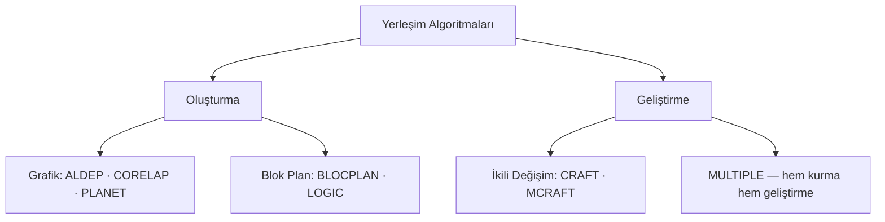

# HF10 - Yerleşim Tasarımı IV

!!! abstract "Bu hafta ne öğreneceğiz?"
    **CORELAP** (ilişki puanından çekirdekten dışa doğru kurma), **ALDEP** (rassal alternatif üretme) ve **MULTIPLE** (çok katlı tesis için uzaklık hesabı) — sıfırdan yerleşim kurma algoritmaları.

---

## Sınav Sorusu ile Başla

!!! example "Gerçek Sınav Sorusu Tarzı"
    *"CORELAP algortimasında 5 bölüm için TCR değerleri hesaplanmıştır. En yüksek TCR'li bölüm merkeze konuyor. Sonraki bölüm nasıl seçilir? Yerleştirme puanı PR nasıl hesaplanır?"*

**Bu soruyu çözmek için şunları bilmen lazım:**

1. $TCR_i = \sum_j v(r_{ij})$ — toplam ilişki derecelendirmesi (bölümün tüm diğerleriyle ilişki toplamı)
2. $PR_k(\text{konum}) = \sum_j c_{kj} \cdot v(r_{kj})$ — aday k'nın belirli bir konuma yerleştirilme puanı
3. En yüksek $PR$ değeri → o konuma yerleştir

---

## Bunu 5 Yaşındaki de Anlar

Önceki haftalarda elimizde bir **yerleşim vardı** ve onu düzeltiyorduk (CRAFT gibi).

Bu hafta soru tersine döndü: **Hiç yerleşim yokken sıfırdan nasıl başlarız?**

Düşün ki boş bir odaya mobilyaları yerleştireceksin:

- **CORELAP** → "En önemli mobilyayı ortaya koy, sonra ona yakın olması gerekeni yanına ekle. Böyle büyüt." *(En iyi tek çözümü bulmaya çalışır)*
- **ALDEP** → "Farklı yerleşimleri dene. Beğendiğini seç." *(Çok alternatif üretir, seçim sana kalır)*
- **MULTIPLE** → "Birden fazla katlı evde, yukarı-aşağı taşıma masrafını da hesaba kat." *(Çok katlı binalara özel)*

---

## 1. Kavramsal Açıklama

| Yaklaşım | Mantık | Girdi türü |
|---|---|---|
| **Komşuluk esaslı** (CORELAP, ALDEP) | "Hangi bölümler yan yana olmalı?" | Nitel yakınlık (A, E, I, O, U, X) |
| **Uzaklık esaslı** (MULTIPLE) | "Akış × uzaklık ne kadar?" | Nicel akış matrisi |



---

## 2. CORELAP

### 🍪 5 Yaşındaki Versiyonu

"Herkesle en çok 'arkadaş' olan bölümü ortaya koy (yüksek TCR = herkes seni istiyor). Sonra ona en yakın olmak isteyen yanına ekle (yüksek PR = bu konumda en fazla arkadaşın var). Böyle büyüt."

**TCR** = "Herkes seni ne kadar istiyor?"
**PR** = "Bu konumda yerleşmiş komşuların seni ne kadar istiyor?"

### 2.1 Toplam Yakınlık Derecesi (TCR)

$$TCR_i = \sum_{j \neq i} v(r_{ij})$$

Sayısallaştırma kuralı (sınav sorusunda hangisi verilmişse onu kullan):

| Kod | Anlam | Ölçek-1 | Ölçek-2 | Ölçek-3 | Ölçek-4 |
|-----|-------|---------|---------|---------|---------|
| A | Kesinlikle gerekli | 4 | 6 | 32 | **125** |
| E | Çok önemli | 3 | 5 | 16 | **25** |
| I | Önemli | 2 | 4 | 8 | **5** |
| O | Az önemli | 1 | 3 | 4 | **1** |
| U | Önemsiz | 0 | 2 | 2 | **0** |
| X | İstenmeyen | −1 | 1 | −32 | **−125** |

!!! warning "Sık hata: Ölçek karıştırmak"
    4 farklı ölçek var. Soruda verilen ölçeği kullan, ezbere değer yazma.

### 2.2 Yerleştirme Puanı (PR)

Nereye konacağına PR karar verir:

$$PR_k(\text{konum}) = \sum_{j \in N(\text{konum})} c_{kj} \cdot v(r_{kj})$$

| Komşuluk tipi | Katsayı $c$ | Ne demek? |
|---|---|---|
| **Tam komşu** (kenar paylaşıyor) | 1 | Kuzey / Doğu / Güney / Batı |
| **Yarım komşu** (köşe teması) | 0,5 | Köşegen |

```
8 | 1 | 2
--+---+--
7 | 0 | 3
--+---+--
6 | 5 | 4
```

Yerleştirme **batı kenarından (7. konum) başlar**, saat yönünün tersine ilerler.

### 2.3 CORELAP Algoritması

1. REL tablosundaki kodları sayıya çevir
2. Her bölümün TCR'ini hesapla
3. **En yüksek TCR** → çekirdek olarak ortaya yerleştir
4. X ilişkili bölümleri **en sona** at
5. Yerleşmişlerle A (yoksa E, yoksa I...) ilişkili bölümü seç
6. Tüm aday konumların PR'ini hesapla → **en yüksek PR**'e yerleştir
7. PR eşitse → **sınır uzunluğu** büyük olanı seç
8. Tüm bölümler yerleşene kadar tekrarla

### 2.4 Tam Çözümlü Örnek

!!! example "10 bölüm — Ölçek: A=10.000, E=1.000, I=100, O=10, U=0, X=−10.000"

TCR tablosu:

| Bölüm | A | E | I | O | U | X | **TCR** |
|-------|---|---|---|---|---|---|---------|
| 1 | 0 | 1 | 0 | 2 | 6 | 0 | 1.020 |
| 2 | 0 | 0 | 6 | 3 | 0 | 0 | 630 |
| 3 | 0 | 1 | 1 | 0 | 7 | 0 | 1.100 |
| 4 | 0 | 0 | 1 | 3 | 5 | 0 | 130 |
| 5 | 1 | 0 | 1 | 0 | 7 | 0 | 10.100 |
| 6 | 0 | 1 | 2 | 1 | 5 | 0 | 1.210 |
| 7 | 0 | 2 | 1 | 0 | 6 | 0 | 2.100 |
| 8 | 1 | 0 | 0 | 1 | 7 | 0 | 10.010 |
| 9 | 0 | 2 | 2 | 0 | 5 | 0 | 2.200 |
| **10** | **2** | **1** | **2** | **0** | **4** | **0** | **21.200** |

Örnek: $TCR_{10} = 2(10.000) + 1(1.000) + 2(100) = 21.200$

Seçim sırası: **10 → 5 → 8 → 9 → 7 → 6 → 2 → 3 → 1 → 4**

PR örneği (Bölüm 8 yerleştirilirken; 8-10=A, 8-5=U):

| Konum | Hesap | PR |
|-------|-------|---|
| Yalnız 10'a tam komşu | $1 \times 10.000$ | 10.000 |
| 10'a yarım + 5'e tam | $0{,}5 \times 10.000 + 0$ | 5.000 |
| 5'e tam + 10'a yarım | $0 + 0{,}5 \times 10.000$ | 5.000 |

→ **En yüksek PR = 10.000** → 8, yalnız 10'a tam komşu olan konuma atanır.

---

## 3. ALDEP

### 🍪 5 Yaşındaki Versiyonu

"CORELAP 'en iyiyi' bulmaya çalışır. ALDEP ise 'işte 20 farklı oda düzeni, hangisini beğenirsen' der. Bazen rastgele denemeler iyi sonuç verir!"

### CORELAP vs ALDEP farkı

| | **CORELAP** | **ALDEP** |
|---|---|---|
| Amaç | En iyi tek yerleşim | Çok sayıda alternatif |
| Seçim | TCR'ye göre belirli | **Rassal** |
| Sonuç | Deterministic | Her çalıştırmada farklı |

### 3.1 ALDEP Algoritması

**A) Bölüm Seçimi:**

1. İlk bölüm **rassal** seçilir
2. O bölümle **eşik ilişki düzeyi** (örn. E veya üstü) olan bölüm seçilir
3. Böyle yoksa yine **rassal** seçilir
4. Tüm bölümler seçilene kadar devam → **Yerleşim Vektörü**

**B) Yerleştirme:**

5. Sol üst köşeden başla
6. **Dikey süpürme** paterni (kullanıcı belirlenen genişlikte) ile doldur
7. Her bölüm için gereken kare sayısı dolana kadar devam

**C) Değerlendirme:**

8. Yan yana gelen çiftlerin ilişki değerlerini topla → **Toplam Komşuluk Puanı**
9. Minimum eşik sağlanıyorsa kaydet, tekrarla

### 3.2 Tam Çözümlü Örnek

!!! example "Tesis 10×18, süpürme genişliği 2, eşik E. Ölçek: A=64, E=16, I=4, O=1, U=0, X=−1.024"

**Çözüm A — Bölüm seçimi:**

| Adım | Seçilen | Sebep |
|------|---------|-------|
| 1 | 4 | Rassal |
| 2 | 2 | 4 ile E |
| 3 | 1 | 2 ile E |
| 4 | 6 | Rassal |
| 5 | 5 | 6 ile A |
| 6 | 7 | Rassal |
| 7 | 3 | Son kalan |

→ **Vektör: 4-2-1-6-5-7-3**, Toplam Komşuluk Puanı = **120**

**Çözüm B — Alternatif vektör: 2-1-4-5-6-7-3**

| Komşu çift | İlişki | Değer |
|------------|--------|-------|
| 2-1 | E | 16 |
| 1-4 | I | 4 |
| 4-5 | I | 4 |
| 5-6 | A | 64 |
| 6-7 | E | 16 |
| 7-3 | U | 0 |
| **Toplam** | | **104** |

!!! success "Karar"
    120 > 104 → **A çözümü** daha iyi. Ama nihai karar planlamacıya bağlıdır.

!!! tip "ALDEP'te neden çok alternatif üretilir?"
    Rassallık yüzünden tek çalıştırma yanıltıcı olabilir. Birçok vektör üret, komşuluk puanlarını karşılaştır, en yükseği seç.

---

## 4. MULTIPLE

### 🍪 5 Yaşındaki Versiyonu

"Çok katlı bir binalarda yaşıyorsun. Mutfak 3. katta, yemek odası 1. katta — her öğün merdiven inip çıkıyorsun. Bu çok pahalı! MULTIPLE bu 'yukarı-aşağı maliyeti' de hesaba katarak katlar arası yerleşimi optimize eder."

### 4.1 Çok katlı uzaklık formülü

$$d_{ij} = d^{\text{yatay}}_{ij} + \alpha \cdot |z_i - z_j|$$

| Sembol | Açıklama |
|--------|----------|
| $d^{\text{yatay}}$ | Yatay (kat içi) uzaklık |
| $z_i$ | $i$ bölümünün kat numarası |
| $\alpha$ | Bir kat değişiminin kaç birim yatay taşımaya denk geldiği |

$\alpha$ büyükse → yukarı-aşağı taşıma çok pahalı → bölümleri aynı kata koymaya çalış.

### 4.2 Alan Doldurma Eğrisi (SFC)

MULTIPLE, yerleşimi yeniden kurmak için bir **SFC (Space Filling Curve)** kullanır:

1. Tüm birim kareler bir zincirle bağlanır
2. Her kare **kesinlikle bir kez** ziyaret edilir
3. Her adım yalnız **yatay veya dikey** (çapraz yok!)
4. Bölümler **vektör sırasına** göre SFC boyunca doldurulur

### 4.3 MULTIPLE Algoritması

1. Boş binayı dolduracak bir **SFC** seç
2. Başlangıç **yerleşim vektörü** belirle
3. Vektör sırasına göre SFC üzerinde yerleştir
4. Maliyet hesapla (çok katlıda $\alpha$ katsayısı dahil)
5. **İkili değişim** uygula (komşu olmaları gerekmez!)
6. Maliyet azaldıysa kabul et, iterasyonu sürdür
7. Gerekirse bölüm sınırlarını düzgünleştir (**masaj/smoothing**)

### 4.4 Tam Çözümlü Örnek

!!! example "Vektör 1-2-3-4-5-6"
    Bölüm alanları (m²): 1→16, 2→8, 3→4, 4→16, 5→8, 6→12.

    Bölümler SFC boyunca sırayla yerleştirilir. Sonra **1 ve 5 değiştirilir** → yeni vektör **5-2-3-4-1-6**.

    Farklı vektörlerle maliyet karşılaştırması:

    | Vektör | Maliyet Z |
    |--------|-----------|
    | D-B-H-C-F-E | **54.200** (en iyi) |
    | D-E-F-H-B-C | 54.540 |
    | D-E-F-B-C-H | 54.900 |

!!! success "Sonuç"
    MULTIPLE her iterasyonda büyük bir çözüm kümesi taradığı için CRAFT'tan çok daha düşük maliyet bulabilir.

---

## 5. Üç Algoritmanın Karşılaştırması

| Özellik | **CORELAP** | **ALDEP** | **MULTIPLE** |
|---|---|---|---|
| Tip | Oluşturma | Oluşturma | Oluşturma + Geliştirme |
| Esas | Komşuluk | Komşuluk | Uzaklık |
| Girdi | REL tablosu | REL tablosu | Akış matrisi |
| Seçim | TCR (belirli) | Rassal + eşik | Yerleşim vektörü |
| Yerleştirme | Çekirdekten dışa (PR) | Dikey süpürme | SFC üzerinde |
| Çok kat | Hayır | Kısmen | **Evet (asıl gücü)** |
| Alternatif | Tek "en iyi" | **Çok sayıda** | Çok (SFC ile) |
| Komşu olmayan değişim | — | — | **Evet** |

### Hangi algoritmayı seç?

- Nitel yakınlık + tek kat + en iyi tek çözüm → **CORELAP**
- Çok sayıda alternatif + hızlı taslak → **ALDEP**
- Çok katlı yapı + düşey taşıma maliyeti + komşu olmayan değişim → **MULTIPLE**
- Düzgün dikdörtgen bloklar → **BLOCPLAN / LOGIC**
- Mevcut yerleşim var, iyileştir → **CRAFT / MCRAFT** (HF09)

---

## 6. Sık Yapılan Hatalar

!!! warning "Dikkat"
    - **Komşuluk katsayısını unutmak:** Yarım (köşe) komşuluk **0,5** ile çarpılır; 1 almak PR'yi şişirir.
    - **X ilişkisini atlamak:** CORELAP'ta X'li bölüm **en sona** atılır, göz ardı edilmez.
    - **Yanlış ölçek kullanmak:** Soruda verilen ölçeği kullan.
    - **TCR'de kendini saymak:** $j \neq i$; bölümün kendisiyle ilişkisi yoktur.
    - **ALDEP'te tek çalıştırmayla yetinmek:** Birden fazla alternatif üret.
    - **MULTIPLE'da çapraz hareket:** SFC yalnız yatay/dikey ilerler.
    - **Optimallik yanılgısı:** Hiçbiri optimal değil — hepsi **sezgiseldir**.

---

## 7. Pratik Sorular

!!! question "Soru 1 — TCR hesabı"
    Bir bölümün diğer 5 bölümle ilişkileri: A, E, U, O, X. Ölçek **A=125, E=25, I=5, O=1, U=0, X=−125**. TCR'si kaçtır?

??? success "Cevap"
    $TCR = 125 + 25 + 0 + 1 + (-125) = \mathbf{26}$

    X ilişkisinin negatif değerini eklemeyi unutma.

!!! question "Soru 2 — PR hesabı"
    Bölüm K yerleştirilecek. Aday konumda: A'ya **tam komşu** (A ile ilişki=125), B'ye **yarım komşu** (B ile ilişki=25). PR nedir?

??? success "Cevap"
    $PR = 1 \times 125 + 0{,}5 \times 25 = 125 + 12{,}5 = \mathbf{137{,}5}$

!!! question "Soru 3 — ALDEP komşuluk puanı"
    Vektör 3-1-2-4 üretildi. Komşu çiftler: 3-1=I, 1-2=A, 2-4=O. Ölçek: A=64, E=16, I=4, O=1. Toplam Komşuluk Puanı?

??? success "Cevap"
    $4 + 64 + 1 = \mathbf{69}$. Yalnız yan yana çiftler sayılır; uzak çiftler (3-4 gibi) hesaba katılmaz.

!!! question "Soru 4 — MULTIPLE düşey uzaklık"
    $z_i=1$, $z_j=4$, yatay uzaklık 6 birim, $\alpha=10$. Eşdeğer uzaklık?

??? success "Cevap"
    $d_{ij} = 6 + 10 \times |1-4| = 6 + 30 = \mathbf{36}$ birim.

!!! question "Soru 5 — Algoritma seçimi"
    6 katlı bir hastanede asansör maliyeti yüksek, bölümler arası akış biliniyor, komşu olmayan birimleri de takas etmek istiyoruz. Hangi algoritma?

??? success "Cevap"
    **MULTIPLE.** Çok katlı yapı + uzaklık esaslı akış + komşu olmayan değişim → MULTIPLE'ın asıl güçlü olduğu alan.

---

Önceki: [HF09](hf09.md) · Sonraki: [HF11](hf11.md)
