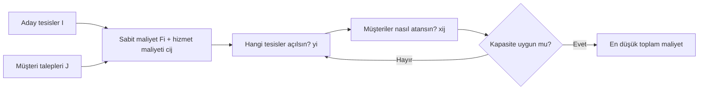

# HF12 - Tesis Konumu II

!!! abstract "\1"
> **Kesikli (ayrık) tesis konum probleminde** aday yerler önceden bellidir; karar, hangi tesislerin açılacağı ($y_i$) ve her müşterinin hangi açık tesise atanacağıdır ($x_{ij}$). Bunu sürekli konum-atama modelinden (HF11) ayıran şey, yeni bir koordinat üretilmemesi; yalnızca **sonlu bir aday listesinden seçim** yapılmasıdır. Amaç, sabit açma maliyetleri ile değişken hizmet/taşıma maliyetlerinin **toplamını** en aza indirmektir. Tesis sayısı arttıkça taşıma azalır ama sabit maliyet birikir; bu yüzden konum ve tesis sayısı **birlikte** çözülmelidir.

## Neden sürekli model yetmez?

Sürekli minisum/minimax modelinde (HF11) yeni tesis düzlemde **herhangi bir noktaya** kurulabilir ve optimum konum ağırlıklı medyanla (Manhattan) ya da Weiszfeld ile (Öklid) bulunur. Ancak gerçek problemlerde:

- Tesis yalnızca **belirli arsalarda/bölgelerde** açılabilir (imar, ulaşım, mülkiyet, mevcut bina).
- Her adayın farklı bir **sabit açma/kira maliyeti** vardır; "boşlukta optimal nokta" bu maliyetleri yansıtmaz.
- Her aday-müşteri çifti için hizmet maliyeti $c_{ij}$ doğrudan **tablo olarak** verilebilir; bu maliyet sadece uzaklığın değil, yol, gümrük, tarife gibi etkenlerin de fonksiyonu olabilir.

Bu nedenle problem **karma tamsayılı (0-1) bir optimizasyon** problemine dönüşür: süreklilikten ayrık seçime geçilir.

## Karar değişkenleri

$$
y_i=\begin{cases}1,&i\text{ tesisi açılırsa}\\0,&\text{aksi halde}\end{cases}
$$

$$
x_{ij}=\begin{cases}1,&j\text{ müşterisi }i\text{ tesisine atanırsa}\\0,&\text{aksi halde}\end{cases}
$$

| Gösterim | Anlam | Birim |
|---|---|---|
| $I$ | Aday tesisler kümesi | — |
| $J$ | Müşteriler kümesi | — |
| $F_i$ ($f_i$) | Aday $i$'yi açmanın sabit dönem maliyeti | TL/dönem |
| $c_{ij}$ | Müşteri $j$'yi tesis $i$'den karşılama maliyeti | TL/dönem |
| $q_j$ | Müşteri $j$'nin talebi | birim |
| $K_i$ | Tesis $i$'nin kapasitesi | birim |

## Kapasitesiz tesis konum modeli (UFLP)

**Amaç fonksiyonu** — toplam sabit + değişken maliyet:

$$
\min \; \sum_{i\in I} F_i\, y_i+\sum_{i\in I}\sum_{j\in J} c_{ij}\,x_{ij}
$$

**Kısıt 1 — her müşteri tam olarak bir tesise atanır:**

$$
\sum_{i\in I} x_{ij}=1 \qquad \forall j\in J
$$

**Kısıt 2 — atama yalnız açık tesise yapılabilir (bağlama kısıtı):**

$$
x_{ij}\le y_i \qquad \forall i\in I,\;j\in J
$$

**İkili (0-1) tanım kümeleri:**

$$
x_{ij},\,y_i\in\{0,1\}
$$

!!! warning "\1"
> 1. **Kısıt 2 ($x_{ij}\le y_i$) unutulursa** model, sabit maliyet ödemeden **kapalı bir tesisten** müşteriye hizmet atayabilir; çözüm fiziksel olarak imkânsız ve maliyet yapay olarak düşük çıkar. Her atama değişkenini ait olduğu açma değişkenine bağlayın.
> 2. **İkili koşullar ($\in\{0,1\}$) yazılmazsa** model kesirli açma/atama (ör. $y_i=0{,}5$) üretebilir; bu da anlamsızdır. Modeli daima ikili tanım kümesiyle kapatın.
> 3. **Kısıt 1'i $\le 1$ yazmak** bazı müşterileri hizmetsiz bırakabilir; soru "her müşteri" diyorsa eşitlik ($=1$) şarttır.

### Kapasiteli uzantı (CFLP)

Talep ve kapasite varsa şu kısıt eklenir:

$$
\sum_{j\in J} q_j\,x_{ij}\le K_i\,y_i \qquad \forall i\in I
$$

Sağ taraftaki $y_i$, kapalı tesisin kapasitesini ($K_i\cdot 0=0$) sıfırlayarak hem kapasite sınırını hem de bağlama kısıtını aynı anda dayatır.

## Enümerasyon (sayılama) yöntemi — adım adım

Küçük problemlerde (az sayıda aday tesis) optimum, **tüm açık tesis kümelerini** tek tek deneyerek bulunur. Kapasite yoksa, bir açık küme $S\subseteq I$ sabitlendiğinde her müşteri **en ucuz açık tesise** gider:

$$
TC(S)=\sum_{i\in S} F_i+\sum_{j\in J}\min_{i\in S} c_{ij}
$$

**Algoritma:**

1. Boş olmayan bütün $S\subseteq I$ alt kümelerini listele. ($n$ aday için $2^n-1$ küme.)
2. Her $S$ için her müşteri $j$'ye, $S$ içindeki **en küçük** $c_{ij}$ değerini seç ($\min_{i\in S}c_{ij}$) ve bu hizmet maliyetlerini topla.
3. $S$'teki tesislerin sabit maliyetlerini ($\sum_{i\in S}F_i$) ekle.
4. Toplamı $TC(S)$ olarak kaydet.
5. Tüm $S$'ler içinden **en küçük** $TC(S)$'yi veren kümeyi seç → optimum açma ve atama.
6. (İsteğe bağlı sabit tesis sayısı $p$: yalnız $|S|=p$ olan kümeleri değerlendir → **p-medyan** çözümü.)

!!! tip "\1"
> Taşıma/hizmet maliyeti **negatif olamaz**. Bir aday sayısı için yalnız sabit maliyet bile mevcut en iyi toplamdan büyükse, o seçenek detaylı incelenmeden elenir. Kahve örneğinde $n\ge 2$ için yalnız sabit maliyet $5.000n\ge 10.000 > 6.820$ olduğundan iki+ dükkân atamasına hiç bakılmaz.

## Net tasarrufla aday ekleme

Mevcut açık küme $S$ iken müşterinin güncel maliyeti $c_j(S)=\min_{i\in S}c_{ij}$'dir. Kapalı bir $k$ tesisini eklemenin değeri:

**Brüt tasarruf** (yalnız fayda sağlayan müşteriler sayılır):

$$
GS(k\mid S)=\sum_{j\in J}\max\{0,\;c_j(S)-c_{kj}\}
$$

**Net tasarruf** (açma maliyeti düşülür):

$$
NS(k\mid S)=GS(k\mid S)-F_k
$$

| Sonuç | Yorum |
|---|---|
| $NS>0$ | Tesisi açmak toplam maliyeti **azaltır** → aç. |
| $NS=0$ | Maliyetçe eşdeğer; açmak da açmamak da aynı. |
| $NS<0$ | **Açma ekonomik değil** → kapalı tut. |

!!! warning "\1"
> - $GS$ hesaplarken **negatif farkları toplamayın**: yeni tesis bir müşteri için daha pahalıysa, o müşteri ona atanmak *zorunda değildir* (eski tesisinde kalır). Bu yüzden $\max\{0,\cdot\}$ kullanılır.
> - Net tasarruf hesabı yalnız **mevcut tesisler açık kalıp tek bir yeni aday eklenecekse** doğrudan geçerlidir. Tüm açma/kapama kararları serbestse tam enümerasyon veya MILP gerekir.

## Model ailesi ve karşılaştırma

| Model | Karar | Amaç |
|---|---|---|
| Tesis atama (konum-atama) | Tesis sayısı + kümeler + serbest koordinat | Toplam ağırlıklı uzaklığı + sabit maliyeti azalt |
| Açma-atama (UFLP/kesikli) | Aday açma $y_i$ + atama $x_{ij}$ | Sabit + hizmet maliyetini azalt |
| $p$-medyan | Tam $p$ tesis aç, en yakını seç | **Toplam (ortalama)** ağırlıklı uzaklığı azalt |
| $p$-merkez | Tam $p$ tesis aç, en yakını seç | **Maksimum (en kötü)** uzaklığı azalt |

### Kesikli vs sürekli model

| Boyut | Sürekli konum-atama (HF11) | Kesikli tesis konumu (HF12) |
|---|---|---|
| Aday konum | Düzlemde **serbest** (sonsuz nokta) | Önceden belli **sonlu liste** |
| Yeni koordinat üretimi | Var (ağırlıklı medyan / Weiszfeld) | **Yok** — adaydan seçilir |
| Karar değişkeni | Koordinat $(x_k,y_k)$ + atama | İkili $y_i$ (aç/açma) + $x_{ij}$ (atama) |
| Maliyet girdisi | Ağırlık × uzaklık formülü | Doğrudan **maliyet tablosu** $c_{ij}$, $F_i$ |
| Sabit maliyet | $g(n)$ tesis sayısına bağlı | Aday bazında $F_i$ farklı |
| Çözüm tekniği | Her kümede minisum + enümerasyon | Alt küme enümerasyonu / MILP |
| Matematiksel sınıf | Sürekli optimizasyon | Karma tamsayılı (0-1) program |

### p-medyan vs p-merkez vs açma-atama

| Özellik | $p$-medyan | $p$-merkez | Açma-atama (UFLP) |
|---|---|---|---|
| Tesis sayısı | Tam $p$ (sabit, verilir) | Tam $p$ (sabit, verilir) | **Serbest** — model karar verir |
| Amaç | $\min$ toplam ağırlıklı uzaklık | $\min$ maksimum uzaklık | $\min$ sabit + hizmet maliyeti |
| Tipik kullanım | Depo/ortalama maliyet (lojistik) | Acil servis, itfaiye, ambulans (en kötü süre) | Açma maliyeti önemliyse (depo/fabrika) |
| Sabit maliyet | Modelde yok (sayı sabit) | Modelde yok (sayı sabit) | **Açıkça** $F_i$ ile yer alır |
| Adillik | Ortalamayı iyileştirir | **En kötü durumu** korur | Maliyet odaklı |

!!! info "\1"
> "Hiçbir müşteri 10 dakikadan uzakta kalmasın" → **p-merkez** (minimax). "Ortalama teslimat maliyeti en düşük olsun" → **p-medyan** (minisum). "Kaç tesis açmalıyız + nereye?" (açma maliyeti dahil) → **açma-atama**.

## Sınav çözüm sırası

1. Kümeleri ($I,J$), parametreleri ($F_i,c_{ij},q_j,K_i$) ve birimleri tanımla.
2. $x_{ij}$ ve $y_i$ karar değişkenlerini yaz.
3. Sabit ($\sum F_iy_i$) ve değişken ($\sum\sum c_{ij}x_{ij}$) maliyetleri amaç fonksiyonunda ayır.
4. Her talebin **tam bir** tesise atanmasını sağla ($\sum_i x_{ij}=1$).
5. Atamanın yalnız **açık** tesise yapılmasını bağla ($x_{ij}\le y_i$).
6. Varsa kapasite ($\sum_j q_jx_{ij}\le K_iy_i$) ve tesis sayısı ($\sum_i y_i=p$) kısıtını ekle.
7. İkili tanım kümeleriyle ($x_{ij},y_i\in\{0,1\}$) modeli kapat.

---

## Çözümlü Örnek 1 — Kahve dükkânı (sabit maliyet etkisi)

!!! example "\1"
> Bir ofis binasına kahve dükkânı yerleştirilecek. Ofisler $P_1(20,70)$, $P_2(30,40)$, $P_3(90,30)$, $P_4(50,100)$. Günlük ziyaretçi: 50, 30, 70, 60 kişi. Ziyaretçilerin %70'i kahve dükkânına uğrar. Birim uzaklık başına 0,25 \$ gelir kaybı. $n$ dükkânın günlük işletme maliyeti $5.000n$ \$.

Ağırlıklar = ziyaretçi × %70: $w=(35,\,21,\,49,\,42)$.

**$n=1$:** Tek tesis minisum (Manhattan, $x$ ve $y$ ayrı medyan). Toplam ağırlık 147, yarısı 73,5. Medyan konum $(X^*,Y^*)=(50,70)$.

$$
TC(1)=0{,}25\big[35(30)+21(50)+49(80)+42(30)\big]+5.000\cdot 1
$$
$$
=0{,}25\big[1050+1050+3920+1260\big]+5.000=0{,}25(7280)+5.000=1.820+5.000=6.820
$$

**$n\ge 2$:** Yalnız sabit maliyet $5.000\cdot 2=10.000$, bu zaten tek dükkânın **toplam** maliyeti olan 6.820'den büyük.

$$
TC(n\ge 2)=0{,}25[\text{Seyahat}]+5.000n\ \ge\ 10.000 > 6.820
$$

> [!success] Karar
> Tek kahve dükkânı yeterlidir (konum $(50,70)$, $TC=6.820$ \$). Sabit maliyet, taşıma tasarrufunu geçtiği için ikinci dükkân detaylı incelenmeden elenir.

## Çözümlü Örnek 2 — Beş depo, açma-atama ve net tasarruf

!!! example "\1"
> Beş müşteri ve A-E arasında beş aday depo. Hücreler **yıllık hizmet maliyetini**, son satır **yıllık sabit açma maliyetini** gösterir.

| Müşteri | A | B | C | D | E |
|---:|---:|---:|---:|---:|---:|
| 1 | 100 | 500 | 1.800 | 1.300 | 1.700 |
| 2 | 1.500 | 200 | 2.600 | 1.400 | 1.800 |
| 3 | 2.500 | 1.200 | 1.700 | 300 | 1.900 |
| 4 | 2.800 | 1.800 | 700 | 800 | 800 |
| 5 | 10.000 | 12.000 | 800 | 8.000 | 900 |
| **Sabit maliyet** | **3.000** | **2.000** | **2.000** | **3.000** | **4.000** |

**(a) Yalnız 1 depo açılacaksa** — her aday için sütun hizmet toplamı + sabit:

| Tek depo | Hizmet toplamı | Sabit | Toplam $TC$ |
|---:|---:|---:|---:|
| A | 16.900 | 3.000 | 19.900 |
| B | 15.700 | 2.000 | 17.700 |
| C | 7.600 | 2.000 | **9.600** |
| D | 11.800 | 3.000 | 14.800 |
| E | 7.100 | 4.000 | 11.100 |

→ **C seçilir**, tüm müşteriler C'ye atanır. $TC=9.600$.

**(b) B ve C açıkken atama** — her müşteri için $\min(c_{Bj},c_{Cj})$:

| Müşteri | B | C | Seçim | Maliyet |
|---:|---:|---:|---:|---:|
| 1 | 500 | 1.800 | B | 500 |
| 2 | 200 | 2.600 | B | 200 |
| 3 | 1.200 | 1.700 | B | 1.200 |
| 4 | 1.800 | 700 | C | 700 |
| 5 | 12.000 | 800 | C | 800 |

Hizmet toplamı $= 500+200+1.200+700+800 = 3.400$; sabit $=2.000+2.000=4.000$.

$$
TC(\{B,C\})=3.400+4.000=7.400
$$

**(c) Üçüncü depo gerekli mi? — Net tasarruf:** Mevcut maliyetler $c_j(\{B,C\})=(500,\,200,\,1.200,\,700,\,800)$.

$$NS(A\mid\{B,C\})=(500-100)-3.000=400-3.000=-2.600$$
$$NS(D\mid\{B,C\})=(1.200-300)-3.000=900-3.000=-2.100$$
$$NS(E\mid\{B,C\})=0-4.000=-4.000$$

> [!success] Karar
> Üç adayın da net tasarrufu **negatif**. İlave depo açılmaz; toplam maliyet **7.400** olarak kalır. (Slayt 23, dördüncü depo D için aynı mantıkla $1.200-300-3.000=-2.100$ bulur; mevcut atamalar değişmediğinden sonuç sabittir.)

---

## Pratik sorular

### Soru 1 (Temel) — Modeli yazma

> [!question]
> Üç aday tesis ve dört müşteri için **kapasitesiz açma-atama** modelini sembolik olarak yazın. Karar değişkenlerinin tanım kümelerini unutmayın.

> [!answer]- Çözüm
> $$\min \sum_{i=1}^{3}F_i y_i+\sum_{i=1}^{3}\sum_{j=1}^{4}c_{ij}x_{ij}$$
> $$\sum_{i=1}^{3}x_{ij}=1\qquad j=1,\ldots,4$$
> $$x_{ij}\le y_i\qquad i=1,2,3;\ j=1,\ldots,4$$
> $$x_{ij},y_i\in\{0,1\}$$
> İkinci kısıt olmazsa kapalı tesise atama; son satır olmazsa kesirli çözüm çıkar.

### Soru 2 (Enümerasyon) — Optimum açık kümeyi bul

> [!question]
> Üç aday (A, B, C) ve dört müşteri için hizmet ve sabit maliyetler aşağıda. Kapasite yok. Tüm açık tesis kümelerini karşılaştırıp optimumu bulun.
>
> | Müşteri | A | B | C |
> |---:|---:|---:|---:|
> | 1 | 2 | 6 | 9 |
> | 2 | 8 | 3 | 7 |
> | 3 | 6 | 5 | 2 |
> | 4 | 9 | 8 | 1 |
> | **Sabit** | **5** | **4** | **6** |
>
> $TC(S)=\sum_{i\in S}F_i+\sum_j\min_{i\in S}c_{ij}$ kullanın.

> [!answer]- Çözüm
> | Açık küme | En ucuz hizmet | Sabit | $TC$ |
> |---:|---:|---:|---:|
> | $\{A\}$ | $2{+}8{+}6{+}9=25$ | 5 | 30 |
> | $\{B\}$ | $6{+}3{+}5{+}8=22$ | 4 | 26 |
> | $\{C\}$ | $9{+}7{+}2{+}1=19$ | 6 | 25 |
> | $\{A,B\}$ | $2{+}3{+}5{+}8=18$ | 9 | 27 |
> | $\{A,C\}$ | $2{+}7{+}2{+}1=12$ | 11 | 23 |
> | $\{B,C\}$ | $6{+}3{+}2{+}1=12$ | 10 | **22** |
> | $\{A,B,C\}$ | $2{+}3{+}2{+}1=8$ | 15 | 23 |
>
> Optimum **$\{B,C\}$**: müşteri 1-2 → B, müşteri 3-4 → C. $TC_{\min}=22$.

### Soru 3 (Net tasarruf) — Hangi aday önce eklenmeli?

> [!question]
> Soru 2'deki tabloda yalnız **B** açıktır. A ve C adaylarının net tasarruflarını ayrı ayrı hesaplayın. Hangi aday eklenmelidir?

> [!answer]- Çözüm
> B'nin müşteri maliyetleri $(6,3,5,8)$.
>
> **A**: yalnız müşteri 1'de $6-2=4$ tasarruf (diğerleri A'da daha pahalı → 0):
> $$NS(A\mid\{B\})=4-5=-1$$
> **C**: müşteri 3'te $5-2=3$, müşteri 4'te $8-1=7$ tasarruf:
> $$NS(C\mid\{B\})=(3+7)-6=10-6=+4$$
> $NS(C)>0$ olduğundan **C eklenir**. Toplam maliyet $26 \to 22$'ye düşer (Soru 2 ile tutarlı).

### Soru 4 (Yöntem seçimi) — Hangi model?

> [!question]
> Aşağıdaki üç durum için doğru modeli belirleyin.
> 1. Aday yerler A-D verilmiş; her birinin kirası ve müşteri hizmet tablosu mevcut.
> 2. Yeni iki tesis düzlemde herhangi bir yere kurulabilir; müşteri kümeleri bulunacak.
> 3. Tam 4 ambulans noktası seçilecek; hiçbir mahalle 8 dakikadan uzakta kalmamalı.

> [!answer]- Çözüm
> 1. **Kesikli açma-atama (UFLP)** — aday baştan belli, sabit maliyet var.
> 2. **Sürekli konum-atama** — koordinat serbest; her kümede ağırlıklı medyan (minisum).
> 3. **p-merkez (minimax)** — sabit sayı ($p=4$) + en kötü uzaklığı (en uzun süreyi) minimize et.

### Soru 5 (Kapasiteli model) — Kısıt yazma

> [!question]
> Soru 1'deki kapasitesiz modele, her tesisin kapasitesi $K_i$ ve her müşterinin talebi $q_j$ olduğunda eklenecek kısıtı yazın. $y_i$'nin sağ tarafta olmasının anlamı nedir?

> [!answer]- Çözüm
> $$\sum_{j=1}^{4} q_j\,x_{ij}\le K_i\,y_i\qquad i=1,2,3$$
> $y_i$ sağ tarafta: tesis **kapalıysa** ($y_i=0$) sağ taraf $0$ olur, dolayısıyla o tesise hiçbir atama yapılamaz ($\sum_j q_jx_{ij}\le 0$). Böylece kapasite kısıtı aynı zamanda **bağlama** görevi de görür; ayrıca $x_{ij}\le y_i$ yazmaya gerek kalmaz (ama yazmak da yanlış değildir).

---

## Hata kartı

| Yanlış adım | Neden yanlış? | Kontrol |
|---|---|---|
| $x_{ij}\le y_i$ bağını yazmadım | Kapalı tesise atama yapılabilir | Her $x_{ij}$'yi $y_i$'ye bağla |
| Kısıt 1'i $\le 1$ yazdım | Müşteri hizmetsiz kalabilir | "Her müşteri" → eşitlik $=1$ |
| İkili koşulu unuttum | Kesirli açma/atama çıkar | Modeli $\in\{0,1\}$ ile bitir |
| Yalnız hizmet maliyetini kıyasladım | Sabit açma maliyetini yok saydım | Hizmet + sabit sütunlarını ayır |
| Net tasarrufta negatif farkları topladım | Pahalı tesise müşteri atanmak zorunda değil | $\max\{0,c_j(S)-c_{kj}\}$ kullan |
| Aday verilmişken medyan hesapladım | Kesikli modelde yeni koordinat üretilmez | "Konum serbest mi, adaylı mı?" sor |
| $NS<0$ iken tesis açtım | Açma toplam maliyeti artırır | $NS<0$ → açma |

## Kaynaklar

- Öğrenme paketi: \1
- Öğrenme paketi: \1
- \1
- \1
- \1

Önceki: \1 · Sonraki: \1
